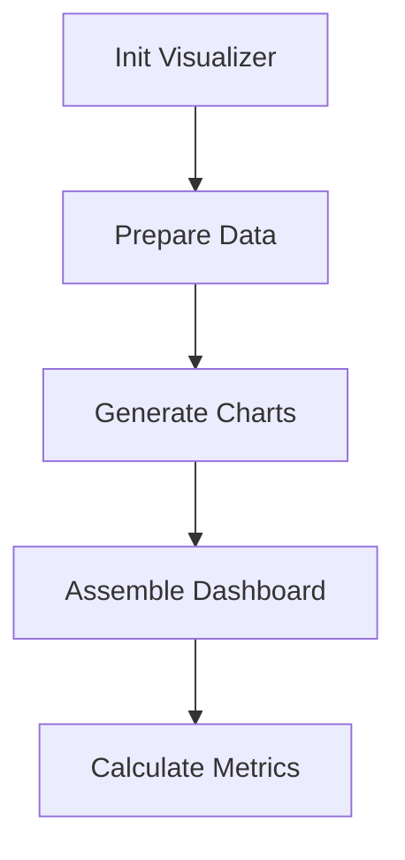
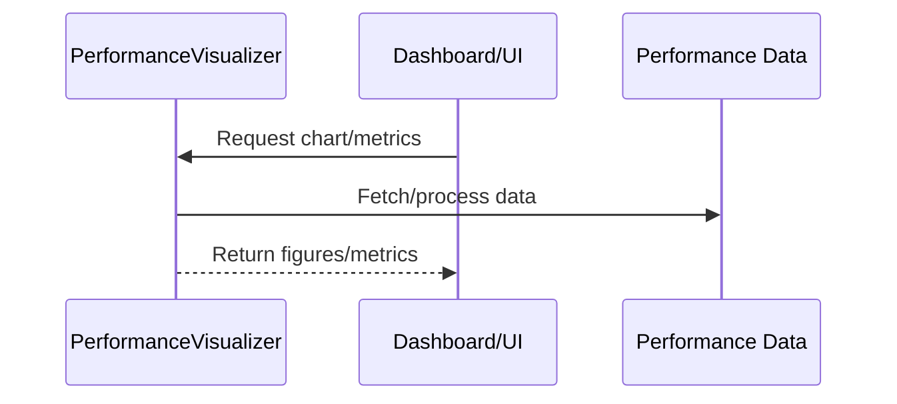
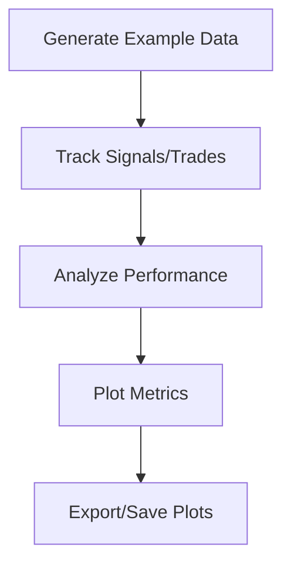
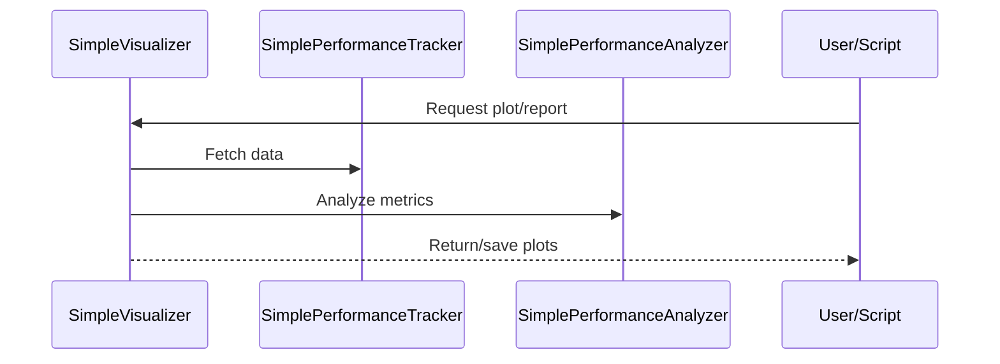

# cyberdelta/visualization/ — Per-Folder Analysis

---

## performance_visualizer.py
**Purpose:**
Provides advanced tools for visualizing and analyzing strategy performance data, supporting both real-time dashboards and historical analysis. Includes chart generation (returns, drawdown, trades, funding rates), dashboard assembly, and performance metrics calculation.

**Summary:**
- Inputs: Performance data (returns, trades, funding rates), config.
- Outputs: Interactive charts, dashboards, computed metrics.
- Dependencies: Pandas, Plotly, Numpy, Dataclasses.
- Critical Path: Enables robust, interactive performance monitoring and analysis.
- **Note:** All financial fields use `Decimal` for accuracy, in compliance with project rules.

---

## simplified_visualizer.py
**Purpose:**
Provides lightweight, dependency-minimized visualization tools for performance data, using Matplotlib. Suitable for environments without web frameworks or for quick, script-based analysis.

**Summary:**
- Inputs: Performance data, tracker instance, config.
- Outputs: Static plots, performance summaries, saved images.
- Dependencies: Matplotlib, Pandas, Numpy, Decimal.
- Critical Path: Enables quick, scriptable performance analysis and reporting.
- **Note:** All financial fields use `Decimal` for accuracy, in compliance with project rules. 