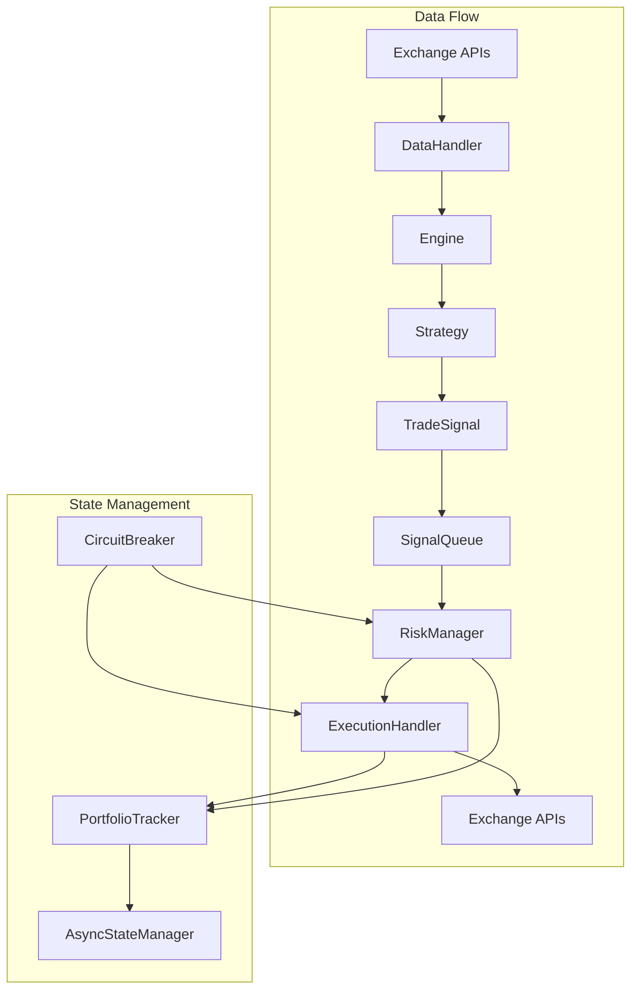
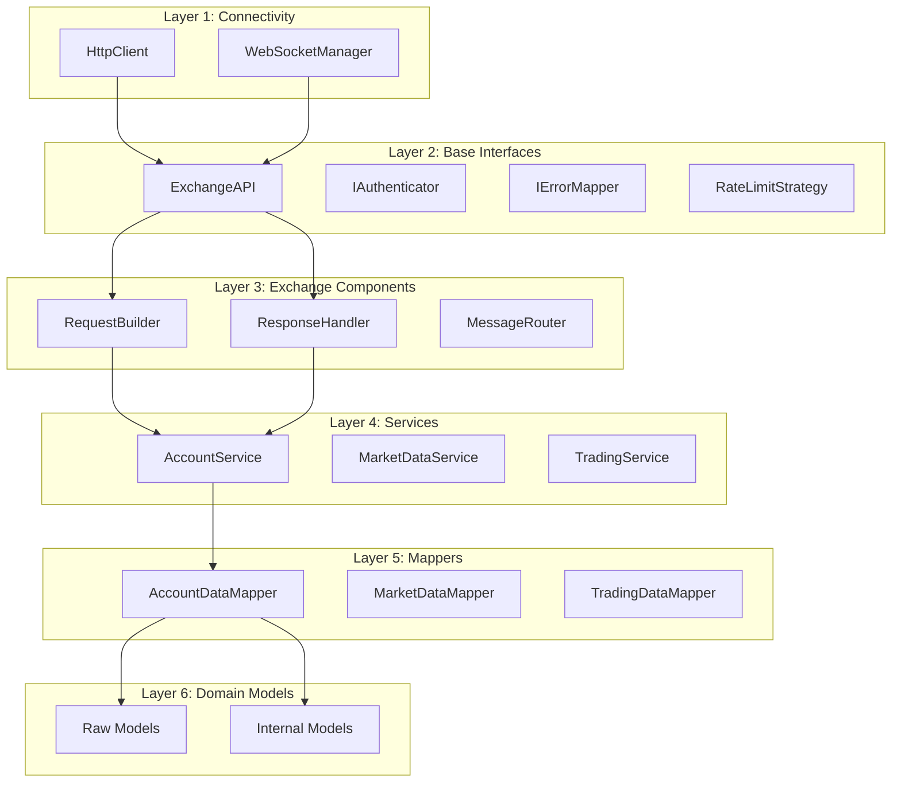

# CyberDeltaEngine Architecture Analysis
**Date:** 2025-07-01
**Version:** Post-June 2025 Refactoring

## Executive Summary

CyberDeltaEngine has undergone significant architectural improvements since the April 2025 reports. The system now features a sophisticated 6-layer API architecture, comprehensive type safety with Pydantic validation, and a well-structured modular design. This analysis examines the current architecture and identifies key changes from previous versions.

## 1. Main Module Structure

### Core Modules (`cyberdelta/`)

```
cyberdelta/
├── apis/                  # Exchange API integrations (6-layer architecture)
├── config/               # Configuration and secrets management
├── core/                 # Core trading engine components
├── enums/                # System-wide enumerations
├── exceptions/           # Custom exception hierarchy
├── logging/              # Structured logging utilities
├── monitoring/           # Performance tracking and metrics
├── strategies/           # Trading strategy implementations
├── utils/                # Common utilities and helpers
└── validation/           # Safety systems and validators
```

## 2. Key Components and Relationships

### 2.1 Core Trading Engine Flow



### 2.2 Component Responsibilities

| Component | Primary Responsibility | Key Changes from April 2025 |
|-----------|----------------------|---------------------------|
| **Engine** | Strategy orchestration and signal routing | Added StrategyManager integration |
| **DataHandler** | Market data aggregation and normalization | Improved WebSocket handling |
| **ExecutionHandler** | Order lifecycle management | Enhanced error handling |
| **PortfolioTracker** | Real-time portfolio state tracking | Added async save/load capabilities |
| **RiskManager** | Risk assessment and position sizing | Improved validation logic |
| **SignalQueue** | Signal buffering and prioritization | Added cancellation token support |
| **StrategyManager** | Strategy lifecycle management | **NEW COMPONENT** |
| **CircuitBreaker** | Emergency stop functionality | More granular controls |

## 3. API Client Architecture (Major Refactor)

### 3.1 6-Layer Architecture Overview

The API client architecture has been completely redesigned with clear separation of concerns:



### 3.2 Key Architectural Patterns

1. **Raw/Internal Model Separation**
   - Raw models exactly match exchange API responses
   - Internal models provide unified business domain representation
   - Extension slots allow exchange-specific enrichment

2. **Service Layer Pattern**
   - Separate services for account, market data, and trading operations
   - Consistent error handling and validation
   - Clear method signatures with Args models

3. **Factory Pattern**
   - Component factories for dependency injection
   - Simplified testing and mocking
   - Exchange-specific customization

## 4. Configuration System Evolution

### 4.1 Previous State (April 2025)
- Simple YAML loading with basic validation
- Manual type conversions
- Limited error handling

### 4.2 Current State
- **Pydantic-based configuration models**
- Type-safe `AppSettings` and `SecretsConfig`
- Comprehensive validation with detailed error messages
- Support for mainnet/testnet environments
- Structured configuration hierarchy

```python
# Current configuration structure
AppSettings
├── logging: LoggingConfig
├── exchanges: dict[str, ExchangeSpecificConfig]
├── strategies: StrategiesConfig
├── portfolio_tracker: PortfolioTrackerConfig
├── risk_manager: RiskManagerConfig
└── circuit_breaker: CircuitBreakerConfig
```

## 5. Significant Architecture Changes

### 5.1 New Components Added

1. **StrategyManager** (`core/strategy_manager.py`)
   - Centralized strategy lifecycle management
   - Coordinates between strategies and other components
   - Handles strategy initialization and teardown

2. **HttpClient/WebSocketManager** (`apis/connectivity/`)
   - Dedicated connectivity layer
   - Connection pooling and retry logic
   - Unified interface for all exchanges

3. **Service Layer** (`apis/{exchange}/services/`)
   - Domain-specific service classes
   - Clean separation of concerns
   - Consistent error handling patterns

### 5.2 Refactored Components

1. **API Clients**
   - Complete restructure with 6-layer architecture
   - Improved error mapping and handling
   - Better rate limiting strategies

2. **Configuration Management**
   - Migration to Pydantic models
   - Enhanced validation and type safety
   - Better secret management

3. **Import Structure**
   - Proper use of `TYPE_CHECKING` for circular imports
   - Clear module boundaries with `__all__` exports
   - Improved module organization

## 6. Type Safety and Code Quality Improvements

### 6.1 Type Safety Progress

| Metric | April 2025 | Current (July 2025) |
|--------|------------|-------------------|
| MyPy Errors (Core) | 676 errors | **0 errors** ✅ |
| MyPy Errors (Tests) | Unknown | 1 error |
| Ruff Issues | 240 errors | 7 minor issues |
| Decimal Compliance | Inconsistent | **100% compliant** ✅ |

### 6.2 Key Improvements

1. **Comprehensive Type Annotations**
   - All core modules fully typed
   - Proper use of generics and protocols
   - Clear return type specifications

2. **Decimal Usage Enforcement**
   - All financial calculations use `Decimal`
   - No float usage for monetary values
   - Consistent precision handling

3. **Error Handling**
   - Structured exception hierarchy
   - Proper error propagation
   - Context preservation in error messages

## 7. Current Architecture Strengths

1. **Modularity**: Clear separation of concerns with well-defined interfaces
2. **Extensibility**: Easy to add new exchanges or strategies
3. **Type Safety**: Comprehensive Pydantic validation throughout
4. **Error Resilience**: Robust error handling and recovery mechanisms
5. **Performance**: Async/await with efficient connection pooling
6. **Maintainability**: Consistent patterns and clear documentation

## 8. Areas for Future Enhancement

1. **Database Integration**
   - Current state persistence is file-based
   - Django/FastAPI integration planned for better data management

2. **Monitoring and Observability**
   - Enhanced metrics collection
   - Real-time dashboard improvements
   - Better alerting mechanisms

3. **Strategy Backtesting**
   - More comprehensive backtesting framework
   - Historical data management
   - Performance analysis tools

4. **Order Management**
   - Advanced order types support
   - Better slippage handling
   - Order routing optimization

## 9. Conclusion

CyberDeltaEngine has evolved significantly from its April 2025 state. The architecture now features:

- A sophisticated 6-layer API architecture with clear separation of concerns
- Comprehensive type safety with Pydantic validation at all boundaries
- Improved modularity and extensibility
- Robust error handling and safety systems
- Clean configuration management with type-safe models

The system is well-positioned for production deployment with its current architecture providing a solid foundation for future enhancements and scaling.

## 10. Recommendations

1. **Update Documentation**: Synchronize all workflow documents with current architecture
2. **Complete Test Coverage**: Address remaining test issues for 100% clean analysis
3. **Performance Profiling**: Conduct thorough performance analysis under load
4. **Security Audit**: Review authentication and API key management
5. **Deployment Planning**: Prepare production deployment procedures and monitoring
