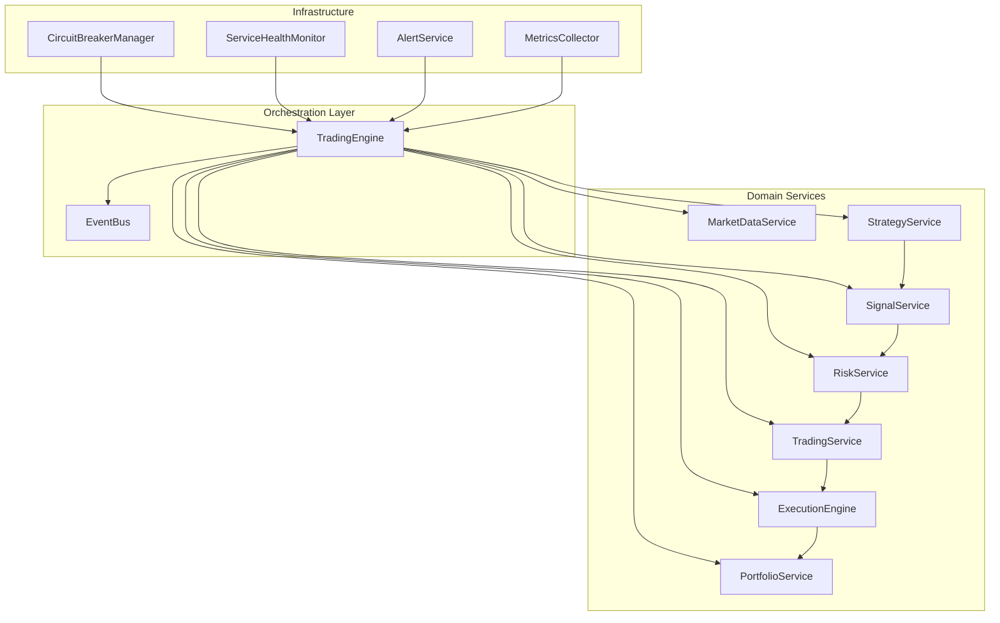
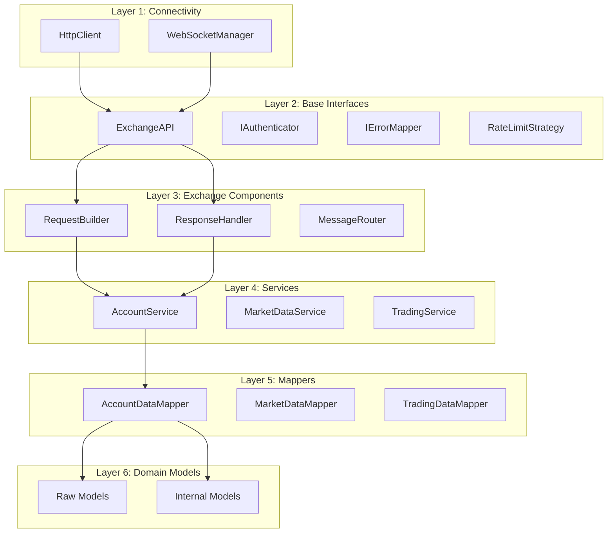

# CyberDeltaEngine Architecture Analysis
**Date:** 2025-07-01 (Updated: 2025-08-06)
**Version:** Post-June 2025 Refactoring - VERIFIED STATE

## Executive Summary

CyberDeltaEngine has evolved from legacy component-based architecture to a modern **domain service architecture** with clear separation of concerns. The system features a sophisticated 6-layer API architecture, comprehensive type safety with Pydantic validation, and a well-structured modular design. This analysis has been updated with verified findings from comprehensive code research conducted on 2025-08-06.

## 1. Main Module Structure (VERIFIED)

### Actual Module Structure (`cyberdelta/`)

```
cyberdelta/
├── apis/                  # Exchange API integrations (6-layer architecture) ✅
├── application/          # Application orchestration layer (TradingEngine) ✅
├── config/               # Configuration and secrets management ✅
├── domain/               # Domain services (market, portfolio, risk, etc.) ✅
│   ├── market/          # Market data services
│   ├── monitoring/      # Alert, audit, metrics services
│   ├── portfolio/       # Portfolio management services
│   ├── risk/            # Risk assessment services
│   ├── safety/          # Circuit breaker and safety systems
│   ├── signal/          # Signal validation services
│   ├── strategy/        # Strategy execution services
│   └── trading/         # Trading and execution services
├── enums/                # System-wide enumerations ✅
├── exceptions/           # Custom exception hierarchy ✅
├── infrastructure/       # Infrastructure layer (persistence, events) ✅
├── logging/              # Structured logging utilities ✅
├── models/               # Domain models and events ✅
├── protocols/            # Protocol definitions for interfaces ✅
├── symbols/              # Symbol management and mapping ✅
└── utils/                # Common utilities and helpers ✅
```

**Note:** The `core/` directory exists but contains minimal components. Main business logic has been refactored into the `domain/` service layer.

## 2. Key Components and Relationships (UPDATED)

### 2.1 Current Domain Service Architecture



### 2.2 Component Responsibilities (ACTUAL STATE)

| Component | Actual Implementation | Status | Primary Responsibility |
|-----------|---------------------|--------|------------------------|
| **TradingEngine** | `application/trading_engine.py` | ✅ Active | Main orchestrator coordinating all services |
| **MarketDataService** | `domain/market/market_service.py` | ✅ Active | Market data aggregation with cache management |
| **PortfolioService** | `domain/portfolio/portfolio_service.py` | ✅ Active | Portfolio state management and reconciliation |
| **RiskService** | `domain/risk/risk_service.py` | ✅ Active | Risk assessment and position sizing |
| **SignalService** | `domain/signal/signal_service.py` | ✅ Active | Signal validation and quality checks |
| **StrategyService** | `domain/strategy/strategy_service.py` | ✅ Active | Strategy lifecycle and execution management |
| **ExecutionEngine** | `domain/trading/execution/execution_engine.py` | ✅ Active | Order execution and lifecycle management |
| **CircuitBreakerManager** | `domain/safety/circuit_breaker.py` | ✅ Active | Emergency stop and safety controls |
| ~~DataHandler~~ | **DOES NOT EXIST** | ❌ Refactored | Replaced by MarketDataService |
| ~~ExecutionHandler~~ | **DOES NOT EXIST** | ❌ Refactored | Replaced by ExecutionEngine |
| ~~PortfolioTracker~~ | **DOES NOT EXIST** | ❌ Refactored | Replaced by PortfolioService |
| ~~RiskManager~~ | **DOES NOT EXIST** | ❌ Refactored | Replaced by RiskService |
| ~~SignalQueue~~ | **DOES NOT EXIST** | ❌ Refactored | Replaced by SignalService |
| ~~StrategyManager~~ | **DOES NOT EXIST** | ❌ Never existed | Functionality in StrategyService |

## 3. API Client Architecture (VERIFIED)

### 3.1 6-Layer Architecture Overview

The API client architecture has been successfully implemented with clear separation of concerns:



### 3.2 Key Architectural Patterns

1. **Raw/Internal Model Separation**
   - Raw models exactly match exchange API responses
   - Internal models provide unified business domain representation
   - Extension slots allow exchange-specific enrichment

2. **Service Layer Pattern**
   - Separate services for account, market data, and trading operations
   - Consistent error handling and validation
   - Clear method signatures with Args models

3. **Factory Pattern**
   - Component factories for dependency injection
   - Simplified testing and mocking
   - Exchange-specific customization

## 4. Configuration System Evolution

### 4.1 Previous State (April 2025)
- Simple YAML loading with basic validation
- Manual type conversions
- Limited error handling

### 4.2 Current State (VERIFIED)
- **Pydantic-based configuration models** ✅
- Type-safe `AppSettings` and `SecretsConfig` ✅
- Comprehensive validation with detailed error messages ✅
- Support for mainnet/testnet environments ✅
- Structured configuration hierarchy ✅

```python
# ACTUAL configuration structure (from app_config.py)
AppSettings
├── general: GeneralSettings
├── exchanges: dict[str, ExchangeSpecificConfig]
├── strategies: StrategiesSettings
├── risk: EnhancedRiskSettings
├── execution: ExecutionSettings
├── portfolio: PortfolioSettings
├── safety_systems: SafetySystemsSettings
├── monitoring: MonitoringSettings
└── simulation: SimulationSettings
```

## 5. Significant Architecture Changes (VERIFIED)

### 5.1 Components Actually Added

1. **StrategyService** (`domain/strategy/strategy_service.py`) ✅
   - Centralized strategy lifecycle management
   - Coordinates between strategies and other components
   - Handles strategy initialization and teardown
   - **Note:** No separate StrategyManager exists - functionality is in StrategyService

2. **HttpClient/WebSocketManager** (`apis/connectivity/`) ✅
   - `http_client.py`: Robust HTTP client with rate limiting
   - `ws_manager.py` & `validated_ws_manager.py`: WebSocket management
   - Connection pooling and retry logic
   - Unified interface for all exchanges

3. **Service Layer** (`apis/{exchange}/services/`) ✅
   - Composite pattern: AccountService, MarketDataService, TradingService
   - Decomposed services for specific operations
   - Clean separation of concerns
   - Consistent error handling patterns

### 5.2 Refactored Components

1. **API Clients**
   - Complete restructure with 6-layer architecture
   - Improved error mapping and handling
   - Better rate limiting strategies

2. **Configuration Management**
   - Migration to Pydantic models
   - Enhanced validation and type safety
   - Better secret management

3. **Import Structure**
   - Proper use of `TYPE_CHECKING` for circular imports
   - Clear module boundaries with `__all__` exports
   - Improved module organization

## 6. Type Safety and Code Quality Improvements (VERIFIED 2025-08-06)

### 6.1 Type Safety Progress

| Metric | April 2025 | July 2025 (Doc) | **Actual (Aug 2025)** |
|--------|------------|-----------------|----------------------|
| MyPy Errors (Core) | 676 errors | 0 errors | **1 error** (missing stub) ✅ |
| MyPy Errors (Tests) | Unknown | 1 error | Not checked |
| MyPy Strict Mode | Not used | Partial | **Full --strict** ✅ |
| Ruff Issues | 240 errors | 7 minor issues | **0 issues** ✅ |
| Decimal Compliance | Inconsistent | 100% compliant | **100% compliant** ✅ |

### 6.2 Key Improvements (VERIFIED)

1. **Comprehensive Type Annotations** ✅
   - All core modules fully typed
   - Proper use of generics and protocols
   - Clear return type specifications
   - TYPE_CHECKING imports for circular dependency resolution

2. **Decimal Usage Enforcement** ✅
   - All financial calculations use `Decimal`
   - No float usage for monetary values
   - Consistent precision handling
   - Pydantic validators ensure Decimal types

3. **Error Handling** ✅
   - Structured exception hierarchy in `exceptions/`
   - Domain-specific exceptions (risk, portfolio, trading)
   - Field validation exceptions with context
   - API error mapping for exchange-specific errors

## 7. Current Architecture Strengths (VERIFIED)

1. **Modularity**: Domain service architecture with specialized components ✅
2. **Extensibility**: Exchange-agnostic base layer, easy to add new exchanges ✅
3. **Type Safety**: Pydantic validation + MyPy strict mode enforcement ✅
4. **Error Resilience**: Comprehensive exception hierarchy with context ✅
5. **Performance**: Full async/await, connection pooling, caching ✅
6. **Maintainability**: Consistent patterns, protocols, clear boundaries ✅
7. **Configuration-Driven**: All behavior controlled by AppSettings ✅
8. **Health Monitoring**: Built-in health checks for key services ✅

## 8. Areas for Future Enhancement

1. **Database Integration**
   - Current state persistence is file-based
   - Django/FastAPI integration planned for better data management

2. **Monitoring and Observability**
   - Enhanced metrics collection
   - Real-time dashboard improvements
   - Better alerting mechanisms

3. **Strategy Backtesting**
   - More comprehensive backtesting framework
   - Historical data management
   - Performance analysis tools

4. **Order Management**
   - Advanced order types support
   - Better slippage handling
   - Order routing optimization

## 9. Conclusion (UPDATED 2025-08-06)

CyberDeltaEngine has successfully evolved from legacy component-based architecture to a modern domain service architecture. Verified findings show:

**Achieved Goals:**
- ✅ 6-layer API architecture fully implemented
- ✅ Domain service architecture replacing legacy components
- ✅ Comprehensive type safety (MyPy strict, 1 stub warning only)
- ✅ Zero Ruff code quality issues
- ✅ Pydantic validation at all boundaries
- ✅ Raw/Internal model separation with mappers
- ✅ Configuration-driven design throughout

**Architecture Evolution:**
- All legacy components (DataHandler, ExecutionHandler, etc.) have been completely refactored
- Modern service-oriented architecture with clear domain boundaries
- Health monitoring and observability built into core services
- Event-driven coordination through EventBus

The system demonstrates production-ready architecture with excellent code quality, type safety, and maintainability.

## 10. Recommendations (PRIORITY UPDATES)

### Immediate Actions Required:

1. **Documentation Cleanup** 🔴 HIGH PRIORITY
   - Remove all references to legacy components (DataHandler, ExecutionHandler, etc.)
   - Update component diagrams to reflect domain service architecture
   - Create migration guide from old component names to new services

2. **Fix Minor Type Issue** 🟡 MEDIUM
   - Install `types-aiofiles` stub package (only remaining MyPy issue)
   - Command: `pip install types-aiofiles`

3. **Architecture Documentation** 🟡 MEDIUM
   - Document the domain service patterns being used
   - Create service interaction diagrams
   - Document health monitoring capabilities

### Completed Items:
- ✅ Type safety achieved (MyPy strict mode)
- ✅ Code quality excellent (0 Ruff issues)
- ✅ Configuration system fully Pydantic-based
- ✅ Service layer properly implemented
- ✅ Error handling comprehensive
