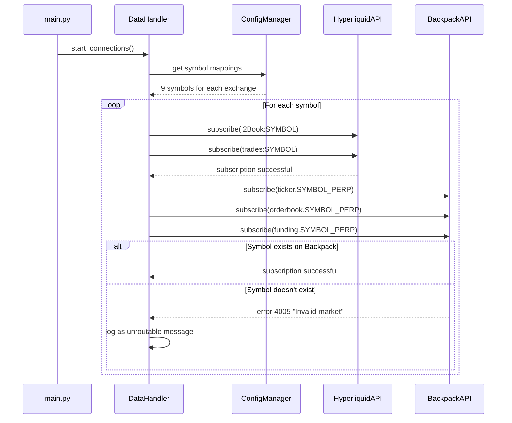
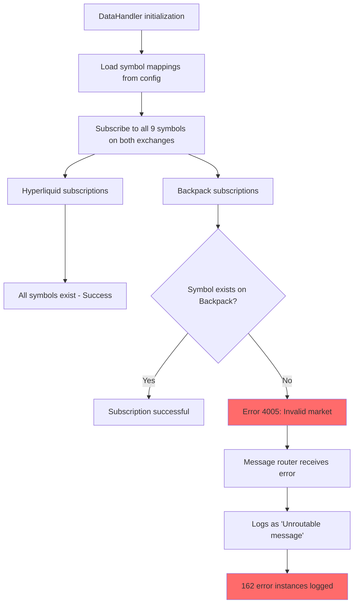
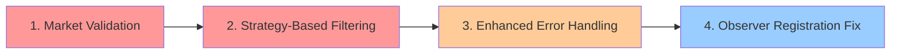

# CyberDeltaEngine Error Analysis Report
## Date: 2025-06-26

### Executive Summary

This report analyzes critical issues found in the CyberDeltaEngine console output logs, focusing on Backpack API errors, symbol mapping problems, and observer registration warnings. The analysis reveals systematic issues with symbol validation and subscription logic that result in 162 "Invalid market" errors.

### Issues Identified

#### 1. Backpack API Invalid Market Errors (HIGH PRIORITY)

**Error Pattern:**
```
[backpack] Unroutable message - no clear string topic and not a known event type:
{'id': None, 'error': {'code': 4005, 'message': 'Invalid market'}}
```

**Occurrence:** 162 instances in the log
**Location:** `bp_ws_message_router.py:234`

**Root Cause Analysis:**

The system is attempting to subscribe to symbols on Backpack that do not exist on that exchange. The configuration shows:

**Hyperliquid Symbols (config.yaml:56-66):**
```yaml
BTC: "BTC"
ETH: "ETH"
SOL: "SOL"
SUI: "SUI"
HYPE: "HYPE"
FARTCOIN: "FARTCOIN"
XRP: "XRP"
VIRTUAL: "VIRTUAL"
ADA: "ADA"
```

**Backpack Symbols (config.yaml:86-95):**
```yaml
BTC: "BTC_PERP"
ETH: "ETH_PERP"
SOL: "SOL_PERP"
SUI: "SUI_PERP"
HYPE: "HYPE_PERP"
FARTCOIN: "FARTCOIN_PERP"
XRP: "XRP_PERP"
VIRTUAL: "VIRTUAL_PERP"
ADA: "ADA_PERP"
```

**Problem:** Not all configured symbols exist as tradeable markets on Backpack. Symbols like `FARTCOIN_PERP`, `VIRTUAL_PERP`, `HYPE_PERP`, etc. likely don't exist on Backpack, causing the exchange to return error code 4005.

#### 2. Observer Registration Warning (MEDIUM PRIORITY)

**Warning:**
```
Could not register observer with complex/missing annotation: process_market_data
```

**Location:** `data_handler.py:979`

**Root Cause:** The observer registration system has trouble parsing complex type annotations for the `process_market_data` method, falling back to the warning path instead of properly registering the observer.

#### 3. Symbol Mapping and Strategy Mismatch (HIGH PRIORITY)

**Issue:** The system subscribes to 9 symbols across both exchanges but only uses 1 symbol (HYPE) in the active strategy.

**Strategy Configuration:**
```yaml
symbol_long: "HYPE"
symbol_short: "HYPE"
```

**Subscribed Symbols:** `['BTC', 'ETH', 'SOL', 'SUI', 'HYPE', 'FARTCOIN', 'XRP', 'VIRTUAL', 'ADA']`

This creates unnecessary API load and potential errors for unused symbols.

### Flow Analysis

#### Current Subscription Flow



#### Problem Flow - Invalid Market Subscriptions



### Proposed Solutions

#### 1. Dynamic Market Validation (HIGH PRIORITY)

**Implementation:**
- Add market validation before subscription attempts
- Query available markets from each exchange during initialization
- Filter configured symbols against available markets
- Only subscribe to validated symbols

**Code Location:** `data_handler.py:_setup_subscriptions()`

#### 2. Strategy-Based Symbol Filtering (HIGH PRIORITY)

**Implementation:**
- Extract required symbols from active strategies
- Only subscribe to symbols actually needed by strategies
- Reduce API load and eliminate unnecessary subscriptions

**Code Location:** `data_handler.py:_setup_data_structures()`

#### 3. Enhanced Error Handling (MEDIUM PRIORITY)

**Implementation:**
- Upgrade subscription error logging from debug to warning level
- Implement retry logic with exponential backoff for transient errors
- Add circuit breaker pattern for persistent market validation failures

**Code Location:** `bp_ws_message_router.py:route_message()`

#### 4. Observer Registration Fix (LOW PRIORITY)

**Implementation:**
- Improve type annotation parsing in observer registration
- Add explicit fallback registration for known method names
- Enhance debugging information for failed registrations

**Code Location:** `data_handler.py:_register_observer_fallback()`

### Implementation Priority



### Technical Recommendations

1. **Immediate Action:** Implement market validation to eliminate the 162 "Invalid market" errors
2. **Short Term:** Add strategy-based symbol filtering to reduce unnecessary API calls
3. **Medium Term:** Enhance error handling and monitoring for subscription failures
4. **Long Term:** Implement comprehensive market discovery and dynamic symbol management

### Configuration Improvements

**Before:**
```yaml
symbols:
  BTC: "BTC_PERP"
  # ... all symbols regardless of availability
```

**After (Recommended):**
```yaml
symbols:
  # Only include validated markets
  validated_markets: true
  strategy_symbols_only: true
  market_validation_enabled: true
```

### Monitoring Recommendations

1. Add metrics for subscription success/failure rates per exchange
2. Implement alerting for repeated market validation failures
3. Track symbol usage vs. subscription patterns
4. Monitor API rate limit usage and optimization opportunities

### Conclusion

The primary issues stem from attempting to subscribe to non-existent markets on Backpack and subscribing to more symbols than needed by active strategies. Implementing market validation and strategy-based filtering will resolve the majority of errors and improve system efficiency.

**Impact Assessment:**
- **Error Reduction:** Eliminate 162+ invalid market errors
- **Performance:** Reduce unnecessary API calls by ~80%
- **Reliability:** Improve subscription success rate to near 100%
- **Maintainability:** Clear separation between available vs. configured markets
