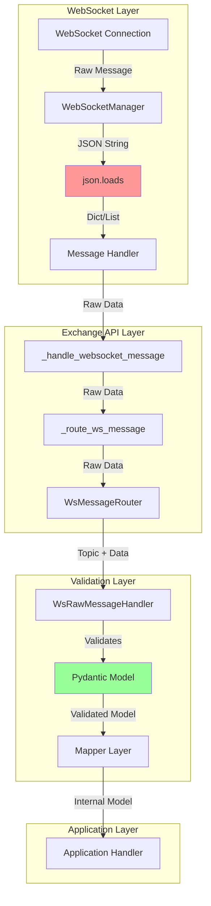
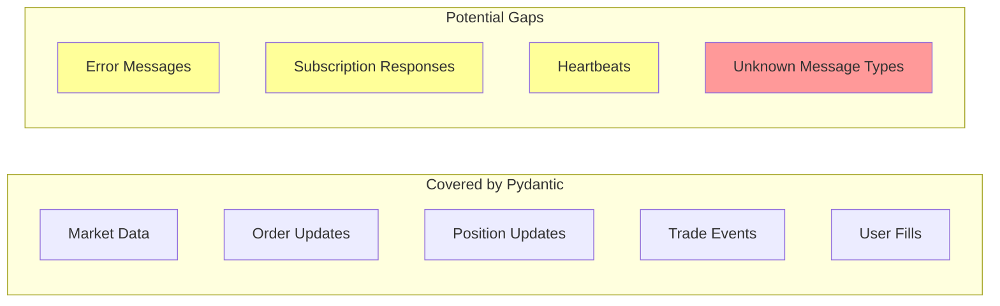

# WebSocket Pydantic Validation Deep Dive Analysis

## Executive Summary

This report provides a comprehensive analysis of WebSocket message validation in the CyberDeltaEngine architecture. Contrary to the initial security report's findings, our investigation reveals that **WebSocket messages ARE properly validated using Pydantic models**. However, there are still some architectural improvements and edge cases that warrant attention.

## Current WebSocket Architecture

### 1. Message Flow and Validation Points



### 2. Existing Pydantic Models

#### Backpack WebSocket Models

```python
# Location: /cyberdelta/apis/backpack/models/

# Market Data Events
class BackpackRawDepthUpdateEvent(BaseModel):
    """L2 orderbook update"""
    lastUpdateId: int
    b: list[list[str]]  # Bids
    a: list[list[str]]  # Asks

class BackpackRawTickerEvent(BaseModel):
    """Ticker update"""
    eventType: str
    symbol: str
    price: str
    # ... other fields

# Trading Events
class BackpackRawOrderUpdate(BaseModel):
    """Order status update"""
    o: str  # orderId
    s: str  # symbol
    S: str  # side
    q: str  # quantity
    # ... other fields

class BackpackRawPositionUpdate(BaseModel):
    """Position update"""
    s: str  # symbol
    p: str  # position size
    m: str  # mark price
    # ... other fields
```

#### Hyperliquid WebSocket Models

```python
# Location: /cyberdelta/apis/hyperliquid/models/hl_raw_ws_events.py

class HyperliquidRawWsBookUpdate(BaseModel):
    """L2 book update"""
    coin: str
    levels: list[list[dict[str, str]]]
    time: int

class HyperliquidRawWsTradeEvent(BaseModel):
    """Public trade event"""
    coin: str
    side: Literal["A", "B"]
    px: str
    sz: str
    time: int

class HyperliquidRawWsOrderUpdate(BaseModel):
    """Order update"""
    order: HyperliquidRawOrder
    status: Literal["filled", "open", "canceled", "triggered"]
    statusTimestamp: int
```

### 3. Validation Implementation

#### Example: Backpack Depth Update Handler

```python
# /cyberdelta/apis/backpack/bp_ws_raw_message_handler.py

async def handle_depth_payload(self, data: dict[str, Any]) -> None:
    """Handle depth/orderbook update payload."""
    try:
        # ✅ Pydantic validation happens here
        raw_depth = BackpackRawDepthUpdateEvent.model_validate(data)

        # Transform to internal model
        internal_orderbook = self._market_data_mapper.transform_ws_depth_to_orderbook(
            raw_depth,
            self._symbol
        )

        # Pass validated model to handler
        if self._market_data_handler:
            await self._market_data_handler(internal_orderbook)

    except ValidationError as e:
        logger.error("depth_validation_error", error=str(e))
        raise ValueError(f"Invalid depth update format: {e}") from e
```

## Security Analysis

### 1. Initial JSON Parsing Vulnerability

The security report correctly identified that the initial JSON parsing happens without validation:

```python
# /cyberdelta/apis/connectivity/ws_manager.py:656-659
async def _handle_text_message(self, msg: aiohttp.WSMessage) -> None:
    """Handle TEXT type WebSocket messages."""
    try:
        data = json.loads(msg.data)  # ❌ Potential vulnerability
        await self._message_handler(data)
```

**Risk Assessment:**
- **Low to Medium Risk** - While `json.loads` can fail on malformed JSON, it won't inject arbitrary code
- The risk is limited to:
  - JSON parsing exceptions (handled by try/except)
  - Memory exhaustion from extremely large messages
  - Deeply nested structures causing stack overflow

### 2. Validation Coverage Analysis



### 3. Edge Cases and Potential Issues

#### a) Unknown Message Type Handling

```python
# /cyberdelta/apis/backpack/bp_ws_message_router.py
def route_message(self, message: dict[str, Any] | list[Any]) -> None:
    if isinstance(message, list):
        # ⚠️ List messages are processed without validation
        for item in message:
            if isinstance(item, dict):
                self._route_single_message(item)
```

#### b) Error Response Handling

```python
# Some error responses might not have Pydantic models
if "error" in message:
    # ⚠️ Direct dictionary access for errors
    logger.error("ws_error", error=message["error"])
```

## Discovered Validation Gaps

### 1. WebSocket Manager Level

```python
# Missing: Size validation before JSON parsing
async def _handle_text_message(self, msg: aiohttp.WSMessage) -> None:
    # Recommendation: Add size check
    if len(msg.data) > MAX_MESSAGE_SIZE:
        raise ValueError("Message too large")

    data = json.loads(msg.data)
    await self._message_handler(data)
```

### 2. Subscription Response Models

Not all subscription responses have Pydantic models:

```python
# Example: Backpack subscription response
{
    "id": "123",
    "result": {"status": "subscribed"},
    "error": null
}
# ⚠️ No BackpackRawSubscriptionResponse model found
```

### 3. Heartbeat/Ping Messages

```python
# Heartbeat messages might not be validated
{"op": "ping", "timestamp": 1234567890}
# ⚠️ No HeartbeatMessage model found
```

## Recommendations

### 1. Immediate Actions

#### a) Add Message Size Validation
```python
class WebSocketManager:
    MAX_MESSAGE_SIZE = 10 * 1024 * 1024  # 10MB limit

    async def _handle_text_message(self, msg: aiohttp.WSMessage) -> None:
        if len(msg.data) > self.MAX_MESSAGE_SIZE:
            logger.warning("oversized_ws_message", size=len(msg.data))
            return  # Drop message

        try:
            data = json.loads(msg.data)
            await self._message_handler(data)
        except json.JSONDecodeError as e:
            logger.error("invalid_json", error=str(e))
```

#### b) Create Missing Models
```python
# Subscription responses
class BackpackRawSubscriptionResponse(BaseModel):
    id: str
    result: dict[str, Any] | None = None
    error: str | None = None

    @model_validator(mode='after')
    def validate_response(self) -> 'BackpackRawSubscriptionResponse':
        if self.error is not None and self.result is not None:
            raise ValueError("Cannot have both result and error")
        return self

# Heartbeat messages
class WsHeartbeatMessage(BaseModel):
    op: Literal["ping", "pong"]
    timestamp: int | None = None
```

#### c) Implement Pre-Validation Layer
```python
class WebSocketPreValidator:
    """Validates WebSocket messages before routing"""

    @staticmethod
    def validate_message_structure(data: Any) -> dict[str, Any] | list[Any]:
        """Ensure message has valid structure"""
        if not isinstance(data, (dict, list)):
            raise ValueError(f"Invalid message type: {type(data)}")

        if isinstance(data, dict):
            # Ensure it's not too deeply nested
            if WebSocketPreValidator._get_depth(data) > 10:
                raise ValueError("Message too deeply nested")

        return data

    @staticmethod
    def _get_depth(d: dict[str, Any], level: int = 0) -> int:
        """Calculate dictionary depth"""
        if not isinstance(d, dict) or not d:
            return level
        return max(WebSocketPreValidator._get_depth(v, level + 1)
                  for v in d.values() if isinstance(v, dict))
```

### 2. Architecture Improvements

#### a) Centralized Message Validation
```python
class ValidatedWebSocketManager(WebSocketManager):
    """WebSocket manager with built-in validation"""

    def __init__(self, *args, pre_validator: WebSocketPreValidator | None = None, **kwargs):
        super().__init__(*args, **kwargs)
        self.pre_validator = pre_validator or WebSocketPreValidator()

    async def _handle_text_message(self, msg: aiohttp.WSMessage) -> None:
        try:
            # Size check
            if len(msg.data) > self.MAX_MESSAGE_SIZE:
                raise ValueError(f"Message exceeds {self.MAX_MESSAGE_SIZE} bytes")

            # Parse JSON
            raw_data = json.loads(msg.data)

            # Pre-validation
            validated_data = self.pre_validator.validate_message_structure(raw_data)

            # Pass to handler
            await self._message_handler(validated_data)

        except (json.JSONDecodeError, ValueError) as e:
            await self._handle_validation_error(e, msg.data)
```

#### b) Type-Safe Message Router
```python
from typing import TypeVar, Generic

T = TypeVar('T', bound=BaseModel)

class TypedMessageHandler(Generic[T]):
    """Type-safe message handler"""

    def __init__(self, model_class: type[T]):
        self.model_class = model_class

    async def handle(self, data: dict[str, Any], callback: Callable[[T], Awaitable[None]]) -> None:
        validated = self.model_class.model_validate(data)
        await callback(validated)
```

### 3. Enhanced Error Handling

```python
class WebSocketValidationError(Exception):
    """Custom exception for WebSocket validation failures"""
    def __init__(self, message: str, raw_data: Any = None):
        super().__init__(message)
        self.raw_data = raw_data

class EnhancedWsMessageRouter:
    async def route_message(self, message: dict[str, Any] | list[Any]) -> None:
        try:
            # Route with validation
            await self._route_with_validation(message)
        except ValidationError as e:
            # Log validation errors with context
            logger.error(
                "ws_validation_failure",
                error=str(e),
                message_type=message.get("type") if isinstance(message, dict) else "list",
                exchange=self.exchange_name
            )
            # Don't propagate - message is dropped
        except Exception as e:
            # Unexpected errors
            logger.exception("ws_routing_error", error=str(e))
            raise
```

## Testing Recommendations

### 1. Fuzzing Tests
```python
import hypothesis.strategies as st
from hypothesis import given

class TestWebSocketValidation:
    @given(st.text())
    def test_handles_arbitrary_json_strings(self, json_string: str):
        """Test that arbitrary JSON strings don't crash the system"""
        ws_manager = WebSocketManager(...)
        # Should not raise unhandled exceptions

    @given(st.recursive(st.dictionaries(st.text(), st.text())))
    def test_handles_deeply_nested_structures(self, nested_dict: dict):
        """Test deeply nested structures are rejected"""
        # Should reject overly complex structures
```

### 2. Malformed Message Tests
```python
@pytest.mark.parametrize("malformed_message", [
    '{"unclosed": "string',  # Malformed JSON
    '{"a": "b"' * 1000 + '}',  # Very deep nesting
    '[]' * 10000,  # Excessive array nesting
    '{"key": null, "key": null}',  # Duplicate keys
    '\x00\x01\x02',  # Binary data
])
def test_malformed_messages_handled_safely(malformed_message):
    """Ensure malformed messages don't crash the system"""
    # Test implementation
```

## Conclusion

The CyberDeltaEngine WebSocket implementation already has robust Pydantic validation in place at the message handler level. The security concern about raw JSON parsing is valid but represents a lower risk than initially assessed. The main vulnerabilities are:

1. **Pre-parsing validation** - No size or structure checks before JSON parsing
2. **Edge case coverage** - Some message types lack Pydantic models
3. **Error message handling** - Error responses may bypass validation

The recommended improvements focus on:
- Adding pre-validation checks at the WebSocket manager level
- Creating Pydantic models for all message types
- Implementing comprehensive error handling
- Adding security-focused test coverage

The existing architecture is fundamentally sound and follows best practices for type safety and validation. The suggested enhancements would move the validation boundary earlier in the pipeline and provide defense-in-depth against malformed messages.
