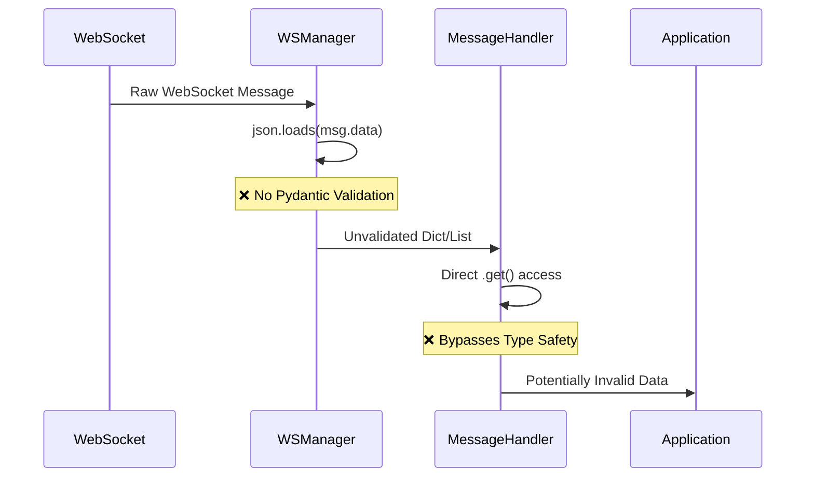
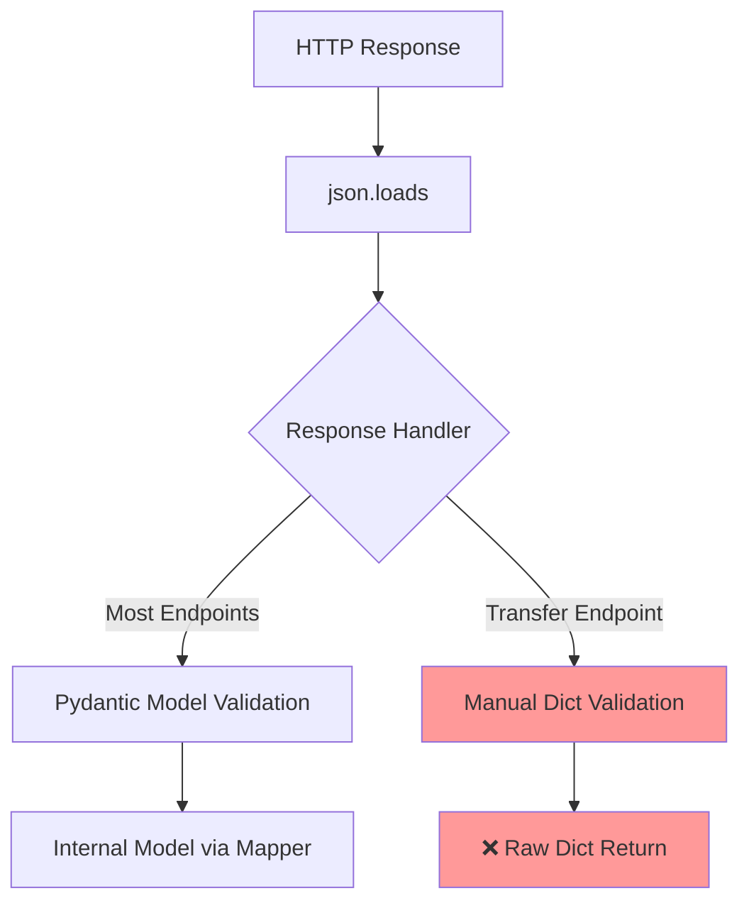
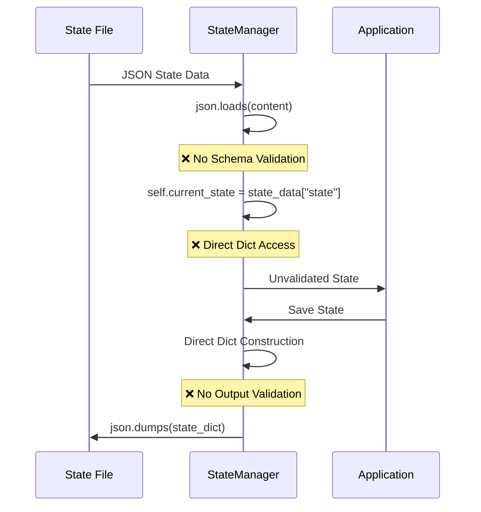
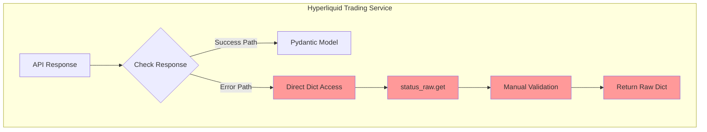
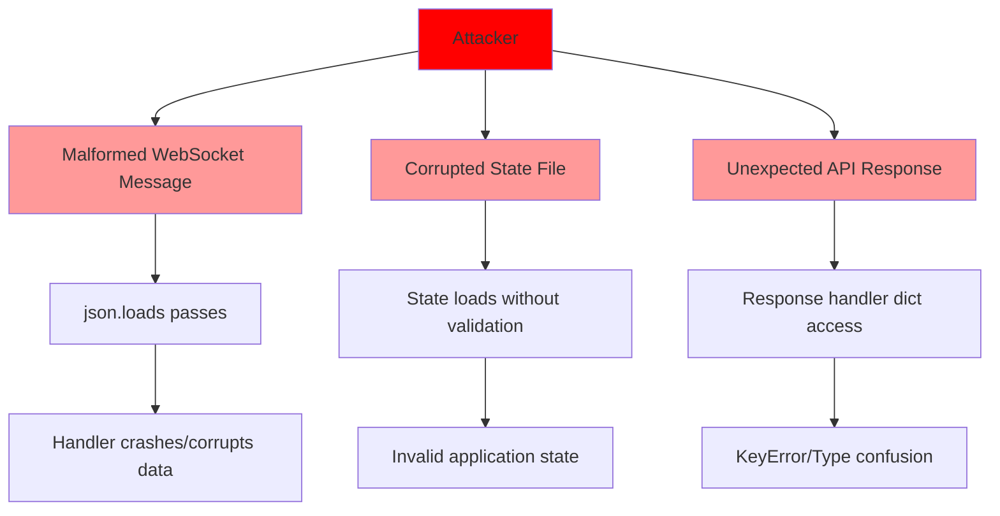
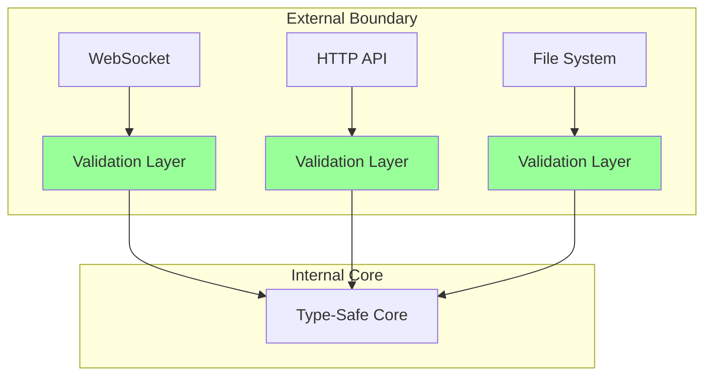

# CyberDeltaEngine API Architecture Security Analysis

## Executive Summary

This report presents a comprehensive security analysis of the CyberDeltaEngine API architecture, focusing on potential Pydantic model validation bypasses across services, request builders, response handlers, and mappers. The analysis reveals several critical areas where Pydantic validation is bypassed, creating potential security vulnerabilities.

## Key Findings

### Critical Security Issues

1. **WebSocket Manager** - Direct JSON parsing without validation
2. **Backpack Response Handler** - Manual dictionary validation bypassing Pydantic
3. **State Managers** - Unvalidated JSON loading for persistent state
4. **Trading Services** - Direct dictionary access on API responses

### Security Strengths

1. **Mapper Layer** - Consistent use of `secure_transform` utility
2. **Request Builders** - Proper Pydantic model usage
3. **Layered Validation** - Multiple validation checkpoints in data flow

## Detailed Analysis

### 1. WebSocket Data Flow Vulnerability



**Location**: `/cyberdelta/apis/connectivity/ws_manager.py:656-659`
```python
async def _handle_text_message(self, msg: aiohttp.WSMessage) -> None:
    """Handle TEXT type WebSocket messages."""
    try:
        data = json.loads(msg.data)  # ❌ No validation
        await self._message_handler(data)  # ❌ Raw dict passed
```

### 2. HTTP Response Processing Flow



**Critical Issue in Backpack Response Handler**  
**Location**: `/cyberdelta/apis/backpack/bp_response_handler.py:963-999`
```python
# Direct dictionary access without Pydantic model
if "success" not in validated_data or not isinstance(
    validated_data["success"], bool
):
    raise APIError(...)

# Returns raw dictionary, bypassing Pydantic
return validated_data  # ❌ No model validation
```

### 3. Data Validation Bypass Patterns

```mermaid
graph LR
    subgraph "Validation Bypasses"
        A[json.loads] --> B[Direct Dict Access]
        B --> C[.get() Chains]
        C --> D[Manual Type Checks]
        D --> E[Unvalidated Data]
    end
    
    subgraph "Secure Pattern"
        F[json.loads] --> G[Pydantic Model]
        G --> H[Validated Access]
        H --> I[Type-Safe Data]
    end
    
    style A fill:#ff9999
    style B fill:#ff9999
    style C fill:#ff9999
    style D fill:#ff9999
    style E fill:#ff9999
    
    style F fill:#99ff99
    style G fill:#99ff99
    style H fill:#99ff99
    style I fill:#99ff99
```

### 4. State Management Security Gap



**Locations**:
- `/cyberdelta/utils/state_manager.py:91`
- `/cyberdelta/utils/async_state_manager.py:101`

### 5. Service Layer Dictionary Access



**Example from** `/cyberdelta/apis/hyperliquid/services/hl_trading_service.py:980-993`:
```python
if "error" in status_raw and isinstance(status_raw["error"], str):
    return {"error": status_raw["error"]}  # ❌ Raw dict return
```

## Security Impact Assessment

### High Risk Areas

1. **WebSocket Communications**
   - Impact: Malformed messages could crash handlers or inject invalid data
   - Likelihood: High (external data source)
   - Risk Level: **CRITICAL**

2. **State Persistence**
   - Impact: Corrupted state files could compromise application integrity
   - Likelihood: Medium (requires file system access)
   - Risk Level: **HIGH**

3. **Error Response Handling**
   - Impact: Unexpected error formats could cause crashes or data leaks
   - Likelihood: Medium (depends on exchange behavior)
   - Risk Level: **MEDIUM**

### Attack Vectors



## Recommendations

### Immediate Actions (Critical)

1. **WebSocket Validation Layer**
```python
# Add validation wrapper
async def _handle_text_message(self, msg: aiohttp.WSMessage) -> None:
    try:
        raw_data = json.loads(msg.data)
        validated_data = WSMessageModel.model_validate(raw_data)
        await self._message_handler(validated_data)
    except (json.JSONDecodeError, ValidationError) as e:
        logger.error(f"Invalid WebSocket message: {e}")
```

2. **Create Missing Pydantic Models**
```python
# For Backpack transfer response
class BackpackRawTransferResponse(BaseModel):
    success: bool
    message: str | None = None
    transferId: str | None = None
    model_config = ConfigDict(extra='forbid')
```

3. **State Manager Validation**
```python
class StateModel(BaseModel):
    state: StateEnum
    metadata: dict[str, Any]
    timestamp: datetime
    model_config = ConfigDict(extra='forbid')

# Use in state manager
state_model = StateModel.model_validate_json(content)
self.current_state = state_model.state
```

### Medium-Term Improvements

1. **Centralized Validation Middleware**
```python
class ValidationMiddleware:
    @staticmethod
    async def validate_json_response(
        raw_json: Any,
        model_class: type[BaseModel]
    ) -> BaseModel:
        """Central validation point for all JSON responses"""
        return model_class.model_validate(raw_json)
```

2. **Type-Safe Dictionary Access**
```python
# Replace all .get() chains with validated access
# Bad: data.get("key", {}).get("nested")
# Good: validated_model.key.nested
```

3. **Security Event Monitoring**
```python
class SecurityValidationMonitor:
    def track_validation_failure(
        self,
        source: str,
        error: ValidationError,
        raw_data: Any
    ) -> None:
        """Track and alert on validation failures"""
        # Log security event
        # Check for attack patterns
        # Alert if threshold exceeded
```

### Long-Term Architecture Changes

1. **Enforce Validation at Boundaries**


2. **Implement Security Testing**
   - Fuzz testing for WebSocket handlers
   - Invalid state file injection tests
   - Malformed API response simulations

3. **Add Runtime Type Checking**
```python
from typing import runtime_checkable, Protocol

@runtime_checkable
class ValidatedModel(Protocol):
    """Marker for validated data"""
    _validated: bool = True
```

## Conclusion

The CyberDeltaEngine architecture demonstrates strong security practices in many areas, particularly in the mapper layer with its use of `secure_transform`. However, critical validation gaps exist in WebSocket handling, state management, and some response handlers. These vulnerabilities could allow malformed data to bypass Pydantic validation and potentially compromise system integrity.

The most urgent priority is implementing validation for WebSocket messages and state management, as these represent external attack surfaces. The recommendations provided offer a path to closing these security gaps while maintaining the system's performance and flexibility.

## Appendix: Affected Files

### Critical Priority
- `/cyberdelta/apis/connectivity/ws_manager.py` - WebSocket validation bypass
- `/cyberdelta/apis/backpack/bp_response_handler.py` - Transfer endpoint bypass
- `/cyberdelta/utils/state_manager.py` - State validation bypass
- `/cyberdelta/utils/async_state_manager.py` - Async state validation bypass

### High Priority
- `/cyberdelta/apis/hyperliquid/services/hl_trading_service.py` - Dict access patterns
- `/cyberdelta/apis/hyperliquid/hl_ws_message_router.py` - Message routing validation
- `/cyberdelta/core/portfolio_tracker.py` - State loading validation

### Medium Priority
- `/cyberdelta/apis/connectivity/http_client.py` - Response parsing
- `/cyberdelta/core/symbol_mapper.py` - Configuration validation
- Error mapper files - Error response handling