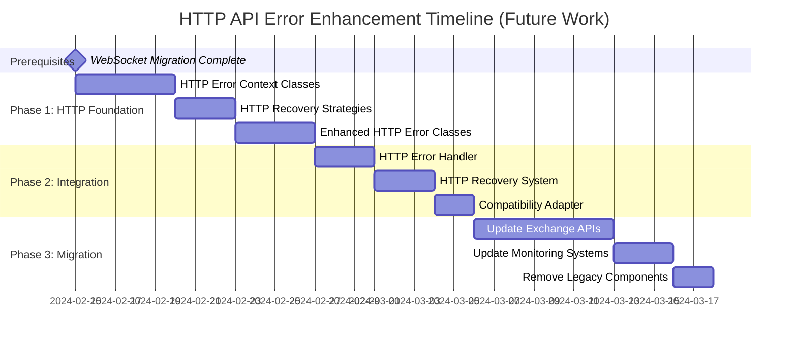

# HTTP/REST API Error Domain Enhancement Ideas (Post-WebSocket Migration)

## Executive Summary

After successfully implementing the WebSocket error system decoupling, these are potential enhancements to the HTTP/REST API error domain to bring it up to the same level of type safety and semantic clarity. **These are FUTURE ideas and NOT part of the WebSocket error migration project.**

---

## Context

The WebSocket error architecture introduces several improvements over the current API error system:

1. **Type-Safe Metadata**: `StreamErrorContext` (Pydantic) vs `dict[str, Any]`
2. **Typed Recovery Strategies**: `WebSocketRecoveryStrategy` enum vs `bool is_retryable`
3. **Domain-Specific Context**: WebSocket concepts vs mixed HTTP/business logic
4. **Validation Integration**: `ErrorContextValidator` with reusable validation

These same patterns could enhance the HTTP/REST API error domain.

---

## Current HTTP API Error Analysis

### Existing Pattern (Good Foundation)
```python
# Current APIError system already has good patterns:
class APIError(Exception):
    def __init__(self, ...):
        self.model = APIErrorResponse(...)  # ✅ Exception-wraps-Pydantic pattern

class APIErrorCode(Enum):  # ✅ Enum-based error codes
    RATE_LIMITED = 109
    TIMEOUT = 1
```

### Type Safety Issues in Current System
```python
# Current APIErrorResponse
class APIErrorResponse(BaseModel):
    metadata: dict[str, Any] | None = Field(None)  # ❌ Type erasure

# Usage creates type safety gaps
api_error = APIError(
    message="Rate limited",
    metadata={"retry_after": 300, "endpoint": "/api/orders"}  # ❌ Untyped
)

# Accessing metadata requires type assertions
retry_after = api_error.metadata.get("retry_after")  # ❌ Any type
if retry_after and isinstance(retry_after, (int, float)):
    await asyncio.sleep(retry_after)
```

---

## Proposed HTTP API Error Enhancements

### 1. Type-Safe HTTP Error Context

```python
# cyberdelta/apis/common/api_error_context.py
from enum import StrEnum
from typing import Any
from datetime import datetime
from pydantic import BaseModel, Field, validator

class HTTPErrorContext(BaseModel):
    """Type-safe context for HTTP API errors."""

    # Request context
    method: str = Field(..., description="HTTP method (GET, POST, etc.)")
    endpoint: str = Field(..., description="API endpoint path")
    url: str = Field(..., description="Full request URL")

    # Response context
    http_status: int | None = Field(default=None, description="HTTP response status")
    response_headers: dict[str, str] = Field(default_factory=dict, description="Response headers")

    # Timing context
    request_duration_ms: float | None = Field(default=None, description="Request duration")
    timeout_seconds: float | None = Field(default=None, description="Configured timeout")

    # Rate limiting context
    retry_after_seconds: float | None = Field(default=None, description="Retry-After header value")
    rate_limit_remaining: int | None = Field(default=None, description="Remaining requests")
    rate_limit_reset_time: datetime | None = Field(default=None, description="Rate limit reset")

    # Exchange context
    exchange: str = Field(..., description="Exchange name")
    exchange_request_id: str | None = Field(default=None, description="Exchange request ID")

    # Authentication context
    api_key_id: str | None = Field(default=None, description="API key identifier")
    signature_valid: bool | None = Field(default=None, description="Signature validation result")

    # Payload context (for validation errors)
    request_body_size_bytes: int | None = Field(default=None, description="Request body size")
    response_body_size_bytes: int | None = Field(default=None, description="Response body size")

    @validator('http_status')
    def validate_http_status(cls, v):
        if v is not None and not (100 <= v <= 599):
            raise ValueError('HTTP status must be between 100-599')
        return v

    @validator('retry_after_seconds')
    def validate_retry_after(cls, v):
        if v is not None and v < 0:
            raise ValueError('Retry-After cannot be negative')
        return v

class HTTPErrorLogData(BaseModel):
    """Type-safe log data for HTTP API errors."""

    error_domain: str = Field(default="http_api", description="Error domain")
    message: str = Field(..., description="Error message")
    code_name: str = Field(..., description="Error code name")
    code_value: int | str = Field(..., description="Error code value")
    severity: ErrorSeverity = Field(..., description="Error severity")
    recoverable: bool = Field(..., description="Whether error is recoverable")
    recovery_strategy: HTTPRecoveryStrategy = Field(..., description="Recovery strategy")
    timestamp: datetime = Field(..., description="Error timestamp")

    # HTTP-specific context
    method: str = Field(..., description="HTTP method")
    endpoint: str = Field(..., description="API endpoint")
    http_status: int | None = Field(default=None, description="HTTP status")
    exchange: str = Field(..., description="Exchange name")

    # Rate limiting
    retry_after_seconds: float | None = Field(default=None, description="Retry-After")
    rate_limit_remaining: int | None = Field(default=None, description="Rate limit remaining")

    # Performance
    request_duration_ms: float | None = Field(default=None, description="Request duration")
    request_body_size_bytes: int | None = Field(default=None, description="Request size")
    response_body_size_bytes: int | None = Field(default=None, description="Response size")

    # Error context
    original_error: str | None = Field(default=None, description="Original exception")
```

### 2. HTTP-Specific Recovery Strategies

```python
# cyberdelta/apis/common/http_recovery_strategies.py
class HTTPRecoveryStrategy(StrEnum):
    """Type-safe HTTP recovery strategies."""
    RETRY_REQUEST = "retry_request"
    EXPONENTIAL_BACKOFF = "exponential_backoff"
    CIRCUIT_BREAKER = "circuit_breaker"
    FAILOVER = "failover"
    ROTATE_CREDENTIALS = "rotate_credentials"
    REDUCE_PAYLOAD_SIZE = "reduce_payload_size"
    SWITCH_ENDPOINT = "switch_endpoint"

class HTTPRecoveryContext(BaseModel):
    """Context for HTTP recovery operations."""

    strategy: HTTPRecoveryStrategy = Field(..., description="Recovery strategy")
    max_retries: int = Field(default=3, description="Maximum retry attempts")
    current_attempt: int = Field(default=0, description="Current attempt number")
    backoff_seconds: float = Field(default=1.0, description="Current backoff delay")

    # Failover context
    primary_endpoint: str | None = Field(default=None, description="Primary endpoint")
    fallback_endpoints: list[str] = Field(default_factory=list, description="Fallback endpoints")
    current_endpoint_index: int = Field(default=0, description="Current endpoint index")

    # Credential rotation context
    current_api_key_id: str | None = Field(default=None, description="Current API key")
    available_api_keys: list[str] = Field(default_factory=list, description="Available keys")

    # Circuit breaker context
    failure_count: int = Field(default=0, description="Consecutive failures")
    success_count: int = Field(default=0, description="Consecutive successes")
    circuit_state: str = Field(default="closed", description="Circuit state")
```

### 3. Enhanced HTTP Error Classes

```python
# cyberdelta/apis/common/enhanced_api_error.py
class EnhancedAPIError(Exception, ErrorTimestampMixin):
    """Enhanced HTTP API error with WebSocket-style type safety."""

    def __init__(
        self,
        message: str,
        code: APIErrorCode,
        context: HTTPErrorContext,
        severity: ErrorSeverity = ErrorSeverity.ERROR,
        recoverable: bool = True,
        recovery_strategy: HTTPRecoveryStrategy = HTTPRecoveryStrategy.RETRY_REQUEST,
        original_exception: Exception | None = None,
    ) -> None:
        ErrorTimestampMixin.__init__(self)

        self.message = message
        self.code = code
        self.context = HTTPErrorContextValidator.validate_http_context(context)
        self.severity = severity
        self.recoverable = recoverable
        self.recovery_strategy = recovery_strategy
        self.original_exception = original_exception

        super().__init__(message)

    @property
    def is_recoverable(self) -> bool:
        """Determine if recovery should be attempted."""
        non_recoverable_codes = {
            APIErrorCode.AUTHENTICATION_FAILED,
            APIErrorCode.INVALID_PARAMS,
            APIErrorCode.INVALID_REQUEST,
        }
        return self.recoverable and self.code not in non_recoverable_codes

    def get_recovery_strategy(self) -> HTTPRecoveryStrategy:
        """Get specific recovery strategy for this error."""
        if self.code == APIErrorCode.RATE_LIMITED:
            return HTTPRecoveryStrategy.EXPONENTIAL_BACKOFF
        elif self.code in {APIErrorCode.TIMEOUT, APIErrorCode.CONNECTION_ERROR}:
            return HTTPRecoveryStrategy.RETRY_REQUEST
        elif self.code == APIErrorCode.AUTHENTICATION_FAILED:
            return HTTPRecoveryStrategy.ROTATE_CREDENTIALS
        elif self.code == APIErrorCode.SERVER_ERROR:
            return HTTPRecoveryStrategy.CIRCUIT_BREAKER
        else:
            return self.recovery_strategy

    def requires_credential_rotation(self) -> bool:
        """Check if error requires API key rotation."""
        return self.code in {
            APIErrorCode.AUTHENTICATION_FAILED,
            APIErrorCode.IP_BAN_SUSPECTED,
        }

    def requires_circuit_breaker(self) -> bool:
        """Check if error should trigger circuit breaker."""
        return (
            self.code == APIErrorCode.SERVER_ERROR
            and self.context.http_status
            and self.context.http_status >= 500
        )

    def get_retry_delay(self) -> float:
        """Calculate appropriate retry delay."""
        if self.context.retry_after_seconds:
            return self.context.retry_after_seconds

        if self.code == APIErrorCode.RATE_LIMITED:
            return min(60.0, 2.0 ** (self.context.current_attempt or 0))

        return 1.0

    def to_log_data(self) -> HTTPErrorLogData:
        """Convert to structured logging format."""
        return HTTPErrorLogData(
            message=self.message,
            code_name=self.code.name,
            code_value=self.code.value,
            severity=self.severity,
            recoverable=self.is_recoverable,
            recovery_strategy=self.get_recovery_strategy(),
            timestamp=self.timestamp,
            method=self.context.method,
            endpoint=self.context.endpoint,
            http_status=self.context.http_status,
            exchange=self.context.exchange,
            retry_after_seconds=self.context.retry_after_seconds,
            rate_limit_remaining=self.context.rate_limit_remaining,
            request_duration_ms=self.context.request_duration_ms,
            request_body_size_bytes=self.context.request_body_size_bytes,
            response_body_size_bytes=self.context.response_body_size_bytes,
            original_error=str(self.original_exception) if self.original_exception else None,
        )
```

### 4. Type-Safe HTTP Error Handler

```python
# cyberdelta/apis/common/enhanced_api_error_handler.py
class EnhancedAPIErrorHandler(TypedLogger[HTTPErrorLogData]):
    """Type-safe error handler for HTTP API errors."""

    def __init__(self, exchange: str):
        self.exchange = exchange
        self.logger = get_logger(f"HTTP.{exchange}.ErrorHandler")

    async def handle_http_error(
        self,
        error: Exception,
        request_context: HTTPRequestContext,  # ✅ TYPED!
        response_data: HTTPResponseData | None = None,  # ✅ TYPED!
    ) -> None:
        """Handle HTTP errors with full type safety."""

        # Create rich HTTP context
        http_context = HTTPErrorContext(
            method=request_context.method,
            endpoint=request_context.endpoint,
            url=request_context.full_url,
            exchange=self.exchange,
            http_status=response_data.status_code if response_data else None,
            response_headers=dict(response_data.headers) if response_data else {},
            request_duration_ms=request_context.duration_ms,
            timeout_seconds=request_context.timeout,
            retry_after_seconds=self._extract_retry_after(response_data),
            rate_limit_remaining=self._extract_rate_limit(response_data),
            request_body_size_bytes=len(request_context.body) if request_context.body else 0,
            response_body_size_bytes=len(response_data.content) if response_data else 0,
        )

        # Create HTTP-specific error
        api_error = EnhancedAPIError(
            message=f"HTTP request failed: {error}",
            code=self._map_error_code(error, response_data),
            context=http_context,
            severity=self._determine_severity(error, response_data),
            recoverable=self._is_recoverable(error, response_data),
            original_exception=error,
        )

        # Log with full type safety
        await self.log_error(api_error.severity, api_error.to_log_data())

        # Notify recovery system with typed error
        await self._notify_recovery_system(api_error)

    async def log_error(self, severity: ErrorSeverity, data: HTTPErrorLogData) -> None:
        """Log HTTP error with full type safety."""
        structured_data = {
            "error_domain": data.error_domain,
            "message": data.message,
            "code_name": data.code_name,
            "code_value": data.code_value,
            "severity": data.severity.value,
            "recoverable": data.recoverable,
            "recovery_strategy": data.recovery_strategy.value,
            "timestamp": data.timestamp.isoformat(),
            "http_context": {
                "method": data.method,
                "endpoint": data.endpoint,
                "status": data.http_status,
                "exchange": data.exchange,
            },
            "rate_limiting": {
                "retry_after": data.retry_after_seconds,
                "remaining": data.rate_limit_remaining,
            },
            "performance": {
                "duration_ms": data.request_duration_ms,
                "request_size": data.request_body_size_bytes,
                "response_size": data.response_body_size_bytes,
            },
            "original_error": data.original_error,
        }

        if severity == ErrorSeverity.CRITICAL:
            self.logger.critical("http_critical_error", **structured_data)
        elif severity == ErrorSeverity.ERROR:
            self.logger.error("http_error", **structured_data)
        elif severity == ErrorSeverity.WARNING:
            self.logger.warning("http_warning", **structured_data)
        else:
            self.logger.info("http_info", **structured_data)
```

### 5. HTTP Recovery System

```python
# cyberdelta/apis/common/http_recovery_system.py
class HTTPRecoverySystem:
    """HTTP request recovery with proper semantics and full type safety."""

    async def handle_http_error(self, error: EnhancedAPIError) -> None:
        """Handle HTTP errors with appropriate recovery using typed strategies."""

        recovery_strategy = error.get_recovery_strategy()

        # Type-safe strategy matching
        match recovery_strategy:
            case HTTPRecoveryStrategy.RETRY_REQUEST:
                await self._retry_request(error)
            case HTTPRecoveryStrategy.EXPONENTIAL_BACKOFF:
                await self._exponential_backoff(error)
            case HTTPRecoveryStrategy.CIRCUIT_BREAKER:
                await self._circuit_breaker(error)
            case HTTPRecoveryStrategy.FAILOVER:
                await self._failover_endpoint(error)
            case HTTPRecoveryStrategy.ROTATE_CREDENTIALS:
                await self._rotate_credentials(error)
            case HTTPRecoveryStrategy.REDUCE_PAYLOAD_SIZE:
                await self._reduce_payload_size(error)
            case _:
                self.logger.warning(f"Unhandled HTTP recovery strategy: {recovery_strategy.value}")

    async def _exponential_backoff(self, error: EnhancedAPIError) -> None:
        """Handle rate limiting with proper backoff."""
        retry_delay = error.get_retry_delay()

        self.logger.info(
            "initiating_exponential_backoff",
            endpoint=error.context.endpoint,
            retry_after=retry_delay,
            rate_limit_remaining=error.context.rate_limit_remaining,
        )

        await asyncio.sleep(retry_delay)

    async def _rotate_credentials(self, error: EnhancedAPIError) -> None:
        """Rotate API credentials for authentication errors."""
        if not error.requires_credential_rotation():
            return

        self.logger.info(
            "rotating_api_credentials",
            current_key=error.context.api_key_id,
            exchange=error.context.exchange,
        )

        # Implementation: Rotate to next available API key
        # This would be exchange-specific
        pass
```

---

## Benefits of HTTP Error Enhancement

### 1. Consistency with WebSocket Architecture
```python
# Same patterns across both domains:

# WebSocket domain
ws_error = WebSocketStreamError(
    message="Stream interrupted",
    code=WebSocketErrorCode.STREAM_INTERRUPTED,
    context=StreamErrorContext(...),  # ✅ Fully typed
)

# HTTP domain (enhanced)
http_error = EnhancedAPIError(
    message="Request failed",
    code=APIErrorCode.RATE_LIMITED,
    context=HTTPErrorContext(...),  # ✅ Fully typed
)
```

### 2. Type Safety Improvements
```python
# Before: Type erasure
metadata = api_error.metadata  # dict[str, Any]
retry_after = metadata.get("retry_after")  # Any
if isinstance(retry_after, (int, float)):  # Manual type checking
    await asyncio.sleep(retry_after)

# After: Full type safety
retry_after = api_error.context.retry_after_seconds  # float | None
if retry_after:  # Type checker knows this is float
    await asyncio.sleep(retry_after)
```

### 3. Rich Recovery Context
```python
# Before: Limited recovery information
if api_error.is_retryable:  # bool - limited information
    # How should I retry? What strategy?
    pass

# After: Rich recovery strategies
strategy = api_error.get_recovery_strategy()  # HTTPRecoveryStrategy enum
match strategy:
    case HTTPRecoveryStrategy.EXPONENTIAL_BACKOFF:
        delay = api_error.get_retry_delay()  # Calculated delay
        await asyncio.sleep(delay)
    case HTTPRecoveryStrategy.ROTATE_CREDENTIALS:
        await credential_manager.rotate_key(api_error.context.api_key_id)
```

---

## Migration Strategy (Future)

### Phase 1: Foundation (After WebSocket Migration Complete)
```bash
# New files to create:
cyberdelta/apis/common/http_error_context.py
cyberdelta/apis/common/http_recovery_strategies.py
cyberdelta/apis/common/enhanced_api_error.py
```

### Phase 2: Gradual Adoption
```python
# Existing APIError remains unchanged
# New EnhancedAPIError used for new code
# Compatibility maintained through adapter pattern

class APIErrorAdapter:
    @staticmethod
    def from_enhanced(enhanced: EnhancedAPIError) -> APIError:
        """Convert enhanced error to legacy format."""
        return APIError(
            message=enhanced.message,
            code=enhanced.code.value,
            http_status=enhanced.context.http_status,
            retry_after=enhanced.context.retry_after_seconds,
            metadata=enhanced.context.model_dump(),  # Compatibility
            original_exception=enhanced.original_exception,
        )
```

### Phase 3: Full Migration
- Convert existing API error handlers one by one
- Update monitoring and alerting systems
- Remove legacy APIError when all consumers updated

---

## Implementation Timeline (Post-WebSocket)

This work would only begin **after** the WebSocket error migration is complete and stable:



---

## Conclusion

These HTTP error domain enhancements would:

✅ **Bring consistency** between WebSocket and HTTP error handling
✅ **Eliminate `dict[str, Any]` type erasure** in HTTP errors
✅ **Provide rich recovery strategies** instead of simple boolean flags
✅ **Enable better monitoring** with structured, typed error context
✅ **Maintain backward compatibility** through adapter patterns

**However**: This is **FUTURE work** that should only be considered after the WebSocket error migration is complete, stable, and providing clear value. The WebSocket migration is the immediate priority to fix critical type safety issues.
