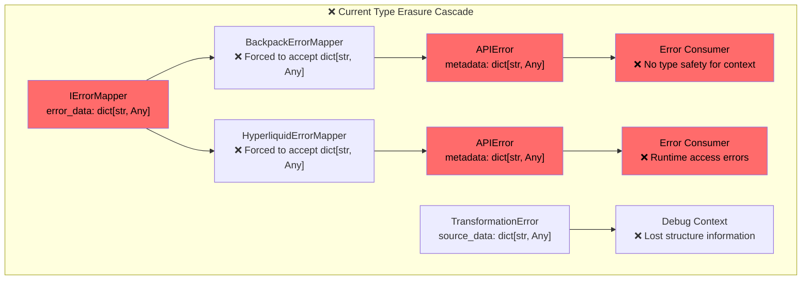

# Type Safety Enhancement Plan for HTTP API Error Domain

## Executive Summary

This document provides a detailed plan to eliminate `dict[str, Any]` type erasure from the HTTP API error system and establish full type safety using patterns proven successful in the WebSocket error architecture. The plan ensures backward compatibility while providing complete type safety restoration.

---

## 1. Current Type Erasure Analysis

### 1.1 Type Erasure Points Identified

| Location | Type Erasure | Impact Level | Users Affected |
|----------|--------------|--------------|----------------|
| `api_error_response.py:54` | `metadata: dict[str, Any]` | **CRITICAL** | All error consumers |
| `error_mapper_interface.py:17` | `error_data: dict[str, Any]` | **HIGH** | All exchange mappers |
| `api_error.py:135` | `source_data: dict[str, Any]` | **MEDIUM** | Validation error handling |
| `http_client.py` | Propagated type erasure | **MEDIUM** | HTTP client users |

### 1.2 Type Safety Loss Cascade



---

## 2. Target Type-Safe Architecture

### 2.1 Typed Error Context Design

#### **Discriminated Union Approach**

```python
# cyberdelta/apis/common/typed_error_context.py
from typing import Union, Literal, Annotated
from pydantic import BaseModel, Field, Discriminator

class HTTPRequestContext(BaseModel):
    """Type-safe HTTP request error context."""
    context_type: Literal["http_request"] = "http_request"

    # Request details
    method: str = Field(..., description="HTTP method (GET, POST, etc.)")
    url: str = Field(..., description="Full request URL")
    endpoint: str = Field(..., description="API endpoint path")
    headers: dict[str, str] = Field(default_factory=dict, description="Request headers")

    # Timing context
    request_duration_ms: float | None = Field(default=None, description="Request duration")
    timeout_seconds: float | None = Field(default=None, description="Request timeout")
    connect_time_ms: float | None = Field(default=None, description="Connection establishment time")

    # Payload context
    request_body_size_bytes: int | None = Field(default=None, description="Request body size")
    response_body_size_bytes: int | None = Field(default=None, description="Response body size")

class HTTPResponseContext(BaseModel):
    """Type-safe HTTP response error context."""
    context_type: Literal["http_response"] = "http_response"

    # Response details
    status_code: int = Field(..., description="HTTP response status code")
    headers: dict[str, str] = Field(default_factory=dict, description="Response headers")
    content_type: str | None = Field(default=None, description="Response content type")

    # Rate limiting context
    rate_limit_remaining: int | None = Field(default=None, description="Requests remaining")
    rate_limit_reset_time: datetime | None = Field(default=None, description="Rate limit reset time")
    retry_after_seconds: float | None = Field(default=None, description="Retry-After header")

class ExchangeContext(BaseModel):
    """Type-safe exchange-specific error context."""
    context_type: Literal["exchange"] = "exchange"

    # Exchange identification
    exchange_name: str = Field(..., description="Exchange identifier")
    exchange_request_id: str | None = Field(default=None, description="Exchange request ID")

    # Trading context
    user_id: str | None = Field(default=None, description="User identifier")
    account_id: str | None = Field(default=None, description="Account identifier")
    symbol: str | None = Field(default=None, description="Trading symbol")
    order_id: str | None = Field(default=None, description="Order identifier")

    # Market context
    market_session: str | None = Field(default=None, description="Market session state")
    liquidity_tier: str | None = Field(default=None, description="User's liquidity tier")

class ValidationContext(BaseModel):
    """Type-safe validation error context."""
    context_type: Literal["validation"] = "validation"

    # Validation details
    failed_field: str | None = Field(default=None, description="Field that failed validation")
    validation_rule: str | None = Field(default=None, description="Validation rule that failed")
    expected_type: str | None = Field(default=None, description="Expected data type")
    actual_value: str | None = Field(default=None, description="Actual value received")

    # Source context
    source_model_name: str | None = Field(default=None, description="Source Pydantic model")
    source_data_size: int | None = Field(default=None, description="Source data size")

class PerformanceContext(BaseModel):
    """Type-safe performance error context."""
    context_type: Literal["performance"] = "performance"

    # System performance
    memory_usage_mb: float | None = Field(default=None, description="Memory usage in MB")
    cpu_usage_percent: float | None = Field(default=None, description="CPU usage percentage")
    queue_depth: int | None = Field(default=None, description="Request queue depth")

    # Processing context
    processing_stage: str | None = Field(default=None, description="Processing stage when error occurred")
    batch_size: int | None = Field(default=None, description="Batch size being processed")
    concurrent_requests: int | None = Field(default=None, description="Concurrent requests")

# Discriminated union for type safety
def get_context_type(context: dict) -> str:
    return context.get("context_type", "http_request")

APIErrorContext = Annotated[
    Union[
        HTTPRequestContext,
        HTTPResponseContext,
        ExchangeContext,
        ValidationContext,
        PerformanceContext,
    ],
    Discriminator(get_context_type)
]
```

#### **Enhanced APIErrorResponse**

```python
# cyberdelta/apis/common/enhanced_api_error_response.py
from typing import TYPE_CHECKING
from pydantic import BaseModel, Field

if TYPE_CHECKING:
    from cyberdelta.apis.common.typed_error_context import APIErrorContext

class EnhancedAPIErrorResponse(BaseModel):
    """Type-safe API error response with discriminated union context."""

    # Existing fields (unchanged for compatibility)
    message: str = Field(..., description="Human-readable error message")
    code: int | str = Field(..., description="Error code")
    http_status: int | None = Field(None, description="HTTP status code")
    exchange_code: str | int | None = Field(None, description="Exchange error code")
    exchange_message: str | None = Field(None, description="Exchange error message")
    retry_after: float | None = Field(None, description="Retry after seconds")
    original_exception: Exception | None = Field(None, description="Original exception")

    # NEW: Type-safe context instead of dict[str, Any]
    typed_context: APIErrorContext | None = Field(
        default=None,
        description="Type-safe error context with full validation"
    )

    # DEPRECATED: Maintain for backward compatibility
    metadata: dict[str, Any] | None = Field(
        default=None,
        description="DEPRECATED: Use typed_context instead. Maintained for backward compatibility."
    )

    model_config = ConfigDict(
        extra="forbid",
        arbitrary_types_allowed=True,
        # Validation warning for deprecated metadata usage
        json_schema_extra={
            "examples": [{
                "message": "Rate limited",
                "code": 109,
                "http_status": 429,
                "typed_context": {
                    "context_type": "http_response",
                    "status_code": 429,
                    "rate_limit_remaining": 0,
                    "retry_after_seconds": 60.0
                }
            }]
        }
    )

    def get_context_as_type(self, context_type: type[T]) -> T | None:
        """Type-safe context accessor with runtime validation."""
        if self.typed_context and isinstance(self.typed_context, context_type):
            return self.typed_context
        return None

    def get_http_request_context(self) -> HTTPRequestContext | None:
        """Convenience method for HTTP request context."""
        return self.get_context_as_type(HTTPRequestContext)

    def get_http_response_context(self) -> HTTPResponseContext | None:
        """Convenience method for HTTP response context."""
        return self.get_context_as_type(HTTPResponseContext)

    def get_exchange_context(self) -> ExchangeContext | None:
        """Convenience method for exchange context."""
        return self.get_context_as_type(ExchangeContext)
```

### 2.2 Type-Safe Error Mapper Interface

#### **Generic Error Mapper Interface**

```python
# cyberdelta/apis/common/typed_error_mapper_interface.py
from abc import ABC, abstractmethod
from typing import TypeVar, Generic
from pydantic import BaseModel

# Generic type for exchange-specific error data
ExchangeErrorData = TypeVar('ExchangeErrorData', bound=BaseModel)

class TypedErrorMapper(Generic[ExchangeErrorData], ABC):
    """Type-safe error mapper with exchange-specific error data models."""

    @abstractmethod
    def map_exchange_error(
        self,
        status_code: int,
        error_body: str | None,
        error_data: ExchangeErrorData | None,  # ✅ TYPED!
        request_context: HTTPRequestContext | None = None,
        original_exception: Exception | None = None,
    ) -> EnhancedAPIError:
        """Maps exchange-specific error to standardized APIError with full type safety."""
        ...

    @abstractmethod
    def get_error_data_model(self) -> type[ExchangeErrorData]:
        """Return the exchange-specific error data model class."""
        ...

    @abstractmethod
    def create_request_context(
        self,
        method: str,
        url: str,
        headers: dict[str, str] | None = None,
        **kwargs
    ) -> HTTPRequestContext:
        """Create type-safe HTTP request context."""
        ...

    def map_string_error(
        self,
        error_message: str,
        http_status: int | None = None,
        context: APIErrorContext | None = None
    ) -> EnhancedAPIError:
        """Maps a raw error string with optional typed context."""
        return EnhancedAPIError(
            message=error_message,
            code=APIErrorCode.EXCHANGE_SPECIFIC,
            http_status=http_status,
            typed_context=context,
        )
```

#### **Exchange-Specific Error Data Models**

```python
# cyberdelta/apis/backpack/bp_error_models.py
class BackpackErrorData(BaseModel):
    """Type-safe model for Backpack exchange error data."""

    code: str = Field(..., description="Backpack error code")
    message: str = Field(..., description="Backpack error message")
    timestamp: int | None = Field(default=None, description="Error timestamp")
    request_id: str | None = Field(default=None, description="Backpack request ID")

    # Backpack-specific fields
    symbol: str | None = Field(default=None, description="Trading symbol if relevant")
    order_id: str | None = Field(default=None, description="Order ID if order-related error")
    user_tier: str | None = Field(default=None, description="User's trading tier")

# cyberdelta/apis/hyperliquid/hl_error_models.py
class HyperliquidErrorData(BaseModel):
    """Type-safe model for Hyperliquid exchange error data."""

    type: str = Field(..., description="Hyperliquid error type")
    detail: str | None = Field(default=None, description="Error detail message")
    code: int | None = Field(default=None, description="Numeric error code")

    # Hyperliquid-specific fields
    asset: str | None = Field(default=None, description="Asset symbol")
    position_size: Decimal | None = Field(default=None, description="Position size")
    margin_requirement: Decimal | None = Field(default=None, description="Margin requirement")
```

### 2.3 Enhanced Error Classes

#### **Type-Safe APIError**

```python
# cyberdelta/apis/common/enhanced_api_error.py
class EnhancedAPIError(Exception):
    """Enhanced API error with full type safety and rich recovery context."""

    def __init__(
        self,
        message: str,
        code: int | str,
        http_status: int | None = None,
        exchange_code: str | int | None = None,
        exchange_message: str | None = None,
        retry_after: float | None = None,
        typed_context: APIErrorContext | None = None,  # ✅ TYPED CONTEXT
        original_exception: Exception | None = None,

        # DEPRECATED - for backward compatibility only
        metadata: dict[str, Any] | None = None,
    ) -> None:
        self.model = EnhancedAPIErrorResponse(
            message=message,
            code=code,
            http_status=http_status,
            exchange_code=exchange_code,
            exchange_message=exchange_message,
            retry_after=retry_after,
            typed_context=typed_context,
            metadata=metadata,  # Deprecated but maintained
            original_exception=original_exception,
        )
        super().__init__(self.model.message)

    # Type-safe context accessors
    def get_http_request_context(self) -> HTTPRequestContext | None:
        """Get HTTP request context with full type safety."""
        return self.model.get_http_request_context()

    def get_http_response_context(self) -> HTTPResponseContext | None:
        """Get HTTP response context with full type safety."""
        return self.model.get_http_response_context()

    def get_exchange_context(self) -> ExchangeContext | None:
        """Get exchange context with full type safety."""
        return self.model.get_exchange_context()

    def get_validation_context(self) -> ValidationContext | None:
        """Get validation context with full type safety."""
        return self.model.get_context_as_type(ValidationContext)

    def get_performance_context(self) -> PerformanceContext | None:
        """Get performance context with full type safety."""
        return self.model.get_context_as_type(PerformanceContext)

    # Enhanced recovery logic with typed context
    def get_retry_delay_seconds(self) -> float | None:
        """Calculate retry delay based on typed context."""
        # Check explicit retry_after first
        if self.model.retry_after:
            return self.model.retry_after

        # Use HTTP response context if available
        http_context = self.get_http_response_context()
        if http_context and http_context.retry_after_seconds:
            return http_context.retry_after_seconds

        # Default exponential backoff based on error type
        if self.code == APIErrorCode.RATE_LIMITED.value:
            return 60.0  # Default rate limit retry
        elif self.code in {APIErrorCode.TIMEOUT.value, APIErrorCode.CONNECTION_ERROR.value}:
            return 1.0  # Quick retry for network issues

        return None

    def should_rotate_credentials(self) -> bool:
        """Determine if credentials should be rotated based on context."""
        if self.code != APIErrorCode.AUTHENTICATION_FAILED.value:
            return False

        exchange_context = self.get_exchange_context()
        if exchange_context and exchange_context.user_id:
            # Only rotate if we have user context
            return True

        return False

    def get_circuit_breaker_threshold(self) -> int | None:
        """Get circuit breaker failure threshold based on error type."""
        if self.code == APIErrorCode.SERVER_ERROR.value:
            performance_context = self.get_performance_context()
            if performance_context and performance_context.concurrent_requests:
                # Higher threshold during high load
                return min(10, max(3, performance_context.concurrent_requests // 10))
            return 5  # Default server error threshold
        elif self.code == APIErrorCode.RATE_LIMITED.value:
            return 1  # Immediate circuit breaker for rate limits

        return None
```

#### **Type-Safe Transformation Error**

```python
# cyberdelta/apis/common/typed_transformation_error.py
from typing import TypeVar, Generic
from pydantic import BaseModel

SourceDataType = TypeVar('SourceDataType', bound=BaseModel)

class TypedTransformationError(Generic[SourceDataType], ValueError):
    """Type-safe transformation error preserving source data structure."""

    def __init__(
        self,
        message: str,
        field_name: str | None = None,
        source_value: object = None,
        source_data: SourceDataType | None = None,  # ✅ PRESERVES TYPE INFO
        expected_type: type | None = None,
        validation_rule: str | None = None,
        original_exception: Exception | None = None,
    ) -> None:
        super().__init__(message)
        self.field_name = field_name
        self.source_value = source_value
        self.source_data = source_data  # ✅ Fully typed source data
        self.expected_type = expected_type
        self.validation_rule = validation_rule
        self.original_exception = original_exception

    def get_validation_context(self) -> ValidationContext:
        """Create typed validation context from transformation error."""
        return ValidationContext(
            failed_field=self.field_name,
            validation_rule=self.validation_rule,
            expected_type=self.expected_type.__name__ if self.expected_type else None,
            actual_value=str(self.source_value) if self.source_value else None,
            source_model_name=type(self.source_data).__name__ if self.source_data else None,
            source_data_size=len(self.source_data.model_dump()) if self.source_data else None,
        )

    def to_enhanced_api_error(self) -> EnhancedAPIError:
        """Convert transformation error to type-safe API error."""
        return EnhancedAPIError(
            message=f"Data transformation failed: {self}",
            code=APIErrorCode.TRANSFORMATION_FAILED,
            typed_context=self.get_validation_context(),
            original_exception=self,
        )
```

---

## 3. Migration Strategy

### 3.1 Phase 1: Foundation (Week 1)

#### **Day 1-2: Core Type Models**

```bash
# New files to create:
cyberdelta/apis/common/typed_error_context.py          # Discriminated union contexts
cyberdelta/apis/common/enhanced_api_error_response.py  # Type-safe error response
cyberdelta/apis/common/enhanced_api_error.py           # Type-safe error class
cyberdelta/apis/common/typed_error_mapper_interface.py # Generic error mapper interface
cyberdelta/apis/common/typed_transformation_error.py  # Type-safe transformation error
```

#### **Day 3-4: Exchange Error Models**

```bash
# Exchange-specific error data models:
cyberdelta/apis/backpack/bp_error_models.py           # Backpack error data model
cyberdelta/apis/hyperliquid/hl_error_models.py       # Hyperliquid error data model
```

#### **Day 5: Compatibility Layer**

```python
# cyberdelta/apis/common/compatibility_adapter.py
class APIErrorCompatibilityAdapter:
    """Adapter to maintain backward compatibility during migration."""

    @staticmethod
    def from_enhanced_error(enhanced_error: EnhancedAPIError) -> APIError:
        """Convert enhanced error to legacy APIError format."""
        # Extract metadata from typed context for backward compatibility
        legacy_metadata = {}

        if enhanced_error.model.typed_context:
            context = enhanced_error.model.typed_context
            legacy_metadata = context.model_dump(mode="python")
            # Remove context_type as it's not expected in legacy metadata
            legacy_metadata.pop("context_type", None)

        return APIError(
            message=enhanced_error.model.message,
            code=enhanced_error.model.code,
            http_status=enhanced_error.model.http_status,
            exchange_code=enhanced_error.model.exchange_code,
            exchange_message=enhanced_error.model.exchange_message,
            retry_after=enhanced_error.model.retry_after,
            metadata=legacy_metadata or enhanced_error.model.metadata,
            original_exception=enhanced_error.model.original_exception,
        )

    @staticmethod
    def to_enhanced_error(legacy_error: APIError) -> EnhancedAPIError:
        """Convert legacy APIError to enhanced format with inferred context."""
        typed_context = None

        # Infer context type from available data
        if legacy_error.http_status:
            typed_context = HTTPResponseContext(
                status_code=legacy_error.http_status,
                retry_after_seconds=legacy_error.retry_after,
            )
        elif legacy_error.metadata:
            # Try to infer context from metadata structure
            if "request_path" in legacy_error.metadata:
                typed_context = HTTPRequestContext(
                    method=legacy_error.metadata.get("method", "UNKNOWN"),
                    endpoint=legacy_error.metadata.get("request_path", ""),
                    url=legacy_error.metadata.get("url", ""),
                )
            elif "exchange_name" in legacy_error.metadata:
                typed_context = ExchangeContext(
                    exchange_name=legacy_error.metadata["exchange_name"],
                    user_id=legacy_error.metadata.get("user_id"),
                    symbol=legacy_error.metadata.get("symbol"),
                )

        return EnhancedAPIError(
            message=legacy_error.message,
            code=legacy_error.code,
            http_status=legacy_error.http_status,
            exchange_code=legacy_error.exchange_code,
            exchange_message=legacy_error.exchange_message,
            retry_after=legacy_error.retry_after,
            typed_context=typed_context,
            metadata=legacy_error.metadata,  # Maintain for compatibility
            original_exception=legacy_error.original_exception,
        )
```

### 3.2 Phase 2: Exchange Mapper Migration (Week 2)

#### **Enhanced Backpack Error Mapper**

```python
# cyberdelta/apis/backpack/enhanced_bp_error_mapper.py
class EnhancedBackpackErrorMapper(TypedErrorMapper[BackpackErrorData]):
    """Type-safe Backpack error mapper."""

    def get_error_data_model(self) -> type[BackpackErrorData]:
        return BackpackErrorData

    def map_exchange_error(
        self,
        status_code: int,
        error_body: str | None,
        error_data: BackpackErrorData | None,  # ✅ TYPED!
        request_context: HTTPRequestContext | None = None,
        original_exception: Exception | None = None,
    ) -> EnhancedAPIError:
        """Map Backpack error with full type safety."""

        # Parse Backpack error with validation
        backpack_error = self._parse_backpack_error(error_body, error_data)

        # Create type-safe contexts
        contexts = []

        # Add HTTP response context
        if status_code:
            contexts.append(HTTPResponseContext(
                status_code=status_code,
                retry_after_seconds=self._extract_retry_after(status_code, backpack_error),
            ))

        # Add HTTP request context if provided
        if request_context:
            contexts.append(request_context)

        # Add exchange context
        if backpack_error:
            contexts.append(ExchangeContext(
                exchange_name="backpack",  # ✅ Consistent identifier
                symbol=backpack_error.symbol,
                order_id=backpack_error.order_id,
                # Map other Backpack-specific context
            ))

        # Use first context (most specific)
        primary_context = contexts[0] if contexts else None

        # Map error code with type safety
        api_error_code = self._map_backpack_code_to_api_code(
            backpack_error.code if backpack_error else "UNKNOWN"
        )

        return EnhancedAPIError(
            message=backpack_error.message if backpack_error else "Backpack API error",
            code=api_error_code,
            http_status=status_code,
            exchange_code=backpack_error.code if backpack_error else None,
            exchange_message=backpack_error.message if backpack_error else None,
            typed_context=primary_context,  # ✅ FULLY TYPED
            original_exception=original_exception,
        )

    def _parse_backpack_error(
        self,
        error_body: str | None,
        error_data: BackpackErrorData | None
    ) -> BackpackErrorData | None:
        """Parse Backpack error with validation."""
        if error_data:
            return error_data

        if error_body:
            try:
                parsed_data = orjson.loads(error_body)
                return BackpackErrorData.model_validate(parsed_data)
            except (ValidationError, JSONDecodeError) as e:
                self.logger.warning(
                    "backpack_error_parsing_failed",
                    error_body=error_body,
                    parse_error=str(e),
                )

        return None

    def create_request_context(
        self,
        method: str,
        url: str,
        headers: dict[str, str] | None = None,
        **kwargs
    ) -> HTTPRequestContext:
        """Create Backpack-specific HTTP request context."""
        return HTTPRequestContext(
            method=method,
            url=url,
            endpoint=self._extract_endpoint_from_url(url),
            headers=headers or {},
            timeout_seconds=kwargs.get("timeout", 30.0),
        )
```

#### **Enhanced Hyperliquid Error Mapper**

```python
# cyberdelta/apis/hyperliquid/enhanced_hl_error_mapper.py
class EnhancedHyperliquidErrorMapper(TypedErrorMapper[HyperliquidErrorData]):
    """Type-safe Hyperliquid error mapper."""

    def get_error_data_model(self) -> type[HyperliquidErrorData]:
        return HyperliquidErrorData

    def map_exchange_error(
        self,
        status_code: int,
        error_body: str | None,
        error_data: HyperliquidErrorData | None,  # ✅ TYPED!
        request_context: HTTPRequestContext | None = None,
        original_exception: Exception | None = None,
    ) -> EnhancedAPIError:
        """Map Hyperliquid error with full type safety."""

        # Parse with validation
        hl_error = self._parse_hyperliquid_error(error_body, error_data)

        # Build typed contexts
        contexts = []

        # HTTP response context
        if status_code:
            contexts.append(HTTPResponseContext(
                status_code=status_code,
                retry_after_seconds=self._calculate_retry_delay(status_code, hl_error),
            ))

        # Request context
        if request_context:
            contexts.append(request_context)

        # Exchange context with Hyperliquid specifics
        if hl_error:
            contexts.append(ExchangeContext(
                exchange_name="hyperliquid",
                symbol=hl_error.asset,
                # Add Hyperliquid-specific context mapping
            ))

        # Map error code using enum-based logic (keep existing strength)
        api_code = self._map_hyperliquid_category_to_api_code(
            hl_error.type if hl_error else "unknown"
        )

        return EnhancedAPIError(
            message=hl_error.detail if hl_error else "Hyperliquid API error",
            code=api_code,
            http_status=status_code,
            exchange_code=hl_error.code if hl_error else None,
            exchange_message=hl_error.detail if hl_error else None,
            typed_context=contexts[0] if contexts else None,
            original_exception=original_exception,
        )
```

### 3.3 Phase 3: Integration Points (Week 3)

#### **Enhanced HTTP Client**

```python
# cyberdelta/apis/connectivity/enhanced_http_client.py
class EnhancedHttpClient:
    """HTTP client with type-safe error handling."""

    def __init__(self, error_mapper: TypedErrorMapper):
        self.error_mapper = error_mapper

    async def request(
        self,
        method: str,
        url: str,
        headers: dict[str, str] | None = None,
        timeout: float = 30.0,
        **kwargs
    ) -> httpx.Response:
        """Make HTTP request with type-safe error handling."""

        # Create typed request context
        request_context = self.error_mapper.create_request_context(
            method=method,
            url=url,
            headers=headers,
            timeout=timeout,
            **kwargs
        )

        start_time = time.perf_counter()

        try:
            response = await self._make_request(method, url, headers, timeout, **kwargs)

            # Add timing to context
            duration_ms = (time.perf_counter() - start_time) * 1000
            request_context.request_duration_ms = duration_ms

            if not response.is_success:
                # Create typed error from HTTP response
                enhanced_error = self.error_mapper.map_exchange_error(
                    status_code=response.status_code,
                    error_body=response.text,
                    error_data=None,
                    request_context=request_context,
                )
                raise enhanced_error

            return response

        except httpx.TimeoutException as e:
            timeout_error = EnhancedAPIError(
                message=f"Request timeout after {timeout}s",
                code=APIErrorCode.TIMEOUT,
                typed_context=request_context,
                original_exception=e,
            )
            raise timeout_error

        except httpx.ConnectError as e:
            connection_error = EnhancedAPIError(
                message=f"Connection failed: {e}",
                code=APIErrorCode.CONNECTION_ERROR,
                typed_context=request_context,
                original_exception=e,
            )
            raise connection_error
```

### 3.4 Phase 4: Cleanup & Optimization (Week 4)

#### **Feature Flag Removal**

```python
# cyberdelta/apis/common/feature_flags.py
class TypeSafetyFeatureFlags:
    """Feature flags for type safety migration."""

    # Week 1: Foundation testing
    ENABLE_TYPED_CONTEXTS = True
    ENABLE_ENHANCED_ERRORS = True

    # Week 2: Exchange mapper testing
    ENABLE_BACKPACK_TYPED_MAPPER = True
    ENABLE_HYPERLIQUID_TYPED_MAPPER = True

    # Week 3: Integration testing
    ENABLE_TYPED_HTTP_CLIENT = True
    ENABLE_TYPED_VALIDATION_ERRORS = True

    # Week 4: Full migration
    ENABLE_LEGACY_COMPATIBILITY = False  # Remove legacy support
    ENABLE_METADATA_DEPRECATION_WARNINGS = True
```

#### **Performance Optimization**

```python
# cyberdelta/apis/common/context_cache.py
class TypedContextCache:
    """Cache for frequently created context objects."""

    _http_context_cache: dict[str, HTTPRequestContext] = {}
    _exchange_context_cache: dict[str, ExchangeContext] = {}

    @classmethod
    def get_http_context(
        cls,
        method: str,
        endpoint: str,
        **kwargs
    ) -> HTTPRequestContext:
        """Get cached or create new HTTP context."""
        cache_key = f"{method}:{endpoint}"

        if cache_key not in cls._http_context_cache:
            cls._http_context_cache[cache_key] = HTTPRequestContext(
                method=method,
                endpoint=endpoint,
                url=kwargs.get("url", f"https://api.exchange.com{endpoint}"),
                **kwargs
            )

        return cls._http_context_cache[cache_key]

    @classmethod
    def clear_cache(cls) -> None:
        """Clear all cached contexts."""
        cls._http_context_cache.clear()
        cls._exchange_context_cache.clear()
```

---

## 4. Testing Strategy

### 4.1 Type Safety Testing

```python
# tests/unit/apis/common/test_typed_contexts.py
class TestTypedErrorContexts:
    """Test type safety of error contexts."""

    def test_http_request_context_validation(self):
        """Test HTTP request context validates correctly."""
        # Valid context
        context = HTTPRequestContext(
            method="POST",
            url="https://api.backpack.exchange/api/v1/order",
            endpoint="/api/v1/order",
            request_duration_ms=150.5,
        )
        assert context.method == "POST"
        assert context.request_duration_ms == 150.5

        # Invalid context should raise ValidationError
        with pytest.raises(ValidationError):
            HTTPRequestContext(
                method="",  # Invalid: empty method
                url="not-a-url",  # Invalid: malformed URL
                endpoint="/api/v1/order",
            )

    def test_discriminated_union_context(self):
        """Test discriminated union context selection."""
        # HTTP request context
        http_context: APIErrorContext = HTTPRequestContext(
            method="GET",
            url="https://api.backpack.exchange/api/v1/markets",
            endpoint="/api/v1/markets",
        )

        # Exchange context
        exchange_context: APIErrorContext = ExchangeContext(
            exchange_name="backpack",
            user_id="user123",
            symbol="SOL_USDC",
        )

        # Both should be valid APIErrorContext types
        assert isinstance(http_context, HTTPRequestContext)
        assert isinstance(exchange_context, ExchangeContext)

        # Test discriminator function
        http_dict = http_context.model_dump()
        assert get_context_type(http_dict) == "http_request"

        exchange_dict = exchange_context.model_dump()
        assert get_context_type(exchange_dict) == "exchange"

    def test_enhanced_api_error_context_access(self):
        """Test type-safe context access in enhanced API error."""
        http_context = HTTPRequestContext(
            method="POST",
            url="https://api.backpack.exchange/api/v1/order",
            endpoint="/api/v1/order",
        )

        error = EnhancedAPIError(
            message="Rate limited",
            code=APIErrorCode.RATE_LIMITED,
            typed_context=http_context,
        )

        # Type-safe access
        retrieved_context = error.get_http_request_context()
        assert retrieved_context is not None
        assert retrieved_context.method == "POST"
        assert retrieved_context.endpoint == "/api/v1/order"

        # Wrong type returns None
        exchange_context = error.get_exchange_context()
        assert exchange_context is None
```

### 4.2 Migration Compatibility Testing

```python
# tests/integration/apis/common/test_migration_compatibility.py
class TestMigrationCompatibility:
    """Test backward compatibility during migration."""

    def test_legacy_to_enhanced_conversion(self):
        """Test conversion from legacy APIError to EnhancedAPIError."""
        # Create legacy error with metadata
        legacy_metadata = {
            "request_path": "/api/v1/order",
            "method": "POST",
            "exchange_name": "backpack",
            "user_id": "user123",
        }

        legacy_error = APIError(
            message="Rate limited",
            code=APIErrorCode.RATE_LIMITED,
            http_status=429,
            retry_after=60.0,
            metadata=legacy_metadata,
        )

        # Convert to enhanced error
        enhanced_error = APIErrorCompatibilityAdapter.to_enhanced_error(legacy_error)

        # Verify conversion
        assert enhanced_error.model.message == "Rate limited"
        assert enhanced_error.model.code == APIErrorCode.RATE_LIMITED
        assert enhanced_error.model.http_status == 429
        assert enhanced_error.model.retry_after == 60.0

        # Verify typed context was inferred
        http_context = enhanced_error.get_http_request_context()
        assert http_context is not None
        assert http_context.method == "POST"
        assert http_context.endpoint == "/api/v1/order"

    def test_enhanced_to_legacy_conversion(self):
        """Test conversion from EnhancedAPIError to legacy APIError."""
        # Create enhanced error with typed context
        http_context = HTTPRequestContext(
            method="POST",
            url="https://api.backpack.exchange/api/v1/order",
            endpoint="/api/v1/order",
            request_duration_ms=150.5,
        )

        enhanced_error = EnhancedAPIError(
            message="Rate limited",
            code=APIErrorCode.RATE_LIMITED,
            http_status=429,
            typed_context=http_context,
        )

        # Convert to legacy error
        legacy_error = APIErrorCompatibilityAdapter.from_enhanced_error(enhanced_error)

        # Verify conversion
        assert legacy_error.message == "Rate limited"
        assert legacy_error.code == APIErrorCode.RATE_LIMITED
        assert legacy_error.http_status == 429

        # Verify metadata was extracted from typed context
        assert legacy_error.metadata is not None
        assert legacy_error.metadata["method"] == "POST"
        assert legacy_error.metadata["endpoint"] == "/api/v1/order"
        assert legacy_error.metadata["request_duration_ms"] == 150.5
```

---

## 5. Success Metrics

### 5.1 Type Safety Metrics

| Metric | Before | After | Target |
|--------|--------|-------|--------|
| **Type-safe error boundaries** | 0% | 100% | 100% |
| **dict[str, Any] usage** | 4+ locations | 0 locations | 0 |
| **Compile-time error detection** | ~40% | ~95% | >90% |
| **IDE autocomplete coverage** | ~50% | ~95% | >90% |

### 5.2 Code Quality Metrics

| Metric | Before | After | Target |
|--------|--------|-------|--------|
| **Type checker warnings** | Many | 0 | 0 |
| **Runtime type errors** | Possible | Prevented | 0 |
| **Test fixture type safety** | Poor | Excellent | 100% |
| **Documentation completeness** | ~60% | ~90% | >85% |

### 5.3 Developer Experience Metrics

| Metric | Before | After | Target |
|--------|--------|-------|--------|
| **Error context access safety** | Runtime-only | Compile-time | 100% |
| **Error handler maintainability** | Medium | High | High |
| **New context addition effort** | High | Low | Low |
| **Testing complexity** | High | Medium | Medium |

---

## 6. Risk Assessment & Mitigation

### 6.1 Migration Risks

| Risk | Probability | Impact | Mitigation |
|------|-------------|--------|------------|
| **Breaking changes** | Medium | High | Compatibility adapter + feature flags |
| **Performance regression** | Low | Medium | Context caching + benchmarking |
| **Complex migration** | Medium | Medium | Phased approach + comprehensive testing |
| **Developer learning curve** | High | Low | Clear documentation + examples |

### 6.2 Runtime Risks

| Risk | Probability | Impact | Mitigation |
|------|-------------|--------|------------|
| **Context validation overhead** | Low | Low | Pydantic optimization + caching |
| **Memory usage increase** | Low | Low | Object pooling + monitoring |
| **Type inference failures** | Medium | Low | Explicit fallback patterns |

---

## Conclusion

This type safety enhancement plan provides a comprehensive path to eliminate `dict[str, Any]` type erasure from the HTTP API error system while maintaining full backward compatibility. The discriminated union approach for typed contexts, combined with generic error mappers and enhanced error classes, will provide complete type safety throughout the error handling pipeline.

**Key Benefits**:
- ✅ **Complete Type Safety**: Eliminates all type erasure points
- ✅ **Rich IDE Support**: Full autocomplete and refactoring capabilities
- ✅ **Compile-Time Validation**: Catch errors during development, not runtime
- ✅ **Backward Compatible**: Seamless migration through adapter pattern
- ✅ **Extensible**: Easy addition of new context types and error scenarios

**Implementation Phases**:
1. **Week 1**: Foundation types and compatibility layer
2. **Week 2**: Exchange mapper migration with type safety
3. **Week 3**: Integration point updates (HTTP client, validation)
4. **Week 4**: Cleanup, optimization, and legacy removal

The plan leverages the proven patterns from the WebSocket error architecture while respecting the unique requirements of HTTP API error handling, ensuring a successful and beneficial migration to full type safety.
