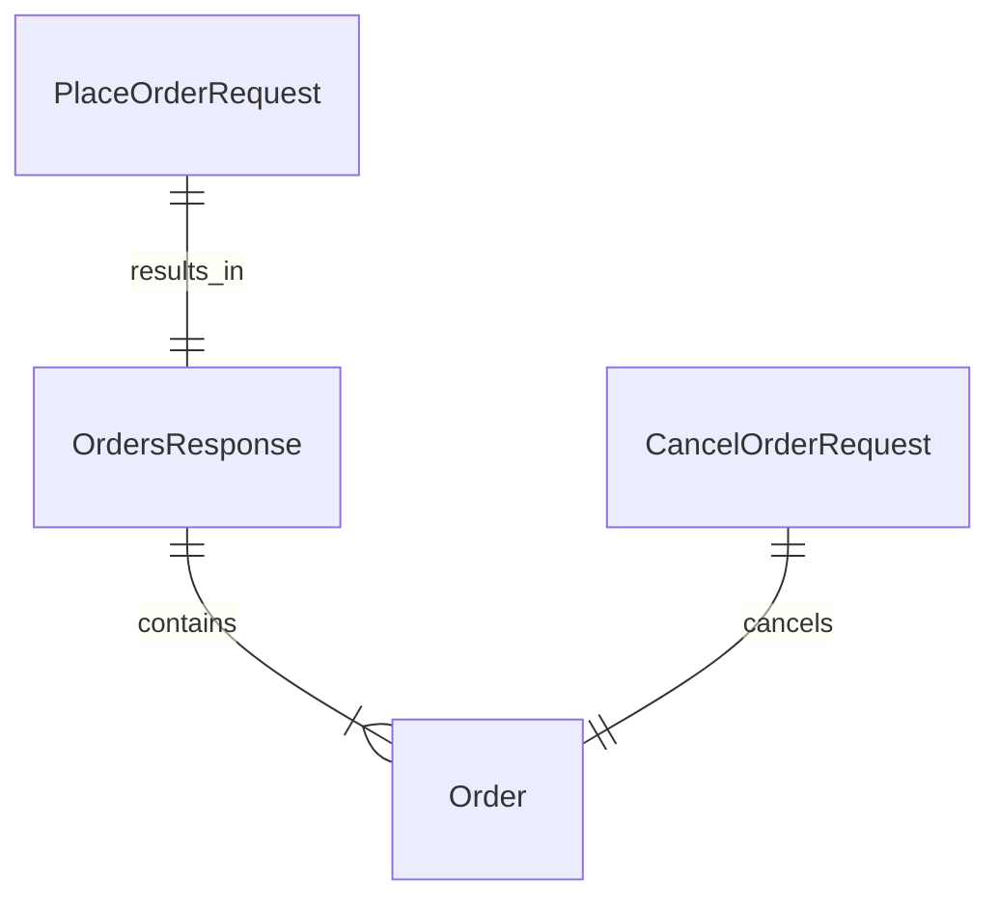
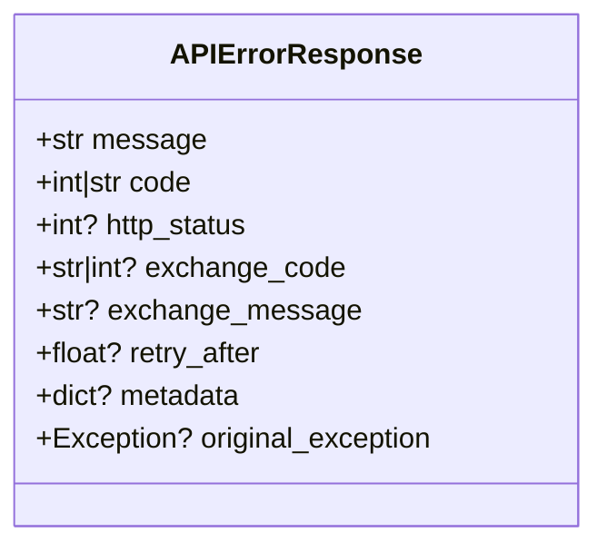
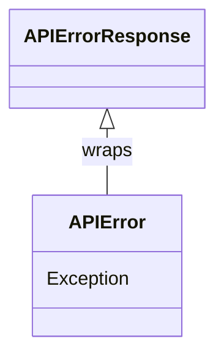
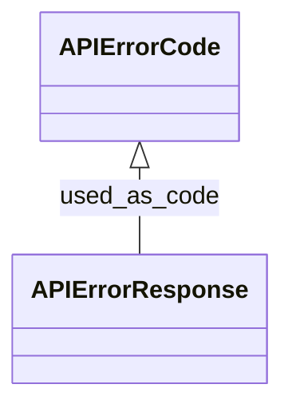
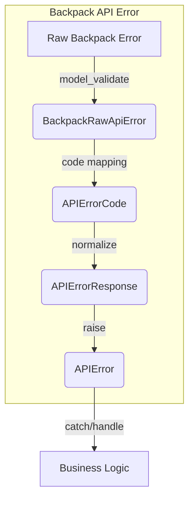
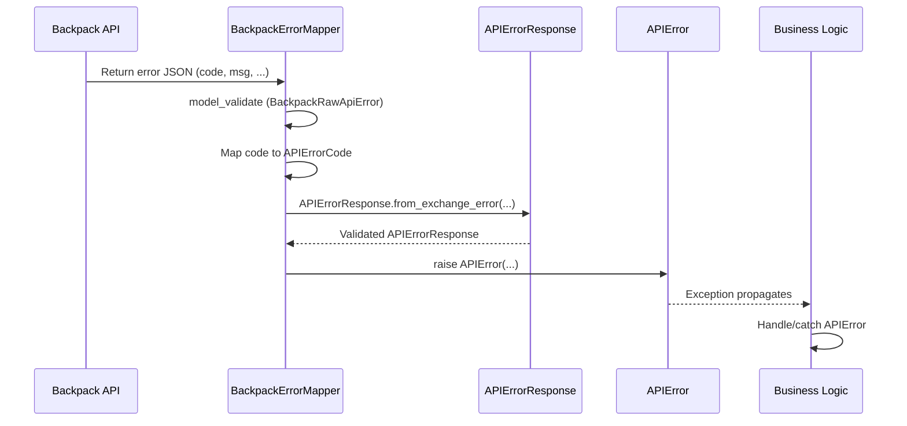
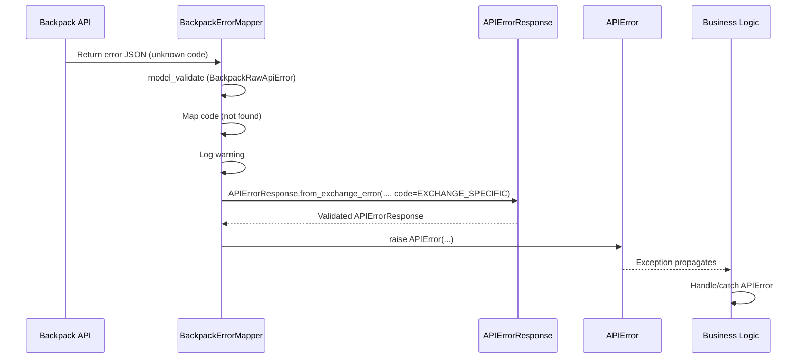
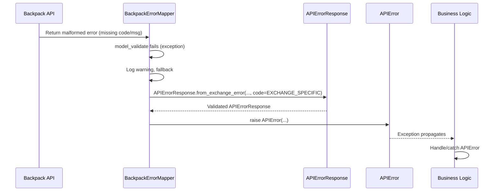
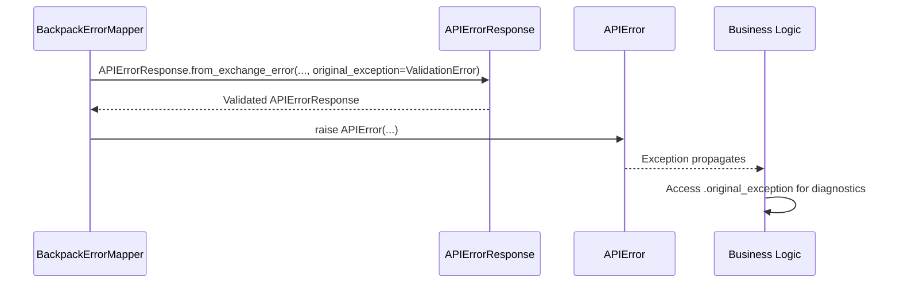

# CyberDeltaEngine API Models & Error Handling Architecture

## Overview
This document explains the core API models in `cyberdelta/apis/models/api.py`, their logic, and how they enable robust, type-safe, and maintainable error handling and API boundary management. It also details how `backpack.py` and the error code enums align with this architecture.

---

## 1. API Models in `api.py`

### 1.1. **Order and Request Models**

- **`PlaceOrderRequest`**: Pydantic model for placing new orders. All financial fields use `Decimal` for precision. Includes symbol, side, order type, quantity, price, time-in-force, and flags for reduce/post-only.
- **`CancelOrderRequest`**: For canceling orders, with order ID and optional symbol.
- **`OrdersResponse`**: Batch response for multiple orders, with pagination support.
- **`WebSocketMessage`**: Envelope for WebSocket messages, supporting both dict and list payloads.

#### **Mermaid: Order Request/Response**


### 1.2. **Error Handling Model**

- **`APIErrorResponse`**: The canonical model for all error responses. Used for validation, normalization, and transport of error information from any exchange. Fields:
  - `message`: Human-readable error message
  - `code`: Canonical error code (int or str)
  - `http_status`: HTTP status code
  - `exchange_code`: Raw exchange error code (str or int)
  - `exchange_message`: Raw exchange error message
  - `retry_after`: For rate limits
  - `metadata`: Additional context
  - `original_exception`: Chained exception (optional)
- **Validation**: The `validate_code` method ensures the code is always int or str, never float or None.
- **Factory**: `from_exchange_error` is the preferred way to construct this model from raw error data.

#### **Mermaid: Error Model**


### 1.3. **Other Models**
- **`PaginatedResponse[T]`**: Generic paginated response for lists.
- **`BackpackPlaceOrderRequest`/`HyperliquidPlaceOrderRequest`**: Exchange-specific extensions of `PlaceOrderRequest`.
- **WebSocket Event Models**: `AccountUpdateEvent`, `OrderUpdateEvent`, `TradeFillEvent` for real-time updates.
- **`RateLimiterConfig`**: For rate limiting configuration.
- **`ExchangeAPIConfig`**: For exchange connection/configuration.
- **`APIError`**: Custom exception that wraps an `APIErrorResponse` and exposes its fields as properties. Used for all error propagation.

#### **Mermaid: Exception Wrapping**


---

## 2. Error Code Enums

### 2.1. **`APIErrorCode`**
- Central enum for all canonical error codes in CyberDeltaEngine.
- Groups: Network/Transport (0-99), Market/Business Logic (100-199), Unknown/Misc (200+).
- Used as the `code` in `APIErrorResponse` for cross-exchange consistency.

#### **Mermaid: Error Code Usage**


### 2.2. **`BackpackAPIErrorCode`**
- Enum of all Backpack-specific error codes, mirroring the official Backpack OpenAPI spec.
- Used for strict validation and mapping in Backpack integration.

---

## 3. Alignment: `backpack.py` and Error Handling Flow

### 3.1. **BackpackErrorMapper**
- Maps Backpack error codes (from `BackpackAPIErrorCode`) to `APIErrorCode`.
- Validates and normalizes all error data using `APIErrorResponse.from_exchange_error`.
- Raises `APIError` with all validated fields, ensuring type safety and maintainability.
- Logs ambiguous/unmapped codes for diagnostics.

#### **Mermaid: Error Handling Flow**


### 3.2. **Integration Points**
- All API methods in `BackpackAPI` use this error handling flow for robust, unified error propagation.
- The same pattern is intended for all future exchange integrations.

---

## 4. Summary Table
| Model/Class                | Purpose/Role                                              |
|----------------------------|----------------------------------------------------------|
| PlaceOrderRequest          | Order placement request (validated, precise)             |
| CancelOrderRequest         | Order cancellation request                               |
| OrdersResponse             | Batch order response                                     |
| WebSocketMessage           | Envelope for WS messages                                 |
| APIErrorResponse           | Canonical error model (validation, normalization)        |
| APIError                   | Exception wrapping APIErrorResponse                      |
| APIErrorCode               | Canonical error code enum                                |
| BackpackAPIErrorCode       | Backpack-specific error code enum                        |
| BackpackErrorMapper        | Maps Backpack errors to canonical model/exception        |

---

## 5. Extensibility
- The architecture is designed for easy extension to new exchanges and error types.
- All error handling is centralized, type-safe, and testable.

---

## 6. Detailed Error Handling Sequences & Edge Cases

### 6.1. **Standard Error Handling Sequence**

#### **Scenario:**
A Backpack API call returns an error payload with a known error code.



### 6.2. **Edge Case: Unmapped or Ambiguous Error Code**

- **What happens:**
  - The error code from Backpack is not in the mapping table.
  - `BackpackErrorMapper` logs a warning and maps to `APIErrorCode.EXCHANGE_SPECIFIC`.



### 6.3. **Edge Case: Malformed or Unexpected Error Payload**

- **What happens:**
  - The error payload is missing required fields or is not a dict.
  - `BackpackErrorMapper` logs a warning and falls back to heuristics or generic error handling.



### 6.4. **Edge Case: Chained Exceptions**

- **What happens:**
  - An original exception (e.g., network error, validation error) is passed as `original_exception`.
  - This is preserved in `APIErrorResponse` and accessible via `APIError.original_exception`.



---

## 7. Concrete Example: Error Transformation

### **Example: Backpack Rate Limit Error**

**Raw Backpack Error:**
```json
{
  "code": "TOO_MANY_REQUESTS",
  "msg": "Rate limit exceeded. Please try again later."
}
```

**Transformation Flow:**
1. `BackpackRawApiError.model_validate` parses the payload.
2. `BackpackErrorMapper` maps `TOO_MANY_REQUESTS` to `APIErrorCode.RATE_LIMITED` (109).
3. `APIErrorResponse.from_exchange_error` creates a validated error model:
   ```python
   APIErrorResponse(
       message="Rate limit exceeded. Please try again later.",
       code=109,
       http_status=None,
       exchange_code="TOO_MANY_REQUESTS",
       exchange_message="Rate limit exceeded. Please try again later.",
       retry_after=None,
       metadata=None,
       original_exception=None,
   )
   ```
4. `APIError` is raised with this model, and business logic can catch and handle it.

---

## 8. Extending the System: Adding New Exchanges or Error Types

- **To add a new exchange:**
  1. Implement a new error code enum for the exchange (if needed).
  2. Create an error mapper that maps exchange-specific codes to `APIErrorCode`.
  3. Use `APIErrorResponse.from_exchange_error` for all error normalization.
  4. Always raise `APIError` for unified propagation.
- **To add a new error type:**
  1. Add the new code to `APIErrorCode` (and update mapping tables).
  2. Update error mappers to recognize and map the new code.
  3. Add tests for the new error scenario.

---

## 9. Best Practices & Defensive Programming Notes
- Always validate external error payloads with Pydantic models.
- Log and handle unmapped or malformed errors gracefully.
- Preserve original exceptions for diagnostics.
- Use type-safe enums and models for all error handling.
- Document new error codes and mapping logic in both code and workflow docs.

---

*This enhanced documentation includes detailed sequence diagrams, edge-case handling, and extensibility guidance. Review regularly as the system evolves.* 