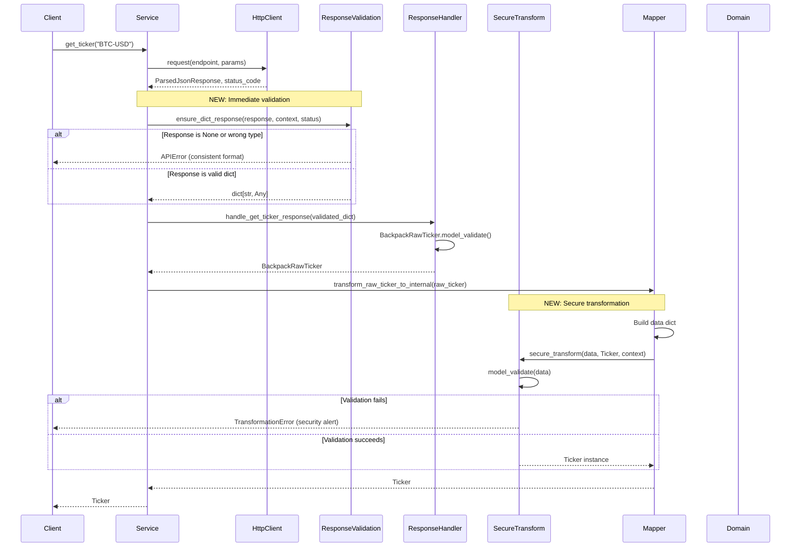
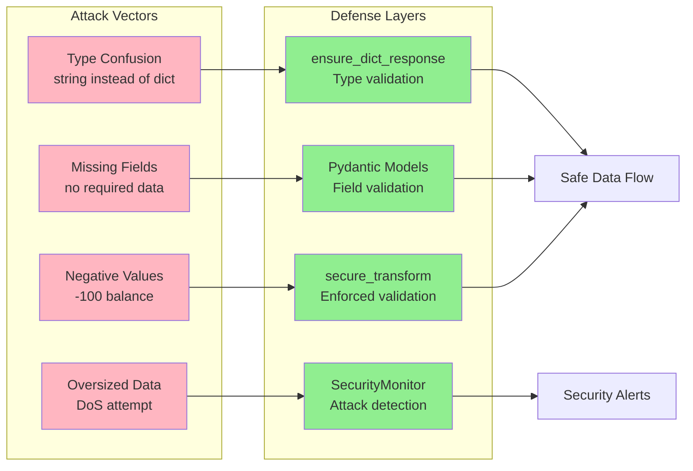
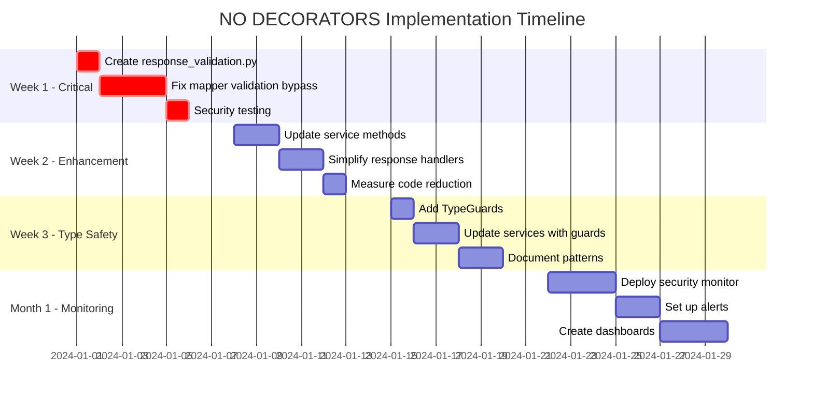
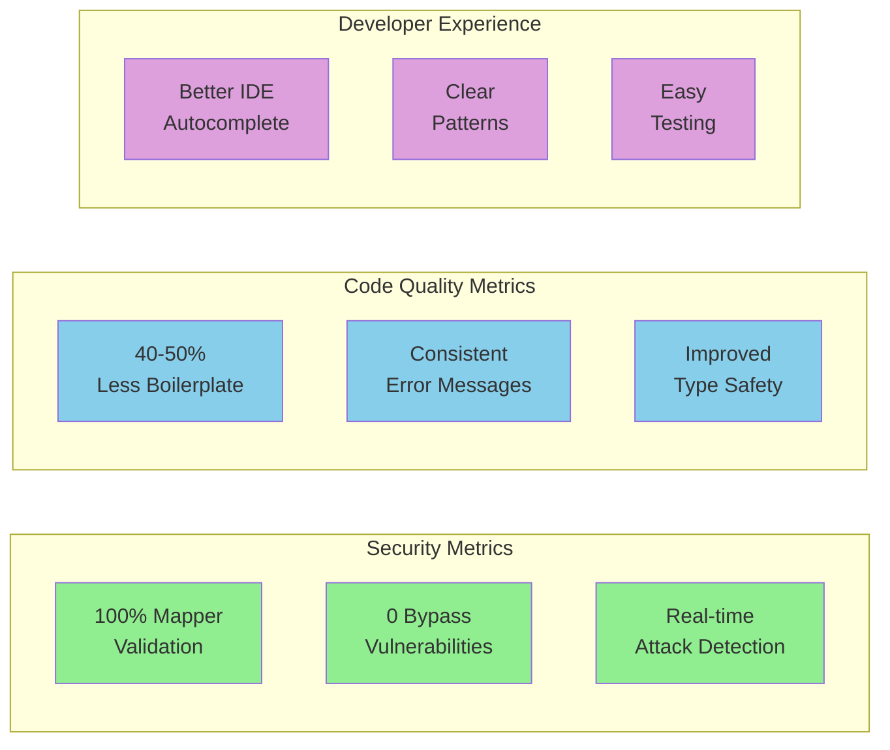

# NO DECORATORS Solution - Visual Guide & Analysis

## Document Analysis & Validation

After thorough review of the NO DECORATORS solution documents, I can confirm the approach is **solid and sound**. This visual guide provides diagrams and analysis to complement the implementation documents.

## Solution Overview

### ✅ **Strengths**:

1. **Architecturally Sound**: 
   - Accepts ParsedJsonResponse as correct for exchange agnosticism
   - Doesn't break existing patterns
   - Works with current HttpClient → Service → ResponseHandler → Mapper flow

2. **Security Focused**:
   - Addresses the CRITICAL validation bypass vulnerability in mappers
   - Provides centralized logging for security monitoring
   - Enables attack pattern detection

3. **Practical & Incremental**:
   - Can be adopted gradually without breaking changes
   - Uses simple utility functions instead of complex decorators
   - Leverages existing `secure_transform` utility

4. **Clear Benefits**:
   - 40-50% reduction in boilerplate code
   - Consistent error messages
   - Better IDE support with TypeGuards
   - Real-time security monitoring

## Data Flow Sequence Diagram



## Implementation Flow Diagram

```mermaid
flowchart TB
    Start([Start Implementation])
    
    Start --> Week1[Week 1: Critical Security Fixes]
    
    Week1 --> CreateUtils[Create response_validation.py]
    Week1 --> UseSecure[Use secure_transform in mappers]
    Week1 --> FixMappers[Fix 47+ mapper methods]
    
    CreateUtils --> ValidUtils{Validation Utilities}
    ValidUtils --> |ensure_dict_response| Dict[Validate Dict Responses]
    ValidUtils --> |ensure_list_response| List[Validate List Responses]
    ValidUtils --> |validate_required_fields| Fields[Check Required Fields]
    
    UseSecure --> BeforeAfter{Mapper Pattern}
    BeforeAfter --> |Before| Direct[Direct Instantiation<br/>❌ Bypasses Validation]
    BeforeAfter --> |After| Secure[secure_transform()<br/>✅ Enforces Validation]
    
    FixMappers --> Security[Security Fixed!]
    
    Security --> Week2[Week 2: Code Enhancement]
    
    Week2 --> UpdateServices[Update Service Methods]
    Week2 --> SimplifyHandlers[Simplify Response Handlers]
    
    UpdateServices --> ServicePattern{Service Pattern}
    ServicePattern --> |Before| Manual[Manual Validation<br/>10+ lines of code]
    ServicePattern --> |After| Central[Centralized Validation<br/>1 line of code]
    
    SimplifyHandlers --> Clean[40-50% Less Boilerplate]
    
    Clean --> Week3[Week 3: Type Safety]
    
    Week3 --> AddGuards[Add TypeGuards]
    Week3 --> UseGuards[Use in Services]
    Week3 --> Document[Document Patterns]
    
    AddGuards --> Guards{TypeGuard Functions}
    Guards --> |is_dict_response| DictGuard[Type Narrowing]
    Guards --> |is_list_response| ListGuard[IDE Support]
    
    UseGuards --> Better[Better Developer Experience]
    
    Better --> Month1[Month 1: Monitoring]
    
    Month1 --> Deploy[Deploy SecurityMonitor]
    Month1 --> Alerts[Set Up Alerts]
    Month1 --> Dash[Create Dashboards]
    
    Deploy --> Monitor{Security Monitoring}
    Monitor --> |Track| Events[Validation Events]
    Monitor --> |Detect| Attacks[Attack Patterns]
    Monitor --> |Alert| Failures[Multiple Failures]
    
    Alerts --> Success([Success!<br/>✅ Secure<br/>✅ Type-safe<br/>✅ Less code<br/>✅ Monitored])
    
    style Start fill:#90EE90
    style Security fill:#FFB6C1
    style Clean fill:#87CEEB
    style Better fill:#DDA0DD
    style Success fill:#90EE90
    style Direct fill:#FFB6C1
    style Manual fill:#FFB6C1
```

## Architecture Comparison

```mermaid
graph TB
    subgraph "CURRENT ARCHITECTURE (With Problems)"
        HC1[HttpClient] -->|ParsedJsonResponse| S1[Service]
        S1 -->|Unvalidated| RH1[ResponseHandler]
        RH1 -->|Validates| RM1[Raw Model]
        RM1 --> M1[Mapper]
        M1 -->|Direct Instantiation<br/>❌ BYPASSES VALIDATION| DM1[Domain Model]
        
        style M1 fill:#FFB6C1
    end
    
    subgraph "ENHANCED ARCHITECTURE (NO DECORATORS Solution)"
        HC2[HttpClient] -->|ParsedJsonResponse| S2[Service]
        S2 -->|ensure_dict_response<br/>✅ IMMEDIATE VALIDATION| RH2[ResponseHandler]
        RH2 -->|Already Validated| RM2[Raw Model]
        RM2 --> M2[Mapper]
        M2 -->|secure_transform<br/>✅ ENFORCED VALIDATION| DM2[Domain Model]
        
        style S2 fill:#90EE90
        style M2 fill:#90EE90
    end
```



## Security Attack Prevention



## Implementation Timeline



## Key Implementation Patterns

### Pattern 1: Service Validation
```python
# ❌ BEFORE - 10+ lines of boilerplate
if raw_data is None:
    raise APIError(...)
if not isinstance(raw_data, dict):
    raise APIError(...)

# ✅ AFTER - 1 line
validated_data = ensure_dict_response(raw_data, "ticker", status_code)
```

### Pattern 2: Mapper Security
```python
# ❌ BEFORE - Direct instantiation bypasses validation
return SpotBalance(asset=asset, total_quantity=total)

# ✅ AFTER - Enforced validation
return secure_transform(
    data={"asset": asset, "total_quantity": str(total)},
    model_class=SpotBalance,
    context="balance_transformation"
)
```

### Pattern 3: TypeGuard Usage
```python
# Better IDE support and type safety
if is_dict_response(raw_data):
    # IDE knows raw_data is dict[str, Any] here
    process_dict_data(raw_data)
```

## Success Metrics Dashboard



## Summary

The NO DECORATORS solution is a **pragmatic, secure, and maintainable** approach that:

1. **Fixes critical security vulnerabilities** without breaking existing code
2. **Reduces code complexity** while improving consistency
3. **Provides better developer experience** through type safety
4. **Enables security monitoring** for ongoing protection

This solution proves that sometimes the simplest approach (utility functions) is better than complex patterns (decorators), especially when working within architectural constraints.

## Related Documents

- [Main Solution Document](./api_sanitization_NO_DECORATORS_solution.md)
- [Implementation Guide](./api_sanitization_NO_DECORATORS_implementation_guide.md)