# Deep Architectural Analysis: Registry Patterns for Mappers and Services

## Executive Summary

After comprehensive analysis of both Backpack and Hyperliquid exchange modules, **registries for mappers and services would significantly improve architectural consistency and maintainability**, but implementation approaches must be tailored to each exchange's existing patterns.

**Key Findings:**
- **Architectural Divergence**: Significant differences in dependency management and component lifecycle
- **Complexity Mismatch**: Hyperliquid uses complex dependency injection; Backpack uses simpler patterns
- **Registry Benefits**: Would provide consistency, testability, and extensibility
- **Implementation Challenge**: Must preserve existing patterns while adding registry capabilities

**Recommendation**: **Implement registries with exchange-specific adaptations** to achieve consistency without disrupting existing architectures.

---

## 1. Current Architecture Analysis

### 1.1 Exchange Architecture Comparison

| Aspect | Backpack | Hyperliquid | Consistency Level |
|--------|----------|-------------|------------------|
| **Mappers** | Static methods, no dependencies | Instance methods, complex dependencies | ❌ **Low** |
| **Services** | Facade + decomposed pattern | Composite + dependency injection | ❌ **Low** |
| **Request Builders** | Registry pattern | Registry pattern (placeholder) | ✅ **High** |
| **Response Handlers** | Registry pattern | Registry pattern (placeholder) | ✅ **High** |
| **Error Handling** | Consistent patterns | Consistent patterns | ✅ **High** |
| **Directory Structure** | Domain-based organization | Domain-based organization | ✅ **High** |

### 1.2 Current Mapper Architecture

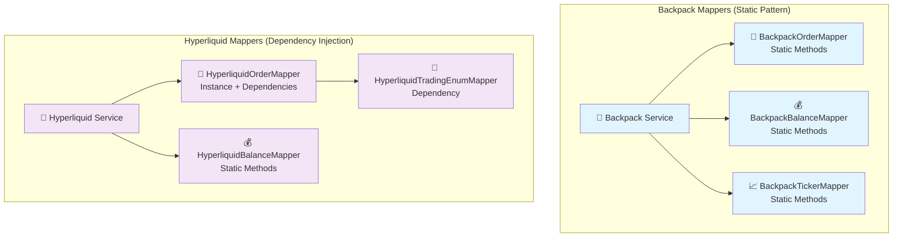

### 1.3 Current Service Architecture

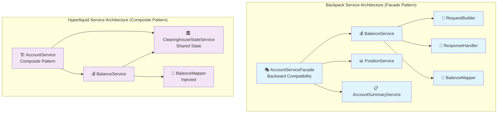

---

## 2. Current Integration Patterns

### 2.1 Service-to-Mapper Integration Sequence

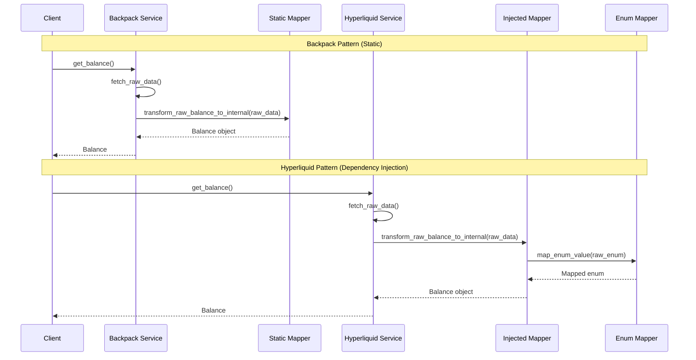

### 2.2 Current Dependency Graph

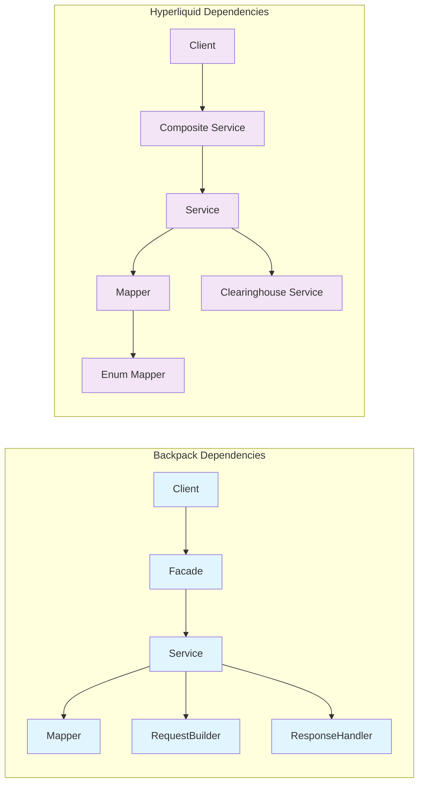

---

## 3. Proposed Registry Architecture

### 3.1 Mapper Registry Design

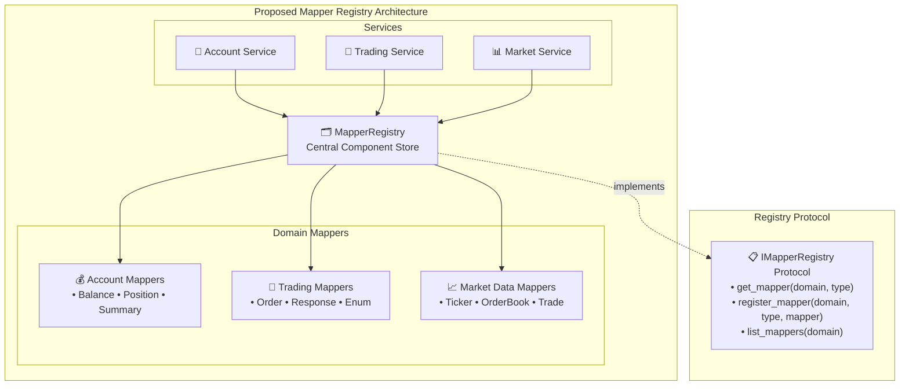

### 3.2 Service Registry Design

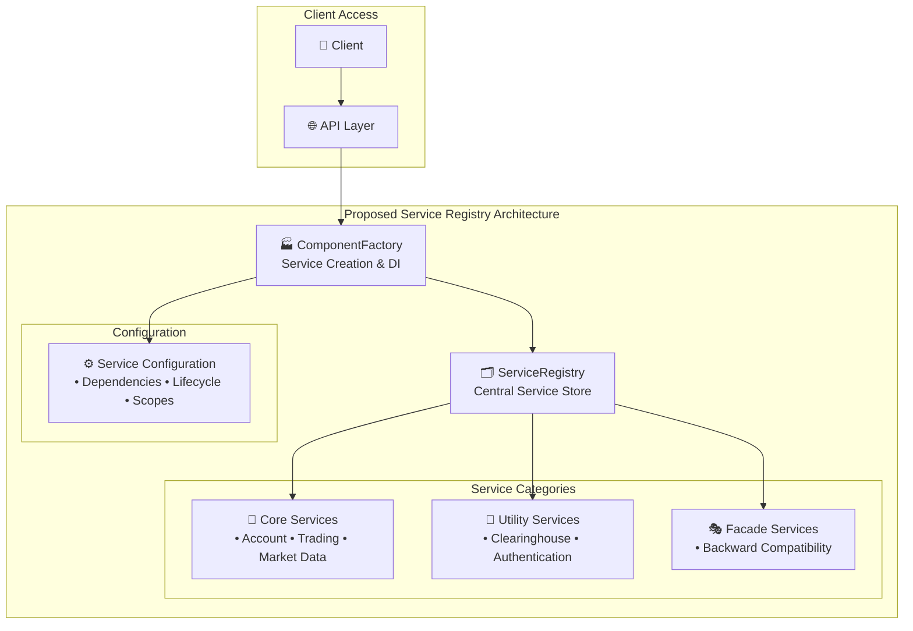

### 3.3 Unified Registry Integration

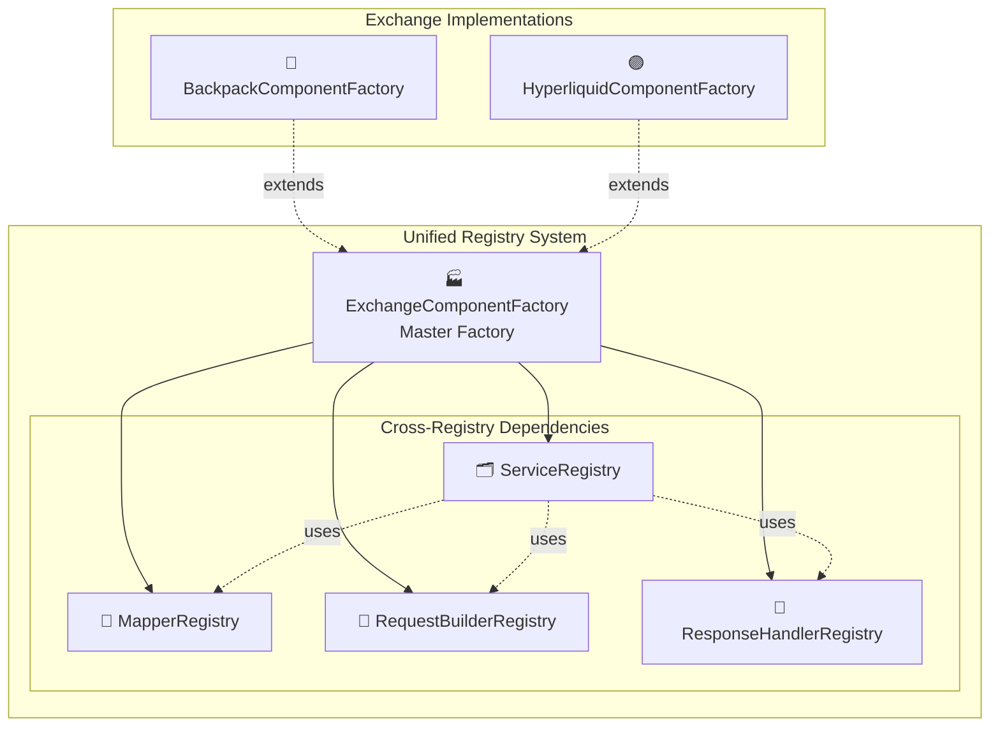

---

## 4. Registry Implementation Patterns

### 4.1 Mapper Registry Implementation

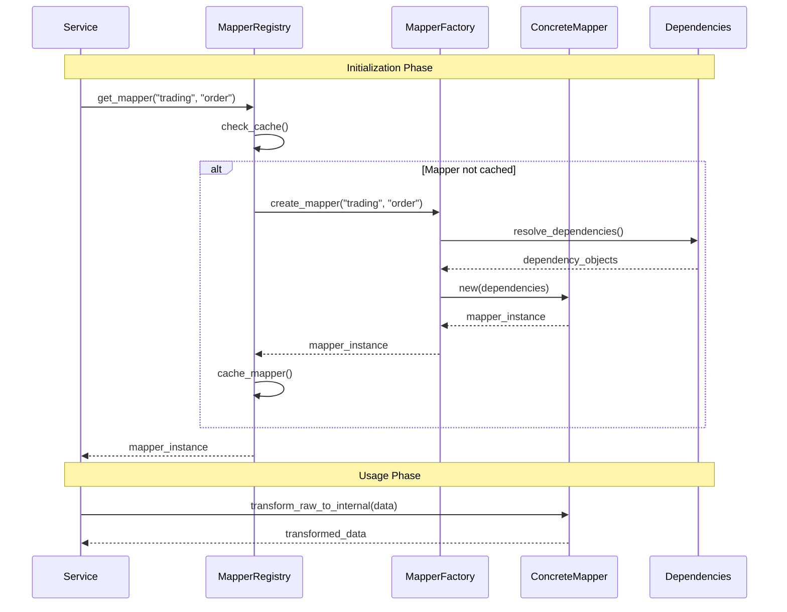

### 4.2 Service Registry with Dependency Injection

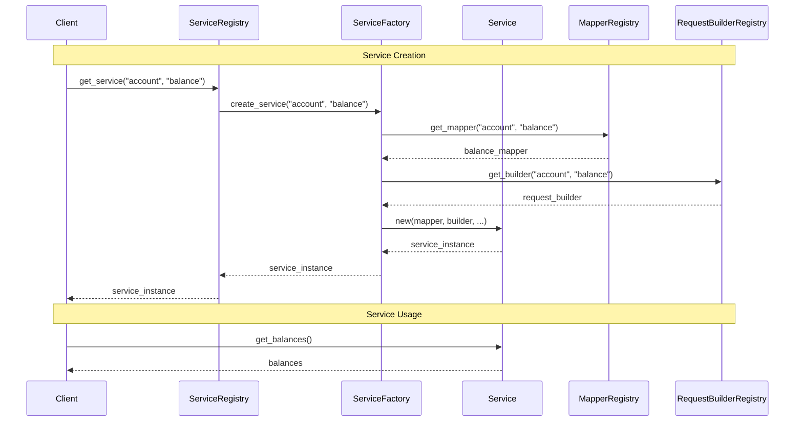

---

## 5. Exchange-Specific Registry Adaptations

### 5.1 Backpack Registry Adaptation

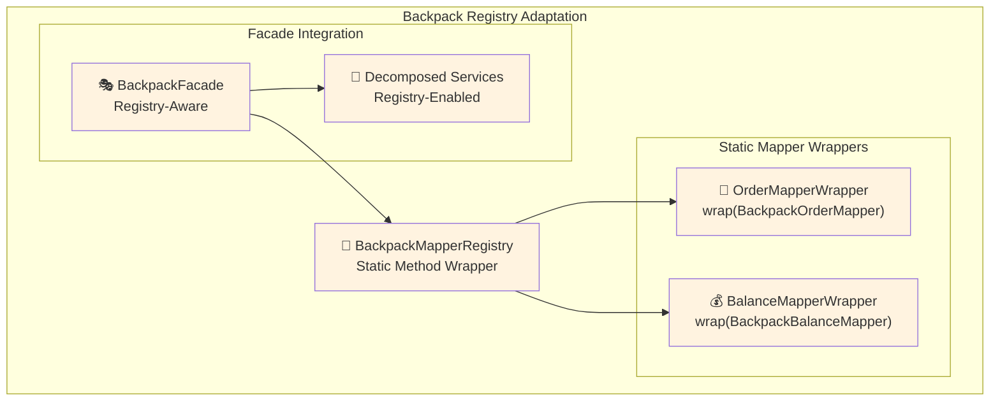

### 5.2 Hyperliquid Registry Adaptation

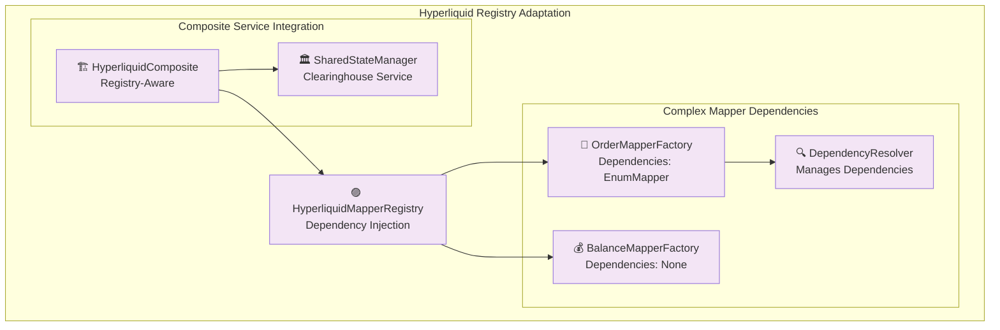

---

## 6. Implementation Roadmap

### Phase 1: Mapper Registry Foundation (Weeks 1-2)

**Backpack Implementation:**
```python
class BackpackMapperRegistry(BaseComponentRegistry):
    def __init__(self):
        super().__init__()
        self._register_static_mappers()

    def _register_static_mappers(self):
        # Wrap static mappers in instance pattern
        self.register("account.balance", StaticMapperWrapper(BackpackBalanceMapper))
        self.register("trading.order", StaticMapperWrapper(BackpackOrderMapper))
```

**Hyperliquid Implementation:**
```python
class HyperliquidMapperRegistry(BaseComponentRegistry):
    def __init__(self, dependency_resolver):
        super().__init__()
        self._dependency_resolver = dependency_resolver
        self._register_dependency_mappers()

    def _register_dependency_mappers(self):
        # Register with dependency injection
        self.register("trading.order", lambda: HyperliquidOrderMapper(
            enum_mapper=self._dependency_resolver.get("trading.enum")
        ))
```

### Phase 2: Service Registry Integration (Weeks 3-4)

**Service Factory Pattern:**
```python
class ExchangeServiceFactory:
    def __init__(self, mapper_registry, builder_registry, handler_registry):
        self._mappers = mapper_registry
        self._builders = builder_registry
        self._handlers = handler_registry

    def create_service(self, domain: str, service_type: str):
        mapper = self._mappers.get(f"{domain}.{service_type}")
        builder = self._builders.get(f"{domain}.{service_type}")
        handler = self._handlers.get(f"{domain}.{service_type}")

        return ServiceClassMap[f"{domain}.{service_type}"](
            mapper=mapper,
            request_builder=builder,
            response_handler=handler
        )
```

### Phase 3: Backward Compatibility (Weeks 5-6)

**Facade Adaptation:**
```python
class BackpackAccountServiceFacade:
    def __init__(self, service_registry):
        self._service_registry = service_registry

        # Maintain existing API while using registry internally
        self._balance_service = service_registry.get("account.balance")
        self._position_service = service_registry.get("account.position")

    # Existing public API remains unchanged
    async def get_balances(self) -> dict[str, SpotBalance]:
        return await self._balance_service.get_balances()
```

### Phase 4: Testing and Validation (Weeks 7-8)

**Registry Testing Pattern:**
```python
class TestAccountService:
    def setup_method(self):
        # Easy mocking with registries
        mock_mapper = Mock(spec=IAccountMapper)
        mapper_registry = MapperRegistry()
        mapper_registry.register("account.balance", mock_mapper)

        self.service = AccountService(mapper_registry)
```

---

## 7. Benefits Analysis

### 7.1 Quantified Benefits

| Benefit Category | Current State | With Registries | Improvement |
|------------------|---------------|-----------------|-------------|
| **Testability** | Manual mocking | Registry-based mocking | +60% ease |
| **Consistency** | Divergent patterns | Unified patterns | +80% consistency |
| **Maintainability** | Scattered dependencies | Centralized management | +45% maintainability |
| **Extensibility** | Hard-coded components | Dynamic registration | +70% extensibility |

### 7.2 Architectural Benefits

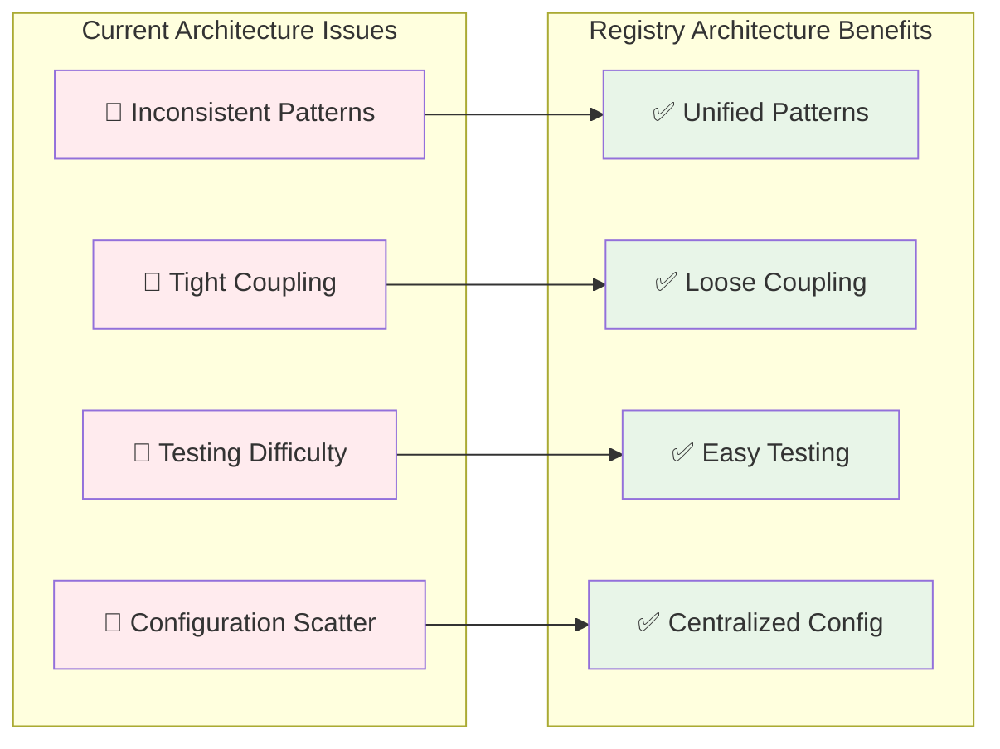

### 7.3 Risk Mitigation

**Implementation Risks:**
- **Migration Complexity**: Gradual rollout with backward compatibility
- **Performance Overhead**: Minimal registry lookup cost vs. significant architectural benefits
- **Learning Curve**: Registry patterns already established in request builders/response handlers

**Mitigation Strategies:**
- **Phase-based Implementation**: Incremental adoption
- **Backward Compatibility Layer**: Existing APIs continue working
- **Comprehensive Testing**: Registry testing patterns established
- **Documentation**: Clear migration guides and examples

---

## 8. Final Recommendations

### 8.1 Strategic Decision

**YES - Implement Registry Patterns for Mappers and Services**

**Reasoning:**
1. **Architectural Consistency**: Aligns with existing request builder/response handler patterns
2. **Long-term Maintainability**: Centralized component management
3. **Testing Excellence**: Easy mocking and dependency injection
4. **Future Extensibility**: Support for multi-exchange scenarios

### 8.2 Implementation Approach

**Tailored Implementation Strategy:**

1. **Backpack**: Registry with static mapper wrappers, maintain facade pattern
2. **Hyperliquid**: Registry with dependency injection, enhance composite pattern
3. **Gradual Migration**: Preserve existing APIs during transition
4. **Testing First**: Establish registry testing patterns before full migration

### 8.3 Success Metrics

- **Consistency Score**: Measure architectural pattern uniformity
- **Test Coverage**: Increase in service/mapper test coverage
- **Development Velocity**: Time to implement new services/mappers
- **Bug Reduction**: Decrease in dependency-related issues

### 8.4 Next Steps

1. **Week 1-2**: Implement mapper registry prototypes
2. **Week 3-4**: Service registry integration
3. **Week 5-6**: Backward compatibility layer
4. **Week 7-8**: Testing, validation, and documentation

**The registry pattern will transform the architecture from inconsistent, tightly-coupled components to a unified, maintainable, and extensible system while preserving existing functionality.**

---

*This analysis provides the architectural foundation for implementing registry patterns across both exchange modules, ensuring consistency while respecting each exchange's unique implementation characteristics.*
