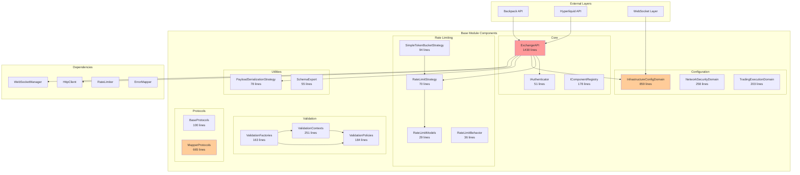
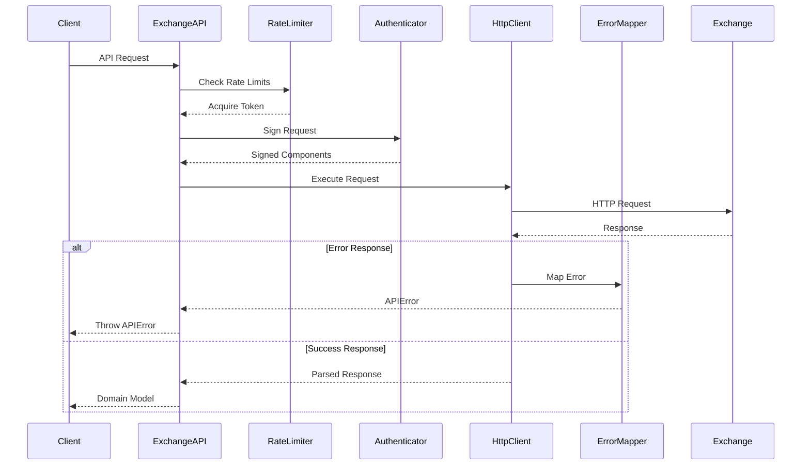
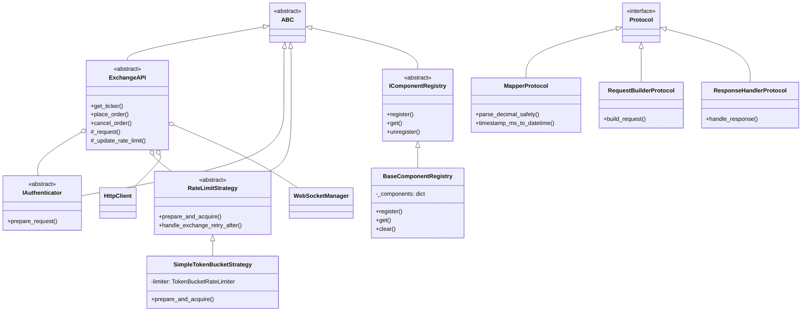
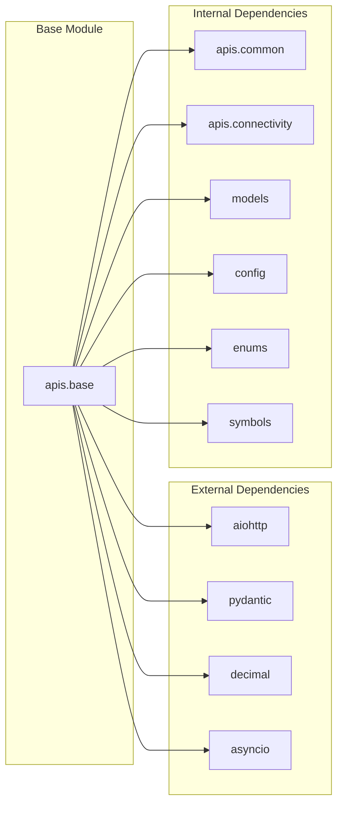
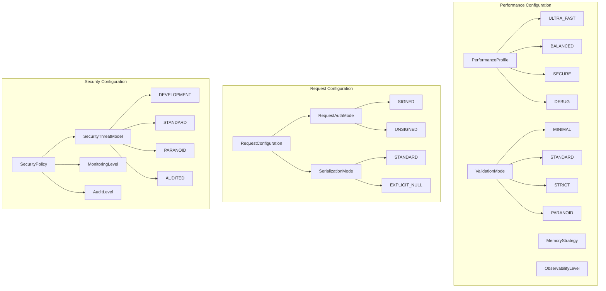
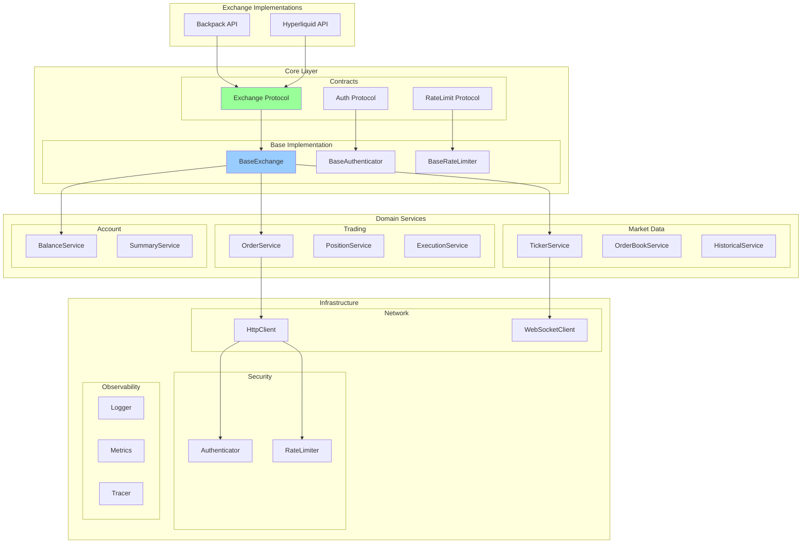
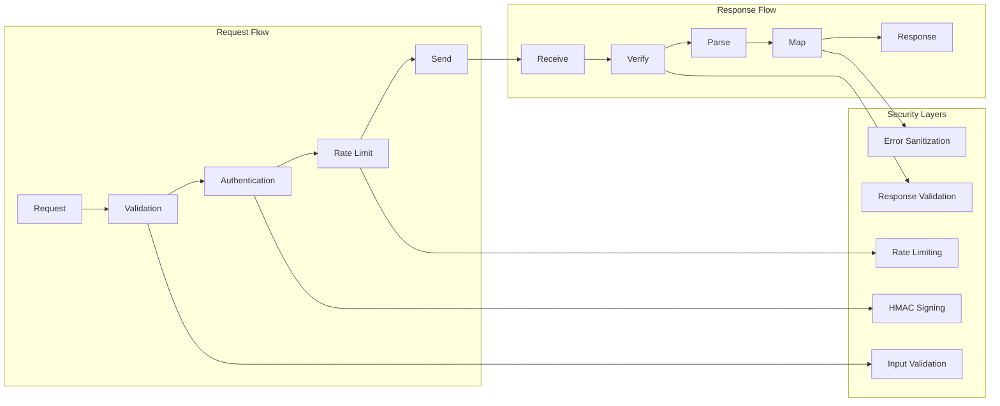
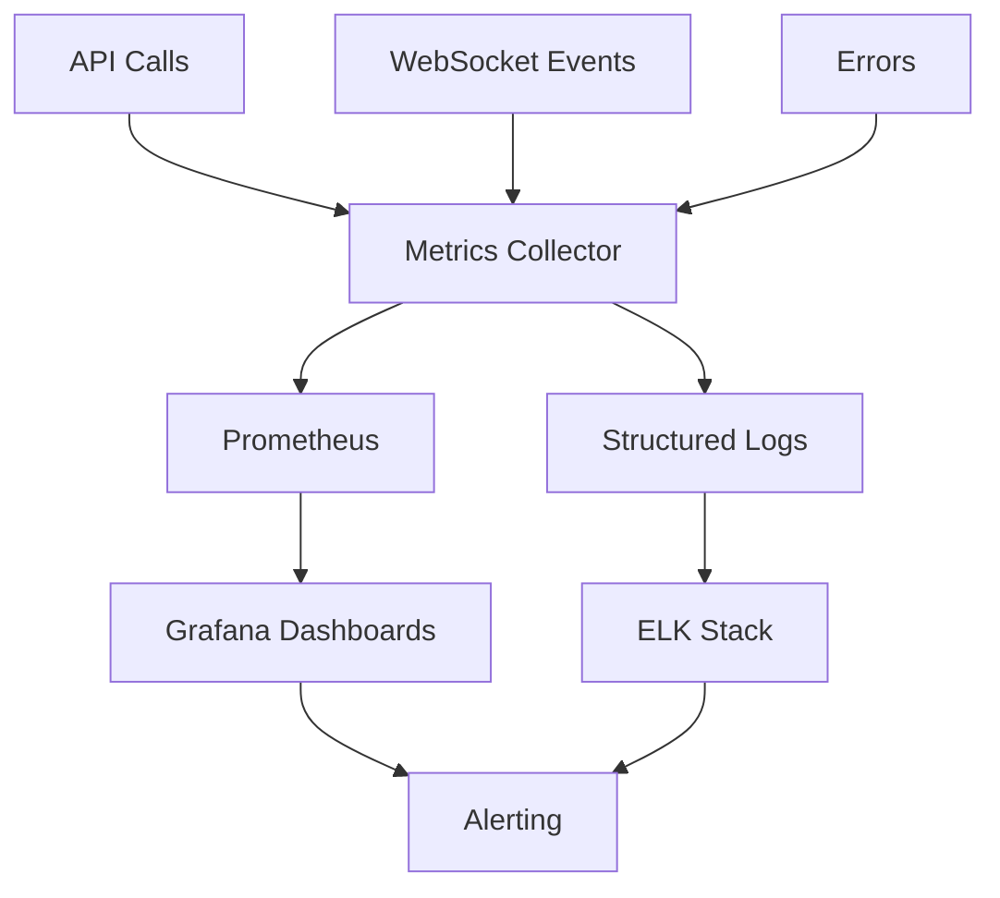

# APIs Base Module - Architecture Documentation

## Current Architecture Overview

The `@cyberdelta/apis/base/` module serves as the foundation for all exchange API implementations in CyberDeltaEngine. It provides abstract interfaces, base implementations, and common functionality shared across different exchange integrations.

## Component Architecture Diagram



## Data Flow Architecture



## Class Hierarchy



## Module Dependencies



## Configuration Domain Model



## Problems in Current Architecture

### 1. Monolithic ExchangeAPI Class
- 1430 lines in single file
- Mixes multiple responsibilities
- Hard to test individual components
- Violates Single Responsibility Principle

### 2. Configuration Sprawl
- `infrastructure_config_domain.py`: 859 lines
- Contains 20+ enums and 10+ models
- Should be split into focused modules

### 3. Mixed Abstraction Patterns
- Uses both ABC and Protocol
- Inconsistent with project standards
- Creates confusion about which to use

### 4. Weak Type Safety
- Extensive use of `dict[str, Any]`
- Loss of type information at boundaries
- Potential runtime errors

### 5. Circular Dependency Risks
```
validation_contexts -> validation_policies
validation_factories -> validation_contexts
validation_factories -> validation_policies
```

## Proposed Target Architecture



## Migration Strategy

### Phase 1: Type Safety (Week 1)
1. Replace all `dict[str, Any]` with typed models
2. Convert ABC classes to Protocols
3. Add strict type checking

### Phase 2: Decomposition (Week 2)
1. Split ExchangeAPI into service modules
2. Break down configuration domain
3. Separate validation into own package

### Phase 3: Clean Architecture (Week 3)
1. Implement hexagonal architecture
2. Create clear domain boundaries
3. Add dependency injection

## Performance Considerations

### Current Bottlenecks
1. **Large file parsing**: 1430-line ExchangeAPI slows imports
2. **Deep inheritance**: ABC classes add overhead
3. **Runtime validation**: Excessive Pydantic validation

### Optimization Opportunities
1. **Lazy loading**: Import services on-demand
2. **Protocol efficiency**: Protocols have less overhead than ABC
3. **Caching**: Add strategic caching for market data

## Security Architecture



## Testing Architecture

### Current Coverage
- Unit tests: Limited due to monolithic design
- Integration tests: Good coverage
- Performance tests: Missing

### Target Coverage
```
apis/base/
├── tests/
│   ├── unit/
│   │   ├── test_protocols.py
│   │   ├── test_authenticator.py
│   │   ├── test_rate_limiter.py
│   │   └── test_validators.py
│   ├── integration/
│   │   ├── test_exchange_flow.py
│   │   └── test_websocket_flow.py
│   └── performance/
│       ├── test_throughput.py
│       └── test_latency.py
```

## Metrics and Monitoring

### Key Metrics to Track
1. **API Latency**: p50, p95, p99
2. **Rate Limit Usage**: tokens/second
3. **Error Rates**: by error type
4. **WebSocket Health**: connection uptime

### Proposed Monitoring Architecture


## Conclusion

The current architecture of `apis/base` has evolved organically through multiple refactors, resulting in:
- Mixed patterns and responsibilities
- Type safety issues
- Maintenance challenges
- Performance bottlenecks

The proposed architecture addresses these issues by:
- Clear separation of concerns
- Strong type safety
- Protocol-based design
- Domain-driven structure
- Better testability

Implementation should proceed incrementally with careful testing at each phase to minimize risk to the production trading system.
