# Architecture Diagrams - Current vs Practical Target State

## Current Architecture (Pseudo-Async)

### Current Flow - Synchronous Wrapped in Async

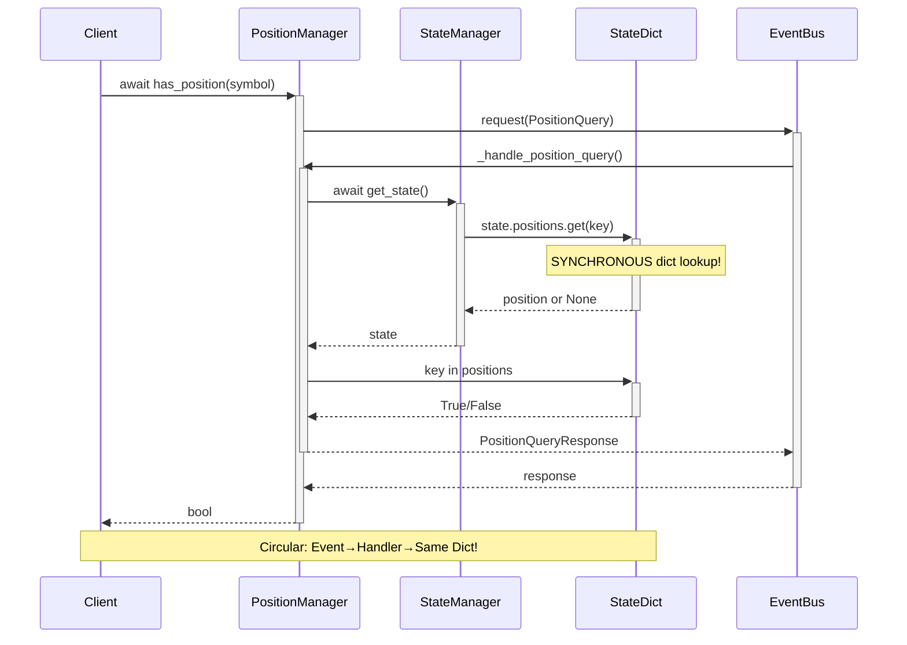

### Current State Management

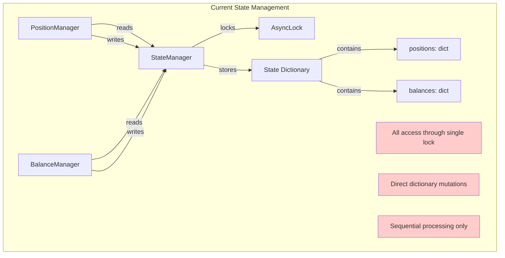

## Practical Target Architecture (Incremental Improvements)

### Target Flow - Actor Pattern with Caching

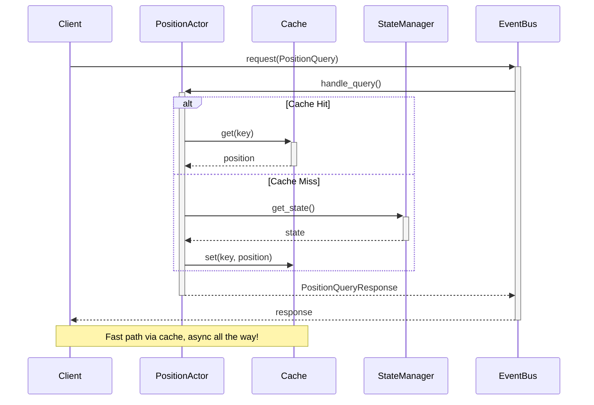

### Practical Service Communication

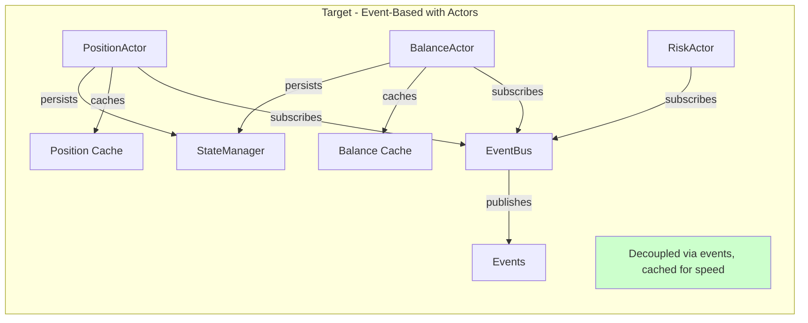

## Concurrency Comparison

### Current - Sequential Processing

```mermaid
gantt
    title Current Sequential Processing
    dateFormat HH:mm:ss
    axisFormat %S

    section Position Queries
    Get Position 1    :01, 1s
    Get Position 2    :02, 1s
    Get Position 3    :03, 1s
    Get Position 4    :04, 1s
    Get Position 5    :05, 1s

    section Total Time
    Total 5 seconds   :01, 5s
```

### Target - Concurrent Processing with Batch

```mermaid
gantt
    title Target Concurrent Processing
    dateFormat HH:mm:ss
    axisFormat %S

    section Batch Query
    Prepare Batch     :01, 0.1s
    Concurrent Fetch  :01.1, 0.5s
    Process Results   :01.6, 0.1s

    section Total Time
    Total 0.7 seconds :01, 0.7s
```

## Event Flow Patterns

### Current - Blocking Request/Response

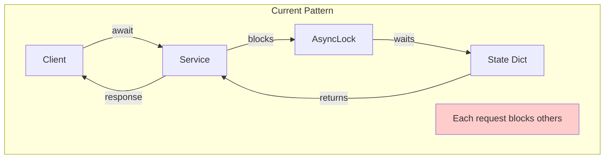

### Target - Non-Blocking with Streaming

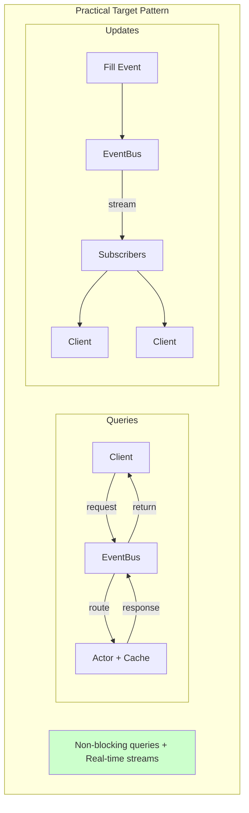

## Practical Actor Model

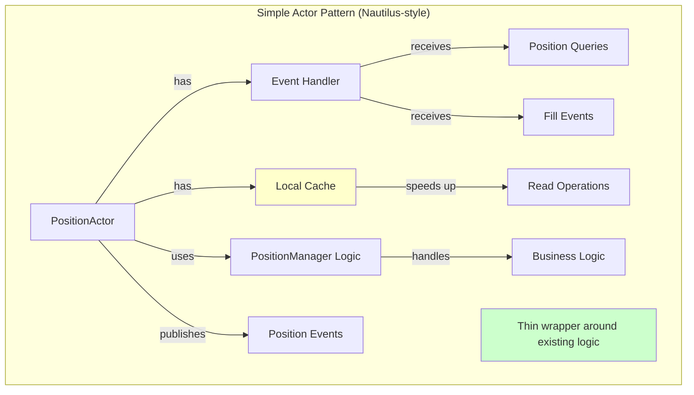

## Streaming Architecture

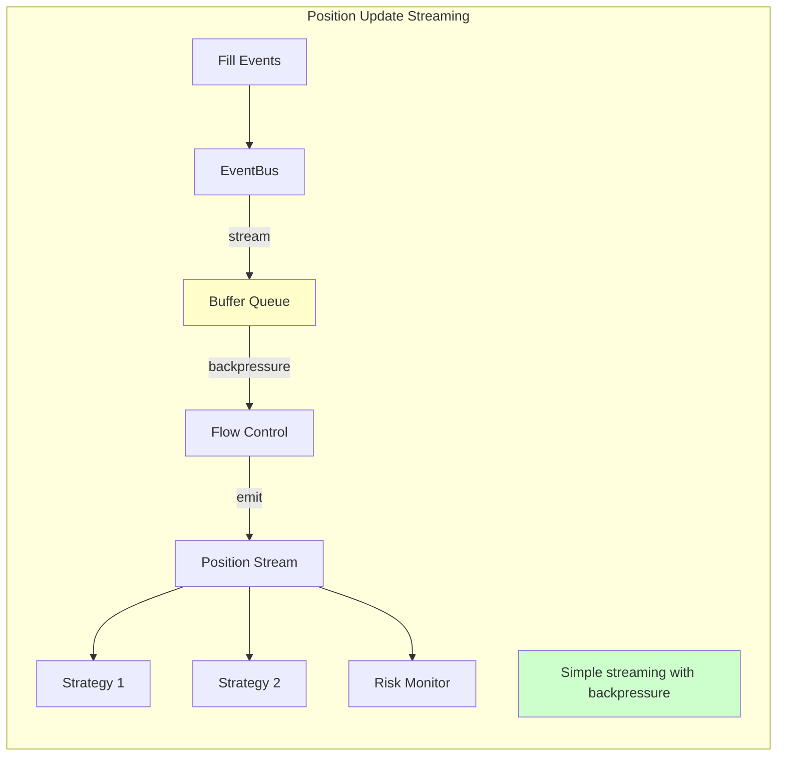

## State Consistency Model

### Current - Pessimistic Locking

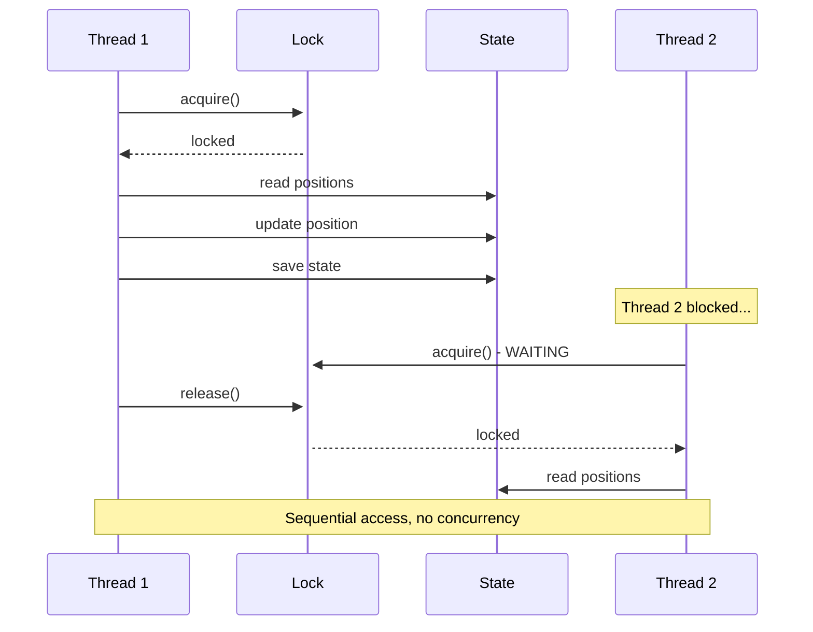

### Target - Cache-Based Optimistic Reads

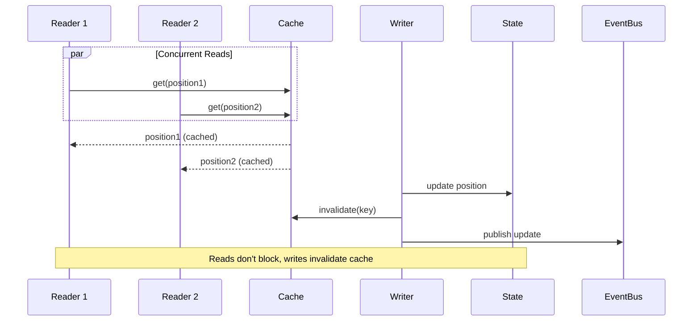

## Performance Characteristics

### Practical Improvements

```mermaid
graph TB
    subgraph "Current Performance"
        CP1[Sequential: O(n)]
        CP2[Lock Contention: High]
        CP3[Latency: 50-100ms]
        CP4[Throughput: 10-100 ops/sec]
    end

    subgraph "Achievable Target"
        TP1[Batch Concurrent: O(1) for batch]
        TP2[Cache Hits: No lock needed]
        TP3[Latency: 5-10ms cached]
        TP4[Throughput: 1K-5K ops/sec]
    end

    CP1 -.->|5-10x faster| TP1
    CP2 -.->|cache reduces| TP2
    CP3 -.->|10x faster| TP3
    CP4 -.->|10-50x more| TP4

    style CP1 fill:#ffcccc
    style CP2 fill:#ffcccc
    style CP3 fill:#ffcccc
    style CP4 fill:#ffcccc

    style TP1 fill:#ccffcc
    style TP2 fill:#ccffcc
    style TP3 fill:#ccffcc
    style TP4 fill:#ccffcc
```

## Implementation Phases

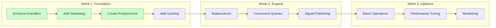

## Summary

The diagrams show a **practical migration path** from:

1. **Current State**: Pseudo-async with synchronous operations and tight coupling
2. **Target State**: Simple actors with caching, streaming, and concurrent operations

Key improvements:
- From **sequential processing** to **concurrent batches**
- From **blocking locks** to **cached reads**
- From **tight coupling** to **event-based communication**
- From **no streaming** to **real-time updates**

This represents an **incremental improvement** rather than a complete rewrite, achieving **5-10x performance gains** with **minimal complexity**.
