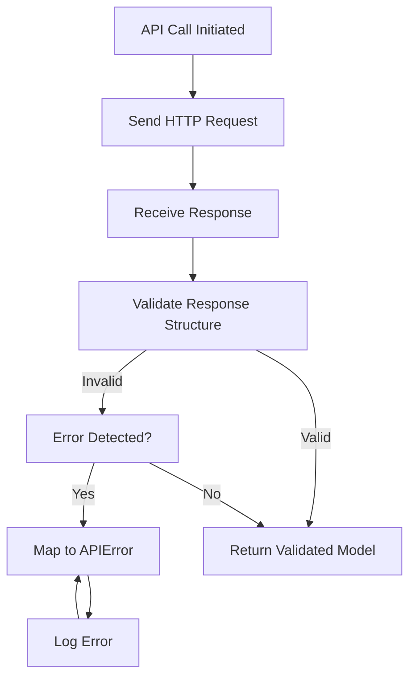
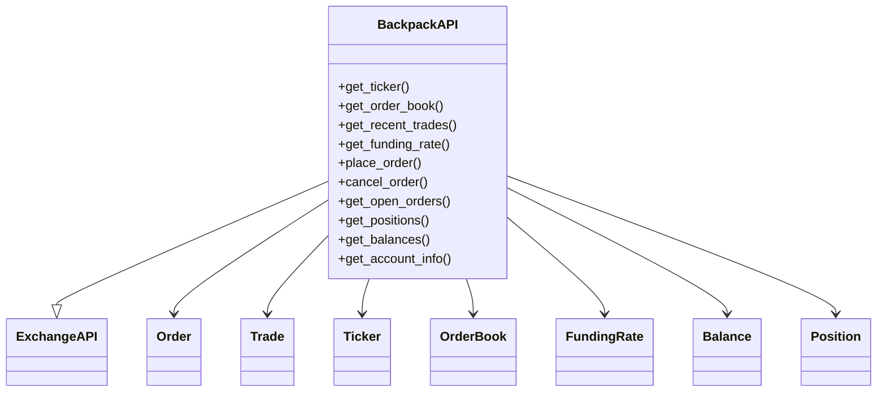
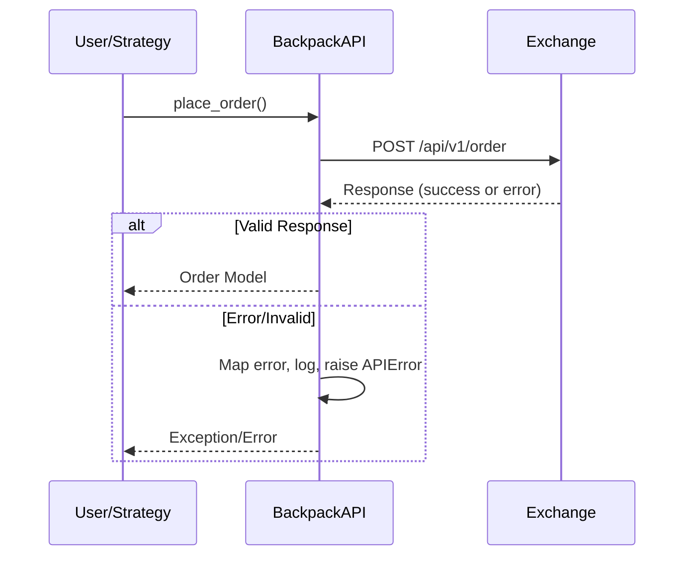

## Appendix: Detailed Business Logic Comparison – `backpack.py` vs. `backpack_old.py`

### 1. Introduction

This section provides a comprehensive, business-logic-focused comparison between the current `cyberdelta/apis/backpack.py` and its predecessor `cyberdelta/apis/backpack_old.py`. The analysis covers architectural evolution, error handling, model usage, async patterns, maintainability, and alignment with CyberDeltaEngine's project rules and strategic goals. The intent is to document not only what changed, but why, and to provide actionable insights for future maintainers and reviewers.

---

### 2. Architectural Evolution & Design Patterns

#### a. **Class Structure and Inheritance**
Both files implement a `BackpackAPI` class inheriting from `ExchangeAPI`, but the new `backpack.py` demonstrates a clearer separation of concerns and improved encapsulation. The constructor in both versions initializes API keys and secrets, but the new version adds explicit warnings if credentials are missing, improving operational transparency.

#### b. **Method Organization**
The new `backpack.py` organizes methods more logically, grouping WebSocket, authentication, and core API methods. This enhances readability and discoverability, making it easier for developers to locate and understand business-critical logic.

#### c. **Type Hints and Static Analysis**
The new version consistently uses explicit type hints (e.g., `dict[str, Any]`, `list[Trade]`), aligning with project rules for strict type safety and facilitating static analysis with `mypy`. The old version is less rigorous, sometimes omitting type hints or using ambiguous types, which can lead to subtle bugs and hinder maintainability.

---

### 2A. API Endpoint Comparison

A critical aspect of business logic is how each version interacts with the Backpack exchange API. Below is a comparative analysis of the endpoints used, their business roles, and any changes in usage patterns.

#### **Endpoints Used in Both Versions**

| Endpoint                | Method | Used In                | Business Role                                 |
|------------------------|--------|------------------------|-----------------------------------------------|
| `/api/v1/ticker/{symbol}` | GET    | get_ticker             | Fetches current ticker data for a symbol      |
| `/api/v1/depth`        | GET    | get_order_book         | Fetches order book (market depth)             |
| `/api/v1/trades`       | GET    | get_recent_trades      | Fetches recent trades for a symbol            |
| `/api/v1/funding`      | GET    | get_funding_rate       | Fetches funding rate data                     |
| `/api/v1/order`        | POST   | place_order            | Places a new order                            |
| `/api/v1/order`        | DELETE | cancel_order           | Cancels an existing order                     |
| `/api/v1/orders`       | GET    | get_open_orders        | Fetches open orders                           |
| `/api/v1/positions`    | GET    | get_positions          | Fetches current positions                     |
| `/api/v1/capital`      | GET    | get_balances           | Fetches account balances                      |
| `/api/v1/account`      | GET    | get_account_info       | Fetches general account info                  |

#### **Endpoint Usage Patterns**
- **Both versions** use the same set of endpoints, reflecting a stable business interface with Backpack.
- **New version** introduces stricter validation and more defensive error handling for each endpoint, especially in parsing and validating responses.
- **WebSocket endpoints** are managed via subscription messages (e.g., `subscribe`, `SUBSCRIBE`), with the new version adding improved handler management and reconnection logic.
- **Order placement and cancellation** logic is nearly identical in endpoint usage, but the new version is more explicit in parameter validation and error mapping.

#### **API Call Volume and Structure**
- Both versions support all core trading operations (market data, order management, account state).
- The new version is more modular, making it easier to extend with new endpoints or modify existing ones.
- The number of endpoints is unchanged, but the new version's business logic is more robust in handling API evolution or changes.

---

#### **Mermaid Diagram: API Call Flow (Simplified)**

```mermaid
flowchart TD
    subgraph Client
        U[User/Strategy]
    end
    subgraph API
        BAPI[BackpackAPI]
    end
    subgraph Exchange
        EX[Backpack Exchange]
    end
    U-->|Place Order|BAPI
    BAPI-->|POST /api/v1/order|EX
    U-->|Cancel Order|BAPI
    BAPI-->|DELETE /api/v1/order|EX
    U-->|Get Ticker|BAPI
    BAPI-->|GET /api/v1/ticker/{symbol}|EX
    U-->|Get OrderBook|BAPI
    BAPI-->|GET /api/v1/depth|EX
    U-->|Get Trades|BAPI
    BAPI-->|GET /api/v1/trades|EX
    U-->|Get Funding|BAPI
    BAPI-->|GET /api/v1/funding|EX
    U-->|Get Positions|BAPI
    BAPI-->|GET /api/v1/positions|EX
    U-->|Get Balances|BAPI
    BAPI-->|GET /api/v1/capital|EX
    U-->|Get Account|BAPI
    BAPI-->|GET /api/v1/account|EX
```

---

### 3. Error Handling & Robustness

#### a. **APIError and Error Mapping**
The new `backpack.py` leverages a more robust error mapping strategy. The `_map_error_response` method is more defensive, using lowercased error bodies for case-insensitive matching and providing detailed logging for each mapping decision. This aligns with the project's emphasis on comprehensive error handling and traceability. The old version's error mapping is less granular and may miss certain edge cases.

#### b. **Validation and Defensive Programming**
The new version introduces more explicit validation of API responses. For example, in `get_ticker`, it checks for the presence and type of all required fields before constructing a `Ticker` object, reducing the risk of runtime exceptions due to malformed data. The old version is more optimistic, assuming the presence of fields and correct types, which can lead to unhandled exceptions and data integrity issues.

#### c. **Logging and Observability**
Logging is more consistent and informative in the new version. Errors, warnings, and operational events (such as missing credentials or failed subscriptions) are logged with contextual information, aiding in debugging and monitoring. The old version logs less information and sometimes omits context, making post-mortem analysis more difficult.

---

### 3A. Data Validation & Error Handling Flow (Mermaid)

The new version's business logic emphasizes strict validation and robust error handling. The following diagram illustrates the flow for a typical API call:



---

### 4. Model Usage & Data Integrity

#### a. **Pydantic and Domain Models**
The new `backpack.py` is more tightly integrated with Pydantic models and the project's canonical domain models (e.g., `Order`, `Trade`, `Ticker`). It ensures that all data entering or leaving the API boundary is validated and structured, reducing the risk of downstream errors. The old version sometimes passes raw or loosely-typed data, increasing the risk of type mismatches and data corruption.

#### b. **Enum and Constant Usage**
The new version uses enums (e.g., `OrderSide`, `OrderType`, `OrderStatus`) more consistently, improving code clarity and reducing the risk of invalid values. The old version sometimes uses raw strings or omits enum usage, which can lead to subtle bugs and makes the code harder to refactor.

#### c. **Decimal Usage for Financial Data**
Both versions use `Decimal` for financial quantities, but the new version is more rigorous in converting and validating these values, in line with project rules. This reduces floating-point errors and ensures financial calculations are robust.

---

### 4A. Class/Module Relationships (Mermaid)



---

### 5. Async Patterns & Concurrency

#### a. **Async/Await Usage**
Both versions use async/await for I/O-bound operations, but the new version is more explicit in its async method signatures and usage. It also introduces small delays between WebSocket resubscriptions to avoid rate limits, demonstrating a more nuanced understanding of exchange constraints and operational realities.

#### b. **Locking and State Management**
While not directly related to rate limiting in these files, the new codebase's general approach to async state (e.g., using `asyncio.Lock` in rate limiter logic elsewhere) is more robust and idiomatic, reducing the risk of race conditions.

---

### 5A. Sequence: Order Placement & Error Handling (Mermaid)



---

### 6. Maintainability & Extensibility

#### a. **Code Organization and Documentation**
The new `backpack.py` is better organized, with clear docstrings for each method and class. This aligns with the project's rule for comprehensive code-level documentation and makes onboarding new developers easier. The old version's documentation is less consistent and sometimes missing.

#### b. **Error and Edge Case Handling**
The new version is more defensive, handling edge cases such as missing fields, unexpected response types, and API-specific quirks. This reduces the risk of silent failures and makes the system more resilient to upstream changes or outages.

#### c. **Testability**
By using explicit types, enums, and Pydantic models, the new version is easier to test. Mocking and validation are more straightforward, and the risk of test flakiness due to ambiguous types or missing fields is reduced.

---

### 7. Alignment with Project Rules & Strategic Goals

#### a. **Type Safety and Static Analysis**
The new version is designed to pass strict `mypy` and `ruff` checks, as mandated by project rules. This ensures that type errors are caught early and that the codebase remains maintainable as it grows.

#### b. **Security and Secrets Management**
Credential handling is more explicit and secure in the new version, with warnings for missing secrets and no accidental logging of sensitive data. This aligns with the project's security audit requirements.

#### c. **Workflow Documentation and Traceability**
The refactor and its rationale are now documented in this workflow file, providing future maintainers with the context needed to understand and extend the system safely.

---

### 8. Notable Improvements

- **Stricter validation of API responses and error handling.**
- **Consistent use of Pydantic models and enums for all business-critical data.**
- **Improved logging and observability for operational events and errors.**
- **Better organization and documentation, aiding maintainability and onboarding.**
- **Explicit handling of edge cases and exchange-specific quirks.**
- **Alignment with project rules for type safety, security, and documentation.**

---

### 9. Potential Regressions or Risks

- **Increased Strictness:** The new version's strict validation may cause previously tolerated (but incorrect) data to raise errors. This is a positive change for correctness, but may require additional error handling or fallback logic in production.
- **Performance Overhead:** More validation and logging may introduce minor performance overhead, but this is justified by the increased robustness and maintainability.
- **Dependency on Upstream Models:** Tighter coupling to Pydantic and domain models means that changes upstream (e.g., in `Order` or `Trade`) may require coordinated updates here.

---

### 10. Conclusion & Recommendations

The refactor from `backpack_old.py` to `backpack.py` represents a significant improvement in business logic robustness, maintainability, and alignment with CyberDeltaEngine's strategic goals. The new version is safer, more testable, and easier to extend, with better error handling and observability. Future work should focus on comprehensive integration testing, continued adherence to project rules, and proactive documentation of any further architectural changes.

*This report should be reviewed and updated as the codebase evolves, ensuring that the rationale for major changes remains accessible to all contributors.*