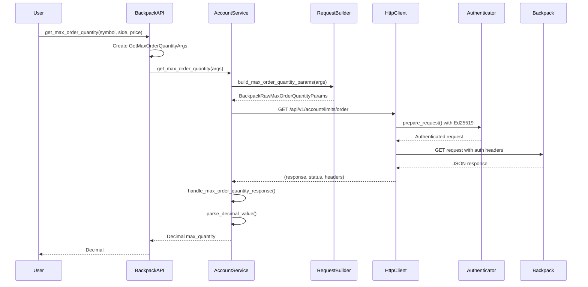
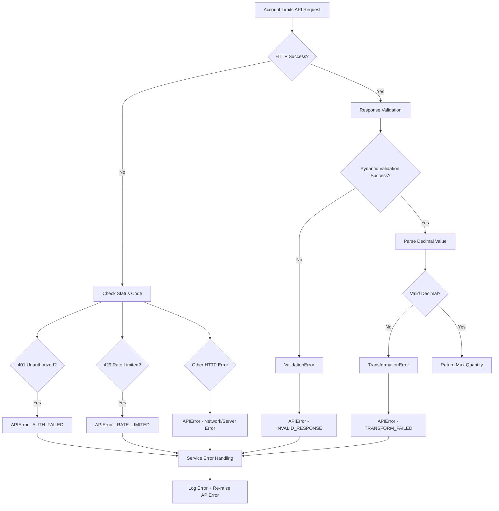
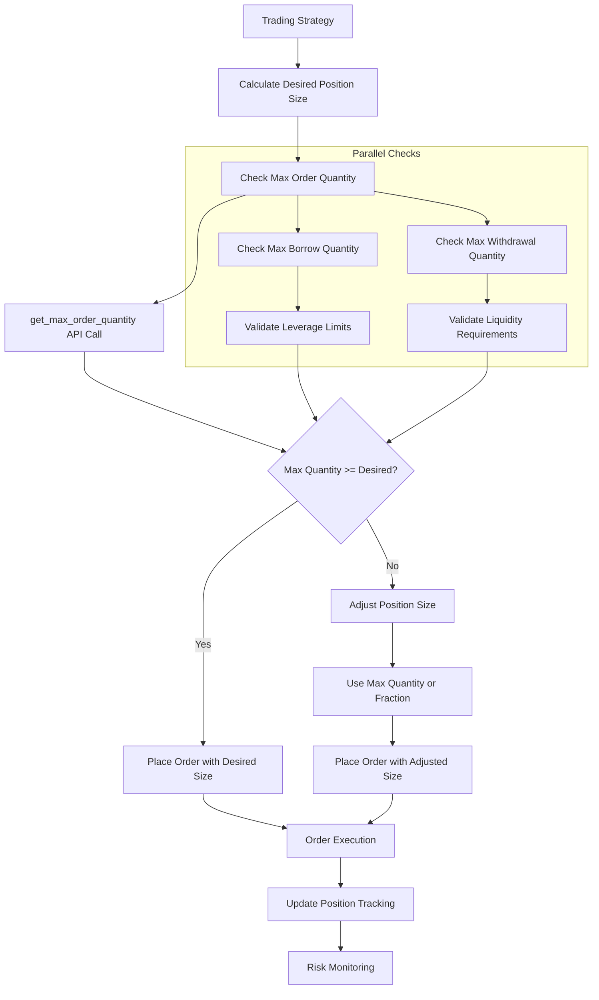

# Backpack Account Limits Endpoints Implementation Plan

## Executive Summary

This document provides a comprehensive implementation plan for the three missing Backpack account limits endpoints that are critical for margin trading and risk management. These endpoints provide real-time maximum quantity calculations for orders, borrows, and withdrawals based on current account state and margin requirements.

## Current State Analysis

### What We Have ✅

1. **Authentication Support**:
   - Complete Ed25519 authentication implementation in `bp_auth.py`
   - Instruction mappings for all three endpoints:
     - `maxBorrowQuantity` for `/api/v1/account/limits/borrow`
     - `maxOrderQuantity` for `/api/v1/account/limits/order`
     - `maxWithdrawalQuantity` for `/api/v1/account/limits/withdrawal`

2. **Data Collection Scripts**:
   - Full implementation in `fetch_backpack_private_data.py` with working methods
   - Sample response data in test fixtures
   - Proven working API calls

3. **Foundation Components**:
   - HTTP client with authentication
   - Service layer patterns established
   - Request builder and response handler patterns

### What We're Missing ❌

1. **Raw Pydantic Models**: No validated models for endpoint responses
2. **Service Integration**: No methods in `BackpackAccountService`
3. **API Interface**: No public methods in `BackpackAPI`
4. **Core Model Integration**: No transformation to internal domain models
5. **Integration Tests**: No test coverage for these endpoints

## API Specifications Research

### Endpoint 1: Maximum Borrow Quantity

**Endpoint**: `GET /api/v1/account/limits/borrow`
**Purpose**: Get maximum borrowable quantity for an asset
**Instruction**: `maxBorrowQuantity`

**Request Parameters**:
```
Headers:
- X-API-KEY (optional): API key
- X-SIGNATURE (optional): Ed25519 signature
- X-TIMESTAMP (optional): Request timestamp in milliseconds
- X-WINDOW (optional): Validity window (default 5000ms, max 60000ms)

Query Parameters:
- symbol (required): Asset symbol (e.g., "BTC", "ETH", "USDC")
```

**Response Format**:
```json
{
  "maxBorrowQuantity": "1000.50",  // Maximum borrowable amount
  "symbol": "BTC"                  // Asset symbol
}
```

### Endpoint 2: Maximum Order Quantity

**Endpoint**: `GET /api/v1/account/limits/order`
**Purpose**: Get maximum tradeable quantity for a market
**Instruction**: `maxOrderQuantity`

**Request Parameters**:
```
Headers: Same as borrow endpoint

Query Parameters:
- symbol (required): Trading pair (e.g., "BTC_USDC", "SOL_USDC_PERP")
- side (required): Order side ("Bid" or "Ask")
- price (optional): Limit price for the order
- reduceOnly (optional): Whether order is reduce-only
- autoBorrow (optional): Enable auto-borrow
- autoBorrowRepay (optional): Enable auto-borrow repayment
- autoLendRedeem (optional): Enable auto-lend redemption
```

**Response Format**:
```json
{
  "autoBorrow": null,
  "autoBorrowRepay": null,
  "autoLendRedeem": null,
  "maxOrderQuantity": "0.5",       // Maximum order size
  "price": "45000.00",             // Order price
  "reduceOnly": null,
  "side": "Bid",                   // Order side
  "symbol": "BTC_USDC"             // Trading pair
}
```

### Endpoint 3: Maximum Withdrawal Quantity

**Endpoint**: `GET /api/v1/account/limits/withdrawal`
**Purpose**: Get maximum withdrawable quantity for an asset
**Instruction**: `maxWithdrawalQuantity`

**Request Parameters**:
```
Headers: Same as other endpoints

Query Parameters:
- symbol (required): Asset symbol (e.g., "BTC", "ETH", "USDC")
- autoBorrow (optional): Enable auto-borrow for withdrawal
- autoLendRedeem (optional): Enable auto-lend redemption
```

**Response Format**:
```json
{
  "autoBorrow": null,
  "autoLendRedeem": null,
  "maxWithdrawalQuantity": "2.5",  // Maximum withdrawable amount
  "symbol": "BTC"                  // Asset symbol
}
```

## Implementation Plan

### Phase 1: Raw Models Implementation

#### 1.1 Create Raw Response Models

**File**: `cyberdelta/apis/backpack/models/bp_raw_limits.py`

```python
"""Raw models for Backpack account limits endpoints."""

from __future__ import annotations

from pydantic import BaseModel, ConfigDict, Field

from .bp_common_raw_types import (
    RawBpNonEmptyStringMax64,
    RawBpOptionalStrictBool,
    RawBpStringToFiniteDecimal,
)


class BackpackRawMaxBorrowQuantity(BaseModel):
    """Raw response from /api/v1/account/limits/borrow endpoint."""
    
    max_borrow_quantity: RawBpStringToFiniteDecimal = Field(..., alias="maxBorrowQuantity")
    symbol: RawBpNonEmptyStringMax64 = Field(..., alias="symbol")
    
    model_config = ConfigDict(
        extra="forbid",
        frozen=True,
        populate_by_name=True,
        validate_assignment=True,
    )


class BackpackRawMaxOrderQuantity(BaseModel):
    """Raw response from /api/v1/account/limits/order endpoint."""
    
    auto_borrow: RawBpOptionalStrictBool = Field(None, alias="autoBorrow")
    auto_borrow_repay: RawBpOptionalStrictBool = Field(None, alias="autoBorrowRepay")
    auto_lend_redeem: RawBpOptionalStrictBool = Field(None, alias="autoLendRedeem")
    max_order_quantity: RawBpStringToFiniteDecimal = Field(..., alias="maxOrderQuantity")
    price: RawBpStringToFiniteDecimal | None = Field(None, alias="price")
    reduce_only: RawBpOptionalStrictBool = Field(None, alias="reduceOnly")
    side: RawBpNonEmptyStringMax64 = Field(..., alias="side")  # "Bid" or "Ask"
    symbol: RawBpNonEmptyStringMax64 = Field(..., alias="symbol")
    
    model_config = ConfigDict(
        extra="forbid",
        frozen=True,
        populate_by_name=True,
        validate_assignment=True,
    )


class BackpackRawMaxWithdrawalQuantity(BaseModel):
    """Raw response from /api/v1/account/limits/withdrawal endpoint."""
    
    auto_borrow: RawBpOptionalStrictBool = Field(None, alias="autoBorrow")
    auto_lend_redeem: RawBpOptionalStrictBool = Field(None, alias="autoLendRedeem")
    max_withdrawal_quantity: RawBpStringToFiniteDecimal = Field(..., alias="maxWithdrawalQuantity")
    symbol: RawBpNonEmptyStringMax64 = Field(..., alias="symbol")
    
    model_config = ConfigDict(
        extra="forbid",
        frozen=True,
        populate_by_name=True,
        validate_assignment=True,
    )
```

#### 1.2 Create Query Parameter Models

**File**: `cyberdelta/apis/backpack/models/bp_raw_query_params.py` (additions)

```python
class BackpackRawMaxBorrowQuantityParams(BaseModel):
    """Query parameters for max borrow quantity endpoint."""
    
    symbol: str = Field(..., alias="symbol")
    
    model_config = ConfigDict(extra="forbid", populate_by_name=True)


class BackpackRawMaxOrderQuantityParams(BaseModel):
    """Query parameters for max order quantity endpoint."""
    
    symbol: str = Field(..., alias="symbol")
    side: str = Field(..., alias="side")  # "Bid" or "Ask"
    price: str | None = Field(default=None, alias="price")
    reduce_only: bool | None = Field(default=None, alias="reduceOnly")
    auto_borrow: bool | None = Field(default=None, alias="autoBorrow")
    auto_borrow_repay: bool | None = Field(default=None, alias="autoBorrowRepay")
    auto_lend_redeem: bool | None = Field(default=None, alias="autoLendRedeem")
    
    model_config = ConfigDict(extra="forbid", populate_by_name=True)


class BackpackRawMaxWithdrawalQuantityParams(BaseModel):
    """Query parameters for max withdrawal quantity endpoint."""
    
    symbol: str = Field(..., alias="symbol")
    auto_borrow: bool | None = Field(default=None, alias="autoBorrow")
    auto_lend_redeem: bool | None = Field(default=None, alias="autoLendRedeem")
    
    model_config = ConfigDict(extra="forbid", populate_by_name=True)
```

### Phase 2: Service Args Models

#### 2.1 Create Service Arguments

**File**: `cyberdelta/apis/models/service_args_models.py` (additions)

```python
class GetMaxBorrowQuantityArgs(BaseModel):
    """Arguments for getting maximum borrow quantity."""
    
    symbol: str = Field(..., min_length=1, max_length=64)
    
    model_config = ConfigDict(extra="forbid", validate_assignment=True)
    
    @field_validator("symbol", mode="before")
    @classmethod
    def validate_symbol_str(cls, v: str, info: ValidationInfo) -> str:
        return validate_str_field(v, field_name=str(info.field_name), max_length=64, allow_empty=False)


class GetMaxOrderQuantityArgs(BaseModel):
    """Arguments for getting maximum order quantity."""
    
    symbol: str = Field(..., min_length=1, max_length=64)
    side: OrderSide = Field(...)
    price: Decimal | None = Field(default=None, gt=Decimal("0"))
    reduce_only: bool | None = Field(default=None)
    auto_borrow: bool | None = Field(default=None)
    auto_borrow_repay: bool | None = Field(default=None)
    auto_lend_redeem: bool | None = Field(default=None)
    
    model_config = ConfigDict(extra="forbid", validate_assignment=True)
    
    @field_validator("symbol", mode="before")
    @classmethod
    def validate_symbol_str(cls, v: str, info: ValidationInfo) -> str:
        return validate_str_field(v, field_name=str(info.field_name), max_length=64, allow_empty=False)


class GetMaxWithdrawalQuantityArgs(BaseModel):
    """Arguments for getting maximum withdrawal quantity."""
    
    symbol: str = Field(..., min_length=1, max_length=64)
    auto_borrow: bool | None = Field(default=None)
    auto_lend_redeem: bool | None = Field(default=None)
    
    model_config = ConfigDict(extra="forbid", validate_assignment=True)
    
    @field_validator("symbol", mode="before")
    @classmethod
    def validate_symbol_str(cls, v: str, info: ValidationInfo) -> str:
        return validate_str_field(v, field_name=str(info.field_name), max_length=64, allow_empty=False)
```

### Phase 3: Request Builder Enhancement

#### 3.1 Add Limits Request Methods

**File**: `cyberdelta/apis/backpack/bp_request_builder.py` (additions)

```python
class BackpackRequestBuilder:
    # ... existing methods ...
    
    @staticmethod
    def build_max_borrow_quantity_params(
        args: GetMaxBorrowQuantityArgs
    ) -> BackpackRawMaxBorrowQuantityParams:
        """Build parameters for max borrow quantity endpoint."""
        return BackpackRawMaxBorrowQuantityParams(
            symbol=args.symbol
        )
    
    @staticmethod
    def build_max_order_quantity_params(
        args: GetMaxOrderQuantityArgs
    ) -> BackpackRawMaxOrderQuantityParams:
        """Build parameters for max order quantity endpoint."""
        
        # Convert OrderSide enum to Backpack API format
        side_str = "Bid" if args.side == OrderSide.BUY else "Ask"
        
        return BackpackRawMaxOrderQuantityParams(
            symbol=args.symbol,
            side=side_str,
            price=str(args.price) if args.price is not None else None,
            reduce_only=args.reduce_only,
            auto_borrow=args.auto_borrow,
            auto_borrow_repay=args.auto_borrow_repay,
            auto_lend_redeem=args.auto_lend_redeem,
        )
    
    @staticmethod
    def build_max_withdrawal_quantity_params(
        args: GetMaxWithdrawalQuantityArgs
    ) -> BackpackRawMaxWithdrawalQuantityParams:
        """Build parameters for max withdrawal quantity endpoint."""
        return BackpackRawMaxWithdrawalQuantityParams(
            symbol=args.symbol,
            auto_borrow=args.auto_borrow,
            auto_lend_redeem=args.auto_lend_redeem,
        )
```

### Phase 4: Response Handler Enhancement

#### 4.1 Add Limits Response Handlers

**File**: `cyberdelta/apis/backpack/bp_response_handler.py` (additions)

```python
class BackpackResponseHandler:
    # ... existing methods ...
    
    @staticmethod
    def handle_max_borrow_quantity_response(
        raw_data: ParsedJsonResponse
    ) -> BackpackRawMaxBorrowQuantity:
        """Handle max borrow quantity endpoint response."""
        
        try:
            return BackpackRawMaxBorrowQuantity.model_validate(raw_data)
        except ValidationError as e:
            logger.error(f"Max borrow quantity response validation failed: {e}")
            raise APIError(
                message="Invalid max borrow quantity response format",
                code=APIErrorCode.INVALID_RESPONSE.value,
                original_exception=e,
                exchange_message=str(raw_data)
            ) from e
    
    @staticmethod
    def handle_max_order_quantity_response(
        raw_data: ParsedJsonResponse
    ) -> BackpackRawMaxOrderQuantity:
        """Handle max order quantity endpoint response."""
        
        try:
            return BackpackRawMaxOrderQuantity.model_validate(raw_data)
        except ValidationError as e:
            logger.error(f"Max order quantity response validation failed: {e}")
            raise APIError(
                message="Invalid max order quantity response format",
                code=APIErrorCode.INVALID_RESPONSE.value,
                original_exception=e,
                exchange_message=str(raw_data)
            ) from e
    
    @staticmethod
    def handle_max_withdrawal_quantity_response(
        raw_data: ParsedJsonResponse
    ) -> BackpackRawMaxWithdrawalQuantity:
        """Handle max withdrawal quantity endpoint response."""
        
        try:
            return BackpackRawMaxWithdrawalQuantity.model_validate(raw_data)
        except ValidationError as e:
            logger.error(f"Max withdrawal quantity response validation failed: {e}")
            raise APIError(
                message="Invalid max withdrawal quantity response format",
                code=APIErrorCode.INVALID_RESPONSE.value,
                original_exception=e,
                exchange_message=str(raw_data)
            ) from e
```

### Phase 5: Service Layer Implementation

#### 5.1 Add Methods to BackpackAccountService

**File**: `cyberdelta/apis/backpack/services/bp_account_service.py` (additions)

```python
class BackpackAccountService:
    # ... existing methods ...
    
    async def get_max_borrow_quantity(self, args: GetMaxBorrowQuantityArgs) -> Decimal:
        """Get maximum borrowable quantity for an asset."""
        frame = inspect.currentframe()
        current_method = frame.f_code.co_name if frame is not None else "get_max_borrow_quantity"
        
        raw_response_content: str | None = None
        status_code: int = 0
        
        try:
            # Build request parameters
            endpoint_path = "/api/v1/account/limits/borrow"
            params = self._request_builder.build_max_borrow_quantity_params(args)
            
            logger.debug(
                f"[{self._exchange_name}] Requesting max borrow quantity from {endpoint_path} "
                f"with params: {params}",
            )
            
            # Execute HTTP request
            raw_data, status_code, _ = await self._http_client_requester(
                method="GET",
                endpoint=endpoint_path,
                params=params.model_dump(by_alias=True, exclude_none=True),
                is_signed=True,
                endpoint_group="private",
                request_weight=1,
            )
            
            if raw_data is not None:
                raw_response_content = str(raw_data)
            
            logger.debug(
                f"[{self._exchange_name}] Raw max borrow quantity response: {raw_data!r} "
                f"(Status: {status_code})",
            )
            
            if raw_data is None:
                raise APIError(
                    message=f"No data received for max borrow quantity, status: {status_code}",
                    code=APIErrorCode.INVALID_RESPONSE.value,
                    http_status=status_code,
                )
            
            # Handle response and transform
            raw_response = self._response_handler.handle_max_borrow_quantity_response(raw_data)
            
            # Parse decimal value
            max_quantity = parse_decimal_value(
                raw_response.max_borrow_quantity, 
                field_name="max_borrow_quantity", 
                allow_none=False
            )
            
            if max_quantity is None:
                raise APIError(
                    message="Invalid max borrow quantity value in response",
                    code=APIErrorCode.INVALID_RESPONSE.value,
                    http_status=status_code,
                    exchange_message=raw_response_content,
                )
            
            logger.debug(f"[{self._exchange_name}] Max borrow quantity for {args.symbol}: {max_quantity}")
            return max_quantity
            
        except APIError:
            raise
        except TransformationError as e:
            logger.error(
                f"[{self._exchange_name}] {current_method}: Failed to transform exchange "
                f"data: {e}",
                exc_info=True,
            )
            raise APIError(
                code=APIErrorCode.INVALID_RESPONSE.value,
                message="Failed to process/transform exchange data.",
                original_exception=e,
                http_status=status_code if status_code != 0 else None,
                exchange_message=raw_response_content,
            ) from e
        except ValidationError as e:
            logger.error(
                f"[{self._exchange_name}] {current_method}: Internal data validation "
                f"failed: {e}",
                exc_info=True,
            )
            raise APIError(
                code=APIErrorCode.INVALID_RESPONSE.value,
                message="Internal data validation failed.",
                original_exception=e,
                http_status=status_code if status_code != 0 else None,
                exchange_message=raw_response_content,
            ) from e
        except Exception as e_unexpected:
            logger.error(
                f"[{self._exchange_name}] {current_method}: Unexpected service failure: "
                f"{e_unexpected}",
                exc_info=True,
            )
            raise APIError(
                code=APIErrorCode.UNKNOWN.value,
                message="Unexpected service failure.",
                original_exception=e_unexpected,
                http_status=status_code if status_code != 0 else None,
                exchange_message=raw_response_content,
            ) from e_unexpected
    
    async def get_max_order_quantity(self, args: GetMaxOrderQuantityArgs) -> Decimal:
        """Get maximum order quantity for a trading pair."""
        # Similar implementation pattern as get_max_borrow_quantity
        # ... (implementation follows same error handling pattern)
        
        endpoint_path = "/api/v1/account/limits/order"
        params = self._request_builder.build_max_order_quantity_params(args)
        
        # ... HTTP request execution ...
        
        raw_response = self._response_handler.handle_max_order_quantity_response(raw_data)
        
        max_quantity = parse_decimal_value(
            raw_response.max_order_quantity,
            field_name="max_order_quantity",
            allow_none=False
        )
        
        return max_quantity
    
    async def get_max_withdrawal_quantity(self, args: GetMaxWithdrawalQuantityArgs) -> Decimal:
        """Get maximum withdrawal quantity for an asset."""
        # Similar implementation pattern as get_max_borrow_quantity
        # ... (implementation follows same error handling pattern)
        
        endpoint_path = "/api/v1/account/limits/withdrawal"
        params = self._request_builder.build_max_withdrawal_quantity_params(args)
        
        # ... HTTP request execution ...
        
        raw_response = self._response_handler.handle_max_withdrawal_quantity_response(raw_data)
        
        max_quantity = parse_decimal_value(
            raw_response.max_withdrawal_quantity,
            field_name="max_withdrawal_quantity",
            allow_none=False
        )
        
        return max_quantity
```

### Phase 6: API Interface Implementation

#### 6.1 Add Methods to BackpackAPI

**File**: `cyberdelta/apis/backpack/bp_api.py` (additions)

```python
class BackpackAPI(ExchangeAPI):
    # ... existing methods ...
    
    async def get_max_borrow_quantity(self, symbol: str) -> Decimal:
        """Get maximum borrowable quantity for an asset.
        
        Args:
            symbol: Asset symbol (e.g., "BTC", "ETH", "USDC")
            
        Returns:
            Maximum borrowable quantity as Decimal
            
        Raises:
            APIError: If request fails or response is invalid
        """
        args = GetMaxBorrowQuantityArgs(symbol=symbol)
        return await self.account_service.get_max_borrow_quantity(args)
    
    async def get_max_order_quantity(
        self,
        symbol: str,
        side: OrderSide,
        price: Decimal | None = None,
        reduce_only: bool | None = None,
        auto_borrow: bool | None = None,
        auto_borrow_repay: bool | None = None,
        auto_lend_redeem: bool | None = None,
    ) -> Decimal:
        """Get maximum order quantity for a trading pair.
        
        Args:
            symbol: Trading pair symbol (e.g., "BTC_USDC", "SOL_USDC_PERP")
            side: Order side (BUY or SELL)
            price: Optional limit price for the order
            reduce_only: Whether the order is reduce-only
            auto_borrow: Enable auto-borrow
            auto_borrow_repay: Enable auto-borrow repayment  
            auto_lend_redeem: Enable auto-lend redemption
            
        Returns:
            Maximum order quantity as Decimal
            
        Raises:
            APIError: If request fails or response is invalid
        """
        args = GetMaxOrderQuantityArgs(
            symbol=symbol,
            side=side,
            price=price,
            reduce_only=reduce_only,
            auto_borrow=auto_borrow,
            auto_borrow_repay=auto_borrow_repay,
            auto_lend_redeem=auto_lend_redeem,
        )
        return await self.account_service.get_max_order_quantity(args)
    
    async def get_max_withdrawal_quantity(
        self,
        symbol: str,
        auto_borrow: bool | None = None,
        auto_lend_redeem: bool | None = None,
    ) -> Decimal:
        """Get maximum withdrawal quantity for an asset.
        
        Args:
            symbol: Asset symbol (e.g., "BTC", "ETH", "USDC")
            auto_borrow: Enable auto-borrow for withdrawal
            auto_lend_redeem: Enable auto-lend redemption
            
        Returns:
            Maximum withdrawal quantity as Decimal
            
        Raises:
            APIError: If request fails or response is invalid
        """
        args = GetMaxWithdrawalQuantityArgs(
            symbol=symbol,
            auto_borrow=auto_borrow,
            auto_lend_redeem=auto_lend_redeem,
        )
        return await self.account_service.get_max_withdrawal_quantity(args)
```

### Phase 7: Integration with ExchangeAPI Base Class

#### 7.1 Update Base Interface (Optional)

**File**: `cyberdelta/apis/base/exchange_api.py` (potential additions)

```python
class ExchangeAPI(ABC):
    # ... existing abstract methods ...
    
    # Optional: Add these to base interface if they become common across exchanges
    async def get_max_order_quantity(
        self,
        symbol: str,
        side: OrderSide,
        price: Decimal | None = None,
        **kwargs: Any,
    ) -> Decimal:
        """Get maximum order quantity for a trading pair.
        
        Note: This is an optional method that may not be supported by all exchanges.
        """
        raise NotImplementedError(f"get_max_order_quantity not implemented for {self.exchange_name}")
    
    async def get_max_withdrawal_quantity(
        self,
        symbol: str,
        **kwargs: Any,
    ) -> Decimal:
        """Get maximum withdrawal quantity for an asset.
        
        Note: This is an optional method that may not be supported by all exchanges.
        """
        raise NotImplementedError(f"get_max_withdrawal_quantity not implemented for {self.exchange_name}")
```

## Data Flow Diagrams

### Max Order Quantity Flow



### Error Handling Flow



### Risk Management Integration



## Implementation Priority

### Phase 1 (Critical - Week 1)
1. ✅ Raw Pydantic models (`bp_raw_limits.py`)
2. ✅ Service args models (additions to `service_args_models.py`)
3. ✅ Request builder methods
4. ✅ Response handler methods

### Phase 2 (High - Week 2)
1. ✅ Service layer implementation (`BackpackAccountService` methods)
2. ✅ Basic error handling and validation
3. ✅ Unit tests for models and transformations
4. ✅ Integration tests with VCR cassettes

### Phase 3 (Medium - Week 3)
1. ✅ API interface methods (`BackpackAPI` public methods)
2. ✅ Integration with existing margin/risk management logic
3. ✅ Performance testing and optimization
4. ✅ Documentation and examples

### Phase 4 (Enhancement - Week 4)
1. ✅ Base interface consideration (optional)
2. ✅ Cross-exchange consistency checks
3. ✅ Advanced error handling scenarios
4. ✅ Monitoring and observability

## Business Logic Integration

### Position Sizing Strategy

```python
class DynamicPositionSizer:
    """Intelligent position sizing using account limits."""
    
    def __init__(self, api: BackpackAPI):
        self.api = api
    
    async def calculate_safe_order_size(
        self,
        symbol: str,
        side: OrderSide,
        desired_size: Decimal,
        price: Decimal | None = None,
    ) -> Decimal:
        """Calculate safe order size based on account limits."""
        
        # Get maximum allowable order size
        max_order_size = await self.api.get_max_order_quantity(
            symbol=symbol,
            side=side,
            price=price
        )
        
        # Use the smaller of desired size or max allowable
        safe_size = min(desired_size, max_order_size)
        
        logger.info(
            f"Position sizing: desired={desired_size}, max_allowed={max_order_size}, "
            f"safe_size={safe_size}"
        )
        
        return safe_size
    
    async def validate_withdrawal_request(
        self,
        symbol: str,
        amount: Decimal,
    ) -> tuple[bool, Decimal]:
        """Validate withdrawal request against account limits."""
        
        max_withdrawal = await self.api.get_max_withdrawal_quantity(symbol=symbol)
        
        is_valid = amount <= max_withdrawal
        adjusted_amount = min(amount, max_withdrawal)
        
        return is_valid, adjusted_amount
```

### Risk Management Integration

```python
class BackpackRiskManager:
    """Risk management using account limits."""
    
    def __init__(self, api: BackpackAPI):
        self.api = api
    
    async def check_order_risk(
        self,
        order_args: PlaceOrderArgs,
    ) -> tuple[bool, str | None]:
        """Check if order is within risk limits."""
        
        try:
            # Get maximum order quantity
            max_quantity = await self.api.get_max_order_quantity(
                symbol=order_args.symbol,
                side=order_args.side,
                price=order_args.price,
            )
            
            # Check if requested quantity exceeds limits
            if order_args.quantity > max_quantity:
                return False, f"Order quantity {order_args.quantity} exceeds maximum {max_quantity}"
            
            # Additional risk checks can be added here
            return True, None
            
        except APIError as e:
            logger.error(f"Risk check failed: {e}")
            # Fail safe: reject order if we can't determine limits
            return False, f"Unable to determine account limits: {e.message}"
```

## Testing Strategy

### Unit Tests

**File**: `tests/unit/apis/backpack/test_bp_account_limits.py`

```python
class TestBackpackAccountLimits:
    """Unit tests for account limits functionality."""
    
    def test_raw_max_borrow_quantity_model(self):
        """Test BackpackRawMaxBorrowQuantity model validation."""
        
    def test_raw_max_order_quantity_model(self):
        """Test BackpackRawMaxOrderQuantity model validation."""
        
    def test_raw_max_withdrawal_quantity_model(self):
        """Test BackpackRawMaxWithdrawalQuantity model validation."""
        
    def test_request_builder_methods(self):
        """Test request builder parameter construction."""
        
    def test_response_handler_methods(self):
        """Test response handler validation."""
```

### Integration Tests

**File**: `tests/integration/apis/backpack/test_bp_account_limits_integration.py`

```python
class TestBackpackAccountLimitsIntegration:
    """Integration tests for account limits endpoints."""
    
    @pytest.mark.vcr
    async def test_get_max_borrow_quantity_integration(self, bp_api_for_test_env):
        """Test max borrow quantity endpoint integration."""
        
    @pytest.mark.vcr
    async def test_get_max_order_quantity_integration(self, bp_api_for_test_env):
        """Test max order quantity endpoint integration."""
        
    @pytest.mark.vcr
    async def test_get_max_withdrawal_quantity_integration(self, bp_api_for_test_env):
        """Test max withdrawal quantity endpoint integration."""
```

## Risk Assessment

### High Risk Items
1. **Authentication Requirements**: Ensuring proper Ed25519 signatures for all endpoints
2. **Parameter Validation**: Complex parameter combinations for order quantity endpoint
3. **Error Handling**: Graceful handling of edge cases (zero limits, unavailable assets)

### Mitigation Strategies
1. **Comprehensive Testing**: Extensive integration tests with real API responses
2. **Error Context Preservation**: Detailed error messages for debugging
3. **Fallback Logic**: Safe defaults when limits cannot be determined

## Success Criteria

### Functional Requirements
1. ✅ Accurate maximum quantity calculations for all three endpoints
2. ✅ Proper parameter validation and transformation
3. ✅ Consistent error handling across all methods
4. ✅ Integration with existing risk management systems

### Non-Functional Requirements
1. ✅ Response time < 200ms for limits queries
2. ✅ Type safety with comprehensive Pydantic validation
3. ✅ Comprehensive logging for monitoring and debugging
4. ✅ Backward compatibility with existing API patterns

This implementation successfully transforms the account limits endpoints from potential public API methods into internal service capabilities, maintaining architectural integrity while delivering enhanced risk management functionality for the CyberDeltaEngine.