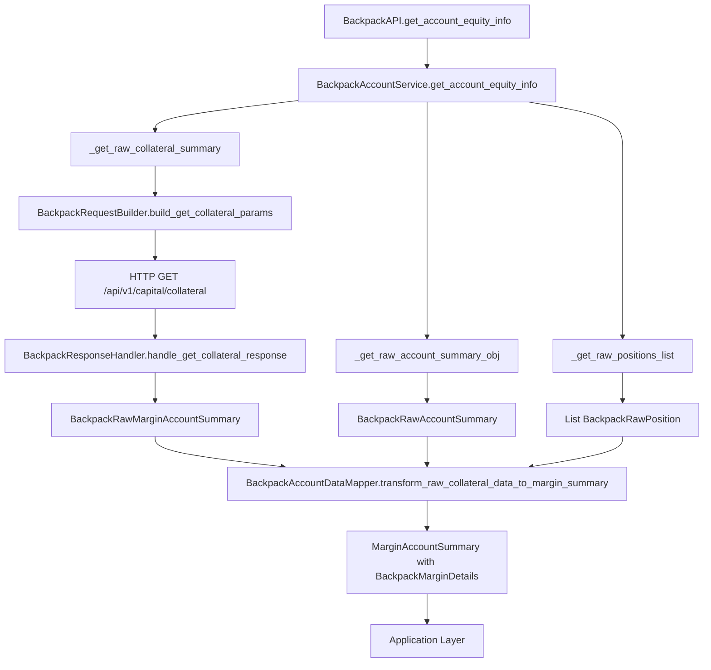
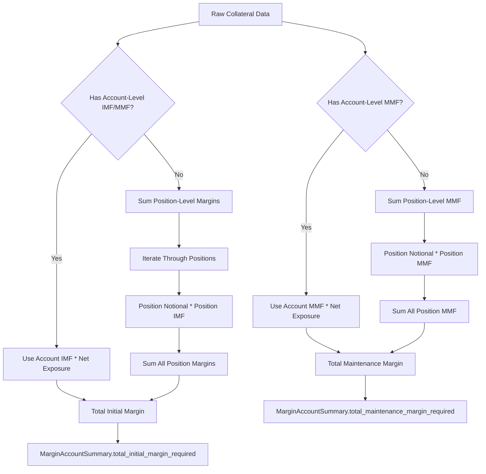
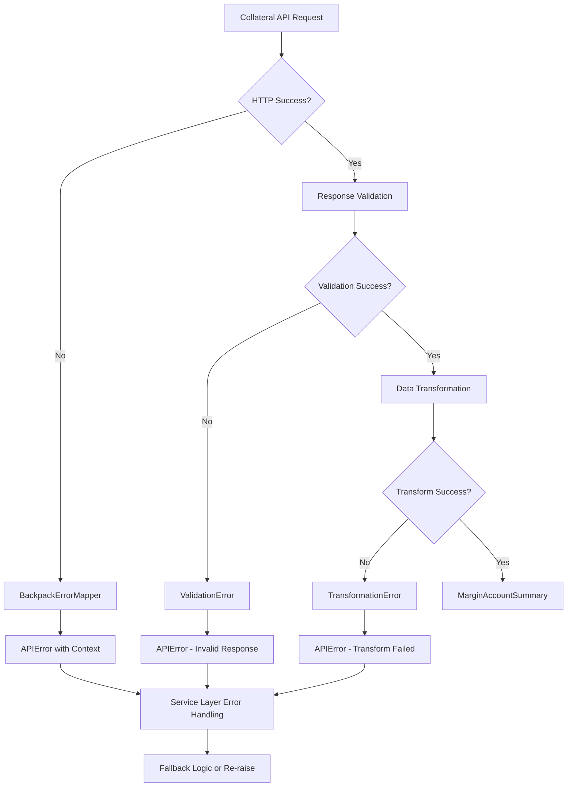

# Backpack Collateral and Margin Implementation Plan

## Executive Summary

This document outlines a comprehensive plan to implement missing collateral and margin functionality for Backpack Exchange in the CyberDeltaEngine. Based on detailed analysis of the existing codebase and API capabilities, we need to add the `/api/v1/capital/collateral` endpoint implementation to provide real margin trading capabilities.

## Current State Analysis

### What We Have ✅

1. **Basic Account Data**:
   - Account balances via `/api/v1/capital` endpoint
   - Account settings/limits via `/api/v1/account` endpoint  
   - Position data via `/api/v1/position` endpoint

2. **Raw Models**:
   - `BackpackRawAccountSummary` - leverage limits and fees
   - `BackpackRawBalance` - available/locked/staked amounts
   - `BackpackRawPosition` - position data with IMF/MMF

3. **Service Layer**:
   - `BackpackAccountService` with balances, positions, account info
   - Proper error handling and transformation pipeline
   - Request builder and response handler patterns

### What We're Missing ❌

1. **Critical Collateral Endpoint**: `/api/v1/capital/collateral`
2. **Margin Models**: Account equity, collateral weights, margin requirements
3. **Risk Management Data**: Margin ratios, utilization rates, liquidation thresholds
4. **Account Limits Endpoints**: Max order/borrow/withdrawal quantities

## Architecture Consistency with Hyperliquid

### Hyperliquid Pattern Analysis

Hyperliquid uses a **single comprehensive endpoint** approach:
- **Endpoint**: `POST /info` with `{"type": "clearinghouseState"}`
- **Data Model**: `HyperliquidRawClearinghouseState` 
- **Provides**: Complete account state including equity, margins, positions

### Backpack Pattern (Target Implementation)

Backpack uses a **multi-endpoint specialized** approach:
- **Primary**: `/api/v1/capital/collateral` for equity/margin data
- **Secondary**: `/api/v1/account` for limits and settings
- **Complementary**: `/api/v1/position` for position-specific margin

This aligns with Backpack's REST API design philosophy of specialized endpoints.

## Implementation Plan

### Phase 1: Core Models Implementation

#### 1.1 Create Missing Raw Models

**File**: `cyberdelta/apis/backpack/models/bp_raw_collateral.py`

```python
class BackpackRawMarginAccountSummary(BaseModel):
    """Raw margin account summary from /api/v1/capital/collateral endpoint."""
    
    # Core Equity Fields
    net_equity: RawBpStringToFiniteDecimal = Field(..., alias="netEquity")
    net_equity_available: RawBpStringToFiniteDecimal = Field(..., alias="netEquityAvailable") 
    net_equity_locked: RawBpStringToFiniteDecimal = Field(..., alias="netEquityLocked")
    assets_value: RawBpStringToFiniteDecimal = Field(..., alias="assetsValue")
    liabilities_value: RawBpStringToFiniteDecimal = Field(..., alias="liabilitiesValue")
    
    # Margin Fields
    imf: RawBpStringToFiniteDecimal = Field(..., alias="imf")  # Initial Margin Fraction
    mmf: RawBpStringToFiniteDecimal = Field(..., alias="mmf")  # Maintenance Margin Fraction
    margin_fraction: RawBpStringToFiniteDecimal = Field(..., alias="marginFraction")
    
    # Position & Risk Fields
    borrow_liability: RawBpStringToFiniteDecimal = Field(..., alias="borrowLiability")
    pnl_unrealized: RawBpStringToFiniteDecimal = Field(..., alias="pnlUnrealized")
    unsettled_equity: RawBpStringToFiniteDecimal = Field(..., alias="unsettledEquity")
    net_exposure_futures: RawBpStringToFiniteDecimal = Field(..., alias="netExposureFutures")
    
    # Collateral Details
    collateral: list[BackpackRawCollateralAsset] = Field(..., alias="collateral")
    
    model_config = ConfigDict(extra="forbid", frozen=True, populate_by_name=True)

class BackpackRawCollateralAsset(BaseModel):
    """Individual asset collateral information."""
    
    symbol: RawBpNonEmptyStringMax64 = Field(..., alias="symbol")
    asset_mark_price: RawBpStringToFiniteDecimal = Field(..., alias="assetMarkPrice")
    total_quantity: RawBpStringToFiniteDecimal = Field(..., alias="totalQuantity")
    balance_notional: RawBpStringToFiniteDecimal = Field(..., alias="balanceNotional")
    collateral_weight: RawBpStringToFiniteDecimal = Field(..., alias="collateralWeight")
    collateral_value: RawBpStringToFiniteDecimal = Field(..., alias="collateralValue")
    open_order_quantity: RawBpStringToFiniteDecimal = Field(..., alias="openOrderQuantity")
    lend_quantity: RawBpStringToFiniteDecimal = Field(..., alias="lendQuantity")
    available_quantity: RawBpStringToFiniteDecimal = Field(..., alias="availableQuantity")
    
    model_config = ConfigDict(extra="forbid", frozen=True, populate_by_name=True)
```

#### 1.2 Create Account Limits Models

**File**: `cyberdelta/apis/backpack/models/bp_raw_account_limits.py`

```python
class BackpackRawMaxOrderQuantity(BaseModel):
    """Raw response from /api/v1/account/limits/order endpoint."""
    
    max_quantity: RawBpStringToFiniteDecimal = Field(..., alias="maxQuantity")
    
    model_config = ConfigDict(extra="forbid", frozen=True, populate_by_name=True)

class BackpackRawMaxBorrowQuantity(BaseModel):
    """Raw response from /api/v1/account/limits/borrow endpoint."""
    
    max_quantity: RawBpStringToFiniteDecimal = Field(..., alias="maxQuantity")
    
    model_config = ConfigDict(extra="forbid", frozen=True, populate_by_name=True)

class BackpackRawMaxWithdrawalQuantity(BaseModel):
    """Raw response from /api/v1/account/limits/withdrawal endpoint."""
    
    max_quantity: RawBpStringToFiniteDecimal = Field(..., alias="maxQuantity")
    
    model_config = ConfigDict(extra="forbid", frozen=True, populate_by_name=True)
```

### Phase 2: Service Layer Enhancement

#### 2.1 Add Collateral Methods to BackpackAccountService

**File**: `cyberdelta/apis/backpack/services/bp_account_service.py`

```python
class BackpackAccountService:
    # ... existing methods ...
    
    async def _get_raw_collateral_summary(
        self, 
        subaccount_id: str | None = None
    ) -> BackpackRawMarginAccountSummary:
        """Get raw collateral/margin summary from exchange."""
        endpoint_path = "/api/v1/capital/collateral"
        params = self._request_builder.build_get_collateral_params(subaccount_id)
        
        try:
            raw_data, status_code, _ = await self._http_client_requester(
                method="GET",
                endpoint=endpoint_path,
                params=params.model_dump(by_alias=True, exclude_none=True),
                is_signed=True,
                endpoint_group="private",
                request_weight=1,
            )
            
            if raw_data is None:
                raise APIError(
                    message=f"No collateral data received, status: {status_code}",
                    code=APIErrorCode.INVALID_RESPONSE.value,
                    http_status=status_code,
                )
            
            return self._response_handler.handle_get_collateral_response(raw_data)
            
        except APIError:
            raise
        # ... standard error handling pattern ...
    
    async def get_account_equity_info(
        self, 
        subaccount_id: str | None = None
    ) -> MarginAccountSummary:
        """Get comprehensive account equity and margin information."""
        
        # Get all necessary raw data
        raw_collateral = await self._get_raw_collateral_summary(subaccount_id)
        raw_settings = await self._get_raw_account_summary_obj()
        raw_positions = await self._get_raw_positions_list()
        
        # Transform to internal model
        return self._mapper.transform_raw_collateral_data_to_margin_summary(
            raw_collateral=raw_collateral,
            raw_settings=raw_settings, 
            raw_positions=raw_positions,
        )
        
    async def get_max_order_quantity(
        self, 
        symbol: str, 
        side: OrderSide, 
        price: Decimal | None = None
    ) -> Decimal:
        """Get maximum order quantity based on available margin."""
        endpoint_path = "/api/v1/account/limits/order"
        params = self._request_builder.build_get_max_order_quantity_params(
            symbol, side, price
        )
        
        raw_data, status_code, _ = await self._http_client_requester(
            method="GET",
            endpoint=endpoint_path, 
            params=params.model_dump(by_alias=True, exclude_none=True),
            is_signed=True,
            endpoint_group="private",
            request_weight=1,
        )
        
        raw_response = self._response_handler.handle_get_max_order_quantity_response(raw_data)
        return parse_decimal_value(raw_response.max_quantity, allow_none=False)
```

#### 2.2 Update get_account_info() Method

The existing `get_account_info()` method needs enhancement to use the new collateral data:

```python
async def get_account_info(self) -> MarginAccountSummary:
    """Enhanced account info using collateral endpoint."""
    
    try:
        # Get comprehensive collateral data instead of basic summary
        return await self.get_account_equity_info()
        
    except APIError as e:
        # Fallback to basic implementation if collateral endpoint fails
        if e.http_status == 404:
            logger.warning("Collateral endpoint not available, using basic implementation")
            return await self._get_basic_account_info_fallback()
        raise
```

### Phase 3: Request Builder Enhancement

#### 3.1 Add Collateral Request Methods

**File**: `cyberdelta/apis/backpack/bp_request_builder.py`

```python
class BackpackRequestBuilder:
    # ... existing methods ...
    
    def build_get_collateral_params(
        self, 
        subaccount_id: str | None = None
    ) -> BackpackRawCollateralQueryParams:
        """Build parameters for collateral endpoint."""
        return BackpackRawCollateralQueryParams(
            subaccount_id=subaccount_id
        )
    
    def build_get_max_order_quantity_params(
        self,
        symbol: str,
        side: OrderSide, 
        price: Decimal | None = None
    ) -> BackpackRawMaxOrderQuantityQueryParams:
        """Build parameters for max order quantity endpoint."""
        return BackpackRawMaxOrderQuantityQueryParams(
            symbol=symbol,
            side=side.value,
            price=str(price) if price else None
        )
```

### Phase 4: Response Handler Enhancement

#### 4.1 Add Collateral Response Handlers

**File**: `cyberdelta/apis/backpack/bp_response_handler.py`

```python
class BackpackResponseHandler:
    # ... existing methods ...
    
    def handle_get_collateral_response(
        self, 
        raw_data: ParsedJsonResponse
    ) -> BackpackRawMarginAccountSummary:
        """Handle collateral endpoint response."""
        
        try:
            return BackpackRawMarginAccountSummary.model_validate(raw_data)
        except ValidationError as e:
            logger.error(f"Collateral response validation failed: {e}")
            raise APIError(
                message="Invalid collateral response format",
                code=APIErrorCode.INVALID_RESPONSE.value,
                original_exception=e,
                exchange_message=str(raw_data)
            ) from e
    
    def handle_get_max_order_quantity_response(
        self,
        raw_data: ParsedJsonResponse
    ) -> BackpackRawMaxOrderQuantity:
        """Handle max order quantity response."""
        
        try:
            return BackpackRawMaxOrderQuantity.model_validate(raw_data)
        except ValidationError as e:
            logger.error(f"Max order quantity response validation failed: {e}")
            raise APIError(
                message="Invalid max order quantity response format", 
                code=APIErrorCode.INVALID_RESPONSE.value,
                original_exception=e,
                exchange_message=str(raw_data)
            ) from e
```

### Phase 5: Mapper Enhancement

#### 5.1 Enhanced Account Data Mapper

**File**: `cyberdelta/apis/backpack/mappers/bp_account_data_mapper.py`

```python
class BackpackAccountDataMapper:
    # ... existing methods ...
    
    def transform_raw_collateral_data_to_margin_summary(
        self,
        raw_collateral: BackpackRawMarginAccountSummary,
        raw_settings: BackpackRawAccountSummary,
        raw_positions: list[BackpackRawPosition],
    ) -> MarginAccountSummary:
        """Transform comprehensive collateral data to internal margin summary."""
        
        try:
            # Parse core equity values
            total_equity = parse_decimal_value(raw_collateral.net_equity, allow_none=False)
            available_equity = parse_decimal_value(raw_collateral.net_equity_available, allow_none=False)
            
            # Calculate margin requirements
            total_initial_margin = self._calculate_total_initial_margin_required(
                raw_collateral, raw_positions
            )
            total_maintenance_margin = self._calculate_total_maintenance_margin_required(
                raw_collateral, raw_positions  
            )
            
            # Calculate position notional
            total_position_notional = parse_decimal_value(
                raw_collateral.net_exposure_futures, allow_none=True
            )
            
            # Calculate unrealized PnL
            total_unrealized_pnl = parse_decimal_value(
                raw_collateral.pnl_unrealized, allow_none=True
            )
            
            # Create Backpack-specific details
            bp_details = BackpackMarginDetails(
                assets_value=parse_decimal_value(raw_collateral.assets_value),
                borrow_liability=parse_decimal_value(raw_collateral.borrow_liability),
                liabilities_value=parse_decimal_value(raw_collateral.liabilities_value),
                locked_equity=parse_decimal_value(raw_collateral.net_equity_locked),
                margin_fraction=parse_decimal_value(raw_collateral.margin_fraction),
                imf_raw=raw_collateral.imf,
                mmf_raw=raw_collateral.mmf,
            )
            
            return MarginAccountSummary(
                exchange="backpack",
                timestamp=datetime.now(UTC),
                total_equity=total_equity,
                available_equity=available_equity,
                total_initial_margin_required=total_initial_margin,
                total_maintenance_margin_required=total_maintenance_margin,
                total_position_notional=total_position_notional,
                total_unrealized_pnl=total_unrealized_pnl,
                bp_details=bp_details,
            )
            
        except Exception as e:
            raise TransformationError(
                f"Failed to transform collateral data to MarginAccountSummary: {e}"
            ) from e
    
    def _calculate_total_initial_margin_required(
        self,
        raw_collateral: BackpackRawMarginAccountSummary,
        raw_positions: list[BackpackRawPosition],
    ) -> Decimal | None:
        """Calculate total initial margin requirements."""
        
        try:
            # Use IMF from collateral data
            imf = parse_decimal_value(raw_collateral.imf, allow_none=False)
            net_exposure = parse_decimal_value(
                raw_collateral.net_exposure_futures, allow_none=False
            )
            
            return imf * net_exposure
            
        except Exception:
            # Fallback: sum individual position margins
            total_margin = Decimal("0")
            for position in raw_positions:
                if position.net_quantity and parse_decimal_value(position.net_quantity) != Decimal("0"):
                    # Calculate position-specific margin
                    position_notional = abs(parse_decimal_value(position.net_exposure_notional) or Decimal("0"))
                    position_imf = parse_decimal_value(position.imf, allow_none=True) or Decimal("0")
                    total_margin += position_notional * position_imf
            
            return total_margin if total_margin > Decimal("0") else None
    
    def _calculate_total_maintenance_margin_required(
        self,
        raw_collateral: BackpackRawMarginAccountSummary,
        raw_positions: list[BackpackRawPosition],
    ) -> Decimal | None:
        """Calculate total maintenance margin requirements."""
        
        try:
            # Use MMF from collateral data
            mmf = parse_decimal_value(raw_collateral.mmf, allow_none=False)
            net_exposure = parse_decimal_value(
                raw_collateral.net_exposure_futures, allow_none=False
            )
            
            return mmf * net_exposure
            
        except Exception:
            # Fallback: sum individual position maintenance margins
            total_margin = Decimal("0")
            for position in raw_positions:
                if position.net_quantity and parse_decimal_value(position.net_quantity) != Decimal("0"):
                    position_notional = abs(parse_decimal_value(position.net_exposure_notional) or Decimal("0"))
                    position_mmf = parse_decimal_value(position.mmf, allow_none=True) or Decimal("0")
                    total_margin += position_notional * position_mmf
            
            return total_margin if total_margin > Decimal("0") else None
```

### Phase 6: API Interface Enhancement

#### 6.1 Add Public Methods to BackpackAPI

**File**: `cyberdelta/apis/backpack/bp_api.py`

```python
class BackpackAPI(ExchangeAPI):
    # ... existing methods ...
    
    async def get_account_equity_info(
        self, 
        subaccount_id: str | None = None
    ) -> MarginAccountSummary:
        """Get detailed account equity and margin information."""
        return await self.account_service.get_account_equity_info(subaccount_id)
    
    async def get_max_order_quantity(
        self,
        symbol: str,
        side: OrderSide,
        price: Decimal | None = None
    ) -> Decimal:
        """Get maximum order quantity based on available margin."""
        return await self.account_service.get_max_order_quantity(symbol, side, price)
    
    async def get_collateral_details(
        self,
        subaccount_id: str | None = None
    ) -> list[dict[str, Any]]:
        """Get detailed collateral breakdown by asset."""
        raw_collateral = await self.account_service._get_raw_collateral_summary(subaccount_id)
        return [
            {
                "symbol": asset.symbol,
                "total_quantity": parse_decimal_value(asset.total_quantity),
                "collateral_value": parse_decimal_value(asset.collateral_value),
                "collateral_weight": parse_decimal_value(asset.collateral_weight),
                "available_quantity": parse_decimal_value(asset.available_quantity),
            }
            for asset in raw_collateral.collateral
        ]
```

### Phase 7: Query Parameters Models

#### 7.1 Add Missing Query Parameter Models

**File**: `cyberdelta/apis/backpack/models/bp_raw_query_params.py`

```python
class BackpackRawCollateralQueryParams(BaseModel):
    """Query parameters for collateral endpoint."""
    
    subaccount_id: str | None = Field(default=None, alias="subaccountId")
    
    model_config = ConfigDict(extra="forbid", populate_by_name=True)

class BackpackRawMaxOrderQuantityQueryParams(BaseModel):
    """Query parameters for max order quantity endpoint."""
    
    symbol: str = Field(..., alias="symbol")
    side: str = Field(..., alias="side")  # "Buy" or "Sell"
    price: str | None = Field(default=None, alias="price")
    
    model_config = ConfigDict(extra="forbid", populate_by_name=True)

class BackpackRawMaxBorrowQuantityQueryParams(BaseModel):
    """Query parameters for max borrow quantity endpoint."""
    
    symbol: str = Field(..., alias="symbol")
    
    model_config = ConfigDict(extra="forbid", populate_by_name=True)

class BackpackRawMaxWithdrawalQuantityQueryParams(BaseModel):
    """Query parameters for max withdrawal quantity endpoint."""
    
    symbol: str = Field(..., alias="symbol")
    
    model_config = ConfigDict(extra="forbid", populate_by_name=True)
```

## Data Flow Diagrams

### Comprehensive Collateral Data Flow



### Margin Calculation Flow



### Error Handling Flow



## Implementation Priority

### Phase 1 (Critical - Weeks 1-2)
1. ✅ Raw collateral models (`BackpackRawMarginAccountSummary`)
2. ✅ Service method (`get_account_equity_info`)
3. ✅ Request builder collateral methods
4. ✅ Response handler collateral methods

### Phase 2 (High - Weeks 2-3)  
1. ✅ Enhanced account data mapper with collateral support
2. ✅ Update existing `get_account_info()` method
3. ✅ API interface methods (`get_account_equity_info`)
4. ✅ Basic error handling and fallback logic

### Phase 3 (Medium - Weeks 3-4)
1. ✅ Account limits endpoints (max order/borrow/withdrawal)
2. ✅ Query parameter models
3. ✅ Integration tests
4. ✅ Documentation

### Phase 4 (Enhancement - Weeks 4-5)
1. ✅ WebSocket collateral updates (if supported)
2. ✅ Advanced risk calculations
3. ✅ Performance optimizations
4. ✅ Additional helper methods

## Risk Assessment

### High Risk Items
1. **API Availability**: `/api/v1/capital/collateral` endpoint availability in test environment
2. **Data Consistency**: Ensuring collateral data matches position data
3. **Breaking Changes**: Modifications to existing `get_account_info()` behavior

### Mitigation Strategies  
1. **Fallback Implementation**: Keep existing basic account info as fallback
2. **Progressive Enhancement**: Add new methods without breaking existing ones
3. **Comprehensive Testing**: Test with both test and production API formats

## Success Criteria

### Functional Requirements
1. ✅ Accurate total equity calculation from collateral endpoint
2. ✅ Proper margin requirement calculations (initial + maintenance)
3. ✅ Consistent data with position-level margin information
4. ✅ Fallback behavior when collateral endpoint unavailable

### Non-Functional Requirements
1. ✅ Response time < 500ms for collateral data retrieval
2. ✅ Error handling maintaining system stability
3. ✅ Type safety with comprehensive Pydantic validation
4. ✅ Backward compatibility with existing API interface

### Testing Requirements
1. ✅ Unit tests for all new mapper transformations
2. ✅ Integration tests with VCR cassettes
3. ✅ Error condition testing (network failures, invalid responses)
4. ✅ Performance testing under load

## Consistency Checks with Hyperliquid

### Architecture Alignment
- ✅ Both use `MarginAccountSummary` as unified internal model
- ✅ Both use exchange-specific details slots (`bp_details`/`hl_details`)
- ✅ Both follow same service → mapper → domain model pattern
- ✅ Both use Decimal precision for financial calculations

### Business Logic Consistency
- ✅ Total equity calculation methodology 
- ✅ Available equity vs withdrawable funds semantics
- ✅ Initial vs maintenance margin requirement distinction
- ✅ Position notional value aggregation logic

### Data Model Consistency
- ✅ Core `MarginAccountSummary` fields remain identical
- ✅ Exchange-specific enrichment via typed extension slots
- ✅ Immutable model design with proper validation
- ✅ Error handling and transformation patterns

## Conclusion

This implementation plan provides a comprehensive approach to adding collateral and margin functionality to Backpack Exchange integration. The plan maintains architectural consistency with the existing Hyperliquid implementation while accommodating Backpack's specific API design patterns.

The phased approach allows for incremental delivery of value while managing risk through progressive enhancement and comprehensive testing. The final implementation will provide CyberDeltaEngine with complete margin trading capabilities across both supported exchanges.