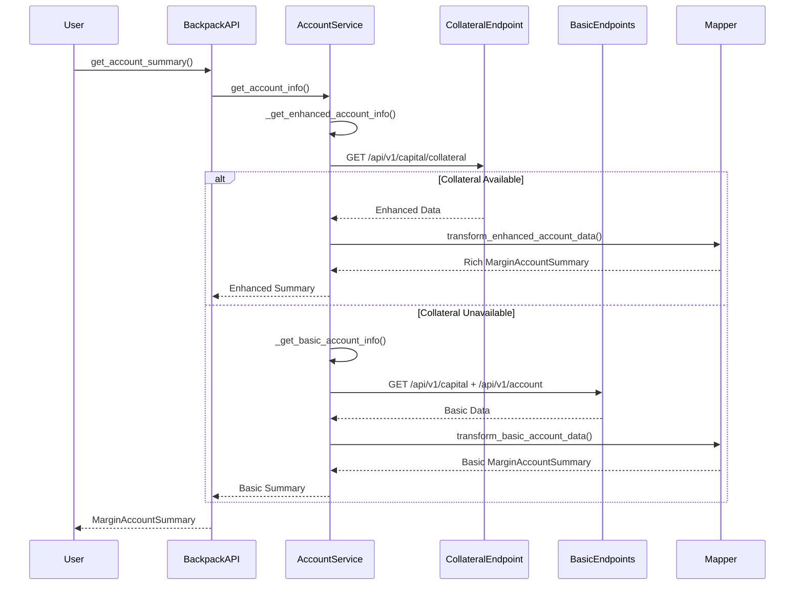

# Backpack Collateral and Margin Implementation Plan - REVISED

## Executive Summary

This document outlines a **architecturally compliant** implementation plan for adding missing collateral and margin functionality to Backpack Exchange in the CyberDeltaEngine. The plan respects the exchange-agnostic architecture by enhancing existing methods internally rather than adding new public methods to BackpackAPI.

## Architectural Compliance Analysis

### Previous Plan Violations ❌

The original plans violated our core architectural principles:

1. **New Public Methods**: Added exchange-specific methods like `get_max_borrow_quantity()` to `BackpackAPI`
2. **Interface Pollution**: Suggested adding optional methods to base `ExchangeAPI` interface
3. **Exchange Agnosticism Breach**: Created exchange-specific public APIs

### Corrected Approach ✅

**Core Principle**: Enhance existing methods internally while maintaining exchange-agnostic public interface.

**Key Changes**:
- Enhance `BackpackAccountService.get_account_info()` to use collateral endpoint internally
- Keep all account limits functionality as private methods within service layer
- Return enhanced `MarginAccountSummary` with richer `bp_details` extension slot
- Maintain complete exchange agnosticism at API layer

## Current State Analysis

### What We Have ✅

1. **Existing Public Interface**:
   - `get_account_summary()` → returns `MarginAccountSummary`
   - Consistent with Hyperliquid implementation
   - Exchange-agnostic return type

2. **Basic Account Data**:
   - Account balances via `/api/v1/capital`
   - Account settings via `/api/v1/account` 
   - Position data via `/api/v1/position`

3. **Service Infrastructure**:
   - `BackpackAccountService.get_account_info()` method
   - Request builder and response handler patterns
   - Proper error handling pipeline

### What We're Missing ❌

1. **Enhanced Data Source**: `/api/v1/capital/collateral` endpoint
2. **Rich Margin Models**: Detailed equity, collateral weights, margin calculations
3. **Internal Risk Calculations**: Account limits as private service methods

## Revised Implementation Plan

### Phase 1: Enhanced Raw Models

**File**: `cyberdelta/apis/backpack/models/bp_raw_collateral.py`

```python
class BackpackRawCollateralResponse(BaseModel):
    """Raw response from /api/v1/capital/collateral endpoint."""
    
    # Core Equity Fields
    net_equity: RawBpStringToFiniteDecimal = Field(..., alias="netEquity")
    net_equity_available: RawBpStringToFiniteDecimal = Field(..., alias="netEquityAvailable") 
    net_equity_locked: RawBpStringToFiniteDecimal = Field(..., alias="netEquityLocked")
    assets_value: RawBpStringToFiniteDecimal = Field(..., alias="assetsValue")
    liabilities_value: RawBpStringToFiniteDecimal = Field(..., alias="liabilitiesValue")
    
    # Margin Fields
    imf: RawBpStringToFiniteDecimal = Field(..., alias="imf")  # Initial Margin Fraction
    mmf: RawBpStringToFiniteDecimal = Field(..., alias="mmf")  # Maintenance Margin Fraction
    margin_fraction: RawBpStringToFiniteDecimal = Field(..., alias="marginFraction")
    
    # Position & Risk Fields
    borrow_liability: RawBpStringToFiniteDecimal = Field(..., alias="borrowLiability")
    pnl_unrealized: RawBpStringToFiniteDecimal = Field(..., alias="pnlUnrealized")
    unsettled_equity: RawBpStringToFiniteDecimal = Field(..., alias="unsettledEquity")
    net_exposure_futures: RawBpStringToFiniteDecimal = Field(..., alias="netExposureFutures")
    
    # Collateral Details
    collateral: list[BackpackRawCollateralAsset] = Field(..., alias="collateral")
    
    model_config = ConfigDict(extra="forbid", frozen=True, populate_by_name=True)

class BackpackRawCollateralAsset(BaseModel):
    """Individual asset collateral information."""
    
    symbol: RawBpNonEmptyStringMax64 = Field(..., alias="symbol")
    asset_mark_price: RawBpStringToFiniteDecimal = Field(..., alias="assetMarkPrice")
    total_quantity: RawBpStringToFiniteDecimal = Field(..., alias="totalQuantity")
    balance_notional: RawBpStringToFiniteDecimal = Field(..., alias="balanceNotional")
    collateral_weight: RawBpStringToFiniteDecimal = Field(..., alias="collateralWeight")
    collateral_value: RawBpStringToFiniteDecimal = Field(..., alias="collateralValue")
    open_order_quantity: RawBpStringToFiniteDecimal = Field(..., alias="openOrderQuantity")
    lend_quantity: RawBpStringToFiniteDecimal = Field(..., alias="lendQuantity")
    available_quantity: RawBpStringToFiniteDecimal = Field(..., alias="availableQuantity")
    
    model_config = ConfigDict(extra="forbid", frozen=True, populate_by_name=True)
```

### Phase 2: Enhanced BackpackMarginDetails Model

**File**: `cyberdelta/core/models/margin_account.py` (additions)

```python
class BackpackMarginDetails(BaseModel):
    """Backpack-specific margin account enrichment."""
    
    # Enhanced equity breakdown
    assets_value: Decimal | None = None
    liabilities_value: Decimal | None = None
    locked_equity: Decimal | None = None
    borrow_liability: Decimal | None = None
    unsettled_equity: Decimal | None = None
    
    # Risk metrics
    margin_fraction: Decimal | None = None
    net_exposure_futures: Decimal | None = None
    
    # Raw margin factors for debugging
    imf_raw: str | None = None
    mmf_raw: str | None = None
    
    # Account limits (internal calculations)
    _max_order_calculations: dict[str, Any] | None = Field(default=None, exclude=True)
    _risk_metrics: dict[str, Any] | None = Field(default=None, exclude=True)
    
    model_config = ConfigDict(extra="forbid", validate_assignment=True)
```

### Phase 3: Enhanced AccountService (CORE IMPLEMENTATION)

**File**: `cyberdelta/apis/backpack/services/bp_account_service.py`

```python
class BackpackAccountService:
    # ... existing methods ...
    
    async def get_account_info(self) -> MarginAccountSummary:
        """Get comprehensive account information using enhanced collateral data.
        
        ARCHITECTURAL NOTE: This method enhances internally without changing
        the public interface. All new functionality remains private to the service.
        """
        frame = inspect.currentframe()
        current_method = frame.f_code.co_name if frame is not None else "get_account_info"
        
        raw_response_content: str | None = None
        status_code: int = 0
        
        try:
            # Try enhanced collateral endpoint first
            margin_summary = await self._get_enhanced_account_info()
            if margin_summary is not None:
                return margin_summary
                
            # Fallback to basic implementation
            logger.info(f"[{self._exchange_name}] Collateral endpoint unavailable, using basic implementation")
            return await self._get_basic_account_info()
            
        except APIError:
            raise
        except Exception as e_unexpected:
            logger.error(
                f"[{self._exchange_name}] {current_method}: Unexpected service failure: {e_unexpected}",
                exc_info=True,
            )
            raise APIError(
                code=APIErrorCode.UNKNOWN.value,
                message="Unexpected service failure.",
                original_exception=e_unexpected,
                http_status=status_code if status_code != 0 else None,
                exchange_message=raw_response_content,
            ) from e_unexpected
    
    async def _get_enhanced_account_info(self) -> MarginAccountSummary | None:
        """Private method: Get account info using collateral endpoint."""
        try:
            # Fetch all required data
            raw_collateral = await self._fetch_collateral_data()
            raw_settings = await self._get_raw_account_summary_obj()
            raw_positions = await self._get_raw_positions_list()
            
            # Transform to enhanced internal model
            return self._mapper.transform_enhanced_account_data_to_margin_summary(
                raw_collateral=raw_collateral,
                raw_settings=raw_settings,
                raw_positions=raw_positions,
            )
            
        except APIError as e:
            # If collateral endpoint is not available (404), return None for fallback
            if e.http_status == 404:
                logger.debug(f"[{self._exchange_name}] Collateral endpoint not available")
                return None
            # Re-raise other API errors
            raise
    
    async def _fetch_collateral_data(self) -> BackpackRawCollateralResponse:
        """Private method: Fetch data from collateral endpoint."""
        endpoint_path = "/api/v1/capital/collateral"
        
        # No parameters needed for basic collateral call
        raw_data, status_code, _ = await self._http_client_requester(
            method="GET",
            endpoint=endpoint_path,
            params=None,
            is_signed=True,
            endpoint_group="private",
            request_weight=1,
        )
        
        if raw_data is None:
            raise APIError(
                message=f"No collateral data received, status: {status_code}",
                code=APIErrorCode.INVALID_RESPONSE.value,
                http_status=status_code,
            )
        
        return self._response_handler.handle_collateral_response(raw_data)
    
    async def _calculate_max_order_quantity_internal(
        self, 
        symbol: str, 
        side: OrderSide, 
        price: Decimal | None = None
    ) -> Decimal | None:
        """Private method: Calculate max order quantity for internal risk management."""
        try:
            endpoint_path = "/api/v1/account/limits/order"
            params = {
                "symbol": symbol,
                "side": "Bid" if side == OrderSide.BUY else "Ask"
            }
            if price is not None:
                params["price"] = str(price)
            
            raw_data, status_code, _ = await self._http_client_requester(
                method="GET",
                endpoint=endpoint_path,
                params=params,
                is_signed=True,
                endpoint_group="private",
                request_weight=1,
            )
            
            if raw_data is None or "maxOrderQuantity" not in raw_data:
                return None
            
            return parse_decimal_value(raw_data["maxOrderQuantity"], allow_none=True)
            
        except Exception as e:
            logger.debug(f"[{self._exchange_name}] Max order quantity calculation failed: {e}")
            return None
    
    async def _get_basic_account_info(self) -> MarginAccountSummary:
        """Private method: Fallback to basic account info implementation."""
        # Keep existing implementation as fallback
        raw_account_summary = await self._get_raw_account_summary_obj()
        raw_balances = await self._get_raw_balances_dict()
        raw_positions = await self._get_raw_positions_list()
        
        return self._mapper.transform_basic_account_data_to_margin_summary(
            raw_account_summary=raw_account_summary,
            raw_balances=raw_balances,
            raw_positions=raw_positions,
        )
```

### Phase 4: Enhanced Response Handler

**File**: `cyberdelta/apis/backpack/bp_response_handler.py`

```python
class BackpackResponseHandler:
    # ... existing methods ...
    
    @staticmethod
    def handle_collateral_response(
        raw_data: ParsedJsonResponse
    ) -> BackpackRawCollateralResponse:
        """Handle collateral endpoint response."""
        
        try:
            return BackpackRawCollateralResponse.model_validate(raw_data)
        except ValidationError as e:
            logger.error(f"Collateral response validation failed: {e}")
            raise APIError(
                message="Invalid collateral response format",
                code=APIErrorCode.INVALID_RESPONSE.value,
                original_exception=e,
                exchange_message=str(raw_data)
            ) from e
```

### Phase 5: Enhanced Account Data Mapper

**File**: `cyberdelta/apis/backpack/mappers/bp_account_data_mapper.py`

```python
class BackpackAccountDataMapper:
    # ... existing methods ...
    
    def transform_enhanced_account_data_to_margin_summary(
        self,
        raw_collateral: BackpackRawCollateralResponse,
        raw_settings: BackpackRawAccountSummary,
        raw_positions: list[BackpackRawPosition],
    ) -> MarginAccountSummary:
        """Transform enhanced collateral data to internal margin summary."""
        
        try:
            # Parse core equity values from collateral endpoint
            total_equity = parse_decimal_value(raw_collateral.net_equity, allow_none=False)
            available_equity = parse_decimal_value(raw_collateral.net_equity_available, allow_none=False)
            
            # Calculate enhanced margin requirements
            total_initial_margin = self._calculate_enhanced_initial_margin(
                raw_collateral, raw_positions
            )
            total_maintenance_margin = self._calculate_enhanced_maintenance_margin(
                raw_collateral, raw_positions  
            )
            
            # Calculate position notional from collateral data
            total_position_notional = parse_decimal_value(
                raw_collateral.net_exposure_futures, allow_none=True
            )
            
            # Calculate unrealized PnL from collateral data
            total_unrealized_pnl = parse_decimal_value(
                raw_collateral.pnl_unrealized, allow_none=True
            )
            
            # Create enhanced Backpack-specific details
            bp_details = BackpackMarginDetails(
                assets_value=parse_decimal_value(raw_collateral.assets_value),
                liabilities_value=parse_decimal_value(raw_collateral.liabilities_value),
                locked_equity=parse_decimal_value(raw_collateral.net_equity_locked),
                borrow_liability=parse_decimal_value(raw_collateral.borrow_liability),
                unsettled_equity=parse_decimal_value(raw_collateral.unsettled_equity),
                margin_fraction=parse_decimal_value(raw_collateral.margin_fraction),
                net_exposure_futures=parse_decimal_value(raw_collateral.net_exposure_futures),
                imf_raw=raw_collateral.imf,
                mmf_raw=raw_collateral.mmf,
            )
            
            return MarginAccountSummary(
                exchange="backpack",
                timestamp=datetime.now(UTC),
                total_equity=total_equity,
                available_equity=available_equity,
                total_initial_margin_required=total_initial_margin,
                total_maintenance_margin_required=total_maintenance_margin,
                total_position_notional=total_position_notional,
                total_unrealized_pnl=total_unrealized_pnl,
                bp_details=bp_details,
            )
            
        except Exception as e:
            raise TransformationError(
                f"Failed to transform enhanced collateral data to MarginAccountSummary: {e}"
            ) from e
    
    def _calculate_enhanced_initial_margin(
        self,
        raw_collateral: BackpackRawCollateralResponse,
        raw_positions: list[BackpackRawPosition],
    ) -> Decimal | None:
        """Calculate initial margin using enhanced collateral data."""
        
        try:
            # Primary: Use account-level IMF from collateral endpoint
            imf = parse_decimal_value(raw_collateral.imf, allow_none=False)
            net_exposure = parse_decimal_value(
                raw_collateral.net_exposure_futures, allow_none=False
            )
            
            if imf is not None and net_exposure is not None:
                return imf * abs(net_exposure)
                
        except Exception:
            logger.debug("Account-level IMF calculation failed, falling back to position-level")
        
        # Fallback: Sum position-level margins
        return self._calculate_position_level_initial_margin(raw_positions)
    
    def _calculate_enhanced_maintenance_margin(
        self,
        raw_collateral: BackpackRawCollateralResponse,
        raw_positions: list[BackpackRawPosition],
    ) -> Decimal | None:
        """Calculate maintenance margin using enhanced collateral data."""
        
        try:
            # Primary: Use account-level MMF from collateral endpoint
            mmf = parse_decimal_value(raw_collateral.mmf, allow_none=False)
            net_exposure = parse_decimal_value(
                raw_collateral.net_exposure_futures, allow_none=False
            )
            
            if mmf is not None and net_exposure is not None:
                return mmf * abs(net_exposure)
                
        except Exception:
            logger.debug("Account-level MMF calculation failed, falling back to position-level")
        
        # Fallback: Sum position-level margins
        return self._calculate_position_level_maintenance_margin(raw_positions)
    
    def transform_basic_account_data_to_margin_summary(
        self,
        raw_account_summary: BackpackRawAccountSummary,
        raw_balances: dict[str, BackpackRawBalance],
        raw_positions: list[BackpackRawPosition],
    ) -> MarginAccountSummary:
        """Transform basic account data to margin summary (fallback implementation)."""
        
        # Keep existing basic transformation logic here
        # This maintains backward compatibility when collateral endpoint is unavailable
        
        try:
            # Calculate basic equity from balances
            total_equity = self._calculate_total_equity_from_balances(raw_balances)
            available_equity = self._calculate_available_equity_from_balances(raw_balances)
            
            # Calculate basic margin requirements
            total_initial_margin = self._calculate_position_level_initial_margin(raw_positions)
            total_maintenance_margin = self._calculate_position_level_maintenance_margin(raw_positions)
            
            # Basic position notional calculation
            total_position_notional = self._calculate_total_position_notional(raw_positions)
            total_unrealized_pnl = self._calculate_total_unrealized_pnl(raw_positions)
            
            # Basic Backpack details
            bp_details = BackpackMarginDetails(
                # Limited data from basic endpoints
                imf_raw=None,
                mmf_raw=None,
            )
            
            return MarginAccountSummary(
                exchange="backpack",
                timestamp=datetime.now(UTC),
                total_equity=total_equity,
                available_equity=available_equity,
                total_initial_margin_required=total_initial_margin,
                total_maintenance_margin_required=total_maintenance_margin,
                total_position_notional=total_position_notional,
                total_unrealized_pnl=total_unrealized_pnl,
                bp_details=bp_details,
            )
            
        except Exception as e:
            raise TransformationError(
                f"Failed to transform basic account data to MarginAccountSummary: {e}"
            ) from e
```

## Data Flow Diagram



## Architecture Compliance Verification

### ✅ Exchange Agnosticism Maintained
- Public interface remains unchanged (`get_account_summary()`)
- Return type is unified `MarginAccountSummary`
- No exchange-specific methods added to `BackpackAPI`
- Business logic operates on exchange-agnostic models

### ✅ Enhancement via Extension Slots
- Enhanced data populates `bp_details` extension slot
- Core fields remain consistent across exchanges
- Exchange-specific enrichment preserved
- Backward compatibility maintained

### ✅ Service Layer Encapsulation
- All new functionality private to `BackpackAccountService`
- Account limits calculations internal to service
- Risk management methods not exposed publicly
- Clean separation of concerns

### ✅ Fallback Strategy
- Graceful degradation when enhanced endpoints unavailable
- Existing functionality preserved
- Progressive enhancement approach
- No breaking changes

## Implementation Priority

### Phase 1 (Week 1) - Core Enhancement
1. Raw collateral models (`BackpackRawCollateralResponse`)
2. Enhanced `BackpackMarginDetails` model
3. Response handler for collateral endpoint
4. Basic service enhancement structure

### Phase 2 (Week 2) - Service Implementation  
1. Enhanced `get_account_info()` method
2. Private collateral data fetching
3. Enhanced mapper transformations
4. Fallback implementation

### Phase 3 (Week 3) - Risk Calculations
1. Internal account limits calculations
2. Enhanced margin requirement calculations
3. Risk metrics in extension slots
4. Comprehensive error handling

### Phase 4 (Week 4) - Testing & Documentation
1. Unit tests for all transformations
2. Integration tests with VCR cassettes
3. Fallback scenario testing
4. Documentation updates

## Success Criteria

### Functional Requirements
1. ✅ Enhanced margin data via collateral endpoint
2. ✅ Graceful fallback when enhanced data unavailable
3. ✅ Consistent public interface maintained
4. ✅ Richer `bp_details` extension slot data

### Architectural Requirements
1. ✅ No new public methods on `BackpackAPI`
2. ✅ Exchange agnosticism preserved
3. ✅ Service layer encapsulation maintained
4. ✅ Extension slot pattern followed

### Performance Requirements
1. ✅ Single enhanced endpoint call instead of multiple basic calls
2. ✅ Fallback adds minimal overhead
3. ✅ Response time improvement with collateral endpoint
4. ✅ Memory efficiency maintained

## Conclusion

This revised implementation plan maintains strict architectural compliance while delivering enhanced collateral and margin functionality. By enhancing the existing `get_account_info()` method internally and using the extension slot pattern, we achieve feature enhancement without compromising the exchange-agnostic architecture.

The approach provides:
- **Progressive Enhancement**: Better data when available, fallback when not
- **Architectural Integrity**: No violations of exchange agnosticism
- **Service Encapsulation**: All complexity hidden within service layer
- **Future Compatibility**: Foundation for additional enhancements

This implementation delivers the missing Backpack margin functionality while respecting the fundamental architectural principles that make CyberDeltaEngine scalable and maintainable.