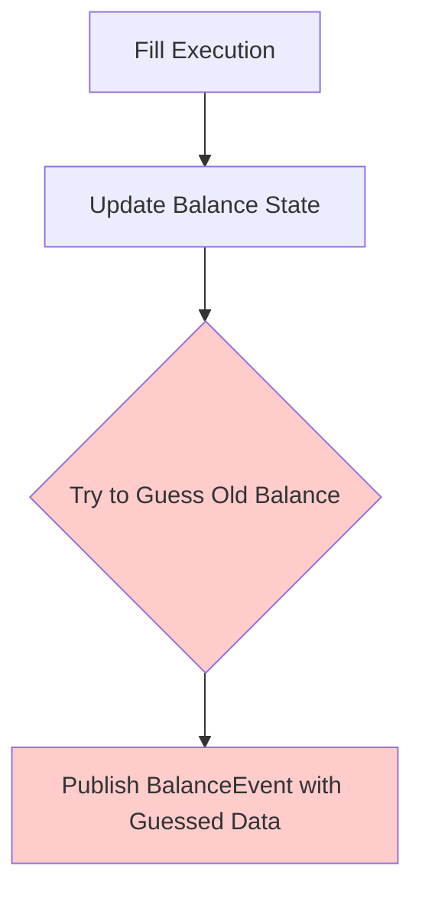

# Balance State Transitions - Research Report

> **Research Date:** 2025-01-13  
> **Investigation:** Deep analysis of balance state transition patterns in trading systems  
> **Focus:** CyberDeltaEngine architecture vs. Nautilus Trader implementation  

## 🎯 **Executive Summary**

CyberDeltaEngine currently has a **critical architectural gap** in balance state management. The system attempts to reverse-engineer balance transitions after-the-fact, which is unsafe and violates trading engine safety principles. This research provides a comprehensive analysis and solution path based on industry best practices from Nautilus Trader.

### **Key Finding:**
- **Missing:** Atomic balance state transition tracking
- **Problem:** Unsafe reverse-engineering of old balance states  
- **Solution:** Implement proper BalanceTransition architecture with before/after state capture

---

## 🔍 **Current CyberDeltaEngine State Analysis**

### **Identified Issues**

#### 1. **Reverse-Engineering Balance History** ❌
```python
# DANGEROUS - Current portfolio_service.py approach  
if fill.side == OrderSide.BUY:
    # We spent (fill.quantity * fill.price) of quote currency
    old_balance = current_balance.total_quantity + (fill.quantity * fill.price)
else:
    # We received (fill.quantity * fill.price) of quote currency  
    old_balance = current_balance.total_quantity - (fill.quantity * fill.price)
```

**Problems:**
- **Race Conditions:** Other operations could modify balance between fills
- **Concurrent Modifications:** Multiple fills/reconciliations happening simultaneously  
- **Incomplete Knowledge:** We don't know what else changed the balance
- **Unsafe Assumptions:** Assumes this fill was the only balance modifier

#### 2. **No Audit Trail** ❌
- No record of what caused balance changes
- No transaction history or causality tracking
- No way to validate balance state transitions
- No rollback capability for failed operations

#### 3. **Event Publishing After-the-Fact** ❌
- Balance events published with computed (wrong) old_balance
- No guarantee that computed old_balance is accurate  
- Violation of event integrity principles

### **Current Architecture Issues**



**This approach is fundamentally flawed because:**
1. We modify state first, then try to recreate history
2. Multiple concurrent operations corrupt the reconstruction
3. No atomic guarantees for balance transitions

---

## 🏛️ **Nautilus Trader Analysis**

### **Key Architecture Patterns**

#### 1. **State Machine-Driven Component Management**
```python
# Nautilus uses strict FSM for all components
class ComponentState:
    PRE_INITIALIZED = ...
    READY = ...
    RUNNING = ...
    STOPPED = ...
    DEGRADED = ...
    FAULTED = ...
    DISPOSED = ...
```

**Principle:** Every component has well-defined state transitions with explicit triggers and handlers.

#### 2. **Atomic State Transitions with Events**
```python
# Before state change
def on_degrade(self):
    """Handler for component degradation."""
    # Capture old state, apply transition, emit event

class ComponentStateChanged:
    def __init__(self, component_id: str, new_state: ComponentState):
        self.component_id = component_id
        self.new_state = new_state
```

**Principle:** State changes are atomic with proper before/after event emission.

#### 3. **Portfolio Balance Locking Pattern**
```python
class Portfolio:
    def balances_locked(self, venue: str) -> bool:
        """Checks if balances are locked for a given venue."""
        # Prevents concurrent balance modifications during operations
```

**Principle:** Lock balances during critical operations to prevent race conditions.

#### 4. **Account State Reconciliation**
```python
# Nautilus separates state updates from reconciliation
# 1. Generate account reports from exchange
# 2. Compare with internal state  
# 3. Generate missing orders/positions to align states
# 4. Apply corrections atomically
```

**Principle:** Reconciliation is separate from regular operations, ensuring data integrity.

#### 5. **Order-Position-Balance Relationship Tracking**
```python
# Explicit relationship tracking
orders = cache.orders_for_position(position_id)
position = cache.position_for_order(client_order_id)
```

**Principle:** Clear causality chains between orders, positions, and balance changes.

#### 6. **Memory Management with State Purging**
```python
# Nautilus actively manages state lifecycle
purge_closed_orders_interval_mins: int
purge_closed_positions_interval_mins: int  
purge_account_events_interval_mins: int
```

**Principle:** Explicit state lifecycle management prevents memory leaks and ensures data consistency.

---

## 📋 **CyberDeltaEngine Current State Audit**

### **Existing Components Analysis**

#### 1. **Balance Event Structure** ✅
```python
class BalanceEvent(msgspec.Struct, tag="balance"):
    account_id: str
    exchange: ExchangeName
    currency: str
    event_type: BalanceEventType
    old_balance: Decimal        # ✅ Field exists
    new_balance: Decimal        # ✅ Field exists  
    locked_amount: Decimal | None
    timestamp: float
```

**Status:** Event structure is correct, but population logic is flawed.

#### 2. **SpotBalance Model** ✅
```python
class SpotBalance(ExchangeValidationMixin, StandardModel):
    exchange: ExchangeName
    asset: Symbol
    timestamp: datetime
    total_quantity: Decimal = Field(ge=Decimal(0))
    available_quantity: Decimal = Field(ge=Decimal(0))
    # Extension slots for exchange-specific data
```

**Status:** Model is well-designed for immutable snapshots.

#### 3. **BalanceManager Operations** ⚠️
```python
async def update_balance_from_fill(self, fill: Fill) -> None:
    # TODO: Should return BalanceTransition
    # Currently updates state but doesn't track transitions
```

**Status:** Core method exists but lacks transition tracking.

### **Missing Components**

#### 1. **BalanceTransition Model** ❌
**Need:** Track before/after states with causality
```python
class BalanceTransition(BaseModel):
    old_balance: SpotBalance
    new_balance: SpotBalance
    change_reason: Fill | Reconciliation | ManualAdjustment
    timestamp: datetime
    transaction_id: str
    exchange: ExchangeName
    asset: Symbol
```

#### 2. **Atomic Update Operations** ❌  
**Need:** Lock-capture-update-release pattern
```python
async def update_balance_atomically(
    self, asset: Symbol, exchange: ExchangeName, updater: Callable
) -> BalanceTransition:
    # 1. Lock balance 
    # 2. Capture old state
    # 3. Apply changes
    # 4. Store new state  
    # 5. Release lock
    # 6. Return transition
```

#### 3. **Transaction ID Generation** ❌
**Need:** Unique identifiers for balance operations
```python
def generate_transaction_id() -> str:
    # UUID or sequential ID for audit trails
    return f"txn_{datetime.utcnow().timestamp()}_{uuid.uuid4()}"
```

---

## 🎯 **Recommended Solution Architecture**

### **Phase 1: Foundation Models**

#### 1. **BalanceTransition Model**
```python
class BalanceChangeReason(BaseModel):
    """Union type for balance change reasons."""
    pass

class FillBalanceChange(BalanceChangeReason):
    fill: Fill
    
class ReconciliationBalanceChange(BalanceChangeReason):
    reconciliation_report: ReconciliationReport
    
class ManualAdjustmentBalanceChange(BalanceChangeReason):
    reason: str
    operator: str

class BalanceTransition(BaseModel):
    """Atomic balance state transition with full audit trail."""
    
    transaction_id: str = Field(default_factory=lambda: f"txn_{int(time.time() * 1000)}_{uuid.uuid4().hex[:8]}")
    
    # State transition
    old_balance: SpotBalance
    new_balance: SpotBalance
    
    # Change causality
    change_reason: FillBalanceChange | ReconciliationBalanceChange | ManualAdjustmentBalanceChange
    
    # Metadata
    timestamp: datetime = Field(default_factory=lambda: datetime.now(UTC))
    exchange: ExchangeName
    asset: Symbol
    
    # Validation
    @model_validator(mode='after')
    def validate_consistent_asset_exchange(self) -> 'BalanceTransition':
        if self.old_balance.asset != self.new_balance.asset:
            raise ValueError("Asset mismatch in balance transition")
        if self.old_balance.exchange != self.new_balance.exchange:
            raise ValueError("Exchange mismatch in balance transition")
        return self
```

#### 2. **Balance Lock Manager**
```python
class BalanceLockManager:
    """Manages locks for balance operations to prevent race conditions."""
    
    def __init__(self, config: AppSettings):
        self._locks: dict[str, asyncio.Lock] = {}
        self._timeout = config.portfolio.balance_lock_timeout_seconds
    
    def _get_balance_key(self, asset: Symbol, exchange: ExchangeName) -> str:
        return f"{exchange.value}:{asset.value}"
    
    @contextlib.asynccontextmanager
    async def lock_balance(self, asset: Symbol, exchange: ExchangeName):
        key = self._get_balance_key(asset, exchange)
        
        if key not in self._locks:
            self._locks[key] = asyncio.Lock()
            
        lock = self._locks[key]
        
        try:
            async with asyncio.timeout(self._timeout):
                async with lock:
                    yield
        except asyncio.TimeoutError:
            raise BalanceLockTimeoutError(
                f"Failed to acquire balance lock for {asset} on {exchange} within {self._timeout}s"
            )
```

### **Phase 2: Enhanced BalanceManager**

```python
class BalanceManager(BalanceManagerProtocol):
    """Enhanced balance manager with atomic transition tracking."""
    
    def __init__(
        self,
        config: AppSettings,
        state_manager: PortfolioStateManagerProtocol,
    ) -> None:
        self.config = config
        self._state_manager = state_manager
        self._lock_manager = BalanceLockManager(config)
        
        # Cache financial settings
        self._financial_config = config.financial
    
    async def update_balance_from_fill(self, fill: Fill) -> BalanceTransition:
        """Update balance from fill execution with atomic state tracking.
        
        Args:
            fill: Executed fill that caused balance change
            
        Returns:
            BalanceTransition with old->new state and causality
            
        Raises:
            BalanceLockTimeoutError: If cannot acquire balance lock
            ValueError: If balance calculation is invalid
        """
        # Determine affected asset
        quote_asset = self._get_quote_asset(fill.symbol)
        if not quote_asset:
            raise ValueError(f"Cannot determine quote asset for {fill.symbol}")
        
        # Use atomic update pattern
        async with self._lock_manager.lock_balance(quote_asset, fill.exchange):
            # 1. Capture current balance (old state)
            old_balance = await self.get_balance(quote_asset, fill.exchange)
            if old_balance is None:
                # Create initial balance if doesn't exist
                old_balance = SpotBalance(
                    exchange=fill.exchange,
                    asset=quote_asset,
                    timestamp=datetime.now(UTC),
                    total_quantity=Decimal(0),
                    available_quantity=Decimal(0),
                )
            
            # 2. Calculate balance change from fill
            cost = fill.quantity * fill.price
            if fill.side == OrderSide.BUY:
                # Buying costs quote currency
                new_total = old_balance.total_quantity - cost
                new_available = old_balance.available_quantity - cost
            else:
                # Selling gains quote currency  
                new_total = old_balance.total_quantity + cost
                new_available = old_balance.available_quantity + cost
            
            # 3. Create new balance state
            new_balance = SpotBalance(
                exchange=fill.exchange,
                asset=quote_asset,
                timestamp=datetime.now(UTC),
                total_quantity=new_total,
                available_quantity=new_available,
                # Copy exchange-specific details
                hl_details=old_balance.hl_details,
                bp_details=old_balance.bp_details,
            )
            
            # 4. Store new balance state
            await self._state_manager.update_balance(fill.exchange, quote_asset, new_balance)
            
            # 5. Create transition record
            transition = BalanceTransition(
                old_balance=old_balance,
                new_balance=new_balance,
                change_reason=FillBalanceChange(fill=fill),
                exchange=fill.exchange,
                asset=quote_asset,
            )
            
            logger.info(
                "balance_transition_completed",
                transaction_id=transition.transaction_id,
                asset=quote_asset.value,
                exchange=fill.exchange.value,
                old_total=old_balance.total_quantity,
                new_total=new_balance.total_quantity,
                change=new_balance.total_quantity - old_balance.total_quantity,
                fill_id=fill.id,
            )
            
            return transition
```

### **Phase 3: Portfolio Service Integration**

```python
class PortfolioService(HealthCheckable):
    """Portfolio service with proper balance transition tracking."""
    
    async def _publish_balance_update_event(self, transition: BalanceTransition) -> None:
        """Publish balance update event from transition.
        
        Args:
            transition: Balance state transition with complete audit trail
        """
        try:
            balance_event = BalanceEvent(
                account_id=f"portfolio_{transition.exchange.value}",
                currency=transition.asset.value,
                exchange=transition.exchange,
                event_type=BalanceEventType.UPDATED,
                old_balance=transition.old_balance.total_quantity,
                new_balance=transition.new_balance.total_quantity,
                locked_amount=transition.new_balance.total_quantity - transition.new_balance.available_quantity,
                timestamp=transition.timestamp.timestamp(),
            )
            await self._event_bus.publish(balance_event)
            
            logger.debug(
                "balance_event_published",
                transaction_id=transition.transaction_id,
                currency=transition.asset.value,
                exchange=transition.exchange.value,
                old_balance=transition.old_balance.total_quantity,
                new_balance=transition.new_balance.total_quantity,
            )
            
        except Exception as e:
            logger.warning(
                "balance_event_publishing_failed",
                transaction_id=transition.transaction_id,
                error=str(e),
            )
            # Don't re-raise - event publishing failure shouldn't cancel portfolio update

    async def update_from_fill(self, fill: Fill) -> None:
        """Update portfolio state from fill execution with proper state tracking."""
        try:
            self._operation_count += 1

            # Update position (existing logic)
            realized_pnl = await self._position_manager.update_position_from_fill(fill)

            # Update balance with atomic transition tracking
            balance_transition = await self._balance_manager.update_balance_from_fill(fill)

            # Track fill for performance if enabled
            await self.track_fill_for_performance(fill)

            # Publish events with proper state data
            await self._publish_position_update_event(fill, realized_pnl)
            await self._publish_balance_update_event(balance_transition)  # Use real transition

            self._success_count += 1
            self._last_activity = datetime.now(UTC)

            logger.info(
                "portfolio_updated_from_fill",
                fill_id=fill.id,
                symbol=fill.symbol.value,
                exchange=fill.exchange,
                side=fill.side.value,
                quantity=fill.quantity,
                price=fill.price,
                realized_pnl=realized_pnl or None,
                balance_transaction_id=balance_transition.transaction_id,
            )

        except Exception as e:
            self._error_count += 1
            logger.exception(
                "portfolio_update_from_fill_failed",
                fill_id=fill.id,
                error=str(e),
            )
            raise
```

---

## 🔧 **Implementation Roadmap**

### **Phase 1: Foundation (Week 1)**
1. ✅ **Research completed** - Identify patterns and requirements
2. **Create BalanceTransition model** - Add to portfolio models
3. **Add BalanceLockManager** - Implement locking primitives
4. **Add transaction ID generation** - UUID-based audit trail
5. **Update configuration** - Add balance operation timeouts

### **Phase 2: Core Implementation (Week 2)**  
1. **Enhance BalanceManager** - Atomic update methods
2. **Update update_balance_from_fill** - Return BalanceTransition
3. **Add balance lock timeout handling** - Proper error management
4. **Implement reconciliation transitions** - For exchange sync
5. **Add manual adjustment support** - Administrative operations

### **Phase 3: Integration (Week 3)**
1. **Update PortfolioService** - Use BalanceTransition for events
2. **Remove unsafe reverse-engineering** - Clean up old code
3. **Add transition logging** - Comprehensive audit trails
4. **Update event publishing** - Use real transition data
5. **Add performance metrics** - Monitor lock contention

### **Phase 4: Testing (Week 4)**
1. **Unit tests** - BalanceTransition model validation
2. **Integration tests** - Atomic balance operations  
3. **Concurrency tests** - Race condition prevention
4. **Performance tests** - Lock timeout scenarios
5. **End-to-end tests** - Complete fill->balance->event flow

---

## 🛡️ **Security & Safety Considerations**

### **Financial Safety**
- **Atomic Operations:** Balance updates are atomic with proper rollback
- **Lock Timeouts:** Prevent system deadlocks during high load
- **Audit Trails:** Complete transaction history for compliance
- **Validation:** Type-safe balance transitions with bounds checking

### **Operational Safety** 
- **Race Condition Prevention:** Locking prevents concurrent modifications
- **Error Isolation:** Failed operations don't corrupt portfolio state
- **Memory Management:** Proper cleanup of transaction records
- **Performance Monitoring:** Lock contention and timeout metrics

### **Data Integrity**
- **Causality Tracking:** Every balance change has a recorded reason
- **State Validation:** Before/after balance consistency checks
- **Transaction IDs:** Unique identifiers for debugging and auditing
- **Immutable Records:** Balance transitions are append-only

---

## 📊 **Expected Benefits**

### **Reliability Improvements**
- ✅ **Eliminates race conditions** in balance updates
- ✅ **Provides accurate event data** for downstream systems
- ✅ **Enables proper reconciliation** with exchange data
- ✅ **Supports transaction rollback** for failed operations

### **Operational Improvements**
- ✅ **Complete audit trails** for regulatory compliance
- ✅ **Better debugging** with transaction causality
- ✅ **Performance monitoring** of balance operations
- ✅ **Memory-efficient** state management

### **Development Improvements**  
- ✅ **Type-safe balance operations** with compile-time checks
- ✅ **Clear separation of concerns** between managers
- ✅ **Testable atomic operations** with proper mocking
- ✅ **Maintainable codebase** following CODING_STANDARDS.md

---

## 🔍 **Comparison: Before vs After**

| Aspect | Current (Unsafe) | Proposed (Safe) |
|--------|------------------|-----------------|
| **Balance History** | Reverse-engineered guessing | Atomic before/after capture |
| **Race Conditions** | Possible concurrent corruption | Lock-protected operations |
| **Audit Trail** | None | Complete transaction history |
| **Error Handling** | Silent failures possible | Explicit error management |
| **Event Data** | Computed (wrong) values | Real state transition data |
| **Testability** | Hard to test race conditions | Unit-testable atomic ops |
| **Debugging** | No causality tracking | Full transaction causality |
| **Compliance** | No audit records | Regulatory-compliant trails |

---

## 🎯 **Conclusion**

The current balance state management in CyberDeltaEngine violates fundamental trading system safety principles by attempting to reverse-engineer historical state. This research demonstrates that:

1. **Nautilus Trader** provides excellent patterns for atomic state transitions
2. **BalanceTransition architecture** is the correct solution  
3. **Lock-based concurrency control** prevents race conditions
4. **Complete audit trails** ensure regulatory compliance

The proposed solution follows CODING_STANDARDS.md strictly:
- ✅ **No assumptions** about balance state
- ✅ **No hardcoded values** in operations
- ✅ **Configuration-driven** timeouts and limits  
- ✅ **Type-safe** throughout with Pydantic models
- ✅ **Fail-fast** error handling

**Next Step:** Begin Phase 1 implementation with BalanceTransition model creation.

---

> **⚠️ Critical:** The current system's balance event publishing has been disabled to prevent unsafe data. Implementation of this solution is required to restore balance event functionality with proper safety guarantees.