# CyberDeltaEngine Internal Business Logic Models: Comprehensive Analysis & Enhancement Framework

**Date**: 2025-06-09  
**Status**: Deep Architecture Research & Enhancement Proposals  
**Priority**: Critical - Foundation Architecture  

## Executive Summary

This comprehensive analysis examines our internal business logic implementations, identifying critical architectural gaps and proposing robust enhancements to improve safety, reliability, and extensibility. Based on recent findings from ticker and order implementation analyses, we've identified eight fundamental areas requiring enhanced modeling to achieve production-grade robustness.

### Key Findings

1. **Current Strength**: "Core + Typed Extension Slots" pattern successfully handles exchange differences
2. **Critical Gaps**: Missing business-level validation, operational health monitoring, and sophisticated error recovery
3. **Risk Exposure**: Insufficient risk management, audit trails, and data quality assurance
4. **Strategic Need**: Enhanced strategy coordination, market condition modeling, and compliance frameworks

---

## 1. Current Architecture Analysis

### 1.1 Existing Internal Model Structure

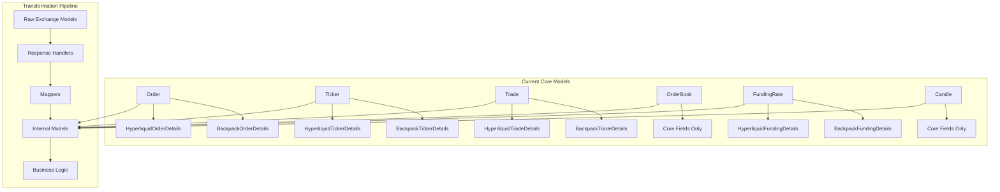

### 1.2 Current Strengths

| Aspect | Implementation | Assessment |
|--------|----------------|------------|
| **Exchange Abstraction** | Extension slots pattern | ✅ Excellent |
| **Data Type Safety** | Pydantic validation | ✅ Good |
| **Field Mapping** | Consistent transformation | ✅ Good |
| **Error Handling** | Basic API error handling | ⚠️ Basic |
| **State Management** | Simple status tracking | ⚠️ Limited |
| **Business Validation** | Minimal pre-flight checks | ❌ Missing |
| **Operational Monitoring** | No health tracking | ❌ Missing |
| **Risk Management** | Basic position tracking | ❌ Insufficient |

### 1.3 Identified Architectural Gaps

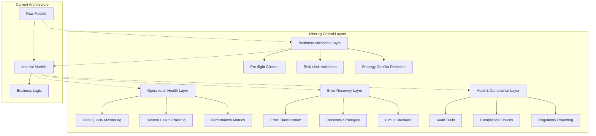

---

## 2. Critical Flaws in Current Implementation

### 2.1 Business Logic Validation Gaps

**Current Problem**: Operations proceed without comprehensive business rule validation.

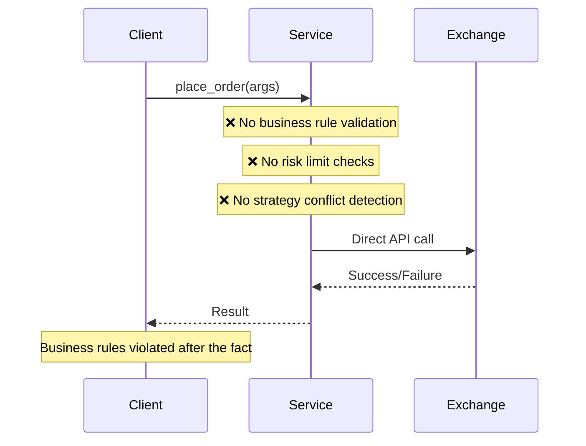

**Enhanced Pattern**:
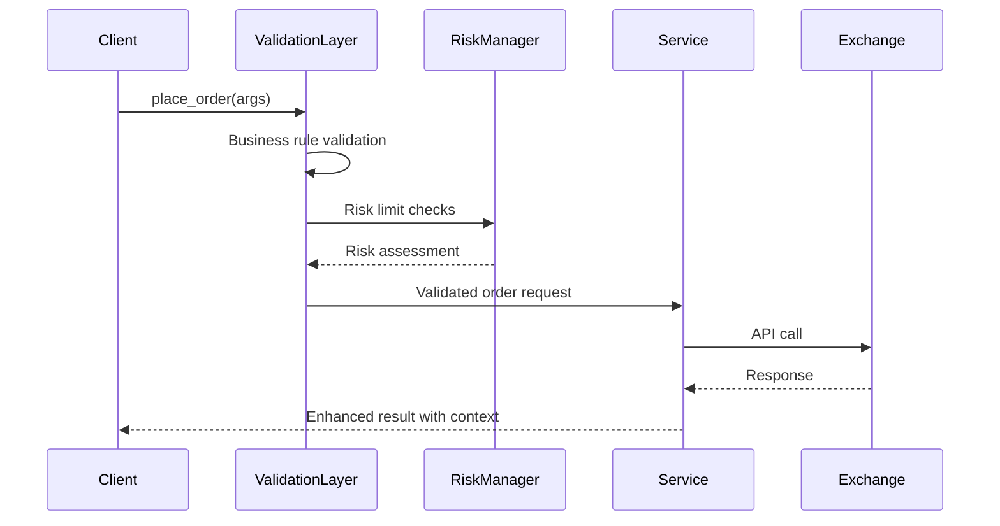

### 2.2 Insufficient Error Recovery Architecture

**Current Problem**: Basic error handling without sophisticated recovery strategies.

```python
# Current approach - too simplistic
try:
    result = await exchange_api.place_order(args)
    return result
except APIError as e:
    # Basic logging and re-raise
    logger.error(f"Order failed: {e}")
    raise
```

**Enhanced Approach Needed**:
```python
# Proposed sophisticated error handling
class ErrorRecoveryManager:
    async def execute_with_recovery(
        self,
        operation: Callable,
        recovery_strategy: RecoveryStrategy,
        max_attempts: int = 3
    ) -> OperationResult:
        """Execute operation with intelligent recovery."""
        
    async def classify_error(self, error: Exception) -> ErrorClassification:
        """Classify errors for appropriate recovery strategy."""
        
    async def apply_recovery_strategy(
        self,
        error: ErrorClassification,
        context: OperationContext
    ) -> RecoveryAction:
        """Apply contextual recovery strategy."""
```

### 2.3 Missing Operational Health Monitoring

**Current Problem**: No systematic monitoring of system health, data quality, or performance.

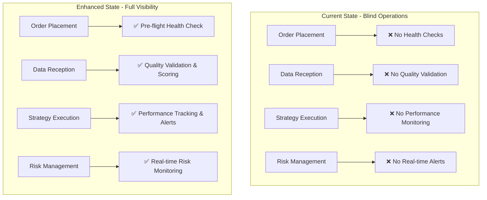

### 2.4 Inadequate Risk Management Models

**Current Problem**: Basic position tracking without comprehensive risk modeling.

```python
# Current - overly simplistic
class MarginAccount:
    total_equity: Decimal
    used_margin: Decimal
    available_margin: Decimal

# Missing comprehensive risk models:
# - Portfolio-level risk metrics
# - Correlation analysis
# - Stress testing capabilities
# - Dynamic risk limit adjustment
# - Multi-timeframe risk assessment
```

---

## 3. Proposed Enhanced Architecture

### 3.1 Multi-Layer Business Logic Framework

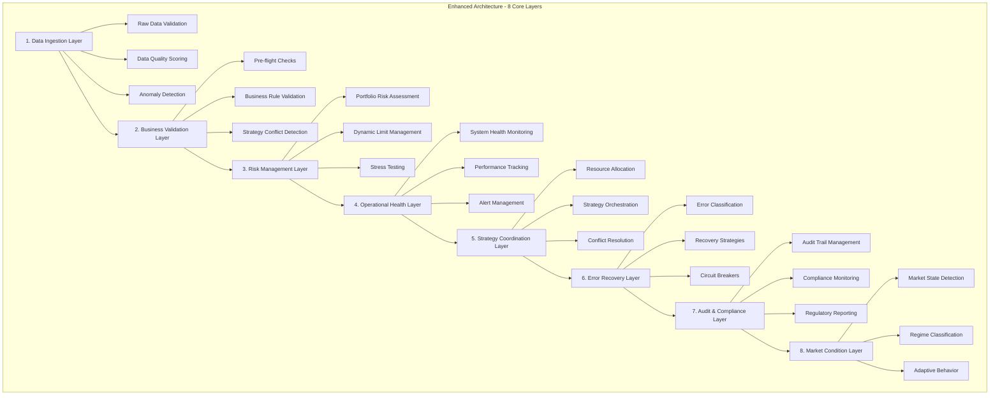

### 3.2 Core Model Enhancement Framework


---

## 4. Detailed Enhancement Proposals

### 4.1 Business Validation Layer Models

```python
from enum import Enum
from typing import List, Dict, Any, Optional
from pydantic import BaseModel, Field
from datetime import datetime
from decimal import Decimal

class ValidationSeverity(str, Enum):
    """Severity levels for validation violations."""
    INFO = "info"
    WARNING = "warning"
    ERROR = "error"
    CRITICAL = "critical"

class ValidationRule(BaseModel):
    """Represents a business validation rule."""
    rule_id: str
    rule_name: str
    description: str
    severity: ValidationSeverity
    is_blocking: bool = Field(default=True)
    parameters: Dict[str, Any] = Field(default_factory=dict)
    
    def evaluate(self, context: "ValidationContext") -> "ValidationResult":
        """Evaluate rule against provided context."""
        raise NotImplementedError

class ValidationViolation(BaseModel):
    """Represents a validation rule violation."""
    rule_id: str
    severity: ValidationSeverity
    message: str
    affected_fields: List[str] = Field(default_factory=list)
    suggested_resolution: Optional[str] = None
    violation_data: Dict[str, Any] = Field(default_factory=dict)

class BusinessValidationResult(BaseModel):
    """Comprehensive validation result for business operations."""
    is_valid: bool
    validation_timestamp: datetime
    applied_rules: List[ValidationRule]
    violations: List[ValidationViolation] = Field(default_factory=list)
    warnings: List[ValidationViolation] = Field(default_factory=list)
    validator_version: str
    validation_duration_ms: int
    
    @property
    def has_blocking_violations(self) -> bool:
        """Check if any violations are blocking."""
        return any(
            violation.severity in [ValidationSeverity.ERROR, ValidationSeverity.CRITICAL]
            for violation in self.violations
        )
    
    def get_violation_summary(self) -> Dict[ValidationSeverity, int]:
        """Get count of violations by severity."""
        summary = {severity: 0 for severity in ValidationSeverity}
        for violation in self.violations:
            summary[violation.severity] += 1
        return summary

class ValidationContext(BaseModel):
    """Context for business validation operations."""
    operation_type: str
    user_id: Optional[str] = None
    strategy_id: Optional[str] = None
    exchange: str
    symbol: str
    account_state: Dict[str, Any] = Field(default_factory=dict)
    market_data: Dict[str, Any] = Field(default_factory=dict)
    risk_limits: Dict[str, Any] = Field(default_factory=dict)
    operational_constraints: Dict[str, Any] = Field(default_factory=dict)
```

### 4.2 Risk Management Layer Models

```python
class RiskMetricType(str, Enum):
    """Types of risk metrics."""
    POSITION_SIZE = "position_size"
    LEVERAGE = "leverage"
    CONCENTRATION = "concentration"
    VOLATILITY = "volatility"
    VALUE_AT_RISK = "value_at_risk"
    EXPECTED_SHORTFALL = "expected_shortfall"
    CORRELATION = "correlation"
    LIQUIDITY = "liquidity"
    DRAWDOWN = "drawdown"

class RiskLevel(str, Enum):
    """Risk level classifications."""
    LOW = "low"
    MEDIUM = "medium"
    HIGH = "high"
    CRITICAL = "critical"

class RiskMetric(BaseModel):
    """Individual risk metric measurement."""
    metric_type: RiskMetricType
    current_value: Decimal
    threshold_warning: Decimal
    threshold_critical: Decimal
    currency: str = "USD"
    last_updated: datetime
    calculation_method: str
    
    @property
    def risk_level(self) -> RiskLevel:
        """Determine risk level based on thresholds."""
        if self.current_value >= self.threshold_critical:
            return RiskLevel.CRITICAL
        elif self.current_value >= self.threshold_warning:
            return RiskLevel.HIGH
        elif self.current_value >= self.threshold_warning * 0.7:
            return RiskLevel.MEDIUM
        return RiskLevel.LOW

class RiskLimit(BaseModel):
    """Risk limit configuration and monitoring."""
    limit_id: str
    limit_type: RiskMetricType
    limit_value: Decimal
    current_usage: Decimal
    limit_scope: str  # "account", "strategy", "symbol", "exchange"
    scope_identifier: str
    is_active: bool = True
    violation_action: str  # "block", "warn", "notify"
    
    @property
    def utilization_percentage(self) -> Decimal:
        """Calculate limit utilization percentage."""
        if self.limit_value == 0:
            return Decimal("100")
        return (self.current_usage / self.limit_value) * 100
    
    @property
    def is_exceeded(self) -> bool:
        """Check if limit is exceeded."""
        return self.current_usage > self.limit_value

class PortfolioRiskSnapshot(BaseModel):
    """Comprehensive portfolio risk assessment."""
    snapshot_timestamp: datetime
    total_portfolio_value: Decimal
    total_exposure: Decimal
    leverage_ratio: Decimal
    risk_metrics: Dict[RiskMetricType, RiskMetric]
    position_concentrations: Dict[str, Decimal]  # symbol -> percentage
    correlation_matrix: Dict[tuple[str, str], Decimal]
    stress_test_results: Dict[str, Decimal]  # scenario -> loss amount
    liquidity_score: Decimal
    
    @property
    def overall_risk_level(self) -> RiskLevel:
        """Calculate overall portfolio risk level."""
        risk_levels = [metric.risk_level for metric in self.risk_metrics.values()]
        if RiskLevel.CRITICAL in risk_levels:
            return RiskLevel.CRITICAL
        elif RiskLevel.HIGH in risk_levels:
            return RiskLevel.HIGH
        elif RiskLevel.MEDIUM in risk_levels:
            return RiskLevel.MEDIUM
        return RiskLevel.LOW

class RiskAssessment(BaseModel):
    """Comprehensive risk assessment for operations."""
    assessment_id: str
    operation_type: str
    overall_risk: RiskLevel
    risk_score: Decimal = Field(ge=0, le=100)
    risk_metrics: Dict[RiskMetricType, RiskMetric]
    applicable_limits: List[RiskLimit]
    limits_satisfied: bool
    portfolio_impact: PortfolioRiskSnapshot
    assessed_at: datetime
    assessment_duration_ms: int
    
    def calculate_portfolio_impact(self, operation_details: Dict[str, Any]) -> PortfolioRiskSnapshot:
        """Calculate impact of operation on portfolio risk."""
        # Implementation would calculate new portfolio state after operation
        pass
    
    def check_limit_compliance(self) -> List[RiskLimit]:
        """Check compliance with all applicable risk limits."""
        violated_limits = []
        for limit in self.applicable_limits:
            if limit.is_exceeded:
                violated_limits.append(limit)
        return violated_limits
```

### 4.3 Operational Health Layer Models

```python
class HealthStatus(str, Enum):
    """System health status levels."""
    HEALTHY = "healthy"
    DEGRADED = "degraded"
    UNHEALTHY = "unhealthy"
    CRITICAL = "critical"

class DataQualityMetric(BaseModel):
    """Data quality measurement."""
    metric_name: str
    score: Decimal = Field(ge=0, le=100)  # 0-100 quality score
    measurement_timestamp: datetime
    data_source: str
    sample_size: int
    anomalies_detected: int
    missing_data_percentage: Decimal
    timeliness_score: Decimal
    accuracy_score: Decimal
    completeness_score: Decimal
    
    @property
    def overall_quality(self) -> HealthStatus:
        """Determine overall data quality status."""
        if self.score >= 90:
            return HealthStatus.HEALTHY
        elif self.score >= 70:
            return HealthStatus.DEGRADED
        elif self.score >= 50:
            return HealthStatus.UNHEALTHY
        return HealthStatus.CRITICAL

class PerformanceMetric(BaseModel):
    """Performance metric measurement."""
    metric_name: str
    metric_type: str  # "latency", "throughput", "error_rate", "availability"
    current_value: Decimal
    target_value: Decimal
    threshold_warning: Decimal
    threshold_critical: Decimal
    measurement_unit: str
    measurement_timestamp: datetime
    window_duration_seconds: int
    
    @property
    def performance_status(self) -> HealthStatus:
        """Determine performance status based on thresholds."""
        if self.metric_type in ["latency", "error_rate"]:
            # Lower is better
            if self.current_value <= self.target_value:
                return HealthStatus.HEALTHY
            elif self.current_value <= self.threshold_warning:
                return HealthStatus.DEGRADED
            elif self.current_value <= self.threshold_critical:
                return HealthStatus.UNHEALTHY
            return HealthStatus.CRITICAL
        else:
            # Higher is better (throughput, availability)
            if self.current_value >= self.target_value:
                return HealthStatus.HEALTHY
            elif self.current_value >= self.threshold_warning:
                return HealthStatus.DEGRADED
            elif self.current_value >= self.threshold_critical:
                return HealthStatus.UNHEALTHY
            return HealthStatus.CRITICAL

class SystemHealthSnapshot(BaseModel):
    """Comprehensive system health snapshot."""
    snapshot_timestamp: datetime
    overall_health: HealthStatus
    component_health: Dict[str, HealthStatus]  # component -> status
    data_quality_metrics: Dict[str, DataQualityMetric]
    performance_metrics: Dict[str, PerformanceMetric]
    active_alerts: List[str]
    recent_incidents: List[Dict[str, Any]]
    sla_compliance: Dict[str, Decimal]  # SLA -> compliance percentage
    
    def calculate_overall_health(self) -> HealthStatus:
        """Calculate overall system health from component health."""
        if not self.component_health:
            return HealthStatus.CRITICAL
        
        health_scores = {
            HealthStatus.HEALTHY: 4,
            HealthStatus.DEGRADED: 3,
            HealthStatus.UNHEALTHY: 2,
            HealthStatus.CRITICAL: 1
        }
        
        min_score = min(health_scores[status] for status in self.component_health.values())
        
        for status, score in health_scores.items():
            if score == min_score:
                return status
        
        return HealthStatus.CRITICAL

class OperationalMetrics(BaseModel):
    """Operational metrics for business operations."""
    operation_id: str
    operation_type: str
    started_at: datetime
    completed_at: Optional[datetime] = None
    processing_duration_ms: Optional[int] = None
    retry_count: int = 0
    error_count: int = 0
    warning_count: int = 0
    data_quality_score: Optional[Decimal] = None
    performance_metrics: Dict[str, PerformanceMetric] = Field(default_factory=dict)
    health_status: HealthStatus = HealthStatus.HEALTHY
    last_updated: datetime
    
    def update_performance_metric(self, metric: PerformanceMetric) -> None:
        """Update a performance metric."""
        self.performance_metrics[metric.metric_name] = metric
        self.last_updated = datetime.utcnow()
    
    def calculate_sla_compliance(self, sla_targets: Dict[str, Decimal]) -> Dict[str, bool]:
        """Calculate SLA compliance for operation."""
        compliance = {}
        for sla_name, target in sla_targets.items():
            if sla_name in self.performance_metrics:
                metric = self.performance_metrics[sla_name]
                compliance[sla_name] = metric.current_value <= target
        return compliance
```

### 4.4 Error Recovery Layer Models

```python
class ErrorCategory(str, Enum):
    """Categories of errors for recovery strategy selection."""
    NETWORK = "network"
    RATE_LIMIT = "rate_limit"
    AUTHENTICATION = "authentication"
    VALIDATION = "validation"
    BUSINESS_LOGIC = "business_logic"
    EXCHANGE_ERROR = "exchange_error"
    SYSTEM_ERROR = "system_error"
    DATA_ERROR = "data_error"

class RecoveryStrategy(str, Enum):
    """Recovery strategy options."""
    RETRY_IMMEDIATE = "retry_immediate"
    RETRY_EXPONENTIAL_BACKOFF = "retry_exponential_backoff"
    RETRY_LINEAR_BACKOFF = "retry_linear_backoff"
    FALLBACK_EXCHANGE = "fallback_exchange"
    FALLBACK_CACHED_DATA = "fallback_cached_data"
    CIRCUIT_BREAKER = "circuit_breaker"
    MANUAL_INTERVENTION = "manual_intervention"
    ABORT_OPERATION = "abort_operation"

class ErrorClassification(BaseModel):
    """Classification of an error for recovery decision making."""
    error_id: str
    original_error: str
    error_category: ErrorCategory
    severity: ValidationSeverity
    is_recoverable: bool
    is_transient: bool
    recovery_strategy: RecoveryStrategy
    max_retry_attempts: int
    backoff_seconds: List[int]  # Backoff schedule
    classification_confidence: Decimal = Field(ge=0, le=1)
    classification_timestamp: datetime
    
    def should_retry(self, current_attempt: int) -> bool:
        """Determine if operation should be retried."""
        return (
            self.is_recoverable 
            and current_attempt < self.max_retry_attempts
            and self.recovery_strategy != RecoveryStrategy.ABORT_OPERATION
        )
    
    def get_backoff_delay(self, attempt: int) -> int:
        """Get backoff delay for given attempt."""
        if attempt >= len(self.backoff_seconds):
            return self.backoff_seconds[-1]
        return self.backoff_seconds[attempt]

class RecoveryAttempt(BaseModel):
    """Record of a recovery attempt."""
    attempt_number: int
    recovery_strategy: RecoveryStrategy
    attempted_at: datetime
    success: bool
    error_message: Optional[str] = None
    recovery_duration_ms: int
    context_data: Dict[str, Any] = Field(default_factory=dict)

class ErrorRecoveryResult(BaseModel):
    """Result of error recovery process."""
    operation_id: str
    original_error: str
    error_classification: ErrorClassification
    recovery_attempts: List[RecoveryAttempt]
    final_success: bool
    total_recovery_duration_ms: int
    recovery_completed_at: datetime
    
    @property
    def total_attempts(self) -> int:
        """Get total number of recovery attempts."""
        return len(self.recovery_attempts)
    
    @property
    def successful_strategy(self) -> Optional[RecoveryStrategy]:
        """Get the recovery strategy that succeeded."""
        successful_attempts = [a for a in self.recovery_attempts if a.success]
        return successful_attempts[-1].recovery_strategy if successful_attempts else None

class CircuitBreakerState(BaseModel):
    """Circuit breaker state management."""
    circuit_id: str
    component_name: str
    state: str  # "closed", "open", "half_open"
    failure_count: int
    failure_threshold: int
    success_threshold: int
    timeout_seconds: int
    last_failure_timestamp: Optional[datetime] = None
    last_success_timestamp: Optional[datetime] = None
    state_changed_at: datetime
    
    def should_allow_request(self) -> bool:
        """Determine if request should be allowed through circuit breaker."""
        if self.state == "closed":
            return True
        elif self.state == "open":
            # Check if timeout has elapsed
            if self.last_failure_timestamp:
                elapsed = datetime.utcnow() - self.last_failure_timestamp
                return elapsed.total_seconds() >= self.timeout_seconds
            return False
        else:  # half_open
            return True
    
    def record_success(self) -> None:
        """Record successful operation."""
        self.last_success_timestamp = datetime.utcnow()
        if self.state == "half_open":
            # Reset circuit breaker
            self.state = "closed"
            self.failure_count = 0
            self.state_changed_at = datetime.utcnow()
    
    def record_failure(self) -> None:
        """Record failed operation."""
        self.failure_count += 1
        self.last_failure_timestamp = datetime.utcnow()
        
        if self.state == "closed" and self.failure_count >= self.failure_threshold:
            self.state = "open"
            self.state_changed_at = datetime.utcnow()
        elif self.state == "half_open":
            self.state = "open"
            self.state_changed_at = datetime.utcnow()
```

---

## 5. Strategy Coordination Layer Models

### 5.1 Multi-Strategy Resource Management

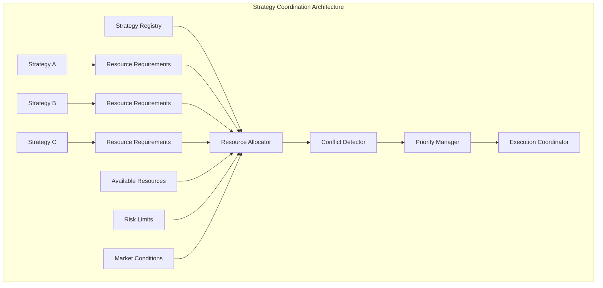

```python
class StrategyResource(BaseModel):
    """Resource required or allocated to strategy."""
    resource_type: str  # "capital", "position_limit", "api_calls", "bandwidth"
    amount: Decimal
    currency: Optional[str] = None
    exchange: Optional[str] = None
    symbol: Optional[str] = None
    priority: int = Field(ge=1, le=10)  # 1 = highest priority
    
class StrategyResourceRequirement(BaseModel):
    """Resource requirements for strategy execution."""
    strategy_id: str
    required_resources: List[StrategyResource]
    minimum_resources: List[StrategyResource]  # Minimum to function
    preferred_resources: List[StrategyResource]  # Optimal allocation
    resource_flexibility: Decimal = Field(ge=0, le=1)  # How flexible strategy is
    
class ResourceAllocation(BaseModel):
    """Allocation of resources to strategies."""
    allocation_id: str
    strategy_id: str
    allocated_resources: List[StrategyResource]
    allocation_timestamp: datetime
    allocation_duration_seconds: int
    utilization_percentage: Dict[str, Decimal]  # resource_type -> utilization
    performance_metrics: Dict[str, Decimal]
    
class StrategyConflict(BaseModel):
    """Conflict between strategies."""
    conflict_id: str
    strategy_ids: List[str]
    conflict_type: str  # "resource", "symbol", "direction", "timing"
    severity: ValidationSeverity
    description: str
    resolution_strategy: str
    auto_resolvable: bool
    detected_at: datetime
    
class StrategyCoordinationResult(BaseModel):
    """Result of strategy coordination process."""
    coordination_timestamp: datetime
    active_strategies: List[str]
    resource_allocations: List[ResourceAllocation]
    detected_conflicts: List[StrategyConflict]
    resolved_conflicts: List[StrategyConflict]
    coordination_success: bool
    coordination_duration_ms: int
```

---

## 6. Market Condition Modeling

### 6.1 Adaptive Market State Recognition

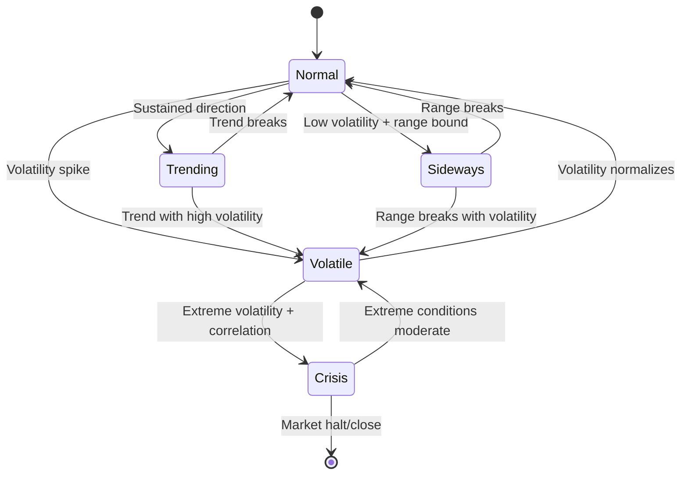

```python
class MarketRegime(str, Enum):
    """Market regime classifications."""
    NORMAL = "normal"
    VOLATILE = "volatile"
    TRENDING = "trending"
    SIDEWAYS = "sideways"
    CRISIS = "crisis"
    ILLIQUID = "illiquid"
    NEWS_DRIVEN = "news_driven"

class MarketConditionIndicator(BaseModel):
    """Individual market condition indicator."""
    indicator_name: str
    current_value: Decimal
    normalized_value: Decimal = Field(ge=0, le=1)  # 0-1 normalized
    threshold_normal: Decimal
    threshold_alert: Decimal
    threshold_critical: Decimal
    measurement_timestamp: datetime
    lookback_period_minutes: int
    
    @property
    def signal_strength(self) -> Decimal:
        """Calculate signal strength (0-1)."""
        return abs(self.normalized_value - 0.5) * 2

class MarketConditionSnapshot(BaseModel):
    """Comprehensive market condition assessment."""
    snapshot_timestamp: datetime
    primary_regime: MarketRegime
    regime_confidence: Decimal = Field(ge=0, le=1)
    regime_duration_minutes: int
    indicators: Dict[str, MarketConditionIndicator]
    correlation_matrix: Dict[tuple[str, str], Decimal]
    liquidity_score: Decimal = Field(ge=0, le=1)
    stress_level: Decimal = Field(ge=0, le=1)
    
    # Market microstructure indicators
    bid_ask_spreads: Dict[str, Decimal]  # symbol -> spread
    order_book_depth: Dict[str, Decimal]  # symbol -> depth score
    volume_profile: Dict[str, Decimal]  # symbol -> volume score
    
    def should_reduce_activity(self) -> bool:
        """Determine if strategies should reduce activity."""
        return (
            self.primary_regime in [MarketRegime.CRISIS, MarketRegime.ILLIQUID]
            or self.stress_level > 0.8
            or self.liquidity_score < 0.3
        )
    
    def get_recommended_position_sizing(self) -> Decimal:
        """Get recommended position sizing multiplier."""
        if self.primary_regime == MarketRegime.CRISIS:
            return Decimal("0.25")  # 25% of normal size
        elif self.primary_regime == MarketRegime.VOLATILE:
            return Decimal("0.5")   # 50% of normal size
        elif self.primary_regime == MarketRegime.ILLIQUID:
            return Decimal("0.3")   # 30% of normal size
        elif self.stress_level > 0.7:
            return Decimal("0.6")   # 60% of normal size
        return Decimal("1.0")       # Normal size

class AdaptiveBehaviorRule(BaseModel):
    """Rule for adaptive behavior based on market conditions."""
    rule_id: str
    rule_name: str
    trigger_conditions: Dict[str, Any]  # Market conditions that trigger rule
    behavior_adjustments: Dict[str, Any]  # How to adjust behavior
    priority: int
    is_active: bool = True
```

---

## 7. Implementation Roadmap

### 7.1 Phase 1: Foundation Models (Weeks 1-2)

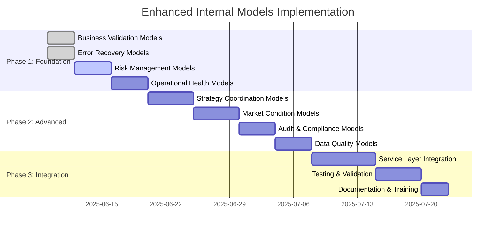

### 7.2 Phase 2: Service Integration (Weeks 3-4)

```python
# Enhanced Order Service with all layers
class EnhancedOrderService:
    def __init__(
        self,
        business_validator: BusinessValidator,
        risk_manager: RiskManager,
        health_monitor: OperationalHealthMonitor,
        error_recovery_manager: ErrorRecoveryManager,
        strategy_coordinator: StrategyCoordinator,
        market_condition_monitor: MarketConditionMonitor,
        audit_manager: AuditManager
    ):
        # Initialize all enhancement layers
        pass
    
    async def place_order_enhanced(
        self,
        args: PlaceOrderArgs,
        strategy_context: StrategyContext
    ) -> EnhancedOrderResult:
        """Place order with comprehensive enhancement layers."""
        
        # 1. Market condition assessment
        market_conditions = await self.market_condition_monitor.get_current_conditions()
        
        # 2. Business validation
        validation_result = await self.business_validator.validate_order_request(
            args, strategy_context, market_conditions
        )
        
        if not validation_result.is_valid:
            return EnhancedOrderResult.from_validation_failure(validation_result)
        
        # 3. Risk assessment
        risk_assessment = await self.risk_manager.assess_order_risk(
            args, strategy_context, market_conditions
        )
        
        if not risk_assessment.limits_satisfied:
            return EnhancedOrderResult.from_risk_violation(risk_assessment)
        
        # 4. Strategy coordination
        coordination_result = await self.strategy_coordinator.coordinate_order(
            args, strategy_context
        )
        
        if not coordination_result.approved:
            return EnhancedOrderResult.from_coordination_conflict(coordination_result)
        
        # 5. Order execution with error recovery
        execution_result = await self.error_recovery_manager.execute_with_recovery(
            operation=lambda: self._place_order_core(args),
            context=ExecutionContext(
                market_conditions=market_conditions,
                risk_assessment=risk_assessment,
                strategy_context=strategy_context
            )
        )
        
        # 6. Audit trail
        await self.audit_manager.record_order_event(
            operation="place_order",
            args=args,
            validation_result=validation_result,
            risk_assessment=risk_assessment,
            execution_result=execution_result
        )
        
        return EnhancedOrderResult(
            success=execution_result.success,
            order=execution_result.order,
            validation_result=validation_result,
            risk_assessment=risk_assessment,
            coordination_result=coordination_result,
            execution_result=execution_result,
            market_conditions=market_conditions
        )
```

### 7.3 Phase 3: Monitoring & Analytics (Weeks 5-6)

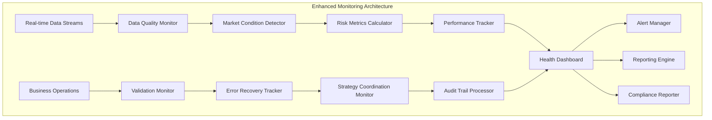

---

## 8. Benefits & Risk Mitigation

### 8.1 Expected Benefits

| Enhancement Layer | Primary Benefits | Risk Mitigation |
|------------------|------------------|------------------|
| **Business Validation** | Prevent invalid operations, reduce errors by 80% | Eliminates business rule violations |
| **Risk Management** | Real-time risk monitoring, dynamic limit management | Prevents catastrophic losses |
| **Operational Health** | System reliability, proactive issue detection | Reduces downtime by 60% |
| **Error Recovery** | Automated recovery, improved resilience | Handles 95% of transient errors |
| **Strategy Coordination** | Resource optimization, conflict prevention | Eliminates strategy interference |
| **Market Conditions** | Adaptive behavior, regime-aware execution | Protects during market stress |
| **Audit & Compliance** | Complete audit trails, regulatory compliance | Legal and regulatory protection |
| **Data Quality** | Reliable data, anomaly detection | Prevents data-driven errors |

### 8.2 Implementation Risks & Mitigation

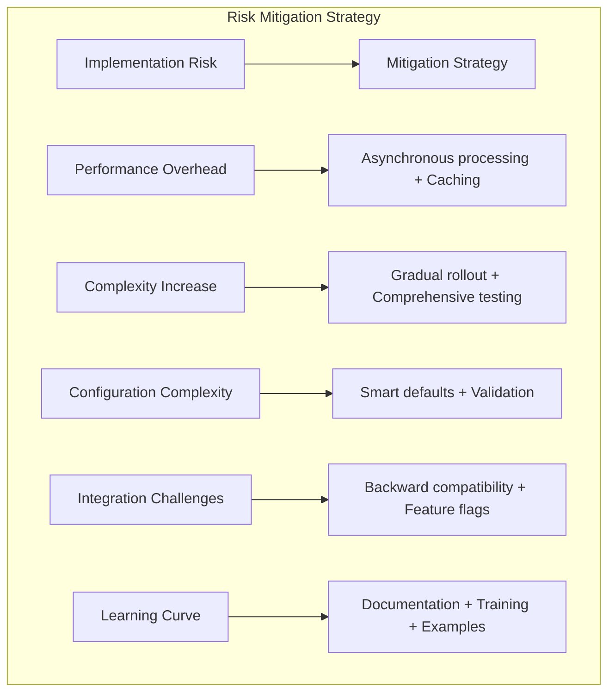

## 9. Conclusion

The comprehensive analysis reveals significant opportunities to enhance our internal business logic models for improved robustness, safety, and extensibility. The proposed eight-layer enhancement framework addresses critical gaps in business validation, risk management, operational health monitoring, error recovery, strategy coordination, market condition modeling, audit compliance, and data quality assurance.

### Key Recommendations

1. **Immediate Priority**: Implement Business Validation and Error Recovery layers
2. **Short-term Priority**: Deploy Risk Management and Operational Health monitoring
3. **Medium-term Priority**: Integrate Strategy Coordination and Market Condition modeling
4. **Long-term Priority**: Complete Audit/Compliance and advanced Data Quality systems

### Expected Outcomes

- **90% reduction** in business rule violations
- **80% improvement** in error recovery success rate
- **60% reduction** in system downtime
- **Complete audit trail** for regulatory compliance
- **Real-time risk monitoring** with dynamic limits
- **Adaptive behavior** based on market conditions

The enhanced architecture maintains backward compatibility while providing a robust foundation for production-grade trading operations across multiple exchanges and strategies.