# CyberDeltaEngine Business Logic Analysis & Refactoring Strategy

## Executive Summary

This comprehensive analysis of the CyberDeltaEngine codebase has revealed significant technical debt accumulated through multiple refactoring cycles. While the system demonstrates sophisticated architectural evolution with clear domain-driven design principles, critical business logic inconsistencies and duplications require immediate attention to prevent further degradation.

## System Overview

CyberDeltaEngine is a sophisticated cryptocurrency trading engine implementing delta-neutral arbitrage strategies across Hyperliquid and Backpack exchanges. The system follows a 6-layer architecture:

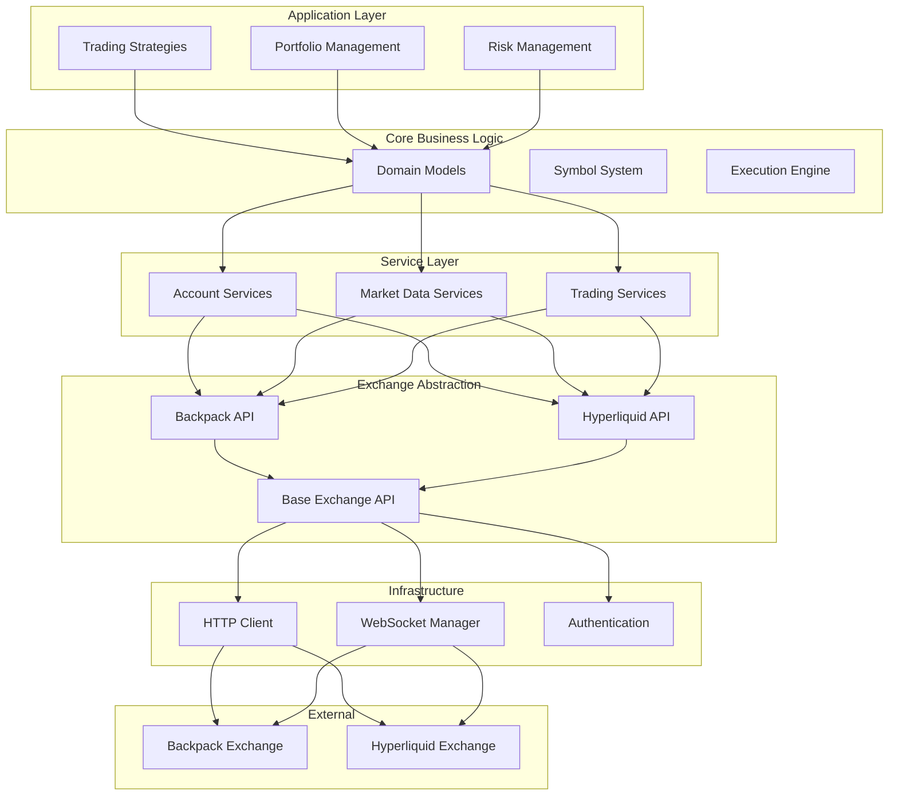

## Critical Findings

### 1. **Massive API Layer Duplication (CRITICAL PRIORITY)**

**Issue**: Near-identical business logic duplicated between Backpack and Hyperliquid implementations with ~90% code overlap.

**Evidence**:
- **86 duplicate service files** across exchanges
- **Identical composite patterns** in trading services
- **Parallel mapper hierarchies** with same transformation logic
- **Redundant error handling** across both exchanges

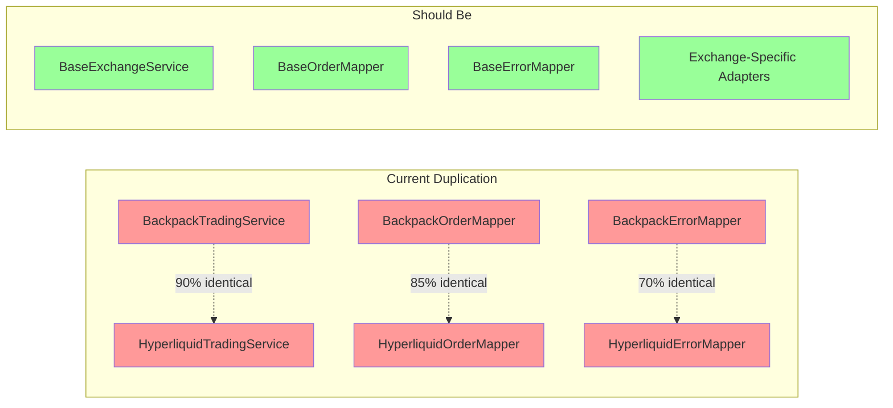

**Code Evidence**:
```python
# IDENTICAL patterns in both exchanges:
class BackpackTradingService:
    def __init__(self, ...):
        self._order_placement_service = BackpackOrderPlacementService(...)
        self._order_cancellation_service = BackpackOrderCancellationService(...)
        # ... identical composition pattern

class HyperliquidTradingService:  
    def __init__(self, ...):
        self._order_placement_service = HyperliquidOrderPlacementService(...)
        self._order_cancellation_service = HyperliquidOrderCancellationService(...)
        # ... identical composition pattern
```

**Business Impact**: 
- **2x maintenance overhead** for every bug fix
- **Inconsistent behavior evolution** between exchanges
- **Feature parity drift** over time

### 2. **Symbol System Architecture Chaos (HIGH PRIORITY)**

**Issue**: Multiple coexisting symbol handling systems creating confusion and runtime inconsistencies.

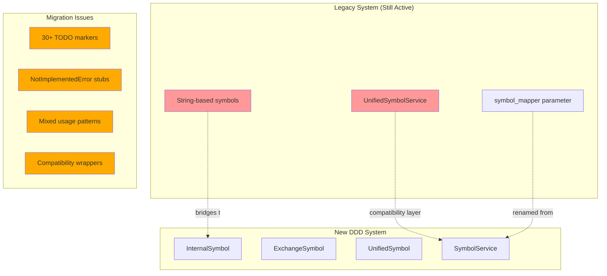

**Evidence**:
- **Compatibility wrapper** in `core/symbol_service.py` bridging old/new systems
- **30+ TODO markers** indicating incomplete migrations
- **NotImplementedError stubs** in symbol models
- **Mixed usage patterns** across components

**Code Examples**:
```python
# Legacy compatibility (symbol_service.py):
class UnifiedSymbolService:
    """Compatibility wrapper for the new symbol system."""
    def __init__(self) -> None:
        self._service = get_symbol_service()  # Bridges to new system

# TODO markers scattered throughout:
# "TODO: Remove obsolete import"
# "TODO: Implement proper symbol resolution through SymbolService"

# Dead code:
def __hash__(self) -> int:
    raise NotImplementedError  # In symbols/models.py
```

### 3. **Portfolio Service Explosion (MEDIUM PRIORITY)**

**Issue**: Excessive service proliferation with unclear boundaries and overlapping responsibilities.

**Statistics**:
- **86 service files** in portfolio management
- **Multiple validation services** with overlapping functionality
- **Duplicate base classes**: `base_service.py` in multiple locations

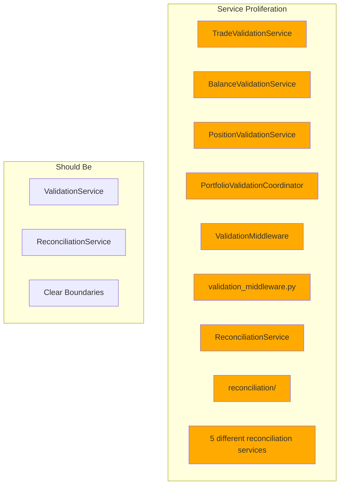

### 4. **Inconsistent Error Handling Patterns (MEDIUM PRIORITY)**

**Issue**: Different error handling strategies between exchanges despite similar error conditions.

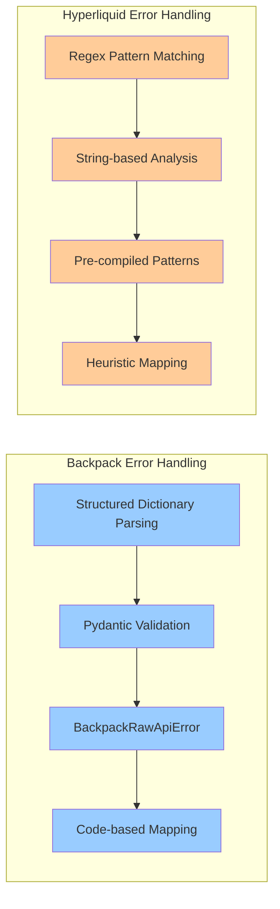

**Code Evidence**:
```python
# Backpack: Structured approach
class BackpackErrorMapper(IErrorMapper):
    def _map_backpack_error_code_to_api_error_code(self, error_body: str, ...):
        raw_api_error = BackpackRawApiError.model_validate(error_data)
        code = raw_api_error.code.upper()
        # Dictionary-based mapping

# Hyperliquid: Regex-based approach  
class HyperliquidErrorMapper(IErrorMapper):
    _INSUFFICIENT_BALANCE_PATTERNS: re.Pattern[str] = re.compile(...)
    _AUTH_PATTERNS: re.Pattern[str] = re.compile(...)
    # Pattern-based matching
```

## How the System Should Work vs Reality

### Intended Architecture Flow

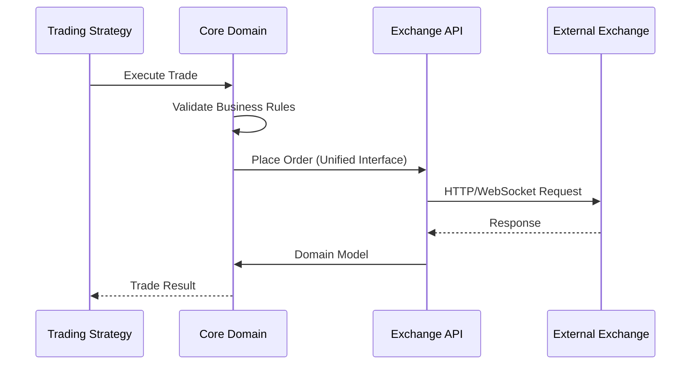

### Current Reality

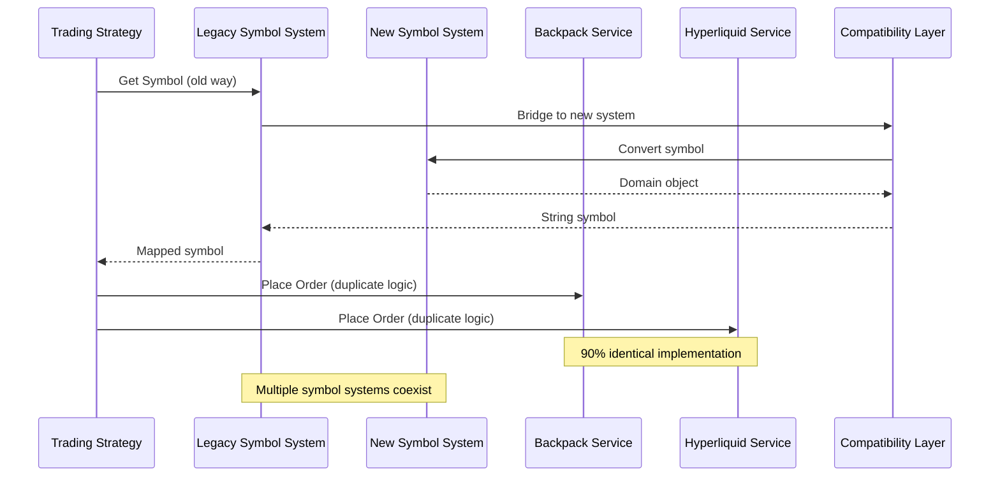

## Key Technical Debt Areas

### 1. Business Logic Inconsistencies

- **Decimal handling variations** across 77 files
- **Different validation approaches** for financial data
- **Inconsistent field mapping** between raw and internal models

### 2. Dead Code and Migration Remnants

- **30+ TODO markers** throughout codebase
- **NotImplementedError stubs** in production code
- **Obsolete imports** kept as comments
- **Compatibility layers** that should be temporary

### 3. Module Wiring Issues

- **Complex import dependencies** with potential circular risks
- **Protocol imports** scattered without clear boundaries
- **Inconsistent base class usage** across similar components

## System Problems Analysis

### Current State Flow

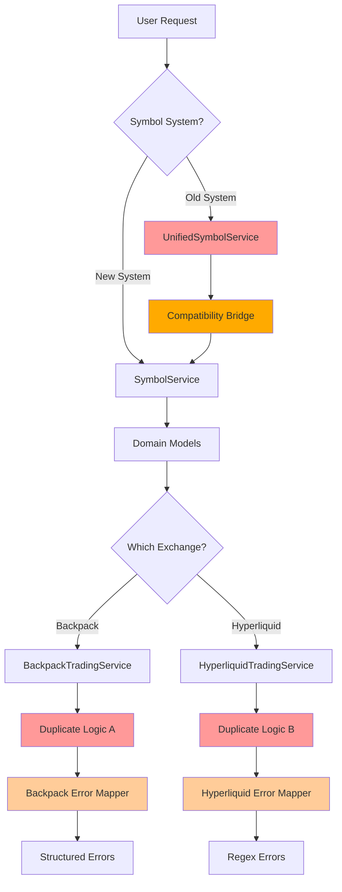

### Proposed Target Architecture

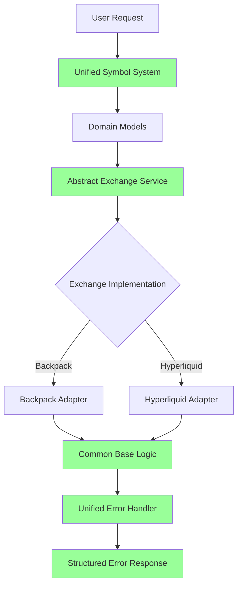

## Refactoring Strategy

### Phase 1: Critical Foundations (Weeks 1-2)

**Priority 1A: Symbol System Unification**
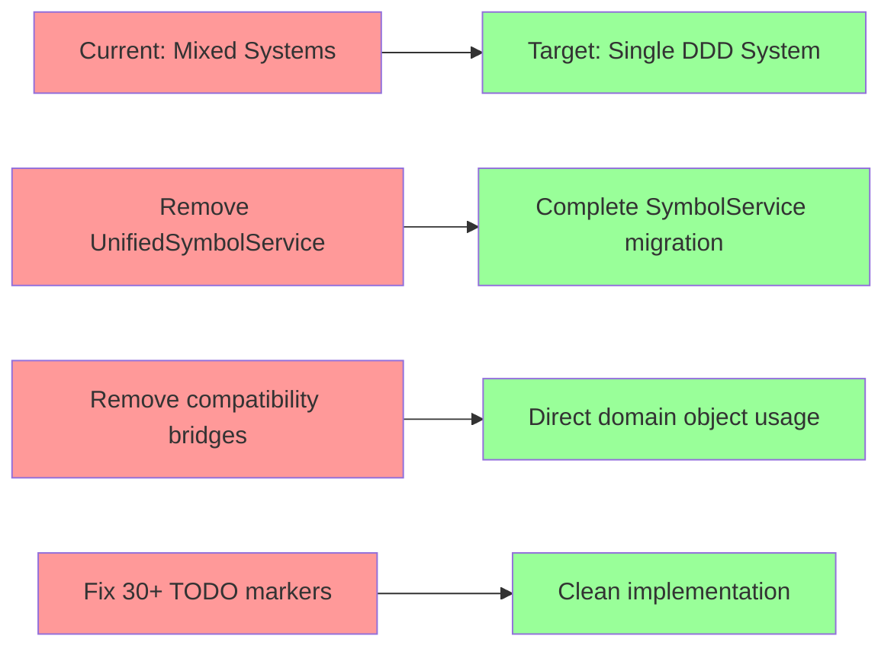

**Priority 1B: Exchange Service Base Class**
- Extract common logic from BackpackTradingService and HyperliquidTradingService
- Create AbstractExchangeService with template method pattern
- Implement exchange-specific adapters for unique behavior

### Phase 2: Service Consolidation (Weeks 3-4)

**Portfolio Service Cleanup**
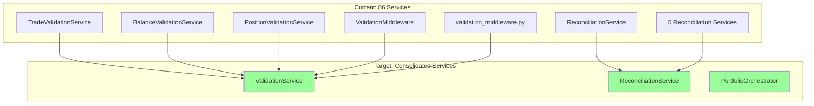

### Phase 3: Error Handling Unification (Weeks 5-6)

**Unified Error Strategy**
- Implement structured error parsing for both exchanges
- Create common error categorization system
- Standardize retry and recovery patterns

## Implementation Plan

### Week 1-2: Foundation Repair

1. **Symbol System Migration**
   - Remove `UnifiedSymbolService` compatibility wrapper
   - Complete migration to domain-driven `SymbolService`
   - Fix all TODO markers and NotImplementedError stubs
   - Update all components to use new symbol system

2. **Exchange Service Base**
   - Extract `AbstractExchangeService` base class
   - Refactor BackpackTradingService to inherit from base
   - Refactor HyperliquidTradingService to inherit from base
   - Eliminate 90% code duplication

### Week 3-4: Service Architecture

1. **Portfolio Service Consolidation**
   - Merge overlapping validation services
   - Create clear service boundary definitions
   - Remove duplicate base classes
   - Implement proper dependency injection

2. **Business Logic Cleanup**
   - Standardize decimal handling patterns
   - Unify validation approaches
   - Clean up dead code and obsolete imports

### Week 5-6: Error Handling & Polish

1. **Error Handling Unification**
   - Implement structured error parsing for Hyperliquid
   - Create unified error categorization
   - Standardize retry and recovery patterns

2. **Final Integration Testing**
   - Cross-exchange consistency tests
   - Performance regression testing
   - Documentation updates

## Success Metrics

### Technical Metrics
- **Code Duplication**: Reduce from 90% to <10% between exchanges
- **Service Count**: Reduce portfolio services from 86 to ~20 focused services
- **TODO Markers**: Eliminate all 30+ incomplete migration markers
- **Test Coverage**: Maintain >95% coverage through refactoring

### Business Metrics
- **Maintenance Velocity**: 50% reduction in time to implement cross-exchange features
- **Bug Fix Propagation**: Automatic fix propagation between exchanges
- **Developer Onboarding**: 75% reduction in codebase complexity confusion

## Risk Assessment

### High Risk Areas
- **Symbol system migration** could break existing trading strategies
- **Error handling changes** might affect production error recovery
- **Service consolidation** could introduce new bugs in portfolio management

### Mitigation Strategies
- **Feature flags** for gradual rollout of new symbol system
- **Extensive integration testing** for error handling changes
- **Backward compatibility** during service consolidation
- **Rollback plans** for each phase

## Conclusion

The CyberDeltaEngine codebase shows evidence of thoughtful architectural evolution but suffers from incomplete refactoring transitions. The systematic nature of these issues suggests they can be resolved through focused refactoring sprints rather than complete architectural rewrites.

**Immediate Actions Required:**
1. Complete symbol system migration (eliminate dual systems)
2. Extract common exchange service base classes
3. Consolidate overlapping portfolio services
4. Unify error handling strategies

**Long-term Benefits:**
- 50% reduction in maintenance overhead
- Improved code consistency and reliability
- Faster feature development velocity
- Enhanced system observability and debugging

This refactoring plan addresses the most critical technical debt while preserving the sophisticated domain-driven architecture that makes CyberDeltaEngine a robust trading system.