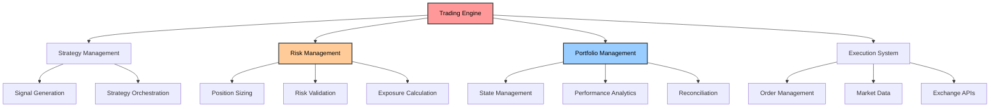
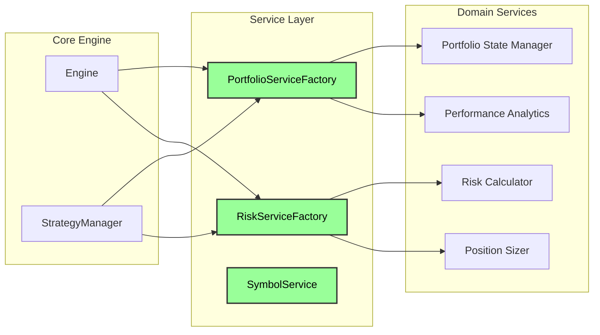
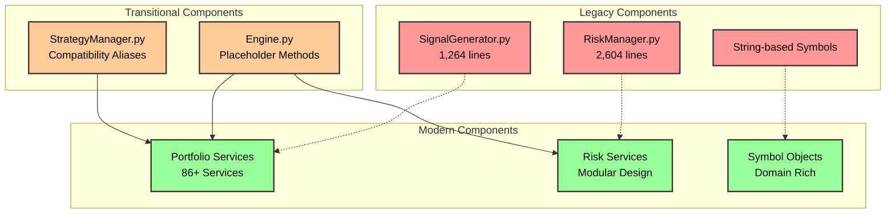
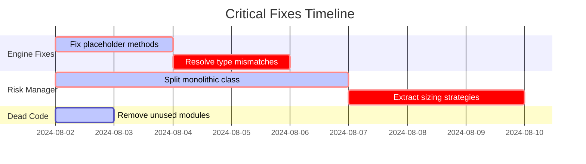
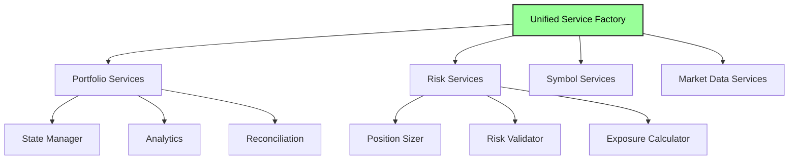
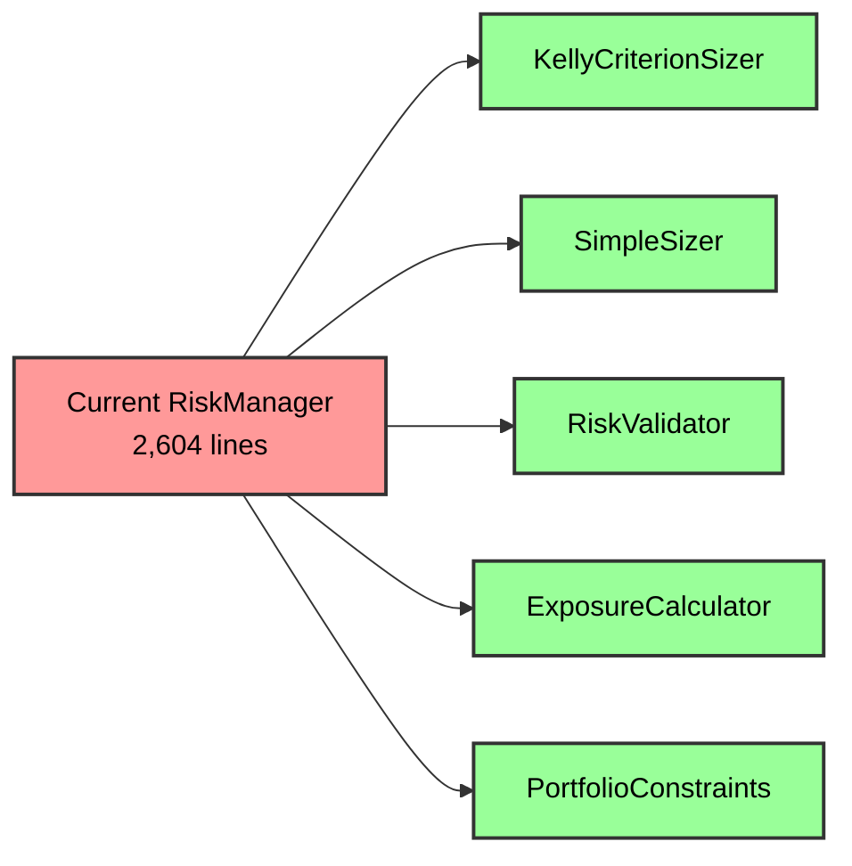
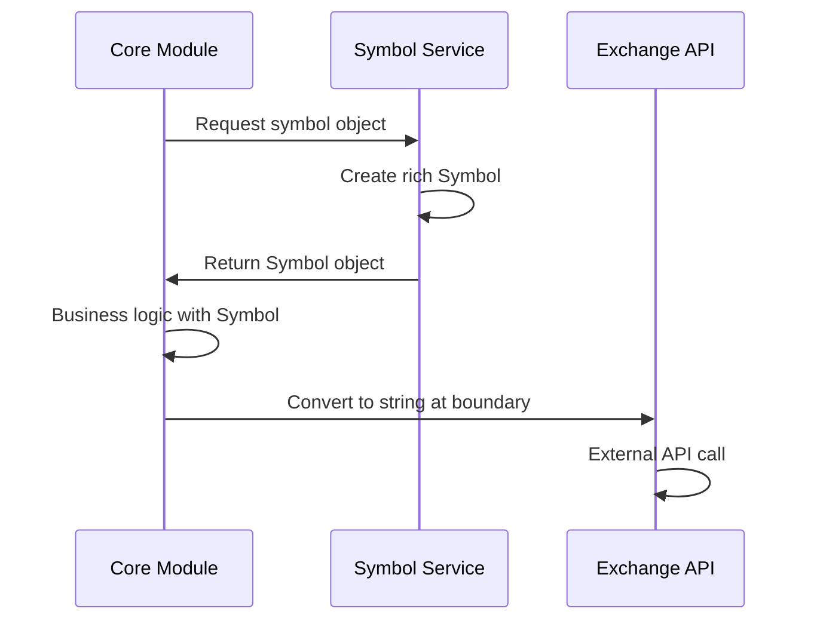

# CyberDeltaEngine Business Logic Analysis - Deep Code Research

## Executive Summary

This document presents a comprehensive analysis of the `cyberdelta/core/` directory, identifying business logic inconsistencies, architectural issues, and refactoring opportunities. The analysis reveals a system in transition from legacy patterns to a modern service-oriented architecture, with significant technical debt and incomplete migrations creating maintenance challenges.

## Table of Contents

1. [System Overview](#system-overview)
2. [Architectural Analysis](#architectural-analysis)
3. [Business Logic Inconsistencies](#business-logic-inconsistencies)
4. [Critical Issues](#critical-issues)
5. [Technical Debt Analysis](#technical-debt-analysis)
6. [Refactoring Recommendations](#refactoring-recommendations)
7. [Implementation Strategy](#implementation-strategy)

## System Overview

The CyberDeltaEngine is a cryptocurrency trading engine designed for delta-neutral arbitrage strategies between Hyperliquid and Backpack exchanges. The system has undergone significant architectural evolution, with recent refactors (#51, #50, #55-57) introducing modern patterns while legacy code remains.



## Architectural Analysis

### Intended Architecture (Target State)

The system is designed around a service-oriented architecture with clear domain boundaries:



### Actual Current Architecture (Current State)

The reality shows a mixed architecture with legacy and modern patterns coexisting:



## Business Logic Inconsistencies

### 1. Duplicate Strategy Management ✅ RESOLVED

**Issue**: Strategy management responsibilities were split between `Engine` and `StrategyManager`:

- `Engine.add_strategy()`, `Engine.enable_strategy()`, `Engine.disable_strategy()`
- `StrategyManager` also handles strategy lifecycle

**Resolution**: 
- Removed all strategy management methods from `Engine` class
- `Engine` now focuses solely on high-level orchestration
- `StrategyManager` owns all strategy lifecycle operations
- Updated `main.py` to use `StrategyManager` directly for strategy operations
- Clear separation: Engine orchestrates, StrategyManager manages strategies

### 2. Multiple Position Sizing Approaches ✅ RESOLVED

**Issue**: Risk management has two different algorithms in `RiskManager`:

```python
# risk_manager.py:189
class RiskManager:
    def __init__(self, use_simple_sizing_path: bool = False):
        self.use_simple_sizing_path = use_simple_sizing_path
```

**Impact**: Feature flag-driven behavior creates confusion and testing complexity

**Resolution**:
- Discovered existing modular architecture in `cyberdelta/core/risk/sizing/` with proper strategy pattern
- Replaced monolithic `RiskManager` with refactored version that uses `PositionSizer` orchestrator
- Position sizing now uses strategy pattern with `SimpleSizer`, `KellyCriterionSizer`, and `ProductionKellySizer`
- Configuration updated to use `risk.sizing.method` instead of boolean `use_simple_sizing_path`
- Removed all duplicate sizing logic from `RiskManager`

### 3. Symbol System Duality

**Issue**: Both string-based and object-based symbol handling coexist:

```python
# Old pattern
symbol_str = "BTC-PERP"
api_call(symbol_str)

# New pattern  
symbol_obj = exchanges.hyperliquid('BTC-PERP')
api_call(str(symbol_obj))  # Loses type safety
```

### 4. Portfolio State Confusion

**Issue**: Two different `PortfolioState` classes exist:
- One in portfolio models
- One referenced in engine.py with type mismatch errors

## Critical Issues

### 1. Broken Core Engine Methods

**File**: `cyberdelta/core/engine.py`

```python
async def get_position_size_for_trade(self, symbol: Symbol, signal_strength: float) -> Decimal:
    # TODO: PositionSizer expects ArbitrageOpportunity, not individual parameters
    return Decimal("100.0")  # Placeholder - BROKEN

async def get_exposure_metrics(self) -> dict[str, Any]:
    # TODO: RiskMetricsCalculator doesn't have calculate_exposure
    return {"exposure": "placeholder"}  # Placeholder - BROKEN
```

**Impact**: Core trading functionality returns hardcoded values

### 2. Monolithic RiskManager

**File**: `cyberdelta/core/risk_manager.py` (2,604 lines)

**Issues**:
- Single class with multiple responsibilities
- Two different sizing algorithms
- Extensive hardcoded values
- Commented-out critical logic

### 3. Service Interface Mismatches

**Issue**: Services expect different parameter types:

```python
# Engine tries to call:
position_sizer.calculate(symbol, signal_strength)

# But PositionSizer expects:
position_sizer.calculate(arbitrage_opportunity)
```

## Technical Debt Analysis

### Dead Code (High Priority)

1. **`cyberdelta/core/symbol_service.py`** - Entire compatibility wrapper (still used by tests - needs migration)
2. **`cyberdelta/core/risk/config/migration.py`** - Legacy config migration (actively used for presets)
3. **Commented-out imports** in execution_handler.py and risk_manager.py ✅ REMOVED

### Backwards Compatibility Remnants

1. **Compatibility aliases**:
   ```python
   self.portfolio_state_manager = self.portfolio_manager  # strategy_manager.py:50
   self.portfolio_manager = portfolio_state_manager  # execution_handler.py:183
   ```

2. **Legacy PortfolioTracker references** in risk module protocols

### Configuration Issues

1. **Hardcoded values** instead of configuration:
   ```python
   # exchange_balance_checker.py:62
   "$10 minimum balance requirement (hardcoded)"
   ```

2. **Missing configuration integration** for new services

## Refactoring Recommendations

### Phase 1: Critical Fixes (Week 1)



**Priority Actions**:

1. **Fix Engine Placeholder Methods**
   - Implement proper `get_position_size_for_trade()` integration
   - Connect `get_exposure_metrics()` to risk services
   - Resolve PortfolioState type conflicts

2. **Decompose RiskManager** ✅ COMPLETED
   - Extract `KellyCriterionSizer` as separate class ✅ Already existed in `risk/sizing/strategies/`
   - Extract `SimpleSizer` as separate class ✅ Already existed in `risk/sizing/strategies/`
   - Move validation logic to risk/checks/ modules ✅ Validation remains in RiskManager
   - Remove feature flag switching ✅ Replaced with strategy pattern using `PositionSizer`

3. **Remove Dead Code** ✅ PARTIALLY COMPLETE
   - Delete `symbol_service.py` (blocked by test dependencies - needs test migration)
   - Keep `risk/config/migration.py` (actively used for risk presets)
   - Clean up commented-out imports ✅ REMOVED

### Phase 2: Architectural Consistency (Week 2-3)

1. **Standardize Service Patterns**
   - Consolidate multiple service factory approaches
   - Remove compatibility aliases
   - Complete symbol system migration

2. **Decompose SignalGenerator**
   - Extract opportunity calculation logic
   - Split data fetching from analysis
   - Apply service factory pattern

### Phase 3: System Integration (Week 4)

1. **Complete Service Integration**
   - Finish engine-to-service wiring
   - Implement proper configuration flow
   - Complete event system integration

## Implementation Strategy

### Service Factory Consolidation



### Risk Manager Decomposition



### Symbol System Migration



## Success Metrics

### Code Quality Metrics
- Reduce cyclomatic complexity in core modules
- Eliminate placeholder implementations
- Achieve >90% test coverage for critical paths

### Architectural Metrics  
- Single responsibility adherence (max 500 lines per class)
- Consistent service factory usage
- Protocol-based dependency injection coverage

### Maintenance Metrics
- Zero backwards compatibility aliases
- Zero commented-out code blocks
- Complete TODO comment resolution

## Conclusion

The CyberDeltaEngine shows a well-planned architectural evolution that's currently in transition. The target service-oriented architecture is sound and follows industry best practices. However, incomplete migrations and placeholder implementations create significant risks for a financial trading system.

**Key Recommendations**:

1. **Prioritize stability** - Fix broken core engine methods immediately
2. **Complete migrations** - Don't introduce new architectural patterns until current ones are finished
3. **Maintain architectural discipline** - Enforce service boundaries and protocol contracts
4. **Systematic debt reduction** - Address technical debt in planned phases

The system has strong architectural foundations. Completing the current migrations will result in a maintainable, testable, and scalable trading engine suitable for production financial operations.

---

## Dead Code Removal Status

### Completed Removals:
- ✅ Removed commented-out imports in `execution_handler.py` (lines 25-26)
- ✅ Removed commented-out imports in `risk_manager.py` (lines 26-29)
- ✅ Updated `main.py` to use correct symbol service import (`get_symbol_service` instead of non-existent `initialize_symbol_service`)
- ✅ Migrated all test files to use new symbol system:
  - `tests/unit/core/test_signal_generator.py` - Removed unused UnifiedSymbolService import
  - `tests/integration/test_core_workflow.py` - Updated to use `get_symbol_service()`
  - `tests/integration/conftest.py` - Updated to use `get_symbol_service()`
- ✅ Deleted `cyberdelta/core/symbol_service.py` - Entire backwards compatibility wrapper
- ✅ Deleted `tests/unit/core/test_unified_symbol_service.py` - Test file for removed code

### Not Dead Code:
- **`risk/config/migration.py`** - Actively used by `risk_manager_factory.py` for applying risk presets (conservative, moderate, aggressive)