# CyberDeltaEngine APIs Deep Code Research Analysis - Third Look

## Executive Summary

After conducting an exhaustive deep code research analysis of the `@cyberdelta/apis/` directory, I've identified significant architectural patterns, business logic inconsistencies, legacy code remnants, and system improvement opportunities. This report presents findings across seven key areas with actionable recommendations and architectural diagrams.

## Key Findings Summary

### ✅ Architectural Strengths
- **Solid Factory Pattern**: Well-implemented component factories with dependency injection
- **Domain Model Separation**: Clear Raw API vs Internal Domain model boundaries
- **Service Decomposition**: Proper separation into focused, testable services
- **Type Safety**: Comprehensive Pydantic validation throughout
- **Symbol Architecture**: Unified Symbol domain objects across exchanges

### ⚠️ Critical Issues Identified
- **Naming Inconsistencies**: Different patterns between Backpack and Hyperliquid
- **Business Logic Variations**: Inconsistent order execution and validation logic
- **Code Duplication**: Repeated patterns across exchanges
- **Legacy Code Remnants**: Dead code and incomplete refactor artifacts
- **Module Wiring Issues**: Missing implementations and protocol violations

---

## 1. Architecture Analysis

### Current Architecture Patterns

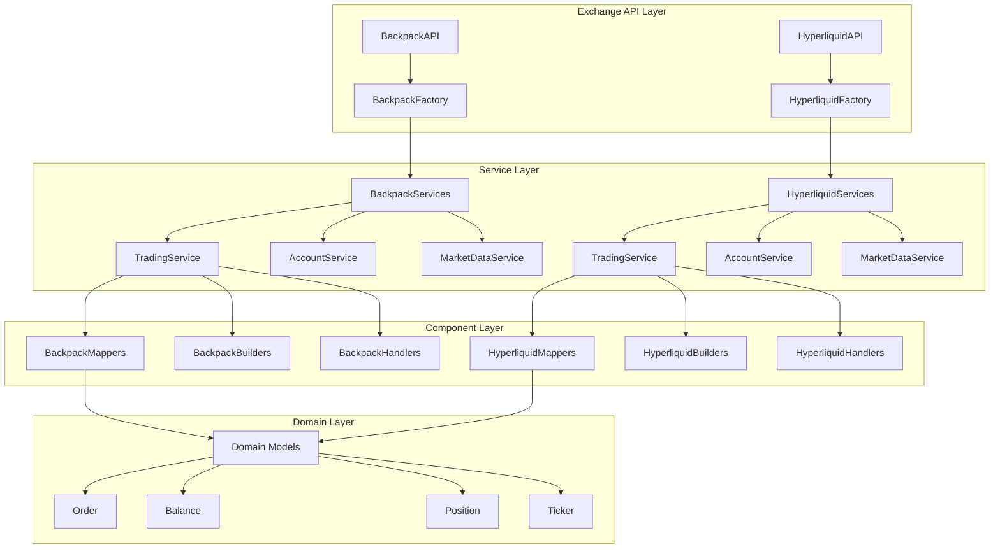

### Architectural Inconsistencies Found

#### 1. **Naming Pattern Inconsistencies**
**Critical Priority** - Affects maintainability and developer experience

| Component | Backpack Pattern | Hyperliquid Pattern | Issue |
|-----------|-----------------|-------------------|-------|
| Error Mapper | `bp_error_mapper.py` | `hl_errors_mapper.py` | Extra 's' in errors |
| Authentication | `BackpackEd25519Authenticator` | `HyperliquidEip712Authenticator` | Different case patterns |
| Services | `bp_price_ticker_service.py` | `hl_price_ticker_mapper.py` | Service vs Mapper |

#### 2. **Factory Wiring Differences**

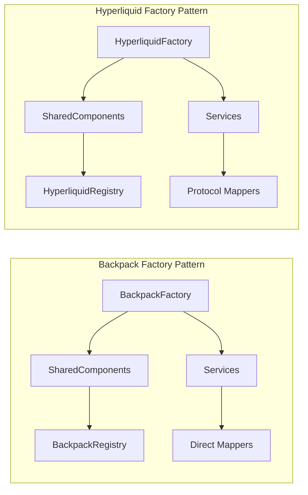

**Issue**: Backpack uses concrete types, Hyperliquid uses protocols for dependency injection.

#### 3. **Service Constructor Inconsistencies**

**Backpack Pattern**:
```python
def __init__(self, mapper: BackpackOrderMapper): ...
```

**Hyperliquid Pattern**:
```python
def __init__(self, mapper: OrderMapperProtocol | None = None): ...
```

---

## 2. Business Logic Inconsistencies

### Order Placement Logic Discrepancies

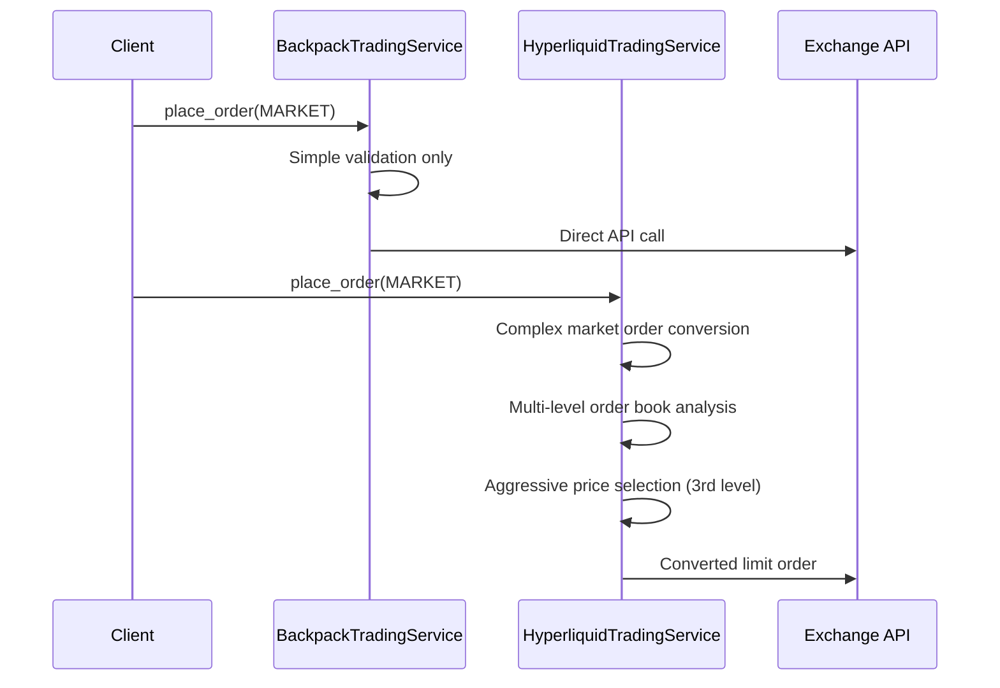

**Business Impact**: Different market order execution behavior could lead to inconsistent trading outcomes and slippage characteristics.

### Validation Rule Inconsistencies

| Validation Rule | Backpack | Hyperliquid | Business Risk |
|----------------|----------|-------------|---------------|
| FOK Orders | ✅ Accepted | ❌ Rejected | Order execution failures |
| Batch Size Limit | No limit | Max 50 orders | Batch operation failures |
| Duplicate Symbols | Not checked | Rejected | Inconsistent validation |
| Time in Force | Basic validation | Complex rules | Different order behavior |

### Fee Handling Discrepancies

```mermaid
graph TD
    subgraph "Backpack Fee Logic"
        BPF[Raw Fill] --> BPFS[fee_symbol from API]
        BPFS --> BPFD[Fee Asset = fee_symbol]
    end
    
    subgraph "Hyperliquid Fee Logic"
        HLF[Raw Fill] --> HLFS[Assume fee_asset = coin]
        HLFS --> HLFD[Fee Asset = traded symbol]
        HLF --> HLWS[WebSocket Fee = "0"]
    end
```

**Business Impact**: Different fee accounting and P&L reporting accuracy.

---

## 3. Code Duplication Analysis

### Major Duplication Areas

#### 1. **Common Mapper Utilities**
- **Backpack**: `common_mappers.py` (225 lines)
- **Hyperliquid**: `hyperliquid_common_mappers.py` (487 lines)
- **Overlap**: ~60% similar transformation logic

#### 2. **Error Handling Patterns**
```python
# Repeated across all services
try:
    # Service logic
except TransformationError as e:
    raise APIError(...) from e
except ValidationError as e:
    raise APIError(...) from e
```

#### 3. **Validation Logic**
- Symbol validation
- Decimal parsing and validation  
- Timestamp parsing
- Authentication checks

**Consolidation Opportunity**: Estimated 30% code reduction through shared utilities.

---

## 4. Legacy Code and Refactor Remnants

### Dead Code Identified

#### 1. **TODO/FIXME Comments** (Incomplete Features)
- **Hyperliquid Registry**: Multiple TODOs in `hl_response_handler_registry.py:183-194`
- **WebSocket Performance**: TODO in `ws_context.py:94` about expensive JSON serialization
- **Missing Endpoints**: TODO in `bp_price_ticker_service.py:286`

#### 2. **Commented-Out Code**
- **File**: `hl_raw_transfer_withdrawal.py:113`
- **Content**: `# class HyperliquidRawEthWithdrawalActionPayload(BaseModel):`
- **Status**: Should be removed

#### 3. **Backwards Compatibility Remnants**
- **Mixed Parsing Patterns**: Old `parse_decimal_value` usage alongside new mixin methods
- **Duplicate Utilities**: Legacy static methods alongside new instance methods
- **Service Args Models**: Old backward compatibility layers may be obsolete

### Incomplete Refactor Evidence

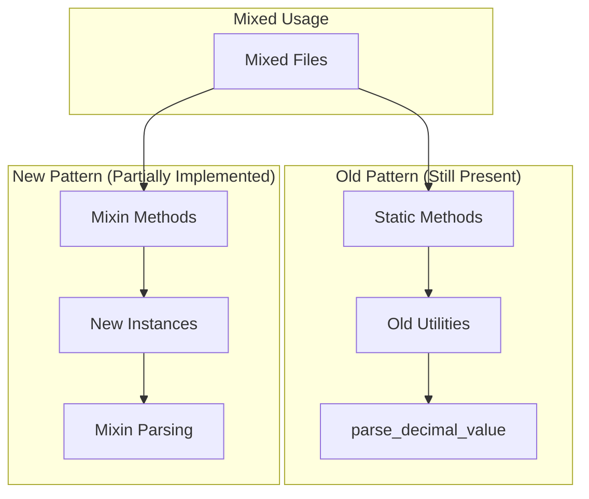

---

## 5. Module Wiring Analysis

### Component Wiring Issues Found

#### 1. **Registry Usage Inconsistencies**
- **Design Intent**: Use registries for component lookup
- **Reality**: Most components created directly by factories
- **Issue**: Registry pattern is underutilized

#### 2. **Protocol Implementation Gaps**
- **NotImplementedError**: Multiple handlers have placeholder methods
- **Batch Operations**: Backpack has `NotImplementedError` for batch operations (lines 775, 799)
- **Base Methods**: Many base class methods not implemented

#### 3. **Authentication Wiring Differences**

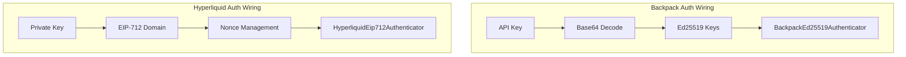

**Issue**: Completely different authentication flows with different error handling patterns.

#### 4. **Missing Component Connections**
- **WebSocket Handlers**: Some message types lack proper routing
- **Error Mappers**: Inconsistent error code mapping approaches
- **Rate Limiters**: Different integration patterns between exchanges

---

## 6. System Architecture: Design vs Reality

### Expected Flow (Documentation)
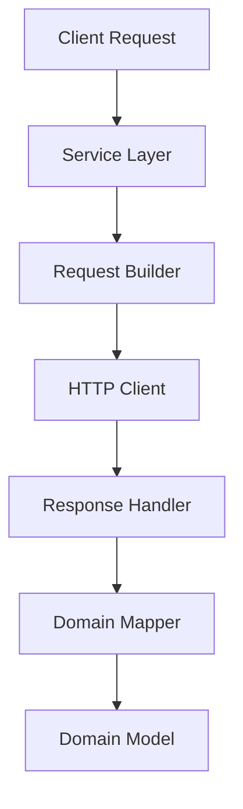

### Actual Flow (Implementation)
```mermaid
graph TD
    A[Client Request] --> B[Composite Service]
    B --> C[Decomposed Service]
    C --> D[Request Builder]
    D --> E[Symbol Transformation]
    E --> F[HTTP Client + Auth]
    F --> G[Response Handler]
    G --> H[Pydantic Validation]
    H --> I[secure_transform()]
    I --> J[Domain Mapper]
    J --> K[Symbol Creation]
    K --> L[Domain Model]
```

### Key Differences
1. **Additional Security Layer**: `secure_transform()` not documented
2. **Symbol Transformation**: Complex symbol handling at multiple points
3. **Composite Pattern**: Service composition more complex than documented  
4. **Multiple Validations**: More validation passes than expected

---

## 7. System Improvement Proposals

### Phase 1: Critical Standardization (Immediate - 2 weeks)

#### 1.1 **Naming Standardization**
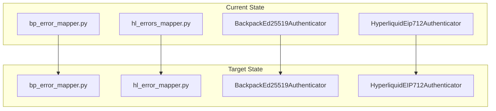

**Actions**:
- Standardize file naming: `*_error_mapper.py` (no extra 's')
- Standardize class naming: Use consistent case patterns
- Create naming convention guide

#### 1.2 **Service Constructor Unification**
```python
# Target Pattern (Unified)
class ExchangeTradingService:
    def __init__(
        self,
        http_client_requester: HttpClientRequesterSig,
        authenticator: AuthenticatorProtocol | None,
        exchange_name: str,
        request_builder: TradingRequestBuilderProtocol | None = None,
        response_handler: TradingResponseHandlerProtocol | None = None,
        order_mapper: OrderMapperProtocol | None = None,
    ): ...
```

### Phase 2: Business Logic Consolidation (Short-term - 4 weeks)

#### 2.1 **Unified Market Order Logic**
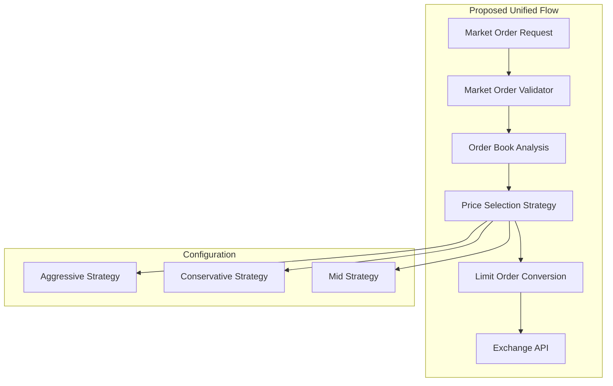

**Implementation**:
- Create `MarketOrderProcessor` base class
- Implement exchange-specific strategies
- Standardize slippage protection

#### 2.2 **Validation Rule Consolidation**
```python
# Proposed: Unified Validation Interface
class ExchangeValidationRules:
    def validate_order_type(self, order_type: OrderType) -> bool: ...
    def validate_time_in_force(self, tif: TimeInForce) -> bool: ...
    def validate_batch_size(self, batch_size: int) -> bool: ...
    def validate_duplicate_symbols(self, symbols: list[Symbol]) -> bool: ...
```

### Phase 3: Architectural Improvements (Medium-term - 6 weeks)

#### 3.1 **Shared Component Architecture**
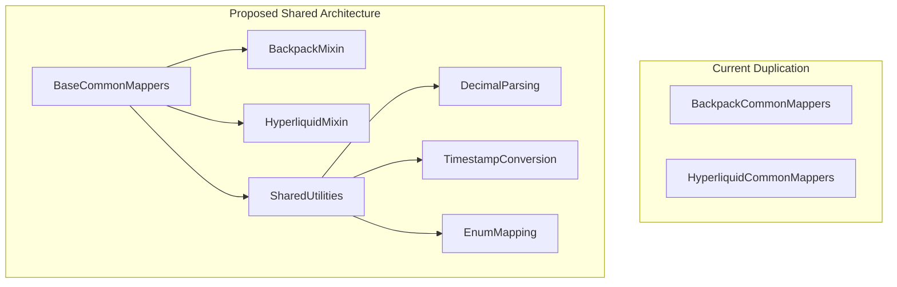

**Components to Create**:
- `apis/base/shared_mappers.py`
- `apis/base/shared_validators.py`  
- `apis/base/shared_transformers.py`

#### 3.2 **Error Handling Standardization**
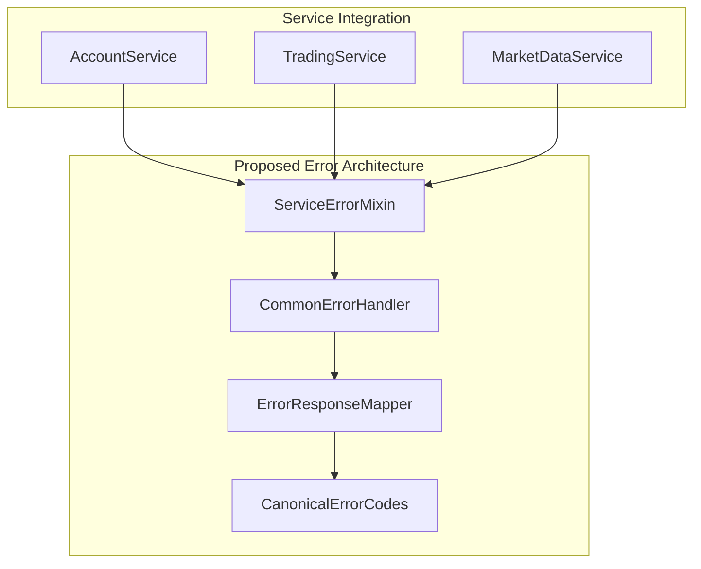

#### 3.3 **Registry Pattern Enhancement**
```python
# Proposed: Enhanced Registry Usage
class ExchangeComponentFactory:
    def __init__(self, registry: ComponentRegistry):
        self._registry = registry
        
    def create_service(self, service_type: str) -> Any:
        # Always use registry first, fallback to direct creation
        return self._registry.get_or_create(service_type, self._create_default)
```

### Phase 4: Legacy Cleanup (Medium-term - 3 weeks)

#### 4.1 **Dead Code Removal**
- Remove commented code: `hl_raw_transfer_withdrawal.py:113`
- Resolve or remove TODOs in registry files
- Audit WebSocket modules for over-engineering
- Clean up old common mapper classes

#### 4.2 **Backwards Compatibility Migration**
- Complete migration from `parse_decimal_value` to mixins
- Remove duplicate common mapper utilities
- Standardize static vs instance method usage

### Phase 5: Documentation and Testing (Ongoing - 2 weeks)

#### 5.1 **Architecture Documentation Update**
- Document actual composite service patterns
- Add symbol transformation strategy docs
- Update error handling flow documentation
- Create component interaction diagrams

#### 5.2 **Enhanced Testing Strategy**
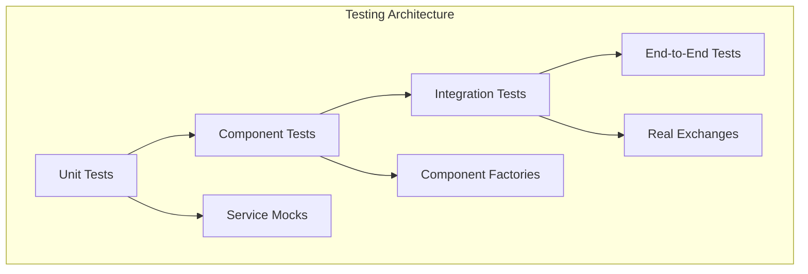

---

## 8. Implementation Priority Matrix

| Priority | Impact | Effort | Items |
|----------|---------|--------|--------|
| **P0 - Critical** | High | Low | Naming standardization, Dead code removal |
| **P1 - High** | High | Medium | Service constructor unification, Business logic consolidation |
| **P2 - Medium** | Medium | High | Shared components, Registry enhancement |
| **P3 - Low** | Low | Medium | Documentation updates, Enhanced testing |

---

## 9. Success Metrics

### Code Quality Metrics
- **Code Duplication**: Target 30% reduction
- **Test Coverage**: Maintain >90% coverage during refactoring
- **Type Safety**: Zero `typing.Any` usage in new code
- **Documentation**: 100% public API documentation

### Architecture Metrics
- **Component Reuse**: 80% of utilities shared between exchanges
- **Naming Consistency**: 100% adherence to naming conventions
- **Error Handling**: Standardized error patterns across all services
- **Protocol Compliance**: Zero `NotImplementedError` in production paths

### Business Metrics
- **Order Execution Consistency**: Same behavior across exchanges for equivalent operations
- **Fee Calculation Accuracy**: Consistent fee accounting and reporting
- **Risk Management**: Unified validation rules across all exchanges

---

## 10. Risk Assessment

### Technical Risks
- **Refactoring Scope**: Large codebase changes risk introducing bugs
- **Backwards Compatibility**: Breaking changes during consolidation
- **Performance Impact**: Additional abstraction layers

### Mitigation Strategies
- **Incremental Refactoring**: Phase-based approach with rollback capability
- **Comprehensive Testing**: Maintain test coverage throughout refactoring
- **Feature Flags**: Gradual rollout of new patterns

### Business Risks
- **Trading Inconsistencies**: Current order execution differences
- **Fee Calculation Errors**: Inconsistent P&L reporting
- **Operational Risk**: Complex system with multiple failure points

---

## Conclusion

The CyberDeltaEngine APIs demonstrate a sophisticated and well-architected system with strong foundations in factory patterns, domain model separation, and type safety. However, significant inconsistencies between exchange implementations create maintainability challenges and potential trading risks.

The most critical issues requiring immediate attention are:

1. **Naming inconsistencies** that impact developer productivity
2. **Business logic variations** that could affect trading outcomes
3. **Code duplication** that increases maintenance overhead
4. **Legacy code remnants** that create technical debt

The proposed phased approach prioritizes critical standardization first, followed by business logic consolidation and architectural improvements. This strategy minimizes risk while maximizing impact on system quality and maintainability.

**Recommended Next Steps**:
1. Begin Phase 1 naming standardization immediately
2. Create architectural standards document
3. Implement enhanced testing for refactoring safety
4. Start Phase 2 business logic consolidation

The system's strong architectural foundation provides an excellent base for these improvements, and the proposed changes will significantly enhance code quality, maintainability, and trading system reliability.