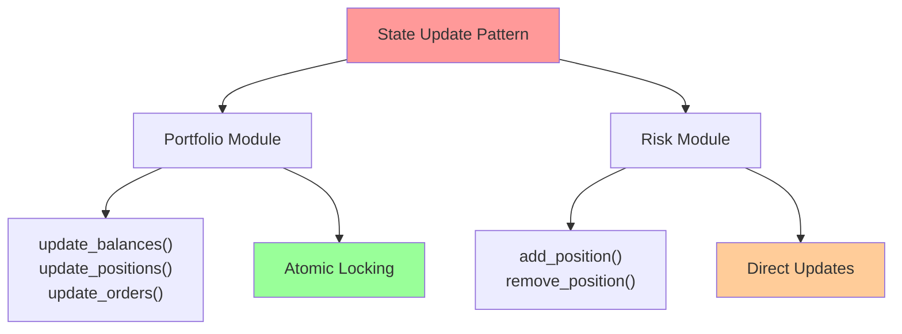
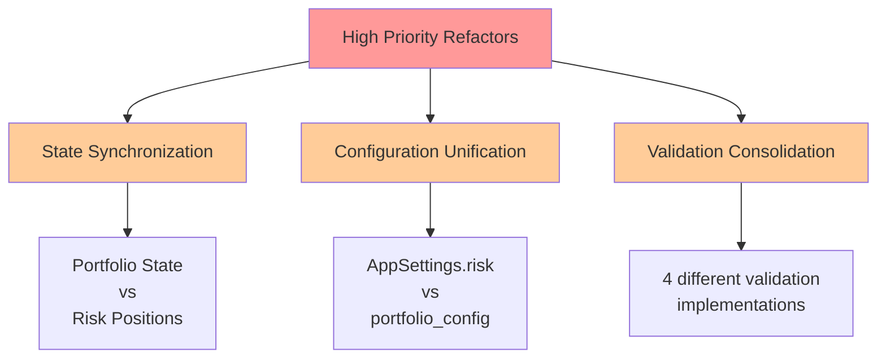
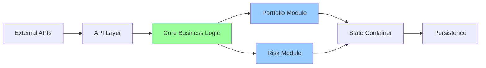
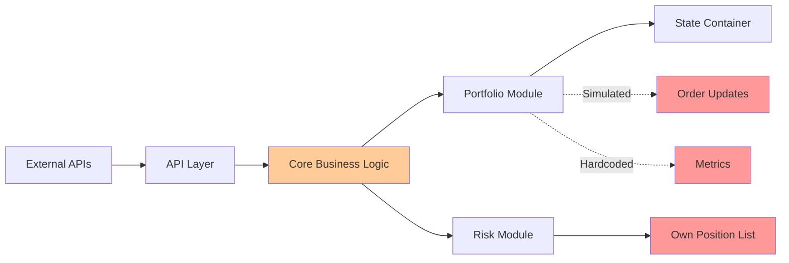
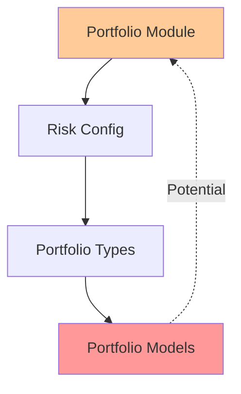
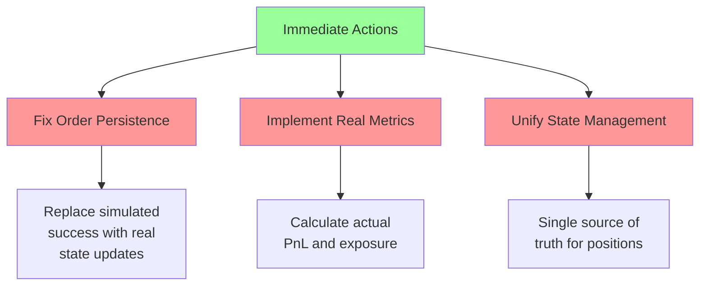
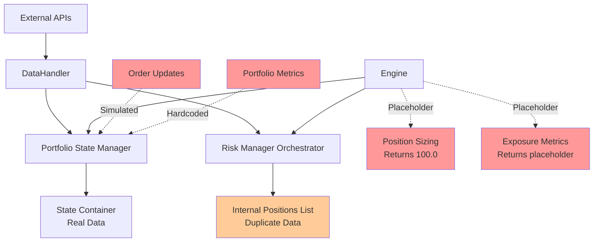
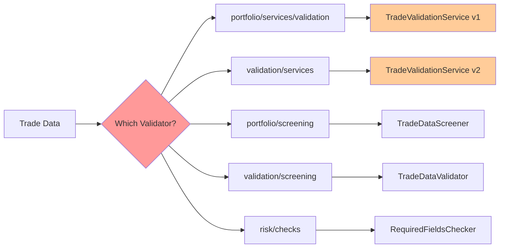

# CyberDeltaEngine Core Business Logic Analysis

## Executive Summary

This analysis reveals significant architectural inconsistencies, duplications, and technical debt across the portfolio and risk modules. The system shows evidence of multiple incomplete refactorings, with newer patterns coexisting with legacy code. While recent efforts have improved modularity, critical integration issues remain.

## 1. Business Logic Inconsistencies and Duplications

### 1.1 Capital/Value Terminology Confusion


**Issue**: Inconsistent naming between `total_capital`, `total_account_value`, and `available_capital` across modules.

- **Portfolio**: Uses `total_account_value` (portfolio_state_manager.py:599)
- **Risk**: Mixes `total_capital` and `total_account_value` (risk_manager_orchestrator.py:216-217)
- **Impact**: Confusion about which values represent what, potential calculation errors

### 1.2 State Update Duplication



**Issue**: Both modules maintain their own position tracking:
- Portfolio: `StateContainerProtocol` based updates with atomic locks
- Risk: Direct `current_positions` list manipulation
- **Impact**: Potential state inconsistency between modules

### 1.3 Validation Service Duplication

Multiple validation implementations exist:
1. `portfolio/services/validation/` - Portfolio-specific validation
2. `risk/checks/` - Risk-specific checks
3. `validation/services/` - Core validation module (duplicate of portfolio validation)
4. `portfolio/screening/` - Another screening implementation
5. `validation/screening/` - Yet another validation layer

**Evidence**:
- `core/validation/services/trade_validation_service.py`
- `core/portfolio/services/validation/trade_validation_service.py`
- Same classes duplicated in different modules!

## 2. Remnants of Old Refactors and Dead Code

### 2.1 Portfolio Configuration Remnants

```python
# portfolio_state_manager.py:75-76
# portfolio_tracker was removed - use risk settings for portfolio limits
self.risk_config = app_settings.risk
```

**Evidence of incomplete refactor**:
- Comments reference removed `portfolio_tracker`
- Hardcoded defaults (lines 88-92) instead of configuration
- Mixed configuration sources (AppSettings.risk vs portfolio config)

### 2.2 Placeholder Implementations

```python
# portfolio_state_manager.py:335-340
# For orders, we might need to use a different method since StateContainerProtocol
# doesn't have update_orders. For now, simulate success.
result = StateUpdateResult(
    success=True,
    execution_time_ms=1.0,
    affected_entities=len(orders),
)
```

**Critical Issue**: Order updates are **simulated** - not actually persisted!

### 2.3 TODO Comments and Incomplete Features

```python
# portfolio_state_manager.py:585
# TODO: Calculate from balances

# portfolio_state_manager.py:680
# TODO: Implement proper metric calculation
```

## 3. Modules Needing Immediate Refactor

### 3.1 Critical Priority

1. **Order Management Integration**
   - portfolio_state_manager.py:335 - Fake order updates
   - No actual order persistence
   - **Risk**: Orders appear successful but aren't saved

2. **Portfolio Metrics Calculation**
   - portfolio_state_manager.py:673-692 - Returns hardcoded zeros
   - No actual PnL or exposure calculations
   - **Risk**: False reporting of portfolio health

### 3.2 High Priority



## 4. System Architecture: Intended vs Reality

### 4.1 Intended Architecture



### 4.2 Actual Implementation



**Key Deviations**:
1. Risk module maintains separate state
2. Order updates are simulated
3. Metrics are hardcoded
4. No unified state management

## 5. Module Wiring Errors and Inconsistencies

### 5.1 Exchange Symbol Creation

```python
# portfolio_state_manager.py:571-572
usdc_symbol = getattr(exchanges, exchange.value.lower())('USDC')
usdt_symbol = getattr(exchanges, exchange.value.lower())('USDT')
```

**Issues**:
- Dynamic attribute access without error handling
- Assumes exchange module structure
- Will fail if exchange module doesn't follow expected pattern

### 5.1.1 Engine Integration Issues

```python
# engine.py:82-84
# TODO: This method needs to be redesigned - PositionSizer expects ArbitrageOpportunity, not individual parameters
# For now, return a placeholder value to fix mypy errors
return Decimal("100.0")  # Placeholder - needs proper implementation

# engine.py:104-106
# TODO: This method needs to be redesigned - RiskMetricsCalculator doesn't have calculate_exposure
# For now, return a placeholder value to fix mypy errors
return {"exposure": "placeholder"}  # Placeholder - needs proper implementation
```

**Critical Issues**:
- Engine has placeholder implementations that return fake data
- Type mismatches between what Engine expects and what Risk module provides
- No actual integration between Engine and Risk components

### 5.2 Protocol Mismatches

```python
# StateContainerProtocol doesn't define update_orders()
# But portfolio_state_manager tries to use it
```

**Impact**: Implementations may not fulfill protocol contracts

### 5.3 Circular Dependencies Risk



## 6. Git History Analysis

### Recent Refactors (Good Patterns)
- Commit 24ecfbea: "Refactor portfolio event system and validation components"
- Shows move toward event-driven architecture
- Better separation of concerns

### Older Patterns Still Present
- Direct state manipulation
- Hardcoded values
- Mixed responsibility patterns

## 7. Proposed Improvements

### 7.1 Immediate Actions



### 7.2 Architecture Improvements

1. **Unified State Management**
   ```python
   class UnifiedStateManager:
       """Single source of truth for all portfolio state"""
       def update_positions(self, exchange: ExchangeName, positions: list[Position])
       def get_global_positions(self) -> GlobalPositionView
   ```

2. **Configuration Consolidation**
   ```python
   class PortfolioConfig:
       """All portfolio-related configuration in one place"""
       capital_limits: CapitalLimits
       risk_parameters: RiskParameters
       validation_rules: ValidationRules
   ```

3. **Event-Driven Updates**
   ```python
   @dataclass
   class PositionUpdatedEvent:
       exchange: ExchangeName
       position: DerivativePosition
       timestamp: datetime
   ```

### 7.3 Testing Strategy

1. **Integration Tests**: Verify state consistency between modules
2. **Property Tests**: Ensure invariants (e.g., total_capital = sum(positions) + available)
3. **End-to-End Tests**: Full order lifecycle including persistence

## 8. Risk Assessment

### Critical Risks
1. **Data Loss**: Orders not persisted despite success response
2. **False Reporting**: Metrics show zero when positions exist
3. **State Desync**: Portfolio and Risk modules have different position views

### Mitigation Priority
1. Fix order persistence (1-2 days)
2. Implement real metrics (2-3 days)
3. Unify state management (1 week)
4. Consolidate validation (1 week)

## 9. Conclusion

The codebase shows clear signs of evolution and partial refactoring. While newer patterns (event-driven, protocol-based) are good, critical functionality remains broken or simulated. The highest priority is fixing order persistence and implementing real metrics calculation to prevent data loss and false reporting.

The architecture needs a unified state management layer to eliminate the current dual-state problem between portfolio and risk modules.

## 10. Additional Findings from Deep Analysis

### 10.1 Symbol System Inconsistencies

The system uses different symbol representations across modules:
- Risk module: Expects `Symbol` objects with `.value` property
- Portfolio module: Mixed use of `Symbol` objects and string keys
- Individual position exposure: Uses `Symbol` object directly

### 10.2 Data Flow Diagram - Current State



### 10.3 Validation Layer Chaos



### 10.4 Capital Terminology Mapping

| Module | Variable | Actual Meaning | Should Be |
|--------|----------|----------------|-----------|
| Portfolio | `total_account_value` | Total portfolio value | ✓ Correct |
| Risk | `total_capital` | Same as total_account_value | `total_account_value` |
| Risk | `total_account_value` | Redundant with total_capital | Remove duplicate |
| Risk | `available_capital` | Unallocated capital | ✓ Correct |

### 10.5 Most Critical Technical Debt

1. **Order Persistence**: Lines 335-340 in portfolio_state_manager.py
2. **Metrics Calculation**: Lines 680-692 in portfolio_state_manager.py  
3. **Engine Integration**: Lines 82-84, 104-106 in engine.py
4. **State Synchronization**: Risk and Portfolio maintain separate position lists
5. **Validation Duplication**: 5 different validation implementations for same data

These issues represent immediate risks to system integrity and should be addressed before any new features are added.