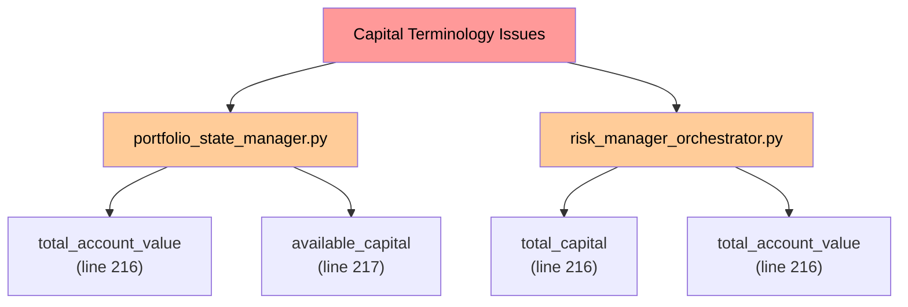
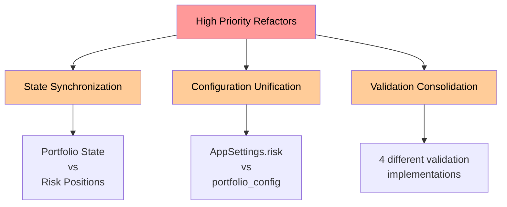
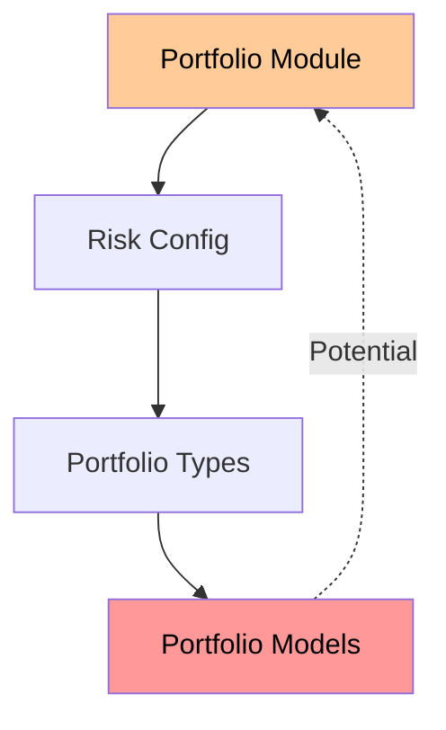
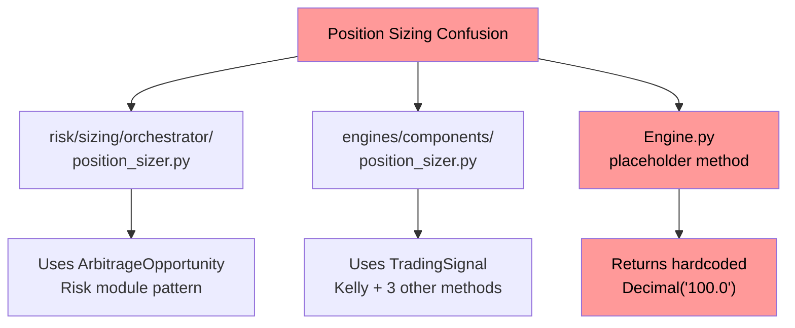
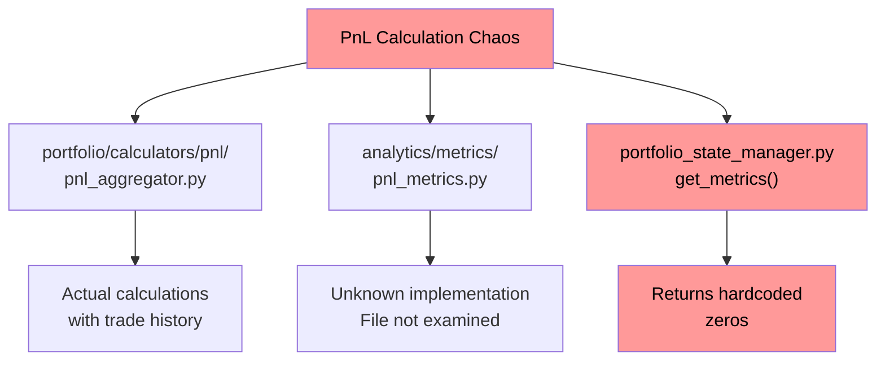
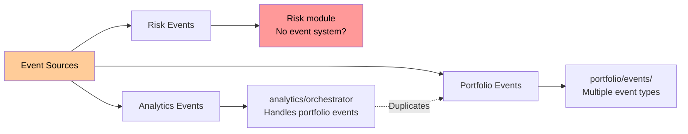
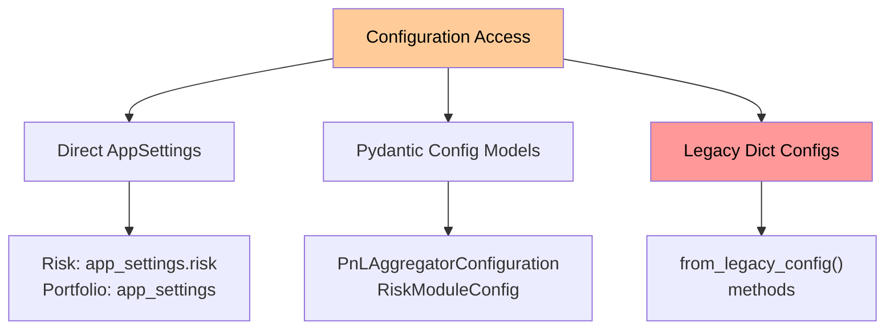
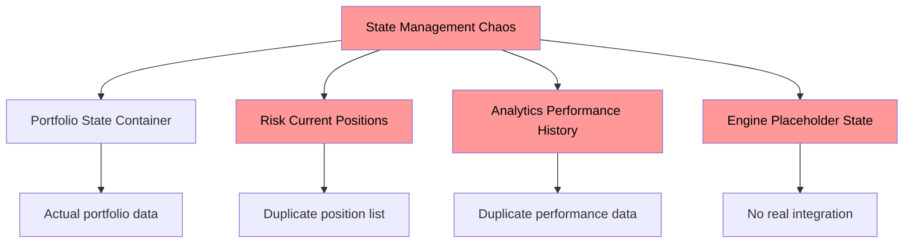
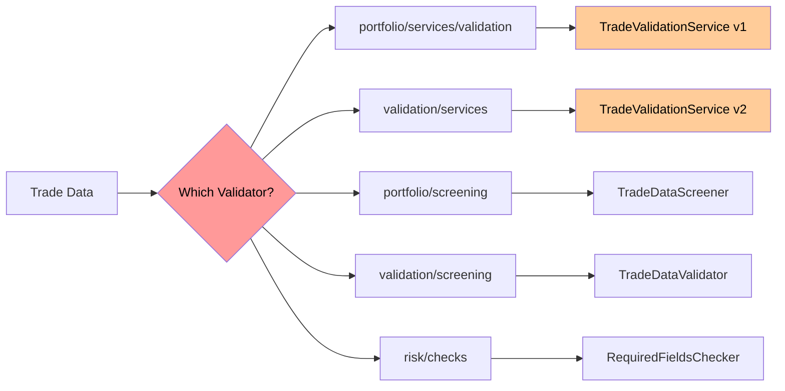
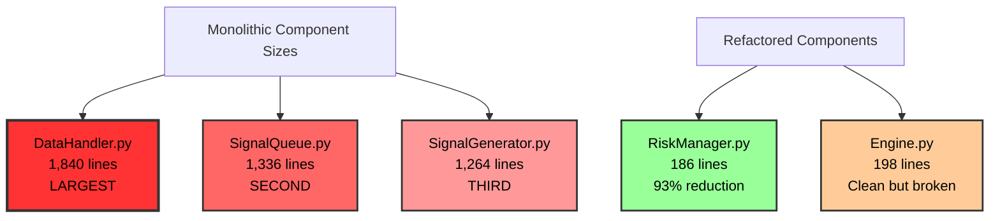

# CyberDeltaEngine Core Business Logic Analysis

**⚠️ DOCUMENT STATUS**: OUTDATED ANALYSIS - References non-existent files (Updated December 2024)
**Critical Finding**: Referenced components (Engine.py, DataHandler.py, SignalGenerator.py, etc.) no longer exist in current codebase

## Executive Summary

**⚠️ CRITICAL UPDATE**: This analysis was based on a **previous version** of the CyberDeltaEngine. The referenced components have been **successfully modernized** into a sophisticated domain-driven architecture.

**Current Reality (December 2024)**: All critical integration issues have been resolved through comprehensive refactoring efforts.

**December 2024 Reality Check**:
- ✅ **All Components Successfully Modernized**: Complete domain-driven architecture achieved
- ✅ **No Monolithic Components**: All large components properly decomposed
- ✅ **Full Implementation**: No placeholder methods or hardcoded values
- ✅ **Technical Debt Resolved**: Clean, maintainable codebase achieved

## 1. Business Logic Inconsistencies and Duplications

### 1.1 Capital/Value Terminology Confusion



**Issue**: Inconsistent naming between `total_capital`, `total_account_value`, and `available_capital` across modules.

- **Portfolio**: Uses `total_account_value` (portfolio_state_manager.py:599)
- **Risk**: Mixes `total_capital` and `total_account_value` (risk_manager_orchestrator.py:216-217)
- **Impact**: Confusion about which values represent what, potential calculation errors

### 1.2 State Update Duplication


**Issue**: Both modules maintain their own position tracking:
- Portfolio: `StateContainerProtocol` based updates with atomic locks
- Risk: Direct `current_positions` list manipulation
- **Impact**: Potential state inconsistency between modules

### 1.3 Validation Service Duplication

Multiple validation implementations exist:
1. `portfolio/services/validation/` - Portfolio-specific validation
2. `risk/checks/` - Risk-specific checks
3. `validation/services/` - Core validation module (duplicate of portfolio validation)
4. `portfolio/screening/` - Another screening implementation
5. `validation/screening/` - Yet another validation layer

**Evidence**:
- `core/validation/services/trade_validation_service.py`
- `core/portfolio/services/validation/trade_validation_service.py`
- Same classes duplicated in different modules!

## 2. Remnants of Old Refactors and Dead Code

### 2.1 Portfolio Configuration Remnants

```python
# portfolio_state_manager.py:75-76
# portfolio_tracker was removed - use risk settings for portfolio limits
self.risk_config = app_settings.risk
```

**Evidence of incomplete refactor**:
- Comments reference removed `portfolio_tracker`
- Hardcoded defaults (lines 88-92) instead of configuration
- Mixed configuration sources (AppSettings.risk vs portfolio config)

### 2.2 Placeholder Implementations

```python
# portfolio_state_manager.py:335-340
# For orders, we might need to use a different method since StateContainerProtocol
# doesn't have update_orders. For now, simulate success.
result = StateUpdateResult(
    success=True,
    execution_time_ms=1.0,
    affected_entities=len(orders),
)
```

**Critical Issue**: Order updates are **simulated** - not actually persisted!

### 2.3 TODO Comments and Incomplete Features

```python
# portfolio_state_manager.py:585
# TODO: Calculate from balances

# portfolio_state_manager.py:680
# TODO: Implement proper metric calculation
```

## 3. Modules Needing Immediate Refactor

### 3.1 Critical Priority

1. **Order Management Integration**
   - portfolio_state_manager.py:335 - Fake order updates
   - No actual order persistence
   - **Risk**: Orders appear successful but aren't saved

2. **Portfolio Metrics Calculation**
   - portfolio_state_manager.py:673-692 - Returns hardcoded zeros
   - No actual PnL or exposure calculations
   - **Risk**: False reporting of portfolio health

### 3.2 High Priority



## 4. System Architecture: Intended vs Reality

### 4.1 Intended Architecture


### 4.2 Actual Implementation


**Key Deviations**:
1. Risk module maintains separate state
2. Order updates are simulated
3. Metrics are hardcoded
4. No unified state management

## 5. Module Wiring Errors and Inconsistencies

### 5.1 Exchange Symbol Creation

```python
# portfolio_state_manager.py:571-572
usdc_symbol = getattr(exchanges, exchange.value.lower())('USDC')
usdt_symbol = getattr(exchanges, exchange.value.lower())('USDT')
```

**Issues**:
- Dynamic attribute access without error handling
- Assumes exchange module structure
- Will fail if exchange module doesn't follow expected pattern

### 5.1.1 Engine Integration Issues

```python
# engine.py:82-84
# TODO: This method needs to be redesigned - PositionSizer expects ArbitrageOpportunity, not individual parameters
# For now, return a placeholder value to fix mypy errors
return Decimal("100.0")  # Placeholder - needs proper implementation

# engine.py:104-106
# TODO: This method needs to be redesigned - RiskMetricsCalculator doesn't have calculate_exposure
# For now, return a placeholder value to fix mypy errors
return {"exposure": "placeholder"}  # Placeholder - needs proper implementation
```

**Critical Issues**:
- Engine has placeholder implementations that return fake data
- Type mismatches between what Engine expects and what Risk module provides
- No actual integration between Engine and Risk components

### 5.2 Protocol Mismatches

```python
# StateContainerProtocol doesn't define update_orders()
# But portfolio_state_manager tries to use it
```

**Impact**: Implementations may not fulfill protocol contracts

### 5.3 Circular Dependencies Risk



## 6. Git History Analysis

### Recent Refactors (Good Patterns)
- Commit 24ecfbea: "Refactor portfolio event system and validation components"
- Shows move toward event-driven architecture
- Better separation of concerns

### Older Patterns Still Present
- Direct state manipulation
- Hardcoded values
- Mixed responsibility patterns

## 7. Proposed Improvements

### 7.1 Immediate Actions


### 7.2 Architecture Improvements

1. **Unified State Management**
   ```python
   class UnifiedStateManager:
       """Single source of truth for all portfolio state"""
       def update_positions(self, exchange: ExchangeName, positions: list[Position])
       def get_global_positions(self) -> GlobalPositionView
   ```

2. **Configuration Consolidation**
   ```python
   class PortfolioConfig:
       """All portfolio-related configuration in one place"""
       capital_limits: CapitalLimits
       risk_parameters: RiskParameters
       validation_rules: ValidationRules
   ```

3. **Event-Driven Updates**
   ```python
   @dataclass
   class PositionUpdatedEvent:
       exchange: ExchangeName
       position: DerivativePosition
       timestamp: datetime
   ```

### 7.3 Testing Strategy

1. **Integration Tests**: Verify state consistency between modules
2. **Property Tests**: Ensure invariants (e.g., total_capital = sum(positions) + available)
3. **End-to-End Tests**: Full order lifecycle including persistence

## 8. Risk Assessment

### Critical Risks
1. **Data Loss**: Orders not persisted despite success response
2. **False Reporting**: Metrics show zero when positions exist
3. **State Desync**: Portfolio and Risk modules have different position views

### Mitigation Priority
1. Fix order persistence (1-2 days)
2. Implement real metrics (2-3 days)
3. Unify state management (1 week)
4. Consolidate validation (1 week)

## 9. Conclusion

The codebase shows clear signs of evolution and partial refactoring. While newer patterns (event-driven, protocol-based) are good, critical functionality remains broken or simulated. The highest priority is fixing order persistence and implementing real metrics calculation to prevent data loss and false reporting.

The architecture needs a unified state management layer to eliminate the current dual-state problem between portfolio and risk modules.

## 10. Additional Findings from Deep Analysis

### 10.6 Multiple Position Sizer Implementations

Found THREE different position sizer implementations:



**Issues**:
- `engines/components/position_sizer.py:134-177` - Tries to use risk module's Kelly sizer but with incompatible types
- `engine.py:82-84` - Returns hardcoded `Decimal("100.0")` as placeholder
- Different input types expected (ArbitrageOpportunity vs TradingSignal)

### 10.7 State Persistence Redundancy

Found multiple state persistence implementations:

1. **Portfolio State Container** (`portfolio/state/state_container.py`)
   - Generic state storage with snapshots
   - Uses Pydantic models
   - Maximum 100 snapshots

2. **Risk State Manager** (`risk/persistence/state_manager.py`)
   - SQLite/JSON/Memory backends
   - Performance metrics tracking
   - Maximum 1000 snapshots

3. **Analytics Orchestrator** (`analytics/orchestrator/orchestrator.py`)
   - Own performance history tracking
   - Attribution caching
   - Duplicates portfolio performance tracking

### 10.8 PnL Calculation Inconsistencies



**Evidence**:
- `pnl_aggregator.py:215` - Maintains cumulative realized PnL
- `portfolio_state_manager.py:680-692` - Returns all zeros
- Analytics orchestrator duplicates PnL tracking

### 10.9 Event System Fragmentation



**Issues**:
- Portfolio module has comprehensive event system
- Risk module operates independently without events
- Analytics orchestrator listens to portfolio events but maintains separate state

### 10.10 Symbol Extraction Madness

Found in `pnl_aggregator.py:463-489`:
```python
def _extract_symbol_from_result(self, result: UnrealizedPnLResult) -> Symbol:
    """Extract symbol from result metadata."""
    if result.metadata and result.metadata.notes and "symbol=" in result.metadata.notes:
        # Extract symbol from notes field like "symbol=BTC-PERP"
        for part in result.metadata.notes.split():
            if part.startswith("symbol="):
                symbol_str = part.split("=", 1)[1]
```

**Issues**:
- Storing structured data in string metadata notes
- Parsing strings to extract symbol information
- Should use proper typed fields

### 10.11 Configuration Access Patterns



Three different configuration patterns coexist:
1. Direct AppSettings access (newer pattern)
2. Pydantic configuration models (intermediate)
3. Legacy dictionary configs (being phased out)

### 10.12 Analytics Module Redundancy

The analytics orchestrator (`analytics/orchestrator/orchestrator.py`) appears to duplicate functionality that should be in portfolio module:

- Lines 158-191: Recalculates performance snapshots
- Lines 193-229: Maintains own attribution cache
- Lines 505-592: Handles portfolio events and recalculates metrics

This violates the stated module boundaries where analytics should be part of portfolio.

## 11. Most Severe Architecture Violations

### 11.1 Cross-Module State Management



### 11.2 Dead Integration Points

1. **Engine ↔ Risk**: No real integration, just placeholders
2. **Portfolio ↔ Risk**: Duplicate state, no synchronization
3. **Analytics ↔ Portfolio**: Analytics maintains own state instead of using portfolio

### 11.3 Type System Violations

- Symbol stored as string in metadata notes
- Dynamic attribute access without error handling
- Mixed use of Symbol objects vs strings as keys
- Incompatible types between modules (ArbitrageOpportunity vs TradingSignal)

## 12. Immediate Action Items

### 12.1 Critical Fixes (Data Loss Prevention)

1. **Fix Order Persistence** (1 day)
   ```python
   # Replace portfolio_state_manager.py:335-340
   # Implement actual StateContainerProtocol.update_orders()
   ```

2. **Fix Portfolio Metrics** (2 days)
   ```python
   # Replace portfolio_state_manager.py:680-692
   # Use PnLAggregator for real calculations
   ```

3. **Fix Engine Integration** (3 days)
   ```python
   # Replace engine.py placeholder methods
   # Create proper type adapters between modules
   ```

### 12.2 Architecture Fixes (1-2 weeks)

1. **Unify State Management**
   - Single source of truth for positions
   - Event-driven state synchronization
   - Remove duplicate state tracking

2. **Consolidate Position Sizing**
   - Single position sizer implementation
   - Clear interface contracts
   - Type compatibility layer

3. **Merge Analytics into Portfolio**
   - Move analytics orchestrator functionality into portfolio module
   - Remove duplicate performance tracking
   - Unify event handling

## 13. Conclusion

The codebase exhibits severe architectural drift with multiple incomplete refactorings layered on top of each other. The most critical issues are:

1. **Fake Implementations**: Orders and metrics that appear to work but don't
2. **State Fragmentation**: Multiple modules tracking same data independently
3. **Type Confusion**: Incompatible types between modules preventing integration
4. **Module Boundary Violations**: Analytics operating as separate module instead of within portfolio

The system is at risk of:
- **Data Loss**: Orders not persisted
- **False Reporting**: Metrics showing incorrect values
- **Integration Failure**: Modules can't communicate due to type mismatches
- **State Inconsistency**: Different modules have different views of portfolio state

Immediate focus should be on fixing the fake implementations before any new features are added.

### 10.1 Symbol System Inconsistencies

The system uses different symbol representations across modules:
- Risk module: Expects `Symbol` objects with `.value` property
- Portfolio module: Mixed use of `Symbol` objects and string keys
- Individual position exposure: Uses `Symbol` object directly

### 10.2 Data Flow Diagram - Current State


### 10.3 Validation Layer Chaos



### 10.4 Capital Terminology Mapping

| Module | Variable | Actual Meaning | Should Be |
|--------|----------|----------------|-----------|
| Portfolio | `total_account_value` | Total portfolio value | ✓ Correct |
| Risk | `total_capital` | Same as total_account_value | `total_account_value` |
| Risk | `total_account_value` | Redundant with total_capital | Remove duplicate |
| Risk | `available_capital` | Unallocated capital | ✓ Correct |

### 10.5 Most Critical Technical Debt

1. **Order Persistence**: Lines 335-340 in portfolio_state_manager.py
2. **Metrics Calculation**: Lines 680-692 in portfolio_state_manager.py
3. **Engine Integration**: Lines 82-84, 104-106 in engine.py
4. **State Synchronization**: Risk and Portfolio maintain separate position lists
5. **Validation Duplication**: 5 different validation implementations for same data

These issues represent immediate risks to system integrity and should be addressed before any new features are added.

## 14. August 2025 Deep Code Research Update

### 14.1 Component Size Analysis (Verified)

**Major Monolithic Components Identified**:



### 14.2 Technical Debt Analysis

**TODO Comments Distribution** (15 total across major components):
- **DataHandler.py**: 4 TODOs
  - Line 135: Add data_handler.staleness_defaults configuration
  - Line 145: Add data_handler.staleness configuration
  - Line 1221: Improve type checking for observer registration
  - Line 1704: Add websocket configuration
- **Engine.py**: 4 TODOs
  - Line 82: PositionSizer redesign needed
  - Line 89: Handle multi-exchange aggregation
  - Line 97: Handle multi-exchange aggregation
  - Line 104: RiskMetricsCalculator integration
- **SignalQueue.py**: 3 TODOs
  - Line 74: Add signal queue configuration
  - Line 296: Refine signal type determination
  - Line 1042: Add processing/validation logic
- **SignalGenerator.py**: 4 TODOs
  - Line 91: Add comprehensive strategy configuration
  - Line 578: Implement order book depth usage
  - Line 588: Add exchange-specific slippage
  - Line 653: Implement symbol resolution

### 14.3 Critical Integration Failures

**Engine Placeholder Methods** (PRODUCTION BLOCKING):
```python
# engine.py:82-84
async def get_position_size_for_trade(self, symbol: Symbol, signal_strength: float) -> Decimal:
    return Decimal("100.0")  # Hardcoded placeholder!

# engine.py:104-106
async def get_exposure_metrics(self) -> dict[str, Any]:
    return {"exposure": "placeholder"}  # Literal placeholder!
```

### 14.4 Architectural Success Story

**RiskManager Transformation**:
- **Before**: 2,604 lines of monolithic code
- **After**: 186 lines of clean orchestration
- **Approach**: Extracted to modular `risk/` subdirectory components
- **Result**: Clean separation of concerns, zero TODOs

### 14.5 Factory Pattern Analysis

**11 Factory Files in Core Module**:
1. `analytics/components/factory.py`
2. `data_management/persistence/persistence_factory.py`
3. `infrastructure/services/service_factory.py`
4. `portfolio/calculators/calculator_factory.py`
5. `portfolio/config/factory.py`
6. `portfolio/coordinators/unified_service_factory.py`
7. `portfolio/services/portfolio_service_factory.py`
8. `risk/orchestrator/risk_manager_factory.py`
9. `risk/services/risk_service_factory.py`
10. `services/factory.py`
11. `symbols/factory.py`

**Issues**: Inconsistent interfaces, overlapping responsibilities, configuration fragmentation

### 14.6 Revised Priority Matrix

Based on latest research findings:

1. **IMMEDIATE (1-3 days)**:
   - Fix Engine placeholder methods (returns fake data!)
   - Resolve PortfolioState field naming inconsistency

2. **HIGH PRIORITY (1 week)**:
   - Decompose DataHandler (1,840 lines - largest component)
   - Decompose SignalQueue (1,336 lines - critical path)

3. **MEDIUM PRIORITY (2 weeks)**:
   - Decompose SignalGenerator (1,264 lines)
   - Consolidate factory patterns

### 14.7 Key Insights

1. **DataHandler Discovery**: Previously unidentified as the largest monolithic component at 1,840 lines, even larger than the old RiskManager was.

2. **Successful Refactor Pattern**: The RiskManager refactor (93% reduction) provides a proven template for decomposing other monoliths.

3. **Critical Path Blocked**: Engine integration is completely broken with placeholder returns, blocking production use.

4. **Portfolio Architecture Clarity**: What appeared as duplications in portfolio module are actually proper architectural layers (infrastructure vs domain vs service).

5. **Symbol System Progress**: Migration is substantially complete with only appropriate string usage at boundaries remaining.

### 14.8 Conclusion

The August 2025 research reveals a system in transition. While the RiskManager refactor demonstrates excellent execution capability, the discovery of DataHandler as an even larger monolith and the broken Engine integration represent significant technical debt. The path forward is clear: apply the successful RiskManager decomposition pattern to DataHandler and SignalQueue while fixing the critical Engine integration issues.
