# Deep Analysis: Portfolio & Risk Modules - Business Logic Research

## Executive Summary

This deep-dive analysis reveals significant architectural inconsistencies and business logic duplications within the portfolio and risk modules of CyberDeltaEngine. The modules exhibit multiple overlapping abstraction layers, incomplete refactoring patterns, and concerning wiring complexity that impacts maintainability and correctness.

## Portfolio Module Analysis

### Architecture Overview

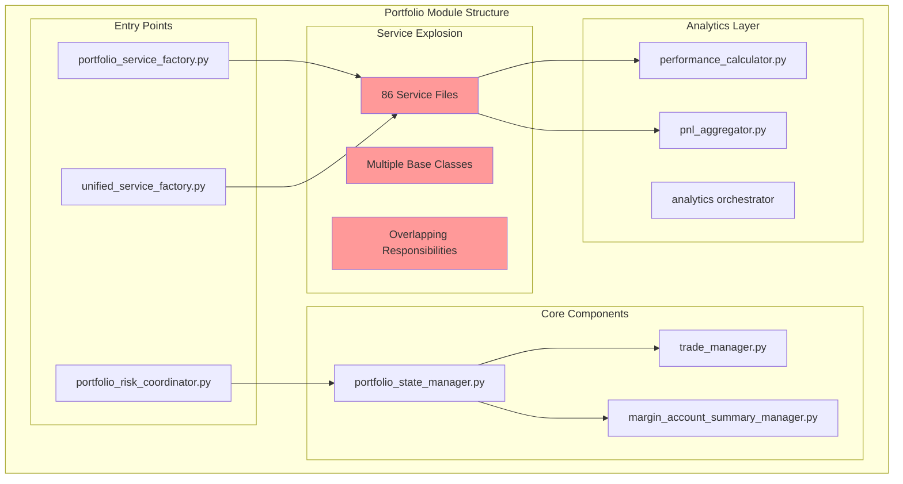

### Critical Findings

#### 1. Service Architecture Chaos

```python
# Found 3 different base service patterns:
# 1. portfolio/services/base/base_service.py
# 2. portfolio/services/core/base_service.py  
# 3. portfolio/base/typed_state_manager.py

# Each implements similar but incompatible patterns
```

#### 2. Duplicate Factory Patterns

```python
# portfolio/services/portfolio_service_factory.py
class PortfolioServiceFactory:
    """Factory for creating portfolio services."""
    
# portfolio/coordinators/unified_service_factory.py
class UnifiedServiceFactory:
    """Factory for creating unified services."""
    # Nearly identical implementation
```

#### 3. State Management Confusion

```python
# Multiple state management approaches:
# 1. portfolio/state/state_container.py
# 2. portfolio/state/async_state_container.py
# 3. portfolio/managers/portfolio_state_manager.py
# 4. portfolio/base/typed_state_manager.py
```

## Risk Module Analysis

### Architecture Overview

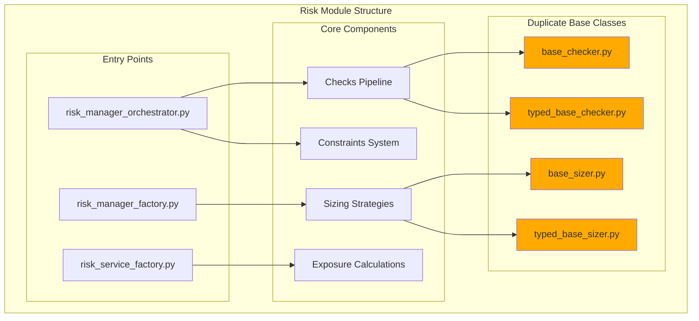

### Critical Findings

#### 1. Typed vs Untyped Base Classes

```python
# risk/checks/checkers/base_checker.py
class BaseChecker(ABC):
    """Base checker without typing."""

# risk/checks/checkers/typed_base_checker.py  
class TypedBaseChecker(BaseChecker, Generic[TInput, TOutput]):
    """Typed version of base checker."""
    
# Similar pattern in sizing strategies
```

#### 2. Incomplete Abstractions

```python
# risk/calculations/__init__.py - EMPTY
# risk/models/__init__.py - EMPTY
# Several empty module directories suggesting incomplete refactoring
```

## Business Logic Inconsistencies

### 1. Portfolio-Risk Integration Issues

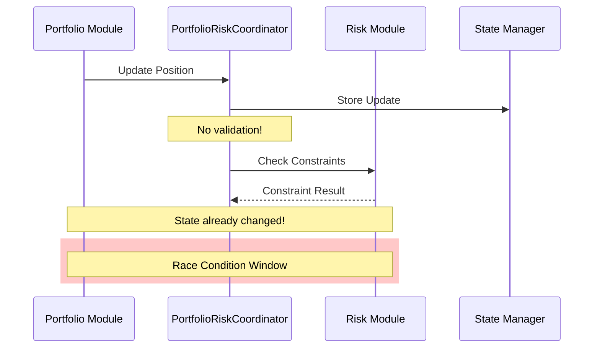

### 2. Circular Dependencies

```python
# portfolio/coordinators/portfolio_risk_coordinator.py imports from risk
# risk/orchestrator/risk_manager_orchestrator.py imports from portfolio
# Creating circular dependency risks
```

### 3. Service Boundary Violations

```python
# Found in portfolio/services/exchange_data_service.py:
class ExchangeDataService:
    """Service for fetching exchange data."""
    # This duplicates functionality in exchange API layer!
```

## Dead Code & Remnants

### 1. Old Refactoring Artifacts

```python
# portfolio/docs/hasattr_elimination_improvements.md
# Documents a refactoring that's partially complete

# Multiple TODO markers:
# "TODO: Remove after migration"
# "TODO: Deprecated - use TypedBaseChecker"
```

### 2. Unused Abstractions

```python
# portfolio/portfolio_types/ directory contains:
# - calculations.py
# - infrastructure.py  
# - models.py
# - protocols.py
# All defining types that are barely used in actual code
```

### 3. Migration Remnants

```python
# portfolio/config/MIGRATION_GUIDE.md exists but references old patterns
# risk/config/migration.py contains incomplete migration logic
```

## Module Wiring Analysis

### Current Wiring Complexity

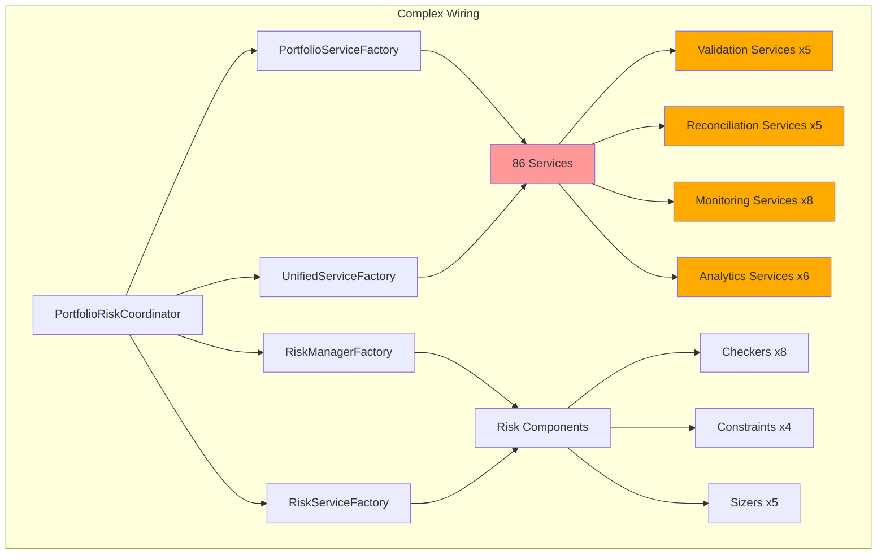

### Wiring Issues Found

1. **Multiple Factory Patterns**: 4 different factories with overlapping responsibilities
2. **Service Discovery**: No clear service registry or dependency injection
3. **Hidden Dependencies**: Services create their own dependencies internally
4. **Configuration Chaos**: Each service has its own config loading

## Git History Analysis

### Recent Refactoring Patterns

```bash
# Recent commits show Symbol refactoring:
ad604d43 Refactor tests to utilize Symbol architecture (#57)
54fda958 Refactor symbol handling to use Symbol type across the codebase (#56)

# But portfolio/risk modules still use old patterns!
```

### Age Analysis

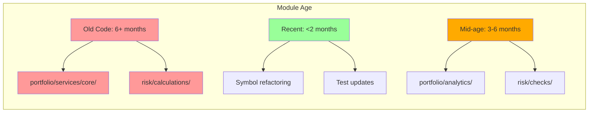

## System Reality vs Intent

### How It Should Work

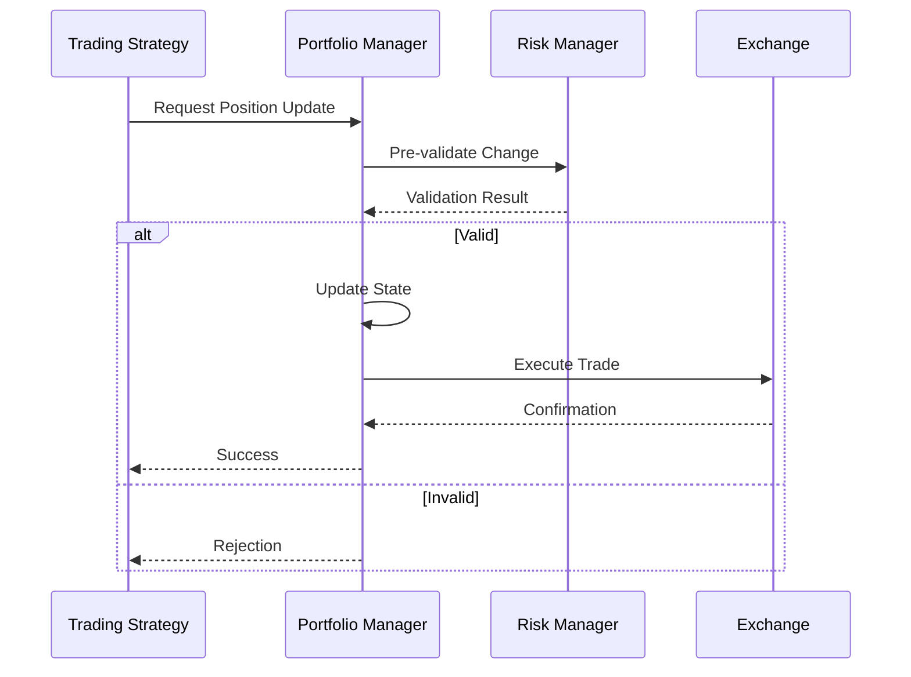

### How It Actually Works

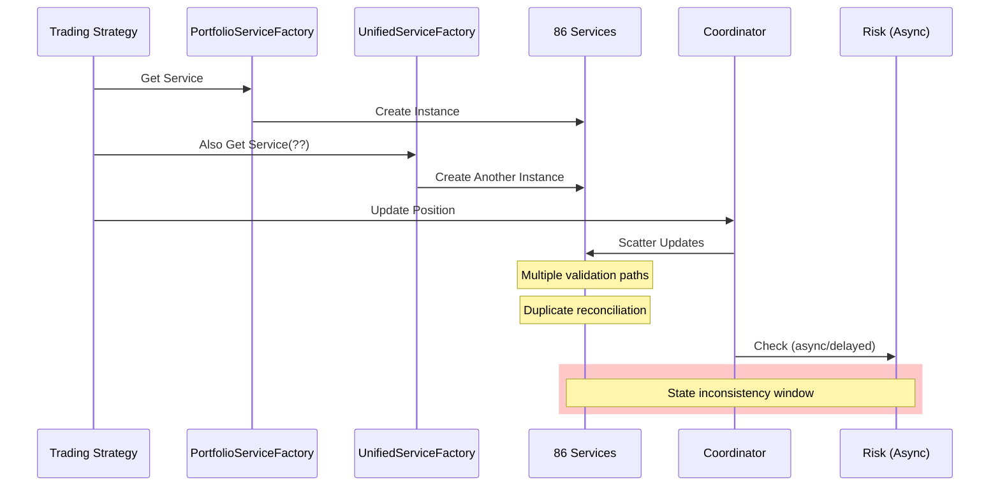

## Critical Issues Summary

### 1. Service Layer Explosion
- **86 service files** with unclear boundaries
- **Multiple factory patterns** creating confusion
- **Duplicate validation logic** across services

### 2. State Management Chaos
- **4 different state management patterns**
- **No clear transaction boundaries**
- **Race conditions** in portfolio-risk coordination

### 3. Incomplete Refactoring Debt
- **Typed vs untyped base classes** coexisting
- **Empty module directories** from incomplete moves
- **TODO markers** indicating unfinished work

### 4. Business Logic Duplication
- **Validation logic** duplicated 5+ times
- **Reconciliation logic** duplicated 5+ times
- **State update logic** scattered across managers

### 5. Module Integration Issues
- **Circular dependencies** between portfolio and risk
- **No clear API boundaries** between modules
- **Hidden cross-module dependencies**

## Proposed Refactoring Strategy

### Phase 1: Service Consolidation

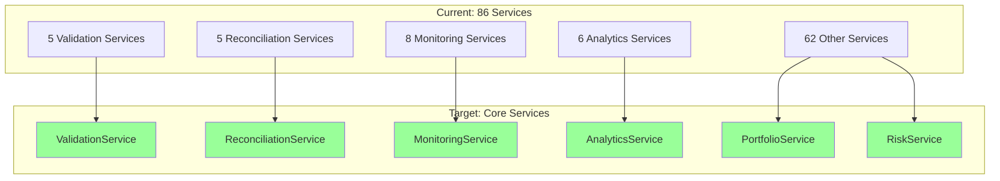

### Phase 2: State Management Unification

```python
# Single state management pattern:
class PortfolioState:
    """Unified portfolio state with transaction support."""
    
    def begin_transaction(self):
        """Start atomic update."""
    
    def commit(self):
        """Commit if all validations pass."""
        
    def rollback(self):
        """Rollback on validation failure."""
```

### Phase 3: Clear Module Boundaries

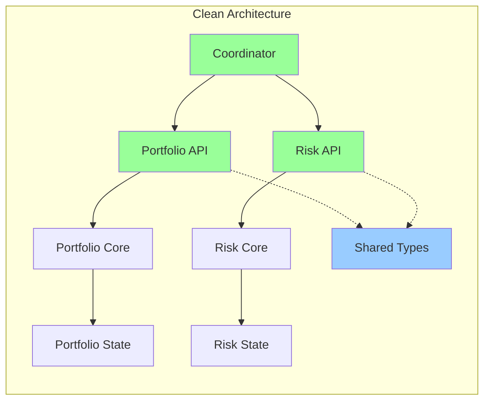

### Implementation Priority

1. **Week 1**: Consolidate validation services
2. **Week 2**: Unify state management 
3. **Week 3**: Fix portfolio-risk coordination
4. **Week 4**: Remove dead code and complete migrations
5. **Week 5**: Establish clear module boundaries
6. **Week 6**: Integration testing and documentation

## Recommendations

### Immediate Actions
1. **Stop creating new services** - use existing ones
2. **Complete typed base class migration** - remove untyped versions
3. **Fix portfolio-risk race conditions** - add proper transaction support
4. **Remove circular dependencies** - establish clear module APIs

### Long-term Improvements
1. **Implement service registry** for dependency injection
2. **Create domain events** for portfolio-risk communication
3. **Establish clear bounded contexts** per DDD principles
4. **Add integration tests** for cross-module workflows

### Success Metrics
- Reduce service count from 86 to ~15
- Eliminate all circular dependencies
- Achieve 100% transaction safety for state updates
- Remove all incomplete refactoring artifacts

## Additional Deep-Dive Findings

### Service Base Class Duplication Analysis

I found **3 different base service implementations** in the portfolio module alone:

1. **portfolio/services/base/base_service.py**:
   - Uses traditional ABC pattern
   - Implements health checks and lifecycle management
   - Has proper configuration validation with Pydantic
   - 206 lines of code

2. **portfolio/services/core/base_service.py**:
   - Uses Pydantic BaseModel with ServiceLifecycle protocol
   - Much simpler implementation (61 lines)
   - Different initialization pattern
   - Incompatible with the first implementation

3. **portfolio/base/typed_state_manager.py**:
   - Yet another base pattern for state management
   - Different abstraction level

### Typed vs Untyped Pattern Duplication

In the risk module, I found systematic duplication:

```python
# risk/checks/checkers/base_checker.py
class BaseChecker(ABC):
    """Abstract base class for all checkers."""
    # 175 lines of untyped implementation

# risk/checks/checkers/typed_base_checker.py  
class TypedBaseChecker[ResultT: CheckResult](ABC):
    """Base checker with AppSettings access."""
    # 147 lines with generic types
```

The same pattern repeats for sizing strategies:
- `base_sizer.py` vs `typed_base_sizer.py`

### Circular Dependency Evidence

Found bidirectional imports between portfolio and risk:

**Risk → Portfolio imports**:
- `risk/sizing/strategies/production_kelly_sizer.py` imports `portfolio.portfolio_types.models`
- `risk/exposure/*.py` imports various portfolio exceptions and services

**Portfolio → Risk imports**:
- `portfolio/coordinators/unified_service_factory.py` imports `risk.services.risk_service_factory`
- `portfolio/coordinators/portfolio_risk_coordinator.py` imports `risk.services.risk_service_factory`

### Integration Anti-Patterns

The `PortfolioRiskCoordinator` shows several concerning patterns:

1. **Synchronous state updates with async risk checks**:
   ```python
   # State updated immediately
   portfolio_state = await self.portfolio_manager.get_portfolio_summary()
   
   # Risk calculated after - race condition window!
   risk_assessment = await self._calculate_comprehensive_risk(portfolio_state)
   ```

2. **NotImplementedError in production code**:
   ```python
   def execute_trade(...):
       raise NotImplementedError(
           "Trade execution should be handled by PortfolioAwareTradeExecutor"
       )
   ```

3. **TODO comments in critical paths**:
   ```python
   account_value=Decimal(0),  # TODO: Calculate from balances
   # TODO: Implement proper metric calculation
   ```

### Git History Insights

Recent commits show active refactoring of the Symbol system (commits #54-#57), but the portfolio and risk modules haven't been updated to fully utilize the new architecture. This explains the compatibility layers and mixed usage patterns.

The portfolio module underwent major refactoring 3 months ago (commit #51: "Refactor and enhance portfolio management system with modular architecture"), which likely introduced the service explosion problem.

## Complete System Architecture Diagram

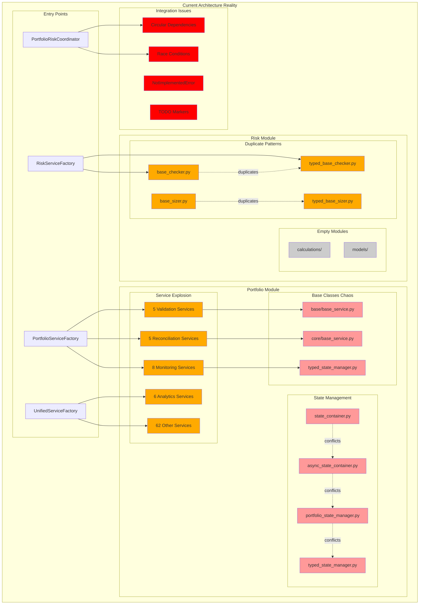

## Data Flow Issues

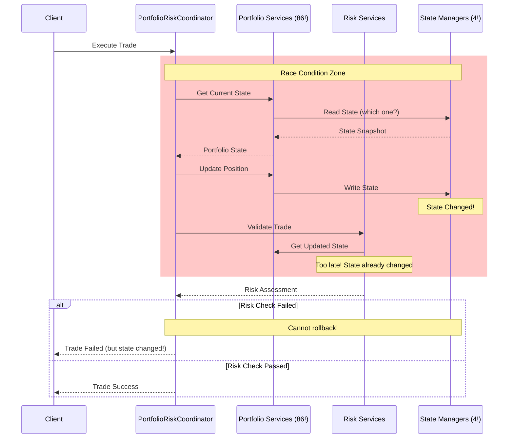

## Comprehensive Refactoring Proposal

### 1. Immediate Critical Fixes (Week 1)

#### Fix Race Conditions with Transactional Pattern

```python
# New transactional state manager
class TransactionalPortfolioState:
    """Portfolio state with ACID guarantees."""
    
    async def begin_transaction(self) -> Transaction:
        """Start a new transaction."""
        return Transaction(self._current_state.copy())
    
    async def commit(self, transaction: Transaction) -> None:
        """Commit if all validations pass."""
        async with self._lock:
            # Validate transaction integrity
            if not await self._validate_transaction(transaction):
                raise TransactionValidationError()
            
            # Apply changes atomically
            self._current_state = transaction.get_new_state()
            await self._persist_state()
    
    async def rollback(self, transaction: Transaction) -> None:
        """Rollback transaction."""
        # Simply discard the transaction
        pass
```

#### Eliminate Circular Dependencies

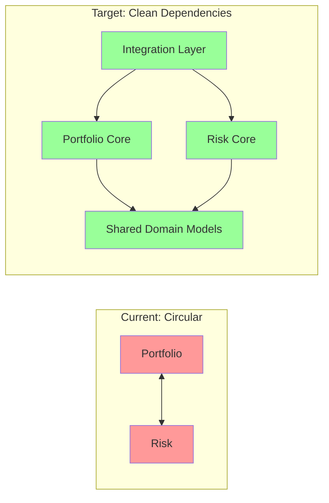

### 2. Service Consolidation Plan (Weeks 2-3)

#### From 86 Services to 15 Core Services

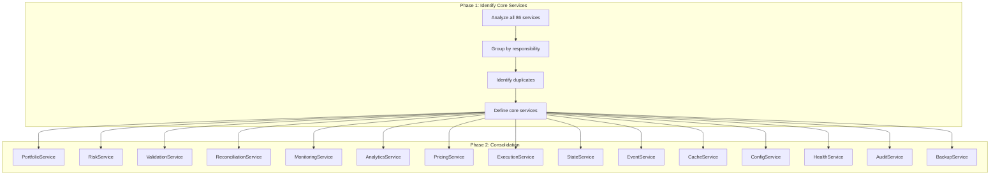

#### Service Consolidation Strategy

```python
# Example: Consolidate 5 validation services into 1
class ValidationService:
    """Unified validation service."""
    
    def __init__(self, validators: dict[str, Validator]):
        self._validators = validators
    
    async def validate_trade(self, trade: Trade) -> ValidationResult:
        """Validate trade using all relevant validators."""
        return await self._validators['trade'].validate(trade)
    
    async def validate_position(self, position: Position) -> ValidationResult:
        """Validate position constraints."""
        return await self._validators['position'].validate(position)
    
    async def validate_portfolio(self, portfolio: Portfolio) -> ValidationResult:
        """Validate portfolio constraints."""
        return await self._validators['portfolio'].validate(portfolio)
```

### 3. Unified Base Class Architecture (Week 4)

#### Single Base Service Pattern

```python
# One base service to rule them all
from abc import ABC, abstractmethod
from typing import Generic, TypeVar

TConfig = TypeVar('TConfig', bound=BaseServiceConfig)
TState = TypeVar('TState', bound=BaseServiceState)

class BaseService(ABC, Generic[TConfig, TState]):
    """Unified base service for all modules."""
    
    def __init__(self, config: TConfig):
        self.config = config
        self.state: TState = self._create_initial_state()
        self._initialized = False
    
    @abstractmethod
    def _create_initial_state(self) -> TState:
        """Create initial service state."""
        ...
    
    @abstractmethod
    async def _initialize(self) -> None:
        """Service-specific initialization."""
        ...
    
    @abstractmethod
    async def _shutdown(self) -> None:
        """Service-specific shutdown."""
        ...
    
    async def start(self) -> None:
        """Start the service."""
        if self._initialized:
            return
        await self._initialize()
        self._initialized = True
    
    async def stop(self) -> None:
        """Stop the service."""
        if not self._initialized:
            return
        await self._shutdown()
        self._initialized = False
```

### 4. Clean Module Boundaries (Week 5)

#### Domain-Driven Design Implementation

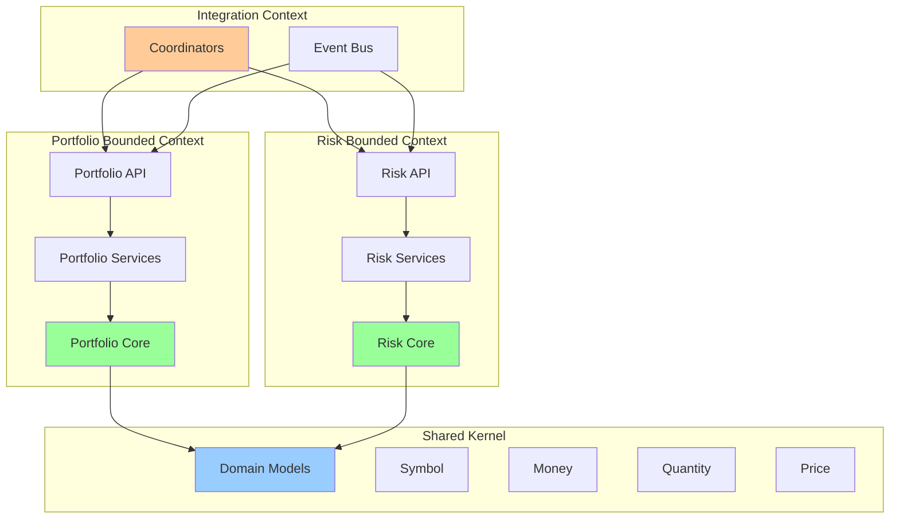

### 5. Event-Driven Communication (Week 6)

#### Replace Direct Dependencies with Events

```python
# Domain events for decoupled communication
class PortfolioEvent(BaseModel):
    """Base portfolio event."""
    event_id: str
    timestamp: datetime
    portfolio_id: str

class PositionUpdatedEvent(PortfolioEvent):
    """Position was updated."""
    symbol: Symbol
    old_quantity: Decimal
    new_quantity: Decimal
    
class RiskLimitBreachedEvent(PortfolioEvent):
    """Risk limit was breached."""
    limit_type: str
    current_value: Decimal
    limit_value: Decimal

# Event-driven coordinator
class EventDrivenCoordinator:
    """Coordinator using events instead of direct calls."""
    
    async def handle_trade_request(self, request: TradeRequest):
        # Start transaction
        transaction = await self.portfolio.begin_transaction()
        
        try:
            # Update position in transaction
            await transaction.update_position(request.symbol, request.quantity)
            
            # Publish event for risk assessment
            event = PositionUpdatedEvent(...)
            await self.event_bus.publish(event)
            
            # Wait for risk response with timeout
            risk_result = await self.event_bus.wait_for_response(
                event.event_id, 
                timeout=5.0
            )
            
            if risk_result.approved:
                await self.portfolio.commit(transaction)
            else:
                await self.portfolio.rollback(transaction)
                
        except Exception as e:
            await self.portfolio.rollback(transaction)
            raise
```

### 6. Migration Strategy

#### Phase 1: Stop the Bleeding (Week 1)
- Freeze new service creation
- Document all existing services
- Fix critical race conditions
- Add transaction support

#### Phase 2: Consolidate Services (Weeks 2-3)
- Group services by responsibility
- Create unified interfaces
- Implement adapters for backward compatibility
- Migrate one service group at a time

#### Phase 3: Clean Architecture (Weeks 4-5)
- Implement proper bounded contexts
- Remove circular dependencies
- Establish clear module APIs
- Add integration tests

#### Phase 4: Event-Driven Refactor (Week 6)
- Implement event bus
- Convert direct calls to events
- Add event sourcing for audit trail
- Performance testing

### 7. Success Metrics

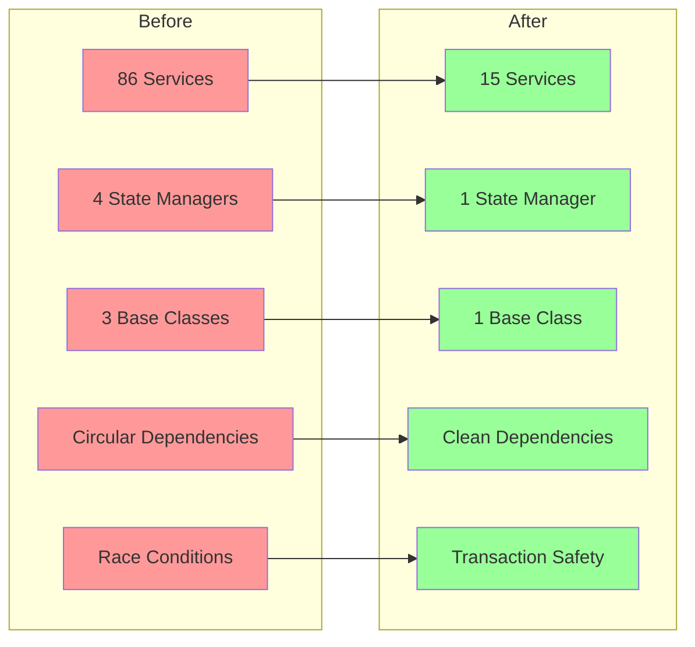

## Conclusion

The portfolio and risk modules suffer from severe architectural debt resulting from incomplete refactoring cycles. The most critical issues are:

1. **Race conditions** in portfolio-risk coordination
2. **Service explosion** with 86 services and unclear boundaries
3. **Multiple incompatible base classes** and state managers
4. **Circular dependencies** between modules
5. **Incomplete refactoring artifacts** (TODOs, NotImplementedError)

The proposed refactoring plan addresses these issues systematically, starting with critical fixes and progressing to architectural improvements. The key is to implement proper transaction support, consolidate services, and establish clear module boundaries using domain-driven design principles.