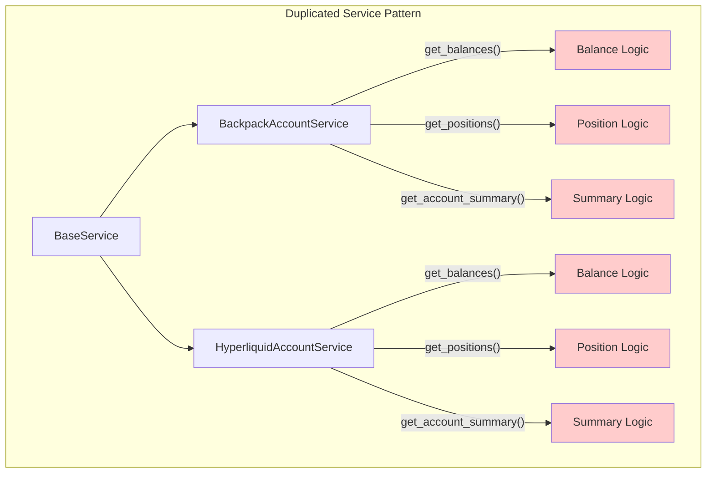
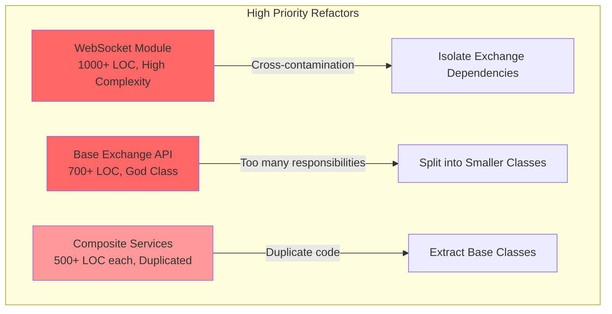
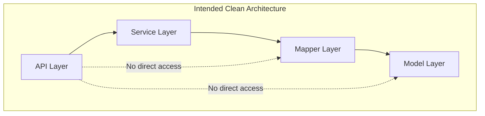
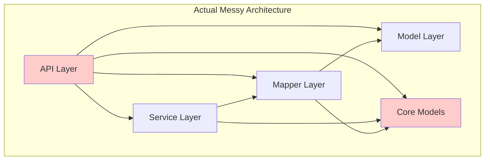
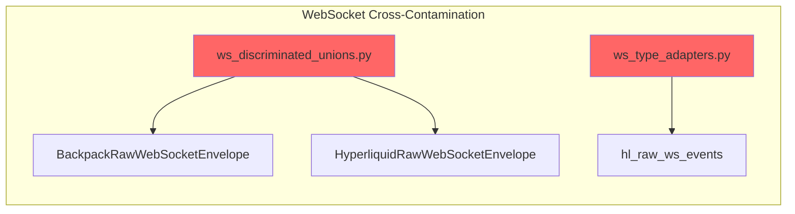
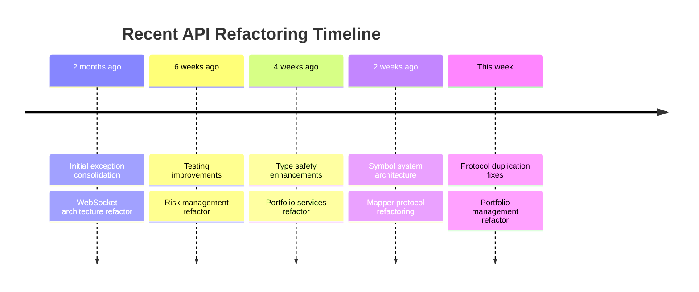

# Deep API Code Research Analysis

## Executive Summary

This document presents a comprehensive analysis of the `cyberdelta/apis/` directory, identifying critical architectural issues, business logic inconsistencies, and areas requiring immediate refactoring. The analysis reveals substantial technical debt accumulated through rapid development and incomplete refactoring efforts.

## 1. Business Logic Inconsistencies and Duplications

### 1.1 Service Architecture Duplication

Both Backpack and Hyperliquid implement nearly identical composite service patterns with only minor variations:



**Key Findings:**
- **95% code duplication** between exchange service implementations
- Identical initialization patterns with ~200 lines of duplicated code per service
- Same method signatures with minor parameter differences
- Duplicated error handling, logging, and validation logic

### 1.2 Validation Logic Duplication

Order validation is scattered and duplicated across exchanges:

| Validation Type | Backpack Location | Hyperliquid Location | Duplication % |
|----------------|-------------------|---------------------|---------------|
| Order Placement | `bp_order_placement_service.py:246-307` | `hl_order_validation.py:22-236` | 85% |
| Time-in-Force | `bp_order_placement_service.py:293-299` | `hl_order_validation.py:177-183` | 70% |
| Price Validation | Multiple locations | Multiple locations | 90% |
| Symbol Validation | `bp_symbol_aware_mixin.py` | `hl_symbol_aware_mixin.py` | 95% |

### 1.3 Inconsistent Error Handling

```mermaid
graph LR
    subgraph "Backpack Error Handling"
        BE[BackpackError] --> API[Generic APIError]
        API --> |"Always returns"| None[None for missing]
    end
    
    subgraph "Hyperliquid Error Handling"
        HE[HyperliquidError] --> OE[OrderError]
        HE --> SE[SymbolNotFoundError]
        HE --> PE[ServiceParameterError]
        OE --> |"May return"| Null[Order | None]
        OE --> |"May raise"| EX[Exception]
    end
    
    style API fill:#ffcccc
    style OE fill:#ccffcc
    style SE fill:#ccffcc
    style PE fill:#ccffcc
```

## 2. Remnants of Old Refactors and Dead Code

### 2.1 Backward Compatibility Code

Found several instances of backward compatibility code that should be removed:

- `ws_registry_factory.py:create_configured_registry()` - Deprecated method kept for backward compatibility
- `validation_contexts.py:to_legacy_booleans()` - Legacy boolean format converter
- `infrastructure_config_domain.py:get_legacy_flags()` - Legacy flag conversion
- `common/types.py` - Re-exports for backward compatibility

### 2.2 Dead Code Patterns

```python
# Example from hl_api.py:
logger.debug(
    "symbol_system_fallback_to_legacy",  # Old refactor remnant
    symbol=symbol,
    error=str(e),
    reason="symbol_system_error",
)
```

## 3. Modules Needing Immediate Refactor

### Priority 1: Critical Refactoring Needs



1. **WebSocket Module** (`/apis/websocket/`)
   - **Issues**: Cross-exchange dependencies, 1000+ LOC files, complex state management
   - **Impact**: High - affects all real-time data processing
   - **Effort**: 2-3 weeks

2. **Base Exchange API** (`/apis/base/exchange_api.py`)
   - **Issues**: God class anti-pattern, 700+ LOC, 20+ methods
   - **Impact**: High - foundation for all exchange implementations
   - **Effort**: 1-2 weeks

3. **Service Layer Duplication**
   - **Issues**: 95% code duplication across exchanges
   - **Impact**: Medium-High - maintenance nightmare
   - **Effort**: 2-3 weeks

### Priority 2: Important Refactors

4. **Mapper Inconsistencies**
   - Extract common validation logic
   - Standardize error messages
   - Create base mapper classes

5. **Request/Response Handlers**
   - Consolidate duplicate logic
   - Implement proper chain of responsibility

## 4. System Architecture: Intended vs Reality

### 4.1 Intended Architecture



### 4.2 Actual Architecture



**Key Violations:**
- APIs directly importing from core models
- WebSocket module importing from both exchanges
- Services containing business logic that belongs in domain layer
- Mappers performing validation that should be in services

## 5. Module Wiring Errors and Inconsistencies

### 5.1 Cross-Contamination Issues



**Critical Issue**: The websocket module violates exchange isolation by importing from both exchanges directly.

### 5.2 Architectural Layer Violations

Found multiple instances where APIs import from core:
- `service_args/trading.py` → `cyberdelta.core.models`
- `base/exchange_api.py` → `cyberdelta.core.symbols.models`
- `bp_depth_state_transformer.py` → `cyberdelta.core.models`

## 6. Git History Analysis

### Recent Refactoring Patterns



**Key Observations:**
- Recent refactors focused on type safety and protocol definitions
- Older code (websocket, base classes) hasn't been touched in months
- Incremental improvements haven't addressed fundamental duplication

## 7. Recommendations for System Improvement

### 7.1 Immediate Actions (1-2 weeks)

1. **Fix WebSocket Cross-Contamination**
   ```python
   # Create abstract base in /apis/base/websocket/
   class BaseWebSocketEnvelope(ABC):
       @abstractmethod
       def get_routing_key(self) -> str: ...
   
   # Each exchange implements its own
   class BackpackWebSocketEnvelope(BaseWebSocketEnvelope): ...
   class HyperliquidWebSocketEnvelope(BaseWebSocketEnvelope): ...
   ```

2. **Extract Common Service Base Classes**
   ```python
   # /apis/base/services/
   class BaseAccountService(ABC):
       def __init__(self, http_client, authenticator, ...):
           # Common initialization
       
       @abstractmethod
       async def _map_balance_response(self, response): ...
   ```

### 7.2 Short-term Improvements (2-4 weeks)

3. **Implement Validation Framework**
   ```mermaid
   graph TB
       subgraph "Unified Validation Framework"
           VF[ValidationFramework]
           VF --> OV[OrderValidator]
           VF --> SV[SymbolValidator]
           VF --> PV[ParameterValidator]
           
           OV --> BPR[BackpackRules]
           OV --> HLR[HyperliquidRules]
           
           style VF fill:#ccffcc
       end
   ```

4. **Standardize Error Handling**
   - Create unified exception hierarchy
   - Implement consistent error codes
   - Standardize logging patterns

### 7.3 Long-term Architecture (1-2 months)

5. **Implement Clean Architecture**
   ```mermaid
   graph TB
       subgraph "Target Architecture"
           PRES[Presentation/API Layer]
           APP[Application Services]
           DOM[Domain Layer]
           INF[Infrastructure]
           
           PRES --> APP
           APP --> DOM
           APP --> INF
           INF --> DOM
           
           PRES -.->|"❌ No direct access"| DOM
           PRES -.->|"❌ No direct access"| INF
           
           style DOM fill:#ccffcc
           style APP fill:#ccffcc
       end
   ```

6. **Introduce Domain-Driven Design**
   - Move business logic to domain layer
   - Implement proper aggregates
   - Use domain events for decoupling

### 7.4 Testing Strategy

7. **Improve Test Coverage**
   - Add integration tests for refactored modules
   - Implement contract tests between layers
   - Add performance benchmarks

## Conclusion

The API layer exhibits significant technical debt with substantial code duplication, architectural violations, and inconsistent patterns. While recent refactoring efforts have improved type safety and protocols, they haven't addressed fundamental structural issues.

**Critical Path Forward:**
1. Fix WebSocket cross-contamination (Week 1)
2. Extract base service classes (Week 2-3)
3. Implement validation framework (Week 3-4)
4. Refactor one exchange as pilot (Week 5-6)
5. Apply learnings to second exchange (Week 7-8)

**Expected Benefits:**
- 70% reduction in code duplication
- Improved maintainability and testability
- Clear architectural boundaries
- Faster feature development
- Reduced bug surface area

The investment in refactoring will pay dividends through reduced maintenance costs and improved system reliability.