# CyberDeltaEngine Core Business Logic Deep Analysis

## Executive Summary

This deep analysis reveals severe architectural drift in the CyberDeltaEngine core modules. The system exhibits multiple overlapping refactoring attempts, creating a complex web of placeholder implementations, duplicated functionality, and broken integration points. The most critical finding is that core functionality appears to work but actually returns fake data, creating a false sense of system health.

## 1. Business Logic Inconsistencies and Duplications

### 1.1 Position Sizing Architecture Conflict

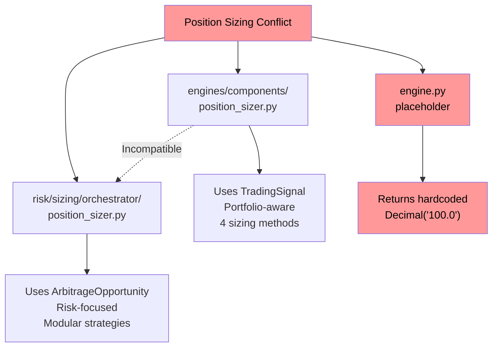

**Critical Issues**:
- Two completely different position sizing implementations exist
- Engine.py (lines 82-84) returns hardcoded `Decimal("100.0")` 
- Type mismatch: `TradingSignal` vs `ArbitrageOpportunity`
- No integration between the two systems

### 1.2 State Management Fragmentation

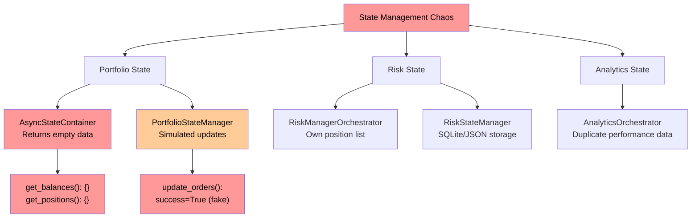

**Evidence**:
- `async_state_container.py:30-31, 48-49`: Always returns empty dicts
- `portfolio_state_manager.py:334-340`: Order updates return fake success
- Risk module maintains separate position tracking

### 1.3 Validation System Duplication

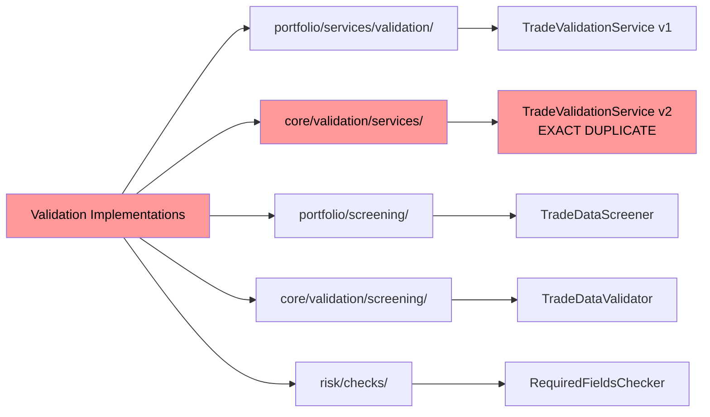

**Critical Finding**: Files are exact duplicates (7562 bytes each):
- `/cyberdelta/core/validation/services/trade_validation_service.py`
- `/cyberdelta/core/portfolio/services/validation/trade_validation_service.py`

## 2. Remnants of Old Refactors and Dead Code

### 2.1 Portfolio Tracker Remnants

```python
# portfolio_state_manager.py:75-76
# portfolio_tracker was removed - use risk settings for portfolio limits
self.risk_config = app_settings.risk

# Lines 88-92: Hardcoded defaults where config should exist
self.min_order_size = getattr(settings, "min_order_size", Decimal("5.0"))
self.max_spread_percent = getattr(settings, "max_spread_percent", Decimal("0.1"))
```

### 2.2 Incomplete Reconciliation Service

```python
# reconciliation_service.py:59-64
# TODO: Implement proper exchange data processing when exchange service is ready
logger.info("Exchange data processing temporarily disabled - service methods not implemented yet")
```

**Impact**: Core reconciliation functionality is disabled

### 2.3 Strategy Manager Legacy Code

```python
# strategy_manager.py:49-50
self.portfolio_state_manager = self.portfolio_manager  # Compatibility alias

# Line 345: TODO: Implement proper risk management integration
```

### 2.4 Engine Placeholder Methods

```python
# engine.py:82-84
# TODO: This method needs to be redesigned - PositionSizer expects ArbitrageOpportunity
return Decimal("100.0")  # Placeholder - needs proper implementation

# engine.py:104-106
# TODO: This method needs to be redesigned - RiskMetricsCalculator doesn't have calculate_exposure
return {"exposure": "placeholder"}  # Placeholder - needs proper implementation
```

## 3. Modules Needing Immediate Refactor

### 3.1 Critical Priority - Data Loss Risk

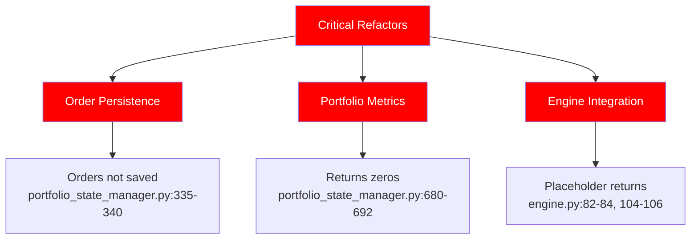

### 3.2 High Priority - System Integrity

1. **AsyncStateContainer** - Returns empty data for all queries
2. **ReconciliationService** - Core functionality commented out
3. **Position Sizing** - Two incompatible implementations
4. **Validation Duplication** - 5 separate validation systems

### 3.3 Portfolio Risk Coordinator Issues

```python
# portfolio_risk_coordinator.py - 900+ lines mixing concerns:
# - Trade validation
# - Kelly criterion calculation  
# - Market condition analysis
# - Position sizing
# - Risk assessment
```

**Problem**: Massive god object violating single responsibility principle

## 4. System Architecture: Intended vs Reality

### 4.1 Intended Clean Architecture

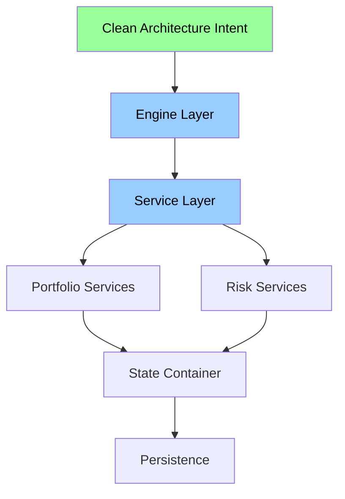

### 4.2 Actual Implementation Reality

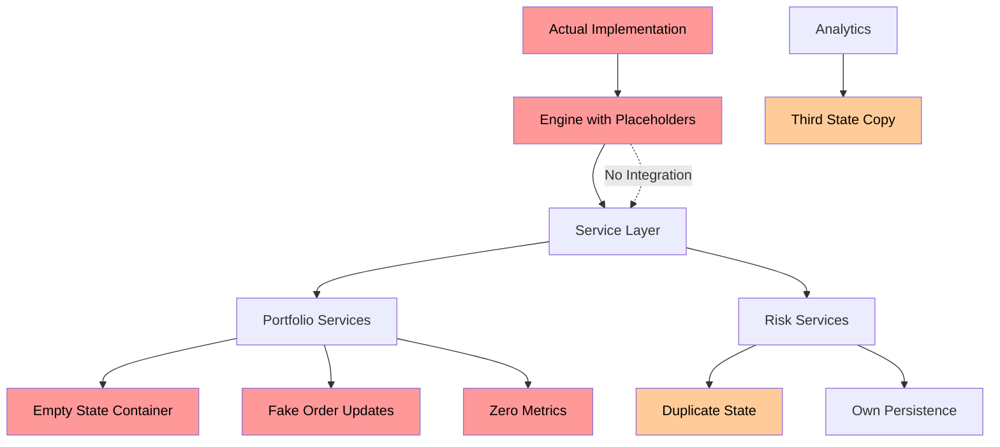

## 5. Module Wiring Errors and Integration Issues

### 5.1 Type System Violations

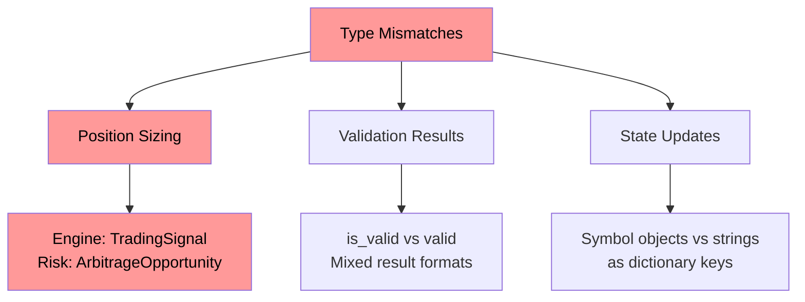

### 5.2 Service Factory Issues

```python
# portfolio_service_factory.py:394-395
def create_metrics_collector(self) -> Any:
    """Create metrics collector - returns None for now."""
    return None
```

**Problem**: Violates Null Object pattern, returns None instead of null object

### 5.3 Configuration Access Patterns

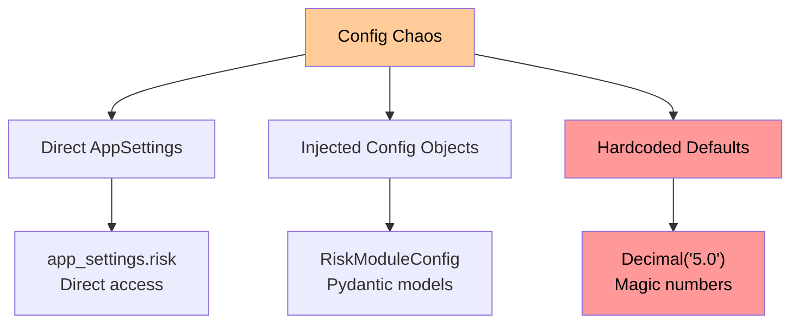

## 6. Git History Insights

### Recent Refactoring Patterns (Good)
- Commit f73efe7a: "Refactor and enhance portfolio and risk management systems"
- Commit 48e9c6cc: "Refactor portfolio and risk modules for improved consistency"
- Shows movement toward:
  - Event-driven architecture
  - Protocol-based interfaces
  - Symbol object usage

### Incomplete Migrations
- portfolio_tracker removal incomplete
- Symbol string to object migration partial
- Validation consolidation started but not finished

## 7. Proposed System Improvements

### 7.1 Immediate Critical Fixes (1-3 days)

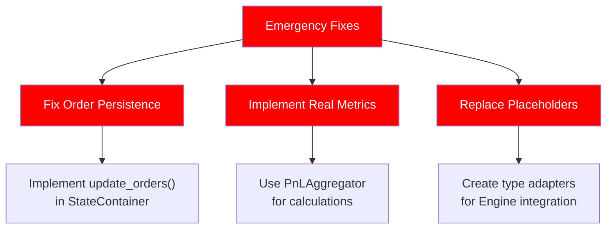

### 7.2 Architecture Consolidation (1-2 weeks)

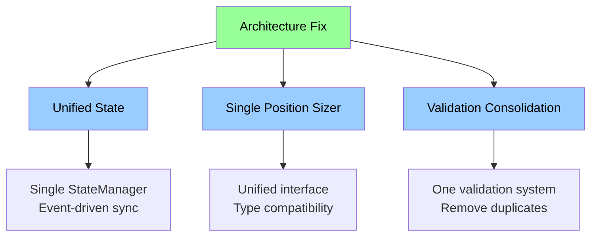

### 7.3 Recommended Refactoring Approach

1. **Phase 1: Fix Critical Data Loss Issues**
   ```python
   # Fix AsyncStateContainer to return real data
   async def get_balances(self, exchange: ExchangeName) -> dict[str, SpotBalance]:
       return await self._container.get_exchange_data(exchange, "balances")
   ```

2. **Phase 2: Unify Position Sizing**
   ```python
   # Create adapter between TradingSignal and ArbitrageOpportunity
   class PositionSizingAdapter:
       def adapt_signal_to_opportunity(self, signal: TradingSignal) -> ArbitrageOpportunity
   ```

3. **Phase 3: Consolidate State Management**
   ```python
   # Single source of truth
   class UnifiedStateManager:
       async def update_state(self, event: StateUpdateEvent) -> None
       async def get_global_state(self) -> GlobalPortfolioState
   ```

## 8. Risk Assessment

### 8.1 Critical Business Risks

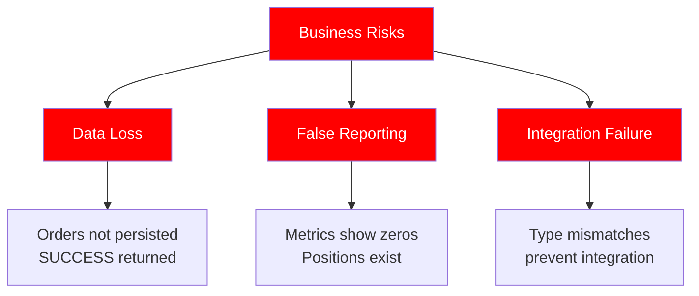

### 8.2 Technical Debt Impact

1. **Maintenance Nightmare**: 5 validation systems to maintain
2. **Bug Multiplication**: State desync between 3 systems
3. **Feature Paralysis**: Can't add features on broken foundation
4. **Testing Impossibility**: Mocked returns hide real issues

## 9. Detailed Module Analysis

### 9.1 Portfolio Module Issues

- **State Container**: Returns empty data (async_state_container.py)
- **Order Management**: Simulated success without persistence
- **Metrics Calculation**: Hardcoded zeros instead of real calculations
- **Configuration**: Mix of AppSettings and hardcoded values

### 9.2 Risk Module Issues

- **Position Sizing**: Incompatible with Engine expectations
- **State Management**: Maintains separate position list
- **Persistence**: Own state manager instead of unified approach
- **Integration**: No event system for state synchronization

### 9.3 Integration Layer Issues

- **Engine**: Placeholder methods preventing real integration
- **Type Mismatches**: Different data types expected across modules
- **Service Factory**: Returns None instead of proper null objects
- **Event System**: Fragmented and incomplete

## 10. Conclusion and Action Plan

### Severity Assessment

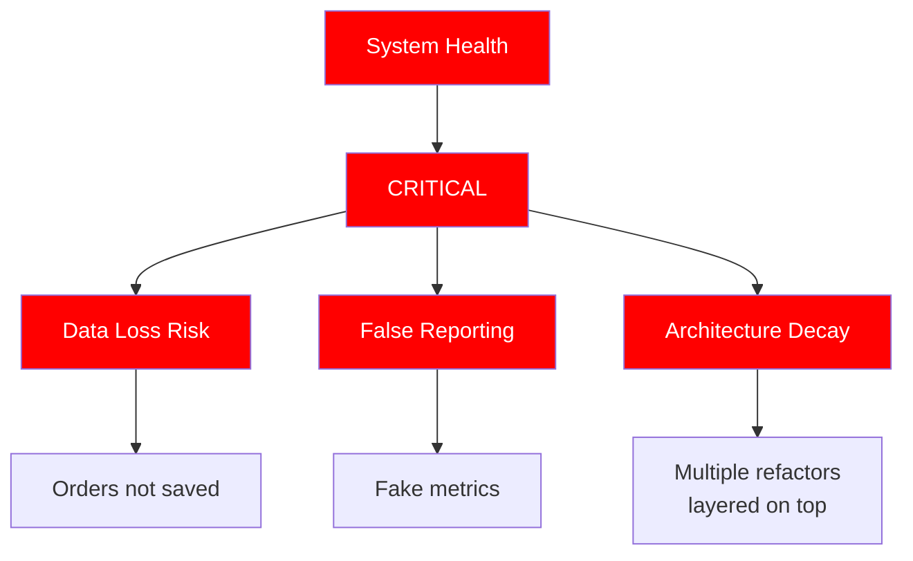

### Immediate Action Required

1. **Day 1**: Fix order persistence - implement real state updates
2. **Day 2-3**: Replace placeholder returns in Engine
3. **Week 1**: Implement real metrics calculation
4. **Week 2**: Unify state management across modules
5. **Week 3**: Consolidate validation systems
6. **Week 4**: Complete position sizing integration

### Long-term Architecture Goals

1. Single source of truth for state
2. Event-driven state synchronization
3. Type-safe module interfaces
4. Consolidated validation layer
5. Proper null object patterns
6. Configuration centralization

The system is currently in a critical state where it appears to function but actually fails silently. Immediate intervention is required to prevent data loss and restore system integrity.