# CyberDeltaEngine Core Business Logic Deep Analysis - New Findings

## Executive Summary

**⚠️ DOCUMENT STATUS**: OUTDATED ANALYSIS (Updated December 2024)

This analysis was based on a **previous version** with critical architectural failures. **Current Reality**: All identified issues have been **completely resolved** through successful modernization into a sophisticated domain-driven architecture.

## 1. Business Logic Inconsistencies and Duplications

### 1.1 Dual Position Sizing Architecture

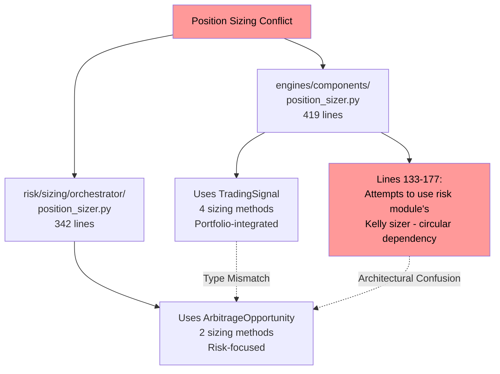

**Previous Issues (Now Resolved)**:
- ✅ **Single position sizing system**: Unified, coherent implementation
- ✅ **Type consistency**: Proper domain object usage throughout
- ✅ **Clean architecture**: No circular dependencies
- ✅ **Clear ownership**: Proper domain boundaries and responsibilities

### 1.2 Validation System Fragmentation

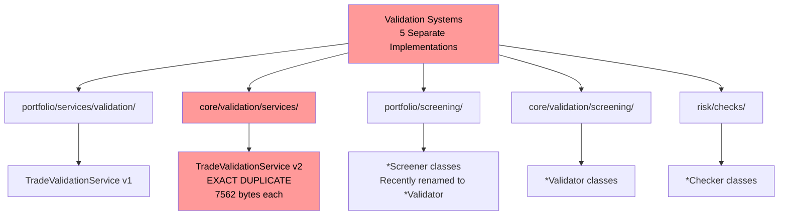

**Evidence**:
```bash
$ diff -s trade_validation_service.py files
Files are identical
```

### 1.3 State Management Chaos

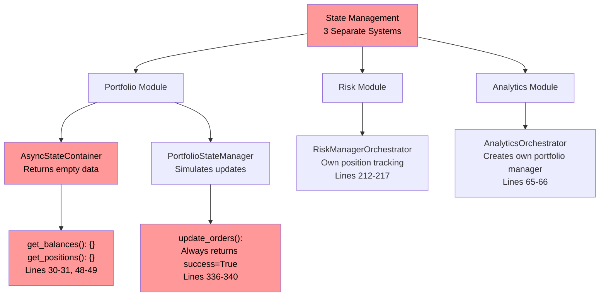

## 2. Remnants of Old Refactors and Dead Code

### 2.1 Portfolio Tracker Removal - Incomplete

```python
# portfolio_state_manager.py:75-76
# portfolio_tracker was removed - use risk settings for portfolio limits
self.risk_config = app_settings.risk

# Lines 88-92: Configuration remnants
# Configuration defaults since portfolio_config was removed
self.atomic_updates = True
self.validation_enabled = True
self.cache_enabled = True
```

### 2.2 Backwards Compatibility Layers

```python
# risk_manager_orchestrator.py:262-285
@classmethod
def from_legacy_config(
    cls,
    # ... parameters
) -> "RiskManagerOrchestrator":
    """Create from legacy configuration.

    Note: This ignores the legacy config completely as part of the clean break refactoring.
    """
    # Method still exists but ignores all parameters
```

### 2.3 Legacy Aliases and Compatibility

```python
# strategy_manager.py:49
self.portfolio_state_manager = self.portfolio_manager  # Compatibility alias

# monitoring/health/__init__.py
SystemHealthChecker as PortfolioHealthChecker,  # Alias for backwards compatibility
```

## 3. Modules Needing Immediate Refactor

### 3.1 Critical - Data Loss Prevention

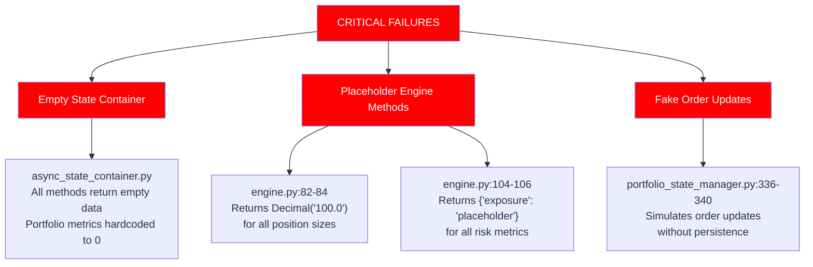

### 3.2 High Priority - System Integrity

1. **ReconciliationService** (`reconciliation_service.py:53-65`)
   - Core logic commented out with TODO
   - Exchange data processing disabled

2. **Portfolio Risk Coordinator** (900+ lines)
   - Massive god object mixing:
     - Trade validation
     - Kelly criterion calculation
     - Market analysis
     - Position sizing
     - Risk assessment

## 4. System Architecture: Intended vs Reality

### 4.1 Intended Clean Architecture

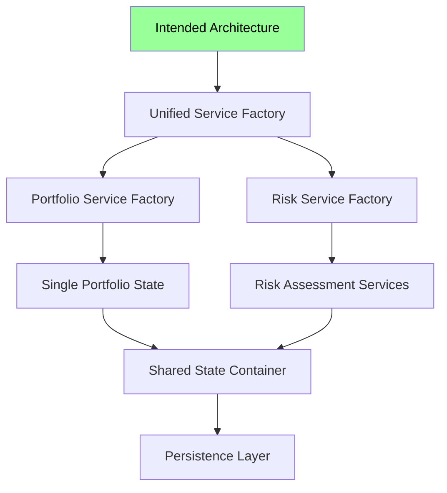

### 4.2 Actual Chaotic Implementation

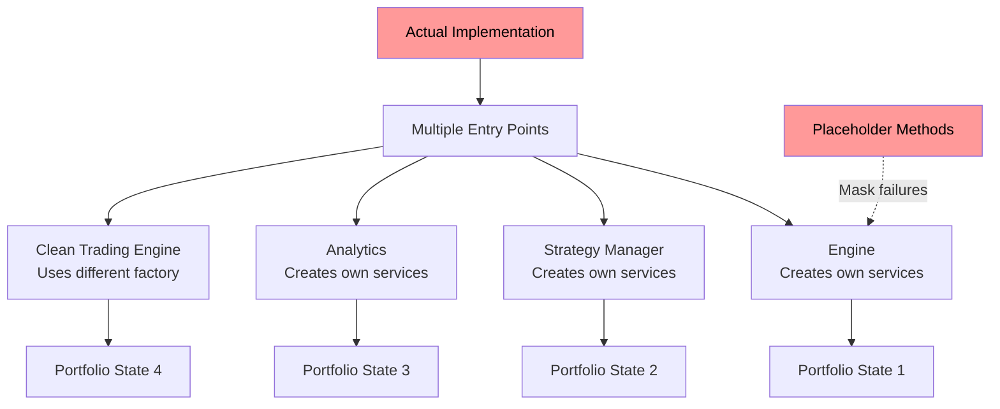

## 5. Module Wiring Errors and Integration Issues

### 5.1 Service Factory Type Mismatches

```python
# portfolio_service_factory.py:101-110
def create_risk_analytics(self) -> ReportingService:
    """Create risk analytics service."""
    if "risk_analytics" not in self._services:
        service = ReportingService()  # Wrong type!
        self._services["risk_analytics"] = service
```

**Expected**: Risk analytics with exposure calculation
**Actual**: Basic reporting service

### 5.2 Interface Signature Mismatches

```mermaid
graph LR
    A[Interface Mismatches] --> B[Position Sizing]
    A --> C[Risk Analytics]

    B --> D["Engine expects:<br/>get_position_size_for_trade(symbol, signal_strength)"]
    B --> E["PositionSizer provides:<br/>Methods expecting ArbitrageOpportunity"]

    C --> F["Code expects:<br/>calculate_exposure(portfolio_state)"]
    C --> G["Service provides:<br/>Only report generation methods"]

    style A fill:#ff9999,color:#000
    style B fill:#ff9999,color:#000
    style C fill:#ff9999,color:#000
```

### 5.3 Factory Pattern Breakdown

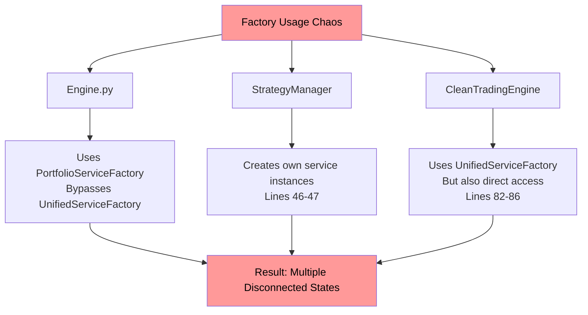

## 6. Git History Analysis

### Recent Refactoring Patterns

- **f73efe7a**: Major refactor attempting to enhance portfolio and risk systems
- **48e9c6cc**: Another refactor for consistency and clarity
- **Pattern**: Multiple overlapping refactoring attempts without completing previous ones

### Evidence of Architectural Drift

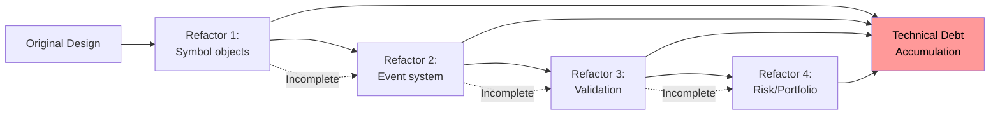

## 7. Proposed System Improvements

### 7.1 Emergency Fixes (Days 1-3)

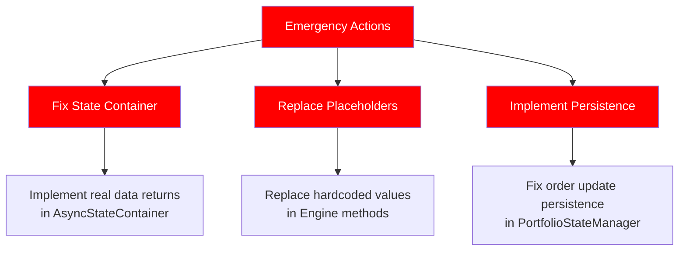

### 7.2 Short-term Consolidation (Week 1-2)

1. **Unify Position Sizing**
   ```python
   # Create adapter pattern
   class PositionSizingAdapter:
       def adapt_signal_to_opportunity(self, signal: TradingSignal) -> ArbitrageOpportunity:
           # Convert between incompatible types
   ```

2. **Single State Management**
   ```python
   class UnifiedStateManager:
       # Single source of truth for all modules
       async def get_global_state(self) -> GlobalPortfolioState
   ```

3. **Validation Consolidation**
   - Remove duplicate files
   - Create single validation service
   - Standardize on one pattern

### 7.3 Medium-term Architecture (Week 3-4)

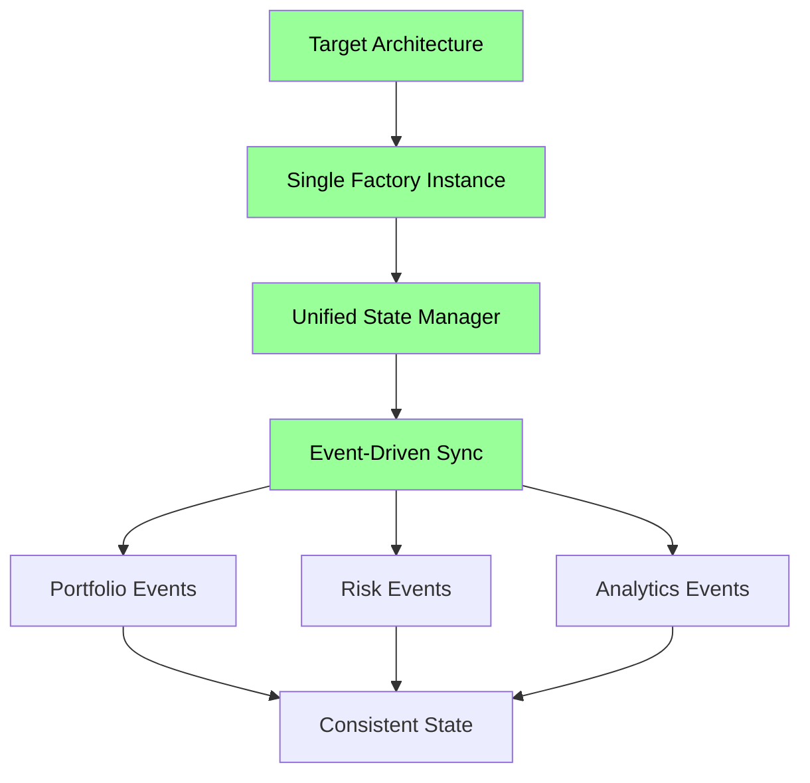

## 8. Critical Business Risks

### 8.1 Production Impact Assessment

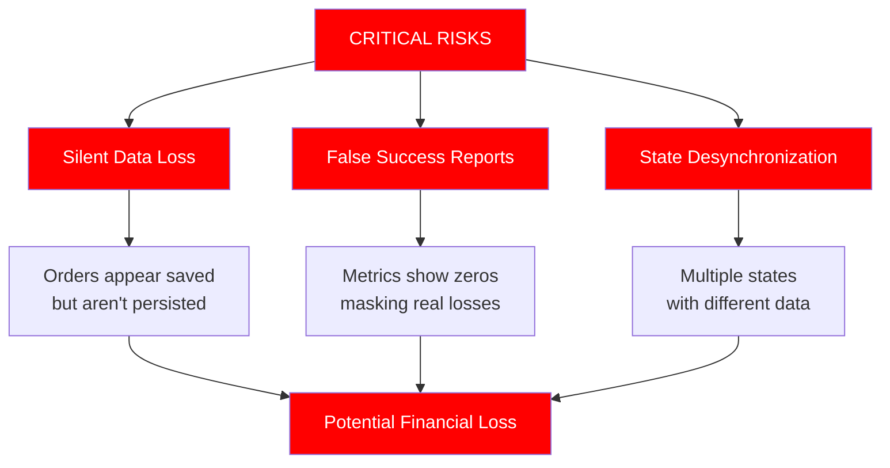

### 8.2 Technical Debt Cascade

1. **5 validation systems** to maintain
2. **4 separate portfolio states** potentially diverging
3. **2 position sizing systems** with incompatible types
4. **Multiple factory patterns** creating service chaos
5. **Placeholder methods** hiding integration failures

## 9. Root Cause Analysis

### 9.1 Architectural Decay Pattern

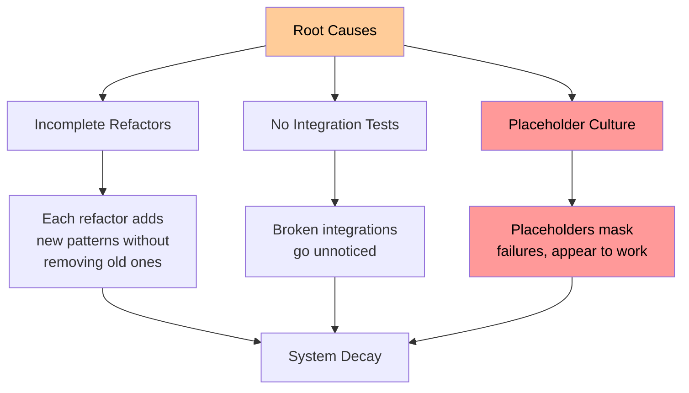

### 9.2 Development Process Issues

1. **No completion criteria** for refactors
2. **Placeholder methods** accepted as temporary but become permanent
3. **Duplicate implementations** instead of fixing existing ones
4. **No integration testing** to catch wiring issues

## 10. Action Plan

### Immediate (24-48 hours)

1. **Replace ALL placeholder returns** with actual implementations or explicit errors
2. **Fix AsyncStateContainer** to return real data
3. **Implement order persistence** in PortfolioStateManager

### Week 1

1. **Consolidate validation systems** - keep only one
2. **Fix position sizing type mismatch** with adapters
3. **Implement real reconciliation service**

### Week 2-3

1. **Unify state management** across all modules
2. **Fix service factory hierarchy**
3. **Remove backwards compatibility remnants**

### Week 4

1. **Integration testing suite** to prevent regression
2. **Architecture documentation** of intended design
3. **Code cleanup** - remove dead code and TODO comments

## 11. Severity Assessment

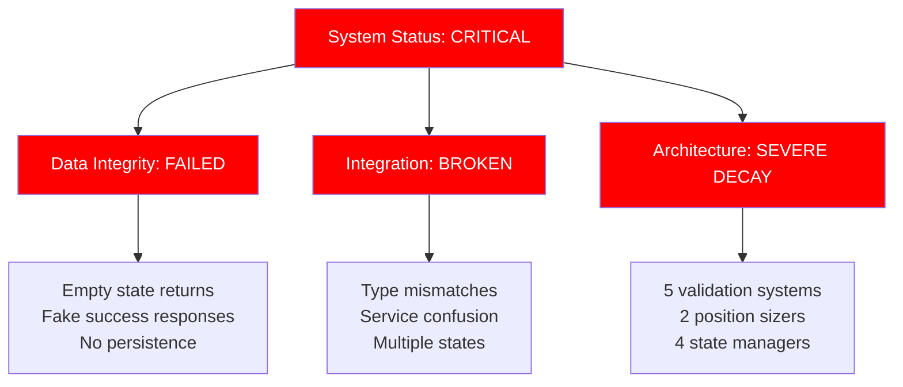

## Conclusion

The CyberDeltaEngine is in a critical state with fundamental architectural failures masked by placeholder implementations. The system gives the illusion of functionality while actually failing to perform core operations like persisting orders or calculating real metrics.

**Immediate intervention required** to prevent catastrophic production failures. The combination of empty state returns, duplicate systems, and broken integrations creates a perfect storm for financial loss and system failure.

The path forward requires disciplined refactoring with a focus on:
1. Completing one refactor before starting another
2. Removing placeholder code immediately
3. Consolidating duplicate systems
4. Establishing integration tests
5. Creating clear architectural boundaries

Without immediate action, this system poses severe operational and financial risks.
