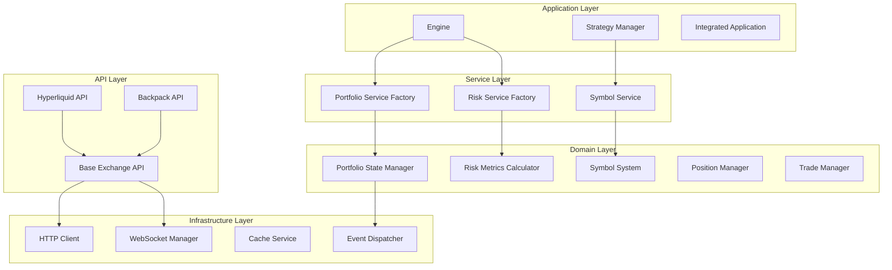
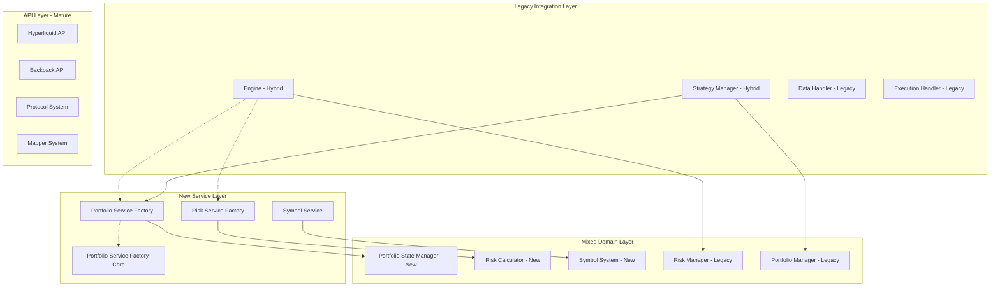

# CyberDeltaEngine: Intended vs Actual Architecture Analysis

## Executive Summary

The CyberDeltaEngine represents a cryptocurrency trading engine in active architectural transition. The codebase reveals a deliberate evolution from a monolithic approach toward a modular, service-oriented architecture following Domain-Driven Design (DDD) principles. However, this transition has created a hybrid system where new service-oriented components coexist with legacy patterns, resulting in architectural inconsistencies and integration challenges.

## 1. Intended Architecture (Target State)

Based on the code analysis and documented patterns, the intended architecture follows a layered, service-oriented design:

### 1.1 Core Architectural Principles

**Service-Oriented Design**
- Portfolio, Risk, and Symbol services as separate, focused modules
- Protocol-based dependency injection for testability and flexibility
- Factory patterns for service creation and lifecycle management
- Clear separation of concerns between different business domains

**Domain-Driven Architecture**
- Rich domain models with business logic encapsulation (Symbol system)
- Clean separation between Raw API models and Internal Domain models
- Exchange-agnostic internal representations with transformer patterns
- Type-safe operations with comprehensive Pydantic validation

**Event-Driven Components**
- Event dispatcher system for portfolio state changes
- Asynchronous processing patterns throughout
- Reactive architecture for real-time trading operations

### 1.2 Intended Component Structure



### 1.3 Data Flow Patterns (Intended)

**Symbol Resolution Flow**
1. Internal symbols → Symbol Service → Exchange transformers → API-specific formats
2. Type-safe transformations with validation at each boundary
3. Cached lookups for performance optimization

**Portfolio State Management**
1. Exchange data → Raw models → Internal models → Portfolio state
2. Event-driven updates through dispatcher system
3. Validation at each transformation boundary

**Risk Assessment Flow**
1. Portfolio state → Risk calculators → Position sizing → Trade execution
2. Modular risk components with protocol-based interfaces
3. Configurable risk strategies (Simple, Kelly, Production Kelly)

## 2. Actual Current Architecture (Current State)

The analysis reveals a complex hybrid architecture with multiple coexisting patterns:

### 2.1 Architectural Inconsistencies

**Multiple Service Factory Patterns**
- `PortfolioServiceFactory` (main) - Full-featured with dependency management
- `PortfolioServiceFactory` (core) - Simplified version in core/services
- `RiskServiceFactory` - Risk-specific factory
- Different initialization and dependency patterns across factories

**Dual Symbol Systems**
- New domain-rich Symbol system with transformers and protocols
- Legacy string-based symbol handling still present in some components
- Migration utilities present but integration incomplete

**Mixed Data Models**
- Raw API models following strict validation rules (RULE-ARCH-MODEL-DESIGN-V2)
- Internal domain models with business logic
- Some legacy model patterns still in use

### 2.2 Current Component Relationships



### 2.3 Current Data Flow Challenges

**Portfolio State Management**
- Engine uses both new portfolio factories AND legacy risk manager
- Multiple state management approaches coexist
- Inconsistent error handling and validation patterns

**Symbol Handling**
- Some components use new Symbol domain objects
- Others still use string-based symbol handling
- Transformation boundaries not consistently applied

**Risk Management**
- New modular risk services available
- Legacy RiskManager still integrated in some flows
- Position sizing logic scattered across multiple components

## 3. Key Architectural Decisions Visible in Code

### 3.1 Protocol-Based Architecture

**Intent**: Enable dependency injection and testability
```python
# Protocols define contracts
class StateContainerProtocol(Protocol):
    async def get_balances(self, exchange: ExchangeName) -> dict[str, SpotBalance]:
        ...

# Services implement protocols  
class PortfolioStateManager:
    def __init__(self, state_container: StateContainerProtocol):
        self.state_container = state_container
```

**Status**: Widely implemented in new components, mixed adoption in legacy components

### 3.2 Service Factory Pattern

**Intent**: Centralized service creation and lifecycle management
```python
class PortfolioServiceFactory:
    def create_portfolio_state_manager(self) -> PortfolioStateManager:
        # Dependency injection with protocol-based interfaces
        if not self._state_container:
            self._state_container = self._create_state_container()
        return PortfolioStateManager(
            state_container=self._state_container,
            validation_service=self._validation_service
        )
```

**Status**: Multiple factory implementations exist, coordination needed

### 3.3 Raw/Internal Model Separation

**Intent**: Strict boundary between external API data and internal business logic
```python
# Raw models - exact API structure
class BackpackRawOrder(BaseModel):
    model_config = ConfigDict(extra='forbid', frozen=True)
    
# Internal models - business logic
class Order(BaseModel):
    model_config = ConfigDict(extra='forbid', validate_assignment=True)
```

**Status**: Consistently implemented in API layer, good architectural discipline

### 3.4 Event-Driven Architecture

**Intent**: Reactive state updates for real-time trading
```python
class EventDispatcher:
    async def register_handler(self, event_type: EventType, handler: Callable):
        ...
    
    async def dispatch_event(self, event: BaseEvent):
        ...
```

**Status**: Infrastructure present, integration incomplete

## 4. Component Responsibility Analysis

### 4.1 Engine (Core Integration Component)

**Intended Responsibilities:**
- Strategy lifecycle management
- Market data distribution
- Service orchestration through factories

**Current Implementation:**
- Uses both new factory services AND legacy components
- TODO comments indicate incomplete integration
- Service factory integration partially implemented
- Still contains legacy portfolio/risk management code

**Key Issues:**
```python
# Engine.py - Mixed responsibilities
async def get_position_size_for_trade(self, symbol: Symbol, signal_strength: float) -> Decimal:
    # TODO: This method needs to be redesigned - PositionSizer expects ArbitrageOpportunity
    return Decimal("100.0")  # Placeholder - needs proper implementation
```

### 4.2 Portfolio System

**Intended Responsibilities:**
- Portfolio state management
- Performance analytics
- Balance/position tracking
- Event-driven updates

**Current Implementation:**
- Comprehensive service factory with proper dependency injection
- Rich protocol-based architecture
- Multiple service layers (analytics, validation, reconciliation)
- Proper async initialization patterns

**Strengths:**
- Well-designed service architecture
- Clear separation of concerns
- Comprehensive validation and health checking

### 4.3 Risk System

**Intended Responsibilities:**
- Risk metrics calculation
- Position sizing strategies
- Exposure calculation
- Risk limit enforcement

**Current Implementation:**
- Modular service factory design
- Multiple sizing strategies (Simple, Kelly, Production Kelly)
- Protocol-based interfaces
- Clean separation from portfolio concerns

**Integration Challenges:**
- Not fully integrated with engine/strategy components
- Some legacy risk management still in use
- Position sizing integration incomplete

### 4.4 Symbol System

**Intended Responsibilities:**
- Exchange-agnostic symbol representation
- Symbol transformation and validation
- Arbitrage pair compatibility checking
- Rich domain model for symbols

**Current Implementation:**
- Sophisticated domain-driven design
- Comprehensive transformer system
- Type-safe operations
- Excellent documentation and testing infrastructure

**Migration Status:**
- New system fully implemented
- Migration utilities available
- Legacy string-based handling still present in some components

### 4.5 API Layer

**Intended Responsibilities:**
- Exchange-specific API implementations
- Raw data validation and transformation
- Rate limiting and error handling
- WebSocket and HTTP connectivity

**Current Implementation:**
- Mature, well-architected system
- Consistent protocol-based design
- Proper separation of Raw/Internal models
- Comprehensive error handling and validation

**Status:** This layer appears to be the most complete and architecturally sound

## 5. Architectural Debt and Migration Path

### 5.1 Technical Debt Areas

**Service Factory Coordination**
- Multiple factory implementations need consolidation
- Inconsistent dependency management patterns
- Service lifecycle management not standardized

**Component Integration**
- Engine uses mixed legacy/new patterns
- Strategy manager partially migrated
- Risk management split between old/new approaches

**Symbol System Migration**
- New domain-rich system available but not fully adopted
- String-based handling still present
- Migration path exists but incomplete

### 5.2 Integration Challenges

**Type System Inconsistencies**
```python
# Different portfolio state types exist
# TODO: Fix PortfolioState type mismatch - two different classes with same name
performance = await self.performance_analytics.calculate_performance(portfolio_state)
```

**Service Discovery**
- Multiple service factories don't coordinate
- Service dependencies not centrally managed
- Initialization order dependencies unclear

**Error Handling Patterns**
- New components use comprehensive validation
- Legacy components have simpler error handling
- Mixed exception hierarchies

### 5.3 Recommended Migration Strategy

**Phase 1: Service Factory Consolidation**
1. Unify service factory implementations
2. Establish clear service dependency hierarchy
3. Standardize initialization and shutdown patterns

**Phase 2: Component Integration**
4. Complete Engine integration with new service factories
5. Migrate StrategyManager to use new portfolio/risk services
6. Remove legacy risk management code

**Phase 3: Symbol System Migration**
7. Replace remaining string-based symbol handling
8. Remove legacy symbol transformation code
9. Update all components to use Symbol domain objects

**Phase 4: Event System Integration**
10. Complete event-driven architecture implementation
11. Integrate all components with event dispatcher
12. Establish consistent state update patterns

## 6. Architectural Strengths and Opportunities

### 6.1 Strengths

**Service-Oriented Design**
- Clear separation of concerns
- Protocol-based interfaces enable testability
- Factory patterns provide good lifecycle management

**Domain-Driven Development**
- Rich domain models with business logic
- Type-safe operations throughout
- Comprehensive validation boundaries

**API Architecture**
- Mature, well-designed exchange integration
- Consistent patterns across exchanges
- Proper error handling and rate limiting

**Documentation and Testing**
- Excellent documentation in Symbol system
- Clear architectural patterns documented
- Migration utilities provided

### 6.2 Opportunities

**Complete Service Integration**
- Finish migration to new service-oriented architecture
- Remove legacy components to reduce complexity
- Standardize patterns across all components

**Event-Driven Architecture**
- Complete event system integration
- Enable real-time reactive updates
- Improve system responsiveness

**Performance Optimization**
- Leverage service caching consistently
- Optimize service initialization paths
- Implement service warm-up strategies

**Monitoring and Observability**
- Complete health check system integration
- Standardize metrics collection
- Implement comprehensive service monitoring

## Conclusion

The CyberDeltaEngine demonstrates a well-planned architectural evolution toward a modern, service-oriented design. The target architecture is sound and follows industry best practices. However, the system currently exists in a transition state where new service-oriented components coexist with legacy patterns, creating complexity and integration challenges.

The most critical next steps are:
1. Complete the service factory consolidation
2. Finish Engine and StrategyManager integration with new services
3. Remove legacy risk management components
4. Complete symbol system migration

The API layer serves as an excellent architectural reference point, demonstrating mature patterns that should be adopted throughout the system. The Portfolio and Risk service architectures are well-designed and ready for integration. The Symbol system represents exemplary domain-driven design that should be fully adopted.

Success will require disciplined completion of the migration path while maintaining system stability during the transition.