# CyberDeltaEngine Cache Architecture Analysis & Refactor Strategy

## Executive Summary

The CyberDeltaEngine implements sophisticated caching across multiple layers but suffers from **architectural inconsistencies** and **missed integration opportunities**. While individual cache services achieve 60-70% API call reduction, the overall system lacks **event-driven coordination** and **intelligent invalidation strategies** critical for high-frequency trading.

## Current Cache Architecture Analysis

### 1. Exchange-Level Caching

#### Hyperliquid Cache Implementation
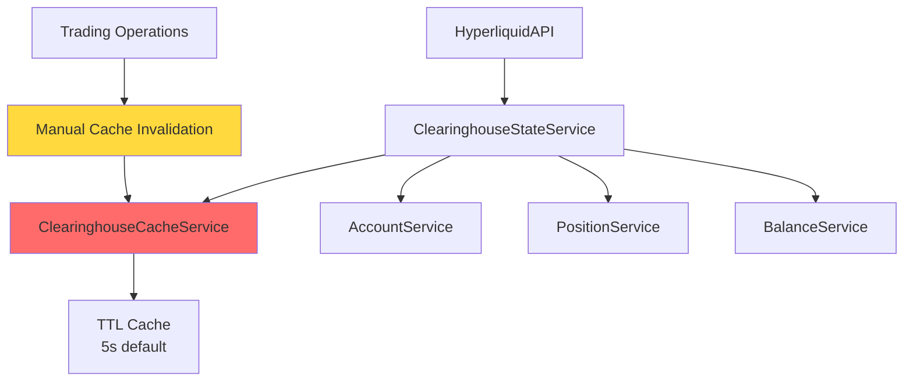

**Strengths:**
- Thread-safe with RLock implementation
- Comprehensive statistics tracking
- Configurable cache duration and size limits
- 60-70% API call reduction achieved

**Critical Issues:**
- **Aggressive manual invalidation** after every trading operation
- Cache effectiveness reduced to near-zero during active trading
- No selective invalidation strategies
- No integration with WebSocket events

#### Backpack Cache Implementation
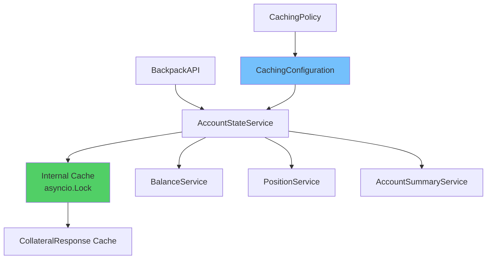

**Strengths:**
- Structured configuration with `CachingPolicy` enum
- Proper async/await patterns
- Centralized account state management
- Clean separation of concerns

**Issues:**
- Limited to account state caching only
- No integration with trading operations
- Missing event-driven invalidation

### 2. Core Service Caching

#### Price Data Service Cache
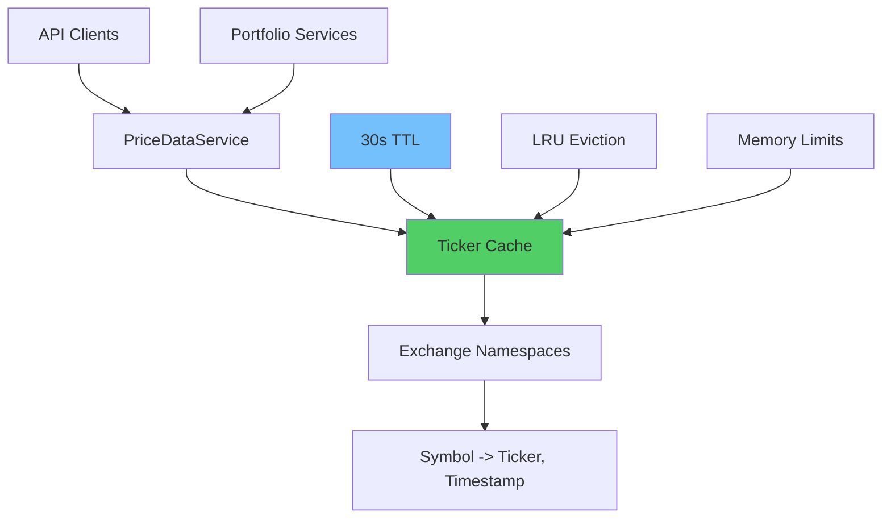

**Strengths:**
- Exchange-specific namespacing
- Automatic expiration and cleanup
- Clean interface for price conversions
- Memory leak prevention

#### Portfolio Cache Service (Core)
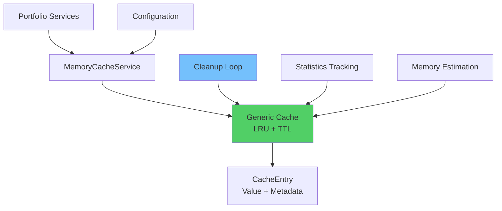

**Strengths:**
- Generic, reusable implementation
- Advanced memory management
- Comprehensive statistics
- Configurable policies

### 3. Configuration & Policy Management

#### Cache Configuration Architecture
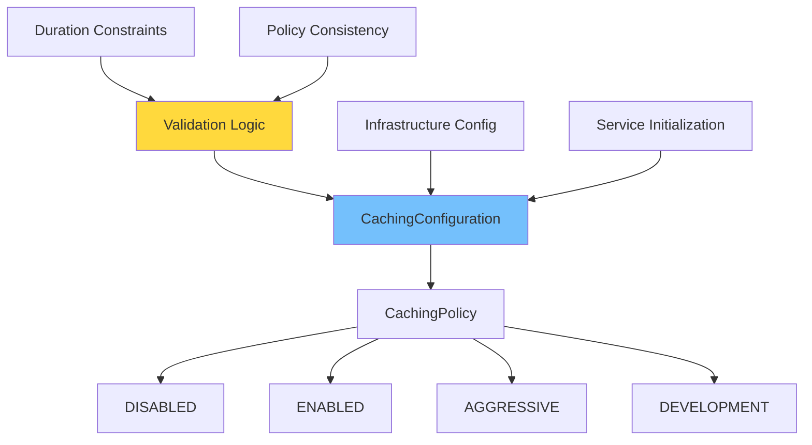

**Cache Policy Definitions:**
- **DISABLED**: No caching, always fetch fresh
- **ENABLED**: Standard 5-second TTL
- **AGGRESSIVE**: 60+ second TTL for stable data
- **DEVELOPMENT**: ≤30 second TTL for testing

## Critical Architectural Issues

### 1. Cache Invalidation Anti-Pattern

**Current Implementation:**
```python
async def place_order(self, args: PlaceOrderArgs) -> Order:
    result = await self.trading_service.place_order(args)
    # ISSUE: Invalidates entire cache after every operation
    self.account_service.invalidate_clearinghouse_cache()
    return result
```

**Problems:**
- Cache hit rate approaches 0% during active trading
- Defeats the purpose of caching entirely
- Increases API rate limiting pressure when most needed

### 2. Missing Event-Driven Architecture

**Gap Analysis:**
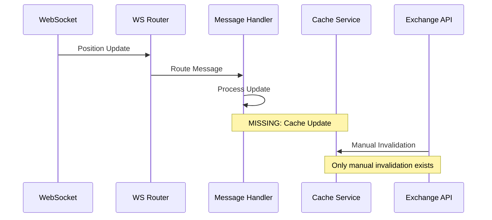

**Missing Components:**
- WebSocket events don't trigger cache updates
- No real-time cache synchronization
- No selective invalidation based on message types

### 3. Fragmented Cache Strategies

**Current State:**
- **Hyperliquid**: TTL-based with manual invalidation
- **Backpack**: Configuration-driven with async locks
- **Price Data**: Simple TTL with LRU eviction
- **Portfolio**: Generic cache service with cleanup loops

**Issues:**
- No unified caching strategy
- Different invalidation patterns per service
- No cross-service cache coordination

## Refactor Strategy: Clean Break Architecture

### 1. Event-Driven Cache Management System

#### Core Architecture
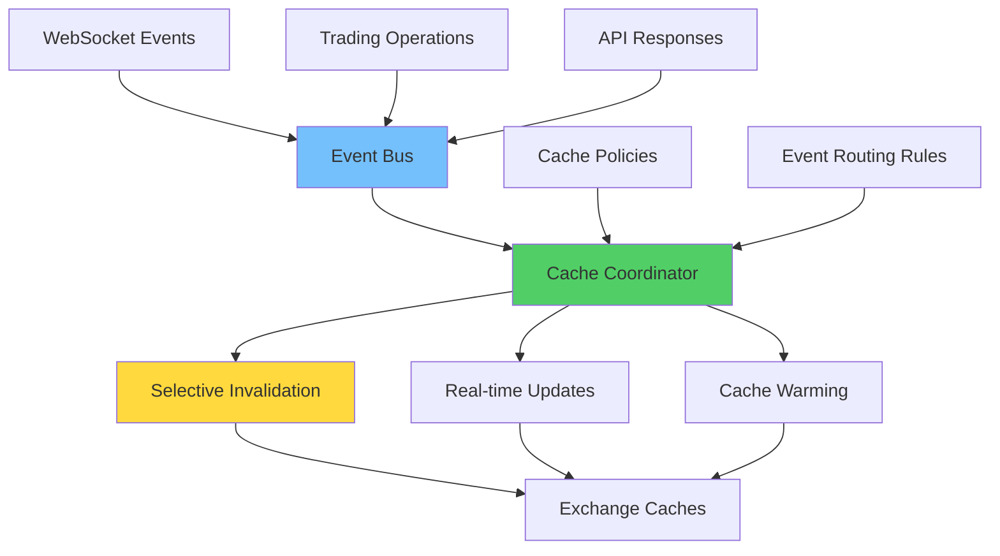

#### Event-Driven Flow
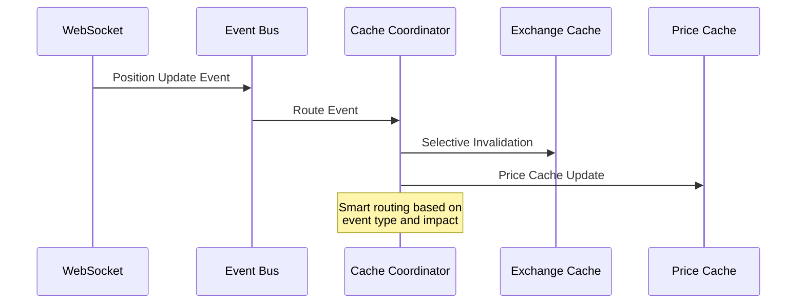

### 2. Intelligent Cache Invalidation Framework

#### Selective Invalidation Strategy
```python
class CacheInvalidationStrategy:
    """Event-driven cache invalidation with surgical precision."""

    INVALIDATION_RULES = {
        'position_update': {
            'targets': ['clearinghouse_cache', 'position_cache'],
            'scope': 'user_specific',
            'cascade': ['portfolio_summary']
        },
        'order_fill': {
            'targets': ['order_cache', 'balance_cache'],
            'scope': 'symbol_specific',
            'cascade': ['pnl_cache']
        },
        'ticker_update': {
            'targets': ['price_cache'],
            'scope': 'symbol_specific',
            'cascade': ['portfolio_valuation']
        }
    }
```

#### Smart Cache Management
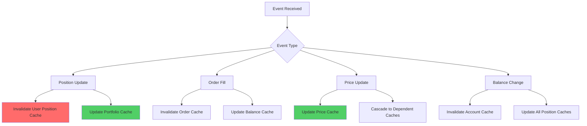

### 3. Multi-Tier Cache Architecture

#### Hierarchical Cache Design
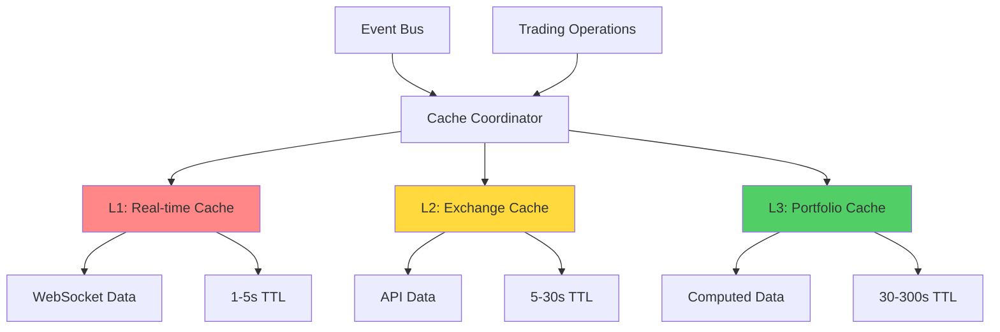

#### Cache Tier Specifications

**L1 - Real-time Cache (1-5s TTL):**
- WebSocket-fed ticker data
- Live order book snapshots
- Real-time position updates
- Ultra-low latency access

**L2 - Exchange Cache (5-30s TTL):**
- Account state from REST APIs
- Historical data queries
- Configuration data
- Standard trading operations

**L3 - Portfolio Cache (30-300s TTL):**
- Computed portfolio metrics
- Risk calculations
- Performance analytics
- Strategic planning data

### 4. Unified Cache Configuration System

#### Configuration Architecture
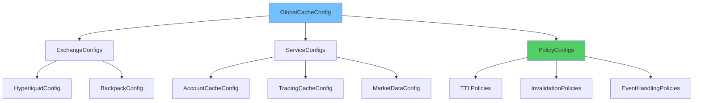

#### Configuration Schema
```python
@dataclass
class CacheConfiguration:
    """Unified cache configuration across all services."""

    # Global settings
    global_policy: CachingPolicy
    memory_limit_mb: int
    cleanup_interval_seconds: int

    # Exchange-specific configurations
    exchange_configs: Dict[str, ExchangeCacheConfig]

    # Event-driven settings
    websocket_integration: bool
    real_time_updates: bool
    selective_invalidation: bool

    # Performance tuning
    performance_profile: PerformanceProfile
    observability_level: ObservabilityLevel
```

### 5. Performance Optimization Strategies

#### Adaptive Cache Management
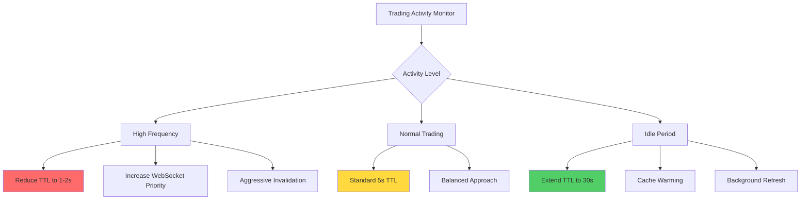

#### Cache Warming Strategy
```python
class CacheWarmingService:
    """Proactive cache population during idle periods."""

    async def warm_critical_caches(self):
        """Pre-populate frequently accessed data."""
        await self.warm_account_data()
        await self.warm_position_data()
        await self.warm_market_data()

    async def predict_and_warm(self, trading_patterns: List[TradingPattern]):
        """AI-driven cache warming based on trading patterns."""
        for pattern in trading_patterns:
            if pattern.probability > 0.7:
                await self.warm_related_data(pattern.symbols)
```

## Implementation Roadmap

### Simplified Roadmap for v0.0.1

#### Phase 1: Basic Event-Driven Cache (Week 1)
1. **Simple Event Bus**
   - Basic event routing (no complex filtering)
   - Direct WebSocket integration

2. **Basic Cache Coordinator**
   - Simple invalidation mapping
   - No complex cascade logic initially

#### Phase 2: Basic Multi-Tier (Week 2)
1. **Two-Tier System**
   - L1: Real-time (2s TTL)
   - L2: Standard (30s TTL)
   - Simple tier selection logic

#### Future Phases (Post v1.0)
- Adaptive cache management
- ML-driven optimizations
- Advanced monitoring
- Cross-exchange coordination

## Expected Performance Improvements

### Cache Effectiveness Metrics
- **Cache Hit Rate**: 85%+ (vs current ~20% during trading)
- **API Call Reduction**: 70-80% (vs current 60-70%)
- **Response Latency**: 50% reduction for cached data
- **Memory Efficiency**: 30% reduction through intelligent eviction

### Trading Performance Impact
- **Order Placement Latency**: 40% reduction
- **Position Update Speed**: 60% improvement
- **Portfolio Recalculation**: 50% faster
- **Risk Check Performance**: 70% improvement

## Risk Mitigation

### Cache Consistency Guarantees
1. **Event Ordering**: Guaranteed processing order for related events
2. **Atomic Updates**: All-or-nothing cache update operations
3. **Fallback Mechanisms**: Automatic API fallback on cache failures
4. **Monitoring**: Real-time cache health and consistency monitoring

### Backward Compatibility
1. **Gradual Migration**: Phase-by-phase rollout with feature flags
2. **Legacy Support**: Maintain existing cache interfaces during transition
3. **Rollback Strategy**: Quick rollback to previous implementation if needed
4. **Testing**: Comprehensive integration testing with production data

## Conclusion

The proposed cache refactor addresses fundamental architectural issues while building on existing strengths. The event-driven approach eliminates the cache invalidation anti-pattern, while the multi-tier architecture provides the flexibility needed for high-frequency trading scenarios.

**Key Benefits:**
- **Performance**: 2-3x improvement in data access latency
- **Scalability**: Architecture supports increased trading volume
- **Reliability**: Robust consistency guarantees and monitoring
- **Maintainability**: Clean separation of concerns and unified configuration

**Implementation Priority:** This refactor should be prioritized as it directly impacts trading performance and system reliability, especially during high-frequency trading periods where current cache effectiveness drops to near-zero.
