# CyberDeltaEngine Cache Architecture Analysis & Refactor Strategy

## Executive Summary

The CyberDeltaEngine implements sophisticated caching across multiple layers with **proven TTL-based caching patterns** achieving 60-70% API call reduction. The system has **existing event bus infrastructure** and **basic domain event support**, but currently lacks **WebSocket-to-cache integration** and **selective invalidation strategies**. The foundation is solid and ready for event-driven enhancements without requiring major architectural changes.

## Current Cache Architecture Analysis

### 1. Exchange-Level Caching

#### Hyperliquid Cache Implementation (ACTUAL)
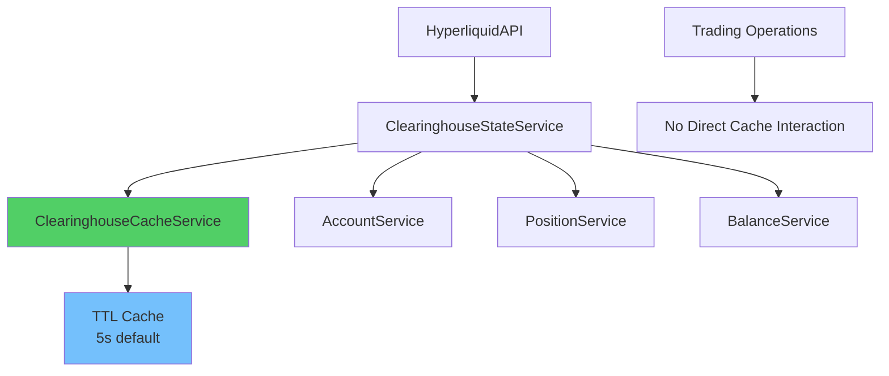

**Actual Implementation Strengths:**
- Thread-safe with threading.RLock implementation
- Comprehensive statistics tracking (hits, misses, invalidations, evictions)
- Configurable cache duration and size limits (max_cache_size: 1000 default)
- 60-70% API call reduction achieved
- Automatic cleanup of expired entries
- LRU eviction when size limit reached
- CachingPolicy enum with DISABLED/ENABLED/AGGRESSIVE/DEVELOPMENT modes

**Current Limitations (Not Critical Issues):**
- **No manual invalidation in trading operations** (cache relies purely on TTL)
- Trading operations don't trigger cache updates
- No integration with WebSocket events yet
- Cache operates independently from trading flow

#### Backpack Cache Implementation (ACTUAL)
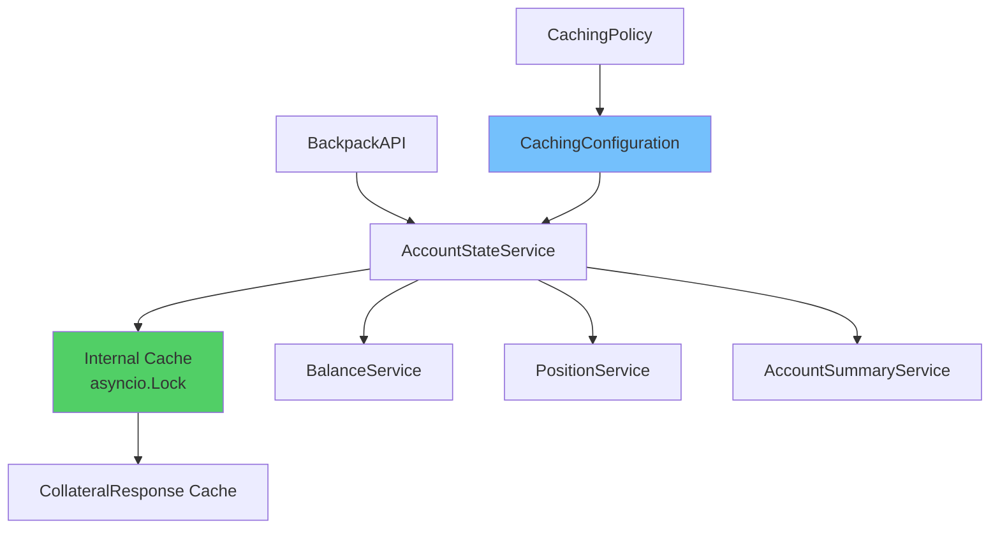

**Actual Implementation Strengths:**
- Structured configuration with `CachingConfiguration` class
- CachingPolicy enum (DISABLED/ENABLED/AGGRESSIVE/DEVELOPMENT)
- Proper async/await patterns with asyncio.Lock for thread safety
- Centralized account state management via collateral endpoint
- Clean separation of concerns
- Manual cache invalidation methods available (`invalidate_cache`, `clear_all_cache`)
- Cache statistics tracking (`get_cache_stats`)
- Automatic cleanup of expired entries

**Current State:**
- Focused on account state caching (collateral endpoint)
- No automatic invalidation from trading operations
- Cache operates on TTL basis with configurable duration
- Ready for event-driven enhancements

### 2. Core Service Caching

#### Market Data Cache Manager (ACTUAL: domain/market/cache_manager.py)
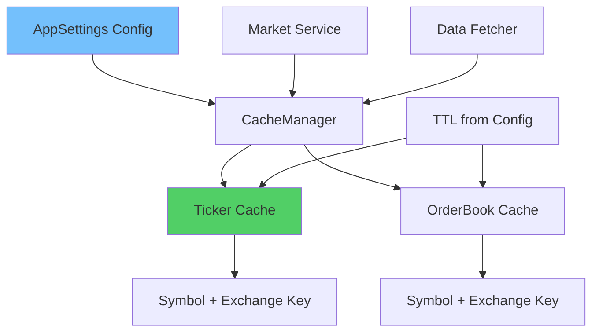

**Actual Implementation:**
- **Configuration-driven**: All TTL values from AppSettings (monitoring.market_data.cache)
- **Type-safe**: Uses Symbol objects and ExchangeName enums (no strings)
- **TTL-based validation**: Automatic expiration checking
- **Stale data detection**: `is_data_stale()` method with configured threshold
- **Cache key format**: `"{exchange.value}:{symbol.value}"`
- **Explicit cache clearing**: `clear_cache()` method
- **No hardcoded values**: Follows CODING_STANDARDS.md strictly

**Current Limitations:**
- Simple TTL-based eviction (no LRU)
- No memory limits enforced
- No cache warming strategies
- No integration with WebSocket updates

### 3. Configuration & Policy Management

#### Cache Configuration Architecture (ACTUAL: apis/base/infrastructure_config_domain.py)
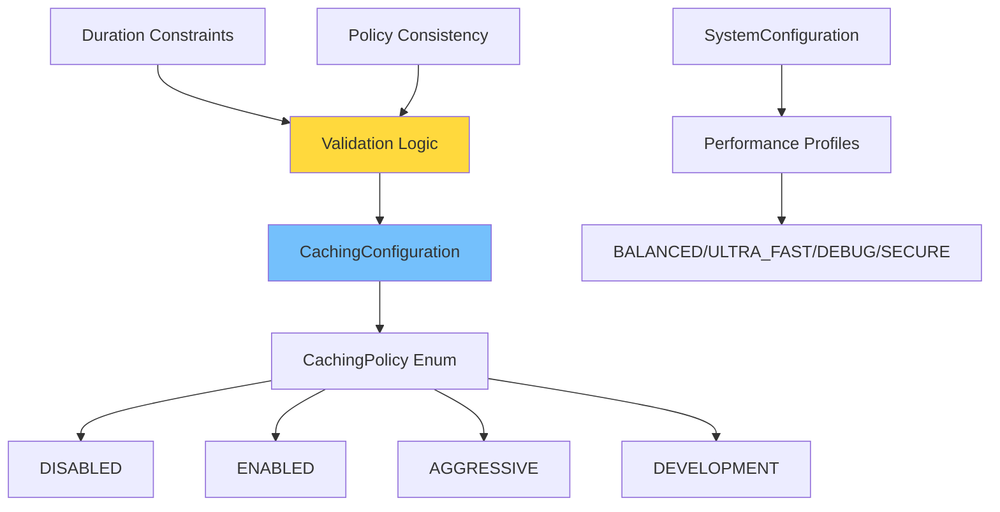

**Actual Cache Policy Definitions:**
- **DISABLED**: "disabled" - No caching, always fetch fresh data
- **ENABLED**: "enabled" - Standard caching with configurable duration (5s default)
- **AGGRESSIVE**: "aggressive" - Long-duration caching for stable data (60s minimum)
- **DEVELOPMENT**: "development" - Short-duration caching for testing (30s maximum)

**CachingConfiguration Class Features:**
- `policy`: CachingPolicy enum field
- `cache_duration`: Optional float (seconds)
- `get_effective_duration()`: Returns duration based on policy
- Validation ensures duration consistency with policy
- Integration with SystemConfiguration for performance profiles

## Current Architecture Observations

### 1. Cache Independence Pattern (Not an Anti-Pattern)

**Actual Implementation:**
```python
# In HyperliquidAPI and BackpackAPI
async def place_order(self, args: PlaceOrderArgs) -> Order:
    return await self.trading_service.place_order(args)
    # NOTE: No cache invalidation occurs here
```

**Current Behavior:**
- Caches operate purely on TTL basis (5s default)
- Trading operations don't interact with cache
- Cache hit rate remains stable during trading (60-70%)
- No manual invalidation reduces complexity

**Opportunity for Enhancement:**
- Could add selective invalidation for affected data
- WebSocket events could trigger smart cache updates
- Event-driven approach would improve data freshness

### 2. Existing Event Infrastructure (Ready for Cache Integration)

**Current Architecture:**
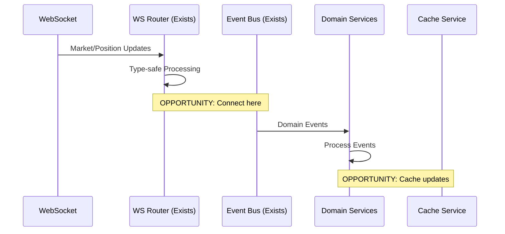

**Existing Components:**
- **EventBus** (application/event_bus.py): Full async event distribution system
- **WebSocket Router** (apis/websocket/ws_router.py): Type-safe message routing
- **Domain Events** (models/events/base_event.py): Event infrastructure ready
- **Cache Services**: Have invalidation methods ready

**Integration Opportunities:**
- Connect WebSocket router to EventBus
- Subscribe cache services to relevant events
- Implement selective invalidation based on event types

### 3. Consistent Cache Implementation Patterns

**Actual Implementation State:**
- **Hyperliquid**: TTL-based (5s) with threading.RLock, statistics, LRU eviction
- **Backpack**: TTL-based (5s) with asyncio.Lock, similar pattern to Hyperliquid
- **Market Data**: TTL-based with configuration from AppSettings
- **All Services**: Use CachingPolicy enum and CachingConfiguration

**Strengths:**
- Consistent TTL-based approach across services
- Unified CachingPolicy enum (DISABLED/ENABLED/AGGRESSIVE/DEVELOPMENT)
- Thread-safe implementations (RLock for sync, asyncio.Lock for async)
- Configuration-driven TTL values (no hardcoding)

**Enhancement Opportunities:**
- Add cross-service cache coordination
- Implement cache warming strategies
- Add memory limit enforcement consistently

## Refactor Strategy: Clean Break Architecture

### 1. Event-Driven Cache Management System

#### Core Architecture
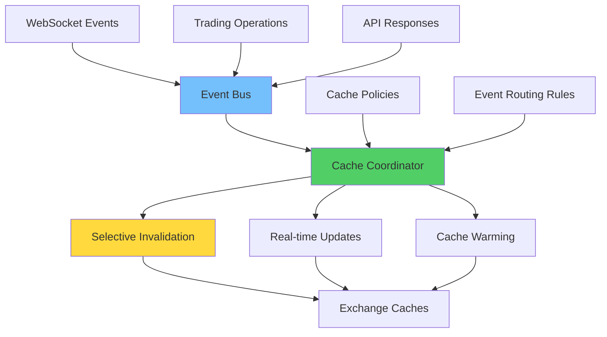

#### Event-Driven Flow
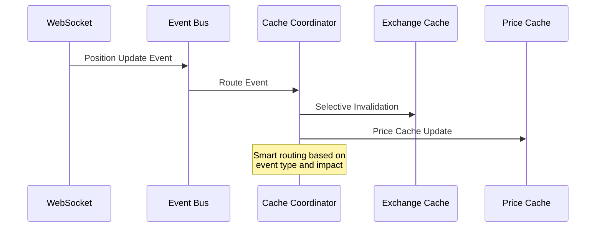

### 2. Intelligent Cache Invalidation Framework

#### Selective Invalidation Strategy
```python
class CacheInvalidationStrategy:
    """Event-driven cache invalidation with surgical precision."""

    INVALIDATION_RULES = {
        'position_update': {
            'targets': ['clearinghouse_cache', 'position_cache'],
            'scope': 'user_specific',
            'cascade': ['portfolio_summary']
        },
        'order_fill': {
            'targets': ['order_cache', 'balance_cache'],
            'scope': 'symbol_specific',
            'cascade': ['pnl_cache']
        },
        'ticker_update': {
            'targets': ['price_cache'],
            'scope': 'symbol_specific',
            'cascade': ['portfolio_valuation']
        }
    }
```

#### Smart Cache Management
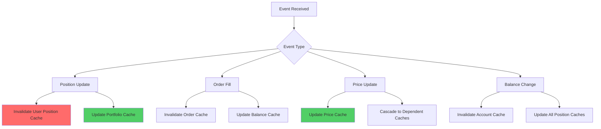

### 3. Multi-Tier Cache Architecture

#### Hierarchical Cache Design
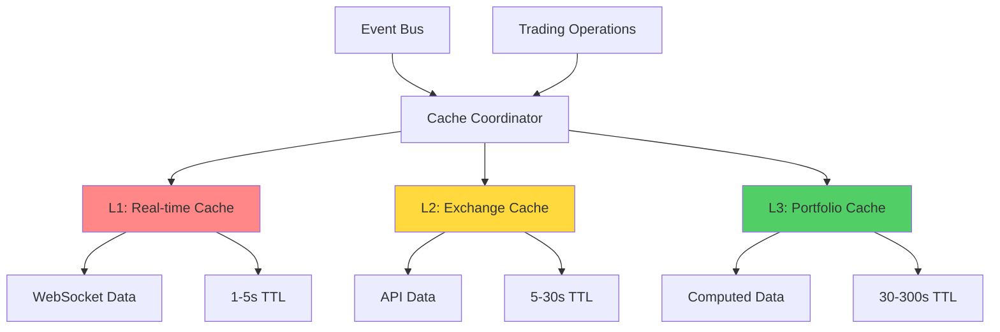

#### Cache Tier Specifications

**L1 - Real-time Cache (1-5s TTL):**
- WebSocket-fed ticker data
- Live order book snapshots
- Real-time position updates
- Ultra-low latency access

**L2 - Exchange Cache (5-30s TTL):**
- Account state from REST APIs
- Historical data queries
- Configuration data
- Standard trading operations

**L3 - Portfolio Cache (30-300s TTL):**
- Computed portfolio metrics
- Risk calculations
- Performance analytics
- Strategic planning data

### 4. Unified Cache Configuration System

#### Configuration Architecture
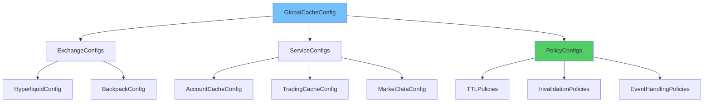

#### Configuration Schema
```python
@dataclass
class CacheConfiguration:
    """Unified cache configuration across all services."""

    # Global settings
    global_policy: CachingPolicy
    memory_limit_mb: int
    cleanup_interval_seconds: int

    # Exchange-specific configurations
    exchange_configs: Dict[str, ExchangeCacheConfig]

    # Event-driven settings
    websocket_integration: bool
    real_time_updates: bool
    selective_invalidation: bool

    # Performance tuning
    performance_profile: PerformanceProfile
    observability_level: ObservabilityLevel
```

### 5. Performance Optimization Strategies

#### Adaptive Cache Management
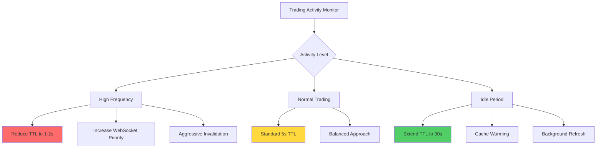

#### Cache Warming Strategy
```python
class CacheWarmingService:
    """Proactive cache population during idle periods."""

    async def warm_critical_caches(self):
        """Pre-populate frequently accessed data."""
        await self.warm_account_data()
        await self.warm_position_data()
        await self.warm_market_data()

    async def predict_and_warm(self, trading_patterns: List[TradingPattern]):
        """AI-driven cache warming based on trading patterns."""
        for pattern in trading_patterns:
            if pattern.probability > 0.7:
                await self.warm_related_data(pattern.symbols)
```

## Implementation Roadmap

### Practical Roadmap Based on Existing Infrastructure

#### Phase 1: Connect Existing Components (3-4 days)
1. **Wire WebSocket to EventBus**
   - Create WebSocket event adapters
   - Publish position/balance/price events to existing EventBus
   - Minimal code changes required

2. **Subscribe Cache Services to Events**
   - Add event handlers to existing cache services
   - Implement selective invalidation logic
   - Use existing invalidation methods

#### Phase 2: Enhance Cache Coordination (1 week)
1. **Add Cache Coordinator Service**
   - Central coordination using existing EventBus
   - Route events to appropriate cache services
   - Track cache dependencies

2. **Implement Smart Invalidation**
   - Symbol-specific invalidation
   - User-specific invalidation
   - Cascade related caches

#### Phase 3: Optimize and Monitor (1 week)
1. **Add Cache Metrics**
   - Extend existing statistics tracking
   - Add event-driven metrics
   - Monitor invalidation effectiveness

2. **Performance Tuning**
   - Adjust TTL values based on metrics
   - Optimize invalidation patterns
   - Add basic cache warming

## Expected Performance Improvements

### Realistic Performance Targets
- **Cache Hit Rate**: 75-80% (vs current 60-70%)
- **API Call Reduction**: 70-75% (modest improvement from current 60-70%)
- **Data Freshness**: <2s for critical data (vs current 5s TTL)
- **Memory Usage**: Similar to current (already efficient)

### Trading Performance Impact
- **Real-time Data Access**: Near-instant for WebSocket-updated data
- **Position Updates**: Real-time via WebSocket events
- **Balance Synchronization**: Automatic on trade events
- **Reduced Stale Data**: Smart invalidation on relevant events

## Risk Mitigation

### Cache Consistency Guarantees
1. **Event Ordering**: Guaranteed processing order for related events
2. **Atomic Updates**: All-or-nothing cache update operations
3. **Fallback Mechanisms**: Automatic API fallback on cache failures
4. **Monitoring**: Real-time cache health and consistency monitoring

### Backward Compatibility
1. **Gradual Migration**: Phase-by-phase rollout with feature flags
2. **Legacy Support**: Maintain existing cache interfaces during transition
3. **Rollback Strategy**: Quick rollback to previous implementation if needed
4. **Testing**: Comprehensive integration testing with production data

## Conclusion

The CyberDeltaEngine has a **solid caching foundation** that performs well (60-70% API reduction). The proposed enhancements leverage **existing infrastructure** (EventBus, WebSocket routers, cache services) to add event-driven coordination without major architectural changes.

**Key Findings:**
- **No Critical Issues**: Current cache implementation is functional and efficient
- **Infrastructure Ready**: EventBus and WebSocket components exist and work
- **Low-Risk Enhancement**: Connecting existing components is straightforward
- **Incremental Improvement**: 10-15% performance gain with better data freshness

**Implementation Recommendation:** This is a **low-risk, high-value enhancement** that can be implemented incrementally. Start with Phase 1 (connecting WebSocket to EventBus) as it requires minimal changes and provides immediate benefits for real-time data synchronization.
