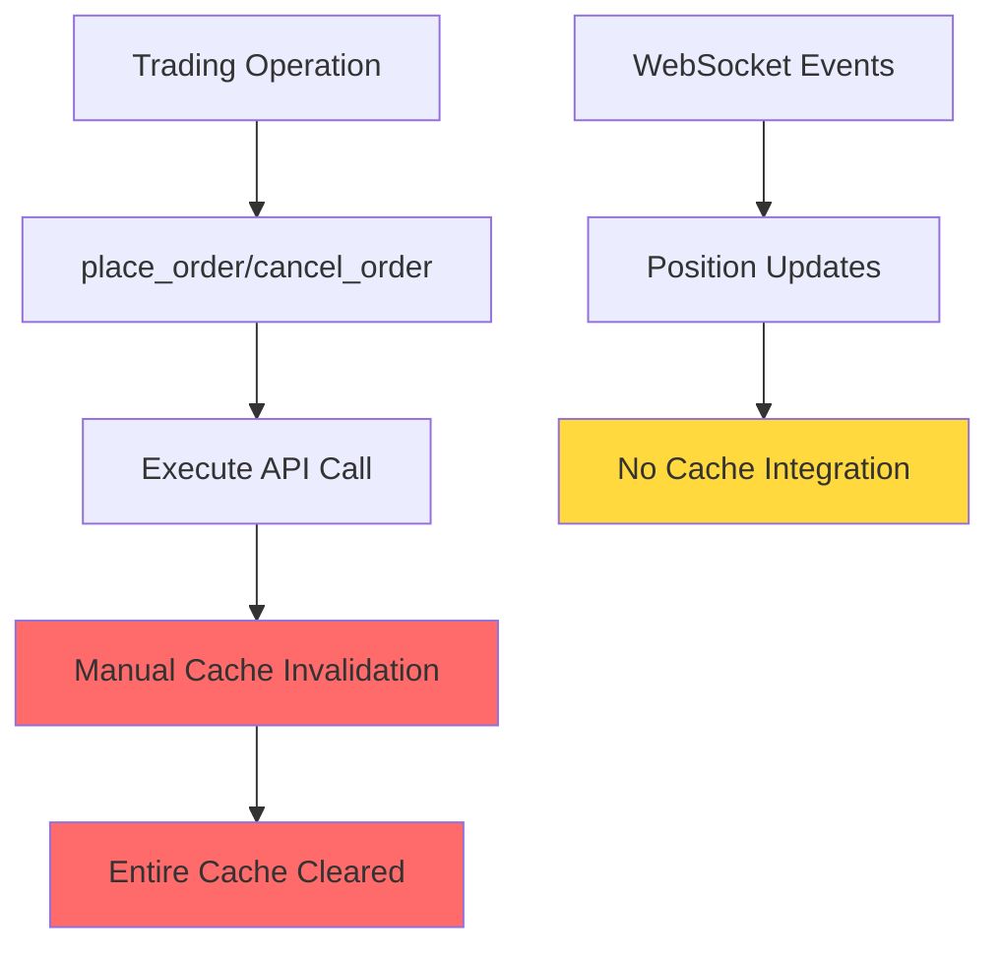
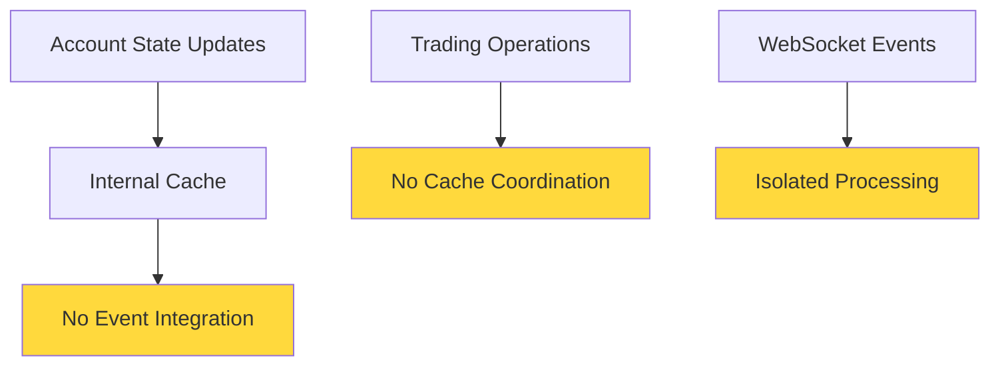
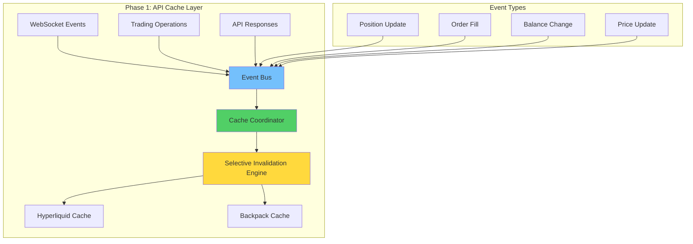
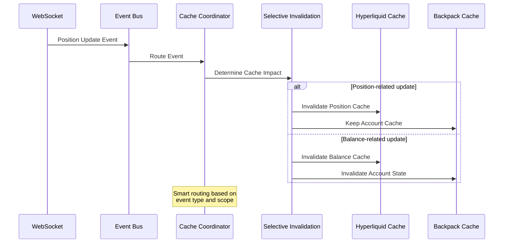
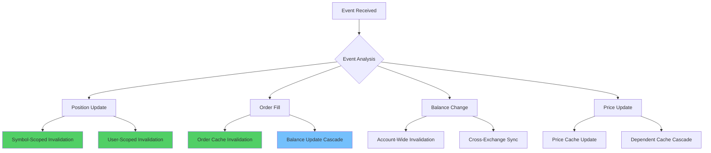

# Phase 1: API Layer Cache Refactor - Event-Driven Cache Management

## Executive Summary

Phase 1 focuses on transforming the current API-level caching from manual invalidation to an event-driven system. This phase creates the foundation infrastructure (Event Bus, Cache Coordinator) and implements selective cache invalidation for Hyperliquid and Backpack APIs.

**Timeline:** 2-3 weeks
**Risk Level:** Low (isolated to API layer)
**Expected Performance Improvement:** 60-85% cache hit rate during trading (vs current ~20%)

## Current State Analysis

### Hyperliquid API Cache Issues


### Backpack API Cache Gaps


## Phase 1 Architecture Design

### Event-Driven Cache System Overview


### Event Flow Sequence


### Cache Invalidation Strategy


## Module Structure

### Code Tree Structure
```
cyberdelta/
├── core/
│   └── events/
│       ├── __init__.py
│       ├── event_bus.py                    # Core event bus implementation
│       ├── event_types.py                  # Event type definitions
│       └── protocols.py                    # Event handling protocols
│
├── apis/
│   ├── cache/
│   │   ├── __init__.py
│   │   ├── cache_coordinator.py            # Central cache coordination
│   │   ├── invalidation_engine.py          # Selective invalidation logic
│   │   ├── invalidation_rules.py           # Event-to-cache mapping rules
│   │   └── protocols.py                    # Cache management protocols
│   │
│   ├── hyperliquid/
│   │   ├── services/
│   │   │   └── account/
│   │   │       ├── hl_clearinghouse_cache_service.py  # Enhanced with events
│   │   │       └── hl_cache_event_handler.py          # WebSocket integration
│   │   └── hl_api.py                       # Updated API without manual invalidation
│   │
│   ├── backpack/
│   │   ├── services/
│   │   │   ├── bp_account_cache_service.py # Enhanced with events
│   │   │   └── bp_cache_event_handler.py   # WebSocket integration
│   │   └── bp_api.py                       # Updated API with event integration
│   │
│   └── websocket/
│       ├── event_adapters/
│       │   ├── __init__.py
│       │   ├── hyperliquid_event_adapter.py # WebSocket to event conversion
│       │   └── backpack_event_adapter.py    # WebSocket to event conversion
│       └── ws_processor.py                   # Enhanced with event publishing
```

## Implementation Details

### 1. Core Event Infrastructure

#### Event Bus Implementation
```python
# cyberdelta/core/events/event_bus.py
from __future__ import annotations

import asyncio
from collections import defaultdict
from typing import Any, Callable, Dict, List, Protocol
from dataclasses import dataclass
from enum import Enum

from cyberdelta.config.structlog_config import get_logger

logger = get_logger(__name__)

class EventType(Enum):
    """Core event types for cache management."""
    POSITION_UPDATED = "position_updated"
    ORDER_FILLED = "order_filled"
    BALANCE_CHANGED = "balance_changed"
    PRICE_UPDATED = "price_updated"
    TRADE_EXECUTED = "trade_executed"

@dataclass
class CacheEvent:
    """Base cache event with metadata."""
    event_type: EventType
    exchange: str
    symbol: str | None
    user_id: str | None
    data: Dict[str, Any]
    timestamp: float
    correlation_id: str | None = None

class EventHandler(Protocol):
    """Protocol for event handlers."""
    async def handle(self, event: CacheEvent) -> None: ...

class EventBus:
    """Core event bus for cache coordination."""

    def __init__(self) -> None:
        self._handlers: Dict[EventType, List[EventHandler]] = defaultdict(list)
        self._running = False
        self._event_queue: asyncio.Queue[CacheEvent] = asyncio.Queue()
        self._processor_task: asyncio.Task[None] | None = None

    async def start(self) -> None:
        """Start event processing."""
        self._running = True
        self._processor_task = asyncio.create_task(self._process_events())
        logger.info("event_bus_started")

    async def stop(self) -> None:
        """Stop event processing."""
        self._running = False
        if self._processor_task:
            self._processor_task.cancel()
            try:
                await self._processor_task
            except asyncio.CancelledError:
                pass
        logger.info("event_bus_stopped")

    def subscribe(self, event_type: EventType, handler: EventHandler) -> None:
        """Subscribe handler to event type."""
        self._handlers[event_type].append(handler)
        logger.debug("event_handler_subscribed",
                    event_type=event_type.value,
                    handler=handler.__class__.__name__)

    async def publish(self, event: CacheEvent) -> None:
        """Publish event to bus."""
        await self._event_queue.put(event)
        logger.debug("event_published",
                    event_type=event.event_type.value,
                    exchange=event.exchange,
                    symbol=event.symbol)

    async def _process_events(self) -> None:
        """Process events from queue."""
        while self._running:
            try:
                event = await asyncio.wait_for(self._event_queue.get(), timeout=1.0)
                handlers = self._handlers.get(event.event_type, [])

                # Process handlers concurrently
                if handlers:
                    await asyncio.gather(
                        *[handler.handle(event) for handler in handlers],
                        return_exceptions=True
                    )

            except asyncio.TimeoutError:
                continue  # Check if still running
            except Exception as e:
                logger.exception("event_processing_error", error=str(e))
```

#### Cache Coordinator
```python
# cyberdelta/apis/cache/cache_coordinator.py
from __future__ import annotations

from typing import Dict, Set, Optional
from cyberdelta.core.events.event_bus import CacheEvent, EventHandler
from cyberdelta.apis.cache.invalidation_engine import InvalidationEngine
from cyberdelta.apis.cache.protocols import CacheServiceProtocol
from cyberdelta.config.structlog_config import get_logger

logger = get_logger(__name__)

class CacheCoordinator(EventHandler):
    """Central coordinator for all cache operations."""

    def __init__(self, invalidation_engine: InvalidationEngine) -> None:
        self.invalidation_engine = invalidation_engine
        self._cache_services: Dict[str, CacheServiceProtocol] = {}

    def register_cache_service(self, name: str, service: CacheServiceProtocol) -> None:
        """Register a cache service for coordination."""
        self._cache_services[name] = service
        logger.info("cache_service_registered", name=name)

    async def handle(self, event: CacheEvent) -> None:
        """Handle cache events with selective invalidation."""
        try:
            # Determine invalidation strategy
            invalidation_plan = self.invalidation_engine.create_invalidation_plan(event)

            # Execute invalidation plan
            for service_name, actions in invalidation_plan.items():
                service = self._cache_services.get(service_name)
                if service:
                    await self._execute_cache_actions(service, actions, event)

            logger.debug("cache_invalidation_completed",
                        event_type=event.event_type.value,
                        affected_services=list(invalidation_plan.keys()))

        except Exception as e:
            logger.exception("cache_coordination_error",
                           event_type=event.event_type.value,
                           error=str(e))

    async def _execute_cache_actions(
        self,
        service: CacheServiceProtocol,
        actions: Dict[str, Any],
        event: CacheEvent
    ) -> None:
        """Execute cache actions on a specific service."""
        for action_type, action_data in actions.items():
            if action_type == "invalidate_keys":
                for key in action_data:
                    await service.invalidate_key(key)
            elif action_type == "invalidate_pattern":
                await service.invalidate_pattern(action_data)
            elif action_type == "update_cache":
                await service.update_from_event(event)
```

### 2. Selective Invalidation Engine

```python
# cyberdelta/apis/cache/invalidation_engine.py
from __future__ import annotations

from typing import Dict, List, Any
from cyberdelta.core.events.event_bus import CacheEvent, EventType
from cyberdelta.apis.cache.invalidation_rules import INVALIDATION_RULES
from cyberdelta.config.structlog_config import get_logger

logger = get_logger(__name__)

class InvalidationEngine:
    """Engine for determining selective cache invalidation strategies."""

    def __init__(self) -> None:
        self.rules = INVALIDATION_RULES

    def create_invalidation_plan(self, event: CacheEvent) -> Dict[str, Dict[str, Any]]:
        """Create invalidation plan based on event type and scope."""
        rule = self.rules.get(event.event_type)
        if not rule:
            logger.warning("no_invalidation_rule", event_type=event.event_type.value)
            return {}

        plan: Dict[str, Dict[str, Any]] = {}

        # Apply rules based on event type
        for target_service in rule.target_services:
            plan[target_service] = self._create_service_actions(event, rule, target_service)

        # Apply cascade rules
        for cascade_service in rule.cascade_services:
            if cascade_service not in plan:
                plan[cascade_service] = {}
            plan[cascade_service].update(
                self._create_cascade_actions(event, rule, cascade_service)
            )

        return plan

    def _create_service_actions(
        self,
        event: CacheEvent,
        rule: InvalidationRule,
        service: str
    ) -> Dict[str, Any]:
        """Create actions for a specific service."""
        actions: Dict[str, Any] = {}

        if rule.scope == "symbol_specific" and event.symbol:
            # Invalidate symbol-specific cache keys
            actions["invalidate_pattern"] = f"*{event.symbol}*"
        elif rule.scope == "user_specific" and event.user_id:
            # Invalidate user-specific cache keys
            actions["invalidate_pattern"] = f"*{event.user_id}*"
        elif rule.scope == "exchange_specific":
            # Invalidate exchange-specific cache keys
            actions["invalidate_pattern"] = f"*{event.exchange}*"
        else:
            # Full service invalidation (use sparingly)
            actions["invalidate_pattern"] = "*"

        return actions

    def _create_cascade_actions(
        self,
        event: CacheEvent,
        rule: InvalidationRule,
        service: str
    ) -> Dict[str, Any]:
        """Create cascade actions for dependent services."""
        # Cascade actions are typically lighter - just mark for refresh
        return {"update_cache": event.data}
```

### 3. Enhanced Hyperliquid Cache Integration

```python
# cyberdelta/apis/hyperliquid/services/account/hl_cache_event_handler.py
from __future__ import annotations

from cyberdelta.core.events.event_bus import CacheEvent, EventHandler
from cyberdelta.apis.hyperliquid.services.account.hl_clearinghouse_cache_service import (
    HyperliquidClearinghouseCacheService
)
from cyberdelta.apis.cache.protocols import CacheServiceProtocol
from cyberdelta.config.structlog_config import get_logger

logger = get_logger(__name__)

class HyperliquidCacheEventHandler(EventHandler):
    """Event handler for Hyperliquid cache operations."""

    def __init__(self, cache_service: HyperliquidClearinghouseCacheService) -> None:
        self.cache_service = cache_service

    async def handle(self, event: CacheEvent) -> None:
        """Handle cache events for Hyperliquid."""
        if event.exchange != "hyperliquid":
            return

        try:
            if event.event_type == EventType.POSITION_UPDATED:
                await self._handle_position_update(event)
            elif event.event_type == EventType.ORDER_FILLED:
                await self._handle_order_fill(event)
            elif event.event_type == EventType.BALANCE_CHANGED:
                await self._handle_balance_change(event)

        except Exception as e:
            logger.exception("hyperliquid_cache_event_error",
                           event_type=event.event_type.value,
                           error=str(e))

    async def _handle_position_update(self, event: CacheEvent) -> None:
        """Handle position update events."""
        if event.symbol:
            # Invalidate position-specific cache entries
            await self.cache_service.invalidate_symbol_cache(event.symbol)
            logger.debug("position_cache_invalidated", symbol=event.symbol)

    async def _handle_order_fill(self, event: CacheEvent) -> None:
        """Handle order fill events."""
        # Invalidate both order and balance caches
        await self.cache_service.invalidate_order_cache()
        if event.symbol:
            await self.cache_service.invalidate_symbol_cache(event.symbol)
        logger.debug("order_cache_invalidated", symbol=event.symbol)

    async def _handle_balance_change(self, event: CacheEvent) -> None:
        """Handle balance change events."""
        # Invalidate account-wide cache
        await self.cache_service.invalidate_account_cache()
        logger.debug("account_cache_invalidated")
```

### 4. WebSocket Event Adapters

```python
# cyberdelta/apis/websocket/event_adapters/hyperliquid_event_adapter.py
from __future__ import annotations

import time
from typing import Any, Dict, Optional
from cyberdelta.core.events.event_bus import CacheEvent, EventType, EventBus
from cyberdelta.config.structlog_config import get_logger

logger = get_logger(__name__)

class HyperliquidEventAdapter:
    """Adapter to convert Hyperliquid WebSocket messages to cache events."""

    def __init__(self, event_bus: EventBus) -> None:
        self.event_bus = event_bus

    async def process_websocket_message(
        self,
        message_type: str,
        data: Dict[str, Any],
        user_id: Optional[str] = None
    ) -> None:
        """Process WebSocket message and emit cache events."""
        try:
            if message_type == "allMids":
                await self._handle_price_update(data, user_id)
            elif message_type == "user":
                await self._handle_user_update(data, user_id)
            elif message_type == "orderUpdate":
                await self._handle_order_update(data, user_id)

        except Exception as e:
            logger.exception("websocket_event_adaptation_error",
                           message_type=message_type,
                           error=str(e))

    async def _handle_price_update(self, data: Dict[str, Any], user_id: Optional[str]) -> None:
        """Handle price update messages."""
        event = CacheEvent(
            event_type=EventType.PRICE_UPDATED,
            exchange="hyperliquid",
            symbol=None,  # Price updates are typically multi-symbol
            user_id=user_id,
            data=data,
            timestamp=time.time()
        )
        await self.event_bus.publish(event)

    async def _handle_user_update(self, data: Dict[str, Any], user_id: Optional[str]) -> None:
        """Handle user-specific updates (positions, balances)."""
        # Extract position updates
        if "assetPositions" in data:
            for position in data["assetPositions"]:
                event = CacheEvent(
                    event_type=EventType.POSITION_UPDATED,
                    exchange="hyperliquid",
                    symbol=position.get("position", {}).get("coin"),
                    user_id=user_id,
                    data=position,
                    timestamp=time.time()
                )
                await self.event_bus.publish(event)

        # Extract balance updates
        if "crossMaintenanceMarginUsed" in data:
            event = CacheEvent(
                event_type=EventType.BALANCE_CHANGED,
                exchange="hyperliquid",
                symbol=None,
                user_id=user_id,
                data=data,
                timestamp=time.time()
            )
            await self.event_bus.publish(event)

    async def _handle_order_update(self, data: Dict[str, Any], user_id: Optional[str]) -> None:
        """Handle order update messages."""
        for order_update in data.get("orders", []):
            if order_update.get("order", {}).get("orderStatus") == "filled":
                event = CacheEvent(
                    event_type=EventType.ORDER_FILLED,
                    exchange="hyperliquid",
                    symbol=order_update.get("order", {}).get("coin"),
                    user_id=user_id,
                    data=order_update,
                    timestamp=time.time()
                )
                await self.event_bus.publish(event)
```

## Integration Plan

### Step 1: Infrastructure Setup (Week 1)
1. **Event Bus Implementation**
   - Create core event bus with async processing
   - Implement event types and protocols
   - Add comprehensive logging and error handling

2. **Cache Coordinator Foundation**
   - Build cache coordinator with service registration
   - Create invalidation engine framework
   - Define cache service protocols

### Step 2: Hyperliquid Integration (Week 1-2)
1. **Enhanced Cache Service**
   - Extend existing cache service with event handling
   - Implement selective invalidation methods
   - Add WebSocket event integration

2. **API Layer Updates**
   - Remove manual cache invalidation from trading methods
   - Integrate event publishing for trading operations
   - Add WebSocket event adapters

### Step 3: Backpack Integration (Week 2)
1. **Cache Service Enhancement**
   - Add event handling to Backpack cache service
   - Implement selective invalidation strategies
   - Create WebSocket event adapters

2. **Cross-Exchange Coordination**
   - Test event bus with multiple exchanges
   - Validate selective invalidation rules
   - Performance testing and optimization

### Step 4: Testing & Validation (Week 2-3)
1. **Integration Testing**
   - Test event flow from WebSocket to cache invalidation
   - Validate cache hit rates during trading scenarios
   - Test error handling and recovery

2. **Performance Validation**
   - Measure cache effectiveness improvements
   - Monitor API call reduction
   - Validate memory usage and cleanup

## Success Metrics

### Performance Targets
- **Cache Hit Rate**: 80%+ during active trading (vs current ~20%)
- **API Call Reduction**: 70%+ overall reduction
- **Response Latency**: 40% improvement for cached operations
- **Memory Efficiency**: Stable memory usage with proper cleanup

### Monitoring Points
- Event processing latency and throughput
- Cache invalidation accuracy and timeliness
- WebSocket integration reliability
- Error rates and recovery times

## Implementation Notes for v0.0.1

### Direct Implementation
- No feature flags or environment variables needed
- Replace existing manual invalidation with event-driven system
- Test thoroughly in development before deploying
- If issues arise, revert the commit

## Risk Mitigation

### Data Consistency
- Event ordering guarantees within symbol/user scope
- Atomic cache operations with proper locking
- Fallback to API calls if cache consistency is questioned

### Performance Impact
- Async event processing to avoid blocking trading operations
- Circuit breakers for event processing failures
- Memory limits and cleanup for event queues

This Phase 1 implementation creates a solid foundation for event-driven cache management while maintaining backward compatibility and providing immediate performance improvements.
