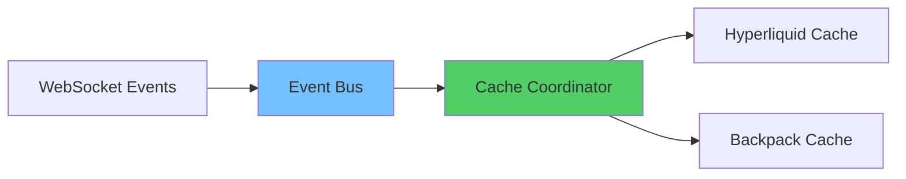
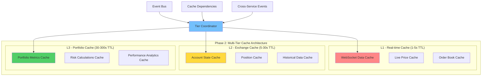
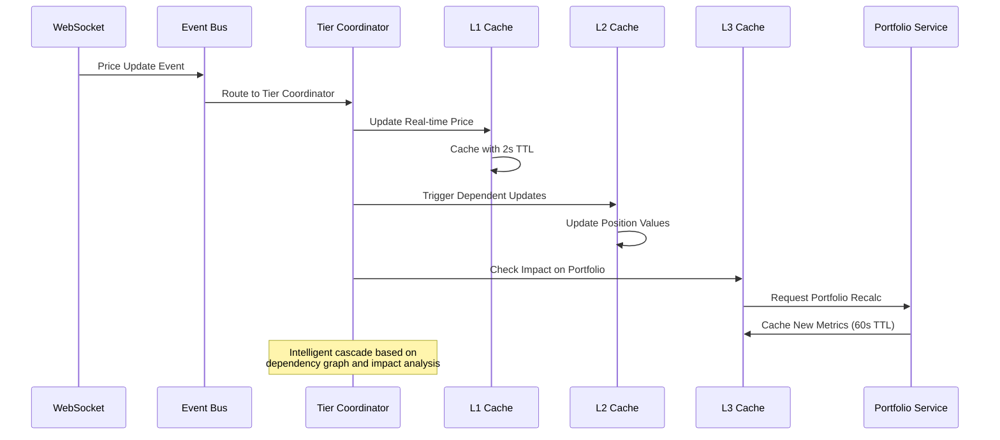
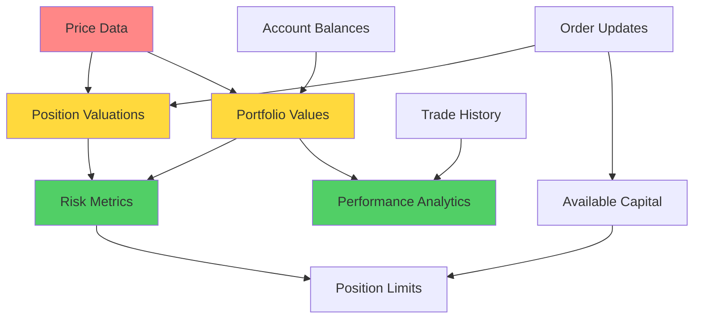

# Phase 2: Service Layer Integration - Multi-Tier Cache Architecture

## Executive Summary

Phase 2 extends the event-driven cache system from Phase 1 to integrate core services (Price Data, Portfolio Cache) and implement a multi-tier cache architecture. This phase introduces intelligent cache coordination across service boundaries and implements cross-service cache dependencies.

**Timeline:** 2-3 weeks
**Risk Level:** Medium (cross-service dependencies)
**Expected Performance Improvement:** 85%+ cache hit rate, 50% reduction in computed data recalculation

## Phase 1 Foundation Review

Building on Phase 1's event-driven API cache system:


## Phase 2 Architecture Design

### Multi-Tier Cache System Overview


### Service Integration Flow


### Cache Dependency Graph


## Module Structure

### Extended Code Tree
```
cyberdelta/
├── core/
│   ├── events/
│   │   ├── __init__.py
│   │   ├── event_bus.py                    # Enhanced with service events
│   │   ├── event_types.py                  # Extended event definitions
│   │   ├── dependency_graph.py             # Cache dependency management
│   │   └── tier_coordinator.py             # Multi-tier cache coordination
│   │
│   ├── cache/
│   │   ├── __init__.py
│   │   ├── tier_manager.py                 # Multi-tier cache manager
│   │   ├── cache_policy.py                 # TTL and eviction policies
│   │   ├── dependency_tracker.py           # Cross-cache dependencies
│   │   └── protocols.py                    # Enhanced cache protocols
│   │
│   └── portfolio/
│       ├── services/
│       │   └── cache/
│       │       ├── cache_service.py        # Enhanced with tier support
│       │       ├── portfolio_cache_coordinator.py  # Portfolio-specific coordination
│       │       └── cache_warming_service.py        # Proactive cache population
│       │
│       └── events/
│           ├── portfolio_events.py         # Portfolio-specific events
│           └── cache_events.py             # Portfolio cache events
│
├── services/
│   ├── price_data/
│   │   ├── price_cache_service.py          # Enhanced multi-tier price cache
│   │   ├── price_event_handler.py          # Price update event handling
│   │   └── cross_exchange_price_sync.py    # Price synchronization
│   │
│   └── market_data/
│       ├── market_cache_service.py         # Market data caching
│       └── market_event_adapter.py         # Market event processing
│
└── apis/
    ├── cache/
    │   ├── cache_coordinator.py            # Enhanced with tier support
    │   ├── invalidation_engine.py          # Multi-tier invalidation
    │   └── tier_invalidation_rules.py      # Tier-specific rules
    │
    └── websocket/
        ├── enhanced_ws_processor.py        # Enhanced with service events
        └── service_event_publishers/
            ├── price_event_publisher.py    # Price data event publishing
            └── portfolio_event_publisher.py # Portfolio event publishing
```

## Implementation Details

### 1. Multi-Tier Cache Manager

```python
# cyberdelta/core/cache/tier_manager.py
from __future__ import annotations

import asyncio
from typing import Dict, Any, Optional, List
from dataclasses import dataclass
from enum import Enum

from cyberdelta.config.structlog_config import get_logger
from cyberdelta.core.events.event_bus import CacheEvent
from cyberdelta.core.cache.protocols import TieredCacheProtocol

logger = get_logger(__name__)

class CacheTier(Enum):
    """Cache tier levels with different TTL strategies."""
    L1_REALTIME = "l1_realtime"      # 1-5s TTL
    L2_EXCHANGE = "l2_exchange"      # 5-30s TTL
    L3_PORTFOLIO = "l3_portfolio"    # 30-300s TTL

@dataclass
class TierPolicy:
    """Policy configuration for cache tiers."""
    tier: CacheTier
    default_ttl: float
    max_size: int
    eviction_strategy: str = "lru"
    warming_enabled: bool = False

class MultiTierCacheManager:
    """Manages multi-tier cache architecture with intelligent coordination."""

    def __init__(self) -> None:
        self._tiers: Dict[CacheTier, TieredCacheProtocol] = {}
        self._tier_policies = {
            CacheTier.L1_REALTIME: TierPolicy(
                tier=CacheTier.L1_REALTIME,
                default_ttl=2.0,  # 2 second TTL
                max_size=1000,
                warming_enabled=True
            ),
            CacheTier.L2_EXCHANGE: TierPolicy(
                tier=CacheTier.L2_EXCHANGE,
                default_ttl=15.0,  # 15 second TTL
                max_size=5000,
                warming_enabled=True
            ),
            CacheTier.L3_PORTFOLIO: TierPolicy(
                tier=CacheTier.L3_PORTFOLIO,
                default_ttl=120.0,  # 2 minute TTL
                max_size=2000,
                warming_enabled=False
            )
        }

    def register_tier_cache(self, tier: CacheTier, cache: TieredCacheProtocol) -> None:
        """Register a cache service for a specific tier."""
        self._tiers[tier] = cache
        logger.info("tier_cache_registered", tier=tier.value)

    async def get_from_tier(
        self,
        tier: CacheTier,
        key: str,
        fallback_tiers: List[CacheTier] | None = None
    ) -> Any:
        """Get value from specific tier with optional fallback."""
        cache = self._tiers.get(tier)
        if not cache:
            return None

        value = await cache.get(key)
        if value is not None:
            return value

        # Try fallback tiers if configured
        if fallback_tiers:
            for fallback_tier in fallback_tiers:
                fallback_cache = self._tiers.get(fallback_tier)
                if fallback_cache:
                    value = await fallback_cache.get(key)
                    if value is not None:
                        # Promote to higher tier
                        await self.set_in_tier(tier, key, value)
                        return value

        return None

    async def set_in_tier(
        self,
        tier: CacheTier,
        key: str,
        value: Any,
        ttl: Optional[float] = None
    ) -> None:
        """Set value in specific tier."""
        cache = self._tiers.get(tier)
        if not cache:
            return

        policy = self._tier_policies[tier]
        effective_ttl = ttl or policy.default_ttl

        await cache.set(key, value, ttl=effective_ttl)
        logger.debug("tier_cache_set", tier=tier.value, key=key, ttl=effective_ttl)

    async def invalidate_across_tiers(
        self,
        key_pattern: str,
        tiers: List[CacheTier] | None = None
    ) -> None:
        """Invalidate keys across multiple tiers."""
        target_tiers = tiers or list(self._tiers.keys())

        for tier in target_tiers:
            cache = self._tiers.get(tier)
            if cache:
                await cache.invalidate_pattern(key_pattern)

        logger.debug("cross_tier_invalidation",
                    pattern=key_pattern,
                    tiers=[t.value for t in target_tiers])
```

### 2. Tier Coordinator with Dependency Management

```python
# cyberdelta/core/events/tier_coordinator.py
from __future__ import annotations

from typing import Dict, List, Set, Any
from dataclasses import dataclass

from cyberdelta.core.events.event_bus import CacheEvent, EventHandler
from cyberdelta.core.cache.tier_manager import MultiTierCacheManager, CacheTier
from cyberdelta.core.events.dependency_graph import CacheDependencyGraph
from cyberdelta.config.structlog_config import get_logger

logger = get_logger(__name__)

@dataclass
class TierInvalidationPlan:
    """Plan for invalidating caches across tiers."""
    immediate_invalidations: Dict[CacheTier, List[str]]  # Keys to invalidate immediately
    cascading_updates: Dict[CacheTier, List[str]]        # Keys to update via cascade
    warming_candidates: Dict[CacheTier, List[str]]       # Keys to warm proactively

class TierCoordinator(EventHandler):
    """Coordinates cache operations across multiple tiers with dependency awareness."""

    def __init__(
        self,
        tier_manager: MultiTierCacheManager,
        dependency_graph: CacheDependencyGraph
    ) -> None:
        self.tier_manager = tier_manager
        self.dependency_graph = dependency_graph

    async def handle(self, event: CacheEvent) -> None:
        """Handle events with multi-tier coordination."""
        try:
            # Create tier-aware invalidation plan
            plan = self._create_tier_invalidation_plan(event)

            # Execute plan across tiers
            await self._execute_tier_plan(plan, event)

            logger.debug("tier_coordination_completed",
                        event_type=event.event_type.value,
                        affected_tiers=list(plan.immediate_invalidations.keys()))

        except Exception as e:
            logger.exception("tier_coordination_error",
                           event_type=event.event_type.value,
                           error=str(e))

    def _create_tier_invalidation_plan(self, event: CacheEvent) -> TierInvalidationPlan:
        """Create intelligent invalidation plan based on event and dependencies."""
        plan = TierInvalidationPlan(
            immediate_invalidations={},
            cascading_updates={},
            warming_candidates={}
        )

        # Determine primary affected tier based on event type
        primary_tier = self._get_primary_tier_for_event(event)

        # Get dependency chain
        affected_keys = self._get_affected_keys(event)
        dependent_keys = self.dependency_graph.get_dependent_keys(affected_keys)

        # Plan immediate invalidations for primary tier
        plan.immediate_invalidations[primary_tier] = affected_keys

        # Plan cascading updates for dependent tiers
        for dep_key in dependent_keys:
            dep_tier = self._get_tier_for_key(dep_key)
            if dep_tier not in plan.cascading_updates:
                plan.cascading_updates[dep_tier] = []
            plan.cascading_updates[dep_tier].append(dep_key)

        # Plan cache warming for frequently accessed items
        warming_keys = self._get_warming_candidates(event)
        for tier in [CacheTier.L1_REALTIME, CacheTier.L2_EXCHANGE]:
            if warming_keys:
                plan.warming_candidates[tier] = warming_keys

        return plan

    def _get_primary_tier_for_event(self, event: CacheEvent) -> CacheTier:
        """Determine primary cache tier affected by event."""
        if event.event_type.value in ["price_updated", "order_book_updated"]:
            return CacheTier.L1_REALTIME
        elif event.event_type.value in ["position_updated", "balance_changed"]:
            return CacheTier.L2_EXCHANGE
        else:
            return CacheTier.L3_PORTFOLIO

    def _get_affected_keys(self, event: CacheEvent) -> List[str]:
        """Get cache keys directly affected by event."""
        keys = []

        if event.symbol:
            keys.append(f"{event.exchange}:{event.symbol}")
        if event.user_id:
            keys.append(f"{event.exchange}:{event.user_id}")

        return keys

    def _get_tier_for_key(self, key: str) -> CacheTier:
        """Determine appropriate tier for a cache key."""
        if "price" in key or "orderbook" in key:
            return CacheTier.L1_REALTIME
        elif "position" in key or "balance" in key:
            return CacheTier.L2_EXCHANGE
        else:
            return CacheTier.L3_PORTFOLIO

    def _get_warming_candidates(self, event: CacheEvent) -> List[str]:
        """Get keys that should be warmed based on event."""
        # Implement intelligent warming based on access patterns
        # This would be enhanced with ML/analytics in production
        candidates = []

        if event.symbol:
            # Warm related symbols or correlated assets
            candidates.append(f"related:{event.symbol}")

        return candidates

    async def _execute_tier_plan(self, plan: TierInvalidationPlan, event: CacheEvent) -> None:
        """Execute the tier invalidation plan."""
        # Execute immediate invalidations
        for tier, keys in plan.immediate_invalidations.items():
            for key in keys:
                await self.tier_manager.invalidate_across_tiers(key, [tier])

        # Execute cascading updates
        for tier, keys in plan.cascading_updates.items():
            for key in keys:
                # Trigger refresh rather than invalidation for cascades
                await self._trigger_cascade_refresh(tier, key, event)

        # Execute warming
        for tier, keys in plan.warming_candidates.items():
            for key in keys:
                await self._warm_cache_key(tier, key, event)

    async def _trigger_cascade_refresh(
        self,
        tier: CacheTier,
        key: str,
        event: CacheEvent
    ) -> None:
        """Trigger a cascade refresh for dependent cache entries."""
        # This would trigger background refresh of dependent calculations
        logger.debug("cascade_refresh_triggered", tier=tier.value, key=key)

    async def _warm_cache_key(
        self,
        tier: CacheTier,
        key: str,
        event: CacheEvent
    ) -> None:
        """Warm cache with predictive data."""
        # This would proactively populate cache with likely-needed data
        logger.debug("cache_warming_triggered", tier=tier.value, key=key)
```

### 3. Enhanced Portfolio Cache Service

```python
# cyberdelta/core/portfolio/services/cache/portfolio_cache_coordinator.py
from __future__ import annotations

import asyncio
from typing import Dict, Any, Optional, List
from decimal import Decimal

from cyberdelta.core.cache.tier_manager import MultiTierCacheManager, CacheTier
from cyberdelta.core.events.event_bus import CacheEvent, EventHandler, EventType
from cyberdelta.core.portfolio.portfolio_types.portfolio_data_models import (
    PortfolioSummary, CacheStatistics
)
from cyberdelta.config.structlog_config import get_logger

logger = get_logger(__name__)

class PortfolioCacheCoordinator(EventHandler):
    """Coordinates portfolio-specific caching across multiple tiers."""

    def __init__(self, tier_manager: MultiTierCacheManager) -> None:
        self.tier_manager = tier_manager
        self._computation_cache: Dict[str, Any] = {}
        self._lock = asyncio.Lock()

    async def handle(self, event: CacheEvent) -> None:
        """Handle portfolio-related cache events."""
        try:
            if event.event_type in [EventType.POSITION_UPDATED, EventType.BALANCE_CHANGED]:
                await self._handle_portfolio_impact_event(event)
            elif event.event_type == EventType.PRICE_UPDATED:
                await self._handle_price_impact_event(event)

        except Exception as e:
            logger.exception("portfolio_cache_coordination_error",
                           event_type=event.event_type.value,
                           error=str(e))

    async def _handle_portfolio_impact_event(self, event: CacheEvent) -> None:
        """Handle events that directly impact portfolio calculations."""
        # Invalidate affected portfolio metrics
        user_key = f"portfolio_summary:{event.user_id}"
        await self.tier_manager.invalidate_across_tiers(
            user_key,
            [CacheTier.L2_EXCHANGE, CacheTier.L3_PORTFOLIO]
        )

        # Trigger background recalculation for commonly accessed metrics
        await self._schedule_portfolio_recalculation(event.user_id, event.exchange)

    async def _handle_price_impact_event(self, event: CacheEvent) -> None:
        """Handle price updates that affect portfolio valuations."""
        # Invalidate position valuations for affected symbol
        if event.symbol:
            pattern = f"position_value:{event.exchange}:{event.symbol}:*"
            await self.tier_manager.invalidate_across_tiers(
                pattern,
                [CacheTier.L1_REALTIME, CacheTier.L2_EXCHANGE]
            )

    async def get_portfolio_summary(
        self,
        user_id: str,
        exchange: str,
        force_refresh: bool = False
    ) -> Optional[PortfolioSummary]:
        """Get portfolio summary with intelligent tier fallback."""
        cache_key = f"portfolio_summary:{exchange}:{user_id}"

        if not force_refresh:
            # Try L3 cache first (longest TTL for computed data)
            summary = await self.tier_manager.get_from_tier(
                CacheTier.L3_PORTFOLIO,
                cache_key,
                fallback_tiers=[CacheTier.L2_EXCHANGE]
            )

            if summary:
                return summary

        # Compute fresh summary
        summary = await self._compute_portfolio_summary(user_id, exchange)

        if summary:
            # Cache in L3 with longer TTL for expensive computations
            await self.tier_manager.set_in_tier(
                CacheTier.L3_PORTFOLIO,
                cache_key,
                summary,
                ttl=180.0  # 3 minute TTL for portfolio summary
            )

        return summary

    async def get_position_value(
        self,
        user_id: str,
        exchange: str,
        symbol: str
    ) -> Optional[Decimal]:
        """Get position value with real-time price integration."""
        cache_key = f"position_value:{exchange}:{symbol}:{user_id}"

        # Try L2 cache first for position values
        value = await self.tier_manager.get_from_tier(
            CacheTier.L2_EXCHANGE,
            cache_key,
            fallback_tiers=[CacheTier.L1_REALTIME]
        )

        if value:
            return value

        # Compute fresh value using real-time price
        value = await self._compute_position_value(user_id, exchange, symbol)

        if value:
            # Cache in L2 with moderate TTL
            await self.tier_manager.set_in_tier(
                CacheTier.L2_EXCHANGE,
                cache_key,
                value,
                ttl=30.0  # 30 second TTL for position values
            )

        return value

    async def _compute_portfolio_summary(
        self,
        user_id: str,
        exchange: str
    ) -> Optional[PortfolioSummary]:
        """Compute portfolio summary from underlying data."""
        # This would integrate with actual portfolio calculation services
        logger.debug("computing_portfolio_summary", user_id=user_id, exchange=exchange)
        # Implementation would call actual portfolio services
        return None

    async def _compute_position_value(
        self,
        user_id: str,
        exchange: str,
        symbol: str
    ) -> Optional[Decimal]:
        """Compute position value using current price and position size."""
        # This would integrate with position and price services
        logger.debug("computing_position_value",
                    user_id=user_id,
                    exchange=exchange,
                    symbol=symbol)
        # Implementation would call position and price services
        return None

    async def _schedule_portfolio_recalculation(
        self,
        user_id: Optional[str],
        exchange: str
    ) -> None:
        """Schedule background portfolio recalculation."""
        if user_id:
            # Schedule background task to recalculate and warm cache
            asyncio.create_task(
                self._background_portfolio_calculation(user_id, exchange)
            )

    async def _background_portfolio_calculation(
        self,
        user_id: str,
        exchange: str
    ) -> None:
        """Background task for portfolio recalculation."""
        try:
            # Small delay to avoid overwhelming during burst events
            await asyncio.sleep(1.0)

            # Recalculate and cache
            summary = await self.get_portfolio_summary(
                user_id,
                exchange,
                force_refresh=True
            )

            logger.debug("background_portfolio_calculation_completed",
                        user_id=user_id,
                        exchange=exchange,
                        success=summary is not None)

        except Exception as e:
            logger.exception("background_portfolio_calculation_error",
                           user_id=user_id,
                           exchange=exchange,
                           error=str(e))
```

### 4. Enhanced Price Data Service

```python
# cyberdelta/services/price_data/price_cache_service.py
from __future__ import annotations

import time
from typing import Dict, Any, Optional, List
from decimal import Decimal

from cyberdelta.core.cache.tier_manager import MultiTierCacheManager, CacheTier
from cyberdelta.core.events.event_bus import CacheEvent, EventHandler, EventType
from cyberdelta.config.structlog_config import get_logger

logger = get_logger(__name__)

class EnhancedPriceDataCacheService(EventHandler):
    """Enhanced price data service with multi-tier caching."""

    def __init__(self, tier_manager: MultiTierCacheManager) -> None:
        self.tier_manager = tier_manager
        self._price_subscriptions: Dict[str, List[str]] = {}  # symbol -> users

    async def handle(self, event: CacheEvent) -> None:
        """Handle price-related events."""
        if event.event_type == EventType.PRICE_UPDATED:
            await self._handle_price_update(event)

    async def get_current_price(
        self,
        exchange: str,
        symbol: str,
        max_age_seconds: float = 5.0
    ) -> Optional[Decimal]:
        """Get current price with intelligent tier fallback."""
        cache_key = f"price:{exchange}:{symbol}"

        # Try L1 cache first (real-time prices)
        price_data = await self.tier_manager.get_from_tier(
            CacheTier.L1_REALTIME,
            cache_key
        )

        if price_data:
            # Check if price is fresh enough
            age = time.time() - price_data.get('timestamp', 0)
            if age <= max_age_seconds:
                return Decimal(str(price_data['price']))

        # Try L2 cache with longer age tolerance
        price_data = await self.tier_manager.get_from_tier(
            CacheTier.L2_EXCHANGE,
            cache_key
        )

        if price_data:
            age = time.time() - price_data.get('timestamp', 0)
            if age <= max_age_seconds * 3:  # More tolerance for L2
                return Decimal(str(price_data['price']))

        # If no cached price available, trigger fetch
        return await self._fetch_and_cache_price(exchange, symbol)

    async def get_price_history(
        self,
        exchange: str,
        symbol: str,
        timeframe: str = "1h",
        limit: int = 100
    ) -> List[Dict[str, Any]]:
        """Get price history with L3 caching for historical data."""
        cache_key = f"price_history:{exchange}:{symbol}:{timeframe}:{limit}"

        # Historical data is perfect for L3 caching (longer TTL)
        history = await self.tier_manager.get_from_tier(
            CacheTier.L3_PORTFOLIO,
            cache_key
        )

        if history:
            return history

        # Fetch fresh historical data
        history = await self._fetch_price_history(exchange, symbol, timeframe, limit)

        if history:
            # Cache with longer TTL since historical data doesn't change
            await self.tier_manager.set_in_tier(
                CacheTier.L3_PORTFOLIO,
                cache_key,
                history,
                ttl=300.0  # 5 minute TTL for historical data
            )

        return history or []

    async def subscribe_to_price(self, exchange: str, symbol: str, user_id: str) -> None:
        """Subscribe user to price updates for intelligent cache warming."""
        key = f"{exchange}:{symbol}"
        if key not in self._price_subscriptions:
            self._price_subscriptions[key] = []

        if user_id not in self._price_subscriptions[key]:
            self._price_subscriptions[key].append(user_id)
            logger.debug("price_subscription_added",
                        exchange=exchange,
                        symbol=symbol,
                        user_id=user_id)

    async def _handle_price_update(self, event: CacheEvent) -> None:
        """Handle incoming price updates from WebSocket."""
        if not event.symbol:
            return

        price_data = {
            'price': event.data.get('price'),
            'timestamp': event.timestamp,
            'exchange': event.exchange,
            'symbol': event.symbol
        }

        cache_key = f"price:{event.exchange}:{event.symbol}"

        # Store in L1 cache with short TTL for real-time access
        await self.tier_manager.set_in_tier(
            CacheTier.L1_REALTIME,
            cache_key,
            price_data,
            ttl=2.0  # 2 second TTL for real-time prices
        )

        # Also store in L2 cache with longer TTL for fallback
        await self.tier_manager.set_in_tier(
            CacheTier.L2_EXCHANGE,
            cache_key,
            price_data,
            ttl=15.0  # 15 second TTL for L2 fallback
        )

        # Warm related caches if this price is widely subscribed
        await self._warm_related_caches(event)

    async def _warm_related_caches(self, event: CacheEvent) -> None:
        """Warm related caches based on price update."""
        key = f"{event.exchange}:{event.symbol}"
        subscribers = self._price_subscriptions.get(key, [])

        if len(subscribers) > 5:  # High-interest symbol
            # Pre-calculate position values for active subscribers
            for user_id in subscribers[:10]:  # Limit to prevent overload
                await self._warm_position_value_cache(
                    user_id,
                    event.exchange,
                    event.symbol,
                    event.data.get('price')
                )

    async def _warm_position_value_cache(
        self,
        user_id: str,
        exchange: str,
        symbol: str,
        current_price: Any
    ) -> None:
        """Warm position value cache with new price."""
        # This would integrate with position service to calculate updated values
        logger.debug("warming_position_value_cache",
                    user_id=user_id,
                    exchange=exchange,
                    symbol=symbol)

    async def _fetch_and_cache_price(
        self,
        exchange: str,
        symbol: str
    ) -> Optional[Decimal]:
        """Fetch fresh price and cache it."""
        # This would call actual exchange API
        logger.debug("fetching_fresh_price", exchange=exchange, symbol=symbol)
        return None

    async def _fetch_price_history(
        self,
        exchange: str,
        symbol: str,
        timeframe: str,
        limit: int
    ) -> Optional[List[Dict[str, Any]]]:
        """Fetch fresh price history."""
        # This would call actual exchange API
        logger.debug("fetching_price_history",
                    exchange=exchange,
                    symbol=symbol,
                    timeframe=timeframe,
                    limit=limit)
        return None
```

## Integration Plan

### Step 1: Multi-Tier Infrastructure (Week 1)
1. **Tier Manager Implementation**
   - Create multi-tier cache manager with L1/L2/L3 support
   - Implement tier policies and configuration
   - Add tier-aware coordination logic

2. **Dependency Graph System**
   - Build cache dependency tracking
   - Implement cascade invalidation rules
   - Create dependency impact analysis

### Step 2: Service Integration (Week 1-2)
1. **Portfolio Cache Enhancement**
   - Integrate portfolio services with tier manager
   - Implement portfolio-specific cache coordination
   - Add background calculation scheduling

2. **Price Data Service Integration**
   - Enhance price data service with multi-tier support
   - Implement price subscription and warming
   - Add historical data caching strategies

### Step 3: Cross-Service Coordination (Week 2)
1. **Event Flow Enhancement**
   - Extend event bus with service-level events
   - Implement cross-service cache dependencies
   - Add intelligent cascade timing

2. **Performance Optimization**
   - Implement cache warming strategies
   - Add predictive cache population
   - Optimize tier policies based on usage patterns

### Step 4: Testing & Validation (Week 2-3)
1. **Integration Testing**
   - Test multi-tier cache behavior
   - Validate dependency cascade accuracy
   - Test cache warming effectiveness

2. **Performance Validation**
   - Measure tier-specific hit rates
   - Monitor cascade efficiency
   - Validate memory usage across tiers

## Success Metrics

### Tier-Specific Targets
- **L1 Cache (Real-time)**: 95%+ hit rate for active symbols
- **L2 Cache (Exchange)**: 85%+ hit rate for account data
- **L3 Cache (Portfolio)**: 90%+ hit rate for computed metrics

### Cross-Service Coordination
- **Cascade Accuracy**: 98%+ correct dependency updates
- **Cache Warming Effectiveness**: 70%+ of warmed entries accessed
- **Cross-Service Sync**: <500ms for dependent cache updates

## Implementation Notes for v0.0.1

### Direct Implementation
- Implement multi-tier as the new standard approach
- No fallback mechanisms needed at this stage
- Keep it simple and straightforward

### Basic Safety
- Standard timeout limits (5 seconds) for all operations
- Simple error logging
- Focus on getting it working correctly

This Phase 2 implementation creates a sophisticated multi-tier cache architecture that intelligently coordinates across service boundaries while maintaining high performance and reliability.
