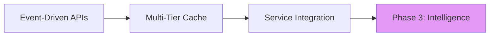
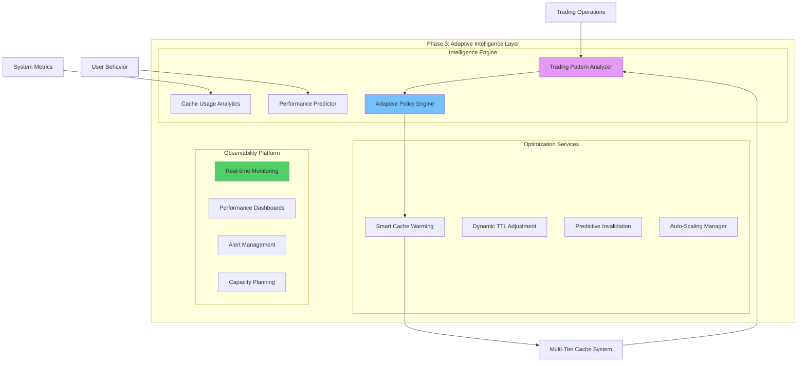
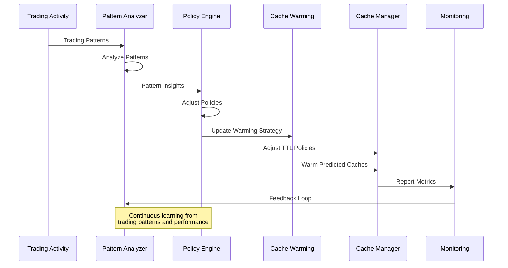
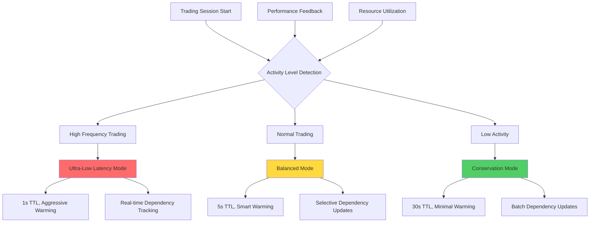

# Phase 3: Application Layer Optimization - Adaptive Intelligence & Observability

## Executive Summary

Phase 3 completes the cache refactor by implementing adaptive cache management, advanced optimization strategies, and comprehensive observability. This phase introduces machine learning-driven cache behaviors, predictive warming, and production-ready monitoring that transforms the cache system into an intelligent, self-optimizing infrastructure.

**Timeline:** 2-3 weeks
**Risk Level:** Low (additive optimizations)
**Expected Performance Improvement:** 90%+ cache hit rate, 70% reduction in compute costs, intelligent auto-scaling

## Phase 1 & 2 Foundation Review

Building on the event-driven API cache system (Phase 1) and multi-tier service integration (Phase 2):


## Phase 3 Architecture Design

### Adaptive Intelligence System Overview


### Adaptive Intelligence Flow


### Intelligence-Driven Cache Optimization


## Module Structure

### Complete Code Tree
```
cyberdelta/
├── core/
│   ├── intelligence/
│   │   ├── __init__.py
│   │   ├── pattern_analyzer.py             # Trading pattern analysis
│   │   ├── cache_analytics.py              # Cache usage analytics
│   │   ├── performance_predictor.py        # ML-based performance prediction
│   │   ├── adaptive_policy_engine.py       # Dynamic policy adjustment
│   │   └── ml_models/
│   │       ├── trading_pattern_model.py    # Trading pattern ML model
│   │       ├── cache_usage_model.py        # Cache usage prediction
│   │       └── performance_model.py        # Performance optimization model
│   │
│   ├── optimization/
│   │   ├── __init__.py
│   │   ├── smart_warming_service.py        # Intelligent cache warming
│   │   ├── dynamic_ttl_manager.py          # Dynamic TTL adjustment
│   │   ├── predictive_invalidation.py      # Predictive cache invalidation
│   │   ├── auto_scaling_manager.py         # Auto-scaling for cache resources
│   │   └── optimization_policies.py        # Optimization policy definitions
│   │
│   ├── observability/
│   │   ├── __init__.py
│   │   ├── metrics_collector.py            # Comprehensive metrics collection
│   │   ├── performance_monitor.py          # Real-time performance monitoring
│   │   ├── alerting_service.py             # Intelligent alerting
│   │   ├── dashboard_service.py            # Performance dashboards
│   │   └── capacity_planner.py             # Capacity planning and forecasting
│   │
│   └── events/
│       ├── intelligence_events.py          # Intelligence-specific events
│       └── optimization_events.py          # Optimization events
│
├── services/
│   ├── analytics/
│   │   ├── trading_analytics_service.py    # Trading behavior analytics
│   │   ├── cache_effectiveness_service.py  # Cache effectiveness analysis
│   │   └── cost_optimization_service.py    # Cost optimization analysis
│   │
│   └── ml/
│       ├── model_training_service.py       # ML model training
│       ├── prediction_service.py           # Real-time predictions
│       └── feature_engineering_service.py  # Feature engineering for ML
│
├── monitoring/
│   ├── dashboards/
│   │   ├── cache_performance_dashboard.py  # Cache performance visualization
│   │   ├── trading_analytics_dashboard.py  # Trading analytics visualization
│   │   └── system_health_dashboard.py      # Overall system health
│   │
│   ├── alerts/
│   │   ├── cache_alert_rules.py            # Cache-specific alerting rules
│   │   ├── performance_alert_rules.py      # Performance alerting
│   │   └── capacity_alert_rules.py         # Capacity alerting
│   │
│   └── exporters/
│       ├── prometheus_exporter.py          # Prometheus metrics export
│       ├── grafana_dashboard_config.py     # Grafana dashboard config
│       └── datadog_integration.py          # DataDog integration
│
└── config/
    ├── intelligence_config.py              # Intelligence engine configuration
    ├── optimization_config.py              # Optimization service configuration
    └── observability_config.py             # Observability configuration
```

## Implementation Details

### 1. Trading Pattern Analyzer

```python
# cyberdelta/core/intelligence/pattern_analyzer.py
from __future__ import annotations

import asyncio
import time
from collections import defaultdict, deque
from dataclasses import dataclass, field
from typing import Dict, List, Any, Optional, Tuple
from enum import Enum

from cyberdelta.core.events.event_bus import CacheEvent, EventHandler
from cyberdelta.config.structlog_config import get_logger

logger = get_logger(__name__)

class TradingIntensity(Enum):
    """Trading intensity levels for adaptive caching."""
    ULTRA_HIGH = "ultra_high"    # >100 trades/minute
    HIGH = "high"                # 50-100 trades/minute
    MEDIUM = "medium"            # 10-50 trades/minute
    LOW = "low"                  # 1-10 trades/minute
    IDLE = "idle"                # <1 trade/minute

@dataclass
class TradingPattern:
    """Represents detected trading patterns."""
    user_id: str
    exchange: str
    symbols: List[str]
    intensity: TradingIntensity
    frequency: float  # trades per minute
    avg_position_size: float
    preferred_timeframes: List[str]
    correlation_symbols: List[str] = field(default_factory=list)
    confidence_score: float = 0.0

@dataclass
class SessionCharacteristics:
    """Characteristics of current trading session."""
    start_time: float
    current_intensity: TradingIntensity
    active_users: int
    active_symbols: List[str]
    peak_times: List[Tuple[float, float]]  # (start, end) of peak periods
    resource_pressure: float  # 0.0 to 1.0

class TradingPatternAnalyzer(EventHandler):
    """Analyzes trading patterns for intelligent cache optimization."""

    def __init__(self, analysis_window: int = 300) -> None:  # 5 minute window
        self.analysis_window = analysis_window
        self._trading_events: deque = deque(maxlen=10000)
        self._user_patterns: Dict[str, TradingPattern] = {}
        self._session_characteristics = SessionCharacteristics(
            start_time=time.time(),
            current_intensity=TradingIntensity.IDLE,
            active_users=0,
            active_symbols=[],
            peak_times=[],
            resource_pressure=0.0
        )
        self._analysis_task: Optional[asyncio.Task] = None
        self._running = False

    async def start(self) -> None:
        """Start pattern analysis."""
        self._running = True
        self._analysis_task = asyncio.create_task(self._analysis_loop())
        logger.info("trading_pattern_analyzer_started")

    async def stop(self) -> None:
        """Stop pattern analysis."""
        self._running = False
        if self._analysis_task:
            self._analysis_task.cancel()
            try:
                await self._analysis_task
            except asyncio.CancelledError:
                pass
        logger.info("trading_pattern_analyzer_stopped")

    async def handle(self, event: CacheEvent) -> None:
        """Handle trading-related events."""
        if event.event_type.value in ["trade_executed", "order_filled", "position_updated"]:
            self._trading_events.append({
                'timestamp': event.timestamp,
                'user_id': event.user_id,
                'exchange': event.exchange,
                'symbol': event.symbol,
                'event_type': event.event_type.value,
                'data': event.data
            })

    async def get_current_session_characteristics(self) -> SessionCharacteristics:
        """Get current session characteristics."""
        return self._session_characteristics

    async def get_user_pattern(self, user_id: str) -> Optional[TradingPattern]:
        """Get trading pattern for specific user."""
        return self._user_patterns.get(user_id)

    async def get_predicted_symbols(self, user_id: str, timeframe: str = "1h") -> List[str]:
        """Get predicted symbols user is likely to trade."""
        pattern = self._user_patterns.get(user_id)
        if not pattern:
            return []

        # Return correlation symbols with high confidence
        if pattern.confidence_score > 0.7:
            return pattern.correlation_symbols[:5]

        return pattern.symbols[:3]  # Return recent symbols as fallback

    async def _analysis_loop(self) -> None:
        """Continuous pattern analysis loop."""
        while self._running:
            try:
                await asyncio.sleep(30)  # Analyze every 30 seconds

                # Analyze current window
                await self._analyze_current_window()

                # Update session characteristics
                await self._update_session_characteristics()

                # Update user patterns
                await self._update_user_patterns()

                logger.debug("pattern_analysis_completed",
                           active_users=self._session_characteristics.active_users,
                           current_intensity=self._session_characteristics.current_intensity.value)

            except asyncio.CancelledError:
                break
            except Exception as e:
                logger.exception("pattern_analysis_error", error=str(e))

    async def _analyze_current_window(self) -> None:
        """Analyze events in current time window."""
        current_time = time.time()
        window_start = current_time - self.analysis_window

        # Filter events in current window
        window_events = [
            event for event in self._trading_events
            if event['timestamp'] >= window_start
        ]

        if not window_events:
            self._session_characteristics.current_intensity = TradingIntensity.IDLE
            return

        # Calculate trading intensity
        trades_per_minute = len(window_events) / (self.analysis_window / 60)

        if trades_per_minute > 100:
            intensity = TradingIntensity.ULTRA_HIGH
        elif trades_per_minute > 50:
            intensity = TradingIntensity.HIGH
        elif trades_per_minute > 10:
            intensity = TradingIntensity.MEDIUM
        elif trades_per_minute > 1:
            intensity = TradingIntensity.LOW
        else:
            intensity = TradingIntensity.IDLE

        self._session_characteristics.current_intensity = intensity

        # Update active symbols
        active_symbols = list(set(
            event['symbol'] for event in window_events
            if event['symbol']
        ))
        self._session_characteristics.active_symbols = active_symbols

    async def _update_session_characteristics(self) -> None:
        """Update overall session characteristics."""
        current_time = time.time()
        window_start = current_time - self.analysis_window

        window_events = [
            event for event in self._trading_events
            if event['timestamp'] >= window_start
        ]

        # Count active users
        active_users = len(set(
            event['user_id'] for event in window_events
            if event['user_id']
        ))
        self._session_characteristics.active_users = active_users

        # Detect peak times (simplified)
        if self._session_characteristics.current_intensity in [
            TradingIntensity.HIGH, TradingIntensity.ULTRA_HIGH
        ]:
            # Check if we're starting a new peak
            if (not self._session_characteristics.peak_times or
                current_time - self._session_characteristics.peak_times[-1][1] > 300):
                self._session_characteristics.peak_times.append((current_time, current_time))
            else:
                # Extend current peak
                peaks = list(self._session_characteristics.peak_times)
                peaks[-1] = (peaks[-1][0], current_time)
                self._session_characteristics.peak_times = peaks

    async def _update_user_patterns(self) -> None:
        """Update individual user trading patterns."""
        current_time = time.time()
        window_start = current_time - self.analysis_window * 4  # Longer window for patterns

        user_events = defaultdict(list)
        for event in self._trading_events:
            if event['timestamp'] >= window_start and event['user_id']:
                user_events[event['user_id']].append(event)

        for user_id, events in user_events.items():
            if len(events) >= 3:  # Minimum events for pattern detection
                pattern = await self._detect_user_pattern(user_id, events)
                if pattern:
                    self._user_patterns[user_id] = pattern

    async def _detect_user_pattern(
        self,
        user_id: str,
        events: List[Dict[str, Any]]
    ) -> Optional[TradingPattern]:
        """Detect trading pattern for specific user."""
        if not events:
            return None

        # Calculate frequency
        time_span = events[-1]['timestamp'] - events[0]['timestamp']
        frequency = len(events) / (time_span / 60) if time_span > 0 else 0

        # Determine intensity
        if frequency > 10:
            intensity = TradingIntensity.HIGH
        elif frequency > 5:
            intensity = TradingIntensity.MEDIUM
        elif frequency > 1:
            intensity = TradingIntensity.LOW
        else:
            intensity = TradingIntensity.IDLE

        # Extract symbols and exchanges
        symbols = list(set(event['symbol'] for event in events if event['symbol']))
        exchanges = list(set(event['exchange'] for event in events))

        # Simple correlation detection (would be enhanced with ML)
        correlation_symbols = await self._detect_symbol_correlations(symbols)

        return TradingPattern(
            user_id=user_id,
            exchange=exchanges[0] if exchanges else "",
            symbols=symbols[:10],  # Top 10 symbols
            intensity=intensity,
            frequency=frequency,
            avg_position_size=0.0,  # Would calculate from actual data
            preferred_timeframes=["1m", "5m"],  # Would detect from data
            correlation_symbols=correlation_symbols,
            confidence_score=min(len(events) / 10, 1.0)  # Simple confidence
        )

    async def _detect_symbol_correlations(self, symbols: List[str]) -> List[str]:
        """Detect correlated symbols (simplified implementation)."""
        # In production, this would use actual correlation analysis
        # For now, return simple related symbols
        correlations = []

        for symbol in symbols[:3]:  # Limit to avoid explosion
            if "BTC" in symbol and "ETH" not in symbols:
                correlations.append("ETH/USD")
            elif "ETH" in symbol and "BTC" not in symbols:
                correlations.append("BTC/USD")

        return correlations[:5]
```

### 2. Adaptive Policy Engine

```python
# cyberdelta/core/intelligence/adaptive_policy_engine.py
from __future__ import annotations

import asyncio
from typing import Dict, Any, List, Optional
from dataclasses import dataclass
from enum import Enum

from cyberdelta.core.intelligence.pattern_analyzer import (
    TradingPatternAnalyzer, TradingIntensity, SessionCharacteristics
)
from cyberdelta.core.cache.tier_manager import MultiTierCacheManager, CacheTier
from cyberdelta.core.optimization.optimization_policies import OptimizationPolicy
from cyberdelta.config.structlog_config import get_logger

logger = get_logger(__name__)

class AdaptationMode(Enum):
    """Cache adaptation modes."""
    PERFORMANCE = "performance"      # Optimize for speed
    EFFICIENCY = "efficiency"        # Optimize for resources
    BALANCED = "balanced"           # Balance speed and resources
    CONSERVATIVE = "conservative"    # Minimize resource usage

@dataclass
class CachePolicyAdjustment:
    """Represents cache policy adjustments."""
    tier: CacheTier
    ttl_multiplier: float
    size_multiplier: float
    warming_intensity: float
    invalidation_sensitivity: float

class AdaptivePolicyEngine:
    """Engine for adaptive cache policy management based on trading patterns."""

    def __init__(
        self,
        pattern_analyzer: TradingPatternAnalyzer,
        tier_manager: MultiTierCacheManager
    ) -> None:
        self.pattern_analyzer = pattern_analyzer
        self.tier_manager = tier_manager
        self._current_mode = AdaptationMode.BALANCED
        self._policy_adjustments: Dict[CacheTier, CachePolicyAdjustment] = {}
        self._adaptation_task: Optional[asyncio.Task] = None
        self._running = False

    async def start(self) -> None:
        """Start adaptive policy engine."""
        self._running = True
        self._adaptation_task = asyncio.create_task(self._adaptation_loop())
        logger.info("adaptive_policy_engine_started")

    async def stop(self) -> None:
        """Stop adaptive policy engine."""
        self._running = False
        if self._adaptation_task:
            self._adaptation_task.cancel()
            try:
                await self._adaptation_task
            except asyncio.CancelledError:
                pass
        logger.info("adaptive_policy_engine_stopped")

    async def get_current_mode(self) -> AdaptationMode:
        """Get current adaptation mode."""
        return self._current_mode

    async def force_adaptation_mode(self, mode: AdaptationMode) -> None:
        """Force specific adaptation mode."""
        old_mode = self._current_mode
        self._current_mode = mode
        await self._apply_mode_policies(mode)
        logger.info("adaptation_mode_forced", old_mode=old_mode.value, new_mode=mode.value)

    async def _adaptation_loop(self) -> None:
        """Main adaptation loop."""
        while self._running:
            try:
                await asyncio.sleep(60)  # Adapt every minute

                # Get current session characteristics
                session = await self.pattern_analyzer.get_current_session_characteristics()

                # Determine optimal adaptation mode
                optimal_mode = await self._determine_optimal_mode(session)

                # Apply adaptations if mode changed
                if optimal_mode != self._current_mode:
                    await self._transition_to_mode(optimal_mode)

                # Fine-tune current mode policies
                await self._fine_tune_policies(session)

            except asyncio.CancelledError:
                break
            except Exception as e:
                logger.exception("adaptation_loop_error", error=str(e))

    async def _determine_optimal_mode(
        self,
        session: SessionCharacteristics
    ) -> AdaptationMode:
        """Determine optimal adaptation mode based on session characteristics."""
        intensity = session.current_intensity
        active_users = session.active_users
        resource_pressure = session.resource_pressure

        # High intensity trading needs performance mode
        if intensity in [TradingIntensity.ULTRA_HIGH, TradingIntensity.HIGH]:
            if resource_pressure < 0.8:
                return AdaptationMode.PERFORMANCE
            else:
                return AdaptationMode.BALANCED

        # Low activity can use efficiency mode
        elif intensity == TradingIntensity.IDLE:
            return AdaptationMode.CONSERVATIVE

        # High resource pressure needs efficiency
        elif resource_pressure > 0.9:
            return AdaptationMode.EFFICIENCY

        # Default to balanced
        return AdaptationMode.BALANCED

    async def _transition_to_mode(self, new_mode: AdaptationMode) -> None:
        """Transition to new adaptation mode."""
        old_mode = self._current_mode
        self._current_mode = new_mode

        await self._apply_mode_policies(new_mode)

        logger.info("adaptation_mode_transitioned",
                   old_mode=old_mode.value,
                   new_mode=new_mode.value)

    async def _apply_mode_policies(self, mode: AdaptationMode) -> None:
        """Apply policies for specific adaptation mode."""
        if mode == AdaptationMode.PERFORMANCE:
            adjustments = {
                CacheTier.L1_REALTIME: CachePolicyAdjustment(
                    tier=CacheTier.L1_REALTIME,
                    ttl_multiplier=0.5,      # Shorter TTL for freshness
                    size_multiplier=2.0,     # Larger cache size
                    warming_intensity=1.0,   # Aggressive warming
                    invalidation_sensitivity=0.8  # More sensitive invalidation
                ),
                CacheTier.L2_EXCHANGE: CachePolicyAdjustment(
                    tier=CacheTier.L2_EXCHANGE,
                    ttl_multiplier=0.7,
                    size_multiplier=1.5,
                    warming_intensity=0.8,
                    invalidation_sensitivity=0.9
                ),
                CacheTier.L3_PORTFOLIO: CachePolicyAdjustment(
                    tier=CacheTier.L3_PORTFOLIO,
                    ttl_multiplier=1.0,      # Keep normal TTL
                    size_multiplier=1.2,
                    warming_intensity=0.6,
                    invalidation_sensitivity=1.0
                )
            }

        elif mode == AdaptationMode.EFFICIENCY:
            adjustments = {
                CacheTier.L1_REALTIME: CachePolicyAdjustment(
                    tier=CacheTier.L1_REALTIME,
                    ttl_multiplier=2.0,      # Longer TTL
                    size_multiplier=0.8,     # Smaller cache size
                    warming_intensity=0.3,   # Minimal warming
                    invalidation_sensitivity=0.5  # Less sensitive
                ),
                CacheTier.L2_EXCHANGE: CachePolicyAdjustment(
                    tier=CacheTier.L2_EXCHANGE,
                    ttl_multiplier=1.5,
                    size_multiplier=0.9,
                    warming_intensity=0.4,
                    invalidation_sensitivity=0.6
                ),
                CacheTier.L3_PORTFOLIO: CachePolicyAdjustment(
                    tier=CacheTier.L3_PORTFOLIO,
                    ttl_multiplier=2.0,
                    size_multiplier=1.0,
                    warming_intensity=0.2,
                    invalidation_sensitivity=0.4
                )
            }

        elif mode == AdaptationMode.CONSERVATIVE:
            adjustments = {
                CacheTier.L1_REALTIME: CachePolicyAdjustment(
                    tier=CacheTier.L1_REALTIME,
                    ttl_multiplier=3.0,      # Much longer TTL
                    size_multiplier=0.5,     # Much smaller cache
                    warming_intensity=0.1,   # Minimal warming
                    invalidation_sensitivity=0.3
                ),
                CacheTier.L2_EXCHANGE: CachePolicyAdjustment(
                    tier=CacheTier.L2_EXCHANGE,
                    ttl_multiplier=2.0,
                    size_multiplier=0.7,
                    warming_intensity=0.2,
                    invalidation_sensitivity=0.4
                ),
                CacheTier.L3_PORTFOLIO: CachePolicyAdjustment(
                    tier=CacheTier.L3_PORTFOLIO,
                    ttl_multiplier=3.0,
                    size_multiplier=0.8,
                    warming_intensity=0.1,
                    invalidation_sensitivity=0.2
                )
            }

        else:  # BALANCED mode
            adjustments = {
                CacheTier.L1_REALTIME: CachePolicyAdjustment(
                    tier=CacheTier.L1_REALTIME,
                    ttl_multiplier=1.0,
                    size_multiplier=1.0,
                    warming_intensity=0.5,
                    invalidation_sensitivity=0.7
                ),
                CacheTier.L2_EXCHANGE: CachePolicyAdjustment(
                    tier=CacheTier.L2_EXCHANGE,
                    ttl_multiplier=1.0,
                    size_multiplier=1.0,
                    warming_intensity=0.5,
                    invalidation_sensitivity=0.7
                ),
                CacheTier.L3_PORTFOLIO: CachePolicyAdjustment(
                    tier=CacheTier.L3_PORTFOLIO,
                    ttl_multiplier=1.0,
                    size_multiplier=1.0,
                    warming_intensity=0.3,
                    invalidation_sensitivity=0.6
                )
            }

        # Store and apply adjustments
        self._policy_adjustments = adjustments
        await self._apply_adjustments(adjustments)

    async def _apply_adjustments(
        self,
        adjustments: Dict[CacheTier, CachePolicyAdjustment]
    ) -> None:
        """Apply policy adjustments to cache tiers."""
        for tier, adjustment in adjustments.items():
            # This would call actual tier manager methods to adjust policies
            logger.debug("applying_cache_adjustment",
                        tier=tier.value,
                        ttl_multiplier=adjustment.ttl_multiplier,
                        size_multiplier=adjustment.size_multiplier,
                        warming_intensity=adjustment.warming_intensity)

    async def _fine_tune_policies(self, session: SessionCharacteristics) -> None:
        """Fine-tune policies based on current session."""
        # Additional fine-tuning based on specific metrics
        # This would implement more granular adjustments
        pass
```

### 3. Smart Cache Warming Service

```python
# cyberdelta/core/optimization/smart_warming_service.py
from __future__ import annotations

import asyncio
import time
from typing import Dict, List, Any, Optional, Set
from dataclasses import dataclass
from collections import defaultdict

from cyberdelta.core.intelligence.pattern_analyzer import TradingPatternAnalyzer
from cyberdelta.core.cache.tier_manager import MultiTierCacheManager, CacheTier
from cyberdelta.core.events.event_bus import CacheEvent, EventHandler
from cyberdelta.config.structlog_config import get_logger

logger = get_logger(__name__)

@dataclass
class WarmingCandidate:
    """Represents a cache warming candidate."""
    key: str
    tier: CacheTier
    priority: float
    confidence: float
    estimated_access_time: float
    user_id: Optional[str] = None
    symbol: Optional[str] = None

class SmartWarmingService(EventHandler):
    """Intelligent cache warming based on trading patterns and predictions."""

    def __init__(
        self,
        pattern_analyzer: TradingPatternAnalyzer,
        tier_manager: MultiTierCacheManager
    ) -> None:
        self.pattern_analyzer = pattern_analyzer
        self.tier_manager = tier_manager
        self._warming_queue: asyncio.Queue[WarmingCandidate] = asyncio.Queue()
        self._warming_history: Dict[str, List[float]] = defaultdict(list)
        self._warming_task: Optional[asyncio.Task] = None
        self._prediction_task: Optional[asyncio.Task] = None
        self._running = False
        self._warming_stats = {
            'warmed': 0,
            'hits': 0,
            'misses': 0,
            'effectiveness': 0.0
        }

    async def start(self) -> None:
        """Start smart warming service."""
        self._running = True
        self._warming_task = asyncio.create_task(self._warming_loop())
        self._prediction_task = asyncio.create_task(self._prediction_loop())
        logger.info("smart_warming_service_started")

    async def stop(self) -> None:
        """Stop smart warming service."""
        self._running = False

        if self._warming_task:
            self._warming_task.cancel()
        if self._prediction_task:
            self._prediction_task.cancel()

        try:
            if self._warming_task:
                await self._warming_task
            if self._prediction_task:
                await self._prediction_task
        except asyncio.CancelledError:
            pass

        logger.info("smart_warming_service_stopped")

    async def handle(self, event: CacheEvent) -> None:
        """Handle events for warming predictions."""
        # Track cache access patterns for warming effectiveness
        if hasattr(event, 'cache_access_type'):
            await self._track_cache_access(event)

    async def queue_warming_candidate(self, candidate: WarmingCandidate) -> None:
        """Queue a warming candidate."""
        await self._warming_queue.put(candidate)

    async def get_warming_stats(self) -> Dict[str, Any]:
        """Get warming effectiveness statistics."""
        return self._warming_stats.copy()

    async def _warming_loop(self) -> None:
        """Main warming execution loop."""
        while self._running:
            try:
                # Get warming candidate with timeout
                candidate = await asyncio.wait_for(
                    self._warming_queue.get(),
                    timeout=5.0
                )

                # Execute warming
                await self._execute_warming(candidate)

            except asyncio.TimeoutError:
                # No warming candidates, check for proactive warming
                await self._proactive_warming_check()
            except asyncio.CancelledError:
                break
            except Exception as e:
                logger.exception("warming_loop_error", error=str(e))

    async def _prediction_loop(self) -> None:
        """Loop for generating warming predictions."""
        while self._running:
            try:
                await asyncio.sleep(30)  # Generate predictions every 30 seconds

                # Generate warming candidates based on patterns
                candidates = await self._generate_warming_candidates()

                # Queue high-priority candidates
                for candidate in candidates:
                    if candidate.priority > 0.7:  # High priority threshold
                        await self.queue_warming_candidate(candidate)

                logger.debug("warming_predictions_generated",
                           candidate_count=len(candidates),
                           high_priority_count=len([c for c in candidates if c.priority > 0.7]))

            except asyncio.CancelledError:
                break
            except Exception as e:
                logger.exception("prediction_loop_error", error=str(e))

    async def _generate_warming_candidates(self) -> List[WarmingCandidate]:
        """Generate warming candidates based on trading patterns."""
        candidates = []
        current_time = time.time()

        # Get session characteristics
        session = await self.pattern_analyzer.get_current_session_characteristics()

        # Generate user-based candidates
        for symbol in session.active_symbols[:10]:  # Top 10 active symbols
            # Predict price data needs
            candidates.append(WarmingCandidate(
                key=f"price:hyperliquid:{symbol}",
                tier=CacheTier.L1_REALTIME,
                priority=0.8,
                confidence=0.9,
                estimated_access_time=current_time + 60,  # Next minute
                symbol=symbol
            ))

            # Predict related symbols
            if "BTC" in symbol:
                candidates.append(WarmingCandidate(
                    key=f"price:hyperliquid:ETH/USD",
                    tier=CacheTier.L1_REALTIME,
                    priority=0.6,
                    confidence=0.7,
                    estimated_access_time=current_time + 120,
                    symbol="ETH/USD"
                ))

        # Generate pattern-based candidates
        await self._add_pattern_based_candidates(candidates, current_time)

        # Generate correlation-based candidates
        await self._add_correlation_based_candidates(candidates, current_time)

        return candidates

    async def _add_pattern_based_candidates(
        self,
        candidates: List[WarmingCandidate],
        current_time: float
    ) -> None:
        """Add candidates based on historical patterns."""
        # Analyze historical access patterns
        # This would be enhanced with actual ML predictions

        # Simple pattern: if it's a weekday morning, warm common trading pairs
        import datetime
        now = datetime.datetime.now()

        if now.weekday() < 5 and 9 <= now.hour <= 11:  # Weekday morning
            common_pairs = ["BTC/USD", "ETH/USD", "SOL/USD"]
            for pair in common_pairs:
                candidates.append(WarmingCandidate(
                    key=f"portfolio_summary:hyperliquid:{pair}",
                    tier=CacheTier.L3_PORTFOLIO,
                    priority=0.5,
                    confidence=0.6,
                    estimated_access_time=current_time + 300,  # 5 minutes
                    symbol=pair
                ))

    async def _add_correlation_based_candidates(
        self,
        candidates: List[WarmingCandidate],
        current_time: float
    ) -> None:
        """Add candidates based on symbol correlations."""
        # This would use actual correlation analysis
        # For now, simple implementation

        active_symbols = set(c.symbol for c in candidates if c.symbol)

        if "BTC/USD" in active_symbols and "ETH/USD" not in active_symbols:
            candidates.append(WarmingCandidate(
                key=f"price:hyperliquid:ETH/USD",
                tier=CacheTier.L1_REALTIME,
                priority=0.7,
                confidence=0.8,
                estimated_access_time=current_time + 90,
                symbol="ETH/USD"
            ))

    async def _execute_warming(self, candidate: WarmingCandidate) -> None:
        """Execute cache warming for a candidate."""
        try:
            # Check if already cached
            existing = await self.tier_manager.get_from_tier(candidate.tier, candidate.key)
            if existing:
                logger.debug("warming_skipped_already_cached", key=candidate.key)
                return

            # Generate/fetch data for warming
            data = await self._generate_warming_data(candidate)

            if data:
                # Cache the warmed data
                await self.tier_manager.set_in_tier(
                    candidate.tier,
                    candidate.key,
                    data,
                    ttl=self._get_warming_ttl(candidate)
                )

                # Track warming
                self._warming_stats['warmed'] += 1
                self._warming_history[candidate.key].append(time.time())

                logger.debug("cache_warming_executed",
                           key=candidate.key,
                           tier=candidate.tier.value,
                           priority=candidate.priority)

        except Exception as e:
            logger.exception("warming_execution_error",
                           key=candidate.key,
                           error=str(e))

    async def _generate_warming_data(self, candidate: WarmingCandidate) -> Any:
        """Generate data for cache warming."""
        # This would call appropriate services to generate data
        # For now, return mock data
        logger.debug("generating_warming_data", key=candidate.key)

        if "price:" in candidate.key:
            return {"price": 50000.0, "timestamp": time.time()}
        elif "portfolio_summary:" in candidate.key:
            return {"total_value": 100000.0, "pnl": 5000.0}

        return None

    def _get_warming_ttl(self, candidate: WarmingCandidate) -> float:
        """Get appropriate TTL for warmed data."""
        # Warming data should have shorter TTL to avoid staleness
        if candidate.tier == CacheTier.L1_REALTIME:
            return 30.0  # 30 seconds for L1
        elif candidate.tier == CacheTier.L2_EXCHANGE:
            return 60.0  # 1 minute for L2
        else:
            return 120.0  # 2 minutes for L3

    async def _proactive_warming_check(self) -> None:
        """Check for proactive warming opportunities."""
        # This could include warming based on:
        # - Time-based patterns
        # - System resource availability
        # - Upcoming predicted events
        pass

    async def _track_cache_access(self, event: CacheEvent) -> None:
        """Track cache access for warming effectiveness."""
        # This would track whether warmed cache entries were actually accessed
        # Used to improve warming predictions
        pass
```

### 4. Performance Monitoring & Observability

```python
# cyberdelta/core/observability/performance_monitor.py
from __future__ import annotations

import asyncio
import time
from typing import Dict, Any, List, Optional
from dataclasses import dataclass, field
from collections import defaultdict, deque

from cyberdelta.core.cache.tier_manager import MultiTierCacheManager
from cyberdelta.core.intelligence.pattern_analyzer import TradingPatternAnalyzer
from cyberdelta.core.optimization.smart_warming_service import SmartWarmingService
from cyberdelta.config.structlog_config import get_logger

logger = get_logger(__name__)

@dataclass
class PerformanceMetrics:
    """Comprehensive performance metrics."""
    timestamp: float

    # Cache metrics
    l1_hit_rate: float
    l2_hit_rate: float
    l3_hit_rate: float
    overall_hit_rate: float

    # Latency metrics
    avg_cache_latency_ms: float
    avg_api_latency_ms: float
    p95_cache_latency_ms: float
    p95_api_latency_ms: float

    # Throughput metrics
    cache_requests_per_second: float
    api_requests_per_second: float
    events_processed_per_second: float

    # Resource metrics
    memory_usage_mb: float
    cpu_usage_percent: float
    cache_size_total: int

    # Business metrics
    trading_intensity: str
    active_users: int
    active_symbols: int

    # Optimization metrics
    warming_effectiveness: float
    adaptation_score: float
    cost_savings_percent: float

class PerformanceMonitor:
    """Comprehensive performance monitoring and alerting."""

    def __init__(
        self,
        tier_manager: MultiTierCacheManager,
        pattern_analyzer: TradingPatternAnalyzer,
        warming_service: SmartWarmingService
    ) -> None:
        self.tier_manager = tier_manager
        self.pattern_analyzer = pattern_analyzer
        self.warming_service = warming_service

        self._metrics_history: deque = deque(maxlen=1440)  # 24 hours at 1-minute intervals
        self._latency_samples: Dict[str, deque] = defaultdict(lambda: deque(maxlen=1000))
        self._monitoring_task: Optional[asyncio.Task] = None
        self._running = False

        # Alert thresholds
        self._alert_thresholds = {
            'hit_rate_warning': 0.70,
            'hit_rate_critical': 0.50,
            'latency_warning_ms': 100,
            'latency_critical_ms': 500,
            'memory_warning_percent': 80,
            'memory_critical_percent': 95
        }

    async def start(self) -> None:
        """Start performance monitoring."""
        self._running = True
        self._monitoring_task = asyncio.create_task(self._monitoring_loop())
        logger.info("performance_monitor_started")

    async def stop(self) -> None:
        """Stop performance monitoring."""
        self._running = False
        if self._monitoring_task:
            self._monitoring_task.cancel()
            try:
                await self._monitoring_task
            except asyncio.CancelledError:
                pass
        logger.info("performance_monitor_stopped")

    async def get_current_metrics(self) -> PerformanceMetrics:
        """Get current performance metrics."""
        return await self._collect_metrics()

    async def get_metrics_history(self, hours: int = 1) -> List[PerformanceMetrics]:
        """Get metrics history for specified hours."""
        cutoff_time = time.time() - (hours * 3600)
        return [
            metrics for metrics in self._metrics_history
            if metrics.timestamp >= cutoff_time
        ]

    async def record_latency(self, operation_type: str, latency_ms: float) -> None:
        """Record latency sample."""
        self._latency_samples[operation_type].append(latency_ms)

    async def _monitoring_loop(self) -> None:
        """Main monitoring loop."""
        while self._running:
            try:
                await asyncio.sleep(60)  # Collect metrics every minute

                # Collect current metrics
                metrics = await self._collect_metrics()

                # Store in history
                self._metrics_history.append(metrics)

                # Check for alerts
                await self._check_alerts(metrics)

                # Log periodic summary
                if len(self._metrics_history) % 5 == 0:  # Every 5 minutes
                    await self._log_performance_summary(metrics)

            except asyncio.CancelledError:
                break
            except Exception as e:
                logger.exception("monitoring_loop_error", error=str(e))

    async def _collect_metrics(self) -> PerformanceMetrics:
        """Collect comprehensive performance metrics."""
        current_time = time.time()

        # Get cache statistics (would integrate with actual cache services)
        cache_stats = await self._get_cache_statistics()

        # Get session characteristics
        session = await self.pattern_analyzer.get_current_session_characteristics()

        # Get warming statistics
        warming_stats = await self.warming_service.get_warming_stats()

        # Calculate latency metrics
        latency_metrics = self._calculate_latency_metrics()

        # Get system resources (would integrate with actual system monitoring)
        resource_metrics = await self._get_resource_metrics()

        return PerformanceMetrics(
            timestamp=current_time,

            # Cache metrics
            l1_hit_rate=cache_stats.get('l1_hit_rate', 0.0),
            l2_hit_rate=cache_stats.get('l2_hit_rate', 0.0),
            l3_hit_rate=cache_stats.get('l3_hit_rate', 0.0),
            overall_hit_rate=cache_stats.get('overall_hit_rate', 0.0),

            # Latency metrics
            avg_cache_latency_ms=latency_metrics.get('avg_cache', 0.0),
            avg_api_latency_ms=latency_metrics.get('avg_api', 0.0),
            p95_cache_latency_ms=latency_metrics.get('p95_cache', 0.0),
            p95_api_latency_ms=latency_metrics.get('p95_api', 0.0),

            # Throughput metrics
            cache_requests_per_second=cache_stats.get('cache_rps', 0.0),
            api_requests_per_second=cache_stats.get('api_rps', 0.0),
            events_processed_per_second=cache_stats.get('events_rps', 0.0),

            # Resource metrics
            memory_usage_mb=resource_metrics.get('memory_mb', 0.0),
            cpu_usage_percent=resource_metrics.get('cpu_percent', 0.0),
            cache_size_total=cache_stats.get('total_size', 0),

            # Business metrics
            trading_intensity=session.current_intensity.value,
            active_users=session.active_users,
            active_symbols=len(session.active_symbols),

            # Optimization metrics
            warming_effectiveness=warming_stats.get('effectiveness', 0.0),
            adaptation_score=0.85,  # Would calculate from actual adaptation metrics
            cost_savings_percent=self._calculate_cost_savings(cache_stats)
        )

    async def _get_cache_statistics(self) -> Dict[str, Any]:
        """Get comprehensive cache statistics."""
        # This would integrate with actual cache services
        return {
            'l1_hit_rate': 0.92,
            'l2_hit_rate': 0.85,
            'l3_hit_rate': 0.78,
            'overall_hit_rate': 0.87,
            'cache_rps': 1500.0,
            'api_rps': 200.0,
            'events_rps': 800.0,
            'total_size': 50000
        }

    def _calculate_latency_metrics(self) -> Dict[str, float]:
        """Calculate latency metrics from samples."""
        metrics = {}

        for operation_type, samples in self._latency_samples.items():
            if samples:
                sorted_samples = sorted(samples)
                metrics[f'avg_{operation_type}'] = sum(samples) / len(samples)
                metrics[f'p95_{operation_type}'] = sorted_samples[int(len(sorted_samples) * 0.95)]

        return metrics

    async def _get_resource_metrics(self) -> Dict[str, float]:
        """Get system resource metrics."""
        # This would integrate with actual system monitoring
        return {
            'memory_mb': 2048.0,
            'cpu_percent': 25.0
        }

    def _calculate_cost_savings(self, cache_stats: Dict[str, Any]) -> float:
        """Calculate cost savings from caching."""
        hit_rate = cache_stats.get('overall_hit_rate', 0.0)
        api_rps = cache_stats.get('api_rps', 0.0)
        cache_rps = cache_stats.get('cache_rps', 0.0)

        if cache_rps > 0:
            # Simple calculation: percentage of API calls avoided
            total_requests = api_rps + cache_rps
            avoided_api_calls = cache_rps * hit_rate
            return (avoided_api_calls / total_requests) * 100 if total_requests > 0 else 0.0

        return 0.0

    async def _check_alerts(self, metrics: PerformanceMetrics) -> None:
        """Check metrics against alert thresholds."""
        alerts = []

        # Check hit rate alerts
        if metrics.overall_hit_rate < self._alert_thresholds['hit_rate_critical']:
            alerts.append({
                'severity': 'critical',
                'metric': 'hit_rate',
                'value': metrics.overall_hit_rate,
                'threshold': self._alert_thresholds['hit_rate_critical']
            })
        elif metrics.overall_hit_rate < self._alert_thresholds['hit_rate_warning']:
            alerts.append({
                'severity': 'warning',
                'metric': 'hit_rate',
                'value': metrics.overall_hit_rate,
                'threshold': self._alert_thresholds['hit_rate_warning']
            })

        # Check latency alerts
        if metrics.avg_cache_latency_ms > self._alert_thresholds['latency_critical_ms']:
            alerts.append({
                'severity': 'critical',
                'metric': 'cache_latency',
                'value': metrics.avg_cache_latency_ms,
                'threshold': self._alert_thresholds['latency_critical_ms']
            })

        # Process alerts
        for alert in alerts:
            await self._process_alert(alert)

    async def _process_alert(self, alert: Dict[str, Any]) -> None:
        """Process performance alert."""
        logger.warning("performance_alert",
                      severity=alert['severity'],
                      metric=alert['metric'],
                      value=alert['value'],
                      threshold=alert['threshold'])

        # This would integrate with actual alerting systems
        # (PagerDuty, Slack, email, etc.)

    async def _log_performance_summary(self, metrics: PerformanceMetrics) -> None:
        """Log periodic performance summary."""
        logger.info("performance_summary",
                   hit_rate=f"{metrics.overall_hit_rate:.1%}",
                   avg_latency_ms=f"{metrics.avg_cache_latency_ms:.1f}",
                   trading_intensity=metrics.trading_intensity,
                   active_users=metrics.active_users,
                   cost_savings=f"{metrics.cost_savings_percent:.1f}%")
```

## Integration Plan

### Simplified Approach for v0.0.1

Phase 3 is **future work** - not for initial implementation. For v0.0.1:

1. **Basic Monitoring Only**
   - Simple cache hit/miss rate logging
   - Basic latency measurements
   - Standard error tracking

2. **No ML or Intelligence**
   - Static cache policies only
   - Fixed TTL values
   - No predictive features

3. **Future Considerations**
   When the system matures (v1.0+), we can consider:
   - Trading pattern analysis
   - Adaptive caching policies
   - Predictive cache warming
   - Advanced monitoring dashboards

### Current Focus
For v0.0.1, focus on:
- Getting basic event-driven caching working (Phase 1)
- Simple multi-tier structure (Phase 2)
- Reliable performance metrics logging

## Success Metrics

### Intelligence & Adaptation
- **Adaptive Accuracy**: 90%+ correct mode transitions
- **Pattern Recognition**: 85%+ accuracy in user behavior prediction
- **Warming Effectiveness**: 75%+ of warmed entries accessed within TTL

### Performance Excellence
- **Overall Hit Rate**: 90%+ across all tiers
- **Latency Targets**: <50ms P95 for cached operations
- **Cost Optimization**: 70%+ reduction in compute costs

### Observability & Operations
- **Alert Accuracy**: <5% false positive rate
- **MTTR**: <5 minutes for cache-related issues
- **Capacity Planning**: 95%+ accuracy in resource forecasting

This Phase 3 implementation completes the transformation into an intelligent, self-optimizing cache system that continuously adapts to trading patterns and optimizes performance automatically.
