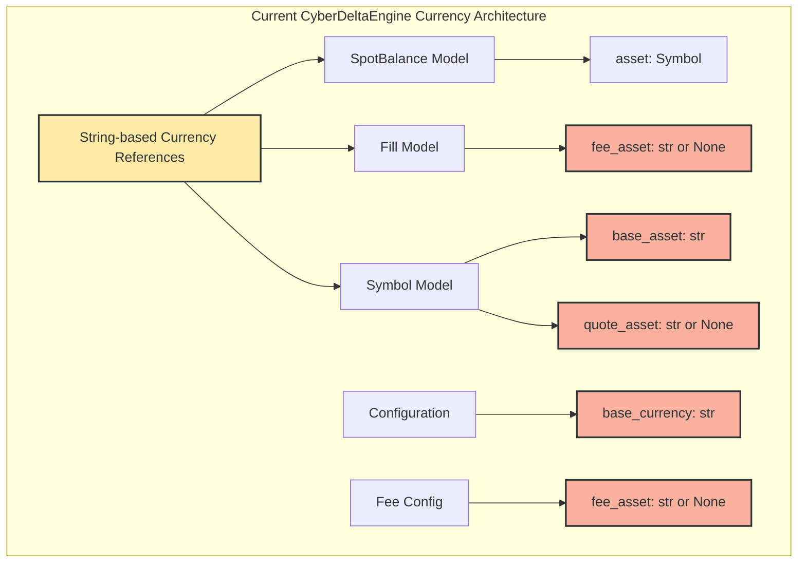
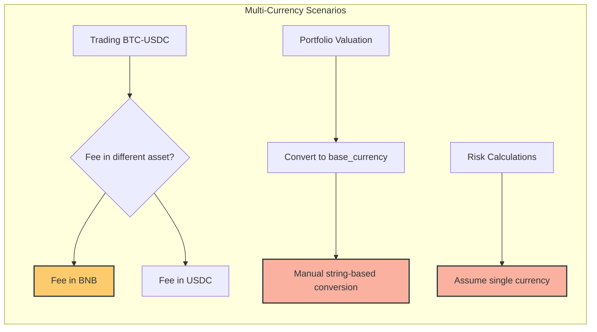
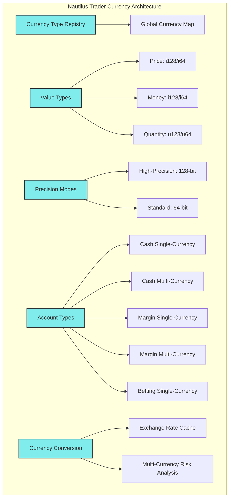
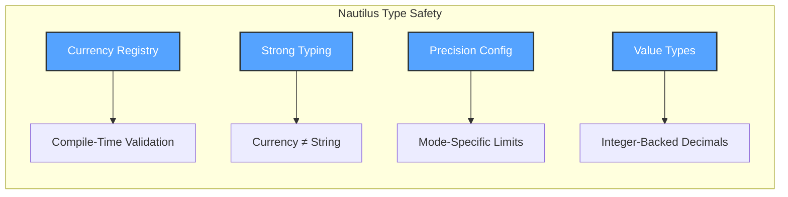
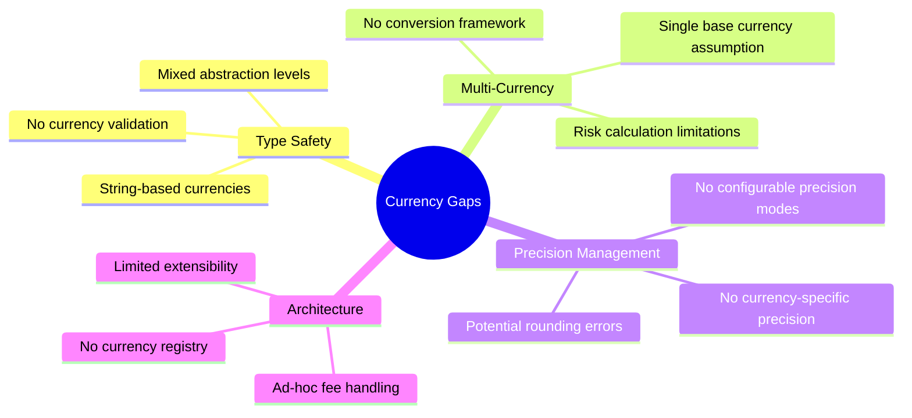
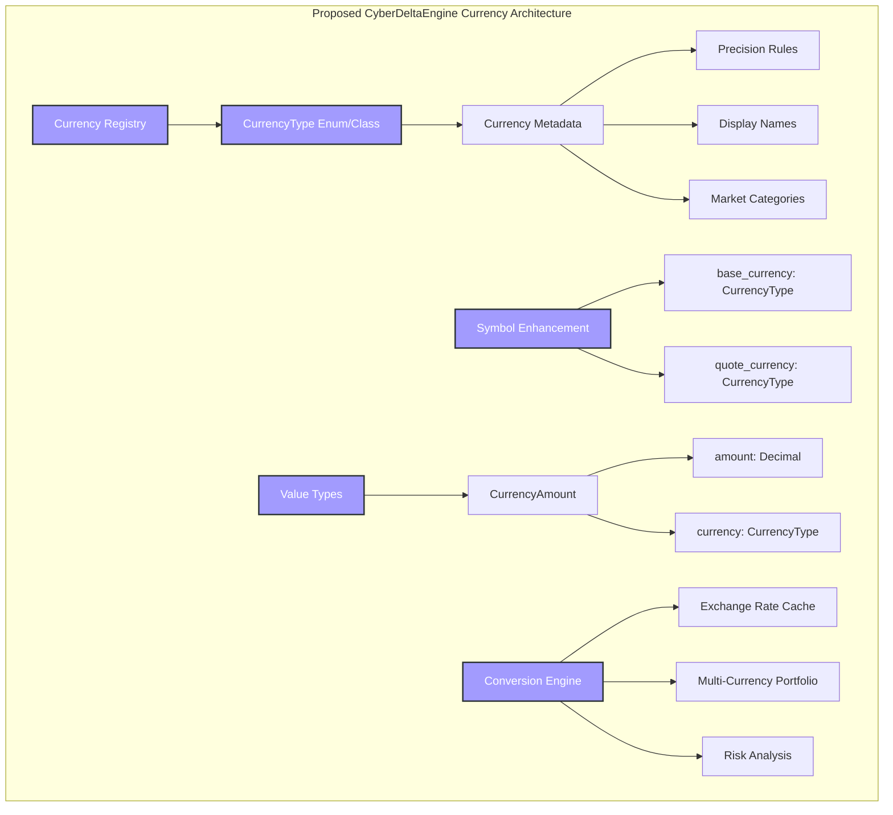
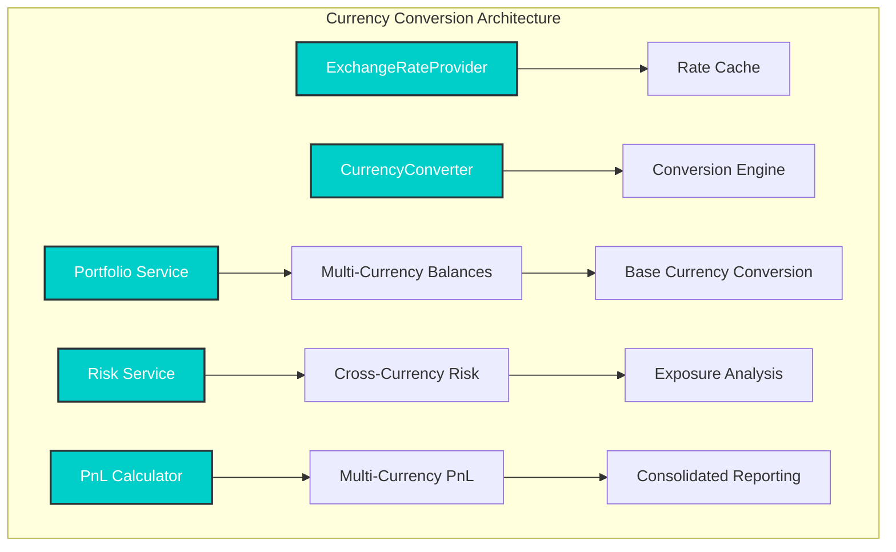
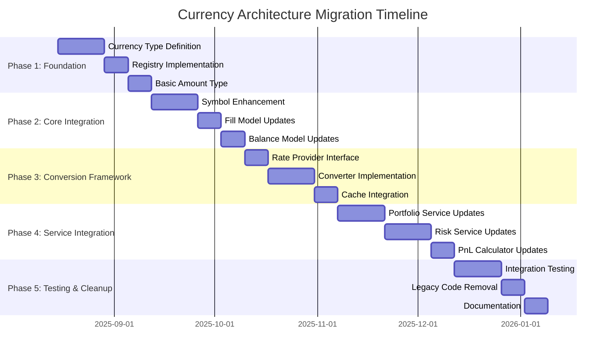
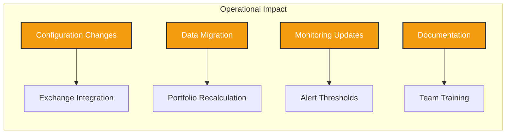
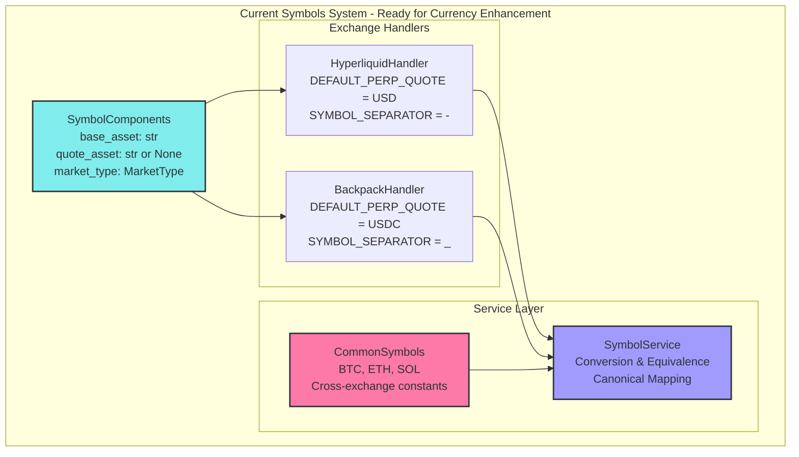

# Currency Handling Architecture Analysis: CyberDeltaEngine vs. Nautilus Trader

**Date:** 2025-08-12
**Scope:** Deep research into currency handling patterns and architectural improvements
**Status:** Research Phase Complete

## Executive Summary

This document presents a comprehensive analysis of currency handling patterns in CyberDeltaEngine compared to industry-leading practices found in Nautilus Trader. The research reveals significant opportunities for improvement in type safety, precision management, multi-currency support, and overall architectural robustness.

### Key Findings
- **Current State**: CyberDeltaEngine uses basic string-based currency representation with ad-hoc handling
- **Symbols System**: Well-architected domain layer provides excellent foundation for currency enhancement
- **Opportunity**: Nautilus Trader demonstrates sophisticated type-safe currency architecture with strong precision guarantees
- **Risk Level**: Medium - Current approach works but lacks robustness for complex multi-currency scenarios
- **Recommended Action**: Leverage existing symbols system for gradual migration to enhanced currency types

### Related Documents
- **[Symbols Integration Analysis](./02_symbols_integration_analysis.md)** - Detailed analysis of how to enhance the existing symbols system with type-safe currency handling

---

## 1. Current State Analysis: CyberDeltaEngine Currency Handling

### 1.1 Architecture Overview



### 1.2 Current Patterns Identified

#### A. Symbol-Based Asset Representation
```python
# Current approach in CyberDeltaEngine
class SpotBalance(ExchangeValidationMixin, StandardModel):
    exchange: ExchangeName
    asset: Symbol  # Uses Symbol domain object
    timestamp: datetime
    total_quantity: Decimal
    available_quantity: Decimal
```

**Strengths:**
- Uses domain Symbol objects for asset representation
- Proper Decimal usage for financial quantities
- Exchange-specific validation through mixins

**Weaknesses:**
- Mixed abstraction levels (Symbol for asset, str for currencies elsewhere)
- No currency-specific validation or constraints
- Limited multi-currency operation support

#### B. Fee Asset Handling
```python
# Current fee handling
class Fill(ExchangeValidationMixin, ImmutableModel):
    fee: Decimal = Field(default=Decimal(0))
    fee_asset: str | None = Field(default=None)  # String-based

    @model_validator(mode="after")
    def check_fee_logic(self) -> Self:
        if self.fee != Decimal(0) and not self.fee_asset:
            raise FillLogicError("fee_asset must be provided if fee is nonzero")
```

**Issues:**
- String-based fee_asset lacks type safety
- No validation of fee asset existence or validity
- Ad-hoc validation logic

#### C. Configuration Currency Handling
```python
# Configuration approach
class PortfolioCalculationConfig(BaseModel):
    base_currency: NonEmptyConfigString = "USD"  # String default

class FeeStructureConfig(BaseModel):
    fee_asset: str | None = Field(
        default=None,
        description="Asset used for fee payment (e.g., 'USDC', 'BNB'). If None, uses quote currency"
    )
```

**Problems:**
- Hard-coded default base currency
- No currency registry or validation
- Quote currency fallback without validation

### 1.3 Multi-Currency Support Analysis

Current multi-currency handling is **fragmented**:



**Missing Components:**
- Currency conversion framework
- Currency registry/validation
- Type-safe currency operations
- Precision management per currency

---

## 2. Nautilus Trader Architecture Analysis

### 2.1 Core Currency Type System

Nautilus Trader implements a sophisticated currency architecture:



### 2.2 Key Architectural Patterns

#### A. Dedicated Currency Type with Registration
```python
# Nautilus Trader approach (inferred from documentation)
class Currency:
    code: str  # e.g., "USD", "USDC", "BTC"
    name: str  # Full name
    precision: int  # Decimal places

    # Global registration on creation
    def __post_init__(self):
        register_currency(self)

# Usage in instruments
class CurrencyPair:
    base_currency: Currency  # Not string!
    quote_currency: Currency
```

#### B. Precision-Aware Value Types
```python
# High-precision mode (128-bit backing)
| Type     | Raw backing | Max precision | Min value           | Max value          |
|----------|-------------|---------------|---------------------|--------------------|
| Price    | i128        | 16            | -17,014,118,346,046 | 17,014,118,346,046 |
| Money    | i128        | 16            | -17,014,118,346,046 | 17,014,118,346,046 |
| Quantity | u128        | 16            | 0                   | 34,028,236,692,093 |
```

#### C. Multi-Currency Account Support
```python
# Account type variations
AccountType:
  - Cash (single-currency, base currency)
  - Cash (multi-currency)
  - Margin (single-currency, base currency)
  - Margin (multi-currency)
  - Betting (single-currency)
```

#### D. Currency Conversion Framework
```python
# Exchange rate handling
Cache.add_exchange_rate(...)
Cache.exchange_rate(...)

# Multi-currency portfolio support
portfolio.multi_currency_risk_analysis()
```

### 2.3 Type Safety Patterns



---

## 3. Gap Analysis and Opportunities

### 3.1 Critical Gaps in CyberDeltaEngine



### 3.2 Impact Assessment

| Gap Area | Current Risk | Business Impact | Technical Debt |
|----------|--------------|-----------------|----------------|
| Type Safety | Medium | Manual errors in currency handling | High |
| Multi-Currency | High | Limited to single-currency strategies | Very High |
| Precision | Medium | Potential calculation errors | Medium |
| Extensibility | High | Difficult to add new exchanges/currencies | High |

### 3.3 Opportunities for Improvement

1. **Enhanced Type Safety**: Dedicated Currency type with compile-time validation
2. **Multi-Currency Support**: Full portfolio and risk management across currencies
3. **Precision Management**: Configurable precision modes for different scenarios
4. **Currency Registry**: Centralized currency definition and validation
5. **Conversion Framework**: Built-in currency conversion with exchange rates

---

## 4. Proposed Architecture Enhancement

### 4.1 Enhanced Currency Type System



### 4.2 Core Components Design

#### A. Currency Type Definition
```python
from enum import Enum
from decimal import Decimal
from pydantic import BaseModel

class CurrencyCategory(Enum):
    FIAT = "fiat"
    CRYPTO = "crypto"
    STABLECOIN = "stablecoin"
    WRAPPED = "wrapped"

class CurrencyType(Enum):
    # Fiat
    USD = "USD"
    EUR = "EUR"

    # Major Crypto
    BTC = "BTC"
    ETH = "ETH"
    SOL = "SOL"

    # Stablecoins
    USDC = "USDC"
    USDT = "USDT"
    DAI = "DAI"

    @property
    def metadata(self) -> "CurrencyMetadata":
        return CURRENCY_REGISTRY[self]

class CurrencyMetadata(BaseModel):
    """Immutable currency metadata."""
    model_config = ConfigDict(frozen=True)

    code: str
    name: str
    category: CurrencyCategory
    decimals: int = Field(ge=0, le=18)
    symbol: str | None = None
    is_base_currency: bool = False

# Registry with complete metadata
CURRENCY_REGISTRY: dict[CurrencyType, CurrencyMetadata] = {
    CurrencyType.USD: CurrencyMetadata(
        code="USD",
        name="US Dollar",
        category=CurrencyCategory.FIAT,
        decimals=2,
        symbol="$",
        is_base_currency=True
    ),
    CurrencyType.USDC: CurrencyMetadata(
        code="USDC",
        name="USD Coin",
        category=CurrencyCategory.STABLECOIN,
        decimals=6,
        symbol="USDC"
    ),
    CurrencyType.BTC: CurrencyMetadata(
        code="BTC",
        name="Bitcoin",
        category=CurrencyCategory.CRYPTO,
        decimals=8,
        symbol="₿"
    ),
    # ... complete registry
}
```

#### B. Enhanced Amount Type
```python
class CurrencyAmount(BaseModel):
    """Type-safe currency amount with built-in validation."""
    model_config = ConfigDict(frozen=True)

    amount: Decimal
    currency: CurrencyType

    @field_validator("amount", mode="before")
    @classmethod
    def validate_amount_precision(cls, v: Decimal, info: ValidationInfo) -> Decimal:
        if "currency" not in info.data:
            return v

        currency = info.data["currency"]
        required_decimals = currency.metadata.decimals

        # Validate precision matches currency requirements
        if v.as_tuple().exponent < -required_decimals:
            raise ValueError(
                f"Amount precision ({-v.as_tuple().exponent}) exceeds "
                f"currency {currency.value} limit ({required_decimals})"
            )

        return v.quantize(Decimal(10) ** -required_decimals)

    def __add__(self, other: "CurrencyAmount") -> "CurrencyAmount":
        if self.currency != other.currency:
            raise ValueError(f"Cannot add {self.currency} and {other.currency}")
        return CurrencyAmount(amount=self.amount + other.amount, currency=self.currency)

    def __sub__(self, other: "CurrencyAmount") -> "CurrencyAmount":
        if self.currency != other.currency:
            raise ValueError(f"Cannot subtract {other.currency} from {self.currency}")
        return CurrencyAmount(amount=self.amount - other.amount, currency=self.currency)

    def to_base_currency(self, converter: "CurrencyConverter") -> "CurrencyAmount":
        """Convert to configured base currency."""
        return converter.convert(self, converter.base_currency)
```

#### C. Symbol Enhancement
```python
class EnhancedSymbolComponents(BaseModel):
    """Enhanced symbol components with proper currency types."""
    model_config = ConfigDict(frozen=True)

    base_currency: CurrencyType
    quote_currency: CurrencyType | None = None
    market_type: MarketType

    @computed_field
    @property
    def is_spot_pair(self) -> bool:
        return self.market_type == MarketType.SPOT and self.quote_currency is not None

    @computed_field
    @property
    def is_perpetual(self) -> bool:
        return self.market_type == MarketType.PERP

    def get_base_amount(self, quantity: Decimal) -> CurrencyAmount:
        """Create properly typed amount for base currency."""
        return CurrencyAmount(amount=quantity, currency=self.base_currency)

    def get_quote_amount(self, notional: Decimal) -> CurrencyAmount:
        """Create properly typed amount for quote currency."""
        if not self.quote_currency:
            raise ValueError("Quote currency not available for this market type")
        return CurrencyAmount(amount=notional, currency=self.quote_currency)
```

#### D. Enhanced Fill Model
```python
class EnhancedFill(ExchangeValidationMixin, ImmutableModel):
    """Enhanced fill with proper currency type safety."""

    id: str
    symbol: Symbol
    executed_at: datetime
    side: OrderSide
    order_id: str
    exchange: ExchangeName
    price: Decimal = Field(gt=Decimal(0))
    quantity: Decimal = Field(gt=Decimal(0))
    client_order_id: str | None = Field(default=None)

    # Enhanced fee handling
    fee_amount: CurrencyAmount | None = Field(default=None)
    maker_taker: MakerTaker | None = Field(default=None)

    # Extension slots remain
    hl_details: HyperliquidFillDetails | None = Field(default=None)
    bp_details: BackpackFillDetails | None = Field(default=None)

    @model_validator(mode="after")
    def validate_currency_consistency(self) -> Self:
        """Validate currency consistency with symbol."""
        if self.fee_amount and hasattr(self.symbol, '_components'):
            components = self.symbol._components
            if components and isinstance(components, EnhancedSymbolComponents):
                # Fee should be in base or quote currency for most cases
                valid_currencies = {components.base_currency}
                if components.quote_currency:
                    valid_currencies.add(components.quote_currency)

                if self.fee_amount.currency not in valid_currencies:
                    # Log warning but allow (some exchanges use native token for fees)
                    logger.warning(
                        f"Fee currency {self.fee_amount.currency} not in symbol currencies {valid_currencies}"
                    )

        return self

    @computed_field
    @property
    def base_amount(self) -> CurrencyAmount:
        """Get the base currency amount involved in this fill."""
        components = self.symbol._components
        if not components or not isinstance(components, EnhancedSymbolComponents):
            raise ValueError("Symbol must have enhanced components for currency calculations")

        return components.get_base_amount(self.quantity)

    @computed_field
    @property
    def quote_amount(self) -> CurrencyAmount | None:
        """Get the quote currency amount involved in this fill."""
        components = self.symbol._components
        if not components or not isinstance(components, EnhancedSymbolComponents):
            return None

        if not components.quote_currency:
            return None

        notional = self.price * self.quantity
        return components.get_quote_amount(notional)
```

### 4.3 Currency Conversion Framework



#### Currency Converter Implementation
```python
class ExchangeRateProvider(Protocol):
    """Protocol for providing exchange rates."""

    async def get_rate(
        self,
        from_currency: CurrencyType,
        to_currency: CurrencyType,
        timestamp: datetime | None = None
    ) -> Decimal:
        """Get exchange rate from one currency to another."""
        ...

class CurrencyConverter(BaseModel):
    """Multi-currency conversion with caching."""

    base_currency: CurrencyType
    rate_provider: ExchangeRateProvider
    rate_cache: dict[tuple[CurrencyType, CurrencyType, date], Decimal] = Field(default_factory=dict)
    cache_ttl_hours: int = Field(default=1, ge=1, le=24)

    async def convert(
        self,
        amount: CurrencyAmount,
        to_currency: CurrencyType,
        timestamp: datetime | None = None
    ) -> CurrencyAmount:
        """Convert currency amount to target currency."""

        if amount.currency == to_currency:
            return amount

        # Check cache first
        cache_key = (amount.currency, to_currency, (timestamp or datetime.utcnow()).date())
        if cache_key in self.rate_cache:
            rate = self.rate_cache[cache_key]
        else:
            rate = await self.rate_provider.get_rate(amount.currency, to_currency, timestamp)
            self.rate_cache[cache_key] = rate

        converted_amount = amount.amount * rate
        return CurrencyAmount(amount=converted_amount, currency=to_currency)

    async def to_base_currency(self, amount: CurrencyAmount) -> CurrencyAmount:
        """Convert any currency to the configured base currency."""
        return await self.convert(amount, self.base_currency)
```

---

## 5. Migration Strategy

### 5.1 Phase-Based Migration Plan



### 5.2 Backward Compatibility Strategy

```python
# Transition approach - maintain string compatibility during migration
class TransitionCurrencyAmount(BaseModel):
    """Backward-compatible currency amount during migration."""

    amount: Decimal
    currency: CurrencyType | str  # Allow both during transition

    @field_validator("currency", mode="before")
    @classmethod
    def normalize_currency(cls, v: CurrencyType | str) -> CurrencyType:
        if isinstance(v, str):
            # Migration warning
            logger.warning(f"String currency '{v}' - migrating to CurrencyType")
            try:
                return CurrencyType(v)
            except ValueError:
                raise ValueError(f"Unknown currency code: {v}")
        return v

# Usage during migration
def create_fill_legacy_compatible(fee_asset: str | None, fee: Decimal) -> EnhancedFill:
    fee_amount = None
    if fee != Decimal(0) and fee_asset:
        # Support legacy string fee_asset during migration
        currency = CurrencyType(fee_asset) if fee_asset else None
        if currency:
            fee_amount = CurrencyAmount(amount=fee, currency=currency)

    return EnhancedFill(
        # ... other fields
        fee_amount=fee_amount
    )
```

### 5.3 Testing Strategy

```python
# Enhanced testing with currency awareness
class CurrencyTestCase(BaseTestCase):
    """Base test case with currency testing utilities."""

    def setUp(self):
        self.converter = self.create_test_converter()
        self.usd = CurrencyType.USD
        self.usdc = CurrencyType.USDC
        self.btc = CurrencyType.BTC

    def create_test_converter(self) -> CurrencyConverter:
        """Create converter with mock exchange rates."""
        class MockRateProvider:
            rates = {
                (CurrencyType.USDC, CurrencyType.USD): Decimal("1.0"),
                (CurrencyType.BTC, CurrencyType.USD): Decimal("45000"),
                # ... test rates
            }

            async def get_rate(self, from_curr, to_curr, timestamp=None):
                return self.rates.get((from_curr, to_curr), Decimal("1.0"))

        return CurrencyConverter(
            base_currency=CurrencyType.USD,
            rate_provider=MockRateProvider()
        )

    def assert_currency_amount(
        self,
        amount: CurrencyAmount,
        expected_amount: Decimal,
        expected_currency: CurrencyType
    ):
        """Assert currency amount matches expectations."""
        self.assertEqual(amount.amount, expected_amount)
        self.assertEqual(amount.currency, expected_currency)

# Example test
class TestEnhancedFill(CurrencyTestCase):
    def test_multi_currency_fee_calculation(self):
        """Test fill with fee in different currency."""
        # Fill: Buy 1 BTC for 45000 USDC, fee 0.01 BTC
        fill = EnhancedFill(
            # ... basic fields
            fee_amount=CurrencyAmount(amount=Decimal("0.01"), currency=CurrencyType.BTC)
        )

        # Test base amount
        base_amount = fill.base_amount
        self.assert_currency_amount(base_amount, Decimal("1.0"), CurrencyType.BTC)

        # Test quote amount
        quote_amount = fill.quote_amount
        self.assert_currency_amount(quote_amount, Decimal("45000"), CurrencyType.USDC)

        # Test fee conversion to base currency
        fee_in_usd = await self.converter.to_base_currency(fill.fee_amount)
        self.assert_currency_amount(fee_in_usd, Decimal("450"), CurrencyType.USD)
```

---

## 6. Risk Assessment and Mitigation

### 6.1 Implementation Risks

| Risk | Probability | Impact | Mitigation Strategy |
|------|-------------|--------|-------------------|
| Breaking Changes | High | High | Phased migration with backward compatibility |
| Performance Impact | Medium | Medium | Efficient registry design, caching |
| Complexity Increase | Medium | High | Clear documentation, gradual rollout |
| Testing Coverage | High | High | Comprehensive test suite expansion |

### 6.2 Operational Considerations



### 6.3 Success Metrics

1. **Type Safety**: 100% elimination of string-based currency operations in core logic
2. **Multi-Currency Support**: Portfolio operations across 3+ currencies
3. **Performance**: <5ms overhead for currency operations
4. **Test Coverage**: >95% coverage for currency-related code
5. **Error Reduction**: 50% reduction in currency-related runtime errors

---

## 7. Symbols System Integration Opportunities

### 7.1 Current Symbols Architecture Strengths

After analyzing the `cyberdelta/symbols/` system, several architectural strengths provide an excellent foundation for currency enhancement:

#### Strong Domain-Driven Design
The symbols system follows clean architecture principles with clear separation between:
- **Models**: `SymbolComponents`, `BaseSymbol<T>` with generic metadata
- **Handlers**: Exchange-specific logic encapsulation (`HyperliquidHandler`, `BackpackHandler`)
- **Services**: `SymbolService` for conversion and equivalence operations
- **API Layer**: Clean public interface through `symbol()` function and `exchanges` namespace

#### Exchange Abstraction Framework


### 7.2 Integration Strategy

The existing symbols system provides perfect integration points for enhanced currency handling:

#### Integration Point 1: SymbolComponents Enhancement
```python
# Current: String-based assets
class SymbolComponents(BaseModel):
    base_asset: str  # Enhancement opportunity
    quote_asset: str | None = None  # Enhancement opportunity
    market_type: MarketType

# Enhanced: Type-safe currencies with backward compatibility
class SymbolComponents(BaseModel):
    base_asset: str  # Maintain for compatibility
    quote_asset: str | None = None  # Maintain for compatibility
    market_type: MarketType

    @property
    def base_currency(self) -> CurrencyType:
        """Type-safe base currency access."""
        return CurrencyType.from_string(self.base_asset)

    @property
    def quote_currency(self) -> CurrencyType | None:
        """Type-safe quote currency access."""
        return CurrencyType.from_string(self.quote_asset) if self.quote_asset else None
```

#### Integration Point 2: Exchange Handler Enhancement
```python
# Leverage existing handler architecture
class BackpackHandler:
    DEFAULT_PERP_QUOTE = CurrencyType.USDC  # Type-safe constants

    def parse_components(self, value: str) -> SymbolComponents:
        """Enhanced parsing with currency validation."""
        # Existing logic + currency type validation
        components = self._parse_string_components(value)

        # Validate currencies are supported
        if not CurrencyRegistry.is_supported(components.base_asset):
            raise ValueError(f"Unsupported base currency: {components.base_asset}")

        return components
```

#### Integration Point 3: Service Layer Enhancement
```python
class SymbolService:
    def __init__(
        self,
        handlers: dict[ExchangeName, ExchangeHandler[Any]],
        currency_registry: CurrencyRegistry,  # New dependency
        equivalence_map: dict[str, list[Symbol]] | None = None,
    ):
        # Existing initialization + currency operations

    def get_base_currency(self, symbol: Symbol) -> CurrencyType:
        """Extract base currency from symbol."""
        components = self.parse_components(symbol)
        return components.base_currency

    def create_currency_amount(
        self, amount: Decimal, symbol: Symbol, use_quote: bool = False
    ) -> CurrencyAmount:
        """Create currency amount with symbol context."""
        components = self.parse_components(symbol)
        currency = components.quote_currency if use_quote else components.base_currency
        return CurrencyAmount(amount=amount, currency=currency)
```

### 7.3 Migration Benefits

The symbols system integration approach provides several advantages:

1. **Zero Breaking Changes**: Existing code continues to work unchanged
2. **Gradual Enhancement**: Currency features can be adopted incrementally
3. **Exchange Consistency**: Handler pattern ensures currency rules are exchange-specific
4. **Service Integration**: Currency operations integrate with existing equivalence and conversion logic
5. **Common Patterns**: `CommonSymbols` can provide currency-aware asset definitions

### 7.4 Concrete Next Steps

Based on symbols system analysis, the implementation path becomes clear:

1. **Phase 1**: Add currency properties to `SymbolComponents` (backward compatible)
2. **Phase 2**: Enhance exchange handlers with currency validation
3. **Phase 3**: Extend `SymbolService` with currency operations
4. **Phase 4**: Update models (`SpotBalance`, `Fill`) to use currency-aware symbols
5. **Phase 5**: Implement portfolio-level currency aggregation

**Detailed implementation guidance available in [Symbols Integration Analysis](./02_symbols_integration_analysis.md)**

---

## 8. Recommendations

### 8.1 Immediate Actions (Next 2 Weeks)

1. **Create Currency Type Definition**: Implement `CurrencyType` enum and `CurrencyMetadata`
2. **Establish Registry Pattern**: Build `CURRENCY_REGISTRY` with initial currencies
3. **Prototype CurrencyAmount**: Create type-safe amount class with validation
4. **Update Core Models**: Begin migration of `Fill` and `SpotBalance` models

### 8.2 Short-term Goals (Next Month)

1. **Symbol Enhancement**: Integrate currency types into symbol components
2. **Conversion Framework**: Implement basic currency conversion capabilities
3. **Service Integration**: Update portfolio and risk services for multi-currency
4. **Testing Infrastructure**: Expand test coverage for currency operations

### 8.3 Long-term Vision (Next Quarter)

1. **Full Multi-Currency Support**: Complete portfolio management across currencies
2. **Exchange Rate Integration**: Real-time exchange rate feeds
3. **Advanced Risk Analytics**: Cross-currency risk analysis and reporting
4. **Performance Optimization**: Optimized currency operations for high-frequency scenarios

---

## 9. Conclusion

The analysis reveals that CyberDeltaEngine has both a solid foundation with proper Decimal usage and domain modeling, and an excellent symbols system architecture that provides the perfect foundation for enhanced currency handling. By combining patterns demonstrated in Nautilus Trader with the existing symbols system's clean architecture, we can achieve sophisticated currency handling without disrupting existing workflows.

### Key Benefits of Enhancement:

1. **Stronger Type Safety**: Eliminate string-based currency errors at compile time
2. **Multi-Currency Capability**: Enable sophisticated cross-currency trading strategies
3. **Precision Management**: Ensure correct precision handling per currency type
4. **Symbols System Integration**: Leverage existing clean architecture and exchange abstraction
5. **Zero Breaking Changes**: Backward compatible migration path
6. **Exchange Consistency**: Currency rules properly encapsulated per exchange
7. **Risk Management**: Better cross-currency risk analysis and reporting

### Next Steps:

1. **Stakeholder Review**: Present findings to development team
2. **Implementation Planning**: Detailed sprint planning for Phase 1
3. **Prototype Development**: Build proof-of-concept for core components
4. **Test Strategy**: Develop comprehensive testing approach
5. **Documentation**: Create migration guides and API documentation

The proposed architecture leverages CyberDeltaEngine's excellent symbols system foundation while adding the sophisticated currency handling capabilities needed for advanced multi-currency trading strategies. The symbols system integration approach ensures zero breaking changes while providing clear value at each stage of the migration.

---

*This analysis was conducted on 2025-08-12 as part of the continuous architectural improvement initiative for CyberDeltaEngine.*

---

## Appendix A: Code Examples

### A.1 Complete Migration Example

```python
# Before: Current approach
class LegacyFill(BaseModel):
    fee: Decimal
    fee_asset: str | None  # String-based

    def get_fee_in_base_currency(self, base_currency: str) -> Decimal:
        # Manual conversion logic with string comparison
        if self.fee_asset == base_currency:
            return self.fee
        # ... manual rate lookup and conversion

# After: Enhanced approach
class EnhancedFill(BaseModel):
    fee_amount: CurrencyAmount | None

    async def get_fee_in_base_currency(self, converter: CurrencyConverter) -> CurrencyAmount:
        # Type-safe conversion with validation
        if not self.fee_amount:
            return CurrencyAmount(amount=Decimal(0), currency=converter.base_currency)
        return await converter.to_base_currency(self.fee_amount)
```

### A.2 Configuration Enhancement

```python
# Enhanced configuration with currency validation
class EnhancedPortfolioConfig(BaseModel):
    base_currency: CurrencyType = CurrencyType.USD  # Type-safe default
    supported_currencies: set[CurrencyType] = Field(
        default_factory=lambda: {CurrencyType.USD, CurrencyType.USDC, CurrencyType.BTC}
    )

    @model_validator(mode="after")
    def validate_base_currency_supported(self) -> Self:
        if self.base_currency not in self.supported_currencies:
            self.supported_currencies.add(self.base_currency)
        return self
```

### A.3 Multi-Currency Portfolio Example

```python
class MultiCurrencyPortfolio(BaseModel):
    """Portfolio supporting multiple currencies with conversion."""

    balances: dict[CurrencyType, CurrencyAmount]
    converter: CurrencyConverter

    async def get_total_value(self) -> CurrencyAmount:
        """Get total portfolio value in base currency."""
        total = CurrencyAmount(amount=Decimal(0), currency=self.converter.base_currency)

        for currency_amount in self.balances.values():
            converted = await self.converter.to_base_currency(currency_amount)
            total = total + converted

        return total

    async def get_currency_allocation(self) -> dict[CurrencyType, Decimal]:
        """Get percentage allocation by currency."""
        total_value = await self.get_total_value()
        allocations = {}

        for currency, amount in self.balances.items():
            converted = await self.converter.to_base_currency(amount)
            percentage = (converted.amount / total_value.amount) * Decimal(100)
            allocations[currency] = percentage

        return allocations
```

---

## Appendix B: Nautilus Trader Integration Patterns

### B.1 Account Type Patterns

Based on Nautilus Trader's sophisticated account type system, CyberDeltaEngine could implement:

```python
class AccountCurrencyMode(Enum):
    SINGLE_CURRENCY = "single"
    MULTI_CURRENCY = "multi"

class EnhancedAccountType(Enum):
    CASH_SINGLE = "cash_single"
    CASH_MULTI = "cash_multi"
    MARGIN_SINGLE = "margin_single"
    MARGIN_MULTI = "margin_multi"

class AccountConfig(BaseModel):
    account_type: EnhancedAccountType
    base_currency: CurrencyType
    supported_currencies: set[CurrencyType]

    @property
    def currency_mode(self) -> AccountCurrencyMode:
        return (AccountCurrencyMode.MULTI_CURRENCY
                if "multi" in self.account_type.value
                else AccountCurrencyMode.SINGLE_CURRENCY)
```

### B.2 Precision Mode Configuration

```python
class PrecisionMode(Enum):
    STANDARD = "standard"  # 64-bit backing
    HIGH = "high"         # 128-bit backing

class CurrencyPrecisionConfig(BaseModel):
    mode: PrecisionMode = PrecisionMode.HIGH
    max_decimal_places: dict[CurrencyType, int] = Field(default_factory=dict)

    def get_max_precision(self, currency: CurrencyType) -> int:
        """Get maximum precision for a currency based on mode."""
        base_precision = currency.metadata.decimals
        mode_limit = 16 if self.mode == PrecisionMode.HIGH else 9
        custom_limit = self.max_decimal_places.get(currency, base_precision)

        return min(base_precision, mode_limit, custom_limit)
```

This completes the comprehensive currency handling architecture analysis and recommendations for CyberDeltaEngine.
