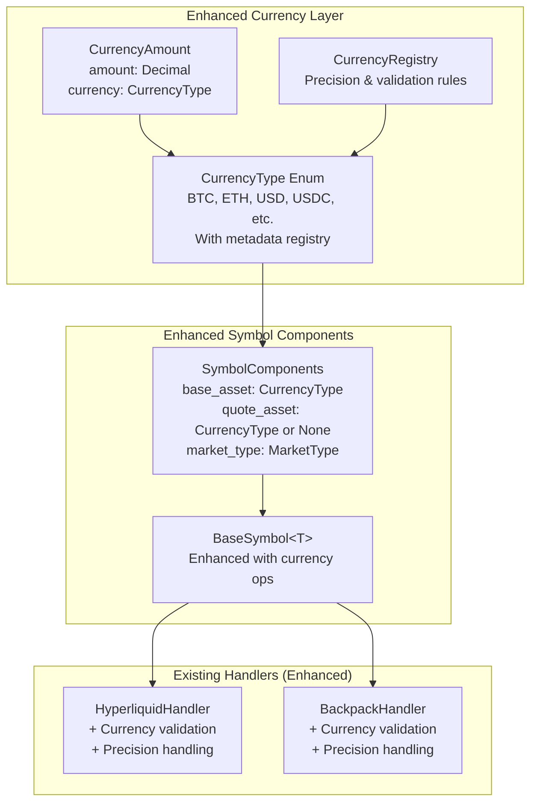
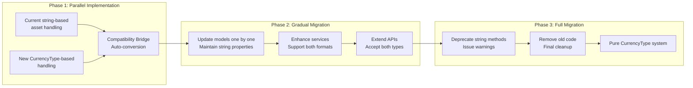

# Currency Handling Enhancement: Symbols System Integration Analysis

## Executive Summary

After analyzing the existing `cyberdelta/symbols/` system, this document provides enhanced recommendations for integrating type-safe currency handling with the current symbol architecture. The symbols system already provides excellent foundations for domain-driven design and exchange abstraction, which we can leverage to implement sophisticated currency management without disrupting existing workflows.

## Current Symbols System Architecture

### Key Components Analysis

```mermaid
graph TB
    subgraph "Symbol Domain Layer"
        SM[SymbolComponents<br/>base_asset: str<br/>quote_asset: str or None<br/>market_type: MarketType]
        BS[BaseSymbol&lt;T&gt;<br/>Generic symbol with metadata]
        SY[Symbol<br/>Type alias for domain usage]
    end

    subgraph "Exchange Handlers"
        HH[HyperliquidHandler<br/>USD defaults<br/>- separator]
        BH[BackpackHandler<br/>USDC defaults<br/>_ separator]
        EH[ExchangeHandler Protocol<br/>Standard interface]
    end

    subgraph "Service Layer"
        SS[SymbolService<br/>Conversion & equivalence<br/>Canonical mapping]
        SF[SymbolFactory<br/>Exchange-specific creation]
        CS[CommonSymbols<br/>BTC, ETH, SOL constants]
    end

    subgraph "Public API"
        API[symbol() function<br/>Direct creation]
        EX[exchanges.hyperliquid()<br/>exchanges.backpack()]
        GS[get_symbol_service()<br/>Advanced operations]
    end

    API --> SS
    EX --> SF
    SF --> HH
    SF --> BH
    SS --> SM
    HH --> SM
    BH --> SM
    CS --> API
```

### Strengths of Current System

1. **Clean Architecture**: Proper separation of concerns with handlers, services, and API layers
2. **Exchange Abstraction**: Handlers encapsulate exchange-specific formatting rules
3. **Type Safety**: Uses Pydantic models and generics for metadata
4. **Canonical Mapping**: Service layer provides exchange-agnostic representation
5. **Extensibility**: Easy to add new exchanges through handler protocol

### Currency-Related Gaps Identified

1. **String-Based Assets**: `base_asset` and `quote_asset` are plain strings without validation
2. **No Currency Metadata**: No precision, type, or validation information for currencies
3. **Limited Quote Currency Logic**: Handlers have hardcoded defaults but no systematic approach
4. **Missing Currency Operations**: No currency arithmetic, conversion, or portfolio aggregation
5. **Fee Asset Inconsistency**: Fee handling uses separate string-based asset fields

## Integration Strategy: Enhanced Currency Types

### Phase 1: Currency Type Foundation

Enhance the existing system by introducing currency types that integrate seamlessly with the current symbol architecture:



### Phase 2: Symbol System Enhancement

#### Enhanced SymbolComponents

```python
# Current implementation
class SymbolComponents(BaseModel):
    base_asset: str  # ❌ String-based
    quote_asset: str | None = None  # ❌ String-based
    market_type: MarketType

# Enhanced implementation
class SymbolComponents(BaseModel):
    base_asset: CurrencyType  # ✅ Type-safe
    quote_asset: CurrencyType | None = None  # ✅ Type-safe
    market_type: MarketType

    @field_validator('base_asset', 'quote_asset')
    @classmethod
    def validate_currency_type(cls, v: CurrencyType | None) -> CurrencyType | None:
        if v is not None and not CurrencyRegistry.is_valid(v):
            raise ValueError(f"Unsupported currency: {v}")
        return v
```

#### Enhanced Exchange Handlers

```python
class BackpackHandler:
    # Enhanced constants with currency types
    DEFAULT_PERP_QUOTE = CurrencyType.USDC  # ✅ Type-safe

    def parse_components(self, value: str) -> SymbolComponents:
        # Parse string components
        if value.endswith(self.PERP_SUFFIX):
            base_part = value[:-len(self.PERP_SUFFIX)]
            if self.SYMBOL_SEPARATOR in base_part:
                parts = base_part.split(self.SYMBOL_SEPARATOR, 1)
                return SymbolComponents(
                    base_asset=CurrencyType.from_string(parts[0]),  # ✅ Validated parsing
                    quote_asset=CurrencyType.from_string(parts[1]),  # ✅ Validated parsing
                    market_type=MarketType.PERP
                )
        # ... rest of parsing logic with currency validation
```

#### Enhanced Symbol Service

```python
class SymbolService:
    def __init__(
        self,
        handlers: dict[ExchangeName, ExchangeHandler[Any]],
        currency_registry: CurrencyRegistry,  # ✅ Injected dependency
        equivalence_map: dict[str, list[Symbol]] | None = None,
    ) -> None:
        self.handlers = handlers
        self.currency_registry = currency_registry  # ✅ Currency operations
        # ... existing initialization

    def get_base_currency(self, symbol: Symbol) -> CurrencyType:
        """Extract base currency from symbol."""
        components = self.parse_components(symbol)
        return components.base_asset

    def get_quote_currency(self, symbol: Symbol) -> CurrencyType | None:
        """Extract quote currency from symbol."""
        components = self.parse_components(symbol)
        return components.quote_asset

    def create_currency_amount(
        self, amount: Decimal, symbol: Symbol, use_quote: bool = False
    ) -> CurrencyAmount:
        """Create currency amount from symbol context."""
        components = self.parse_components(symbol)
        currency = components.quote_asset if use_quote else components.base_asset
        if currency is None:
            raise ValueError("Cannot create amount: currency not specified")

        return CurrencyAmount(amount=amount, currency=currency)
```

### Phase 3: Model Integration

#### Enhanced Balance Models

```python
# Current implementation
class SpotBalance(ExchangeValidationMixin, StandardModel):
    asset: Symbol  # ✅ Already uses Symbol
    total_quantity: Decimal
    available_quantity: Decimal

# Enhanced with currency operations
class SpotBalance(ExchangeValidationMixin, StandardModel):
    asset: Symbol
    total_quantity: Decimal
    available_quantity: Decimal

    @property
    def currency_type(self) -> CurrencyType:
        """Get the currency type for this balance."""
        service = get_symbol_service()
        return service.get_base_currency(self.asset)

    @property
    def total_amount(self) -> CurrencyAmount:
        """Get total quantity as currency amount."""
        return CurrencyAmount(amount=self.total_quantity, currency=self.currency_type)

    @property
    def available_amount(self) -> CurrencyAmount:
        """Get available quantity as currency amount."""
        return CurrencyAmount(amount=self.available_quantity, currency=self.currency_type)
```

#### Enhanced Fill Model

```python
# Current implementation
class Fill(StandardModel):
    # ... existing fields
    fee_asset: str | None = Field(default=None)  # ❌ String-based

# Enhanced implementation
class Fill(StandardModel):
    # ... existing fields
    fee_currency: CurrencyType | None = Field(default=None)  # ✅ Type-safe

    @property
    def fee_amount(self) -> CurrencyAmount | None:
        """Get fee as currency amount."""
        if self.fee_currency is None or not hasattr(self, 'fee_quantity'):
            return None
        return CurrencyAmount(amount=self.fee_quantity, currency=self.fee_currency)
```

## Migration Strategy

### Backward Compatibility Approach



### Implementation Steps

#### Step 1: Core Currency Infrastructure

```python
# Add to cyberdelta/enums/currency_types.py
from enum import Enum
from decimal import Decimal
from typing import ClassVar

class CurrencyType(str, Enum):
    """Type-safe currency enumeration with metadata."""

    # Major cryptocurrencies
    BTC = "BTC"
    ETH = "ETH"
    SOL = "SOL"

    # Stablecoins
    USD = "USD"
    USDC = "USDC"
    USDT = "USDT"

    # Registry for currency metadata
    _METADATA: ClassVar[dict[str, dict]] = {
        "BTC": {"precision": 8, "type": "crypto", "category": "major"},
        "ETH": {"precision": 8, "type": "crypto", "category": "major"},
        "SOL": {"precision": 6, "type": "crypto", "category": "major"},
        "USD": {"precision": 2, "type": "fiat", "category": "stable"},
        "USDC": {"precision": 6, "type": "stablecoin", "category": "stable"},
        "USDT": {"precision": 6, "type": "stablecoin", "category": "stable"},
    }

    @classmethod
    def from_string(cls, value: str) -> "CurrencyType":
        """Convert string to CurrencyType with validation."""
        try:
            return cls(value.upper())
        except ValueError:
            raise ValueError(f"Unknown currency: {value}")

    @property
    def precision(self) -> int:
        """Get decimal precision for this currency."""
        return self._METADATA[self.value]["precision"]

    @property
    def is_stable(self) -> bool:
        """Check if this is a stable currency."""
        return self._METADATA[self.value]["category"] == "stable"
```

#### Step 2: Compatibility Bridge

```python
# Add to cyberdelta/symbols/compat.py
from typing import Union
from cyberdelta.enums.currency_types import CurrencyType

def ensure_currency_type(value: Union[str, CurrencyType]) -> CurrencyType:
    """Convert string or CurrencyType to CurrencyType."""
    if isinstance(value, str):
        return CurrencyType.from_string(value)
    return value

def currency_to_string(value: Union[str, CurrencyType]) -> str:
    """Convert CurrencyType or string to string."""
    if isinstance(value, CurrencyType):
        return value.value
    return value
```

#### Step 3: Enhanced SymbolComponents (Backward Compatible)

```python
class SymbolComponents(BaseModel):
    base_asset: str  # Keep for backward compatibility
    quote_asset: str | None = None  # Keep for backward compatibility
    market_type: MarketType

    # New fields for enhanced functionality
    _base_currency: CurrencyType | None = None
    _quote_currency: CurrencyType | None = None

    @property
    def base_currency(self) -> CurrencyType:
        """Get base asset as CurrencyType."""
        if self._base_currency is None:
            self._base_currency = CurrencyType.from_string(self.base_asset)
        return self._base_currency

    @property
    def quote_currency(self) -> CurrencyType | None:
        """Get quote asset as CurrencyType."""
        if self.quote_asset is None:
            return None
        if self._quote_currency is None:
            self._quote_currency = CurrencyType.from_string(self.quote_asset)
        return self._quote_currency

    @classmethod
    def create_with_currencies(
        cls,
        base_currency: CurrencyType,
        quote_currency: CurrencyType | None,
        market_type: MarketType
    ) -> "SymbolComponents":
        """Create with CurrencyType inputs."""
        return cls(
            base_asset=base_currency.value,
            quote_asset=quote_currency.value if quote_currency else None,
            market_type=market_type,
            _base_currency=base_currency,
            _quote_currency=quote_currency
        )
```

## Integration with Existing Models

### Balance Integration

```python
# Enhanced SpotBalance with currency operations
class SpotBalance(ExchangeValidationMixin, StandardModel):
    asset: Symbol
    total_quantity: Decimal
    available_quantity: Decimal

    @cached_property
    def currency_type(self) -> CurrencyType:
        """Get currency type for this balance."""
        service = get_symbol_service()
        components = service.parse_components(self.asset)
        return components.base_currency

    def add_amount(self, amount: CurrencyAmount) -> "SpotBalance":
        """Add currency amount to balance."""
        if amount.currency != self.currency_type:
            raise ValueError(f"Currency mismatch: {amount.currency} vs {self.currency_type}")

        return self.model_copy(update={
            "total_quantity": self.total_quantity + amount.amount,
            "available_quantity": self.available_quantity + amount.amount
        })

    def to_currency_amount(self, use_available: bool = False) -> CurrencyAmount:
        """Convert to CurrencyAmount."""
        quantity = self.available_quantity if use_available else self.total_quantity
        return CurrencyAmount(amount=quantity, currency=self.currency_type)
```

### Portfolio Aggregation

```python
# New portfolio operations using currency types
class PortfolioCalculator:
    def __init__(self, symbol_service: SymbolService):
        self.symbol_service = symbol_service

    def aggregate_balances_by_currency(
        self, balances: list[SpotBalance]
    ) -> dict[CurrencyType, CurrencyAmount]:
        """Aggregate balances by currency type."""
        aggregated = {}

        for balance in balances:
            currency = balance.currency_type
            amount = balance.to_currency_amount()

            if currency in aggregated:
                aggregated[currency] = aggregated[currency].add(amount)
            else:
                aggregated[currency] = amount

        return aggregated

    def calculate_total_value_in_currency(
        self,
        balances: list[SpotBalance],
        target_currency: CurrencyType,
        price_service: "PriceService"
    ) -> CurrencyAmount:
        """Calculate total portfolio value in target currency."""
        total = Decimal("0")

        for balance in balances:
            balance_amount = balance.to_currency_amount()
            if balance_amount.currency == target_currency:
                total += balance_amount.amount
            else:
                # Convert using price service
                conversion_rate = price_service.get_conversion_rate(
                    balance_amount.currency, target_currency
                )
                total += balance_amount.amount * conversion_rate

        return CurrencyAmount(amount=total, currency=target_currency)
```

## Benefits of Integration

### 1. Type Safety Enhancement

- **Compile-time validation**: Currency mismatches caught at type-checking time
- **IDE support**: Auto-completion and error detection for currency operations
- **Reduced bugs**: Impossible to mix incompatible currencies

### 2. Symbols System Leverage

- **Existing architecture**: Builds on proven DDD patterns
- **Handler extensibility**: Exchange-specific currency rules remain encapsulated
- **Service layer**: Currency operations integrate with symbol equivalence and conversion

### 3. Gradual Migration Path

- **Backward compatibility**: Existing code continues to work
- **Incremental adoption**: Teams can migrate models one at a time
- **Risk mitigation**: No big-bang changes to critical trading logic

### 4. Enhanced Financial Operations

- **Portfolio aggregation**: Type-safe currency totaling and conversion
- **Fee calculations**: Consistent handling across all exchanges
- **Risk management**: Currency exposure analysis becomes trivial

## Implementation Priority

### High Priority (Phase 1)
1. Create `CurrencyType` enum with metadata
2. Implement `CurrencyAmount` class
3. Add compatibility bridge functions
4. Enhance `SymbolComponents` with currency properties

### Medium Priority (Phase 2)
1. Update `SpotBalance` with currency operations
2. Enhance exchange handlers with currency validation
3. Add portfolio aggregation utilities
4. Update `Fill` model with currency types

### Low Priority (Phase 3)
1. Deprecate string-based currency methods
2. Add currency conversion framework
3. Implement advanced currency analytics
4. Full migration and cleanup

## Conclusion

The existing symbols system provides an excellent foundation for implementing sophisticated currency handling. By leveraging the current architecture's strengths—clean separation of concerns, exchange abstraction, and type safety—we can introduce enhanced currency types without disrupting existing workflows.

The proposed integration strategy maintains backward compatibility while enabling gradual migration to a more robust, type-safe currency handling system that aligns with the project's commitment to financial precision and security.
