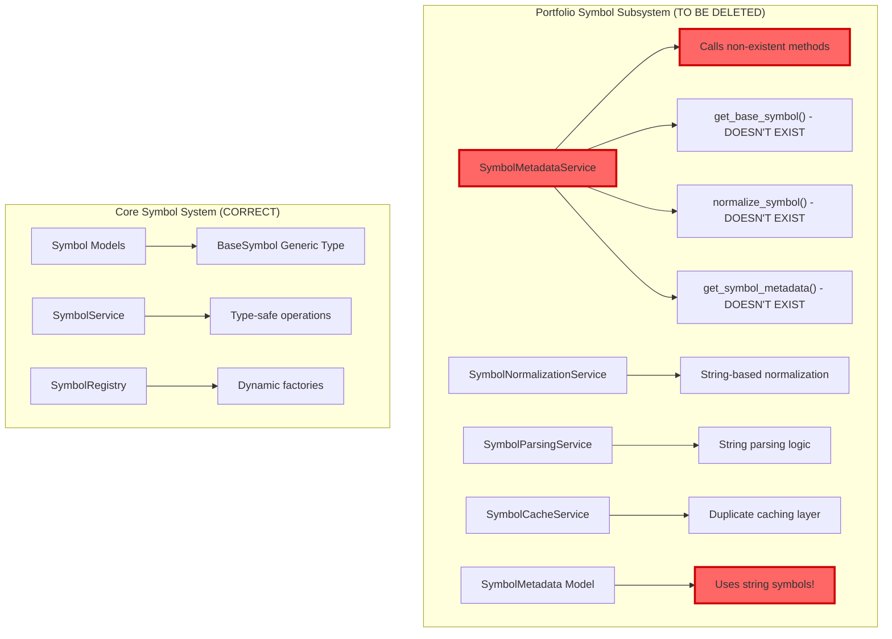

# CyberDeltaEngine Symbol Integration - Clean Break Refactor

**Date:** 2025-07-30  
**Status:** Deep Analysis Complete  
**Goal:** Complete Symbol type integration with 0 mypy errors  
**Approach:** CLEAN BREAK - NO BACKWARDS COMPATIBILITY

## 🎯 REFACTORING STARTING POINT: Portfolio Symbol Services

**CRITICAL DISCOVERY**: The portfolio module contains a complete duplicate symbol system that:
- Uses string-based symbols instead of the core Symbol type
- Calls non-existent methods on a presumed SymbolMapper interface
- Has ZERO usage outside its own module
- Can be completely deleted without breaking anything

**Action**: Start the refactoring by deleting the entire `cyberdelta/core/portfolio/services/symbol/` directory and updating portfolio to use the core Symbol system. This provides an immediate, risk-free win that simplifies the codebase.

## Executive Summary

After deep analysis of the Symbol system, this document presents a complete Symbol integration plan. The Symbol system is NOT just a wrapper - it's a sophisticated type-safe system with:

- **Generic type safety** via `BaseSymbol[TMetadata]`
- **Exchange-specific metadata** (asset indices, symbol IDs)
- **Component parsing** (base/quote assets, market types)
- **Canonical representation** for cross-exchange mapping
- **Symbol equivalence** tracking
- **Pre-computed components** for performance

Current state: **1,047 mypy errors**  
Target state: **0 mypy errors**

## Symbol System Architecture (Deep Dive)

### Core Components

```mermaid
graph TB
    subgraph "Symbol Core"
        A[BaseSymbol Generic<br/>- value: str<br/>- exchange: ExchangeName<br/>- metadata: TMetadata<br/>- _components: SymbolComponents]
        B[SymbolMetadata<br/>Abstract Base]
        C[HyperliquidMetadata<br/>- asset_index: int | None]
        D[BackpackMetadata<br/>- symbol_id: int | None]
    end
    
    subgraph "Symbol Service Layer"
        E[SymbolService<br/>- handlers: dict<br/>- equivalence_map<br/>- canonical_cache]
        F[ExchangeHandler Protocol<br/>- parse_components()<br/>- to_canonical()<br/>- from_canonical()<br/>- create_symbol()]
        G[HyperliquidHandler<br/>BTC-PERP parsing]
        H[BackpackHandler<br/>BTC_USD_PERP parsing]
    end
    
    subgraph "Registry & Factory"
        I[SymbolRegistry<br/>- Dynamic factories<br/>- LRU caching<br/>- Handler registration]
        J[Public API<br/>symbol()<br/>exchanges.*<br/>symbols.*]
    end
    
    B --> C
    B --> D
    A --> B
    F --> G
    F --> H
    E --> F
    I --> E
    I --> J
    
    style A fill:#d1e7dd,stroke:#198754,stroke-width:3px
    style E fill:#d1edff,stroke:#0d6efd,stroke-width:2px
    style I fill:#d1edff,stroke:#0d6efd,stroke-width:2px
```

### Key Symbol Features

1. **Type Safety**: `Symbol = BaseSymbol[HyperliquidMetadata] | BaseSymbol[BackpackMetadata]`
2. **Immutability**: Frozen Pydantic models with private mutable components
3. **Performance**: Pre-computed components cached on creation
4. **Extensibility**: New exchanges just need a handler and metadata class

## Current Usage Patterns

### API Layer (Working Correctly)

```python
# Backpack mapper already uses Symbol
class BackpackOrderMapper:
    def transform_order_data_to_internal(
        self,
        symbol: Symbol,  # ✅ Already using Symbol!
        ...
    ) -> Order:
        order_data = {
            "symbol": symbol,  # Direct Symbol usage
            ...
        }
```

### Core Models (Some Already Updated)

```python
# TradeSignal already uses Symbol
class TradeSignal(BaseModel):
    symbol: Symbol  # ✅ Already updated!
```

### Problems Found

#### 1. Portfolio Symbol Service Confusion (DEEP DIVE)

The portfolio has its own `SymbolMetadata` class that conflicts with the core Symbol system:

```python
# ❌ WRONG - Portfolio's own metadata (DELETE THIS)
class SymbolMetadata(BaseModel):
    symbol: str  # String!
    base_symbol: str
    exchange_type: str | None
    
# ❌ WRONG - Non-existent methods
base_symbol = self.symbol_mapper.get_base_symbol(symbol)  # Doesn't exist!
normalized = self.symbol_mapper.normalize_symbol(symbol)  # Doesn't exist!
get_symbol_metadata = self.symbol_mapper.get_symbol_metadata(symbol)  # Doesn't exist!
```

##### Portfolio's Duplicate Symbol System Architecture



##### Why This Conflict Exists

The portfolio module was developed with assumptions about a SymbolMapper interface that:
1. Never existed in the actual implementation
2. Was removed/refactored but portfolio wasn't updated
3. Was based on a different design that wasn't implemented

The actual core Symbol system uses:
- `SymbolService` (not SymbolMapper)
- Exchange-specific handlers with `create_symbol()`
- Generic type system with metadata
- No string-based parsing methods

##### Usage Analysis Results

**EXCELLENT NEWS**: After searching the entire codebase:
- **ZERO external usage** of these portfolio symbol services
- No imports outside the portfolio.services.symbol package
- Services only reference each other internally
- Safe to delete without breaking anything

This means we can cleanly remove the entire portfolio symbol subsystem without any migration needed!

#### 2. String Symbol Usage in Core Services

```python
# DataHandler still uses strings
self._tickers: dict[str, Ticker] = {}  # ❌ Should be dict[Symbol, Ticker]

# Strategies use strings
symbol: str = config["symbol"]  # ❌ Should create Symbol object
```

## Clean Break Implementation Plan

### Phase 1: Fix Core Models & Remove Conflicts (Day 1-2)

#### 1.1 Delete Portfolio's Conflicting Symbol System

```bash
# Step 1: DELETE these files - they conflict with core Symbol system
rm cyberdelta/core/portfolio/services/symbol/symbol_metadata.py
rm cyberdelta/core/portfolio/services/symbol/symbol_metadata_service.py
rm cyberdelta/core/portfolio/services/symbol/symbol_normalization_service.py
rm cyberdelta/core/portfolio/services/symbol/symbol_parsing_service.py
rm cyberdelta/core/portfolio/services/symbol/symbol_cache_service.py
rm -rf cyberdelta/core/portfolio/services/symbol/  # Remove entire directory

# Step 2: Update portfolio services __init__.py
# Remove these imports:
# from .symbol import (
#     CacheEntry,
#     SymbolCacheService,
#     SymbolMetadata,
#     SymbolMetadataService,
#     SymbolNormalizationService,
#     SymbolParsingService,
# )

# Step 3: Fix any portfolio code that was using these services
# (None found in our analysis, but verify with grep)
grep -r "SymbolMetadataService\|SymbolNormalizationService\|SymbolParsingService" cyberdelta/
```

#### 1.2 Update ALL Core Models

```python
# Models that need Symbol type (some already done)
✅ TradeSignal - already uses Symbol
❌ Order - needs update
❌ DerivativePosition - needs update  
❌ FundingRate - needs update
❌ Ticker - needs update
❌ OrderBook - needs update
❌ Candle - needs update
❌ Trade - needs update
```

### Phase 2: Service Layer Conversion (Day 3-4)

#### 2.1 DataHandler Complete Rewrite

```python
class DataHandler:
    def __init__(self):
        # Symbol-keyed storage
        self._tickers: dict[Symbol, Ticker] = {}
        self._order_books: dict[Symbol, OrderBook] = {}
        self._funding_rates: dict[Symbol, FundingRate] = {}
        self._candles: dict[Symbol, list[Candle]] = {}
    
    async def process_ticker_update(
        self, 
        exchange: ExchangeName,
        symbol_str: str,
        data: dict
    ) -> None:
        # Create Symbol at entry point
        sym = symbol(symbol_str, exchange)
        
        ticker = Ticker(
            symbol=sym,
            exchange=exchange,
            bid=Decimal(data["bid"]),
            ask=Decimal(data["ask"]),
            timestamp=datetime.now(UTC)
        )
        
        self._tickers[sym] = ticker
```

#### 2.2 Fix ALL Symbol Comparisons

```python
# ❌ BROKEN - Comparing Symbol to string
if position.symbol == "BTC-PERP":
    pass

# ✅ FIXED - Create Symbol for comparison
btc_perp = exchanges.hyperliquid("BTC-PERP")
if position.symbol == btc_perp:
    pass

# ✅ ALTERNATIVE - Compare value only when needed
if position.symbol.value == "BTC-PERP" and position.symbol.exchange == ExchangeName.HYPERLIQUID:
    pass
```

### Phase 3: Strategy & Configuration (Day 5-6)

#### 3.1 Configuration Loading

```python
# config.yaml structure
strategies:
  funding_arb:
    symbol: "BTC-PERP"
    long_exchange: "hyperliquid"
    short_exchange: "backpack"

# Loading with Symbol creation
def load_strategy_config(config_dict: dict) -> StrategyConfig:
    # Map symbol strings for both exchanges
    long_exchange = ExchangeName(config_dict["long_exchange"])
    short_exchange = ExchangeName(config_dict["short_exchange"])
    
    # Create symbols for each exchange
    long_symbol = symbol(config_dict["symbol"], long_exchange)
    short_symbol = symbol(config_dict["symbol"], short_exchange)
    
    return StrategyConfig(
        long_symbol=long_symbol,
        short_symbol=short_symbol,
        long_exchange=long_exchange,
        short_exchange=short_exchange,
        ...
    )
```

#### 3.2 SignalQueue with Symbol Keys

```python
class SignalQueue:
    def __init__(self):
        # Use (Symbol, ExchangeName) as composite key for uniqueness
        self._active_signals: dict[tuple[Symbol, ExchangeName], TradeSignal] = {}
    
    def add_signal(self, signal: TradeSignal) -> None:
        key = (signal.symbol, signal.exchange)
        self._active_signals[key] = signal
```

### Phase 4: WebSocket & API Integration (Day 7-8)

#### 4.1 WebSocket Message Processing

```python
# WebSocket router
async def handle_ticker_message(self, msg: dict) -> None:
    # Create Symbol at entry point
    sym = exchanges.hyperliquid(msg["data"]["symbol"])
    
    # Process with Symbol
    await self.data_handler.process_ticker(sym, msg["data"])
```

#### 4.2 API Response Mapping

```python
# Already working in mappers!
# Just ensure all mappers use the same pattern
sym = exchanges.backpack(raw_data["symbol"])
order = Order(symbol=sym, ...)
```

### Phase 5: Complete Cleanup (Day 9-10)

#### 5.1 Delete ALL String Symbol Code

1. Remove all `symbol: str` from models
2. Remove all string-based symbol utilities
3. Remove portfolio's duplicate symbol system
4. Update all tests to use Symbol objects

#### 5.2 Validation Checklist

```bash
# Verify no string symbols remain
grep -r "symbol.*:.*str" cyberdelta/ --include="*.py" | grep -v test | grep -v comment

# Run mypy
mypy cyberdelta/ --strict

# Check for symbol comparisons
grep -r 'symbol.*==' cyberdelta/ --include="*.py" | grep '"'
```

## Key Integration Points

### 1. Symbol Creation Patterns

```python
# Pattern 1: Direct with exchange enum
sym = symbol("BTC-PERP", ExchangeName.HYPERLIQUID)

# Pattern 2: Using exchange namespace
sym = exchanges.hyperliquid("BTC-PERP")

# Pattern 3: Using common symbols
sym = symbols.BTC.hyperliquid()

# Pattern 4: With metadata
sym = symbol("BTC_USD_PERP", ExchangeName.BACKPACK, symbol_id=12345)
```

### 2. Symbol Properties

```python
symbol.value          # "BTC-PERP"
symbol.exchange       # ExchangeName.HYPERLIQUID
symbol.metadata       # HyperliquidMetadata(asset_index=0)
symbol.base_asset     # "BTC" (after parse_components)
symbol.quote_asset    # "USD" (after parse_components)
symbol.market_type    # MarketType.PERP
```

### 3. Symbol Equivalence

```python
# Different exchanges, same instrument
btc_hl = exchanges.hyperliquid("BTC-PERP")
btc_bp = exchanges.backpack("BTC_USD_PERP")

# Register equivalence
service = get_symbol_service()
service.register_equivalent_symbols(btc_hl, btc_bp)

# Check equivalence
service.are_equivalent(btc_hl, btc_bp)  # True
```

## Common Pitfalls to Avoid

1. **Don't compare Symbol to string** - Always compare Symbol objects or use `.value`
2. **Don't store symbols as strings** - Always use Symbol as dict keys
3. **Don't create duplicate symbol systems** - Use only core.symbols
4. **Don't forget exchange context** - Every symbol needs an exchange
5. **Don't use symbol_id/asset_index incorrectly** - These are exchange-specific

## Success Criteria

1. **Zero mypy errors** when running `mypy cyberdelta/ --strict`
2. **Zero string symbols** in any model or service (except raw API data)
3. **All tests pass** with Symbol types
4. **No duplicate symbol systems** (delete portfolio's symbol services)
5. **Consistent Symbol usage** throughout the codebase

## NO COMPROMISES

- **NO** string symbols in domain models
- **NO** Union[str, Symbol] types
- **NO** migration helpers
- **NO** backwards compatibility
- **NO** duplicate symbol systems
- **NO** partial implementations

Every string symbol becomes a Symbol object. No exceptions.

---

**Status:** Ready for implementation  
**Approach:** Clean break - no backwards compatibility  
**Timeline:** 10 days to complete refactor  
**Expected outcome:** 0 mypy errors, 100% Symbol usage