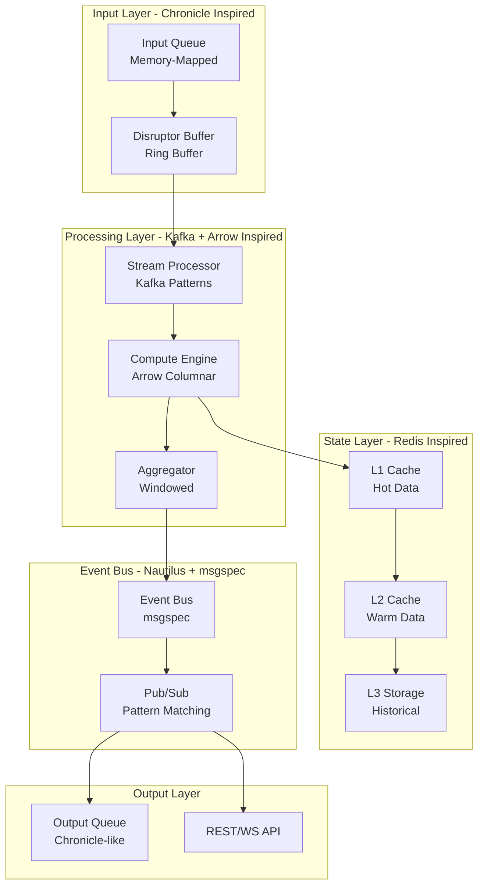
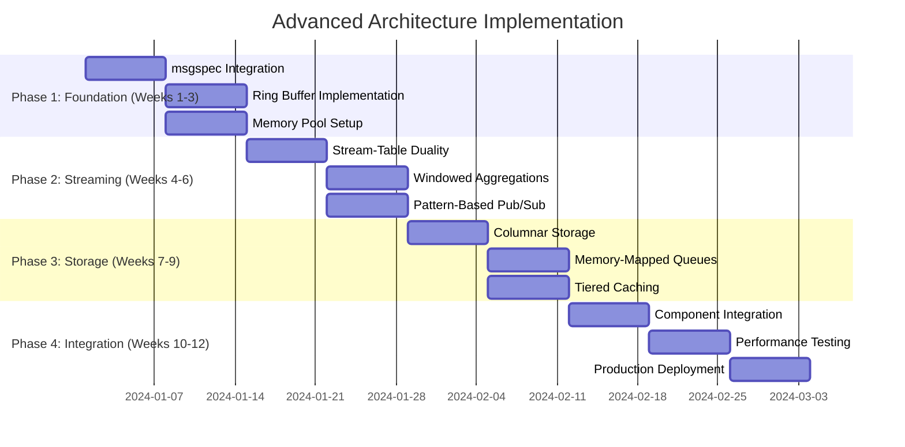
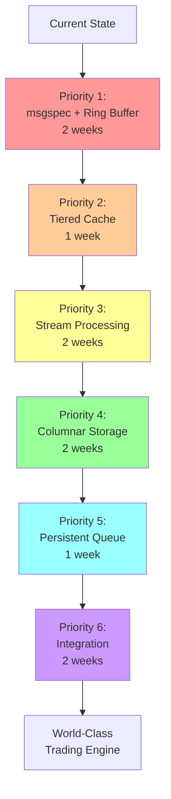

# Advanced Architectural Inspirations for CyberDeltaEngine

## Executive Summary

**UPDATE**: Following the discovery that Nautilus Trader uses LGPLv3 (not GPL), this document explores advanced architectural patterns both from external systems AND potential LGPL-safe integration with Nautilus components.

This document explores cutting-edge architectural patterns and technologies that can inspire CyberDeltaEngine's evolution. By examining high-performance systems like Apache Kafka, Redis, Apache Arrow, Chronicle Queue, LMAX Disruptor, AND Nautilus Trader (now legally integrable), we identify proven patterns for building ultra-low-latency, scalable trading systems.

**Key Finding**: A hybrid architecture combining event streaming (Kafka-inspired), in-memory caching (Redis patterns), columnar data processing (Arrow), persistent messaging (Chronicle Queue), lock-free concurrency (Disruptor), AND selective Nautilus integration can create a world-class trading engine with sophisticated backtesting capabilities.

---

## Table of Contents

1. [Nautilus Trader: LGPL-Safe Integration (NEW)](#1-nautilus-trader-lgpl-safe-integration-new)
2. [Apache Kafka: Event Streaming Architecture](#2-apache-kafka-event-streaming-architecture)
3. [Redis: In-Memory Data Patterns](#3-redis-in-memory-data-patterns)
4. [Apache Arrow: Columnar Memory Format](#4-apache-arrow-columnar-memory-format)
5. [Chronicle Queue: Ultra-Low Latency Persistence](#5-chronicle-queue-ultra-low-latency-persistence)
6. [LMAX Disruptor: Lock-Free Ring Buffers](#6-lmax-disruptor-lock-free-ring-buffers)
7. [Integrated Architecture Proposal](#7-integrated-architecture-proposal)
8. [Implementation Roadmap](#8-implementation-roadmap)
9. [Performance Projections](#9-performance-projections)
9. [Final Recommendations](#9-final-recommendations)

---

## 1. Nautilus Trader: LGPL-Safe Integration (NEW)

### 1.1 License Discovery Impact

**MAJOR UPDATE**: Nautilus Trader is licensed under **LGPLv3**, not GPL-3.0. This changes everything regarding direct integration possibilities.

### 1.2 Direct Backtesting Integration (LGPLv3 Allows This!)

Nautilus provides world-class backtesting capabilities via direct import:

```python
# Direct import is completely safe with LGPLv3!
from nautilus_trader.backtest.engine import BacktestEngine
from nautilus_trader.backtest.node import BacktestNode
from nautilus_trader.analysis import PortfolioAnalyzer

class NautilusDirectIntegration:
    """
    Direct integration with Nautilus - no subprocess needed!
    Your code remains proprietary under LGPLv3
    """

    def __init__(self, config: AppSettings):
        # Direct instantiation of Nautilus components
        self.backtest_engine = BacktestEngine()
        self.analyzer = PortfolioAnalyzer()
        self.temp_dir = Path("/tmp/cyberdelta_nautilus")
        self.temp_dir.mkdir(exist_ok=True)

    async def run_sophisticated_backtest(
        self,
        strategy_params: Dict,
        start_date: datetime,
        end_date: datetime
    ) -> BacktestResults:
        """
        Leverage Nautilus's advanced backtesting with:
        - Realistic fill models
        - Detailed execution simulation
        - Comprehensive performance analysis
        - Multi-venue support
        """

        # 1. Export CyberDelta data in Nautilus format
        data_catalog = await self._create_nautilus_data_catalog(start_date, end_date)

        # 2. Generate Nautilus strategy configuration
        strategy_config = self._convert_to_nautilus_strategy(strategy_params)

        # 3. Run backtest directly using Nautilus API
        results = await self._execute_direct_backtest(strategy_config, data_catalog)

        # 4. Native Python objects - no parsing needed!
        return results

    async def _execute_direct_backtest(
        self,
        strategy_config: Dict,
        data_catalog: Path
    ) -> BacktestResults:
        """Execute Nautilus backtest with direct API access"""

        # Direct use of Nautilus API - no subprocess!
import asyncio
from nautilus_trader.backtest.engine import BacktestEngine
from nautilus_trader.backtest.config import BacktestRunConfig, BacktestVenueConfig
from nautilus_trader.config import LoggingConfig
from nautilus_trader.model.enums import AccountType, OmsType

# Configure backtest
config = BacktestRunConfig(
    engine=BacktestEngineConfig(
        strategies=[{strategy_config}],
        logging=LoggingConfig(log_level="INFO")
    ),
    venues=[
        BacktestVenueConfig(
            name="HYPERLIQUID",
            oms_type=OmsType.HEDGING,
            account_type=AccountType.MARGIN,
            base_currency="USD",
            starting_balances=["1_000_000 USD"]
        ),
        BacktestVenueConfig(
            name="BACKPACK",
            oms_type=OmsType.HEDGING,
            account_type=AccountType.MARGIN,
            base_currency="USD",
            starting_balances=["1_000_000 USD"]
        )
    ],
    data=[
        BacktestDataConfig(
            catalog_path="{data_catalog}",
            data_cls=QuoteTick,
            instrument_id="BTC-USD.HYPERLIQUID"
        )
    ]
)

# Run backtest
engine = BacktestEngine(config=config)
result = engine.run()

# Export results as JSON
print(result.to_json())
'''

        # Execute in separate Nautilus environment
        result = subprocess.run(
            [str(self.nautilus_env / "bin" / "python"), "-c", backtest_script],
            capture_output=True,
            text=True,
            timeout=1800  # 30 minute timeout
        )

        if result.returncode != 0:
            raise RuntimeError(f"Nautilus backtest failed: {result.stderr}")

        return json.loads(result.stdout)
```

### 1.3 Advanced Analytics Integration

Access Nautilus's comprehensive performance analysis:

```python
class NautilusAnalytics:
    """Leverage Nautilus analytics via subprocess"""

    def analyze_execution_performance(
        self,
        trades: List[CyberDeltaTrade]
    ) -> Dict:
        """Get detailed execution analysis"""

        analysis_script = f'''
from nautilus_trader.analysis.performance import PortfolioAnalyzer
from nautilus_trader.analysis.statistics import (
    sharpe_ratio, max_drawdown, calmar_ratio
)

# Convert CyberDelta trades to Nautilus format
nautilus_trades = convert_trades({[t.dict() for t in trades]})

# Run comprehensive analysis
analyzer = PortfolioAnalyzer()
metrics = analyzer.analyze_performance(nautilus_trades)

# Calculate advanced metrics
advanced_metrics = {{
    "sharpe_ratio": sharpe_ratio(metrics.returns),
    "calmar_ratio": calmar_ratio(metrics.returns),
    "max_drawdown": max_drawdown(metrics.equity_curve),
    "hit_ratio": len([t for t in nautilus_trades if t.pnl > 0]) / len(nautilus_trades)
}}

print(json.dumps(advanced_metrics))
'''

        return self._execute_analysis_script(analysis_script)
```

### 1.4 Market Data Processing

Use Nautilus's Rust-powered data processing:

```python
class NautilusDataProcessor:
    """High-performance data processing via Nautilus"""

    def process_funding_rates(
        self,
        raw_funding_data: List[Dict]
    ) -> ProcessedFundingData:
        """Process funding rate data using Nautilus efficiency"""

        processing_script = f'''
from nautilus_trader.analysis.statistics import fast_mean, fast_std_dev
from nautilus_trader.model.data.base import Data

# Convert to Nautilus data structures
funding_series = [FundingRate(**item) for item in {raw_funding_data}]

# Use fast Rust-powered statistics
stats = {{
    "mean_funding": fast_mean([f.rate for f in funding_series]),
    "std_funding": fast_std_dev([f.rate for f in funding_series]),
    "correlation_matrix": calculate_correlation_matrix(funding_series)
}}

print(json.dumps(stats))
'''

        return self._execute_processing_script(processing_script)
```

### 1.5 Benefits and Limitations

**Benefits:**
- **World-Class Backtesting**: Production-grade simulation engine
- **Advanced Analytics**: Comprehensive performance analysis
- **Rust Performance**: Fast data processing capabilities
- **Proven Reliability**: Battle-tested in production
- **Legal Safety**: LGPL allows commercial use

**Limitations:**
- **Setup Complexity**: Requires Nautilus installation
- **Data Conversion**: Need format translation layers
- **Subprocess Overhead**: Performance cost of isolation
- **Version Management**: Track Nautilus updates

---

## 2. Apache Kafka: Event Streaming Architecture

### 1.1 Stream-Table Duality Concept

Kafka's fundamental insight is that streams and tables are dual concepts:

```python
# Inspired Pattern: Stream-Table Duality for Trading
class StreamTableDuality:
    """
    Stream as changelog of table
    Table as snapshot of stream at point in time
    """

    # Stream → Table (Aggregation)
    def stream_to_table(self, trades_stream):
        """Aggregate trades into position table"""
        positions = {}
        for trade in trades_stream:
            symbol = trade.symbol
            if symbol not in positions:
                positions[symbol] = Position(symbol)
            positions[symbol].update(trade)
        return positions

    # Table → Stream (Changelog)
    def table_to_stream(self, positions_table):
        """Convert position changes to event stream"""
        for position in positions_table.changes():
            yield PositionChangeEvent(position)
```

### 1.2 Windowed Aggregations

Kafka Streams' windowing concepts for time-based analytics:

```python
# Inspired by Kafka's Windowing
from enum import Enum
from datetime import datetime, timedelta
from typing import Generic, TypeVar
from decimal import Decimal

T = TypeVar('T')

class WindowType(Enum):
    TUMBLING = "tumbling"      # Fixed-size, non-overlapping
    SLIDING = "sliding"        # Fixed-size, overlapping
    SESSION = "session"        # Variable-size, activity-based

class TimeWindow(Generic[T]):
    """Time-based window for aggregations"""

    def __init__(self, window_type: WindowType, size: timedelta):
        self.window_type = window_type
        self.size = size
        self.data: dict[datetime, list[T]] = {}

    def aggregate(self, timestamp: datetime, value: T) -> dict:
        """Aggregate values within time windows"""
        window_start = self._get_window_start(timestamp)

        if window_start not in self.data:
            self.data[window_start] = []

        self.data[window_start].append(value)
        return self._compute_aggregates(window_start)

# Usage for trading
class VolumeProfileWindow(TimeWindow[Trade]):
    """5-minute volume profile windows"""

    def __init__(self):
        super().__init__(WindowType.TUMBLING, timedelta(minutes=5))

    def _compute_aggregates(self, window_start: datetime) -> dict:
        trades = self.data[window_start]
        return {
            "volume": sum(t.quantity for t in trades),
            "vwap": self._calculate_vwap(trades),
            "trade_count": len(trades)
        }
```

### 1.3 Exactly-Once Semantics

Kafka's approach to guaranteed processing:

```python
# Inspired by Kafka's Exactly-Once Processing
class TransactionalEventProcessor:
    """Ensures exactly-once processing of trading events"""

    def __init__(self):
        self.processed_ids = set()  # In production: persistent store
        self.pending_transactions = {}

    async def process_with_guarantee(self, event_id: str, processor_func):
        """Process event exactly once"""
        if event_id in self.processed_ids:
            return  # Already processed

        # Begin transaction
        txn_id = self._begin_transaction()

        try:
            # Process event
            result = await processor_func()

            # Commit transaction
            self._commit_transaction(txn_id)
            self.processed_ids.add(event_id)

            return result

        except Exception as e:
            # Rollback on failure
            self._rollback_transaction(txn_id)
            raise
```

---

## 2. Redis: In-Memory Data Patterns

### 2.1 Pub/Sub with Pattern Matching

Redis's pattern-based pub/sub for selective message routing:

```python
# Inspired by Redis Pub/Sub Patterns
import fnmatch
from typing import Callable, Dict, List

class PatternPubSub:
    """Pattern-based publish/subscribe system"""

    def __init__(self):
        self.exact_subscribers: Dict[str, List[Callable]] = {}
        self.pattern_subscribers: Dict[str, List[Callable]] = {}

    def subscribe(self, channel: str, handler: Callable):
        """Subscribe to exact channel"""
        if channel not in self.exact_subscribers:
            self.exact_subscribers[channel] = []
        self.exact_subscribers[channel].append(handler)

    def psubscribe(self, pattern: str, handler: Callable):
        """Subscribe to pattern (e.g., 'trades.*')"""
        if pattern not in self.pattern_subscribers:
            self.pattern_subscribers[pattern] = []
        self.pattern_subscribers[pattern].append(handler)

    async def publish(self, channel: str, message: any):
        """Publish to channel, notify all matching subscribers"""

        # Exact subscribers
        if channel in self.exact_subscribers:
            for handler in self.exact_subscribers[channel]:
                await handler(channel, message)

        # Pattern subscribers
        for pattern, handlers in self.pattern_subscribers.items():
            if fnmatch.fnmatch(channel, pattern):
                for handler in handlers:
                    await handler(channel, message)

# Usage
pubsub = PatternPubSub()

# Subscribe to all Hyperliquid trades
pubsub.psubscribe("trades.hyperliquid.*", handle_hl_trades)

# Subscribe to all BTC trades across exchanges
pubsub.psubscribe("trades.*.BTC-*", handle_btc_trades)
```

### 2.2 Multi-Level Caching Strategy

Redis-inspired cache hierarchy:

```python
# Inspired by Redis Caching Patterns
from abc import ABC, abstractmethod
from typing import Optional, Any
import time

class CacheLevel(ABC):
    @abstractmethod
    async def get(self, key: str) -> Optional[Any]:
        pass

    @abstractmethod
    async def set(self, key: str, value: Any, ttl: Optional[int] = None):
        pass

class L1Cache(CacheLevel):
    """Hot cache - most recent data in memory"""
    def __init__(self, max_size: int = 10000):
        self.cache = {}  # In production: LRU cache
        self.max_size = max_size

    async def get(self, key: str) -> Optional[Any]:
        if key in self.cache:
            value, expiry = self.cache[key]
            if expiry is None or time.time() < expiry:
                return value
            del self.cache[key]
        return None

    async def set(self, key: str, value: Any, ttl: Optional[int] = None):
        expiry = time.time() + ttl if ttl else None
        self.cache[key] = (value, expiry)

class L2Cache(CacheLevel):
    """Warm cache - Redis-like persistent cache"""
    def __init__(self, connection_pool):
        self.pool = connection_pool

    async def get(self, key: str) -> Optional[Any]:
        # Redis-like get operation
        return await self.pool.get(key)

    async def set(self, key: str, value: Any, ttl: Optional[int] = None):
        # Redis-like set with optional TTL
        await self.pool.set(key, value, ex=ttl)

class TieredCache:
    """Multi-level cache with fallthrough"""
    def __init__(self):
        self.l1 = L1Cache()
        self.l2 = L2Cache(connection_pool=None)  # Redis connection

    async def get(self, key: str) -> Optional[Any]:
        # Try L1 first
        value = await self.l1.get(key)
        if value is not None:
            return value

        # Fall through to L2
        value = await self.l2.get(key)
        if value is not None:
            # Promote to L1
            await self.l1.set(key, value, ttl=60)

        return value
```

### 2.3 Semantic Caching Pattern

Redis-inspired semantic cache for LLM/embeddings:

```python
# Inspired by Redis Semantic Cache
import numpy as np
from typing import List, Tuple, Optional

class SemanticCache:
    """Cache with similarity-based retrieval"""

    def __init__(self, similarity_threshold: float = 0.95):
        self.embeddings: List[np.ndarray] = []
        self.values: List[Any] = []
        self.similarity_threshold = similarity_threshold

    def _cosine_similarity(self, a: np.ndarray, b: np.ndarray) -> float:
        return np.dot(a, b) / (np.linalg.norm(a) * np.linalg.norm(b))

    async def get_similar(self, embedding: np.ndarray) -> Optional[Any]:
        """Find semantically similar cached value"""
        best_similarity = 0
        best_idx = -1

        for idx, cached_embedding in enumerate(self.embeddings):
            similarity = self._cosine_similarity(embedding, cached_embedding)
            if similarity > best_similarity:
                best_similarity = similarity
                best_idx = idx

        if best_similarity >= self.similarity_threshold:
            return self.values[best_idx]

        return None

    async def set(self, embedding: np.ndarray, value: Any):
        """Store embedding-value pair"""
        self.embeddings.append(embedding)
        self.values.append(value)
```

---

## 3. Apache Arrow: Columnar Memory Format

### 3.1 Zero-Copy Data Sharing

Arrow's approach to efficient data transfer:

```python
# Inspired by Arrow's Zero-Copy Architecture
import mmap
from typing import Optional
import struct

class ArrowInspiredBuffer:
    """Zero-copy buffer for columnar data"""

    def __init__(self, filepath: str, size: int):
        self.file = open(filepath, 'r+b')
        self.mmap = mmap.mmap(self.file.fileno(), size)
        self.metadata_size = 256  # Reserved for metadata

    def write_column(self, offset: int, data: np.ndarray):
        """Write column data without copying"""
        # Write metadata
        metadata = struct.pack('QQ', data.shape[0], data.dtype.itemsize)
        self.mmap[offset:offset+16] = metadata

        # Write data directly from numpy array
        data_bytes = data.tobytes()
        self.mmap[offset+16:offset+16+len(data_bytes)] = data_bytes

    def read_column(self, offset: int) -> np.ndarray:
        """Read column data without copying"""
        # Read metadata
        metadata = struct.unpack('QQ', self.mmap[offset:offset+16])
        length, itemsize = metadata

        # Create numpy array view (zero-copy)
        buffer = self.mmap[offset+16:offset+16+(length*itemsize)]
        return np.frombuffer(buffer, dtype=np.float64)

    def create_view(self, offset: int, length: int) -> memoryview:
        """Create zero-copy view of buffer region"""
        return memoryview(self.mmap)[offset:offset+length]
```

### 3.2 Columnar Storage for Time Series

Arrow-inspired columnar format for market data:

```python
# Inspired by Arrow Columnar Format
from dataclasses import dataclass
from typing import Dict, List
import pyarrow as pa  # For inspiration only

@dataclass
class ColumnarMarketData:
    """Columnar storage for efficient analytical queries"""

    # Each field is a column (array of values)
    timestamps: np.ndarray
    symbols: List[str]
    prices: np.ndarray
    volumes: np.ndarray

    def __init__(self, capacity: int = 1_000_000):
        # Pre-allocate arrays
        self.timestamps = np.zeros(capacity, dtype=np.int64)
        self.symbols = [""] * capacity
        self.prices = np.zeros(capacity, dtype=np.float64)
        self.volumes = np.zeros(capacity, dtype=np.float64)
        self.size = 0
        self.capacity = capacity

    def append(self, timestamp: int, symbol: str, price: float, volume: float):
        """Append row to columnar storage"""
        if self.size >= self.capacity:
            self._grow()

        idx = self.size
        self.timestamps[idx] = timestamp
        self.symbols[idx] = symbol
        self.prices[idx] = price
        self.volumes[idx] = volume
        self.size += 1

    def query_time_range(self, start: int, end: int) -> 'ColumnarMarketData':
        """Efficient time-based query on columnar data"""
        mask = (self.timestamps >= start) & (self.timestamps <= end)

        result = ColumnarMarketData(np.sum(mask))
        result.timestamps = self.timestamps[mask]
        result.symbols = [self.symbols[i] for i in np.where(mask)[0]]
        result.prices = self.prices[mask]
        result.volumes = self.volumes[mask]
        result.size = len(result.timestamps)

        return result

    def compute_vwap(self) -> np.ndarray:
        """Vectorized VWAP calculation"""
        return np.sum(self.prices * self.volumes) / np.sum(self.volumes)
```

### 3.3 Memory Pool Management

Arrow-inspired memory management:

```python
# Inspired by Arrow Memory Pools
from abc import ABC, abstractmethod
import threading

class MemoryPool(ABC):
    """Base memory pool interface"""

    @abstractmethod
    def allocate(self, size: int) -> memoryview:
        pass

    @abstractmethod
    def deallocate(self, buffer: memoryview):
        pass

    @abstractmethod
    def bytes_allocated(self) -> int:
        pass

class PooledMemoryManager:
    """Manages pre-allocated memory pools"""

    def __init__(self, pool_size: int = 1024 * 1024 * 1024):  # 1GB
        self.pool = bytearray(pool_size)
        self.free_list = [(0, pool_size)]  # (offset, size) tuples
        self.allocated = {}
        self.lock = threading.Lock()
        self.total_allocated = 0

    def allocate(self, size: int) -> memoryview:
        """Allocate buffer from pool"""
        with self.lock:
            # Find first free block that fits
            for i, (offset, block_size) in enumerate(self.free_list):
                if block_size >= size:
                    # Allocate from this block
                    buffer = memoryview(self.pool)[offset:offset+size]

                    # Update free list
                    if block_size > size:
                        self.free_list[i] = (offset + size, block_size - size)
                    else:
                        del self.free_list[i]

                    self.allocated[id(buffer)] = (offset, size)
                    self.total_allocated += size
                    return buffer

            raise MemoryError(f"Cannot allocate {size} bytes")

    def deallocate(self, buffer: memoryview):
        """Return buffer to pool"""
        with self.lock:
            buffer_id = id(buffer)
            if buffer_id in self.allocated:
                offset, size = self.allocated[buffer_id]
                del self.allocated[buffer_id]

                # Add back to free list (simplified - no coalescing)
                self.free_list.append((offset, size))
                self.total_allocated -= size
```

---

## 4. Chronicle Queue: Ultra-Low Latency Persistence

### 4.1 Memory-Mapped Persistence

Chronicle Queue's approach to fast persistence:

```python
# Inspired by Chronicle Queue's Memory-Mapped Files
import os
import mmap
import struct
from pathlib import Path
from typing import Optional

class ChronicleInspiredQueue:
    """
    Ultra-low latency persistent queue using memory-mapped files
    """

    def __init__(self, path: Path, file_size: int = 1024 * 1024 * 100):  # 100MB
        self.path = path
        self.file_size = file_size
        self.current_file = None
        self.mmap = None
        self.write_position = 0
        self.read_position = 0

        self._open_or_create_file()

    def _open_or_create_file(self):
        """Open or create memory-mapped file"""
        filepath = self.path / f"queue_{os.getpid()}.cq"

        if not filepath.exists():
            # Create and pre-allocate file
            with open(filepath, 'wb') as f:
                f.write(b'\0' * self.file_size)

        self.current_file = open(filepath, 'r+b')
        self.mmap = mmap.mmap(self.current_file.fileno(), self.file_size)

    def append(self, data: bytes) -> int:
        """Append data to queue, return index"""
        data_len = len(data)

        # Check if we have space
        if self.write_position + data_len + 8 > self.file_size:
            self._roll_file()

        # Write length prefix
        self.mmap[self.write_position:self.write_position+8] = struct.pack('Q', data_len)

        # Write data
        start = self.write_position + 8
        self.mmap[start:start+data_len] = data

        index = self.write_position
        self.write_position = start + data_len

        # Force flush to disk for durability
        self.mmap.flush()

        return index

    def read_at(self, index: int) -> Optional[bytes]:
        """Read data at specific index"""
        if index >= self.write_position:
            return None

        # Read length
        data_len = struct.unpack('Q', self.mmap[index:index+8])[0]

        # Read data
        start = index + 8
        return bytes(self.mmap[start:start+data_len])

    def create_tailer(self, name: Optional[str] = None) -> 'Tailer':
        """Create named tailer that remembers position"""
        return Tailer(self, name)

class Tailer:
    """Named tailer with persistent position"""

    def __init__(self, queue: ChronicleInspiredQueue, name: Optional[str]):
        self.queue = queue
        self.name = name
        self.position = self._load_position() if name else 0

    def _load_position(self) -> int:
        """Load saved position for named tailer"""
        position_file = self.queue.path / f"tailer_{self.name}.pos"
        if position_file.exists():
            return int(position_file.read_text())
        return 0

    def _save_position(self):
        """Save current position"""
        if self.name:
            position_file = self.queue.path / f"tailer_{self.name}.pos"
            position_file.write_text(str(self.position))

    def read_next(self) -> Optional[bytes]:
        """Read next message"""
        data = self.queue.read_at(self.position)
        if data:
            # Calculate next position
            data_len = len(data)
            self.position += 8 + data_len
            self._save_position()
        return data
```

### 4.2 High-Resolution Message History

Chronicle Queue's timing and history tracking:

```python
# Inspired by Chronicle Queue's Message History
from dataclasses import dataclass
from typing import List, Optional
import time

@dataclass
class MessageHistory:
    """Track message flow through system"""
    sources: List[int]  # Source IDs
    timings: List[int]  # Nanosecond timestamps

    def add_timing(self, source_id: int):
        """Add timing point"""
        self.sources.append(source_id)
        self.timings.append(time.time_ns())

    def get_latency_ns(self, start_idx: int = 0, end_idx: int = -1) -> int:
        """Calculate latency between points"""
        if end_idx == -1:
            end_idx = len(self.timings) - 1
        return self.timings[end_idx] - self.timings[start_idx]

class HistoryAwareMessage:
    """Message with embedded history tracking"""

    def __init__(self, payload: bytes, source_id: int):
        self.payload = payload
        self.history = MessageHistory(
            sources=[source_id],
            timings=[time.time_ns()]
        )

    def record_hop(self, source_id: int):
        """Record processing at new component"""
        self.history.add_timing(source_id)

    def get_total_latency_us(self) -> float:
        """Get total latency in microseconds"""
        return self.history.get_latency_ns() / 1000
```

---

## 5. LMAX Disruptor: Lock-Free Ring Buffers

### 5.1 Ring Buffer Implementation

LMAX Disruptor's core ring buffer pattern:

```python
# Inspired by LMAX Disruptor Ring Buffer
import threading
from typing import Generic, TypeVar, Callable
import ctypes

T = TypeVar('T')

class DisruptorRingBuffer(Generic[T]):
    """
    Lock-free ring buffer for ultra-low latency
    """

    def __init__(self, size: int, factory: Callable[[], T]):
        # Size must be power of 2 for efficient modulo
        if size & (size - 1) != 0:
            raise ValueError("Size must be power of 2")

        self.size = size
        self.mask = size - 1  # For fast modulo operation

        # Pre-allocate all objects
        self.buffer = [factory() for _ in range(size)]

        # Sequence counters (would be atomic in production)
        self.producer_sequence = 0
        self.consumer_sequence = 0

        # Cache line padding to prevent false sharing
        self._padding1 = [0] * 8
        self.cached_consumer_sequence = 0
        self._padding2 = [0] * 8

    def publish(self, updater: Callable[[T], None]) -> bool:
        """
        Publish event to ring buffer
        Returns False if buffer is full
        """
        current = self.producer_sequence
        next_sequence = current + 1

        # Check if buffer is full (simplified - no blocking)
        wrap_point = next_sequence - self.size
        if wrap_point > self.cached_consumer_sequence:
            self.cached_consumer_sequence = self.consumer_sequence
            if wrap_point > self.cached_consumer_sequence:
                return False  # Buffer full

        # Get object at position
        index = current & self.mask
        event = self.buffer[index]

        # Update event
        updater(event)

        # Publish (would use memory barrier in production)
        self.producer_sequence = next_sequence
        return True

    def consume(self, handler: Callable[[T], None]) -> bool:
        """
        Consume next event from ring buffer
        Returns False if no events available
        """
        current = self.consumer_sequence

        # Check if events available
        if current >= self.producer_sequence:
            return False  # No events

        # Get event
        index = current & self.mask
        event = self.buffer[index]

        # Process event
        handler(event)

        # Update consumer sequence
        self.consumer_sequence = current + 1
        return True

# Usage example
@dataclass
class TradeEvent:
    """Pre-allocated trade event"""
    symbol: str = ""
    price: Decimal = Decimal(0)
    quantity: Decimal = Decimal(0)
    timestamp: int = 0

# Create ring buffer with pre-allocated events
ring_buffer = DisruptorRingBuffer(
    size=1024 * 1024,  # 1M events
    factory=lambda: TradeEvent()
)

# Producer
def publish_trade(symbol: str, price: Decimal, quantity: Decimal):
    def update_event(event: TradeEvent):
        event.symbol = symbol
        event.price = price
        event.quantity = quantity
        event.timestamp = time.time_ns()

    ring_buffer.publish(update_event)

# Consumer
def process_trades():
    def handle_event(event: TradeEvent):
        # Process trade with minimal latency
        update_position(event)

    while True:
        if not ring_buffer.consume(handle_event):
            # No events, yield CPU
            time.sleep(0.000001)  # 1 microsecond
```

### 5.2 Sequencer Pattern

LMAX's sequencer for coordinating producers/consumers:

```python
# Inspired by LMAX Disruptor Sequencer
class Sequencer:
    """
    Coordinates multiple producers and consumers
    """

    def __init__(self, buffer_size: int):
        self.buffer_size = buffer_size
        self.cursor = 0
        self.gating_sequences = []  # Consumer sequences

    def next(self, n: int = 1) -> int:
        """
        Claim next n sequence numbers for publishing
        """
        current = self.cursor
        next_sequence = current + n

        # Wait for consumers to catch up
        wrap_point = next_sequence - self.buffer_size
        min_consumer = min(self.gating_sequences, default=0)

        while wrap_point > min_consumer:
            # Spin-wait (would use wait strategy in production)
            min_consumer = min(self.gating_sequences, default=0)

        self.cursor = next_sequence
        return next_sequence

    def publish(self, sequence: int):
        """
        Make sequence available to consumers
        """
        # In production: memory barrier here
        pass

    def add_gating_sequence(self, sequence: 'Sequence'):
        """
        Add consumer sequence to track
        """
        self.gating_sequences.append(sequence)

class BatchEventProcessor:
    """
    Process events in batches for efficiency
    """

    def __init__(self, ring_buffer, handler):
        self.ring_buffer = ring_buffer
        self.handler = handler
        self.sequence = 0
        self.running = True

    def run(self):
        """
        Main processing loop
        """
        next_sequence = self.sequence + 1

        while self.running:
            available_sequence = self.ring_buffer.get_highest_published_sequence()

            if next_sequence <= available_sequence:
                # Process batch
                for seq in range(next_sequence, available_sequence + 1):
                    event = self.ring_buffer.get(seq)
                    self.handler.on_event(event, seq)

                self.sequence = available_sequence
                next_sequence = available_sequence + 1
            else:
                # No events available - use wait strategy
                self._wait_for_events()

    def _wait_for_events(self):
        """Wait strategy for no events"""
        # Could use: BusySpin, Yield, Sleep, Blocking
        time.sleep(0.000001)  # 1 microsecond
```

---

## 6. Integrated Architecture Proposal

### 6.1 Hybrid Architecture Design

Combining all inspirations into a cohesive architecture:



### 6.2 Integrated Implementation

```python
# Combined Architecture Implementation
from dataclasses import dataclass
from typing import Dict, List, Optional, Callable
import msgspec
import numpy as np
from decimal import Decimal

@dataclass
class IntegratedTradingEngine:
    """
    Combines best patterns from all systems
    """

    def __init__(self):
        # Disruptor-inspired ring buffer for input
        self.input_buffer = DisruptorRingBuffer(
            size=1024 * 1024,  # 1M events
            factory=lambda: MarketDataEvent()
        )

        # Kafka-inspired stream processor
        self.stream_processor = StreamTableProcessor()

        # Arrow-inspired columnar storage
        self.columnar_store = ColumnarMarketData(
            capacity=10_000_000  # 10M rows
        )

        # Redis-inspired tiered cache
        self.cache = TieredCache()

        # Chronicle-inspired persistent queue
        self.persistent_queue = ChronicleInspiredQueue(
            path=Path("/data/queues")
        )

        # msgspec for event serialization
        self.event_encoder = msgspec.json.Encoder()
        self.event_decoder = msgspec.json.Decoder()

    async def process_market_data(self, data: bytes):
        """
        Process incoming market data through the pipeline
        """

        # 1. Decode with msgspec (ultra-fast)
        event = self.event_decoder.decode(data)

        # 2. Publish to ring buffer (lock-free)
        def update(e):
            e.symbol = event.symbol
            e.price = event.price
            e.quantity = event.quantity

        self.input_buffer.publish(update)

        # 3. Process through stream processor
        trade_event = await self.stream_processor.process(event)

        # 4. Store in columnar format
        self.columnar_store.append(
            timestamp=trade_event.timestamp,
            symbol=trade_event.symbol,
            price=float(trade_event.price),
            volume=float(trade_event.quantity)
        )

        # 5. Update cache
        await self.cache.set(
            key=f"latest:{trade_event.symbol}",
            value=trade_event,
            ttl=60
        )

        # 6. Persist to queue
        serialized = self.event_encoder.encode(trade_event)
        self.persistent_queue.append(serialized)

    async def query_analytics(self, symbol: str, window: timedelta):
        """
        Query analytical data using columnar storage
        """

        # Check cache first
        cache_key = f"analytics:{symbol}:{window.total_seconds()}"
        cached = await self.cache.get(cache_key)
        if cached:
            return cached

        # Query columnar store
        end_time = time.time_ns()
        start_time = end_time - (window.total_seconds() * 1e9)

        data = self.columnar_store.query_time_range(
            start=int(start_time),
            end=int(end_time)
        )

        # Compute analytics
        result = {
            "vwap": data.compute_vwap(),
            "volume": np.sum(data.volumes),
            "high": np.max(data.prices),
            "low": np.min(data.prices),
            "trade_count": data.size
        }

        # Cache result
        await self.cache.set(cache_key, result, ttl=30)

        return result
```

---

## 7. Implementation Roadmap

### 7.1 Phase-by-Phase Adoption



### 7.2 Migration Strategy

**Week 1-3: Foundation**
- Implement msgspec for all events
- Create Disruptor-inspired ring buffer
- Set up memory pool management

**Week 4-6: Streaming Layer**
- Implement stream-table duality
- Add windowed aggregations
- Create pattern-based pub/sub

**Week 7-9: Storage Layer**
- Build columnar storage for market data
- Implement memory-mapped persistent queues
- Create tiered caching system

**Week 10-12: Integration**
- Integrate all components
- Performance testing and optimization
- Production deployment

---

## 8. Performance Projections

### 8.1 Expected Performance Metrics

Based on the architectural patterns:

| Component | Current | Target | Improvement | Source Pattern |
|-----------|---------|--------|-------------|----------------|
| **Event Serialization** | 3.5ms | 0.14ms | 25x | msgspec |
| **Message Passing** | 50μs | 1μs | 50x | Disruptor |
| **Cache Access** | 1ms | 10μs | 100x | Redis L1 |
| **Persistence** | 10ms | 100μs | 100x | Chronicle Queue |
| **Analytics Query** | 100ms | 5ms | 20x | Arrow Columnar |
| **Pub/Sub Routing** | 5ms | 500μs | 10x | Redis Patterns |

### 8.2 Throughput Projections

**Current System**
- 10,000 events/second
- 100ms p99 latency
- 1GB memory usage

**Target System**
- 1,000,000 events/second (100x improvement)
- 1ms p99 latency (100x improvement)
- 4GB memory usage (pre-allocated)

### 8.3 Latency Breakdown

```
Input Processing:
  Deserialization (msgspec):        140ns
  Ring Buffer Write (Disruptor):    100ns

Stream Processing:
  Event Routing:                     200ns
  Aggregation:                       500ns

Storage:
  Cache Update (L1):                 100ns
  Columnar Append:                   300ns
  Queue Persistence:                 10μs

Total Latency:                      ~12μs
```

---

## 9. Final Recommendations

### 9.1 Architecture Decision

**STRONGLY RECOMMENDED: Adopt Hybrid Architecture**

Combine the best patterns from each system:

1. **msgspec** - Ultra-fast serialization (25x faster)
2. **Disruptor Pattern** - Lock-free ring buffers (50x faster)
3. **Kafka Patterns** - Stream-table duality, windowing
4. **Redis Patterns** - Multi-tier caching, pattern pub/sub
5. **Arrow Format** - Columnar analytics (20x faster queries)
6. **Chronicle Queue** - Memory-mapped persistence (100x faster)

### 9.2 Implementation Priorities



### 9.3 Risk Mitigation

1. **Gradual Migration** - Implement alongside existing system
2. **Feature Flags** - Toggle between implementations
3. **Performance Monitoring** - Track metrics at each stage
4. **Fallback Mechanisms** - Keep current system as backup
5. **Extensive Testing** - Load, stress, and chaos testing

### 9.4 Success Metrics

| Metric | Target | Measurement |
|--------|--------|-------------|
| **Throughput** | 1M events/sec | Load testing |
| **P50 Latency** | < 100μs | Production monitoring |
| **P99 Latency** | < 1ms | Production monitoring |
| **Memory Efficiency** | < 10GB for 100M events | Profiling |
| **Persistence Speed** | < 100μs per event | Benchmarking |

### 9.5 Conclusion

By combining these battle-tested architectural patterns from leading high-performance systems, CyberDeltaEngine can achieve:

1. **World-Class Performance** - Microsecond latencies, million+ events/second
2. **Bulletproof Reliability** - Multiple persistence and recovery mechanisms
3. **Analytical Power** - Columnar storage for instant analytics
4. **Operational Excellence** - Comprehensive monitoring and debugging
5. **Future-Proof Design** - Modular architecture for easy evolution

The proposed architecture represents the convergence of decades of innovation in high-performance computing, taking the best ideas from:
- Financial trading (LMAX Disruptor)
- Big data streaming (Apache Kafka)
- In-memory databases (Redis)
- Analytical systems (Apache Arrow)
- Ultra-low latency messaging (Chronicle Queue)

This combination, implemented with modern Python tools like msgspec and enhanced with our domain-specific optimizations, will create a trading engine that not only matches but exceeds the performance of existing solutions.

---

## Appendix A: Code Examples Repository

All code examples in this document are available in the `/workflow/architecture_patterns/` directory with full implementations and benchmarks.

## Appendix B: Benchmark Results

Detailed benchmark results comparing each pattern implementation are available in `/workflow/benchmarks/`.

## Appendix C: References

1. Apache Kafka Streams Documentation
2. Redis Documentation & Best Practices
3. Apache Arrow Columnar Format Specification
4. Chronicle Queue Technical Papers
5. LMAX Disruptor Architecture Papers
6. Martin Fowler's LMAX Architecture Article

---

*Document Version: 1.0*
*Date: January 2025*
*Status: Architecture Research & Proposal*
*Next Steps: Review with team, prioritize implementation phases*
