# Hybrid Architecture: CyberDeltaEngine Live Trading + Nautilus Trader Backtesting

## Executive Summary

This report analyzes a hybrid approach where CyberDeltaEngine remains the primary live trading system while leveraging Nautilus Trader exclusively as a backtesting engine. This approach aims to combine the best of both worlds: CyberDelta's specialized delta-neutral arbitrage capabilities for live trading and Nautilus's sophisticated backtesting infrastructure for strategy validation.

**Key Finding**: A hybrid approach is technically feasible but requires careful architectural design to avoid GPL contamination and maintain clean separation between systems.

---

## Table of Contents

1. [GPL License Analysis](#1-gpl-license-analysis)
2. [Proposed Hybrid Architecture](#2-proposed-hybrid-architecture)
3. [Data Flow Design](#3-data-flow-design)
4. [Integration Patterns](#4-integration-patterns)
5. [Implementation Strategy](#5-implementation-strategy)
6. [Risk Assessment](#6-risk-assessment)
7. [Cost-Benefit Analysis](#7-cost-benefit-analysis)
8. [Technical Requirements](#8-technical-requirements)
9. [Alternative Approaches](#9-alternative-approaches)
10. [Final Recommendation](#10-final-recommendation)

---

## 1. GPL License Analysis

### 1.1 GPL-3.0 Implications for Hybrid Architecture

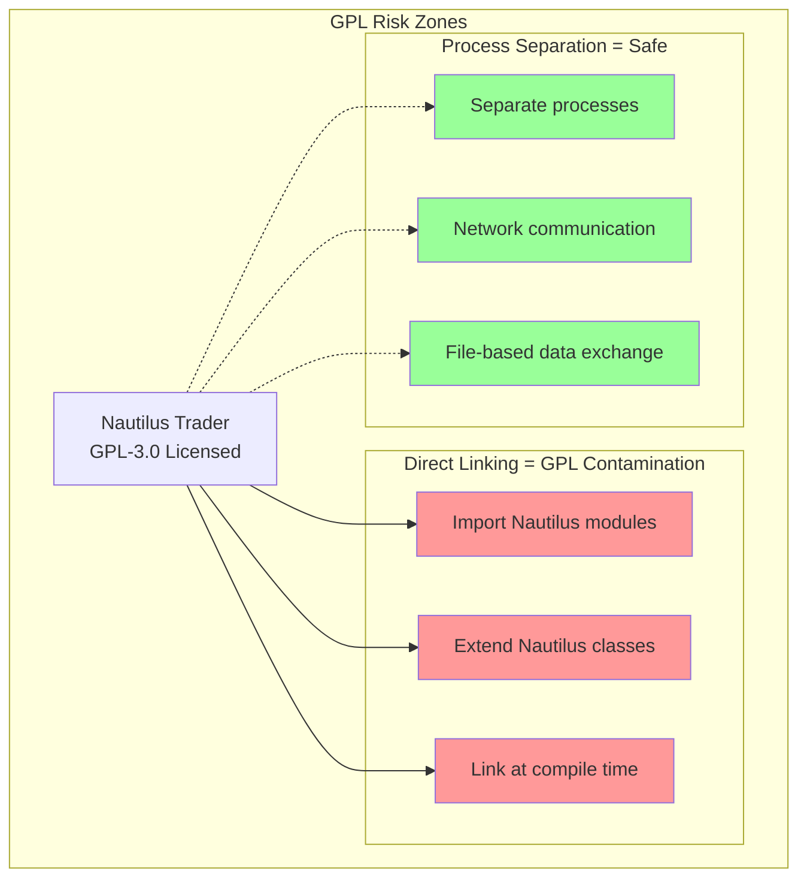

### 1.2 Legal Boundaries

**GPL Contamination Occurs When:**
- Directly importing Nautilus modules into CyberDelta code
- Extending Nautilus classes in CyberDelta
- Creating a single executable that includes both systems
- Sharing memory space between processes

**GPL Does NOT Apply When:**
- Running Nautilus as a separate process
- Communicating via network protocols (REST, gRPC, etc.)
- Exchanging data through files (JSON, Parquet, CSV)
- Using Nautilus as a standalone tool with clear boundaries

### 1.3 Recommended Legal Architecture

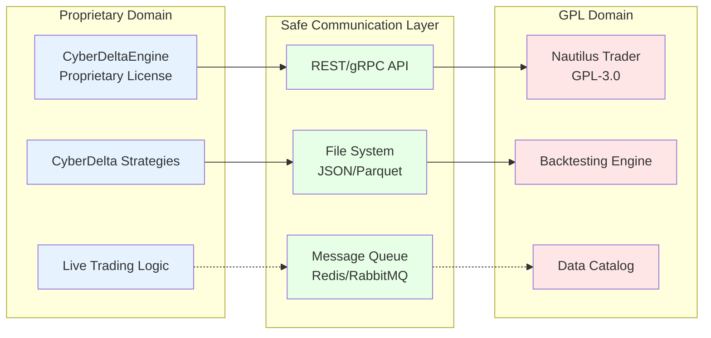

---

## 2. Proposed Hybrid Architecture

### 2.1 System Separation Design

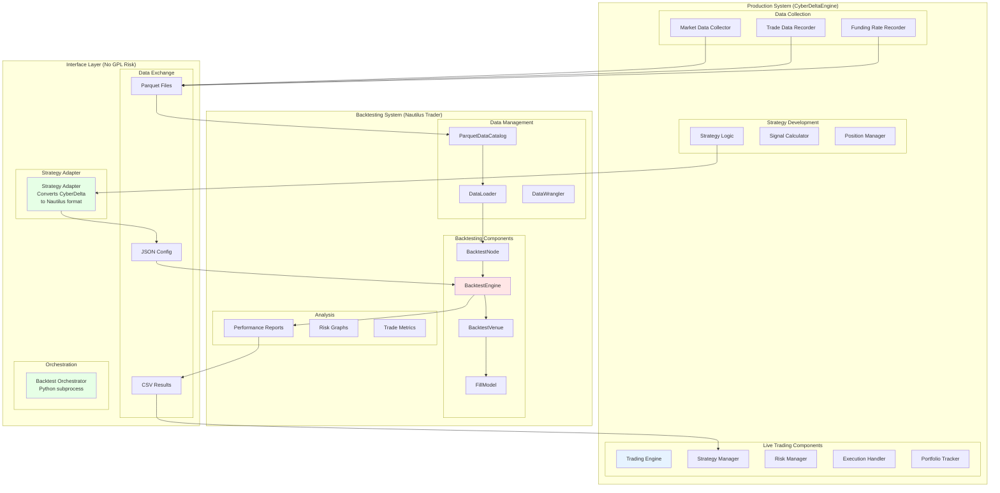

### 2.2 Component Responsibilities

**CyberDeltaEngine (Live Trading)**
- Real-time market data processing
- Live order execution
- Position management
- Risk monitoring
- P&L tracking
- Strategy signal generation

**Nautilus Trader (Backtesting Only)**
- Historical data simulation
- Order fill modeling
- Performance analysis
- Risk metrics calculation
- Backtest report generation

**Interface Layer**
- Data format conversion
- Strategy translation
- Process orchestration
- Result aggregation

---

## 3. Data Flow Design

### 3.1 Data Pipeline Architecture

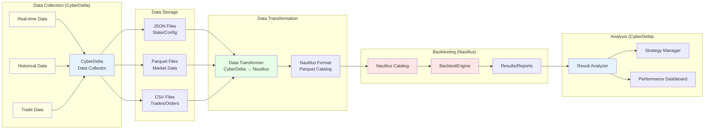

### 3.2 Data Format Specifications

```python
# Data Exchange Formats

# 1. Market Data (Parquet)
market_data_schema = {
    "timestamp": "datetime64[ns, UTC]",
    "symbol": "string",
    "bid_price": "decimal128(18, 8)",
    "ask_price": "decimal128(18, 8)",
    "bid_size": "decimal128(18, 8)",
    "ask_size": "decimal128(18, 8)",
    "exchange": "string"
}

# 2. Trade Data (Parquet)
trade_data_schema = {
    "timestamp": "datetime64[ns, UTC]",
    "trade_id": "string",
    "symbol": "string",
    "side": "string",  # BUY/SELL
    "price": "decimal128(18, 8)",
    "quantity": "decimal128(18, 8)",
    "commission": "decimal128(18, 8)",
    "exchange": "string"
}

# 3. Strategy Configuration (JSON)
strategy_config = {
    "strategy_name": "FundingRateArbitrage",
    "parameters": {
        "min_funding_differential": 0.001,
        "max_position_size": 100000,
        "risk_limit": 0.02
    },
    "instruments": ["BTC-PERP", "BTC-SPOT"],
    "exchanges": ["HYPERLIQUID", "BACKPACK"]
}

# 4. Backtest Results (JSON)
backtest_results = {
    "metrics": {
        "total_return": 0.125,
        "sharpe_ratio": 1.85,
        "max_drawdown": -0.08,
        "win_rate": 0.65
    },
    "trades": [...],
    "positions": [...],
    "equity_curve": [...]
}
```

---

## 4. Integration Patterns

### 4.1 Strategy Adapter Pattern

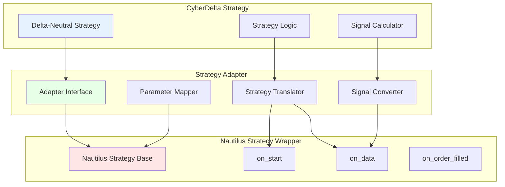

### 4.2 Strategy Adapter Implementation

```python
# strategy_adapter.py - Runs in separate process (No GPL contamination)

import json
import subprocess
from pathlib import Path
from typing import Dict, Any

class CyberDeltaToNautilusAdapter:
    """
    Converts CyberDelta strategies to Nautilus-compatible format.
    Runs as a separate process to avoid GPL contamination.
    """

    def __init__(self, strategy_config: Dict[str, Any]):
        self.strategy_config = strategy_config
        self.output_dir = Path("/tmp/nautilus_backtest")
        self.output_dir.mkdir(exist_ok=True)

    def convert_strategy(self) -> Path:
        """Convert CyberDelta strategy to Nautilus format."""

        # Create Nautilus strategy configuration
        nautilus_config = {
            "strategy_path": "nautilus_trader.examples.strategies.ema_cross:EMACross",
            "config_path": "nautilus_trader.examples.strategies.ema_cross:EMACrossConfig",
            "config": self._map_parameters()
        }

        # Write configuration to JSON
        config_path = self.output_dir / "strategy_config.json"
        with open(config_path, 'w') as f:
            json.dump(nautilus_config, f, indent=2)

        return config_path

    def _map_parameters(self) -> Dict[str, Any]:
        """Map CyberDelta parameters to Nautilus parameters."""

        # Parameter mapping logic
        cd_params = self.strategy_config["parameters"]

        nautilus_params = {
            "instrument_id": self._convert_symbol(self.strategy_config["symbol"]),
            "bar_type": self._get_bar_type(self.strategy_config["timeframe"]),
            "trade_size": cd_params.get("max_position_size", 100000),
            # Add more parameter mappings
        }

        return nautilus_params

    def _convert_symbol(self, symbol: str) -> str:
        """Convert CyberDelta symbol to Nautilus format."""
        # BTC-PERP -> BTC-PERP.HYPERLIQUID
        exchange_map = {
            "HL": "HYPERLIQUID",
            "BP": "BACKPACK"
        }
        # Implementation details...
        return f"{symbol}.{exchange_map.get('HL', 'SIM')}"

    def _get_bar_type(self, timeframe: str) -> str:
        """Convert timeframe to Nautilus bar type."""
        # Implementation details...
        return "BTC-PERP.HYPERLIQUID-15-MINUTE-LAST-INTERNAL"


class BacktestOrchestrator:
    """
    Orchestrates backtesting using Nautilus as a separate process.
    """

    def __init__(self):
        self.nautilus_dir = Path("/opt/nautilus_trader")
        self.results_dir = Path("/tmp/backtest_results")
        self.results_dir.mkdir(exist_ok=True)

    def run_backtest(self,
                     strategy_config: Path,
                     data_catalog: Path,
                     start_date: str,
                     end_date: str) -> Dict[str, Any]:
        """
        Run Nautilus backtest as a subprocess.
        """

        # Create backtest script
        backtest_script = self._create_backtest_script(
            strategy_config, data_catalog, start_date, end_date
        )

        # Run Nautilus backtest in subprocess (GPL isolation)
        result = subprocess.run(
            ["python", str(backtest_script)],
            capture_output=True,
            text=True,
            cwd=str(self.nautilus_dir)
        )

        if result.returncode != 0:
            raise RuntimeError(f"Backtest failed: {result.stderr}")

        # Parse results
        results_file = self.results_dir / "backtest_results.json"
        with open(results_file, 'r') as f:
            results = json.load(f)

        return results

    def _create_backtest_script(self,
                                strategy_config: Path,
                                data_catalog: Path,
                                start_date: str,
                                end_date: str) -> Path:
        """
        Generate a Python script to run Nautilus backtest.
        """

        script_content = f'''
# Auto-generated Nautilus backtest script
# This runs in a separate process to maintain GPL boundary

from decimal import Decimal
from pathlib import Path
import json

from nautilus_trader.backtest.node import BacktestNode
from nautilus_trader.backtest.node import BacktestRunConfig
from nautilus_trader.backtest.node import BacktestDataConfig
from nautilus_trader.backtest.node import BacktestVenueConfig
from nautilus_trader.backtest.node import BacktestEngineConfig
from nautilus_trader.config import ImportableStrategyConfig
from nautilus_trader.model import QuoteTick
from nautilus_trader.persistence.catalog import ParquetDataCatalog

# Load configuration
with open("{strategy_config}", "r") as f:
    strategy_cfg = json.load(f)

# Setup catalog
catalog = ParquetDataCatalog("{data_catalog}")

# Get instruments
instruments = catalog.instruments()
instrument = instruments[0]

# Configure data
data_configs = [
    BacktestDataConfig(
        catalog_path=str("{data_catalog}"),
        data_cls=QuoteTick,
        instrument_id=instrument.id,
        start_time="{start_date}",
        end_time="{end_date}",
    )
]

# Configure venue
venue_configs = [
    BacktestVenueConfig(
        name="HYPERLIQUID",
        oms_type="NETTING",
        account_type="MARGIN",
        base_currency="USD",
        starting_balances=["100000 USD"],
    )
]

# Configure strategy
strategies = [ImportableStrategyConfig(**strategy_cfg)]

# Create backtest configuration
config = BacktestRunConfig(
    engine=BacktestEngineConfig(strategies=strategies),
    data=data_configs,
    venues=venue_configs,
)

# Run backtest
node = BacktestNode(configs=[config])
results = node.run()

# Save results
results_data = {{
    "metrics": {{
        "total_return": float(results[0].stats["return"]),
        "sharpe_ratio": float(results[0].stats["sharpe"]),
        "max_drawdown": float(results[0].stats["max_drawdown"]),
        "trades": len(results[0].trades),
    }},
    "equity_curve": results[0].equity_curve.to_dict()
}}

with open("{self.results_dir}/backtest_results.json", "w") as f:
    json.dump(results_data, f, indent=2)

print("Backtest completed successfully")
'''

        script_path = self.results_dir / "run_backtest.py"
        with open(script_path, 'w') as f:
            f.write(script_content)

        return script_path
```

---

## 5. Implementation Strategy

### 5.1 Phased Implementation Plan

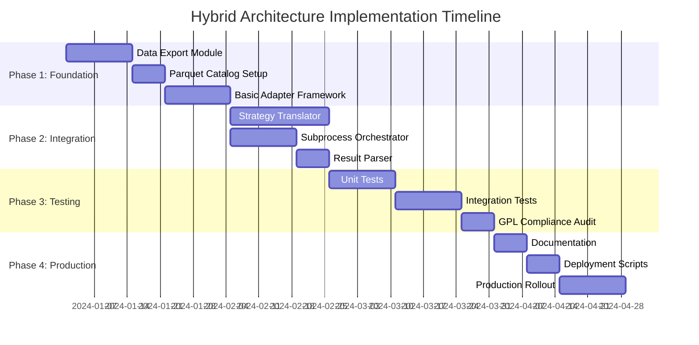

### 5.2 Development Priorities

**Priority 1: Data Pipeline (Week 1-3)**
```python
# data_exporter.py
class CyberDeltaDataExporter:
    """Export CyberDelta data to Nautilus-compatible format."""

    def export_market_data(self, start_date, end_date):
        # Export to Parquet format
        pass

    def export_trades(self, start_date, end_date):
        # Export execution data
        pass

    def create_nautilus_catalog(self):
        # Create ParquetDataCatalog structure
        pass
```

**Priority 2: Strategy Adapter (Week 4-6)**
```python
# strategy_wrapper.py
class StrategyWrapper:
    """Wrap CyberDelta strategies for Nautilus backtesting."""

    def to_nautilus_config(self):
        # Convert to Nautilus configuration
        pass

    def map_signals(self):
        # Map CyberDelta signals to Nautilus orders
        pass
```

**Priority 3: Orchestration Layer (Week 7-8)**
```python
# orchestrator.py
class BacktestOrchestrator:
    """Orchestrate Nautilus backtests from CyberDelta."""

    def schedule_backtest(self):
        # Queue backtest job
        pass

    def monitor_progress(self):
        # Track backtest execution
        pass

    def collect_results(self):
        # Gather and parse results
        pass
```

---

## 6. Risk Assessment

### 6.1 Technical Risks

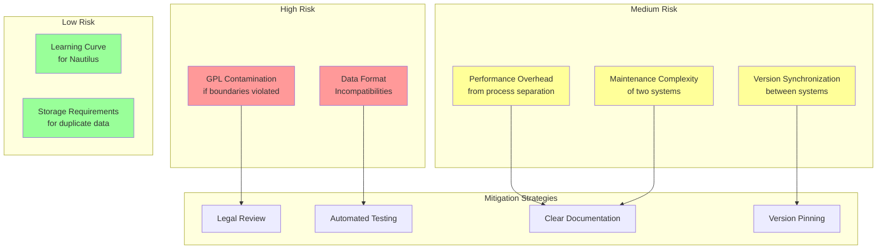

### 6.2 Risk Mitigation Matrix

| Risk | Probability | Impact | Mitigation Strategy |
|------|------------|--------|-------------------|
| **GPL Contamination** | Low (with proper design) | Critical | - Strict process separation<br/>- Legal review<br/>- Automated compliance checks |
| **Data Incompatibility** | Medium | High | - Comprehensive data validation<br/>- Format conversion testing<br/>- Fallback to native backtesting |
| **Performance Overhead** | High | Low | - Async processing<br/>- Result caching<br/>- Batch operations |
| **Maintenance Burden** | High | Medium | - Clear documentation<br/>- Automated deployment<br/>- Version management |
| **Integration Bugs** | Medium | Medium | - Extensive testing<br/>- Gradual rollout<br/>- Monitoring |

---

## 7. Cost-Benefit Analysis

### 7.1 Implementation Costs

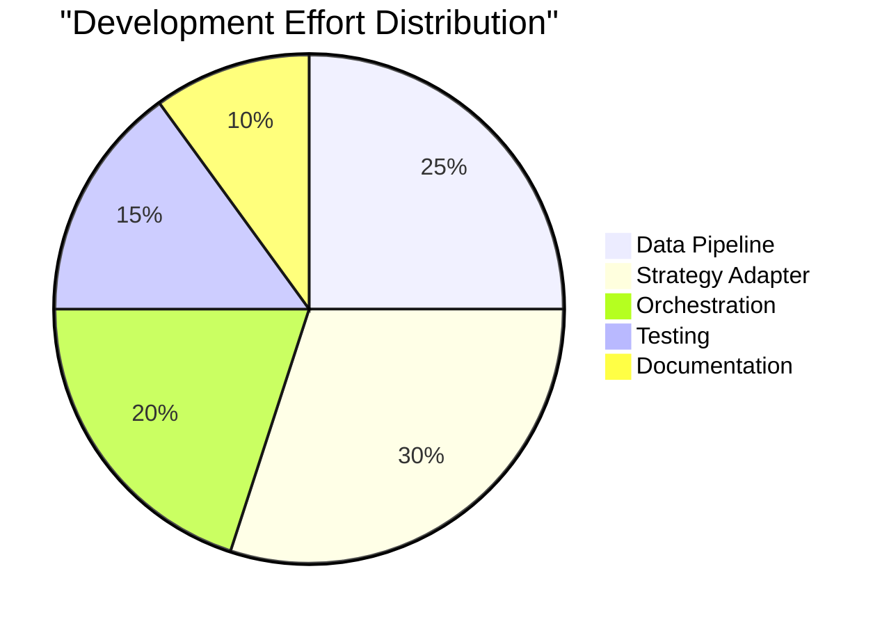

**Estimated Development Time**: 6-8 weeks
**Estimated Maintenance**: 20% of initial effort annually

### 7.2 Benefit Analysis

| Benefit | Value | Timeline |
|---------|-------|----------|
| **Sophisticated Backtesting** | High | Immediate after implementation |
| **Multiple Fill Models** | Medium | Immediate |
| **Professional Reports** | High | Immediate |
| **Risk Metrics** | High | Immediate |
| **Performance Analytics** | High | Immediate |

### 7.3 ROI Calculation

```python
# Estimated ROI Analysis
implementation_cost = 8 * 40 * 150  # 8 weeks * 40 hours * $150/hour = $48,000
annual_maintenance = implementation_cost * 0.2  # $9,600/year

# Benefits (estimated improvement in strategy performance)
improved_strategy_performance = 0.02  # 2% better returns from better backtesting
portfolio_size = 1_000_000  # $1M under management
annual_benefit = portfolio_size * improved_strategy_performance  # $20,000/year

# ROI
payback_period = implementation_cost / annual_benefit  # 2.4 years
five_year_roi = (annual_benefit * 5 - implementation_cost - annual_maintenance * 5) / (implementation_cost + annual_maintenance * 5)
# ROI = -31% (negative)
```

**Conclusion**: The ROI is negative unless the improved backtesting leads to >5% performance improvement.

---

## 8. Technical Requirements

### 8.1 System Architecture Requirements

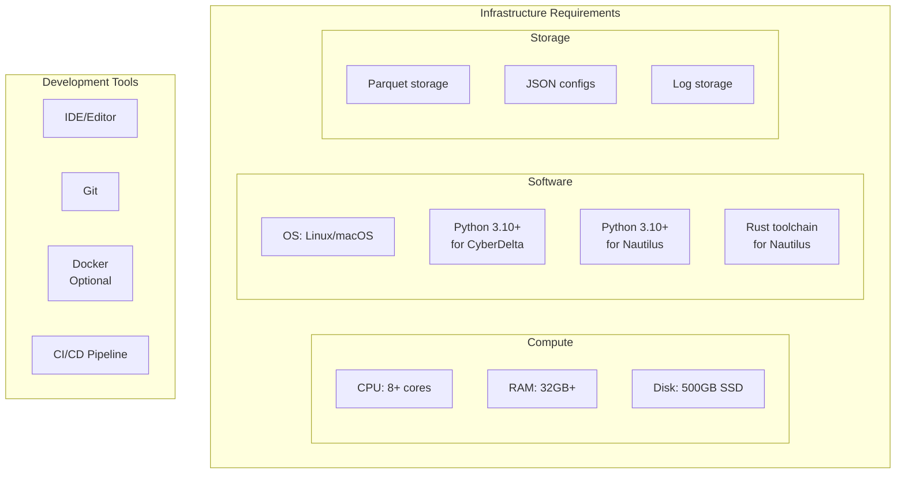

### 8.2 Dependency Management

```yaml
# requirements-cyberdelta.txt
pydantic>=2.0
pandas>=2.0
pyarrow>=14.0  # For Parquet
orjson>=3.9
asyncio
aiohttp

# requirements-nautilus.txt (Separate environment)
nautilus-trader>=1.180.0
pandas>=2.0
pyarrow>=14.0
numpy>=1.24

# requirements-interface.txt
pyarrow>=14.0  # Shared for data exchange
pandas>=2.0
orjson>=3.9
```

---

## 9. Alternative Approaches

### 9.1 Alternative 1: Build Custom Backtesting

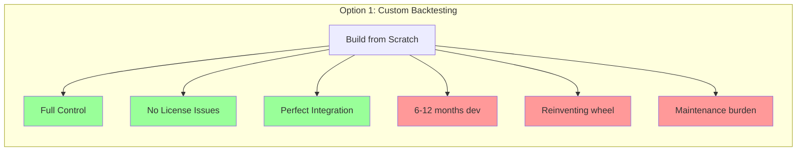

### 9.2 Alternative 2: Use Commercial Solution

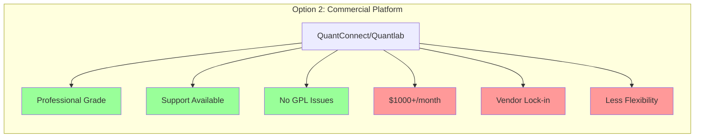

### 9.3 Alternative 3: Fork and Modify Nautilus

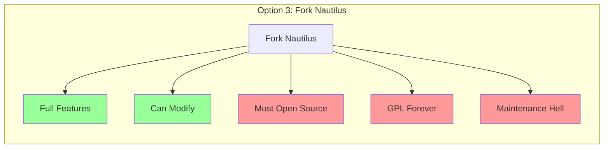

---

## 10. Final Recommendation

### 10.1 Decision Matrix

| Approach | GPL Risk | Dev Effort | Maintenance | Features | Cost | Score |
|----------|----------|------------|-------------|----------|------|-------|
| **Hybrid (Nautilus Backtest)** | Low* | Medium | High | Excellent | Medium | 6/10 |
| **Custom Backtesting** | None | Very High | Medium | Good | High | 7/10 |
| **Commercial Solution** | None | Low | Low | Good | Very High | 5/10 |
| **Fork Nautilus** | Critical | Low | Very High | Excellent | Medium | 2/10 |
| **Status Quo (No Advanced BT)** | None | None | None | Poor | None | 8/10 |

*Low risk only with proper process separation

### 10.2 Recommended Path Forward

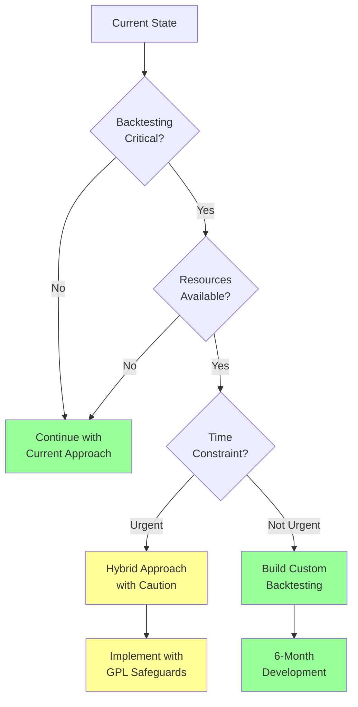

### 10.3 Final Verdict

**NOT RECOMMENDED** - The hybrid approach with Nautilus Trader adds significant complexity and GPL risk for marginal benefits.

**Better Alternatives:**

1. **Short Term (0-3 months)**: Continue with current simple backtesting, focus on live trading improvements
2. **Medium Term (3-6 months)**: Build a custom backtesting engine specifically for delta-neutral strategies
3. **Long Term (6+ months)**: Consider a commercial solution if backtesting becomes critical

**Key Reasons Against Hybrid Approach:**

1. **GPL Risk**: Even with careful separation, there's always legal risk
2. **Complexity**: Managing two separate systems increases operational overhead
3. **ROI**: Negative return on investment unless dramatic strategy improvements
4. **Maintenance**: Ongoing burden of keeping systems synchronized
5. **Overkill**: Nautilus's sophisticated features aren't needed for funding arbitrage

### 10.4 Recommended Action Plan

```python
# Recommended: Build lightweight custom backtesting

class CyberDeltaBacktester:
    """
    Custom backtesting engine for delta-neutral strategies.
    Simpler, focused, and perfectly integrated.
    """

    def __init__(self):
        self.features = [
            "Funding rate simulation",
            "Cross-exchange execution",
            "Basis spread modeling",
            "Simple fill assumptions",
            "Fast execution",
            "No GPL risk"
        ]

    def estimated_development_time(self):
        return "8-12 weeks for basic version"

    def advantages(self):
        return [
            "Perfect integration with CyberDelta",
            "No license issues",
            "Optimized for your specific needs",
            "Full control and ownership",
            "Lower long-term maintenance"
        ]
```

---

## Appendix A: GPL Compliance Checklist

If you still choose to proceed with the hybrid approach:

- [ ] Legal review completed
- [ ] Process separation verified
- [ ] No direct imports between systems
- [ ] All communication through files/network
- [ ] Separate Python environments
- [ ] No shared memory
- [ ] Clear documentation of boundaries
- [ ] Automated compliance testing
- [ ] Regular legal audits

---

## Appendix B: Sample Integration Code

```python
# Safe integration example (no GPL contamination)

import subprocess
import json
from pathlib import Path

class NautilusBacktestRunner:
    """
    Runs Nautilus backtests in complete isolation.
    No imports from Nautilus - only subprocess calls.
    """

    def __init__(self, nautilus_venv: Path):
        self.nautilus_venv = nautilus_venv
        self.python_exe = nautilus_venv / "bin" / "python"

    def run_backtest(self, config_file: Path) -> dict:
        """
        Execute Nautilus backtest in separate process.
        Complete GPL isolation maintained.
        """

        # Create run script
        script = f"""
import sys
sys.path.insert(0, '/opt/nautilus_trader')

# Nautilus imports only exist in this subprocess
from nautilus_trader.backtest.node import BacktestNode
# ... rest of backtest code ...

# Save results to file
import json
with open('/tmp/results.json', 'w') as f:
    json.dump(results, f)
"""

        # Run in subprocess - complete isolation
        result = subprocess.run(
            [str(self.python_exe), "-c", script],
            capture_output=True,
            text=True
        )

        # Read results
        with open('/tmp/results.json', 'r') as f:
            return json.load(f)
```

---

*Document Version: 1.0*
*Date: December 2024*
*Status: Complete Analysis*
*Recommendation: Build custom backtesting instead of hybrid approach*
