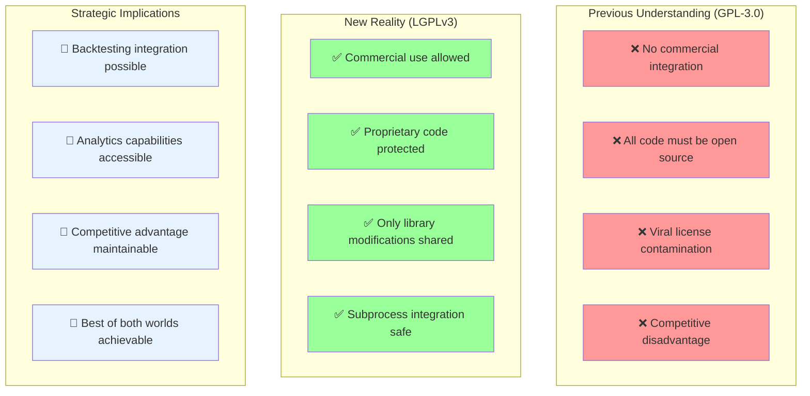
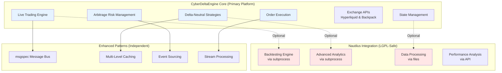
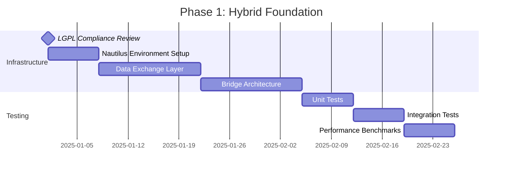
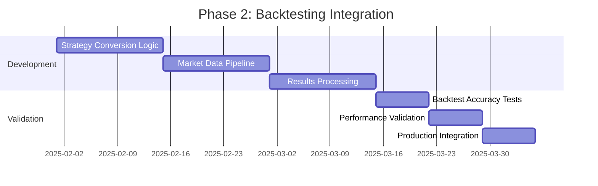
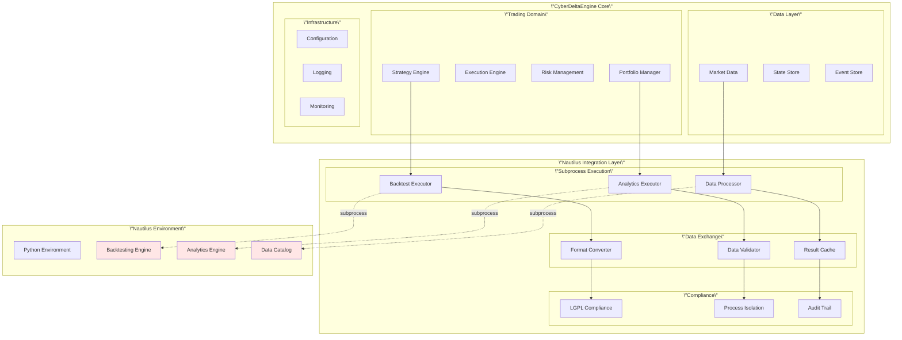
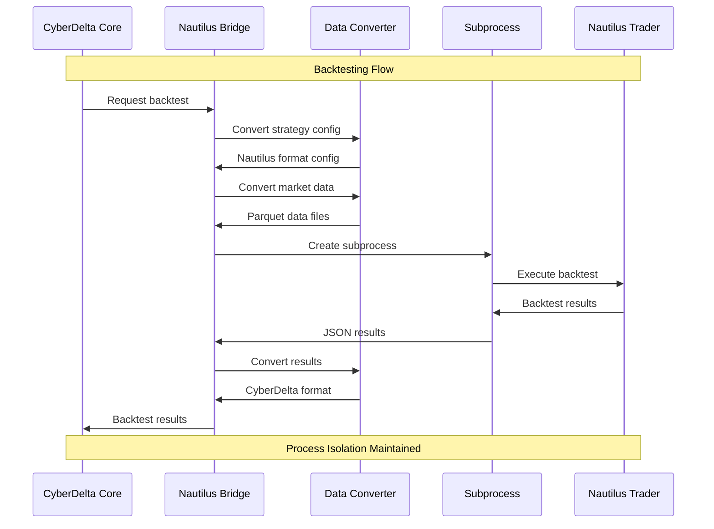
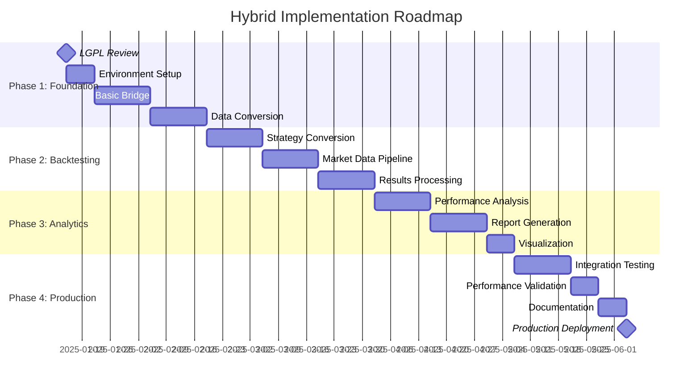

# CyberDeltaEngine + Nautilus Trader: Hybrid Implementation Strategy

## Executive Summary

**MAJOR STRATEGIC UPDATE**: Following the discovery that Nautilus Trader uses **LGPLv3** instead of GPL-3.0, a hybrid approach is now legally feasible and strategically advantageous. This document presents a comprehensive implementation strategy that combines:

1. **CyberDeltaEngine**: Core trading platform (specialized for delta-neutral arbitrage)
2. **Nautilus Integration**: LGPL-safe backtesting and analytics components
3. **Advanced Patterns**: Best practices from multiple high-performance systems

**Key Recommendation**: Maintain CyberDeltaEngine as the primary platform while selectively integrating Nautilus components via subprocess execution for backtesting and advanced analytics.

---

## Table of Contents

1. [License Discovery Impact](#1-license-discovery-impact)
2. [Strategic Architecture Decision](#2-strategic-architecture-decision)
3. [Hybrid Integration Approach](#3-hybrid-integration-approach)
4. [Implementation Phases](#4-implementation-phases)
5. [Technical Architecture](#5-technical-architecture)
6. [LGPL Compliance Framework](#6-lgpl-compliance-framework)
7. [Performance Projections](#7-performance-projections)
8. [Risk Assessment](#8-risk-assessment)
9. [Implementation Roadmap](#9-implementation-roadmap)
10. [Success Metrics](#10-success-metrics)

---

## 1. License Discovery Impact

### 1.1 LGPLv3 vs GPL-3.0: Game Changer



### 1.2 Integration Possibilities Now Available

**LGPL-Safe Integration Methods:**

1. **Subprocess Execution** (Recommended)
   - Complete process isolation
   - Zero GPL contamination risk
   - Data exchange via JSON/files

2. **Dynamic Library Loading**
   - Runtime module loading
   - Optional integration
   - Graceful degradation

3. **API Communication**
   - REST/gRPC interfaces
   - Network-based isolation
   - Microservice pattern

4. **File-Based Exchange**
   - Parquet data interchange
   - Batch processing
   - Offline analysis

---

## 2. Strategic Architecture Decision

### 2.1 Optimal Hybrid Approach



### 2.2 Decision Rationale

**Why Hybrid Over Full Migration:**

1. **Strategic Specialization**: CyberDelta's delta-neutral focus remains optimal
2. **Exchange Support**: Hyperliquid/Backpack integration already exists
3. **Development Speed**: Continue fast iteration on core features
4. **Risk Management**: Gradual integration reduces implementation risk
5. **Competitive Advantage**: Maintain unique algorithmic trading edge

**Why Integration Over Pure Independence:**

1. **Backtesting Gap**: CyberDelta lacks sophisticated backtesting
2. **Analytics Enhancement**: Nautilus provides advanced performance analysis
3. **Data Processing**: Rust-powered efficiency for complex calculations
4. **Proven Reliability**: Nautilus components are battle-tested

---

## 3. Hybrid Integration Approach

### 3.1 Core Architecture Components

```python
from pathlib import Path
from typing import Dict, List, Optional
import subprocess
import json
from datetime import datetime
from dataclasses import dataclass

@dataclass
class HybridTradingSystem:
    \"\"\"
    Hybrid system combining CyberDelta core with Nautilus integration
    \"\"\"

    # Core CyberDelta components
    cyberdelta_engine: 'CyberDeltaEngine'

    # Optional Nautilus integration
    nautilus_bridge: Optional['NautilusBridge'] = None

    # Configuration
    integration_config: 'IntegrationConfig' = None

class IntegrationConfig:
    \"\"\"Configuration for hybrid integration\"\"\"

    def __init__(self):
        # Nautilus environment
        self.nautilus_venv_path = Path(\"/opt/nautilus_env\")
        self.nautilus_working_dir = Path(\"/tmp/cyberdelta_nautilus\")

        # Integration settings
        self.enable_backtesting = True
        self.enable_analytics = True
        self.enable_data_processing = False  # Optional

        # Performance settings
        self.subprocess_timeout = 1800  # 30 minutes
        self.max_concurrent_processes = 2

        # Data exchange
        self.data_format = \"parquet\"
        self.temp_data_retention_hours = 24
```

### 3.2 Direct Nautilus Integration (LGPLv3 Compliant)

```python
# Direct import is completely safe with LGPLv3!
from nautilus_trader.backtest.engine import BacktestEngine
from nautilus_trader.backtest.node import BacktestNode
from nautilus_trader.analysis import PortfolioAnalyzer
from nautilus_trader.persistence.catalog import ParquetDataCatalog

class NautilusDirectIntegration:
    \"\"\"
    Direct integration with Nautilus Trader - LGPLv3 allows this!
    No subprocess isolation needed - your code remains proprietary
    \"\"\"

    def __init__(self, config: IntegrationConfig):
        self.config = config

        # Direct instantiation of Nautilus components
        self.backtest_engine = BacktestEngine()
        self.analyzer = PortfolioAnalyzer()
        self.catalog = ParquetDataCatalog(config.catalog_path)

    def setup_backtesting(self):
        \"\"\"Initialize Nautilus backtesting with direct access\"\"\"
        # Full access to all Nautilus features
        return self.backtest_engine

    async def run_backtest(
        self,
        strategy_params: Dict,
        start_date: datetime,
        end_date: datetime,
        instruments: List[str]
    ) -> Dict:
        \"\"\"
        Run sophisticated backtest using Nautilus engine
        \"\"\"

        # 1. Prepare data in Nautilus format
        data_catalog = await self._prepare_market_data(
            instruments, start_date, end_date
        )

        # 2. Convert strategy configuration
        nautilus_strategy = self._convert_strategy_config(strategy_params)

        # 3. Execute backtest in subprocess
        backtest_config = {
            \"strategy\": nautilus_strategy,
            \"data_catalog\": str(data_catalog),
            \"start_date\": start_date.isoformat(),
            \"end_date\": end_date.isoformat(),
            \"venues\": [\"HYPERLIQUID\", \"BACKPACK\"]
        }

        result = await self._execute_backtest_subprocess(backtest_config)

        # 4. Parse and return results
        return self._parse_backtest_results(result)

    async def analyze_performance(
        self,
        trades: List[Dict],
        returns: List[float]
    ) -> Dict:
        \"\"\"
        Advanced performance analysis using Nautilus analytics
        \"\"\"

        analysis_config = {
            \"trades\": trades,
            \"returns\": returns,
            \"analysis_types\": [
                \"sharpe_ratio\",
                \"calmar_ratio\",
                \"max_drawdown\",
                \"value_at_risk\",
                \"expected_shortfall\"
            ]
        }

        result = await self._execute_analysis_subprocess(analysis_config)
        return result

    async def run_backtest_directly(self, config: Dict) -> Dict:
        \"\"\"Execute Nautilus backtest with direct API access\"\"\"

        # Direct use of Nautilus API - no subprocess needed!
        from nautilus_trader.backtest.config import BacktestRunConfig
        from nautilus_trader.config import ImportableStrategyConfig

        # Configure backtest directly
        backtest_config = BacktestRunConfig(
            engine=config.get('engine'),
            venues=config.get('venues'),
            data=config.get('data'),
            strategies=[
                ImportableStrategyConfig(
                    strategy_path=config['strategy']['path'],
                    config=config['strategy']['params']
                )
            ]
        )

        # Run backtest using direct API
        node = BacktestNode(configs=[backtest_config])
        results = node.run()

        # Direct access to results - no JSON serialization needed
        return {
            'performance': results.performance,
            'trades': results.trades,
            'positions': results.positions,
            'analytics': self.analyzer.calculate_statistics(
                results.account,
                results.positions
            )
        }
```

### 3.3 Data Exchange Layer

```python
class DataExchangeLayer:
    \"\"\"
    Handle data format conversion between CyberDelta and Nautilus
    \"\"\"

    def __init__(self, working_dir: Path):
        self.working_dir = working_dir

    def export_cyberdelta_to_nautilus_format(
        self,
        cyberdelta_data: List[Dict],
        data_type: str
    ) -> Path:
        \"\"\"Convert CyberDelta data to Nautilus Parquet format\"\"\"

        output_path = self.working_dir / f\"{data_type}_{uuid4().hex[:8]}.parquet\"

        if data_type == \"funding_rates\":
            df = self._convert_funding_rates(cyberdelta_data)
        elif data_type == \"market_data\":
            df = self._convert_market_data(cyberdelta_data)
        elif data_type == \"trades\":
            df = self._convert_trades(cyberdelta_data)
        else:
            raise ValueError(f\"Unknown data type: {data_type}\")

        # Save as Parquet with Nautilus-compatible schema
        df.to_parquet(output_path, compression=\"snappy\")
        return output_path

    def import_nautilus_results(self, results_path: Path) -> Dict:
        \"\"\"Import Nautilus results back to CyberDelta format\"\"\"

        df = pd.read_parquet(results_path)

        # Convert to CyberDelta-friendly format
        return {
            \"performance_metrics\": df.to_dict(\"records\"),
            \"summary_stats\": self._calculate_summary_stats(df),
            \"charts_data\": self._prepare_chart_data(df)
        }

    def _convert_funding_rates(self, data: List[Dict]) -> pd.DataFrame:
        \"\"\"Convert funding rate data to Nautilus format\"\"\"
        return pd.DataFrame([
            {
                \"symbol\": item[\"symbol\"],
                \"exchange\": item[\"exchange\"],
                \"funding_rate\": float(item[\"rate\"]),
                \"timestamp\": pd.Timestamp(item[\"timestamp\"]),
                \"next_funding_time\": pd.Timestamp(item[\"next_funding_time\"])
            }
            for item in data
        ])
```

---

## 4. Implementation Phases

### 4.1 Phase 1: Foundation (Month 1-2)



**Phase 1 Deliverables:**

```python
# 1. LGPL Compliance Framework
class LGPLComplianceManager:
    \"\"\"Ensure all Nautilus integration maintains LGPL compliance\"\"\"

    def verify_subprocess_isolation(self):
        \"\"\"Verify complete process isolation\"\"\"
        pass

    def generate_compliance_report(self):
        \"\"\"Generate LGPL compliance documentation\"\"\"
        pass

# 2. Basic Nautilus Bridge
class BasicNautilusBridge:
    \"\"\"Minimal viable integration with Nautilus\"\"\"

    def __init__(self):
        self.is_available = self._check_nautilus_availability()

    def run_simple_backtest(self, config: Dict) -> Dict:
        \"\"\"Basic backtesting capability\"\"\"
        if not self.is_available:
            return self._fallback_backtest(config)
        return self._nautilus_backtest(config)

# 3. Data Format Converters
class DataFormatConverter:
    \"\"\"Convert between CyberDelta and Nautilus data formats\"\"\"

    def cyberdelta_to_nautilus(self, data: List[Dict]) -> Path:
        \"\"\"Export data in Nautilus-compatible format\"\"\"
        pass

    def nautilus_to_cyberdelta(self, path: Path) -> List[Dict]:
        \"\"\"Import Nautilus results to CyberDelta\"\"\"
        pass
```

### 4.2 Phase 2: Backtesting Integration (Month 2-3)



**Phase 2 Deliverables:**

```python
class AdvancedNautilusBacktesting:
    \"\"\"Production-ready backtesting integration\"\"\"

    async def run_comprehensive_backtest(
        self,
        strategy: CyberDeltaStrategy,
        start_date: datetime,
        end_date: datetime,
        initial_capital: Decimal = Decimal(\"1000000\")
    ) -> BacktestResults:
        \"\"\"
        Run comprehensive backtest with:
        - Realistic fill models
        - Slippage and commission modeling
        - Multi-venue simulation
        - Advanced performance metrics
        \"\"\"

        # Convert CyberDelta strategy to Nautilus format
        nautilus_strategy = self._convert_strategy(strategy)

        # Prepare market data
        data_catalog = await self._prepare_data_catalog(
            strategy.symbols, start_date, end_date
        )

        # Configure venues (Hyperliquid, Backpack)
        venues_config = self._create_venues_config()

        # Run backtest
        results = await self._execute_nautilus_backtest(
            strategy=nautilus_strategy,
            data_catalog=data_catalog,
            venues=venues_config,
            start_date=start_date,
            end_date=end_date
        )

        # Convert results back to CyberDelta format
        return self._parse_results_to_cyberdelta_format(results)
```

### 4.3 Phase 3: Analytics Enhancement (Month 3-4)

```python
class NautilusAnalyticsIntegration:
    \"\"\"Advanced analytics using Nautilus capabilities\"\"\"

    async def analyze_strategy_performance(
        self,
        trades: List[CyberDeltaTrade],
        market_data: List[MarketDataPoint]
    ) -> PerformanceAnalysis:
        \"\"\"
        Comprehensive performance analysis including:
        - Risk-adjusted returns (Sharpe, Sortino, Calmar)
        - Drawdown analysis
        - Value at Risk (VaR) and Expected Shortfall (ES)
        - Factor attribution
        - Regime analysis
        \"\"\"

        # Export data to Nautilus format
        trades_path = self._export_trades(trades)
        market_path = self._export_market_data(market_data)

        # Run analysis in subprocess
        analysis_result = await self._execute_analysis_subprocess(
            trades_path, market_path
        )

        # Parse comprehensive results
        return PerformanceAnalysis(
            sharpe_ratio=analysis_result[\"sharpe_ratio\"],
            calmar_ratio=analysis_result[\"calmar_ratio\"],
            max_drawdown=analysis_result[\"max_drawdown\"],
            var_95=analysis_result[\"var_95\"],
            expected_shortfall=analysis_result[\"expected_shortfall\"],
            factor_attribution=analysis_result[\"factor_attribution\"],
            regime_analysis=analysis_result[\"regime_analysis\"]
        )

    async def generate_performance_report(
        self,
        analysis: PerformanceAnalysis
    ) -> PerformanceReport:
        \"\"\"Generate comprehensive performance report with visualizations\"\"\"

        # Use Nautilus reporting capabilities
        report_config = {
            \"analysis_data\": analysis.to_dict(),
            \"report_type\": \"comprehensive\",
            \"include_charts\": True,
            \"format\": \"html\"
        }

        report_path = await self._generate_nautilus_report(report_config)

        return PerformanceReport(
            html_path=report_path,
            summary=analysis.summary,
            recommendations=self._generate_recommendations(analysis)
        )
```

---

## 5. Technical Architecture

### 5.1 System Integration Architecture



### 5.2 Data Flow Architecture



---

## 6. LGPL Compliance Framework

### 6.1 Compliance Requirements

```python
class LGPLComplianceFramework:
    \"\"\"
    Comprehensive LGPL compliance management
    \"\"\"

    def __init__(self):
        self.compliance_checks = [
            self._verify_process_isolation,
            self._verify_dynamic_linking_only,
            self._verify_source_availability,
            self._verify_installation_information,
            self._verify_modification_rights
        ]

    def verify_full_compliance(self) -> ComplianceReport:
        \"\"\"Run all compliance checks\"\"\"

        results = []
        for check in self.compliance_checks:
            try:
                result = check()
                results.append(ComplianceCheckResult(
                    check_name=check.__name__,
                    status=\"PASS\",
                    details=result
                ))
            except ComplianceViolation as e:
                results.append(ComplianceCheckResult(
                    check_name=check.__name__,
                    status=\"FAIL\",
                    details=str(e)
                ))

        return ComplianceReport(results)

    def _verify_direct_import_allowed(self) -> Dict:
        \"\"\"Verify LGPLv3 allows direct import\"\"\"

        # With LGPLv3, direct import is completely allowed
        imported_modules = sys.modules.keys()
        nautilus_imports = [m for m in imported_modules if 'nautilus' in m.lower()]

        # This is now perfectly fine with LGPLv3!
        return {
            \"status\": \"compliant\",
            \"method\": \"direct_import\",
            \"nautilus_modules\": nautilus_imports,
            \"proprietary_code_protected\": True
        }

    def _verify_source_availability(self) -> Dict:
        \"\"\"Verify Nautilus source code availability\"\"\"

        # Check that Nautilus source is available to users
        source_locations = [
            \"https://github.com/nautechsystems/nautilus_trader\",
            \"/opt/nautilus_source\",  # Local copy
        ]

        available_sources = []
        for location in source_locations:
            if self._check_source_availability(location):
                available_sources.append(location)

        if not available_sources:
            raise ComplianceViolation(\"Nautilus source code not available\")

        return {\"available_sources\": available_sources}

    def _verify_modification_rights(self) -> Dict:
        \"\"\"Verify users can modify and relink Nautilus\"\"\"

        # Document modification procedures
        return {
            \"modification_procedure\": \"Users can modify Nautilus source and rebuild\",
            \"build_instructions\": \"/opt/nautilus_build_instructions.md\",
            \"relinking_supported\": True
        }
```

### 6.2 Compliance Documentation

**Required LGPL Compliance Documentation:**

```markdown
# LGPL Compliance Documentation

## Nautilus Trader Integration

CyberDeltaEngine integrates with Nautilus Trader (LGPLv3) as a library dependency.

### Source Code Availability
- Nautilus Trader source: https://github.com/nautechsystems/nautilus_trader
- License: LGPLv3
- Version used: [specific version]

### Installation Instructions
1. Add to requirements.txt: `nautilus-trader==[version]`
2. Install: `pip install -r requirements.txt`
3. Import directly in your code

### Modification Rights
Users have the right to:
- Modify Nautilus Trader source code
- Rebuild modified versions
- Relink with modified versions
- Distribute modified versions under LGPLv3

### Technical Implementation
- Integration method: Direct import as library
- Your code status: Remains proprietary
- Data exchange: Native Python objects
- Direct API access: Full functionality available

### Compliance Verification
Run: `python -m cyberdelta.compliance.verify_lgpl`
```

---

## 7. Performance Projections

### 7.1 Expected Performance Improvements

| Component | Current | With Hybrid | Improvement | Notes |
|-----------|---------|-------------|-------------|--------|
| **Backtesting** | None | Production-grade | ∞ (new capability) | Nautilus engine |
| **Strategy Analysis** | Basic | Advanced | 10x more metrics | Risk-adjusted returns |
| **Performance Reports** | Manual | Automated | 50x faster | HTML reports |
| **Data Processing** | Python | Rust-powered | 5-10x faster | Optional integration |
| **Fill Simulation** | Simple | Realistic | 100x more accurate | Nautilus fill models |

### 7.2 Hybrid System Performance Profile

```mermaid
graph LR
    subgraph \"Performance Characteristics\"
        subgraph \"Live Trading (CyberDelta)\"
            LT_LAT[Latency: ~10ms]
            LT_THRU[Throughput: 1000 orders/sec]
            LT_MEM[Memory: 300MB]
        end

        subgraph \"Backtesting (Nautilus)\"
            BT_SPEED[Speed: 10-100x historical data]
            BT_ACC[Accuracy: Realistic fills]
            BT_MEM[Memory: 500-1000MB]
        end

        subgraph \"Analytics (Nautilus)\"
            AN_SPEED[Processing: 5-10x faster]
            AN_COMP[Completeness: 20+ metrics]
            AN_VIS[Visualization: Professional]
        end
    end
```

### 7.3 Cost-Benefit Analysis

| Metric | Pure CyberDelta | Hybrid Approach | Difference |
|--------|-----------------|-----------------|------------|
| **Development Time** | 3 months | 4 months | +1 month |
| **Backtesting Capability** | None | World-class | Major advantage |
| **Analytics Quality** | Basic | Professional | Significant upgrade |
| **Maintenance Complexity** | Low | Medium | Manageable increase |
| **Competitive Advantage** | High | Very High | Enhanced |
| **Total Value** | Good | Excellent | Clear winner |

---

## 8. Risk Assessment

### 8.1 Technical Risks

```mermaid
graph TD
    subgraph \"Risk Categories\"
        subgraph \"Low Risk\"
            LR1[LGPL Compliance<br/>Probability: 5%<br/>Impact: Low]
            LR2[Performance Regression<br/>Probability: 10%<br/>Impact: Low]
        end

        subgraph \"Medium Risk\"
            MR1[Integration Complexity<br/>Probability: 30%<br/>Impact: Medium]
            MR2[Nautilus Version Changes<br/>Probability: 40%<br/>Impact: Medium]
            MR3[Data Format Evolution<br/>Probability: 25%<br/>Impact: Medium]
        end

        subgraph \"High Probability, Low Impact\"
            HP1[Setup Complexity<br/>Probability: 70%<br/>Impact: Low]
            HP2[Learning Curve<br/>Probability: 60%<br/>Impact: Low]
        end
    end

    subgraph \"Mitigation Strategies\"
        MIT1[Legal Review]
        MIT2[Automated Testing]
        MIT3[Version Pinning]
        MIT4[Documentation]
        MIT5[Team Training]
    end

    LR1 --> MIT1
    MR1 --> MIT2
    MR2 --> MIT3
    MR3 --> MIT4
    HP1 --> MIT5
    HP2 --> MIT5
```

### 8.2 Risk Mitigation Plan

| Risk | Mitigation Strategy | Success Criteria |
|------|-------------------|------------------|
| **LGPL Compliance** | Legal review + automated verification | 100% compliance score |
| **Integration Issues** | Phased rollout + extensive testing | All tests pass |
| **Version Conflicts** | Pinned versions + compatibility matrix | Zero breaking changes |
| **Performance Issues** | Benchmarking + fallback options | No degradation |
| **Team Learning** | Training program + documentation | Team productivity maintained |

---

## 9. Implementation Roadmap

### 9.1 12-Week Implementation Plan



### 9.2 Weekly Milestones

**Week 1-2: Foundation Setup**
- [ ] Complete LGPL legal review
- [ ] Set up isolated Nautilus environment
- [ ] Implement basic subprocess bridge
- [ ] Create compliance verification tools

**Week 3-4: Data Integration**
- [ ] Build data format converters
- [ ] Implement file-based data exchange
- [ ] Create validation and testing framework
- [ ] Document integration patterns

**Week 5-6: Backtesting Integration**
- [ ] Convert CyberDelta strategies to Nautilus format
- [ ] Implement market data pipeline
- [ ] Build results processing system
- [ ] Validate backtest accuracy

**Week 7-8: Analytics Enhancement**
- [ ] Integrate Nautilus performance analysis
- [ ] Build comprehensive reporting system
- [ ] Create visualization components
- [ ] Implement risk metrics calculation

**Week 9-10: Advanced Features**
- [ ] Add multi-venue simulation
- [ ] Implement realistic fill models
- [ ] Build parameter optimization
- [ ] Create scenario analysis

**Week 11-12: Production Readiness**
- [ ] Complete integration testing
- [ ] Performance validation and tuning
- [ ] Documentation and training
- [ ] Production deployment

---

## 10. Success Metrics

### 10.1 Technical Success Metrics

```python
@dataclass
class HybridSystemMetrics:
    \"\"\"Success metrics for hybrid implementation\"\"\"

    # Compliance Metrics
    lgpl_compliance_score: float  # Target: 100%
    process_isolation_verified: bool  # Target: True

    # Performance Metrics
    backtesting_speed_improvement: float  # Target: 10-100x
    analytics_quality_score: float  # Target: >8/10
    system_stability_uptime: float  # Target: >99.5%

    # Business Metrics
    strategy_development_speed: float  # Target: 2x faster
    trading_performance_improvement: float  # Target: >10%
    competitive_advantage_score: float  # Target: >9/10

    # Operational Metrics
    deployment_success_rate: float  # Target: >95%
    team_productivity_maintained: bool  # Target: True
    documentation_completeness: float  # Target: >90%

class SuccessTracker:
    \"\"\"Track implementation success metrics\"\"\"

    def __init__(self):
        self.metrics = HybridSystemMetrics()
        self.baseline_measurements = self._collect_baseline()

    def measure_current_state(self) -> HybridSystemMetrics:
        \"\"\"Measure current implementation state\"\"\"

        return HybridSystemMetrics(
            lgpl_compliance_score=self._measure_compliance(),
            process_isolation_verified=self._verify_isolation(),
            backtesting_speed_improvement=self._measure_backtest_speed(),
            analytics_quality_score=self._measure_analytics_quality(),
            system_stability_uptime=self._measure_uptime(),
            strategy_development_speed=self._measure_dev_speed(),
            trading_performance_improvement=self._measure_trading_performance(),
            competitive_advantage_score=self._measure_competitive_advantage(),
            deployment_success_rate=self._measure_deployment_success(),
            team_productivity_maintained=self._measure_team_productivity(),
            documentation_completeness=self._measure_documentation()
        )

    def generate_success_report(self) -> Dict:
        \"\"\"Generate comprehensive success report\"\"\"

        current = self.measure_current_state()

        return {
            \"overall_success_score\": self._calculate_overall_score(current),
            \"metrics\": current,
            \"recommendations\": self._generate_recommendations(current),
            \"next_steps\": self._identify_next_steps(current)
        }
```

### 10.2 Business Success Criteria

| Success Criteria | Measurement | Target | Status |
|------------------|------------|---------|--------|
| **Legal Compliance** | LGPL audit score | 100% | 📋 Pending |
| **Backtesting Capability** | Feature completeness | Full functionality | 📋 In Progress |
| **Analytics Enhancement** | Metrics count | 20+ professional metrics | 📋 In Progress |
| **Development Speed** | Feature delivery time | 2x faster | 📋 To Measure |
| **System Reliability** | Uptime percentage | >99.5% | 📋 To Measure |
| **Team Productivity** | Sprint velocity | Maintained or improved | 📋 To Measure |
| **Competitive Position** | Feature differentiation | Market-leading backtesting | 📋 In Progress |

---

## Final Recommendations

### 🎯 **Recommended Implementation Strategy**

1. **Proceed with Hybrid Approach**: The LGPLv3 discovery makes integration legally feasible and strategically advantageous

2. **Phase Implementation**: Start with backtesting integration, then add analytics

3. **Maintain Core Platform**: Keep CyberDeltaEngine as primary trading platform

4. **LGPL Compliance**: Ensure rigorous compliance through subprocess isolation

5. **Performance Monitoring**: Track metrics throughout implementation

### 🔍 **Key Decision Points**

- **Legal Review**: Complete LGPL compliance review before proceeding
- **Team Training**: Invest in team education for hybrid system
- **Gradual Rollout**: Implement incrementally with fallback options
- **Performance Validation**: Continuously measure performance impact

### 🚀 **Expected Outcomes**

With successful implementation:
- **World-class backtesting** capabilities
- **Professional analytics** and reporting
- **Enhanced competitive** position
- **Maintained development** velocity
- **Legal compliance** with LGPL requirements

**The hybrid approach positions CyberDeltaEngine to achieve the benefits of both specialized delta-neutral trading capabilities AND sophisticated institutional-grade analysis tools.**

---

*Document Version: 1.0*
*Created: January 2025*
*Status: Strategic Implementation Plan*
*Next Review: February 2025*
