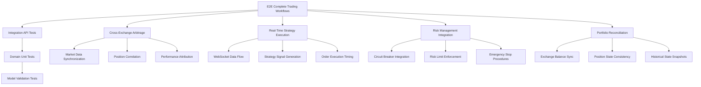
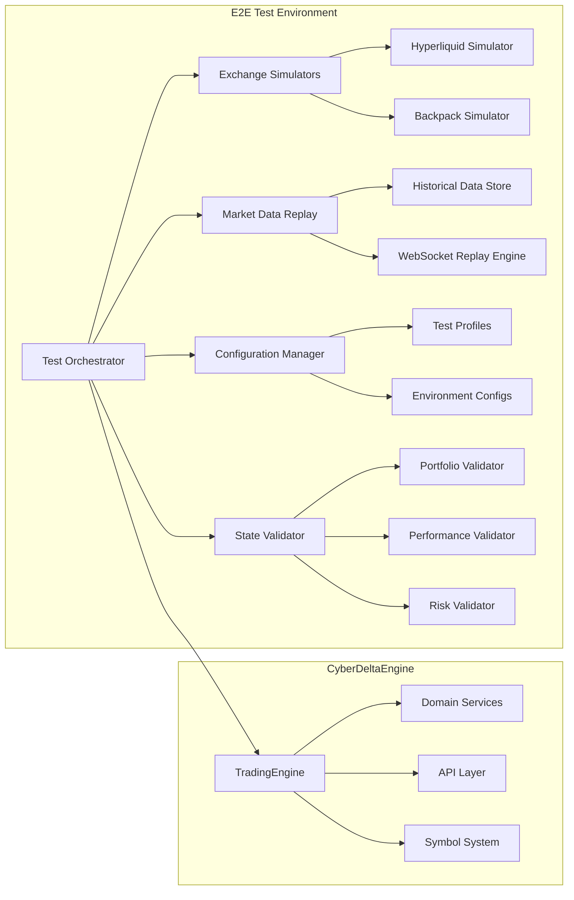

# CyberDeltaEngine E2E Testing Architecture and Strategy

## Executive Summary

This document presents a comprehensive End-to-End (E2E) testing architecture for the CyberDeltaEngine cryptocurrency trading system. Based on extensive analysis of the existing codebase, this architecture leverages the robust integration test foundation while extending capabilities to test complete business workflows from market data ingestion through strategy execution to portfolio reconciliation.

## Current Architecture Analysis

### Existing Strengths
The CyberDeltaEngine demonstrates exceptional testing infrastructure:

1. **Sophisticated Integration Test Structure**:
   - Well-organized test categorization (zero_balance, requires_balance, spot, perp, cross_exchange)
   - Comprehensive VCR recording for reproducible network interactions
   - Real API testing without critical operation mocking
   - Dynamic market data handling with no hardcoded financial values

2. **Production-Grade API Layer**:
   - Exchange-agnostic interfaces supporting Hyperliquid and Backpack
   - Comprehensive trading operations (spot, perpetuals, WebSocket streaming)
   - Robust error handling with standardized APIError types
   - Advanced rate limiting and circuit breaker patterns

3. **Comprehensive Domain Logic**:
   - 8 well-structured domain modules (market, portfolio, risk, trading, strategy, monitoring, safety, signal)
   - Event-driven architecture with EventBus coordination
   - Configuration-driven behavior with no hardcoded business logic
   - Rich domain models with proper validation

4. **Enterprise Application Layer**:
   - TradingEngine orchestrates complete trading workflows
   - Service registry for dependency injection
   - Comprehensive monitoring and alerting systems
   - Circuit breaker protection for all external operations

### Security and Financial Safety Compliance
The existing `TESTING_SECURITY_RULES.md` provides excellent foundation with critical requirements:

- **No hardcoded financial values** - all prices, quantities from real market data
- **Fail-fast error handling** - no graceful degradation that masks critical failures
- **Decimal precision enforcement** - no float arithmetic for monetary calculations
- **Real market data usage** - no mocking of critical financial operations
- **Comprehensive validation** - currency symbols, timezone handling, race conditions

## E2E Testing Architecture Design

### Testing Pyramid Extension



### E2E Test Categories

#### 1. Complete Trading Workflow Tests
**Scope**: End-to-end validation of complete trading cycles
```python
@pytest.mark.e2e
@pytest.mark.complete_workflow
async def test_momentum_strategy_complete_cycle():
    """Test complete momentum strategy from signal to portfolio update."""
    # Market data → Strategy analysis → Signal validation →
    # Risk assessment → Order execution → Fill processing →
    # Portfolio updates → Performance tracking
```

**Key Validations**:
- Data integrity across all domain boundaries
- State consistency after each workflow step
- Performance metrics calculation accuracy
- Event propagation through EventBus

#### 2. Cross-Exchange Arbitrage Tests
**Scope**: Multi-exchange coordination and position management
```python
@pytest.mark.e2e
@pytest.mark.cross_exchange
async def test_funding_rate_arbitrage_execution():
    """Test funding rate arbitrage across Hyperliquid and Backpack."""
    # Funding rate comparison → Opportunity detection →
    # Risk-adjusted sizing → Simultaneous execution →
    # Delta management → Performance attribution
```

**Key Validations**:
- Simultaneous order execution coordination
- Position correlation maintenance
- Exchange-specific risk limits adherence
- Cross-exchange portfolio reconciliation

#### 3. Real-Time Data Integration Tests
**Scope**: WebSocket data flow through complete system
```python
@pytest.mark.e2e
@pytest.mark.realtime
async def test_market_making_realtime_updates():
    """Test market making strategy with live WebSocket data."""
    # WebSocket price updates → Strategy recalculation →
    # Order adjustment → Fill processing →
    # Position updates → Performance tracking
```

**Key Validations**:
- Real-time data processing latency
- Strategy responsiveness to market changes
- Order management under high frequency updates
- Memory usage and performance monitoring

#### 4. Risk Management Integration Tests
**Scope**: Risk systems integration with trading operations
```python
@pytest.mark.e2e
@pytest.mark.risk_integration
async def test_risk_limit_enforcement_workflow():
    """Test risk limit enforcement in complete trading workflow."""
    # Position accumulation → Risk threshold detection →
    # Alert generation → Circuit breaker activation →
    # Position reduction → System recovery
```

**Key Validations**:
- Risk metric calculation accuracy
- Automated position sizing adjustments
- Circuit breaker activation and recovery
- Emergency stop capabilities

### Testing Environment Architecture



### Test Data Management

#### Market Data Scenarios
1. **Standard Market Conditions**: Normal volatility, typical spreads
2. **High Volatility Scenarios**: Stress testing with extreme price movements
3. **Low Liquidity Conditions**: Testing with wide spreads, low volume
4. **Market Structure Changes**: Symbol additions, trading halt scenarios

#### Account State Scenarios
1. **Funded Account Testing**: Realistic balance scenarios for live trading
2. **Zero Balance Testing**: Safe testing without financial risk
3. **Margin Account Testing**: Complex collateral and leverage scenarios
4. **Multi-Exchange Account States**: Cross-exchange balance distributions

#### Error Condition Scenarios
1. **Network Interruptions**: Connectivity loss and recovery testing
2. **Exchange Downtime**: Partial and complete exchange unavailability
3. **Rate Limiting**: API rate limit enforcement and recovery
4. **Data Corruption**: Invalid market data and response handling

## E2E Test Infrastructure Design

### Test Orchestration Layer

```python
# Core E2E Test Framework
class E2ETestOrchestrator:
    def __init__(self, config: E2ETestConfig):
        self.trading_engine = TradingEngine(config.engine_config)
        self.exchange_simulators = self._setup_simulators(config)
        self.market_data_replay = MarketDataReplayEngine(config)
        self.state_validator = StateValidator(config)

    async def execute_complete_workflow_test(
        self,
        scenario: TradingScenario
    ) -> E2ETestResult:
        """Execute complete E2E trading workflow test."""
        # Setup test environment
        await self._setup_test_environment(scenario)

        # Execute trading workflow
        results = await self._execute_workflow(scenario)

        # Validate final state
        validation_results = await self._validate_final_state(results)

        return E2ETestResult(
            scenario=scenario,
            execution_results=results,
            validation_results=validation_results,
            performance_metrics=self._calculate_performance_metrics(results)
        )
```

### Exchange Simulation Layer

```python
class ExchangeSimulator:
    """Realistic exchange API simulation for E2E testing."""

    def __init__(self, exchange_name: str, config: SimulatorConfig):
        self.exchange_name = exchange_name
        self.order_book_simulator = OrderBookSimulator(config)
        self.latency_simulator = LatencySimulator(config)
        self.error_injector = ErrorInjector(config)

    async def simulate_order_execution(
        self,
        order: PlaceOrderArgs
    ) -> SimulatedOrderResult:
        """Simulate realistic order execution with latency and slippage."""
        # Apply network latency
        await self.latency_simulator.apply_network_delay()

        # Check for simulated errors
        if self.error_injector.should_inject_error():
            raise self.error_injector.generate_error()

        # Execute against simulated order book
        execution = await self.order_book_simulator.execute_order(order)

        return SimulatedOrderResult(
            order_id=execution.order_id,
            fill_price=execution.fill_price,
            fill_quantity=execution.fill_quantity,
            remaining_quantity=execution.remaining_quantity,
            execution_latency=self.latency_simulator.get_last_latency()
        )
```

### State Validation Framework

```python
class StateValidator:
    """Comprehensive state validation for E2E tests."""

    def __init__(self, config: ValidationConfig):
        self.portfolio_validator = PortfolioStateValidator(config)
        self.risk_validator = RiskStateValidator(config)
        self.performance_validator = PerformanceValidator(config)

    async def validate_complete_state(
        self,
        trading_engine: TradingEngine
    ) -> StateValidationResult:
        """Validate complete system state across all domains."""

        # Portfolio state validation
        portfolio_result = await self.portfolio_validator.validate_portfolio_consistency(
            trading_engine.portfolio_service
        )

        # Risk state validation
        risk_result = await self.risk_validator.validate_risk_metrics(
            trading_engine.risk_service
        )

        # Performance validation
        performance_result = await self.performance_validator.validate_performance_calculation(
            trading_engine.monitoring.performance_tracker
        )

        return StateValidationResult(
            portfolio_validation=portfolio_result,
            risk_validation=risk_result,
            performance_validation=performance_result,
            overall_health=self._calculate_overall_health(
                portfolio_result, risk_result, performance_result
            )
        )
```

## Integration with Existing Test Infrastructure

### Leveraging Current Capabilities

1. **VCR Integration**: Extend VCR usage for E2E test reproducibility
```python
@pytest.mark.e2e
@pytest.mark.vcr(cassette_library_dir="e2e_cassettes")
async def test_arbitrage_workflow_recorded():
    """E2E arbitrage test with recorded network interactions."""
```

2. **Helper Function Extension**: Build on existing test helpers
```python
# Extend from tests/integration/apis/shared/validation_helpers.py
def validate_complete_trading_workflow(
    initial_portfolio: dict,
    final_portfolio: dict,
    executed_trades: list[Fill],
    expected_performance: dict
) -> WorkflowValidationResult:
    """Validate complete trading workflow results."""
```

3. **Configuration Integration**: Use existing test configuration patterns
```python
# Extend from existing conftest.py patterns
@pytest_asyncio.fixture
async def e2e_trading_engine(
    active_config: AppSettings,
    exchange_simulators: dict[str, ExchangeSimulator]
) -> TradingEngine:
    """E2E trading engine with simulated exchanges."""
```

### Test Organization Structure

```
tests/
├── e2e/                                    # New E2E test directory
│   ├── conftest.py                        # E2E-specific fixtures
│   ├── workflows/                         # Complete workflow tests
│   │   ├── test_momentum_strategy_e2e.py
│   │   ├── test_arbitrage_workflow_e2e.py
│   │   └── test_risk_management_e2e.py
│   ├── cross_exchange/                    # Cross-exchange coordination tests
│   │   ├── test_funding_rate_arbitrage.py
│   │   └── test_position_synchronization.py
│   ├── realtime/                          # Real-time data integration tests
│   │   ├── test_websocket_strategy_integration.py
│   │   └── test_market_making_realtime.py
│   ├── performance/                       # Performance and scale tests
│   │   ├── test_high_frequency_execution.py
│   │   └── test_extended_operation.py
│   ├── simulators/                        # Exchange simulators
│   │   ├── hyperliquid_simulator.py
│   │   └── backpack_simulator.py
│   ├── fixtures/                          # E2E test data and scenarios
│   │   ├── trading_scenarios.py
│   │   └── market_data_replays.py
│   └── validators/                        # State validation utilities
│       ├── portfolio_validators.py
│       ├── risk_validators.py
│       └── performance_validators.py
├── integration/                           # Existing integration tests
└── unit/                                  # Existing unit tests
```

## Performance and Scalability Considerations

### Test Execution Performance
1. **Parallel Execution**: E2E tests run in isolated environments
2. **Resource Management**: Controlled memory and CPU usage
3. **Test Duration**: Target 5-10 minutes per complete workflow test
4. **Cleanup Procedures**: Automatic cleanup of test state and resources

### Monitoring and Observability
1. **Test Metrics**: Execution time, resource usage, success rates
2. **Performance Baselines**: Expected performance characteristics
3. **Regression Detection**: Automated performance regression identification
4. **Test Health Monitoring**: Test infrastructure health and reliability

### Continuous Integration Integration
1. **Test Scheduling**: Daily complete E2E test suite execution
2. **Selective Execution**: Critical path tests on every merge
3. **Environment Management**: Automated test environment provisioning
4. **Result Analysis**: Automated test result analysis and reporting

## Risk Mitigation and Safety

### Financial Safety Measures
1. **Simulated Environments**: All E2E tests use simulated exchanges
2. **Zero-Risk Categories**: Safe test execution without real funds
3. **Balance Verification**: Comprehensive balance and position validation
4. **Emergency Stops**: Built-in emergency stop capabilities

### Test Environment Isolation
1. **Network Isolation**: E2E tests run in isolated network environments
2. **Configuration Isolation**: Separate configurations for different test scenarios
3. **Data Isolation**: Test-specific databases and storage
4. **Service Isolation**: Isolated service instances for parallel testing

### Error Recovery and Debugging
1. **Detailed Logging**: Comprehensive logging throughout E2E test execution
2. **State Snapshots**: Automated state snapshots at key workflow points
3. **Failure Analysis**: Automated failure analysis and categorization
4. **Recovery Procedures**: Standardized recovery procedures for test failures

## Implementation Roadmap

### Phase 1: Foundation (4 weeks)
1. **Week 1**: Exchange simulator implementation
2. **Week 2**: Market data replay engine development
3. **Week 3**: State validation framework creation
4. **Week 4**: Basic workflow test implementation

### Phase 2: Core Workflows (4 weeks)
1. **Week 5-6**: Momentum strategy E2E tests
2. **Week 7**: Cross-exchange arbitrage tests
3. **Week 8**: Real-time data integration tests

### Phase 3: Advanced Scenarios (4 weeks)
1. **Week 9-10**: Risk management integration tests
2. **Week 11**: Performance and scale testing
3. **Week 12**: Error scenario and recovery testing

### Phase 4: Production Integration (2 weeks)
1. **Week 13**: CI/CD integration and automation
2. **Week 14**: Documentation and training materials

## Success Metrics

### Test Coverage Metrics
1. **Workflow Coverage**: 100% of critical trading workflows tested
2. **Error Scenario Coverage**: 95% of identified error scenarios covered
3. **Performance Baseline Coverage**: All performance-critical paths baselined

### Quality Metrics
1. **Bug Detection Rate**: E2E tests catch 90%+ of workflow-level bugs
2. **False Positive Rate**: <5% false positive rate in E2E test results
3. **Test Reliability**: 99%+ test result reliability and consistency

### Business Impact Metrics
1. **Deployment Confidence**: Increased confidence in production deployments
2. **Time to Market**: Reduced time for new feature validation
3. **Production Stability**: Reduced production issues through comprehensive testing

## Conclusion

This E2E testing architecture provides comprehensive validation of the CyberDeltaEngine's complete trading workflows while building on the excellent foundation of existing integration tests. The architecture emphasizes financial safety, realistic testing scenarios, and comprehensive validation to ensure the system performs correctly under all trading conditions.

The phased implementation approach allows for gradual capability building while maintaining the existing high-quality testing standards. The combination of exchange simulation, market data replay, and comprehensive state validation provides confidence in the system's behavior across all critical trading scenarios.
