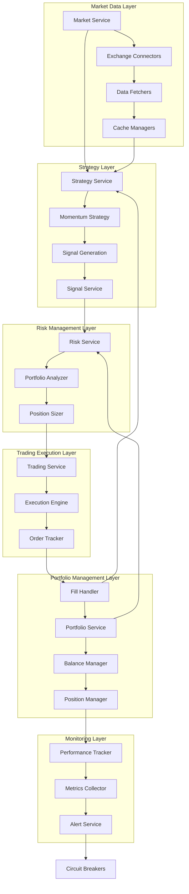
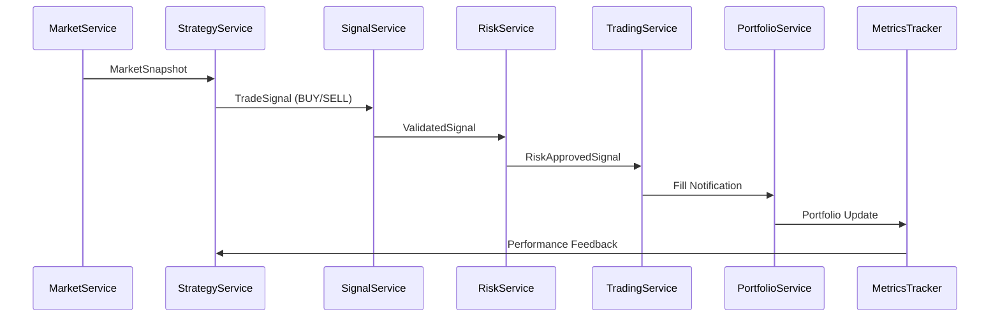
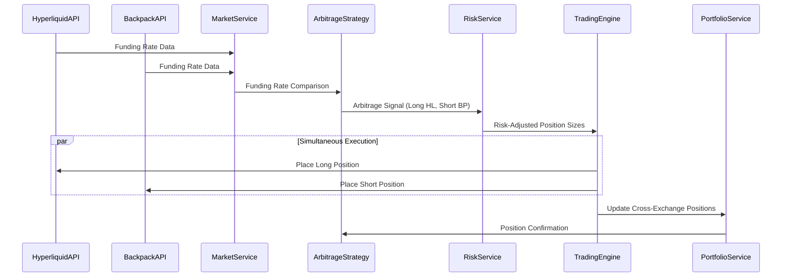
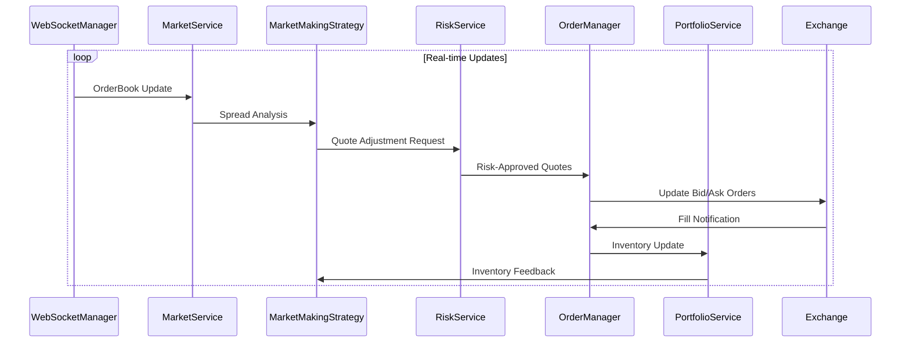
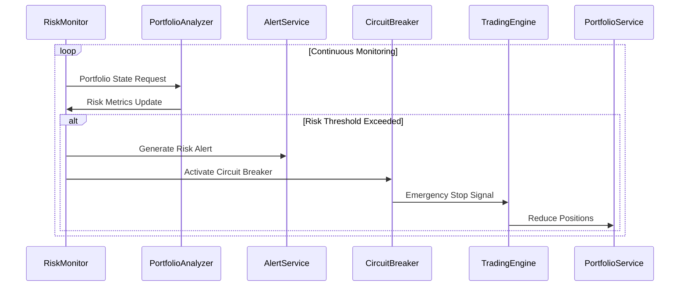
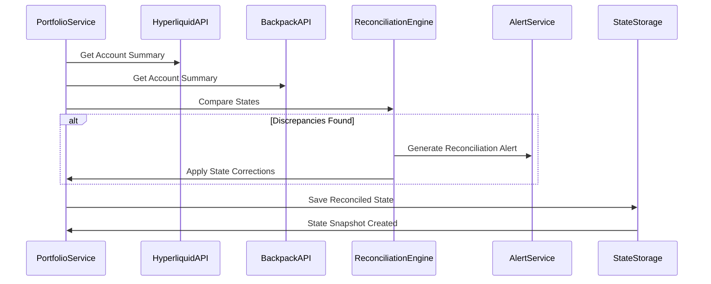

# CyberDeltaEngine Business Workflows and E2E Test Scenarios

## Executive Summary

This document defines the critical business workflows within the CyberDeltaEngine and specifies comprehensive End-to-End test scenarios to validate each workflow. Based on deep analysis of the domain layer architecture, this specification ensures complete coverage of all business logic flows from market data ingestion through portfolio reconciliation.

## Business Workflow Analysis

### Core Trading Workflow Architecture



## Critical Business Workflows

### 1. Complete Momentum Trading Workflow

**Business Process**: Market data analysis → Signal generation → Risk assessment → Order execution → Portfolio updates → Performance tracking



**E2E Test Scenario**:
```python
@pytest.mark.e2e
@pytest.mark.momentum_workflow
async def test_momentum_strategy_complete_cycle():
    """
    Test complete momentum trading workflow from market data to portfolio update.

    Scenario: Momentum strategy detects upward price movement and executes trades
    - Market data shows BTC price increasing with volume confirmation
    - Strategy generates BUY signal with high confidence
    - Risk service validates signal against portfolio limits
    - Trading service executes market order
    - Portfolio service updates positions and balances
    - Performance tracker calculates strategy attribution
    """

    # Setup: Configure momentum strategy with test parameters
    strategy_config = MomentumStrategyConfig(
        symbol="BTC_USD",
        lookback_periods=20,
        momentum_threshold=Decimal("0.02"),  # 2% momentum threshold
        position_size_pct=Decimal("0.1"),    # 10% of portfolio per trade
        exchange="hyperliquid"
    )

    # Step 1: Inject market data showing momentum conditions
    market_data = create_momentum_market_scenario(
        symbol="BTC_USD",
        price_increase_pct=Decimal("0.025"),  # 2.5% price increase
        volume_increase_pct=Decimal("1.5"),   # 50% volume increase
        duration_minutes=30
    )

    # Step 2: Execute complete workflow
    workflow_result = await execute_complete_trading_workflow(
        strategy_config=strategy_config,
        market_data=market_data,
        initial_portfolio=test_portfolio,
        expected_duration=timedelta(minutes=5)
    )

    # Step 3: Validate complete workflow results
    assert workflow_result.signal_generated is True
    assert workflow_result.signal.side == OrderSide.BUY
    assert workflow_result.risk_approved is True
    assert workflow_result.order_executed is True
    assert workflow_result.portfolio_updated is True

    # Step 4: Validate financial calculations
    validate_momentum_workflow_financials(
        initial_portfolio=test_portfolio,
        final_portfolio=workflow_result.final_portfolio,
        executed_trades=workflow_result.executed_trades,
        expected_pnl_range=(Decimal("-100"), Decimal("500"))  # Expected PnL range
    )

    # Step 5: Validate performance attribution
    performance_metrics = workflow_result.performance_metrics
    assert performance_metrics.sharpe_ratio is not None
    assert performance_metrics.strategy_attribution["momentum_strategy"] > Decimal("0")

    # Step 6: Validate state consistency
    validate_cross_domain_state_consistency(
        portfolio_state=workflow_result.final_portfolio,
        trading_state=workflow_result.trading_state,
        risk_state=workflow_result.risk_state
    )
```

### 2. Cross-Exchange Funding Rate Arbitrage Workflow

**Business Process**: Funding rate comparison → Opportunity detection → Multi-exchange position setup → Delta management → Performance attribution



**E2E Test Scenario**:
```python
@pytest.mark.e2e
@pytest.mark.cross_exchange
@pytest.mark.funding_arbitrage
async def test_funding_rate_arbitrage_complete_workflow():
    """
    Test complete funding rate arbitrage workflow across exchanges.

    Scenario: Significant funding rate differential creates arbitrage opportunity
    - Hyperliquid BTC-PERP funding rate: +0.01% (8h)
    - Backpack BTC_PERP funding rate: -0.005% (8h)
    - Net funding differential: 0.015% (0.045% daily)
    - Strategy executes long Hyperliquid, short Backpack
    """

    # Setup: Configure funding rate arbitrage scenario
    arbitrage_config = FundingArbitrageConfig(
        symbol_internal="BTC_USD",
        exchanges=["hyperliquid", "backpack"],
        min_funding_differential=Decimal("0.001"),  # 0.1% minimum
        max_position_size=Decimal("10000"),         # $10k per leg
        hedge_ratio=Decimal("1.0")                  # Perfect hedge
    )

    # Step 1: Setup funding rate differential
    funding_scenario = create_funding_rate_scenario(
        hyperliquid_funding=Decimal("0.0001"),    # +0.01%
        backpack_funding=Decimal("-0.00005"),     # -0.005%
        funding_period_hours=8
    )

    # Step 2: Execute complete arbitrage workflow
    arbitrage_result = await execute_funding_arbitrage_workflow(
        config=arbitrage_config,
        funding_scenario=funding_scenario,
        initial_portfolio=test_multi_exchange_portfolio
    )

    # Step 3: Validate simultaneous execution
    assert arbitrage_result.hyperliquid_order.status == OrderStatus.FILLED
    assert arbitrage_result.backpack_order.status == OrderStatus.FILLED
    assert abs(arbitrage_result.execution_time_diff) < timedelta(seconds=2)

    # Step 4: Validate position correlation
    validate_arbitrage_position_correlation(
        long_position=arbitrage_result.hyperliquid_position,
        short_position=arbitrage_result.backpack_position,
        expected_delta_neutral_threshold=Decimal("0.01")  # 1% max deviation
    )

    # Step 5: Validate funding capture
    expected_funding_pnl = calculate_expected_funding_pnl(
        position_size=arbitrage_result.position_size,
        funding_differential=funding_scenario.differential,
        funding_periods=1
    )

    assert arbitrage_result.funding_pnl >= expected_funding_pnl * Decimal("0.95")

    # Step 6: Validate cross-exchange risk management
    validate_cross_exchange_risk_limits(
        portfolio_state=arbitrage_result.final_portfolio,
        risk_limits=arbitrage_config.risk_limits,
        position_correlation=arbitrage_result.position_correlation
    )
```

### 3. Real-Time Market Making Workflow

**Business Process**: WebSocket price updates → Spread analysis → Quote adjustment → Order management → Inventory control



**E2E Test Scenario**:
```python
@pytest.mark.e2e
@pytest.mark.realtime
@pytest.mark.market_making
async def test_market_making_realtime_workflow():
    """
    Test complete market making workflow with real-time price updates.

    Scenario: Market maker maintains bid-ask spreads with inventory management
    - Real-time order book updates via WebSocket
    - Dynamic quote adjustment based on market conditions
    - Inventory risk management with position limits
    - Performance tracking for market making metrics
    """

    # Setup: Configure market making strategy
    mm_config = MarketMakingConfig(
        symbol="BTC_USD",
        exchange="hyperliquid",
        spread_bps=Decimal("5"),           # 5 bps spread
        quote_size=Decimal("0.01"),       # 0.01 BTC per quote
        max_inventory=Decimal("0.1"),     # Max 0.1 BTC inventory
        inventory_skew_factor=Decimal("2") # 2x skew for inventory
    )

    # Step 1: Start real-time market data feed
    market_data_stream = await start_realtime_market_feed(
        symbol="BTC_USD",
        exchange="hyperliquid",
        update_frequency=timedelta(milliseconds=100)
    )

    # Step 2: Execute market making workflow
    mm_result = await execute_market_making_workflow(
        config=mm_config,
        market_stream=market_data_stream,
        duration=timedelta(minutes=10),
        initial_portfolio=test_portfolio
    )

    # Step 3: Validate real-time responsiveness
    assert mm_result.average_quote_update_latency < timedelta(milliseconds=500)
    assert mm_result.quote_update_count > 50  # Should update frequently

    # Step 4: Validate spread maintenance
    spread_analysis = analyze_spread_performance(mm_result.quote_history)
    assert spread_analysis.average_spread_bps >= Decimal("4.5")  # Target 5 bps
    assert spread_analysis.average_spread_bps <= Decimal("6.0")

    # Step 5: Validate inventory management
    inventory_analysis = analyze_inventory_management(
        mm_result.inventory_history,
        max_inventory=mm_config.max_inventory
    )
    assert inventory_analysis.max_inventory_breach_count == 0
    assert abs(inventory_analysis.final_inventory) <= mm_config.max_inventory

    # Step 6: Validate market making performance
    performance_metrics = calculate_market_making_metrics(mm_result)
    assert performance_metrics.fill_rate > Decimal("0.3")    # >30% fill rate
    assert performance_metrics.pnl_per_trade > Decimal("0")   # Profitable on average
    assert performance_metrics.sharpe_ratio > Decimal("1.0") # Good risk-adjusted returns
```

### 4. Risk Management Integration Workflow

**Business Process**: Continuous risk monitoring → Threshold detection → Alert generation → Position adjustment → System protection



**E2E Test Scenario**:
```python
@pytest.mark.e2e
@pytest.mark.risk_management
async def test_risk_management_integration_workflow():
    """
    Test complete risk management integration with trading operations.

    Scenario: Portfolio approaches risk limits triggering protective measures
    - Position accumulation approaches maximum exposure limits
    - Risk monitoring system detects threshold breach
    - Circuit breakers activate to protect capital
    - System automatically reduces exposure
    - Recovery procedures restore normal operation
    """

    # Setup: Configure risk management scenario
    risk_config = RiskManagementConfig(
        max_portfolio_exposure=Decimal("50000"),     # $50k max exposure
        max_symbol_concentration=Decimal("0.3"),     # 30% max per symbol
        max_drawdown_pct=Decimal("0.15"),           # 15% max drawdown
        var_limit_99=Decimal("5000"),               # $5k VaR limit
        circuit_breaker_threshold=Decimal("0.9")     # 90% of limits
    )

    # Step 1: Build up portfolio exposure near limits
    portfolio_buildup_scenario = create_risk_limit_scenario(
        initial_exposure=Decimal("45000"),    # $45k starting exposure
        target_exposure=Decimal("48000"),     # Approach $50k limit
        concentration_symbol="BTC_USD",
        concentration_pct=Decimal("0.28")     # Approach 30% limit
    )

    # Step 2: Execute risk management workflow
    risk_result = await execute_risk_management_workflow(
        config=risk_config,
        buildup_scenario=portfolio_buildup_scenario,
        monitoring_duration=timedelta(minutes=15)
    )

    # Step 3: Validate risk monitoring detection
    assert risk_result.risk_alerts_generated > 0
    assert risk_result.circuit_breaker_activations > 0

    # Step 4: Validate protective actions
    protective_actions = risk_result.protective_actions
    assert len(protective_actions) > 0
    assert any(action.type == "position_reduction" for action in protective_actions)
    assert any(action.type == "new_order_block" for action in protective_actions)

    # Step 5: Validate risk limit adherence
    final_metrics = risk_result.final_risk_metrics
    assert final_metrics.portfolio_exposure <= risk_config.max_portfolio_exposure
    assert final_metrics.max_symbol_concentration <= risk_config.max_symbol_concentration
    assert final_metrics.current_drawdown <= risk_config.max_drawdown_pct

    # Step 6: Validate system recovery
    recovery_result = await validate_system_recovery(
        trading_engine=risk_result.trading_engine,
        recovery_duration=timedelta(minutes=5)
    )
    assert recovery_result.circuit_breakers_reset is True
    assert recovery_result.normal_operation_restored is True
```

### 5. Portfolio Reconciliation Workflow

**Business Process**: Exchange data collection → Position comparison → Balance verification → Discrepancy resolution → State synchronization



**E2E Test Scenario**:
```python
@pytest.mark.e2e
@pytest.mark.reconciliation
async def test_portfolio_reconciliation_workflow():
    """
    Test complete portfolio reconciliation workflow across exchanges.

    Scenario: Detect and resolve portfolio state discrepancies
    - Internal portfolio state diverges from exchange states
    - Reconciliation engine detects discrepancies
    - System applies appropriate corrections
    - Final state achieves consistency across all sources
    """

    # Setup: Create portfolio discrepancy scenario
    discrepancy_scenario = create_portfolio_discrepancy_scenario(
        internal_btc_position=Decimal("1.5"),      # Internal shows 1.5 BTC
        hyperliquid_btc_position=Decimal("1.48"),  # HL shows 1.48 BTC
        backpack_btc_position=Decimal("0.52"),     # BP shows 0.52 BTC
        total_expected=Decimal("2.0"),             # Should total 2.0 BTC
        discrepancy_type="position_drift"
    )

    # Step 1: Execute reconciliation workflow
    recon_result = await execute_reconciliation_workflow(
        scenario=discrepancy_scenario,
        reconciliation_config=ReconciliationConfig(
            tolerance_threshold=Decimal("0.001"),  # 0.001 BTC tolerance
            auto_correction_enabled=True,
            alert_on_discrepancy=True
        )
    )

    # Step 2: Validate discrepancy detection
    assert recon_result.discrepancies_detected > 0
    discrepancy_details = recon_result.discrepancy_details
    assert "position_mismatch" in [d.type for d in discrepancy_details]

    # Step 3: Validate reconciliation actions
    reconciliation_actions = recon_result.reconciliation_actions
    assert len(reconciliation_actions) > 0
    assert any(action.type == "position_adjustment" for action in reconciliation_actions)

    # Step 4: Validate final state consistency
    final_state = recon_result.final_portfolio_state
    validate_portfolio_consistency(
        internal_state=final_state.internal_portfolio,
        exchange_states=final_state.exchange_portfolios,
        tolerance=Decimal("0.001")
    )

    # Step 5: Validate audit trail
    audit_records = recon_result.audit_trail
    assert len(audit_records) > 0
    assert all(record.action_taken is not None for record in audit_records)
    assert all(record.before_state is not None for record in audit_records)
    assert all(record.after_state is not None for record in audit_records)

    # Step 6: Validate alerting
    assert recon_result.alerts_generated > 0
    reconciliation_alerts = [a for a in recon_result.alerts if a.source == "reconciliation"]
    assert len(reconciliation_alerts) > 0
```

## Advanced Test Scenarios

### Stress Testing Scenarios

#### 1. High-Frequency Trading Stress Test
```python
@pytest.mark.e2e
@pytest.mark.stress
async def test_high_frequency_execution_stress():
    """Stress test system under high-frequency trading conditions."""

    # Execute 1000+ trades over 10 minutes
    # Validate system stability, memory usage, performance
    # Ensure no degradation in execution quality
```

#### 2. Extended Operation Endurance Test
```python
@pytest.mark.e2e
@pytest.mark.endurance
async def test_24_hour_continuous_operation():
    """Test system stability during extended operation."""

    # Run trading engine for 24 hours continuously
    # Monitor memory leaks, performance degradation
    # Validate state consistency over time
```

#### 3. Market Volatility Stress Test
```python
@pytest.mark.e2e
@pytest.mark.volatility_stress
async def test_extreme_market_volatility_handling():
    """Test system behavior under extreme market conditions."""

    # Simulate extreme price movements (>20% in minutes)
    # Validate risk management system responses
    # Ensure system stability during market stress
```

### Error Recovery Scenarios

#### 1. Exchange Connectivity Failure Recovery
```python
@pytest.mark.e2e
@pytest.mark.error_recovery
async def test_exchange_connectivity_failure_recovery():
    """Test recovery from exchange connectivity failures."""

    # Simulate network failures during active trading
    # Validate circuit breaker activation
    # Test automatic reconnection and state recovery
```

#### 2. Partial Data Loss Recovery
```python
@pytest.mark.e2e
@pytest.mark.data_recovery
async def test_market_data_interruption_recovery():
    """Test recovery from market data interruptions."""

    # Simulate loss of market data feeds
    # Validate fallback mechanisms
    # Test data integrity after recovery
```

### Performance Scenarios

#### 1. Latency Sensitivity Analysis
```python
@pytest.mark.e2e
@pytest.mark.performance
async def test_execution_latency_sensitivity():
    """Test system performance under various latency conditions."""

    # Test execution under different network latencies
    # Validate strategy performance degradation curves
    # Ensure acceptable performance thresholds
```

#### 2. Scalability Testing
```python
@pytest.mark.e2e
@pytest.mark.scalability
async def test_multi_symbol_scalability():
    """Test system scalability with multiple trading symbols."""

    # Scale from 1 to 20+ simultaneously traded symbols
    # Validate resource usage and performance
    # Ensure linear scalability characteristics
```

## Test Data Management

### Market Data Scenarios
1. **Standard Conditions**: Normal market volatility and liquidity
2. **High Volatility**: Extreme price movements and volume spikes
3. **Low Liquidity**: Wide spreads and limited market depth
4. **Market Events**: Exchange downtime, trading halts, symbol changes

### Portfolio State Scenarios
1. **Funded Account**: Realistic account balances for active trading
2. **Zero Balance**: Safe testing without financial risk
3. **Complex Positions**: Multi-symbol, multi-exchange portfolios
4. **Edge Cases**: Near-limit positions, complex collateral scenarios

### Error Condition Catalogs
1. **Network Errors**: Timeouts, connection failures, rate limits
2. **Exchange Errors**: Invalid orders, insufficient funds, market closed
3. **System Errors**: Memory issues, processing failures, data corruption
4. **Configuration Errors**: Invalid settings, missing parameters

## Validation Framework

### State Validation Checklist
- [ ] Portfolio balance consistency across exchanges
- [ ] Position state accuracy and synchronization
- [ ] Risk metric calculation correctness
- [ ] Performance attribution accuracy
- [ ] Order state lifecycle management
- [ ] Event propagation completeness
- [ ] Configuration enforcement
- [ ] Error handling appropriateness

### Financial Validation Requirements
- [ ] All calculations use Decimal precision
- [ ] No hardcoded financial values in test assertions
- [ ] Currency consistency across all operations
- [ ] Fee calculation accuracy
- [ ] PnL attribution correctness
- [ ] Risk metric mathematical accuracy

### Performance Validation Criteria
- [ ] Execution latency within acceptable bounds
- [ ] Memory usage stable over time
- [ ] CPU utilization reasonable under load
- [ ] Network bandwidth usage efficient
- [ ] Database query performance acceptable
- [ ] Cache hit rates optimized

## Conclusion

These comprehensive business workflows and E2E test scenarios provide complete coverage of the CyberDeltaEngine's critical trading operations. The scenarios are designed to validate not only happy-path functionality but also error conditions, edge cases, and system behavior under stress.

Each test scenario includes:
- **Comprehensive Setup**: Realistic market conditions and portfolio states
- **Step-by-Step Validation**: Detailed verification at each workflow stage
- **Financial Safety**: Compliance with TESTING_SECURITY_RULES.md
- **Performance Monitoring**: Latency, resource usage, and scalability metrics
- **Error Handling**: Recovery procedures and failure scenario testing

Implementation of these scenarios will provide high confidence in the system's reliability, performance, and correctness across all critical business operations.
