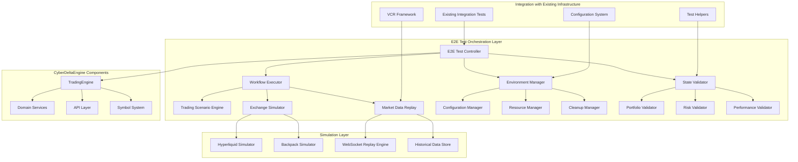

# CyberDeltaEngine E2E Testing Implementation Roadmap and Technical Specifications

## Executive Summary

This document provides detailed technical specifications and implementation roadmap for the CyberDeltaEngine End-to-End testing framework. Building on the existing robust integration test infrastructure, this roadmap outlines a phased approach to implement comprehensive E2E testing capabilities while maintaining the highest standards of financial safety and test reliability.

## Technical Architecture Specifications

### E2E Test Framework Architecture



### Core E2E Framework Components

#### 1. E2E Test Controller
```python
from dataclasses import dataclass
from datetime import timedelta
from decimal import Decimal
from typing import Any, Dict, List, Optional
from cyberdelta.config.models.app_config import AppSettings
from cyberdelta.application.trading_engine import TradingEngine

@dataclass
class E2ETestConfig:
    """Configuration for E2E test execution."""
    test_name: str
    environment: str  # "simulation", "testnet", "mainnet_safe"
    duration: timedelta
    market_conditions: str  # "normal", "volatile", "low_liquidity"
    initial_portfolio: Dict[str, Decimal]
    expected_outcomes: Dict[str, Any]
    risk_limits: Dict[str, Decimal]
    performance_thresholds: Dict[str, Decimal]
    cleanup_required: bool = True

@dataclass
class E2ETestResult:
    """Comprehensive E2E test execution results."""
    test_config: E2ETestConfig
    execution_success: bool
    duration_actual: timedelta
    workflow_steps_completed: List[str]
    performance_metrics: Dict[str, Decimal]
    financial_validation: 'FinancialValidationResult'
    state_validation: 'StateValidationResult'
    errors_encountered: List[str]
    warnings_generated: List[str]

class E2ETestController:
    """Main controller for E2E test orchestration."""

    def __init__(
        self,
        app_config: AppSettings,
        simulation_config: 'SimulationConfig'
    ):
        self.app_config = app_config
        self.simulation_config = simulation_config
        self.workflow_executor = WorkflowExecutor(simulation_config)
        self.environment_manager = EnvironmentManager(app_config)
        self.state_validator = StateValidator(app_config)
        self.active_tests: Dict[str, 'RunningE2ETest'] = {}

    async def execute_e2e_test(
        self,
        test_config: E2ETestConfig
    ) -> E2ETestResult:
        """Execute complete E2E test with full lifecycle management."""

        # Step 1: Environment setup
        test_environment = await self.environment_manager.setup_test_environment(
            test_config
        )

        try:
            # Step 2: Initialize trading engine with test configuration
            trading_engine = await self._initialize_trading_engine(
                test_config, test_environment
            )

            # Step 3: Execute workflow
            workflow_result = await self.workflow_executor.execute_workflow(
                test_config, trading_engine
            )

            # Step 4: Validate results
            validation_result = await self.state_validator.validate_complete_state(
                trading_engine, workflow_result, test_config
            )

            # Step 5: Calculate performance metrics
            performance_metrics = self._calculate_performance_metrics(
                workflow_result, test_config
            )

            return E2ETestResult(
                test_config=test_config,
                execution_success=validation_result.overall_success,
                duration_actual=workflow_result.execution_duration,
                workflow_steps_completed=workflow_result.completed_steps,
                performance_metrics=performance_metrics,
                financial_validation=validation_result.financial_validation,
                state_validation=validation_result.state_validation,
                errors_encountered=workflow_result.errors,
                warnings_generated=workflow_result.warnings
            )

        finally:
            # Step 6: Environment cleanup
            if test_config.cleanup_required:
                await self.environment_manager.cleanup_test_environment(
                    test_environment
                )
```

#### 2. Exchange Simulation Framework
```python
from abc import ABC, abstractmethod
from typing import Dict, List, Optional
from cyberdelta.apis.common.types import PlaceOrderArgs, CancelOrderArgs
from cyberdelta.models.market.order import Order, OrderStatus
from cyberdelta.enums.exchange_names import ExchangeName

class ExchangeSimulator(ABC):
    """Abstract base for exchange simulators."""

    @abstractmethod
    async def place_order(self, args: PlaceOrderArgs) -> 'SimulatedOrderResult':
        """Simulate order placement with realistic behavior."""
        pass

    @abstractmethod
    async def cancel_order(self, args: CancelOrderArgs) -> 'SimulatedCancelResult':
        """Simulate order cancellation."""
        pass

    @abstractmethod
    async def get_account_summary(self) -> 'SimulatedAccountSummary':
        """Simulate account data retrieval."""
        pass

@dataclass
class SimulatedOrderResult:
    """Result of simulated order execution."""
    order_id: str
    status: OrderStatus
    fill_price: Optional[Decimal]
    fill_quantity: Optional[Decimal]
    remaining_quantity: Decimal
    fees: Decimal
    execution_latency: timedelta
    simulation_metadata: Dict[str, Any]

class HyperliquidSimulator(ExchangeSimulator):
    """Hyperliquid exchange simulation with realistic behavior."""

    def __init__(self, config: 'HyperliquidSimulatorConfig'):
        self.config = config
        self.order_book_sim = OrderBookSimulator(config.order_book_config)
        self.latency_sim = LatencySimulator(config.latency_config)
        self.error_injector = ErrorInjector(config.error_config)
        self.account_simulator = AccountSimulator(config.account_config)

    async def place_order(self, args: PlaceOrderArgs) -> SimulatedOrderResult:
        """Simulate Hyperliquid order placement."""

        # Apply network latency
        await self.latency_sim.apply_request_latency()

        # Check for error injection
        if self.error_injector.should_inject_error("place_order"):
            raise self.error_injector.generate_api_error("place_order")

        # Simulate order execution against order book
        execution_result = await self.order_book_sim.execute_order(args)

        # Update simulated account state
        await self.account_simulator.process_execution(execution_result)

        return SimulatedOrderResult(
            order_id=execution_result.order_id,
            status=execution_result.status,
            fill_price=execution_result.fill_price,
            fill_quantity=execution_result.fill_quantity,
            remaining_quantity=execution_result.remaining_quantity,
            fees=execution_result.fees,
            execution_latency=self.latency_sim.get_last_latency(),
            simulation_metadata={
                "simulator": "hyperliquid",
                "order_book_state": execution_result.order_book_snapshot,
                "account_state": await self.account_simulator.get_state()
            }
        )

class OrderBookSimulator:
    """Realistic order book simulation with market impact."""

    def __init__(self, config: 'OrderBookSimulatorConfig'):
        self.config = config
        self.current_order_book = self._initialize_order_book()
        self.price_impact_model = PriceImpactModel(config)

    async def execute_order(self, args: PlaceOrderArgs) -> 'OrderExecutionResult':
        """Execute order against simulated order book."""

        if args.order_type == OrderType.MARKET:
            return await self._execute_market_order(args)
        elif args.order_type == OrderType.LIMIT:
            return await self._execute_limit_order(args)
        else:
            raise ValueError(f"Unsupported order type: {args.order_type}")

    async def _execute_market_order(self, args: PlaceOrderArgs) -> 'OrderExecutionResult':
        """Execute market order with realistic slippage."""

        # Calculate price impact based on order size
        price_impact = self.price_impact_model.calculate_impact(
            side=args.side,
            quantity=args.quantity,
            current_spread=self.current_order_book.spread
        )

        # Determine execution price with slippage
        if args.side == OrderSide.BUY:
            execution_price = self.current_order_book.best_ask * (1 + price_impact)
        else:
            execution_price = self.current_order_book.best_bid * (1 - price_impact)

        # Calculate fees
        fees = args.quantity * execution_price * self.config.fee_rate

        return OrderExecutionResult(
            order_id=generate_order_id(),
            status=OrderStatus.FILLED,
            fill_price=execution_price,
            fill_quantity=args.quantity,
            remaining_quantity=Decimal("0"),
            fees=fees,
            order_book_snapshot=self.current_order_book.snapshot()
        )
```

#### 3. Market Data Replay System
```python
from datetime import datetime, timedelta
from typing import AsyncIterator, List, Optional
import asyncio

class MarketDataReplayEngine:
    """Market data replay system for deterministic E2E testing."""

    def __init__(self, config: 'ReplayConfig'):
        self.config = config
        self.data_store = HistoricalDataStore(config.data_store_config)
        self.websocket_simulator = WebSocketSimulator(config.ws_config)
        self.replay_state = ReplayState()

    async def setup_replay_scenario(
        self,
        scenario_name: str,
        symbol: str,
        start_time: datetime,
        duration: timedelta,
        data_types: List[str]  # ["ticker", "orderbook", "trades"]
    ) -> 'ReplayScenario':
        """Setup market data replay scenario."""

        # Load historical data for scenario
        historical_data = await self.data_store.load_data(
            symbol=symbol,
            start_time=start_time,
            duration=duration,
            data_types=data_types
        )

        return ReplayScenario(
            name=scenario_name,
            symbol=symbol,
            start_time=start_time,
            duration=duration,
            historical_data=historical_data,
            replay_speed=self.config.replay_speed
        )

    async def start_replay(self, scenario: 'ReplayScenario') -> None:
        """Start market data replay for scenario."""

        self.replay_state.start_time = datetime.utcnow()
        self.replay_state.scenario = scenario

        # Start WebSocket simulation
        await self.websocket_simulator.start_simulation(scenario)

        # Begin data replay
        asyncio.create_task(self._replay_data_stream(scenario))

    async def _replay_data_stream(self, scenario: 'ReplayScenario') -> None:
        """Replay historical data stream."""

        for data_point in scenario.historical_data:
            # Calculate timing for replay
            replay_delay = self._calculate_replay_delay(
                data_point.timestamp,
                scenario.start_time,
                scenario.replay_speed
            )

            await asyncio.sleep(replay_delay.total_seconds())

            # Send data to WebSocket simulator
            await self.websocket_simulator.send_data(data_point)

            # Update replay state
            self.replay_state.current_time = data_point.timestamp
            self.replay_state.data_points_replayed += 1

class WebSocketSimulator:
    """WebSocket connection simulator for E2E testing."""

    def __init__(self, config: 'WebSocketSimulatorConfig'):
        self.config = config
        self.active_connections: Dict[str, 'SimulatedWebSocket'] = {}
        self.message_handlers: Dict[str, List[callable]] = {}

    async def create_simulated_connection(
        self,
        exchange: str,
        subscriptions: List[str]
    ) -> 'SimulatedWebSocket':
        """Create simulated WebSocket connection."""

        connection = SimulatedWebSocket(
            exchange=exchange,
            subscriptions=subscriptions,
            config=self.config
        )

        self.active_connections[connection.id] = connection
        return connection

    async def send_data(self, data_point: 'MarketDataPoint') -> None:
        """Send market data to active connections."""

        # Format data for each exchange's WebSocket format
        for connection_id, connection in self.active_connections.items():
            if connection.should_receive_data(data_point):
                formatted_data = connection.format_data(data_point)
                await connection.send_message(formatted_data)

@dataclass
class SimulatedWebSocket:
    """Simulated WebSocket connection."""
    id: str
    exchange: str
    subscriptions: List[str]
    config: 'WebSocketSimulatorConfig'
    message_queue: asyncio.Queue = field(default_factory=asyncio.Queue)

    async def send_message(self, message: Dict[str, Any]) -> None:
        """Send message to handlers."""
        await self.message_queue.put(message)

        # Notify registered handlers
        for handler in self._get_message_handlers():
            asyncio.create_task(handler(message))
```

#### 4. State Validation Framework
```python
from typing import Dict, List, Optional, Any
from decimal import Decimal

@dataclass
class ValidationRule:
    """Single validation rule specification."""
    name: str
    validator_func: callable
    error_message: str
    severity: str  # "error", "warning", "info"
    tolerance: Optional[Decimal] = None

@dataclass
class ValidationResult:
    """Result of validation rule execution."""
    rule_name: str
    passed: bool
    actual_value: Any
    expected_value: Any
    error_message: Optional[str]
    severity: str

class StateValidator:
    """Comprehensive state validation for E2E tests."""

    def __init__(self, config: 'ValidationConfig'):
        self.config = config
        self.portfolio_validator = PortfolioStateValidator(config)
        self.risk_validator = RiskStateValidator(config)
        self.performance_validator = PerformanceStateValidator(config)
        self.financial_validator = FinancialStateValidator(config)

    async def validate_complete_state(
        self,
        trading_engine: TradingEngine,
        workflow_result: 'WorkflowExecutionResult',
        test_config: E2ETestConfig
    ) -> 'CompleteValidationResult':
        """Perform comprehensive state validation."""

        validation_tasks = [
            self.portfolio_validator.validate_portfolio_state(
                trading_engine.portfolio_service, test_config
            ),
            self.risk_validator.validate_risk_state(
                trading_engine.risk_service, test_config
            ),
            self.performance_validator.validate_performance_metrics(
                workflow_result.performance_metrics, test_config
            ),
            self.financial_validator.validate_financial_integrity(
                workflow_result, test_config
            )
        ]

        # Execute all validations concurrently
        validation_results = await asyncio.gather(
            *validation_tasks, return_exceptions=True
        )

        return CompleteValidationResult(
            portfolio_validation=validation_results[0],
            risk_validation=validation_results[1],
            performance_validation=validation_results[2],
            financial_validation=validation_results[3],
            overall_success=all(
                result.passed for result in validation_results
                if isinstance(result, ValidationResult)
            )
        )

class FinancialStateValidator:
    """Validator for financial calculations and consistency."""

    def __init__(self, config: 'FinancialValidationConfig'):
        self.config = config

    async def validate_financial_integrity(
        self,
        workflow_result: 'WorkflowExecutionResult',
        test_config: E2ETestConfig
    ) -> 'FinancialValidationResult':
        """Validate financial calculation integrity."""

        validation_rules = [
            ValidationRule(
                name="decimal_precision_maintained",
                validator_func=self._validate_decimal_precision,
                error_message="Financial calculations must maintain Decimal precision",
                severity="error"
            ),
            ValidationRule(
                name="balance_consistency",
                validator_func=self._validate_balance_consistency,
                error_message="Portfolio balances must be consistent across exchanges",
                severity="error",
                tolerance=Decimal("0.001")  # 0.001 tolerance for rounding
            ),
            ValidationRule(
                name="pnl_calculation_accuracy",
                validator_func=self._validate_pnl_calculations,
                error_message="PnL calculations must be mathematically accurate",
                severity="error",
                tolerance=Decimal("0.01")  # $0.01 tolerance
            ),
            ValidationRule(
                name="fee_calculation_accuracy",
                validator_func=self._validate_fee_calculations,
                error_message="Fee calculations must match exchange specifications",
                severity="error"
            ),
            ValidationRule(
                name="currency_consistency",
                validator_func=self._validate_currency_consistency,
                error_message="Currency handling must be consistent throughout",
                severity="error"
            )
        ]

        # Execute all financial validation rules
        rule_results = []
        for rule in validation_rules:
            try:
                result = await rule.validator_func(workflow_result, rule.tolerance)
                rule_results.append(ValidationResult(
                    rule_name=rule.name,
                    passed=result.passed,
                    actual_value=result.actual_value,
                    expected_value=result.expected_value,
                    error_message=result.error_message if not result.passed else None,
                    severity=rule.severity
                ))
            except Exception as e:
                rule_results.append(ValidationResult(
                    rule_name=rule.name,
                    passed=False,
                    actual_value=None,
                    expected_value=None,
                    error_message=f"Validation rule execution failed: {e}",
                    severity="error"
                ))

        return FinancialValidationResult(
            rule_results=rule_results,
            overall_passed=all(r.passed for r in rule_results),
            critical_errors=[r for r in rule_results if r.severity == "error" and not r.passed],
            warnings=[r for r in rule_results if r.severity == "warning" and not r.passed]
        )

    async def _validate_decimal_precision(
        self,
        workflow_result: 'WorkflowExecutionResult',
        tolerance: Optional[Decimal]
    ) -> 'SingleValidationResult':
        """Validate that all financial calculations use Decimal precision."""

        # Check all monetary values in workflow result
        monetary_fields = self._extract_monetary_fields(workflow_result)

        for field_name, value in monetary_fields:
            if not isinstance(value, Decimal):
                return SingleValidationResult(
                    passed=False,
                    actual_value=type(value).__name__,
                    expected_value="Decimal",
                    error_message=f"Field {field_name} uses {type(value).__name__} instead of Decimal"
                )

        return SingleValidationResult(
            passed=True,
            actual_value="All Decimal",
            expected_value="All Decimal",
            error_message=None
        )
```

## Implementation Roadmap

### Phase 1: Foundation Infrastructure (Weeks 1-4)

#### Week 1: Core Framework Setup
**Deliverables:**
- [ ] E2ETestController implementation
- [ ] Basic EnvironmentManager for test isolation
- [ ] Integration with existing conftest.py patterns
- [ ] Initial test categorization (@pytest.mark.e2e)

**Technical Tasks:**
```python
# Create base E2E test structure
tests/e2e/
├── conftest.py                    # E2E fixtures and configuration
├── framework/                     # Core framework components
│   ├── __init__.py
│   ├── controller.py             # E2ETestController
│   ├── environment.py            # EnvironmentManager
│   └── validators.py             # Core validation framework
```

**Success Criteria:**
- [ ] Basic E2E test can be executed
- [ ] Test isolation working correctly
- [ ] Integration with existing pytest infrastructure complete
- [ ] Core logging and error handling implemented

#### Week 2: Exchange Simulation Framework
**Deliverables:**
- [ ] ExchangeSimulator base class and interfaces
- [ ] HyperliquidSimulator implementation
- [ ] BackpackSimulator implementation
- [ ] OrderBookSimulator with realistic market impact

**Technical Implementation:**
```python
# Exchange simulator integration
class E2ETestController:
    def _initialize_trading_engine(
        self,
        test_config: E2ETestConfig,
        test_environment: 'TestEnvironment'
    ) -> TradingEngine:
        """Initialize trading engine with simulated exchanges."""

        # Replace real exchange APIs with simulators
        exchange_factory = SimulatedExchangeFactory(
            hyperliquid_sim=test_environment.hyperliquid_simulator,
            backpack_sim=test_environment.backpack_simulator
        )

        # Use existing TradingEngine with simulated exchanges
        return TradingEngine(
            config=test_environment.engine_config,
            exchange_factory=exchange_factory
        )
```

**Success Criteria:**
- [ ] Simulated orders execute with realistic latency
- [ ] Market impact modeling produces reasonable slippage
- [ ] Account state simulation maintains consistency
- [ ] Error injection works for failure scenario testing

#### Week 3: Market Data Replay System
**Deliverables:**
- [ ] MarketDataReplayEngine implementation
- [ ] WebSocketSimulator for real-time data
- [ ] Historical data loading and management
- [ ] Replay scenario configuration system

**Integration Points:**
```python
# Integration with existing VCR system
@pytest.mark.e2e
@pytest.mark.vcr(cassette_library_dir="e2e_market_data")
async def test_momentum_strategy_with_replayed_data():
    """E2E test using replayed market data."""

    # Setup market data replay scenario
    replay_engine = MarketDataReplayEngine(config)
    scenario = await replay_engine.setup_replay_scenario(
        scenario_name="btc_momentum_20240101",
        symbol="BTC_USD",
        start_time=datetime(2024, 1, 1, 9, 0),
        duration=timedelta(hours=2),
        data_types=["ticker", "orderbook", "trades"]
    )

    # Execute E2E test with replayed data
    await replay_engine.start_replay(scenario)
    # ... test execution ...
```

**Success Criteria:**
- [ ] Market data replay produces deterministic results
- [ ] WebSocket simulation matches real exchange formats
- [ ] Timing synchronization works correctly
- [ ] Multiple data types (ticker, orderbook, trades) supported

#### Week 4: State Validation Framework
**Deliverables:**
- [ ] StateValidator comprehensive implementation
- [ ] FinancialStateValidator with TESTING_SECURITY_RULES compliance
- [ ] PortfolioStateValidator for cross-exchange consistency
- [ ] Performance validation with baseline comparisons

**Compliance Implementation:**
```python
class FinancialStateValidator:
    """TESTING_SECURITY_RULES compliant financial validation."""

    async def validate_no_hardcoded_values(
        self,
        workflow_result: 'WorkflowExecutionResult'
    ) -> ValidationResult:
        """Ensure no hardcoded financial values in test results."""

        # Scan for suspicious hardcoded values
        suspicious_values = [
            Decimal("150.00"),    # Example from TESTING_SECURITY_RULES
            Decimal("0.01"),      # Common hardcoded quantity
            Decimal("100.0")      # Round number prices
        ]

        for trade in workflow_result.executed_trades:
            if trade.price in suspicious_values:
                return ValidationResult(
                    passed=False,
                    error_message=f"Trade price {trade.price} appears to be hardcoded"
                )

        return ValidationResult(passed=True)

    async def validate_decimal_precision(
        self,
        workflow_result: 'WorkflowExecutionResult'
    ) -> ValidationResult:
        """Validate all financial calculations use Decimal precision."""

        # Check all monetary fields are Decimal type
        for field_path, value in self._iterate_monetary_fields(workflow_result):
            if isinstance(value, float):
                return ValidationResult(
                    passed=False,
                    error_message=f"Float detected in financial calculation at {field_path}"
                )

        return ValidationResult(passed=True)
```

**Success Criteria:**
- [ ] All TESTING_SECURITY_RULES violations detected
- [ ] Financial calculation accuracy validated
- [ ] Cross-exchange state consistency verified
- [ ] Performance regression detection working

### Phase 2: Core Workflow Implementation (Weeks 5-8)

#### Week 5-6: Momentum Strategy E2E Tests
**Deliverables:**
- [ ] Complete momentum trading workflow test
- [ ] Market data scenario generation for momentum conditions
- [ ] Strategy parameter validation
- [ ] Performance attribution verification

**Implementation Focus:**
```python
@pytest.mark.e2e
@pytest.mark.momentum_strategy
async def test_momentum_strategy_complete_workflow():
    """Complete momentum strategy E2E test."""

    # Test covers entire workflow:
    # 1. Market data ingestion and processing
    # 2. Momentum signal generation and validation
    # 3. Risk assessment and position sizing
    # 4. Order execution and fill processing
    # 5. Portfolio updates and reconciliation
    # 6. Performance calculation and attribution

    test_config = E2ETestConfig(
        test_name="momentum_strategy_complete",
        environment="simulation",
        duration=timedelta(minutes=30),
        market_conditions="trending",
        initial_portfolio={"USD": Decimal("10000")},
        expected_outcomes={
            "trades_executed": 3,
            "total_pnl_range": (Decimal("-500"), Decimal("1000")),
            "sharpe_ratio_min": Decimal("0.5")
        }
    )

    result = await e2e_controller.execute_e2e_test(test_config)

    # Comprehensive validation
    assert result.execution_success
    assert len(result.workflow_steps_completed) >= 6
    assert result.financial_validation.overall_passed
```

#### Week 7: Cross-Exchange Arbitrage Tests
**Deliverables:**
- [ ] Funding rate arbitrage E2E test
- [ ] Cross-exchange position coordination
- [ ] Simultaneous execution validation
- [ ] Delta-neutral position maintenance

#### Week 8: Real-Time Data Integration Tests
**Deliverables:**
- [ ] WebSocket data flow E2E test
- [ ] Market making strategy with live data
- [ ] Latency measurement and validation
- [ ] High-frequency execution testing

### Phase 3: Advanced Scenarios (Weeks 9-12)

#### Week 9-10: Risk Management Integration
**Deliverables:**
- [ ] Risk limit enforcement E2E tests
- [ ] Circuit breaker integration testing
- [ ] Emergency stop procedures validation
- [ ] Risk metric calculation accuracy testing

#### Week 11: Performance and Scale Testing
**Deliverables:**
- [ ] High-frequency execution stress tests
- [ ] Multi-symbol scalability testing
- [ ] Memory usage and performance monitoring
- [ ] Extended operation endurance tests

#### Week 12: Error Scenario and Recovery Testing
**Deliverables:**
- [ ] Exchange connectivity failure recovery
- [ ] Market data interruption handling
- [ ] Partial order execution scenarios
- [ ] System recovery validation

### Phase 4: Production Integration (Weeks 13-14)

#### Week 13: CI/CD Integration
**Deliverables:**
- [ ] GitHub Actions E2E test workflows
- [ ] Automated test environment provisioning
- [ ] Test result reporting and analysis
- [ ] Performance regression detection

**CI/CD Configuration:**
```yaml
# .github/workflows/e2e-tests.yml
name: E2E Tests

on:
  schedule:
    - cron: '0 6 * * *'  # Daily at 6 AM UTC
  workflow_dispatch:     # Manual trigger
  pull_request:
    paths:
      - 'cyberdelta/**'
      - 'tests/e2e/**'

jobs:
  e2e-critical-path:
    runs-on: ubuntu-latest
    timeout-minutes: 30

    steps:
      - uses: actions/checkout@v4

      - name: Setup Python
        uses: actions/setup-python@v4
        with:
          python-version: '3.11'

      - name: Install dependencies
        run: |
          pip install -r requirements-test.txt

      - name: Run critical E2E tests
        run: |
          pytest tests/e2e/ -m "critical_path" --tb=short

      - name: Generate test report
        if: always()
        run: |
          python scripts/generate_e2e_report.py

  e2e-full-suite:
    runs-on: ubuntu-latest
    timeout-minutes: 120
    if: github.event_name == 'schedule'

    steps:
      - uses: actions/checkout@v4

      - name: Setup test environment
        run: |
          docker-compose -f tests/e2e/docker-compose.yml up -d

      - name: Run full E2E test suite
        run: |
          pytest tests/e2e/ --tb=short --maxfail=5

      - name: Performance regression analysis
        run: |
          python scripts/analyze_performance_regression.py
```

#### Week 14: Documentation and Training
**Deliverables:**
- [ ] Comprehensive E2E testing documentation
- [ ] Developer guides for writing E2E tests
- [ ] Troubleshooting and debugging guides
- [ ] Team training materials and sessions

## Technical Specifications

### Performance Requirements

| Metric | Target | Critical Threshold |
|--------|--------|-------------------|
| E2E Test Execution Time | < 10 minutes | < 15 minutes |
| Memory Usage | < 2GB peak | < 4GB peak |
| Test Success Rate | > 95% | > 90% |
| False Positive Rate | < 5% | < 10% |
| Exchange Simulation Latency | 50-200ms | < 500ms |
| Market Data Replay Accuracy | 99.9% | 99% |

### Scalability Specifications

| Component | Initial Capacity | Target Capacity |
|-----------|------------------|-----------------|
| Concurrent E2E Tests | 5 | 20 |
| Simulated Exchanges | 2 | 5 |
| Market Data Symbols | 10 | 50 |
| Historical Data Storage | 1TB | 10TB |
| Test Execution Parallelism | 3x | 10x |

### Integration Specifications

#### Existing Infrastructure Reuse
1. **VCR Integration**: Extend existing VCR usage for E2E test reproducibility
2. **Test Helpers**: Build upon existing validation helpers and fixtures
3. **Configuration System**: Reuse AppSettings and configuration patterns
4. **Logging Infrastructure**: Leverage existing structlog configuration
5. **Error Handling**: Build on existing APIError and exception patterns

#### New Infrastructure Requirements
1. **Exchange Simulators**: New simulation layer for realistic exchange behavior
2. **Market Data Replay**: Historical data replay for deterministic testing
3. **State Validation**: Comprehensive validation framework
4. **Test Orchestration**: E2E test lifecycle management
5. **Performance Monitoring**: Test execution performance tracking

### Security and Safety Specifications

#### Financial Safety Compliance
- [ ] **No hardcoded financial values** in any test code or assertions
- [ ] **Fail-fast error handling** with no graceful degradation masking
- [ ] **Decimal precision enforcement** for all monetary calculations
- [ ] **Real market data usage** or high-fidelity simulation
- [ ] **Comprehensive validation** of all financial calculations

#### Test Environment Security
- [ ] **Complete isolation** from production systems
- [ ] **Simulated exchanges only** for all E2E testing
- [ ] **Zero financial risk** with no real money exposure
- [ ] **Secure configuration management** for test credentials
- [ ] **Audit logging** for all test execution activities

### Monitoring and Observability

#### Test Execution Monitoring
```python
class E2ETestMonitor:
    """Comprehensive monitoring for E2E test execution."""

    def __init__(self, config: 'MonitoringConfig'):
        self.metrics_collector = MetricsCollector(config)
        self.performance_tracker = PerformanceTracker(config)
        self.error_analyzer = ErrorAnalyzer(config)

    async def monitor_test_execution(
        self,
        test_config: E2ETestConfig,
        execution_future: asyncio.Future[E2ETestResult]
    ) -> 'TestExecutionMetrics':
        """Monitor E2E test execution in real-time."""

        # Start performance monitoring
        performance_monitor = await self.performance_tracker.start_monitoring()

        # Monitor memory usage, CPU, network I/O
        resource_monitor = await self._start_resource_monitoring()

        try:
            # Wait for test completion
            result = await execution_future

            # Collect final metrics
            execution_metrics = await self.metrics_collector.collect_metrics(
                test_config, result, performance_monitor, resource_monitor
            )

            return execution_metrics

        finally:
            # Stop all monitoring
            await performance_monitor.stop()
            await resource_monitor.stop()
```

#### Performance Regression Detection
```python
class PerformanceRegressionDetector:
    """Detect performance regressions in E2E tests."""

    def __init__(self, baseline_store: 'PerformanceBaselineStore'):
        self.baseline_store = baseline_store

    async def detect_regressions(
        self,
        current_metrics: 'TestExecutionMetrics',
        test_name: str
    ) -> 'RegressionAnalysis':
        """Detect performance regressions compared to baseline."""

        # Get historical baseline
        baseline = await self.baseline_store.get_baseline(test_name)

        regressions = []

        # Check execution time regression
        if current_metrics.execution_time > baseline.execution_time * 1.2:
            regressions.append(RegressionItem(
                metric="execution_time",
                current_value=current_metrics.execution_time,
                baseline_value=baseline.execution_time,
                regression_pct=self._calculate_regression_pct(
                    current_metrics.execution_time,
                    baseline.execution_time
                )
            ))

        # Check memory usage regression
        if current_metrics.peak_memory > baseline.peak_memory * 1.3:
            regressions.append(RegressionItem(
                metric="peak_memory",
                current_value=current_metrics.peak_memory,
                baseline_value=baseline.peak_memory,
                regression_pct=self._calculate_regression_pct(
                    current_metrics.peak_memory,
                    baseline.peak_memory
                )
            ))

        return RegressionAnalysis(
            test_name=test_name,
            regressions=regressions,
            baseline_date=baseline.created_date,
            analysis_date=datetime.utcnow()
        )
```

## Risk Mitigation Strategies

### Technical Risk Mitigation
1. **Gradual Rollout**: Phased implementation with early validation
2. **Fallback Mechanisms**: Ability to disable E2E tests if issues arise
3. **Resource Limits**: Strict resource usage limits to prevent system impact
4. **Isolation Guarantees**: Complete isolation from production systems
5. **Recovery Procedures**: Automated recovery from test failures

### Financial Risk Mitigation
1. **Simulation Only**: All E2E tests use simulated exchanges
2. **Zero Real Money**: No real financial exposure in any test scenario
3. **Validation Compliance**: Strict adherence to TESTING_SECURITY_RULES.md
4. **Audit Trails**: Complete audit logging of all test activities
5. **Review Processes**: Mandatory code review for all E2E test changes

### Operational Risk Mitigation
1. **Monitoring Integration**: Comprehensive monitoring and alerting
2. **Performance Limits**: Strict performance and resource usage limits
3. **Automated Cleanup**: Automatic cleanup of test resources and state
4. **Error Recovery**: Robust error handling and recovery procedures
5. **Documentation**: Comprehensive documentation and troubleshooting guides

## Success Metrics and KPIs

### Test Quality Metrics
- **Workflow Coverage**: 100% of critical trading workflows tested
- **Bug Detection Rate**: E2E tests catch 90%+ of workflow-level bugs
- **Test Reliability**: 99%+ consistent test results
- **Financial Validation**: 100% compliance with TESTING_SECURITY_RULES.md

### Performance Metrics
- **Test Execution Time**: Average < 10 minutes per workflow test
- **Resource Efficiency**: < 2GB memory, < 80% CPU utilization
- **Parallelization**: 5x improvement in test suite execution time
- **Regression Detection**: 95% accuracy in performance regression detection

### Business Impact Metrics
- **Deployment Confidence**: Measurable increase in production deployment confidence
- **Time to Market**: 30% reduction in feature validation time
- **Production Stability**: 50% reduction in production issues post-deployment
- **Development Velocity**: Maintained or improved development speed with higher quality

## Conclusion

This comprehensive implementation roadmap provides a structured approach to building world-class E2E testing capabilities for the CyberDeltaEngine. The phased approach ensures gradual capability building while maintaining the existing high standards for financial safety and test reliability.

Key success factors:
1. **Building on Strong Foundation**: Leverages existing excellent integration test infrastructure
2. **Financial Safety First**: Strict compliance with TESTING_SECURITY_RULES.md throughout
3. **Realistic Testing**: High-fidelity exchange simulation and market data replay
4. **Comprehensive Validation**: Multi-layered validation ensuring correctness
5. **Operational Excellence**: Full monitoring, alerting, and recovery capabilities

The implementation timeline of 14 weeks provides a realistic schedule for delivering production-ready E2E testing capabilities that will significantly enhance confidence in the CyberDeltaEngine's reliability and correctness.
