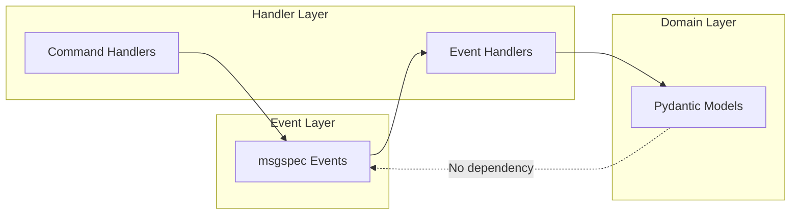

# CyberDeltaEngine Event Architecture - Overview

## Executive Summary

A **decoupled event architecture** using msgspec for performance and bubus for orchestration, enhanced with Nautilus Trader-inspired patterns for robustness and lifecycle management. This approach eliminates `dict[str, Any]` violations, achieves 25x performance gains, and maintains clean architectural boundaries while adding production-grade reliability.

## Core Architecture Principles

### 1. Technology Separation

| Layer | Technology | Purpose | Changes Required |
|-------|------------|---------|------------------|
| **Events** | msgspec ONLY | High-performance event structures (NO Pydantic) | New implementation |
| **Event Context** | msgspec ONLY | Workflow contexts, handler health (NO Pydantic) | New implementation |
| **Orchestration** | bubus + msgspec | Complex workflows with audit trails | New implementation |
| **Domain Models** | Pydantic | Business logic and validation | **NO CHANGES** |
| **Handler Layer** | Python + Nautilus patterns | Translation with lifecycle management | Enhanced implementation |
| **Message Bus** | msgspec + priorities | Event routing with priority queues | Enhanced implementation |

### CRITICAL: msgspec-Only Event System
**NO Pydantic allowed in the event system:**
- ✅ Events: msgspec.Struct
- ✅ Event metadata: msgspec.Struct
- ✅ Handler health: msgspec.Struct
- ✅ Workflow context: msgspec.Struct
- ✅ Audit entries: msgspec.Struct
- ❌ NO Pydantic BaseModel for any event-related structures

**Symbol and Enum Handling:**
- ✅ Symbols: Use `str` representation in events (zero overhead)
- ✅ Enums: Use directly (ExchangeName, OrderSide, etc. work perfectly in msgspec)
- ✅ ALL handlers create Symbol objects at boundaries (consistency)
- ❌ NO Symbol objects in events (they're Pydantic models)

### 2. Decoupled Design



## Key Benefits

### Performance
- **25x faster** event processing (140μs vs 3,470μs)
- **25x less memory** usage (0.64MB vs 16.26MB)
- Direct WebSocket to msgspec decoding

### Architecture
- **Zero domain model changes** - No tight coupling
- **Type safety** throughout - No `dict[str, Any]`
- **Clean boundaries** - Each layer has single responsibility

### Maintainability
- **Only 10-12 event structures** instead of 33
- **Progressive migration** - No big-bang rewrite
- **Testable** - Each layer tested independently

## Event Structure Design

### Minimal msgspec Structures (7 total)

```python
# Only 7 generic structures handle ALL events
MarketData    # tick, orderbook, trade, quote
OrderEvent    # placed, filled, cancelled, rejected, etc.
PositionEvent # opened, updated, closed, liquidated
SignalEvent   # buy, sell, hold signals
RiskEvent     # limits, drawdown, exposure, margin
BalanceEvent  # updated, locked, unlocked, settled
SystemEvent   # health, errors, warnings, status
```

### Bubus Workflows (3-5 total)

```python
# Only for multi-step orchestration
PlaceOrderWorkflow    # Risk checks, retries, audit
RebalanceWorkflow     # Portfolio rebalancing
EmergencyLiquidation  # Urgent position closing
GracefulShutdown      # System shutdown sequence
```

## Enhanced Handler Layer Pattern (Nautilus-Inspired)

The handler layer now includes lifecycle management, state tracking, and hierarchical routing:

```python
from enum import Enum

class ComponentState(Enum):
    PRE_INITIALIZED = "PRE_INITIALIZED"
    RUNNING = "RUNNING"
    DEGRADED = "DEGRADED"
    STOPPED = "STOPPED"

class OrderEventHandler(EventHandlerActor):
    """Enhanced handler with lifecycle and caching"""

    def __init__(self, order_repo, event_bus):
        super().__init__("order_handler", event_bus)
        self.order_repo = order_repo
        self._order_cache = {}  # Performance optimization
        self._state = ComponentState.PRE_INITIALIZED

    async def on_start(self):
        """Initialize handler resources"""
        # Warm cache with open orders
        open_orders = await self.order_repo.get_open_orders()
        for order in open_orders:
            self._order_cache[order.order_id] = order
        self._state = ComponentState.RUNNING

    async def on_stop(self):
        """Cleanup handler resources"""
        # Persist state before shutdown
        await self._persist_cache()
        self._state = ComponentState.STOPPED

    async def on_degrade(self):
        """Handle degraded mode"""
        self._state = ComponentState.DEGRADED
        # Only allow cancellations in degraded mode

    async def handle_order_event(self, event: OrderEvent):
        """Route through hierarchical handlers"""
        # Check cache first (performance)
        order = self._order_cache.get(event.order_id)
        if not order:
            order = await self.order_repo.get(event.order_id)
            self._order_cache[event.order_id] = order

        # Hierarchical routing
        handler_method = f"on_order_{event.event_type}"
        if hasattr(self, handler_method):
            await getattr(self, handler_method)(event, order)
        else:
            await self.on_order_default(event, order)

        # Save changes
        await self.order_repo.save(order)
```

## Migration Strategy

### Phase 1: Add New Infrastructure (Week 1)
- Create msgspec event structures
- Implement MsgspecEventBus
- Add handler layer

### Phase 2: Migrate Domain Service Publishers (Week 2)
- Update domain services to publish msgspec events
- Add dual publishing for compatibility
- APIs remain unchanged (they don't publish)
- Keep domain models unchanged

### Phase 3: Add Orchestration (Week 3)
- Add bubus for complex workflows
- Implement audit trails
- Enable retry/compensation logic

## Current Event Flow in CyberDeltaEngine

### Important: APIs Do Not Publish Events

**Critical Understanding:** The APIs (bp_api, hl_api) are pure data providers. They do NOT publish events.

```
Current Flow:
External Exchange → API (fetches data) → Domain Service → publishes DomainEvent → EventBus
                     ↑                    ↑              ↑
                     No events here       Business logic  Events published here
```

**What this means for migration:**
- **APIs remain completely unchanged** - they don't publish events
- **Domain services** (TradingService, etc.) currently publish DomainEvents
- **Migration only affects domain services** and their event publishing
- **No API modifications needed** at any phase

## Current State vs Target State

### Current Problems
```python
# ❌ Violations of CODING_STANDARDS.md
class DomainEvent(StandardModel):
    payload: dict[str, Any]  # FORBIDDEN!

# Magic strings everywhere
fill_price = event.get_decimal("fill_price")
```

### Target Solution
```python
# ✅ Type-safe msgspec events
class OrderEvent(msgspec.Struct):
    fill_price: Decimal  # Direct typed access

# Domain models unchanged
class Order(BaseModel):
    def fill(self, price: Decimal, quantity: Decimal):
        # Pure business logic
```

## Next Steps

1. Review implementation guide (02_implementation_guide.md)
2. Follow migration strategy (03_migration_strategy.md)
3. Start with handler layer implementation
4. Migrate events progressively

---

**Decision Date**: 2025-08-07
**Architecture**: Decoupled msgspec/bubus with handler layer
**Risk Level**: LOW - No domain model changes required
**Timeline**: 3 weeks for complete migration
