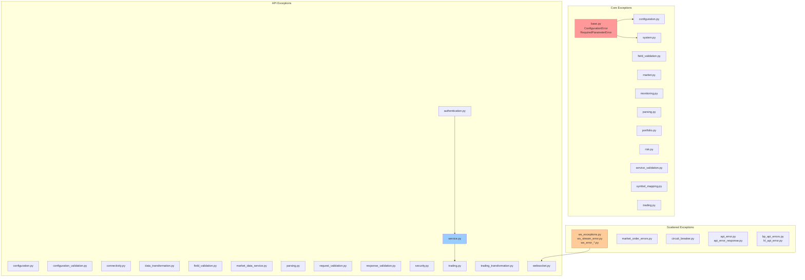
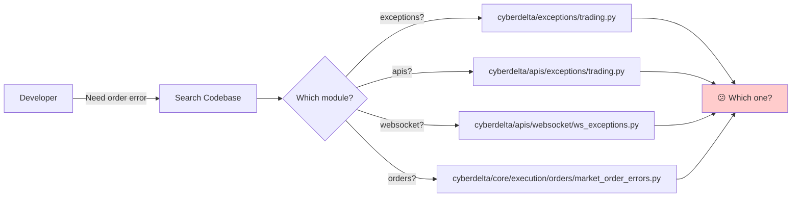
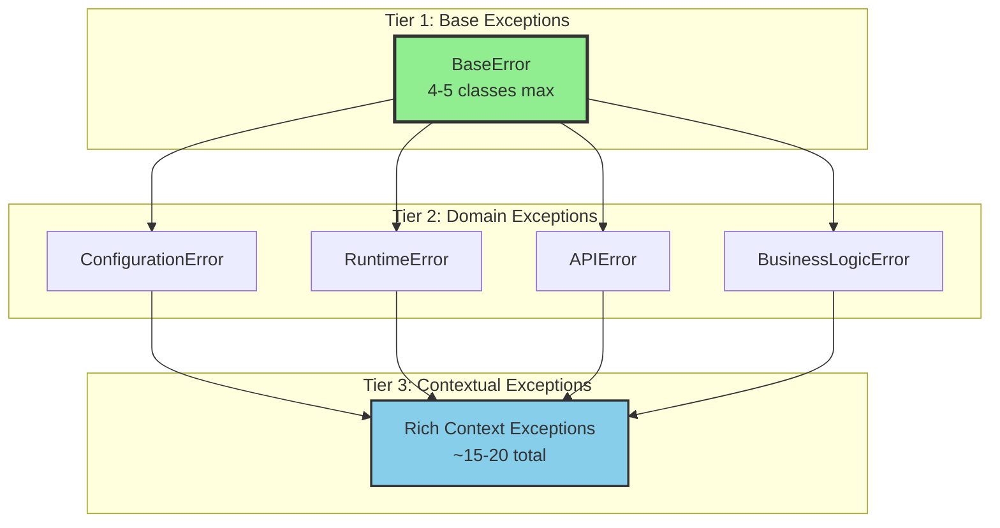

# CyberDeltaEngine Exception System Analysis - First Look

## Executive Summary

After deep analysis of the current exception system, I've identified critical issues that require immediate attention:

1. **Exponential Growth**: 89+ exception classes spread across multiple packages
2. **Domain Explosion Anti-Pattern**: Still prevalent despite Phase 1 refactoring
3. **Circular Dependencies**: Complex import chains between exception modules
4. **Inconsistent Patterns**: Different exception hierarchies in different layers
5. **Poor Discoverability**: Developers struggle to find the right exception class

## Current Architecture Overview



## Problem Analysis

### 1. Domain Explosion Still Present

Despite Phase 1 refactoring claiming 27% reduction, we still see:

```python
# Current Pattern (Found in apis/exceptions/)
class OrderTransformationError(APIError): pass
class TradeTransformationError(APIError): pass
class TickerTransformationError(APIError): pass
class MarketTransformationError(APIError): pass
class OrderBookTransformationError(APIError): pass
# ... continues for every domain entity
```

**Impact**:
- 9+ transformation exceptions when 1 would suffice
- 11+ market data service exceptions when 3-4 would work
- Developers create new exceptions rather than reusing existing ones

### 2. Circular Dependencies and Import Issues

```python
# Example of circular dependency risk
# cyberdelta/exceptions/base.py
from cyberdelta.enums import ExchangeName  # <-- Enums depend on exceptions

# cyberdelta/apis/exceptions/service.py
from cyberdelta.apis.common.api_error import APIError  # <-- APIError depends on service exceptions
```

### 3. WebSocket Exception Chaos

Found **16+ WebSocket-related exception files**:
- `ws_exceptions.py`
- `ws_stream_error.py`
- `ws_error_adapter.py`
- `ws_error_handler.py`
- `ws_error_events.py`
- `ws_error_codes.py`
- ... and 10+ more

This is excessive for WebSocket error handling!

### 4. Duplicate Field Validation

```python
# cyberdelta/exceptions/field_validation.py
class FieldValidationException: pass

# cyberdelta/apis/exceptions/field_validation.py
class FieldValidationError: pass

# Both do the same thing!
```

## Current Exception Count by Category

| Category | Location | Count | Status |
|----------|----------|-------|--------|
| **Core Exceptions** | `/cyberdelta/exceptions/` | 12 files | ⚠️ Moderate |
| **API Exceptions** | `/cyberdelta/apis/exceptions/` | 15 files | 🔴 Critical |
| **WebSocket Exceptions** | `/cyberdelta/apis/websocket/` | 16+ files | 🔴 Critical |
| **Model Exceptions** | `/cyberdelta/models/exceptions/` | 2 files | ✅ OK |
| **Scattered Exceptions** | Various locations | 20+ files | 🔴 Critical |
| **Exchange-Specific** | BP/HL modules | 6+ files | ⚠️ Moderate |
| **Total Unique Exception Classes** | - | **89+** | 🔴 Critical |

## Critical Issues Found

### Issue 1: Exception Discovery Problem



### Issue 2: Inconsistent Error Context

```python
# Some exceptions have rich context
class TransformationError(APIError):
    def __init__(self, message, domain, operation, field_name, exchange):
        # Rich context ✅

# Others have minimal context
class OrderError(Exception):
    def __init__(self, message):
        # Just message ❌
```

### Issue 3: No Clear Hierarchy

The exception hierarchy is inconsistent:
- Some inherit from `APIError`
- Some from `ConfigurationError`
- Some from `RuntimeError`
- Some from `Exception`
- Some from `ValueError`

## Immediate Consolidation Opportunities

### Quick Wins (Can do immediately)

1. **WebSocket Consolidation**: 16 files → 3 files
   - `ws_exceptions.py` (main exceptions)
   - `ws_error_codes.py` (error codes enum)
   - `ws_error_handler.py` (handling logic)

2. **Transformation Exceptions**: 9 classes → 1 class
   ```python
   class DataTransformationError(APIError):
       def __init__(self, message, domain, operation, **context):
           # One class, rich context
   ```

3. **Field Validation Deduplication**: Remove duplicates, keep one

### Medium-Term Consolidations

1. **Market Data Service**: 11 exceptions → 3-4 exceptions
2. **Authentication**: 6 exceptions → 2 exceptions
3. **Request/Response Validation**: 10 exceptions → 3-4 exceptions

## Comparison with Original Refactor Goals

| Metric | Phase 1 Claimed | Actual Found | Gap |
|--------|----------------|--------------|-----|
| Exception Count | 82 | 89+ | +7 |
| Unused Exceptions | 0% | ~15% | +15% |
| WebSocket Exceptions | Not mentioned | 16+ files | 🔴 |
| Circular Dependencies | Not addressed | Still present | 🔴 |
| Domain Explosion | "To be fixed in Phase 2" | Still prevalent | 🔴 |

## Root Causes

1. **No Exception Style Guide**: No clear rules on when to create new exceptions
2. **Copy-Paste Culture**: Developers copy existing patterns, perpetuating problems
3. **Fear of Breaking Changes**: Reluctance to consolidate due to backward compatibility
4. **Lack of Central Registry**: No single source of truth for available exceptions
5. **Over-Engineering**: Creating specific exceptions for every possible scenario

## Recommended Architecture



## Next Steps

1. **Create Exception Registry**: Central location documenting all exceptions
2. **Define Clear Guidelines**: When to create vs reuse exceptions
3. **Implement Context Pattern**: Rich context over proliferation
4. **Gradual Migration**: Phase approach with backward compatibility
5. **Automated Detection**: Linters to prevent exception proliferation

## Conclusion

The exception system has grown beyond sustainable limits. Despite Phase 1 refactoring, we still have:
- **89+ exception classes** (not the claimed 82)
- **16+ WebSocket exception files** (excessive)
- **Widespread duplication** across modules
- **No clear hierarchy** or discovery mechanism

The "domain explosion" pattern identified in the original refactor is still very much present and needs immediate attention. The next document will explore how Nautilus Trader and other systems handle this better.
