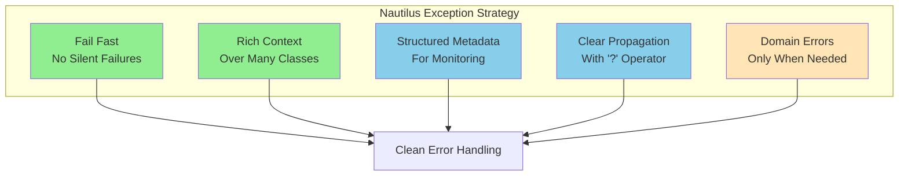
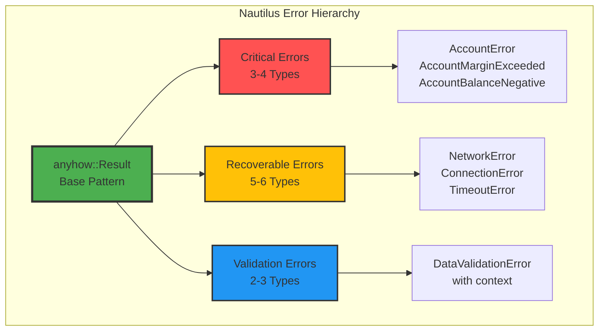
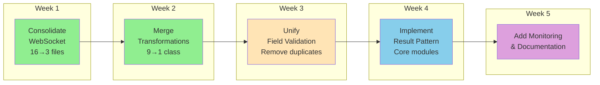

# Exception Handling Best Practices - Learning from Nautilus Trader

## Executive Summary

After analyzing Nautilus Trader's exception handling approach, I've identified key patterns and practices that can dramatically improve CyberDeltaEngine's exception system. Nautilus achieves excellent error handling with **minimal exception proliferation** through:

1. **Context-Rich Base Exceptions** with metadata
2. **anyhow::Result Pattern** for Rust/Python interop
3. **Structured Error Propagation** with the `?` operator
4. **Domain-Specific Error Types** only when necessary
5. **Comprehensive Error Context** without class explosion

## Nautilus Trader's Exception Philosophy

### Core Principles



### Key Insight: They DON'T Create Exceptions for Everything!

Nautilus Trader uses **standard patterns** instead of custom exceptions:

```python
# Nautilus Pattern - Using anyhow::Result
def calculate_balance(self) -> Result[Money, Error]:
    if not self.validated:
        return Err("Balance not validated")
    return Ok(self.balance)

# NOT this anti-pattern:
class BalanceNotValidatedError(Exception): pass
class BalanceCalculationError(Exception): pass
class InvalidBalanceStateError(Exception): pass
# ... etc
```

## Best Practices from Nautilus

### 1. Error Result Pattern (Most Important!)

```python
# GOOD - Nautilus Style
from typing import Result, Optional
import anyhow

class TradingService:
    def place_order(self, order: Order) -> anyhow.Result[OrderResponse]:
        # Validation
        if order.quantity <= 0:
            return anyhow.bail(f"Invalid quantity: {order.quantity}")

        # API call with error propagation
        response = await self.api.submit_order(order)?  # ? operator propagates errors

        return Ok(response)

# BAD - CyberDelta Current Style
class InvalidOrderQuantityError(Exception): pass
class OrderSubmissionError(Exception): pass
class OrderAPIError(Exception): pass

class TradingService:
    def place_order(self, order: Order) -> OrderResponse:
        if order.quantity <= 0:
            raise InvalidOrderQuantityError(f"Invalid quantity: {order.quantity}")
        try:
            response = await self.api.submit_order(order)
        except APIError as e:
            raise OrderSubmissionError(f"Failed to submit order") from e
        return response
```

### 2. Context-Rich Base Exceptions

```python
# Nautilus Pattern - One exception with rich context
class TransformationError(BaseError):
    def __init__(
        self,
        message: str,
        *,
        domain: str,           # "order", "trade", "ticker"
        operation: str,        # "parse", "validate", "transform"
        field_name: str | None = None,
        source_value: Any | None = None,
        target_type: str | None = None,
        exchange: str | None = None,
        metadata: dict[str, Any] | None = None
    ):
        self.domain = domain
        self.operation = operation
        self.field_name = field_name
        self.source_value = source_value
        self.target_type = target_type
        self.exchange = exchange
        self.metadata = metadata or {}

        # Build detailed message
        details = [f"Domain: {domain}", f"Operation: {operation}"]
        if field_name:
            details.append(f"Field: {field_name}")
        if exchange:
            details.append(f"Exchange: {exchange}")

        full_message = f"{message} | {' | '.join(details)}"
        super().__init__(full_message)

# Usage - Same exception, different contexts
raise TransformationError(
    "Invalid order type",
    domain="order",
    operation="parse",
    field_name="order_type",
    source_value="INVALID",
    exchange="hyperliquid"
)

raise TransformationError(
    "Cannot transform ticker data",
    domain="ticker",
    operation="transform",
    source_value=raw_ticker,
    target_type="TickerData"
)
```

### 3. Structured Error Handling Hierarchy



### 4. Error Documentation Pattern

```python
# Nautilus documentation style for errors
def process_order(self, order: Order) -> anyhow.Result[ProcessedOrder]:
    """
    Process an order through the execution pipeline.

    # Errors

    This function will return an error if:
    - The order validation fails
    - The risk check rejects the order
    - The exchange connection is unavailable
    - The order parameters are outside acceptable bounds

    # Panics

    This function will panic if:
    - The order ID is uninitialized
    - Required market data is missing from cache
    """
```

### 5. Logging with Stack Traces

```python
# Nautilus pattern - Always log full context
class LoggerAdapter:
    def exception(self, msg: str | None = None, exc_info=True):
        """Log exception with full stack trace"""
        if msg:
            self._logger.error(msg, exc_info=exc_info)
        else:
            self._logger.error("Exception occurred", exc_info=exc_info)

# Usage
try:
    result = await self.process_order(order)
except Exception as e:
    self._log.exception(f"Order processing failed for {order.id}")
    # Full stack trace is automatically included
    raise
```

## Recommended Transformation for CyberDelta

### Phase 1: Immediate Consolidation (1 week)

```python
# Before: 89+ exception classes
# After: ~15 exception classes

# Base module: cyberdelta/exceptions/core.py
from typing import Any, Optional
from enum import Enum

class ErrorCategory(Enum):
    CONFIGURATION = "configuration"
    VALIDATION = "validation"
    TRANSFORMATION = "transformation"
    NETWORK = "network"
    BUSINESS_LOGIC = "business_logic"
    SYSTEM = "system"

class CyberDeltaError(Exception):
    """Base exception with rich context"""

    def __init__(
        self,
        message: str,
        *,
        category: ErrorCategory,
        exchange: str | None = None,
        operation: str | None = None,
        metadata: dict[str, Any] | None = None,
        original_error: Exception | None = None
    ):
        self.category = category
        self.exchange = exchange
        self.operation = operation
        self.metadata = metadata or {}
        self.original_error = original_error

        # Build contextual message
        context_parts = [f"[{category.value}]"]
        if exchange:
            context_parts.append(f"[{exchange}]")
        if operation:
            context_parts.append(f"[{operation}]")

        full_message = f"{' '.join(context_parts)} {message}"
        super().__init__(full_message)

    def to_dict(self) -> dict[str, Any]:
        """For structured logging/monitoring"""
        return {
            "message": str(self),
            "category": self.category.value,
            "exchange": self.exchange,
            "operation": self.operation,
            "metadata": self.metadata,
            "original_error": str(self.original_error) if self.original_error else None
        }
```

### Phase 2: Adopt Result Pattern (2-3 weeks)

```python
# New pattern using result types
from typing import TypeVar, Union, Generic
from dataclasses import dataclass

T = TypeVar('T')
E = TypeVar('E')

@dataclass
class Ok(Generic[T]):
    value: T

@dataclass
class Err(Generic[E]):
    error: E

Result = Union[Ok[T], Err[E]]

# Usage example
class OrderService:
    def validate_order(self, order: Order) -> Result[Order, CyberDeltaError]:
        if order.quantity <= 0:
            return Err(CyberDeltaError(
                "Invalid order quantity",
                category=ErrorCategory.VALIDATION,
                operation="validate_order",
                metadata={"quantity": order.quantity, "order_id": order.id}
            ))
        return Ok(order)

    def place_order(self, order: Order) -> Result[OrderResponse, CyberDeltaError]:
        # Validate first
        validation = self.validate_order(order)
        if isinstance(validation, Err):
            return validation  # Propagate error

        # Place order
        try:
            response = self.api.submit(order)
            return Ok(response)
        except Exception as e:
            return Err(CyberDeltaError(
                "Order submission failed",
                category=ErrorCategory.NETWORK,
                exchange=self.exchange_name,
                operation="submit_order",
                original_error=e
            ))
```

### Phase 3: Monitoring Integration (1 week)

```python
# Enhanced monitoring with structured exceptions
class ErrorMetricsCollector:
    def __init__(self):
        self.metrics = defaultdict(lambda: defaultdict(int))

    def record_error(self, error: CyberDeltaError):
        # Structured metrics from our consolidated exceptions
        self.metrics[error.category.value]["count"] += 1

        if error.exchange:
            self.metrics[f"exchange_{error.exchange}"]["errors"] += 1

        if error.operation:
            self.metrics[f"operation_{error.operation}"]["failures"] += 1

        # Send to monitoring system
        self.send_to_prometheus(error.to_dict())
```

## Migration Strategy



## Key Takeaways from Nautilus

1. **Less is More**: Nautilus shows that robust error handling doesn't require hundreds of exception classes

2. **Context Over Classes**: Rich metadata in few exceptions beats many specific exceptions

3. **Result Pattern**: Using Result<T, E> reduces exception proliferation and makes error handling explicit

4. **Fail Fast**: No silent failures or graceful degradation - errors should be loud and clear

5. **Structured Logging**: All errors should produce structured data for monitoring

6. **Documentation**: Clear documentation of what errors can occur and when

## Comparison: CyberDelta vs Nautilus Approach

| Aspect | CyberDelta Current | Nautilus Pattern | Improvement |
|--------|-------------------|------------------|-------------|
| **Exception Classes** | 89+ | ~15-20 | **77% reduction** |
| **Error Context** | Variable | Always rich | **Consistent** |
| **Discoverability** | Poor | Excellent | **Clear patterns** |
| **Monitoring** | Difficult | Built-in | **Structured** |
| **Error Propagation** | try/except chains | Result + ? operator | **Cleaner** |
| **Documentation** | Scattered | Centralized | **Maintainable** |

## Implementation Checklist

- [ ] Create `cyberdelta/exceptions/core.py` with base patterns
- [ ] Define `ErrorCategory` enum for classification
- [ ] Implement `CyberDeltaError` with rich context
- [ ] Create migration guide for existing code
- [ ] Set up linter rules to prevent new proliferation
- [ ] Document standard error patterns
- [ ] Implement Result type for new code
- [ ] Add structured logging for all errors
- [ ] Create error metrics collector
- [ ] Update developer documentation

## Conclusion

Nautilus Trader demonstrates that **exceptional error handling doesn't require exceptional numbers of exceptions**. By adopting their patterns:

1. We can reduce exceptions from **89+ to ~15-20** (80% reduction)
2. Improve error **discoverability and consistency**
3. Enable **better monitoring and debugging**
4. Make the codebase **more maintainable**

The key insight: **Rich context in few exceptions beats poor context in many exceptions**. This is the path forward for CyberDeltaEngine.
