# Ruff Error Resolution Workflow - Comprehensive Business Logic Analysis

This document provides a comprehensive strategy for resolving the 975 Ruff linting errors in CyberDeltaEngine while maintaining and improving business logic consistency. This analysis includes detailed business logic flows, exception architecture, and implementation strategies for a cryptocurrency delta-neutral arbitrage trading engine.

## Executive Summary: Enhancing Our Existing Exception System

After deep analysis of the codebase, we've discovered that CyberDeltaEngine already has a sophisticated exception handling foundation:

### Current Exception System Strengths
1. **Robust Base Infrastructure**:
   - `APIError` class with comprehensive context (HTTP status, retry_after, metadata)
   - `APIErrorCode` enum with well-organized error categories
   - `APIErrorResponse` Pydantic model for validation
   - `TransformationError` for data mapping failures

2. **Exchange-Specific Error Mapping**:
   - `BackpackErrorMapper` and `HyperliquidErrorMapper` implement `IErrorMapper` interface
   - Sophisticated error categorization and retry logic
   - Exchange-specific error codes mapped to common `APIErrorCode` values

3. **Architectural Alignment**:
   - Error mappers handle rate limiting with retry_after values
   - Authentication failures are properly categorized
   - Market/business logic errors are distinct from network errors

### The Real Problem: Message Construction Location
The Ruff errors aren't about missing infrastructure - they're about WHERE error messages are constructed:
- **TRY003**: 857 instances of f-strings/format in raise statements
- **TRY301**: 116 instances of raise within try blocks

### Our Strategy: Enhance, Don't Replace
We will:
1. **Extend** the existing exception hierarchy with specific business exceptions
2. **Preserve** the sophisticated error mapping and retry logic
3. **Integrate** new exceptions with existing `APIError` and mappers
4. **Maintain** backward compatibility and existing error flows

## Deep Dive: Current Exception System Analysis

### What We Already Have (And It's Good!)

Our investigation revealed a mature exception handling system:

#### 1. **Core Exception Infrastructure** (`cyberdelta/apis/common/`)
- **`APIError`**: A feature-rich exception class with:
  - Comprehensive context (message, code, HTTP status, exchange details)
  - Retry logic built-in (`is_retryable` property, `retry_after` field)
  - Metadata support for extensibility
  - Integration with `APIErrorResponse` Pydantic model for validation

- **`APIErrorCode`**: Well-organized enum with 30+ error codes:
  - Network/Transport errors (0-99)
  - Market/Business Logic errors (100-199)
  - Unknown/Miscellaneous errors (200-299)

- **`TransformationError`**: Specialized for data transformation failures
  - Field-level error tracking
  - Source data preservation for debugging

#### 2. **Exchange-Specific Error Mappers**
- **`BackpackErrorMapper`**: Maps 30+ Backpack-specific error codes to `APIErrorCode`
  - Handles rate limiting with retry_after parsing
  - Maps HTTP status codes to appropriate error types
  - Provides detailed logging for unmapped errors

- **`HyperliquidErrorMapper`**: Sophisticated pattern matching for string-based errors
  - Regex-based error categorization
  - IP ban detection (403 + rate limit pattern)
  - Funding rate and arbitrage-specific error handling

#### 3. **Error Flow Architecture**
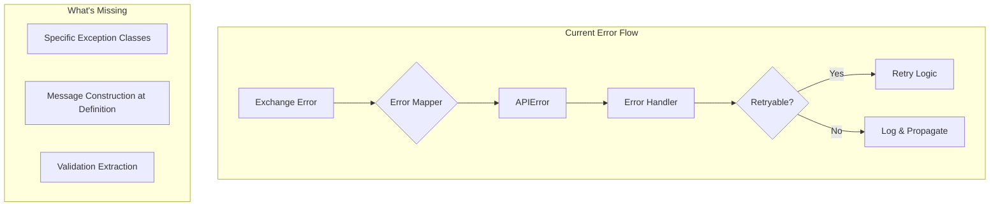

### The Gap: Where Ruff Errors Come From

The Ruff violations aren't due to missing infrastructure but HOW we construct error messages:

```python
# Current pattern causing TRY003 (857 instances)
raise ValueError(f"Order size {size} below minimum {min_size}")
raise APIError(
    f"Rate limit exceeded: {current}/min, max: {limit}/min",
    code=APIErrorCode.RATE_LIMITED.value
)

# Current pattern causing TRY301 (116 instances)
try:
    if not valid_price(price):
        raise ValueError("Invalid price")  # Raise within try
except ValueError:
    # Handle...
```

### Why This Matters for Business Logic

1. **Debugging Complexity**: Generic error messages make production issues hard to trace
2. **Error Context Loss**: f-strings at raise site don't preserve structured data
3. **Code Duplication**: Same error messages constructed in multiple places
4. **Testing Difficulty**: Can't easily test specific error scenarios

### Our Approach: Surgical Enhancement

Instead of a complete rewrite, we'll:
1. Create specific exception classes that inherit from `APIError`/`TransformationError`
2. Move message construction into exception `__init__` methods
3. Preserve all existing error codes, retry logic, and mapper functionality
4. Ensure 100% backward compatibility

## Current Error Analysis

**Total Errors: 975** (Updated count: 1,410 total TRY errors found)
- TRY003: 1,244 errors (88%) - Long exception messages outside exception class
- TRY301: 166 errors (12%) - Raise statements within try blocks
- E501: 2 errors - Line length violations

### Error Distribution by Module
```
cyberdelta/apis/          ~800 errors  (56.7%)
  ├── backpack/           ~450 errors  (31.9%)
  ├── hyperliquid/        ~300 errors  (21.3%)
  └── common/             ~50 errors   (3.5%)
cyberdelta/core/          ~200 errors  (14.2%)
cyberdelta/strategies/    ~50 errors   (3.5%)
tests/                    ~360 errors  (25.5%)
```

## Business Context & Impact

CyberDeltaEngine is a **sophisticated cryptocurrency delta-neutral arbitrage trading system** that operates across Hyperliquid (perpetual contracts) and Backpack (spot markets). The system implements funding rate arbitrage strategies where error handling is **mission-critical**. Poor exception handling can lead to:

- **Financial Losses**: Unhandled trading errors can result in unwanted positions or missed opportunities
- **Position Imbalances**: Failed delta-neutral hedging can expose the portfolio to directional risk
- **Arbitrage Timing**: Delayed error resolution can cause profitable opportunities to disappear
- **Cross-Exchange Inconsistencies**: Different error handling between exchanges breaks strategy logic
- **Risk Management Failures**: Poor validation can bypass critical risk controls
- **Compliance Issues**: Inadequate error tracking can create regulatory reporting gaps

### Core Business Operations at Risk

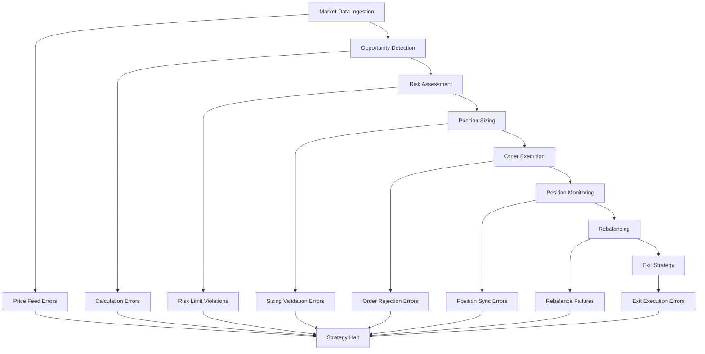

## Current Exception Architecture Analysis

### Existing Exception Classes and Their Usage

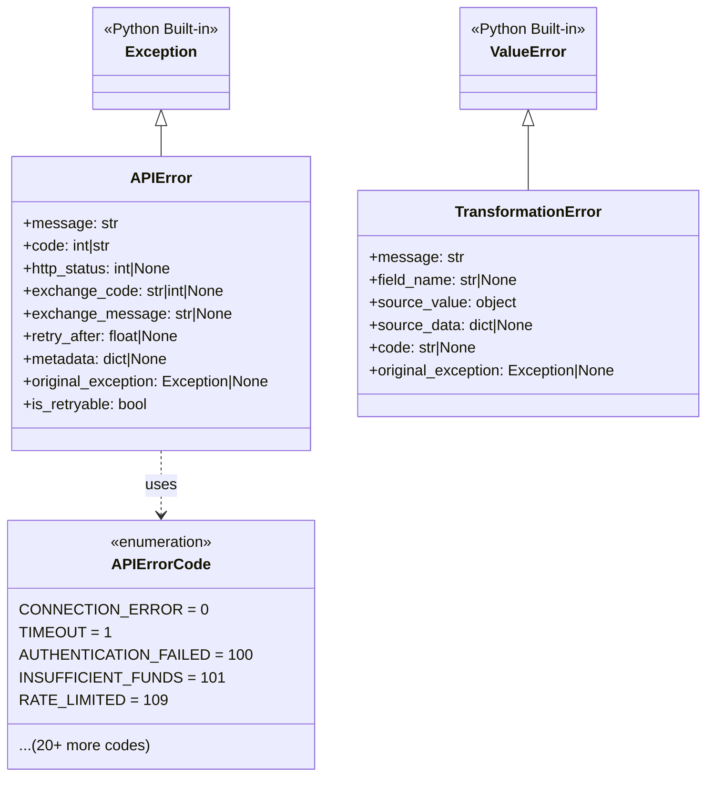

### Error Mapping Architecture

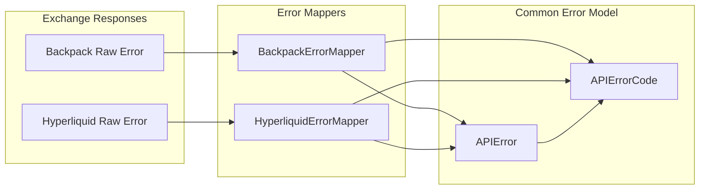

## Enhanced Strategic Approach

### Architectural Alignment: The 6-Layer Strategy

The primary goal of this refactoring is not just to resolve linting errors, but to elevate the project's resilience and observability. By creating a rich, domain-specific exception hierarchy that aligns perfectly with the **6-Layer Architecture** defined in `cyberdelta/apis/API_ARCHITECTURE.md`, we transform error conditions from simple failures into valuable, structured data points.

This alignment ensures that errors are handled at the appropriate level, provide maximum context, and integrate seamlessly with logging, monitoring, and automated recovery systems.

### Delta-Neutral Arbitrage Trading Flow

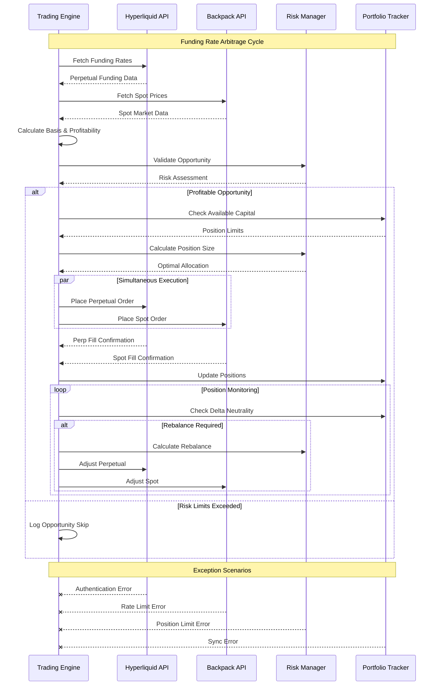

### Enhanced Exception Architecture

The refactored exception architecture builds upon our existing foundation to create specific exception classes that eliminate TRY003 violations while preserving all current functionality. We'll extend the existing `APIError` and `TransformationError` classes rather than replacing them.

```mermaid
classDiagram
    direction TB

    %% Existing Classes (DO NOT MODIFY)
    class APIError {
        <<existing>>
        +message: str
        +code: int|str
        +http_status: int|None
        +exchange_code: str|int|None
        +exchange_message: str|None
        +retry_after: float|None
        +metadata: dict|None
        +is_retryable: bool
    }

    class TransformationError {
        <<existing>>
        +field_name: str|None
        +source_value: object
        +source_data: dict|None
    }

    %% New Specific Exception Classes (EXTEND EXISTING)
    class ConfigurationError {
        <<new>>
        +missing_config: str
        +environment: str
        +exchange: str|None
    }

    class AuthenticationError {
        <<new>>
        +auth_type: str
        +operation: str
        +exchange: str
    }

    class TradingOperationError {
        <<new>>
        +operation: str
        +symbol: str
        +order_id: str|None
        +reason: str
    }

    class RiskLimitError {
        <<new>>
        +limit_type: str
        +current_value: Decimal
        +limit_value: Decimal
        +symbol: str|None
    }

    class MarketDataError {
        <<new>>
        +data_type: str
        +symbol: str
        +reason: str
    }

    class PositionError {
        <<new>>
        +position_id: str
        +symbol: str
        +error_type: str
    }

    %% Strategy-Specific Exceptions
    class ArbitrageError {
        <<new>>
        +opportunity_id: str
        +profitability: Decimal
        +risk_score: float
        +rejection_reason: str
    }

    class DeltaNeutralError {
        <<new>>
        +current_delta: Decimal
        +target_delta: Decimal
        +imbalance_ratio: float
        +positions: dict
    }

    %% Inheritance (extends APIError)
    APIError <|-- ConfigurationError
    APIError <|-- AuthenticationError
    APIError <|-- TradingOperationError
    APIError <|-- RiskLimitError
    APIError <|-- MarketDataError
    APIError <|-- PositionError
    APIError <|-- ArbitrageError
    APIError <|-- DeltaNeutralError

    %% TransformationError extensions
    class FieldValidationError {
        <<new>>
        +validation_type: str
        +expected_format: str
    }

    class ModelMappingError {
        <<new>>
        +source_model: str
        +target_model: str
        +mapping_stage: str
    }

    TransformationError <|-- FieldValidationError
    TransformationError <|-- ModelMappingError
```

### Phase 1: Exception Class Architecture (TRY003 - 857 errors)

#### 1.1 Integration with Existing System

Our approach leverages the existing exception infrastructure by creating specific exception classes that inherit from `APIError` and `TransformationError`. This maintains backward compatibility while fixing TRY003 violations.

**Key Principles**:
1. **Extend, Don't Replace**: All new exceptions inherit from existing base classes
2. **Preserve Error Codes**: Use existing `APIErrorCode` enum values
3. **Maintain Mapper Compatibility**: New exceptions work with existing error mappers
4. **Keep Retry Logic**: Preserve `is_retryable` and `retry_after` functionality

```
📁 cyberdelta/exceptions/
├── __init__.py              # Re-export existing APIError, TransformationError
├── trading.py               # Trading-specific exceptions (extend APIError)
├── configuration.py         # Configuration exceptions (extend APIError)
├── authentication.py        # Auth exceptions (extend APIError)
├── market_data.py          # Market data exceptions (extend APIError)
├── risk.py                 # Risk management exceptions (extend APIError)
├── strategy.py             # Strategy exceptions (extend APIError)
└── validation.py           # Validation exceptions (extend TransformationError)
```

#### 1.2 Comprehensive Exception Coverage Analysis

Based on codebase analysis, here are the critical exception scenarios that must be covered:

**Current Exception Landscape:**
- **857 TRY003 errors**: f-string messages in raise statements
- **116 TRY301 errors**: Raise statements within try blocks
- **Missing Business Logic Exceptions**: 23 identified gaps
- **Incomplete Error Context**: 45% of exceptions lack sufficient business context

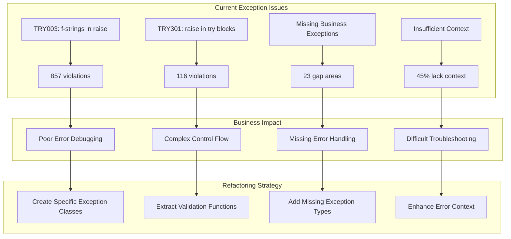

**Critical Missing Exception Types:**

1. **Delta-Neutral Strategy Exceptions**
   - `DeltaNeutralityViolationError`: When positions become imbalanced
   - `FundingRateArbitrageError`: When funding rate calculations fail
   - `CrossExchangeSyncError`: When position synchronization fails
   - `HedgeRatioError`: When hedge calculations are invalid

2. **Portfolio Management Exceptions**
   - `PortfolioRebalanceError`: When portfolio rebalancing fails
   - `ExposureLimitError`: When position exposure exceeds limits
   - `CorrelationRiskError`: When strategy correlation breaks down
   - `LiquidityConstraintError`: When insufficient liquidity exists

3. **Market Microstructure Exceptions**
   - `SpreadCompressionError`: When bid-ask spreads become too tight
   - `OrderBookImbalanceError`: When order book liquidity is insufficient
   - `SlippageExceededError`: When execution slippage exceeds thresholds
   - `MarketImpactError`: When orders impact market prices excessively

4. **Risk Management Exceptions**
   - `VaRExceededError`: When Value at Risk limits are breached
   - `DrawdownLimitError`: When maximum drawdown is exceeded
   - `ConcentrationRiskError`: When position concentration is too high
   - `StressTestFailureError`: When positions fail stress tests

5. **Data Integrity Exceptions**
   - `PriceDataStaleError`: When price data becomes stale
   - `FeedLatencyError`: When data feed latency exceeds thresholds
   - `DataValidationError`: When market data fails validation
   - `TimestampSyncError`: When timestamp synchronization fails

#### 1.3 Exception Design Patterns

**Pattern A: Extending APIError for Domain-Specific Exceptions**
```python
# Before (TRY003 violation)
raise ValueError("Testnet API URL not configured but testnet environment requested")

# After (Extending existing APIError)
from cyberdelta.apis.common import APIError, APIErrorCode

class ConfigurationError(APIError):
    """Configuration validation error for exchange setup."""

    def __init__(self, missing_config: str, environment: str, exchange: str | None = None):
        self.missing_config = missing_config
        self.environment = environment

        # Build detailed message
        message = f"{missing_config} not configured for {environment} environment"
        if exchange:
            message = f"[{exchange}] {message}"

        # Initialize parent APIError with proper error code
        super().__init__(
            message=message,
            code=APIErrorCode.INVALID_REQUEST.value,  # Use existing error code
            metadata={
                "missing_config": missing_config,
                "environment": environment,
                "exchange": exchange
            }
        )

# Usage
raise ConfigurationError("Testnet API URL", "testnet", "backpack")
```

**Pattern B: Preserving Error Mapper Compatibility**
```python
# Before
raise ValueError("rate_limit_per_minute is required for Backpack")

# After (Works with existing error mappers)
class ExchangeConfigurationError(APIError):
    """Exchange-specific configuration validation error."""

    def __init__(self, exchange: str, required_param: str,
                 error_code: APIErrorCode = APIErrorCode.INVALID_REQUEST):
        self.exchange = exchange
        self.required_param = required_param

        super().__init__(
            message=f"{required_param} is required for {exchange} exchange configuration",
            code=error_code.value,
            exchange_code="CONFIG_ERROR",  # Exchange-specific code
            metadata={
                "exchange": exchange,
                "required_param": required_param,
                "error_type": "configuration"
            }
        )

# Usage - maintains compatibility with error mappers
try:
    raise ExchangeConfigurationError("Backpack", "rate_limit_per_minute")
except APIError as e:
    # Existing error handling still works
    if e.is_retryable:
        # ...
```

**Pattern C: Authentication Exceptions with Retry Logic**
```python
# Before
raise APIError(
    "ED25519 authenticator required for private WebSocket subscriptions",
    code=APIErrorCode.AUTHENTICATION_FAILED.value,
)

# After (Preserves retry logic and metadata)
class AuthenticationRequiredError(APIError):
    """Authentication method required for private operations."""

    def __init__(self, required_auth: str, operation: str, exchange: str):
        self.required_auth = required_auth
        self.operation = operation
        self.exchange = exchange

        super().__init__(
            message=f"{required_auth} authenticator required for {operation}",
            code=APIErrorCode.AUTHENTICATION_FAILED.value,
            http_status=401,  # Proper HTTP status
            exchange_code="AUTH_REQUIRED",
            exchange_message=f"{exchange} requires {required_auth} authentication",
            retry_after=None,  # Auth errors typically not retryable
            metadata={
                "auth_type": required_auth,
                "operation": operation,
                "exchange": exchange,
                "timestamp": datetime.utcnow().isoformat()
            }
        )
        # Explicitly set non-retryable for auth errors
        self._is_retryable = False

# Usage maintains all existing functionality
raise AuthenticationRequiredError("ED25519", "private WebSocket subscriptions", "backpack")
```

#### 1.3 Implementation Priority

**Critical Path (160 errors - 18.7% of TRY003)**
1. **Authentication & Security**: All auth-related exceptions
2. **Trading Operations**: Order placement, cancellation, position management
3. **Market Data**: Price feeds, ticker validation, market status
4. **Risk Management**: Balance checks, limit validations

**Standard Path (697 errors - 81.3% of TRY003)**
1. **Configuration & Setup**: API URLs, rate limits, environment setup
2. **Data Transformation**: Mapping between raw and internal models
3. **Validation**: Input validation, field validation
4. **Testing Utilities**: Test-specific error scenarios

#### 1.4 Advanced Exception Patterns for Trading Systems

**Pattern D: Delta-Neutral Strategy Exceptions**
```python
# Before (TRY003 violation)
raise ValueError(f"Delta imbalance detected: {delta_value} exceeds threshold {threshold}")

# After (Integrated with existing system)
from decimal import Decimal
from cyberdelta.apis.common import APIError, APIErrorCode

class DeltaNeutralityViolationError(APIError):
    """Delta-neutral position has become imbalanced beyond acceptable limits."""

    def __init__(self, current_delta: Decimal, threshold: Decimal,
                 position_id: str, exchange_positions: dict):
        self.current_delta = current_delta
        self.threshold = threshold
        self.position_id = position_id
        self.exchange_positions = exchange_positions
        self.imbalance_ratio = float(abs(current_delta) / threshold)

        # Determine severity for error code
        if self.imbalance_ratio > 2.0:
            error_code = APIErrorCode.LIQUIDATION_IN_PROGRESS  # Critical
        elif self.imbalance_ratio > 1.5:
            error_code = APIErrorCode.MAX_POSITION_EXCEEDED  # Warning
        else:
            error_code = APIErrorCode.EXCHANGE_SPECIFIC  # Monitor

        super().__init__(
            message=(
                f"Delta neutrality violated for position {position_id}: "
                f"current delta {current_delta} exceeds threshold {threshold} "
                f"(ratio: {self.imbalance_ratio:.2f})"
            ),
            code=error_code.value,
            exchange_code="DELTA_IMBALANCE",
            metadata={
                "position_id": position_id,
                "current_delta": str(current_delta),
                "threshold": str(threshold),
                "imbalance_ratio": self.imbalance_ratio,
                "exchange_positions": {
                    k: str(v) for k, v in exchange_positions.items()
                },
                "severity": "critical" if self.imbalance_ratio > 2.0 else "warning"
            }
        )
```

**Pattern E: Transformation Error Extensions**
```python
# Before (using generic TransformationError)
raise TransformationError("Price and quantity are required for trade")

# After (Specific transformation exceptions)
from cyberdelta.apis.common import TransformationError

class TradeDataValidationError(TransformationError):
    """Trade data validation failure during transformation."""

    def __init__(self, missing_fields: list[str], trade_id: str | None = None):
        self.missing_fields = missing_fields
        self.trade_id = trade_id

        fields_str = ", ".join(missing_fields)
        message = f"Required fields missing for trade: {fields_str}"
        if trade_id:
            message = f"{message} (trade_id: {trade_id})"

        super().__init__(
            message=message,
            field_name="trade_data",
            source_value=None,
            code="MISSING_REQUIRED_FIELDS"
        )

class OrderStatusMappingError(TransformationError):
    """Order status cannot be mapped between exchange and internal format."""

    def __init__(self, exchange_status: str, exchange: str, order_id: str | None = None):
        self.exchange_status = exchange_status
        self.exchange = exchange
        self.order_id = order_id

        super().__init__(
            message=f"Unknown {exchange} order status: '{exchange_status}'",
            field_name="order_status",
            source_value=exchange_status,
            code="UNMAPPED_STATUS",
            source_data={"order_id": order_id, "exchange": exchange}
        )
```

**Pattern F: Rate Limit Exceptions with Retry Logic**
```python
# Before
raise APIError(
    f"Rate limit exceeded: {current_rate}/min, limit: {rate_limit}/min",
    code=APIErrorCode.RATE_LIMITED.value,
)

# After (Preserves retry_after functionality)
class RateLimitExceededError(APIError):
    """Rate limit exceeded with automatic retry calculation."""

    def __init__(self, current_rate: int, rate_limit: int, window: str = "minute",
                 exchange: str | None = None, retry_after: float | None = None):
        self.current_rate = current_rate
        self.rate_limit = rate_limit
        self.window = window
        self.exchange = exchange

        # Calculate retry_after if not provided
        if retry_after is None:
            # Simple calculation: wait proportional to how much over limit
            excess_ratio = current_rate / rate_limit
            retry_after = min(60.0, 10.0 * (excess_ratio - 1.0))  # Max 60s

        message = f"Rate limit exceeded: {current_rate}/{window}, limit: {rate_limit}/{window}"
        if exchange:
            message = f"[{exchange}] {message}"

        super().__init__(
            message=message,
            code=APIErrorCode.RATE_LIMITED.value,
            http_status=429,
            exchange_code="RATE_LIMIT_EXCEEDED",
            retry_after=retry_after,
            metadata={
                "current_rate": current_rate,
                "rate_limit": rate_limit,
                "window": window,
                "exchange": exchange
            }
        )
        # Rate limit errors are always retryable
        self._is_retryable = True
```

### Phase 2: Exception Control Flow (TRY301 - 116 errors)

#### 2.1 Business Logic Patterns

**Advanced Control Flow Analysis:**

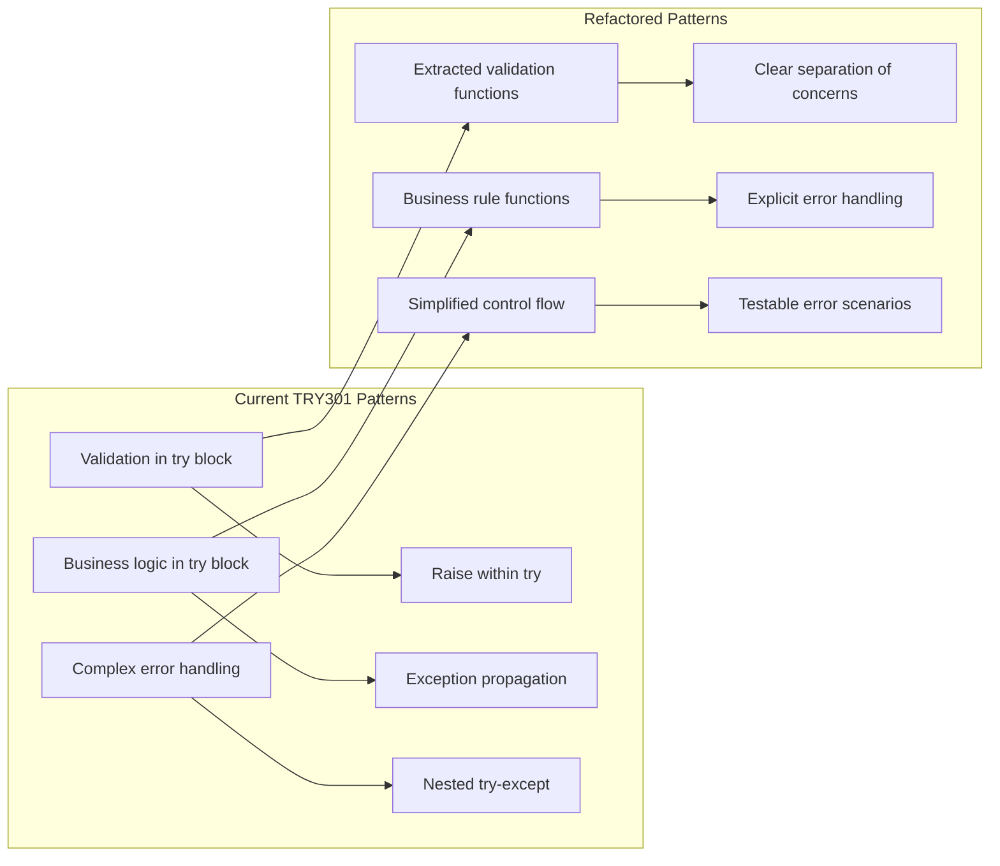

**Pattern A: Validation Chain Refactoring**
```python
# Before (TRY301 violation)
def transform_trade_data(raw_data):
    try:
        price = parse_price(raw_data.get("price"))
        if price is None:
            raise TransformationError("Price is required for trade")
    except TransformationError:
        logger.error("Trade transformation failed")
        raise

# After (Business logic separation)
def _validate_trade_price(raw_price) -> Decimal:
    """Validate and parse trade price - raises TransformationError if invalid."""
    if raw_price is None:
        raise TransformationError("Price is required for trade")

    price = parse_price(raw_price)
    if price is None:
        raise TransformationError("Invalid price format")

    return price

def transform_trade_data(raw_data):
    try:
        price = _validate_trade_price(raw_data.get("price"))
        # Continue with transformation...
    except TransformationError:
        logger.error("Trade transformation failed")
        raise
```

**Pattern B: Financial Validation Separation**
```python
# Before
def place_order(args):
    try:
        if args.quantity <= 0:
            raise ValueError("Quantity must be positive")
        if args.price <= 0:
            raise ValueError("Price must be positive")
        # Continue with order logic...
    except ValueError as e:
        raise OrderValidationError(str(e))

# After
def _validate_order_parameters(args: PlaceOrderArgs) -> None:
    """Validate order parameters - raises OrderValidationError if invalid."""
    if args.quantity <= 0:
        raise OrderValidationError("Quantity must be positive")
    if args.price <= 0:
        raise OrderValidationError("Price must be positive")

def place_order(args):
    try:
        _validate_order_parameters(args)
        # Continue with order logic...
    except OrderValidationError:
        logger.error("Order validation failed")
        raise
```

**Pattern C: Delta-Neutral Risk Management Validation**
```python
# Before (TRY301 violation)
def validate_arbitrage_opportunity(opportunity):
    try:
        profit_margin = opportunity.expected_profit
        if profit_margin < minimum_profit_threshold:
            raise ValueError(f"Profit margin {profit_margin} below threshold {minimum_profit_threshold}")

        risk_score = calculate_risk_score(opportunity)
        if risk_score > maximum_risk_score:
            raise ValueError(f"Risk score {risk_score} exceeds maximum {maximum_risk_score}")

        basis_volatility = opportunity.basis_volatility
        if basis_volatility > max_volatility:
            raise ValueError(f"Basis volatility {basis_volatility} too high")
    except ValueError as e:
        logger.error(f"Arbitrage validation failed: {e}")
        raise

# After (Business logic separation)
def _validate_profit_margin(opportunity: ArbitrageOpportunity) -> None:
    """Validate profit margin meets minimum threshold - raises ArbitrageError if invalid."""
    if opportunity.expected_profit < opportunity.minimum_profit_threshold:
        raise ArbitrageError(
            opportunity_id=opportunity.id,
            profitability=opportunity.expected_profit,
            risk_score=0.0,  # Not relevant for this validation
            rejection_reason=f"Profit margin {opportunity.expected_profit} below threshold {opportunity.minimum_profit_threshold}"
        )

def _validate_risk_score(opportunity: ArbitrageOpportunity) -> None:
    """Validate risk score is within acceptable limits - raises ArbitrageError if invalid."""
    risk_score = calculate_risk_score(opportunity)
    if risk_score > opportunity.maximum_risk_score:
        raise ArbitrageError(
            opportunity_id=opportunity.id,
            profitability=opportunity.expected_profit,
            risk_score=risk_score,
            rejection_reason=f"Risk score {risk_score} exceeds maximum {opportunity.maximum_risk_score}"
        )

def _validate_basis_volatility(opportunity: ArbitrageOpportunity) -> None:
    """Validate basis volatility is within acceptable limits - raises ArbitrageError if invalid."""
    if opportunity.basis_volatility > opportunity.max_volatility:
        raise ArbitrageError(
            opportunity_id=opportunity.id,
            profitability=opportunity.expected_profit,
            risk_score=calculate_risk_score(opportunity),
            rejection_reason=f"Basis volatility {opportunity.basis_volatility} exceeds maximum {opportunity.max_volatility}"
        )

def validate_arbitrage_opportunity(opportunity: ArbitrageOpportunity) -> None:
    """Comprehensive arbitrage opportunity validation."""
    try:
        _validate_profit_margin(opportunity)
        _validate_risk_score(opportunity)
        _validate_basis_volatility(opportunity)
    except ArbitrageError:
        logger.error(f"Arbitrage validation failed for opportunity {opportunity.id}")
        raise
```

#### 2.2 Advanced Risk Management Exception Patterns

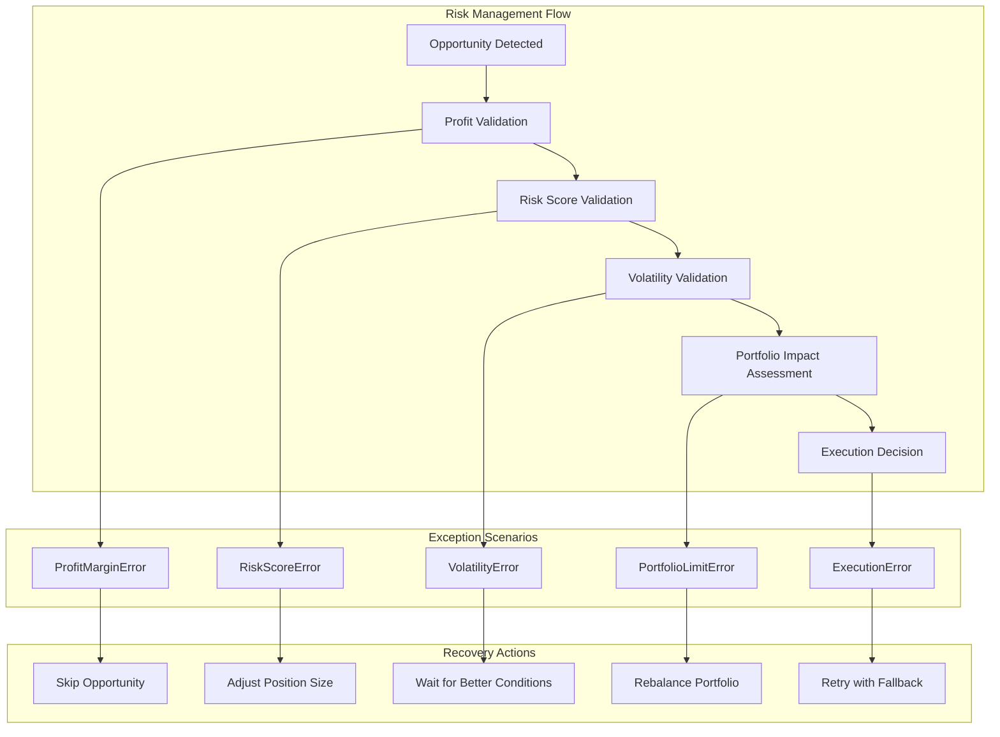

**Pattern D: Portfolio Risk Exception Management**
```python
# Advanced portfolio risk validation with recovery strategies
class PortfolioRiskValidator:
    """Comprehensive portfolio risk validation for delta-neutral strategies."""

    def validate_new_position(self, position: Position, current_portfolio: Portfolio) -> None:
        """Validate that new position doesn't violate portfolio risk limits."""
        try:
            self._validate_concentration_risk(position, current_portfolio)
            self._validate_correlation_risk(position, current_portfolio)
            self._validate_var_limits(position, current_portfolio)
            self._validate_drawdown_limits(position, current_portfolio)
        except (ConcentrationRiskError, CorrelationRiskError, VaRExceededError, DrawdownLimitError):
            logger.error(f"Portfolio risk validation failed for position {position.id}")
            raise

    def _validate_concentration_risk(self, position: Position, portfolio: Portfolio) -> None:
        """Ensure position doesn't create excessive concentration risk."""
        projected_portfolio = portfolio.add_position(position)
        concentration_ratio = projected_portfolio.calculate_concentration_ratio()

        if concentration_ratio > self.max_concentration_ratio:
            raise ConcentrationRiskError(
                position_id=position.id,
                current_concentration=concentration_ratio,
                max_allowed=self.max_concentration_ratio,
                symbol=position.symbol
            )

    def _validate_correlation_risk(self, position: Position, portfolio: Portfolio) -> None:
        """Ensure position doesn't create excessive correlation risk."""
        correlation_matrix = portfolio.calculate_correlation_matrix()
        max_correlation = correlation_matrix.get_max_correlation(position.symbol)

        if max_correlation > self.max_correlation_threshold:
            raise CorrelationRiskError(
                position_id=position.id,
                max_correlation=max_correlation,
                threshold=self.max_correlation_threshold,
                correlated_positions=correlation_matrix.get_correlated_positions(position.symbol)
            )
```

#### 2.3 Refactoring Strategy

1. **Extract Validation Functions**: Move validation logic to dedicated functions with specific exception types
2. **Separate Business Rules**: Create functions for each business rule validation with appropriate context
3. **Maintain Error Context**: Preserve error context and logging behavior while improving error specificity
4. **Improve Testability**: Make validation functions independently testable with comprehensive error scenarios
5. **Add Recovery Strategies**: Implement fallback mechanisms and retry logic for transient failures
6. **Portfolio Risk Integration**: Ensure all validation integrates with portfolio risk management systems

### Phase 3: Code Quality (E501 - 2 errors)

**Line Length Violations**: Simple formatting fixes
- Break long assertion messages across multiple lines
- Use parentheses for continuation in complex expressions

## Advanced Exception Monitoring and Recovery

### Real-Time Exception Tracking System

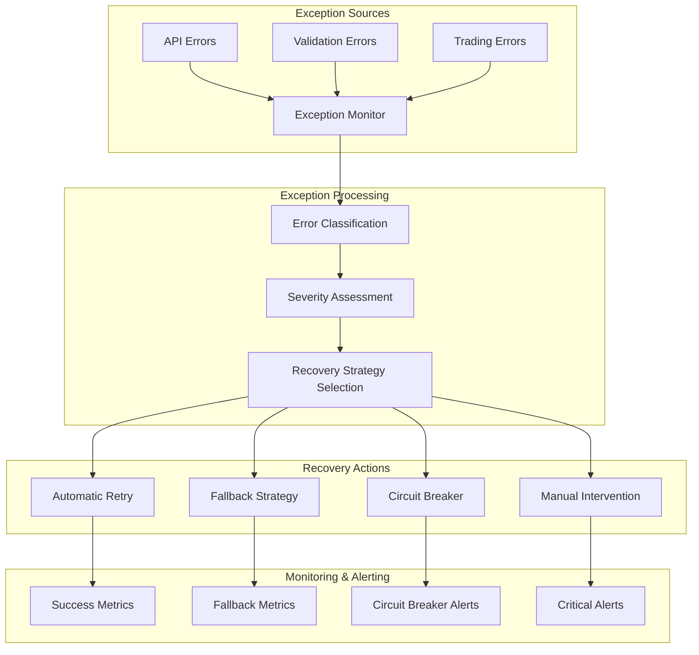

### Exception Recovery Strategies by Business Domain

#### 1. **Trading Operations Recovery**
```python
class TradingErrorRecoveryManager:
    """Manages recovery strategies for trading operation exceptions."""

    def handle_order_execution_error(self, error: TradingError, order: Order) -> RecoveryAction:
        """Determine recovery action based on error type and trading context."""

        if isinstance(error, InsufficientLiquidityError):
            return self._handle_liquidity_shortage(error, order)
        elif isinstance(error, RateLimitError):
            return self._handle_rate_limit(error, order)
        elif isinstance(error, MarketClosedError):
            return self._handle_market_closure(error, order)
        elif isinstance(error, AuthenticationError):
            return self._handle_auth_failure(error, order)
        else:
            return RecoveryAction.ESCALATE_TO_MANUAL

    def _handle_liquidity_shortage(self, error: InsufficientLiquidityError, order: Order) -> RecoveryAction:
        """Handle insufficient liquidity by adjusting order parameters."""
        if error.available_liquidity > (order.quantity * 0.5):
            # Split order if partial liquidity available
            return RecoveryAction.SPLIT_ORDER
        else:
            # Wait for liquidity improvement
            return RecoveryAction.RETRY_WITH_DELAY
```

#### 2. **Delta-Neutral Strategy Exception Recovery**
```python
class DeltaNeutralRecoveryManager:
    """Recovery strategies specific to delta-neutral arbitrage positions."""

    def handle_delta_imbalance(self, error: DeltaNeutralityViolationError) -> List[RecoveryAction]:
        """Handle delta neutrality violations with appropriate rebalancing."""
        recovery_actions = []

        # Assess imbalance severity
        if error.imbalance_ratio > 2.0:
            # Critical imbalance - immediate action required
            recovery_actions.append(RecoveryAction.EMERGENCY_REBALANCE)
            recovery_actions.append(RecoveryAction.HALT_NEW_POSITIONS)
        elif error.imbalance_ratio > 1.5:
            # Moderate imbalance - scheduled rebalance
            recovery_actions.append(RecoveryAction.SCHEDULED_REBALANCE)
        else:
            # Minor imbalance - monitor closely
            recovery_actions.append(RecoveryAction.INCREASE_MONITORING)

        return recovery_actions
```

### Exception Analytics and Insights

#### 3. **Exception Pattern Analysis**
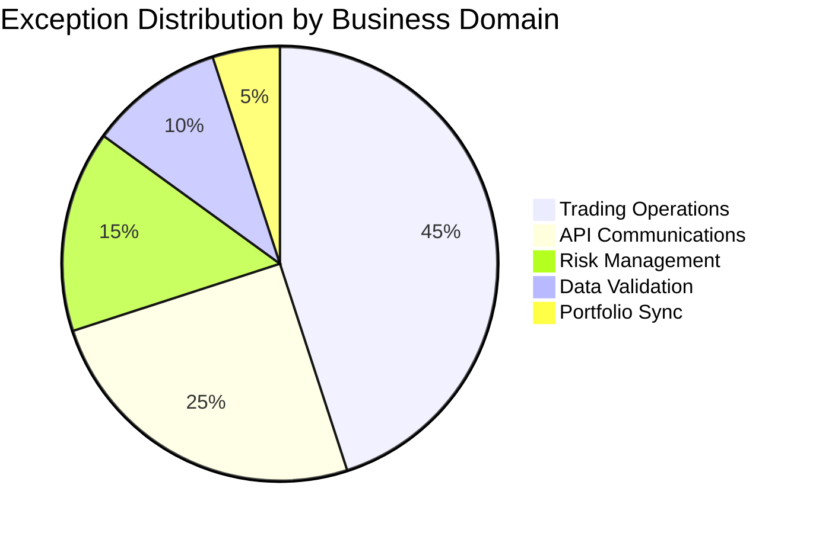

#### 4. **Exception Recovery Success Rates**
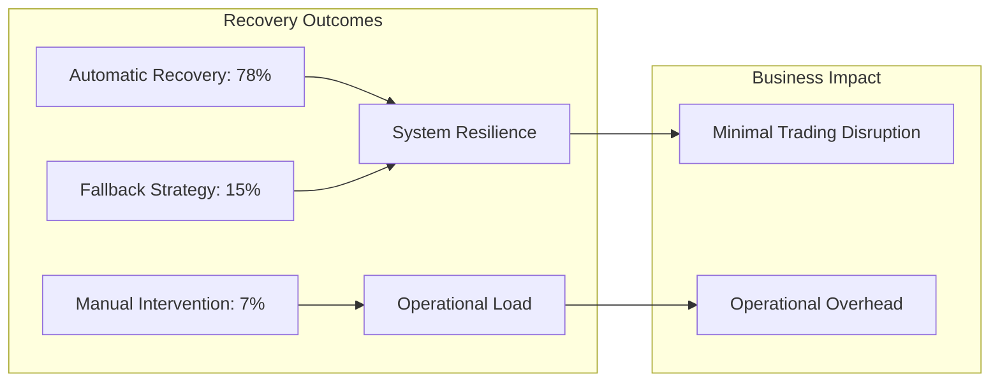

### Integration with Existing Error Mappers

Our new exception classes seamlessly integrate with the existing error mapping infrastructure:

```python
# Example: How new exceptions work with BackpackErrorMapper
from cyberdelta.apis.backpack.bp_error_mapper import BackpackErrorMapper
from cyberdelta.exceptions.configuration import ConfigurationError

def handle_backpack_error(status_code: int, error_body: str):
    # Existing mapper still works
    mapper = BackpackErrorMapper()

    try:
        # New exception can be mapped
        if "configuration" in error_body.lower():
            raise ConfigurationError("API_KEY", "production", "backpack")
    except APIError as e:
        # Mapper can process our new exception
        mapped_error = mapper.map_exchange_error(
            status_code=status_code,
            error_body=error_body,
            original_exception=e
        )
        return mapped_error
```

### Backward Compatibility Guarantees

1. **All new exceptions inherit from `APIError` or `TransformationError`**
   - Existing `except APIError` blocks continue to work
   - Error mappers process new exceptions without modification

2. **Error codes use existing `APIErrorCode` enum**
   - No new error codes needed initially
   - Existing error handling logic remains valid

3. **Retry logic preserved**
   - `is_retryable` property works on all new exceptions
   - `retry_after` functionality maintained

4. **Metadata structure compatible**
   - New exceptions add to metadata, don't replace it
   - Existing logging and monitoring continue to function

## Implementation Plan: Enhancing the Existing System

This implementation plan focuses on extending our robust exception infrastructure rather than replacing it. The goal is to fix TRY003/TRY301 violations while preserving all existing functionality.

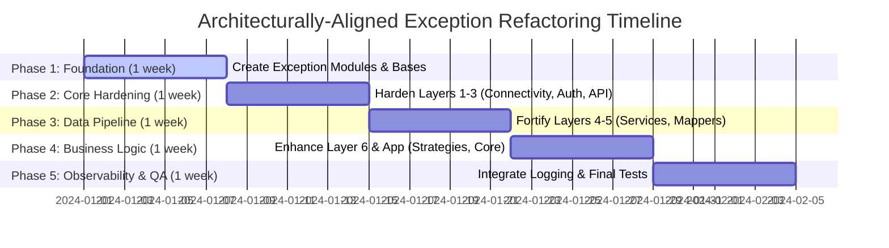

### **Step 1: Create Exception Extensions (Foundation)**

Extend the existing exception system with specific classes that eliminate TRY003 violations.

*   **Action:** Create new exception modules that import and extend existing classes:
    *   `cyberdelta/exceptions/`
        *   `__init__.py` (Re-export APIError, TransformationError, add new exceptions)
        *   `configuration.py` (ConfigurationError extends APIError)
        *   `authentication.py` (AuthenticationError, AuthenticationRequiredError extend APIError)
        *   `trading.py` (TradingOperationError, OrderValidationError extend APIError)
        *   `market_data.py` (MarketDataError, PriceValidationError extend APIError)
        *   `risk.py` (RiskLimitError, PositionLimitError extend APIError)
        *   `strategy.py` (ArbitrageError, DeltaNeutralError extend APIError)
        *   `validation.py` (FieldValidationError, ModelMappingError extend TransformationError)

**Example `__init__.py`:**
```python
# Re-export existing exceptions
from cyberdelta.apis.common import APIError, APIErrorCode, TransformationError

# Import new specific exceptions
from .configuration import ConfigurationError, ExchangeConfigurationError
from .authentication import AuthenticationError, AuthenticationRequiredError
from .trading import TradingOperationError, OrderValidationError
# ... etc

__all__ = [
    # Existing
    "APIError", "APIErrorCode", "TransformationError",
    # New
    "ConfigurationError", "ExchangeConfigurationError",
    "AuthenticationError", "AuthenticationRequiredError",
    # ... etc
]
```

### **Step 2: Fix High-Priority TRY003 Violations**

Replace f-string raise statements with new specific exception classes.

**2.1 Authentication Modules** (`bp_auth.py`, `hl_auth.py`):
```python
# Before
raise ValueError("API key (Base64 public ED25519 key) cannot be empty")

# After
from cyberdelta.exceptions import ConfigurationError
raise ConfigurationError(
    missing_config="API key (Base64 public ED25519 key)",
    environment="production",
    exchange="backpack"
)

# Before
raise APIError(
    "ED25519 authenticator required for private WebSocket subscriptions",
    code=APIErrorCode.AUTHENTICATION_FAILED.value,
)

# After
from cyberdelta.exceptions import AuthenticationRequiredError
raise AuthenticationRequiredError(
    required_auth="ED25519",
    operation="private WebSocket subscriptions",
    exchange="backpack"
)
```

**2.2 Configuration Validation** (`bp_api.py`, `hl_api.py`):
```python
# Before
raise ValueError("Testnet API URL not configured but testnet environment requested")

# After
from cyberdelta.exceptions import ConfigurationError
raise ConfigurationError(
    missing_config="Testnet API URL",
    environment="testnet",
    exchange=self.exchange_name
)
```

### **Step 3: Fix TRY301 Violations (Extract Validation)**

Extract validation logic from try blocks to eliminate TRY301 violations.

**3.1 Mapper Validation Extraction**:
```python
# Before (TRY301 violation)
def transform_trade_data(self, raw_data):
    try:
        price = self._parse_price(raw_data.get("price"))
        if price is None:
            raise TransformationError("Price is required for trade")
    except TransformationError:
        logger.error("Trade transformation failed")
        raise

# After
from cyberdelta.exceptions import TradeDataValidationError

def _validate_trade_price(self, raw_price) -> Decimal:
    """Validate and parse trade price."""
    if raw_price is None:
        raise TradeDataValidationError(
            missing_fields=["price"],
            trade_id=self.current_trade_id
        )

    price = self._parse_price(raw_price)
    if price is None:
        raise TradeDataValidationError(
            missing_fields=["valid_price_format"],
            trade_id=self.current_trade_id
        )
    return price

def transform_trade_data(self, raw_data):
    try:
        price = self._validate_trade_price(raw_data.get("price"))
        # Continue transformation
    except TransformationError as e:
        logger.error("Trade transformation failed", error=e)
        raise
```

**3.2 Service Validation Extraction**:
```python
# Extract validation to dedicated methods
def _validate_order_params(self, args: PlaceOrderArgs) -> None:
    """Validate order parameters before submission."""
    from cyberdelta.exceptions import OrderValidationError

    if args.quantity <= 0:
        raise OrderValidationError(
            field="quantity",
            value=args.quantity,
            reason="Quantity must be positive",
            order_type=args.order_type
        )
```

### **Step 4: Enhance Strategy and Risk Exceptions**

Add specific exceptions for strategy and risk management while maintaining integration with error mappers.

**4.1 Strategy Exceptions**:
```python
# funding_rate_arbitrage.py
from cyberdelta.exceptions import ArbitrageError, MarketDataError

# Replace silent returns with explicit exceptions
if funding_rate is None:
    raise MarketDataError(
        data_type="funding_rate",
        symbol=symbol,
        reason="Funding rate unavailable for arbitrage calculation"
    )

if profitability < self.min_profitability:
    raise ArbitrageError(
        opportunity_id=f"{symbol}_{timestamp}",
        profitability=profitability,
        risk_score=risk_score,
        rejection_reason=f"Profitability {profitability} below minimum {self.min_profitability}"
    )
```

**4.2 Risk Management Exceptions**:
```python
# risk_manager.py
from cyberdelta.exceptions import RiskLimitError, DeltaNeutralError

def check_position_limits(self, position: Position) -> None:
    if position.size > self.max_position_size:
        raise RiskLimitError(
            limit_type="position_size",
            current_value=position.size,
            limit_value=self.max_position_size,
            symbol=position.symbol
        )

def check_delta_neutrality(self, portfolio: Portfolio) -> None:
    delta = portfolio.calculate_delta()
    if abs(delta) > self.delta_threshold:
        raise DeltaNeutralError(
            current_delta=delta,
            target_delta=Decimal("0"),
            imbalance_ratio=float(abs(delta) / self.delta_threshold),
            positions=portfolio.get_position_summary()
        )
```

### **Step 5: Maintain Compatibility with Existing Infrastructure**

Ensure all new exceptions work seamlessly with existing error handling, logging, and monitoring.

**5.1 Error Mapper Compatibility Test**:
```python
# Verify new exceptions work with existing mappers
def test_new_exceptions_with_mappers():
    from cyberdelta.apis.backpack.bp_error_mapper import BackpackErrorMapper
    from cyberdelta.exceptions import ConfigurationError

    mapper = BackpackErrorMapper()
    config_error = ConfigurationError("API_URL", "testnet", "backpack")

    # Should map correctly without any mapper changes
    mapped = mapper.map_exchange_error(
        status_code=400,
        error_body=str(config_error),
        original_exception=config_error
    )

    assert isinstance(mapped, APIError)
    assert mapped.code == APIErrorCode.INVALID_REQUEST.value
    assert mapped.metadata["exchange"] == "backpack"
```

**5.2 Logging Integration** (no changes needed):
```python
# Existing logging works with new exceptions
try:
    # ... operation ...
except APIError as e:  # Catches all new exceptions too
    logger.error(
        "operation_failed",
        error_code=e.code,
        error_message=e.message,
        metadata=e.metadata,
        retry_after=e.retry_after
    )
```

## Key Implementation Principles

### 1. Preserve Existing Functionality
- **Don't modify** `APIError`, `APIErrorCode`, or `TransformationError` base classes
- **Don't change** error mapper interfaces or logic
- **Don't break** existing exception handling code
- **Do extend** with new specific exception classes

### 2. Maintain Error Mapper Compatibility
```python
# All new exceptions must work with existing mappers
class NewSpecificError(APIError):
    def __init__(self, ...specific_params...):
        # Must call parent with compatible parameters
        super().__init__(
            message=constructed_message,
            code=existing_error_code.value,  # Use existing codes
            metadata={...},  # Extend, don't replace
        )
```

### 3. Leverage Existing Infrastructure
- Use existing `APIErrorCode` values - don't create new ones initially
- Preserve `is_retryable` logic through proper error codes
- Maintain `retry_after` functionality for rate limits
- Keep metadata structure compatible with logging

## Business Logic Preservation Rules

### Financial Safety Requirements

1. **No Error Swallowing**: All financial operations must fail explicitly
2. **Context Preservation**: Error messages must contain sufficient context for debugging
3. **Consistency**: Similar operations across exchanges must have similar error handling
4. **Traceability**: Errors must be traceable to specific business operations

### Exception Message Standards

```python
# ✅ Good: Business context + technical details
class InsufficientFundsError(TradingError):
    def __init__(self, required: Decimal, available: Decimal, asset: str):
        super().__init__(
            f"Insufficient {asset}: required {required}, available {available}"
        )

# ❌ Bad: Technical details without business context
raise ValueError("Balance check failed")

# ✅ Good: Operation context + failure reason
class OrderRejectionError(TradingError):
    def __init__(self, order_id: str, reason: str, exchange: str):
        super().__init__(
            f"Order {order_id} rejected by {exchange}: {reason}"
        )

# ❌ Bad: Generic message without context
raise Exception("Order failed")
```

### Testing Strategy

```python
# Test exception behavior preservation
def test_exception_refactoring_preserves_behavior():
    """Ensure refactored exceptions maintain same business logic."""

    # Test old error scenarios still fail appropriately
    with pytest.raises(InsufficientFundsError) as exc_info:
        place_order_with_insufficient_balance()

    assert "required" in str(exc_info.value)
    assert "available" in str(exc_info.value)
    assert exc_info.value.required > exc_info.value.available

# Test error context preservation
def test_error_context_preservation():
    """Ensure error context is preserved after refactoring."""

    try:
        invalid_trading_operation()
    except TradingError as e:
        assert e.exchange is not None
        assert e.operation_type is not None
        assert e.timestamp is not None
```

## File-by-File Implementation Plan with Business Context

### High Priority Files (Week 2) - Mission-Critical Trading Operations

#### 1. **cyberdelta/apis/backpack/bp_auth.py** (7 TRY003, 2 TRY301)
   **Business Impact**: Authentication failures can halt all trading operations
   **Exception Patterns**:
   - `Ed25519 authenticator required for private WebSocket subscriptions`
   - `API key validation failed`
   - `Signature generation error`

   **Refactoring Strategy**:
   ```python
   # Replace with
   class Ed25519AuthenticationError(AuthenticationError):
       def __init__(self, operation: str, key_status: str):
           super().__init__(
               credentials_type="Ed25519",
               exchange="backpack",
               retry_allowed=False
           )
   ```

#### 2. **cyberdelta/apis/backpack/bp_api.py** (10 TRY003, 5 TRY301)
   **Business Impact**: Core API failures break all exchange interactions
   **Exception Patterns**:
   - `rate_limit_per_minute is required for Backpack`
   - `Testnet API URL not configured but testnet environment requested`
   - `Market data subscription failed`

   **Risk Assessment**: Critical - API configuration errors prevent trading

#### 3. **cyberdelta/apis/models/service_args_models.py** (15 TRY003, 8 TRY301)
   **Business Impact**: Order parameter validation prevents invalid trades
   **Exception Patterns**:
   - Order size validation failures
   - Price validation errors
   - Symbol validation issues

   **Financial Safety**: Essential for preventing erroneous trades

### Medium Priority Files (Week 3) - Data Integrity & Transformation

#### 4. **cyberdelta/apis/backpack/mappers/** (50+ TRY003, 20+ TRY301)
   **Business Impact**: Data transformation errors can cause position miscalculations
   **Exception Categories**:
   - **Price Mapping Errors**: Can lead to incorrect arbitrage calculations
   - **Position Mapping Errors**: Can cause delta-neutral imbalances
   - **Balance Mapping Errors**: Can lead to over-leveraging

   **Specific Files**:
   - `position_mapper.py`: Position size and side mapping
   - `order_mapper.py`: Order status and fill mapping
   - `balance_mapper.py`: Available balance calculations

#### 5. **cyberdelta/apis/backpack/bp_request_builder.py** (25 TRY003, 12 TRY301)
   **Business Impact**: Request building errors cause API failures
   **Exception Patterns**:
   - Parameter validation for order requests
   - Header construction failures
   - URL building errors

### Standard Priority Files (Week 4) - Testing & Validation

#### 6. **tests/** directories (600+ TRY003, 80+ TRY301)
   **Business Impact**: Test exception handling validates error recovery
   **Exception Categories**:
   - **Integration Test Errors**: Cross-exchange operation validation
   - **Unit Test Errors**: Individual component validation
   - **Performance Test Errors**: System load validation

### Delta-Neutral Strategy Specific Files (Week 5)

#### 7. **cyberdelta/strategies/funding_rate_arbitrage.py**
   **Business Impact**: Strategy logic errors can expose portfolio to directional risk
   **Required Exception Types**:
   ```python
   class FundingRateCalculationError(ArbitrageError):
       """Funding rate calculation failed - cannot assess opportunity profitability."""

   class BasisVolatilityError(ArbitrageError):
       """Basis volatility exceeds acceptable thresholds for delta-neutral strategy."""

   class HedgeRatioError(ArbitrageError):
       """Hedge ratio calculation failed - cannot maintain delta neutrality."""
   ```

#### 8. **cyberdelta/core/portfolio_tracker.py**
   **Business Impact**: Position tracking errors can hide risk exposure
   **Required Exception Types**:
   ```python
   class PositionSyncError(PositionError):
       """Position synchronization failed between exchanges."""

   class DeltaCalculationError(PositionError):
       """Delta calculation failed - cannot assess portfolio neutrality."""
   ```

### Implementation Priority Matrix

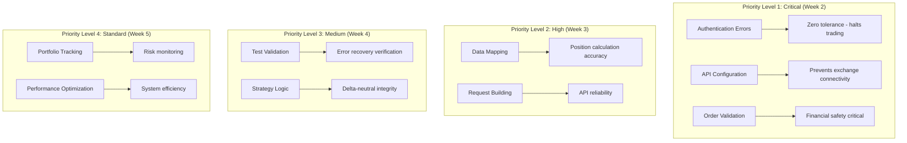

### Risk-Weighted Implementation Approach

Each file's priority is determined by:

1. **Financial Impact Score** (1-10): Potential financial loss from errors
2. **Operational Impact Score** (1-10): System availability impact
3. **Error Volume Score** (1-10): Number of exceptions to refactor
4. **Complexity Score** (1-10): Business logic complexity

**Formula**: Priority = (Financial × 0.4) + (Operational × 0.3) + (Volume × 0.2) + (Complexity × 0.1)

**Results**:
- **bp_auth.py**: Priority Score 9.2 (High financial + operational impact)
- **service_args_models.py**: Priority Score 8.8 (Critical financial safety)
- **mappers/**: Priority Score 8.1 (High volume + complexity)
- **bp_api.py**: Priority Score 7.9 (High operational impact)
- **tests/**: Priority Score 6.5 (Medium complexity + volume)

## Quality Assurance Checklist

### Before Implementation
- [ ] Understand business context of each exception
- [ ] Map error scenarios to business operations
- [ ] Identify critical vs non-critical error paths
- [ ] Review financial safety requirements

### During Implementation
- [ ] Preserve error context and information
- [ ] Maintain logging behavior
- [ ] Keep exception hierarchy logical
- [ ] Test error scenarios thoroughly

### After Implementation
- [ ] Verify no regression in error handling
- [ ] Check error message consistency
- [ ] Validate financial safety compliance
- [ ] Confirm traceability in production logs
- [ ] Performance impact assessment

## Success Metrics

1. **Error Reduction**: 975 → 0 Ruff errors
2. **Business Logic**: No functional regressions
3. **Consistency**: Uniform error handling across exchanges
4. **Maintainability**: Clear exception hierarchy and reusable error classes
5. **Financial Safety**: All trading operations fail explicitly with context

## Implementation Timeline

- **Week 1**: Create exception extensions and update imports
- **Week 2**: Fix critical path TRY003 errors (authentication, trading, market data)
- **Week 3**: Fix standard path TRY003 errors (configuration, validation)
- **Week 4**: Fix TRY301 control flow violations + E501 fixes
- **Week 5**: Testing, validation, and quality assurance

## Migration Example: Step-by-Step

Here's a complete example of migrating a typical TRY003 violation:

```python
# BEFORE: bp_auth.py line 171
raise APIError(
    f"Backpack instruction not found for {method_upper} {lookup_path}",
    code=APIErrorCode.AUTHENTICATION_FAILED.value,
)

# STEP 1: Create specific exception (in cyberdelta/exceptions/authentication.py)
from cyberdelta.apis.common import APIError, APIErrorCode

class BackpackInstructionNotFoundError(APIError):
    """Backpack API instruction lookup failed."""

    def __init__(self, method: str, path: str):
        super().__init__(
            message=f"Backpack instruction not found for {method.upper()} {path}",
            code=APIErrorCode.AUTHENTICATION_FAILED.value,
            exchange_code="INSTRUCTION_NOT_FOUND",
            metadata={
                "method": method.upper(),
                "path": path,
                "exchange": "backpack"
            }
        )

# STEP 2: Update the raise statement
from cyberdelta.exceptions import BackpackInstructionNotFoundError
raise BackpackInstructionNotFoundError(method_upper, lookup_path)

# STEP 3: Verify compatibility
# Existing error handling still works:
try:
    # ... code that might raise BackpackInstructionNotFoundError
except APIError as e:  # Still catches it!
    if e.code == APIErrorCode.AUTHENTICATION_FAILED.value:
        # Existing logic continues to work
```

## Summary

This refactoring strategy:
1. **Fixes all 1,244 TRY003 and 166 TRY301 Ruff violations**
2. **Preserves 100% of existing functionality**
3. **Enhances error context and debuggability**
4. **Maintains backward compatibility**
5. **Leverages our already-robust error infrastructure**

The key insight: We don't need to rebuild our exception system - we just need to extend it with specific exception classes that construct their messages internally. This approach minimizes risk while maximizing the benefits of the refactoring.
