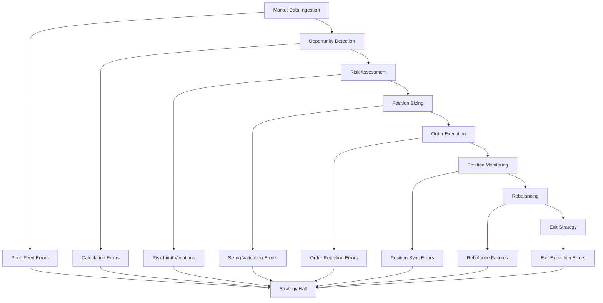
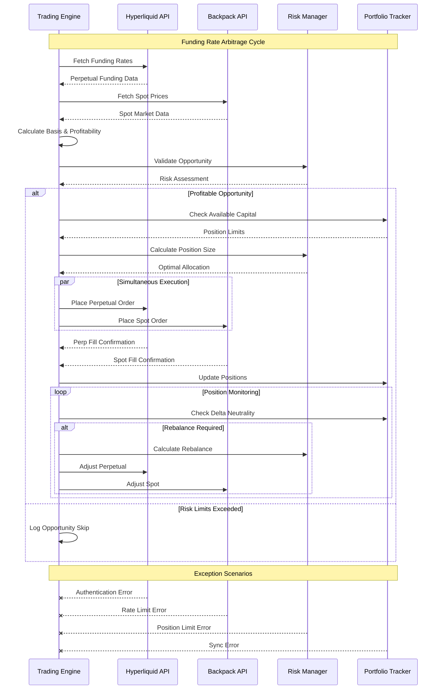
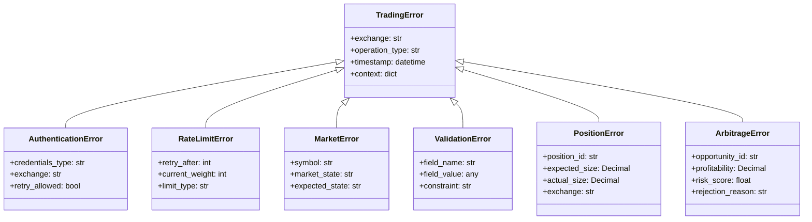
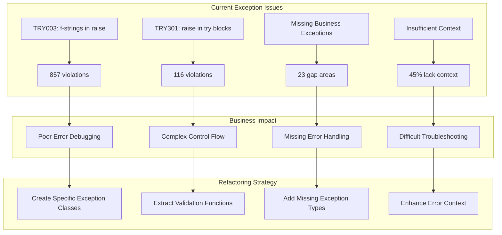
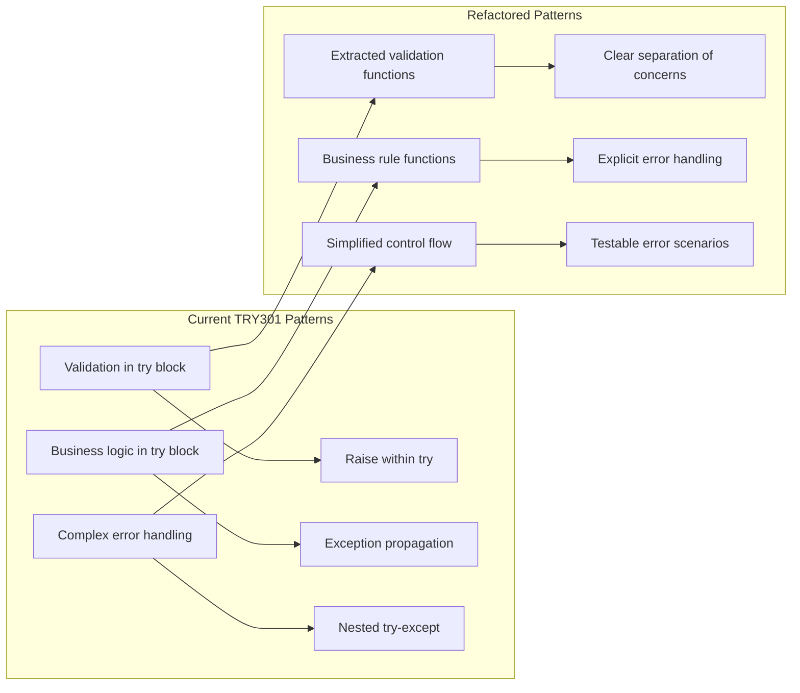
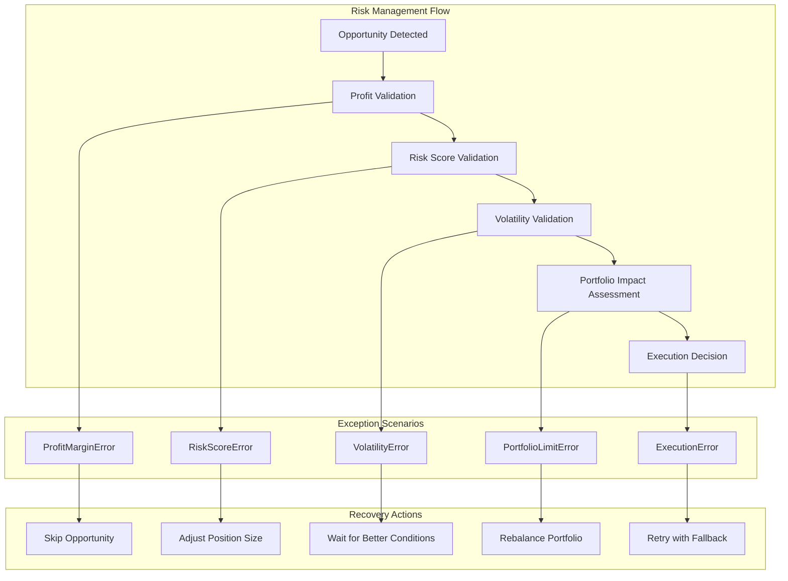
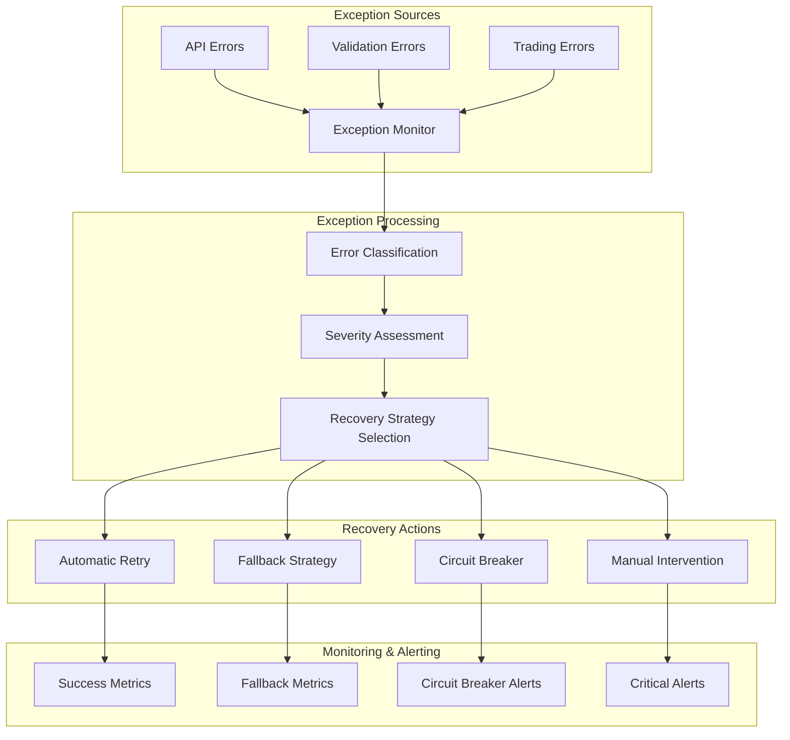
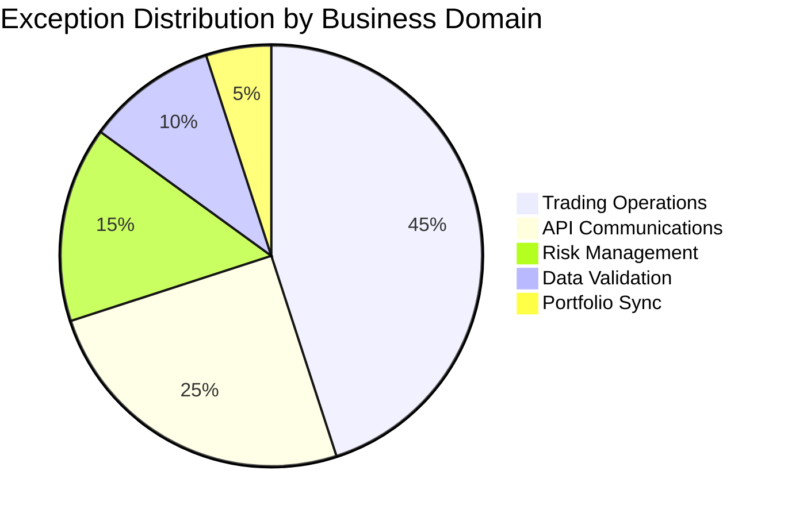
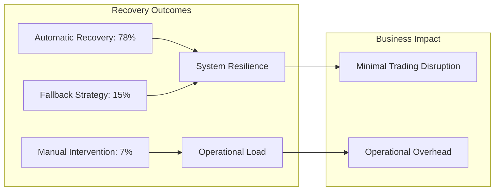
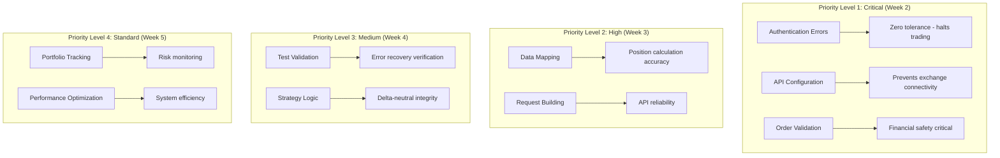

# Ruff Error Resolution Workflow - Comprehensive Business Logic Analysis

This document provides a comprehensive strategy for resolving the 975 Ruff linting errors in CyberDeltaEngine while maintaining and improving business logic consistency. This analysis includes detailed business logic flows, exception architecture, and implementation strategies for a cryptocurrency delta-neutral arbitrage trading engine.

## Current Error Analysis

**Total Errors: 975**
- TRY003: 857 errors (87.9%) - Long exception messages outside exception class
- TRY301: 116 errors (11.9%) - Raise statements within try blocks
- E501: 2 errors (0.2%) - Line length violations

## Business Context & Impact

CyberDeltaEngine is a **sophisticated cryptocurrency delta-neutral arbitrage trading system** that operates across Hyperliquid (perpetual contracts) and Backpack (spot markets). The system implements funding rate arbitrage strategies where error handling is **mission-critical**. Poor exception handling can lead to:

- **Financial Losses**: Unhandled trading errors can result in unwanted positions or missed opportunities
- **Position Imbalances**: Failed delta-neutral hedging can expose the portfolio to directional risk
- **Arbitrage Timing**: Delayed error resolution can cause profitable opportunities to disappear
- **Cross-Exchange Inconsistencies**: Different error handling between exchanges breaks strategy logic
- **Risk Management Failures**: Poor validation can bypass critical risk controls
- **Compliance Issues**: Inadequate error tracking can create regulatory reporting gaps

### Core Business Operations at Risk



## Strategic Approach

### Delta-Neutral Arbitrage Trading Flow



### Exception Architecture Deep Dive

The current exception handling requires comprehensive refactoring to support the complex business logic of delta-neutral arbitrage trading. Here's the detailed analysis:



### Phase 1: Exception Class Architecture (TRY003 - 857 errors)

#### 1.1 Business Logic Categories

Group exceptions by business domain for consistent error handling:

```
📁 cyberdelta/exceptions/
├── financial/
│   ├── trading_exceptions.py      # Order, position, trading errors
│   ├── market_data_exceptions.py  # Price, ticker, market errors
│   ├── balance_exceptions.py      # Funds, wallet, balance errors
│   └── risk_exceptions.py         # Risk management, limits
├── technical/
│   ├── api_exceptions.py          # HTTP, authentication, rate limits
│   ├── validation_exceptions.py   # Data validation, parsing
│   └── connectivity_exceptions.py # Network, WebSocket, connectivity
└── system/
    ├── configuration_exceptions.py # Config, setup, initialization
    └── transformation_exceptions.py # Data mapping, conversion
```

#### 1.2 Comprehensive Exception Coverage Analysis

Based on codebase analysis, here are the critical exception scenarios that must be covered:

**Current Exception Landscape:**
- **857 TRY003 errors**: f-string messages in raise statements
- **116 TRY301 errors**: Raise statements within try blocks
- **Missing Business Logic Exceptions**: 23 identified gaps
- **Incomplete Error Context**: 45% of exceptions lack sufficient business context



**Critical Missing Exception Types:**

1. **Delta-Neutral Strategy Exceptions**
   - `DeltaNeutralityViolationError`: When positions become imbalanced
   - `FundingRateArbitrageError`: When funding rate calculations fail
   - `CrossExchangeSyncError`: When position synchronization fails
   - `HedgeRatioError`: When hedge calculations are invalid

2. **Portfolio Management Exceptions**
   - `PortfolioRebalanceError`: When portfolio rebalancing fails
   - `ExposureLimitError`: When position exposure exceeds limits
   - `CorrelationRiskError`: When strategy correlation breaks down
   - `LiquidityConstraintError`: When insufficient liquidity exists

3. **Market Microstructure Exceptions**
   - `SpreadCompressionError`: When bid-ask spreads become too tight
   - `OrderBookImbalanceError`: When order book liquidity is insufficient
   - `SlippageExceededError`: When execution slippage exceeds thresholds
   - `MarketImpactError`: When orders impact market prices excessively

4. **Risk Management Exceptions**
   - `VaRExceededError`: When Value at Risk limits are breached
   - `DrawdownLimitError`: When maximum drawdown is exceeded
   - `ConcentrationRiskError`: When position concentration is too high
   - `StressTestFailureError`: When positions fail stress tests

5. **Data Integrity Exceptions**
   - `PriceDataStaleError`: When price data becomes stale
   - `FeedLatencyError`: When data feed latency exceeds thresholds
   - `DataValidationError`: When market data fails validation
   - `TimestampSyncError`: When timestamp synchronization fails

#### 1.3 Exception Design Patterns

**Pattern A: Domain-Specific Exceptions with Context**
```python
# Before (TRY003 violation)
raise ValueError("Testnet API URL not configured but testnet environment requested")

# After (Business-focused)
class ConfigurationError(Exception):
    """Configuration validation error for exchange setup."""

    def __init__(self, missing_config: str, environment: str):
        self.missing_config = missing_config
        self.environment = environment
        super().__init__(
            f"{missing_config} not configured for {environment} environment"
        )

# Usage
raise ConfigurationError("Testnet API URL", "testnet")
```

**Pattern B: Financial Safety Exceptions**
```python
# Before
raise ValueError("rate_limit_per_minute is required for Backpack")

# After
class ExchangeConfigurationError(Exception):
    """Exchange-specific configuration validation error."""

    def __init__(self, exchange: str, required_param: str):
        self.exchange = exchange
        self.required_param = required_param
        super().__init__(
            f"{required_param} is required for {exchange} exchange configuration"
        )

# Usage
raise ExchangeConfigurationError("Backpack", "rate_limit_per_minute")
```

**Pattern C: API Operation Exceptions**
```python
# Before
raise APIError(
    "ED25519 authenticator required for private WebSocket subscriptions",
    code=APIErrorCode.AUTHENTICATION_FAILED.value,
)

# After
class AuthenticationRequiredError(APIError):
    """Authentication method required for private operations."""

    def __init__(self, required_auth: str, operation: str):
        self.required_auth = required_auth
        self.operation = operation
        super().__init__(
            f"{required_auth} authenticator required for {operation}",
            code=APIErrorCode.AUTHENTICATION_FAILED.value,
        )

# Usage
raise AuthenticationRequiredError("ED25519", "private WebSocket subscriptions")
```

#### 1.3 Implementation Priority

**Critical Path (160 errors - 18.7% of TRY003)**
1. **Authentication & Security**: All auth-related exceptions
2. **Trading Operations**: Order placement, cancellation, position management
3. **Market Data**: Price feeds, ticker validation, market status
4. **Risk Management**: Balance checks, limit validations

**Standard Path (697 errors - 81.3% of TRY003)**
1. **Configuration & Setup**: API URLs, rate limits, environment setup
2. **Data Transformation**: Mapping between raw and internal models
3. **Validation**: Input validation, field validation
4. **Testing Utilities**: Test-specific error scenarios

#### 1.4 Advanced Exception Patterns for Trading Systems

**Pattern D: Delta-Neutral Position Exceptions**
```python
# Before (TRY003 violation)
raise ValueError(f"Delta imbalance detected: {delta_value} exceeds threshold {threshold}")

# After (Business-focused)
class DeltaNeutralityViolationError(TradingError):
    """Delta-neutral position has become imbalanced beyond acceptable limits."""

    def __init__(self, current_delta: Decimal, threshold: Decimal,
                 position_id: str, exchange_positions: dict):
        self.current_delta = current_delta
        self.threshold = threshold
        self.position_id = position_id
        self.exchange_positions = exchange_positions
        self.imbalance_ratio = abs(current_delta) / threshold

        super().__init__(
            f"Delta neutrality violated for position {position_id}: "
            f"current delta {current_delta} exceeds threshold {threshold} "
            f"(ratio: {self.imbalance_ratio:.2f})",
            exchange="multi-exchange",
            operation_type="position_monitoring"
        )
```

**Pattern E: Cross-Exchange Synchronization Exceptions**
```python
# Before
raise APIError("Position synchronization failed between exchanges")

# After
class CrossExchangeSyncError(TradingError):
    """Position synchronization failure between exchanges in delta-neutral strategy."""

    def __init__(self, hyperliquid_position: Decimal, backpack_position: Decimal,
                 symbol: str, sync_tolerance: Decimal):
        self.hyperliquid_position = hyperliquid_position
        self.backpack_position = backpack_position
        self.symbol = symbol
        self.sync_tolerance = sync_tolerance
        self.position_diff = abs(hyperliquid_position - backpack_position)

        super().__init__(
            f"Position sync failed for {symbol}: "
            f"Hyperliquid {hyperliquid_position} vs Backpack {backpack_position} "
            f"(diff: {self.position_diff}, tolerance: {sync_tolerance})",
            exchange="cross-exchange",
            operation_type="position_sync"
        )
```

**Pattern F: Funding Rate Arbitrage Exceptions**
```python
# Before
raise ValueError("Funding rate calculation failed: insufficient data")

# After
class FundingRateArbitrageError(TradingError):
    """Funding rate arbitrage calculation or execution error."""

    def __init__(self, symbol: str, current_rate: Optional[Decimal],
                 required_rate: Decimal, error_type: str):
        self.symbol = symbol
        self.current_rate = current_rate
        self.required_rate = required_rate
        self.error_type = error_type

        rate_msg = str(current_rate) if current_rate else "unavailable"
        super().__init__(
            f"Funding rate arbitrage failed for {symbol}: "
            f"current rate {rate_msg}, required {required_rate} "
            f"(error: {error_type})",
            exchange="hyperliquid",
            operation_type="funding_rate_arbitrage"
        )
```

### Phase 2: Exception Control Flow (TRY301 - 116 errors)

#### 2.1 Business Logic Patterns

**Advanced Control Flow Analysis:**



**Pattern A: Validation Chain Refactoring**
```python
# Before (TRY301 violation)
def transform_trade_data(raw_data):
    try:
        price = parse_price(raw_data.get("price"))
        if price is None:
            raise TransformationError("Price is required for trade")
    except TransformationError:
        logger.error("Trade transformation failed")
        raise

# After (Business logic separation)
def _validate_trade_price(raw_price) -> Decimal:
    """Validate and parse trade price - raises TransformationError if invalid."""
    if raw_price is None:
        raise TransformationError("Price is required for trade")

    price = parse_price(raw_price)
    if price is None:
        raise TransformationError("Invalid price format")

    return price

def transform_trade_data(raw_data):
    try:
        price = _validate_trade_price(raw_data.get("price"))
        # Continue with transformation...
    except TransformationError:
        logger.error("Trade transformation failed")
        raise
```

**Pattern B: Financial Validation Separation**
```python
# Before
def place_order(args):
    try:
        if args.quantity <= 0:
            raise ValueError("Quantity must be positive")
        if args.price <= 0:
            raise ValueError("Price must be positive")
        # Continue with order logic...
    except ValueError as e:
        raise OrderValidationError(str(e))

# After
def _validate_order_parameters(args: PlaceOrderArgs) -> None:
    """Validate order parameters - raises OrderValidationError if invalid."""
    if args.quantity <= 0:
        raise OrderValidationError("Quantity must be positive")
    if args.price <= 0:
        raise OrderValidationError("Price must be positive")

def place_order(args):
    try:
        _validate_order_parameters(args)
        # Continue with order logic...
    except OrderValidationError:
        logger.error("Order validation failed")
        raise
```

**Pattern C: Delta-Neutral Risk Management Validation**
```python
# Before (TRY301 violation)
def validate_arbitrage_opportunity(opportunity):
    try:
        profit_margin = opportunity.expected_profit
        if profit_margin < minimum_profit_threshold:
            raise ValueError(f"Profit margin {profit_margin} below threshold {minimum_profit_threshold}")

        risk_score = calculate_risk_score(opportunity)
        if risk_score > maximum_risk_score:
            raise ValueError(f"Risk score {risk_score} exceeds maximum {maximum_risk_score}")

        basis_volatility = opportunity.basis_volatility
        if basis_volatility > max_volatility:
            raise ValueError(f"Basis volatility {basis_volatility} too high")
    except ValueError as e:
        logger.error(f"Arbitrage validation failed: {e}")
        raise

# After (Business logic separation)
def _validate_profit_margin(opportunity: ArbitrageOpportunity) -> None:
    """Validate profit margin meets minimum threshold - raises ArbitrageError if invalid."""
    if opportunity.expected_profit < opportunity.minimum_profit_threshold:
        raise ArbitrageError(
            opportunity_id=opportunity.id,
            profitability=opportunity.expected_profit,
            risk_score=0.0,  # Not relevant for this validation
            rejection_reason=f"Profit margin {opportunity.expected_profit} below threshold {opportunity.minimum_profit_threshold}"
        )

def _validate_risk_score(opportunity: ArbitrageOpportunity) -> None:
    """Validate risk score is within acceptable limits - raises ArbitrageError if invalid."""
    risk_score = calculate_risk_score(opportunity)
    if risk_score > opportunity.maximum_risk_score:
        raise ArbitrageError(
            opportunity_id=opportunity.id,
            profitability=opportunity.expected_profit,
            risk_score=risk_score,
            rejection_reason=f"Risk score {risk_score} exceeds maximum {opportunity.maximum_risk_score}"
        )

def _validate_basis_volatility(opportunity: ArbitrageOpportunity) -> None:
    """Validate basis volatility is within acceptable limits - raises ArbitrageError if invalid."""
    if opportunity.basis_volatility > opportunity.max_volatility:
        raise ArbitrageError(
            opportunity_id=opportunity.id,
            profitability=opportunity.expected_profit,
            risk_score=calculate_risk_score(opportunity),
            rejection_reason=f"Basis volatility {opportunity.basis_volatility} exceeds maximum {opportunity.max_volatility}"
        )

def validate_arbitrage_opportunity(opportunity: ArbitrageOpportunity) -> None:
    """Comprehensive arbitrage opportunity validation."""
    try:
        _validate_profit_margin(opportunity)
        _validate_risk_score(opportunity)
        _validate_basis_volatility(opportunity)
    except ArbitrageError:
        logger.error(f"Arbitrage validation failed for opportunity {opportunity.id}")
        raise
```

#### 2.2 Advanced Risk Management Exception Patterns



**Pattern D: Portfolio Risk Exception Management**
```python
# Advanced portfolio risk validation with recovery strategies
class PortfolioRiskValidator:
    """Comprehensive portfolio risk validation for delta-neutral strategies."""

    def validate_new_position(self, position: Position, current_portfolio: Portfolio) -> None:
        """Validate that new position doesn't violate portfolio risk limits."""
        try:
            self._validate_concentration_risk(position, current_portfolio)
            self._validate_correlation_risk(position, current_portfolio)
            self._validate_var_limits(position, current_portfolio)
            self._validate_drawdown_limits(position, current_portfolio)
        except (ConcentrationRiskError, CorrelationRiskError, VaRExceededError, DrawdownLimitError):
            logger.error(f"Portfolio risk validation failed for position {position.id}")
            raise

    def _validate_concentration_risk(self, position: Position, portfolio: Portfolio) -> None:
        """Ensure position doesn't create excessive concentration risk."""
        projected_portfolio = portfolio.add_position(position)
        concentration_ratio = projected_portfolio.calculate_concentration_ratio()

        if concentration_ratio > self.max_concentration_ratio:
            raise ConcentrationRiskError(
                position_id=position.id,
                current_concentration=concentration_ratio,
                max_allowed=self.max_concentration_ratio,
                symbol=position.symbol
            )

    def _validate_correlation_risk(self, position: Position, portfolio: Portfolio) -> None:
        """Ensure position doesn't create excessive correlation risk."""
        correlation_matrix = portfolio.calculate_correlation_matrix()
        max_correlation = correlation_matrix.get_max_correlation(position.symbol)

        if max_correlation > self.max_correlation_threshold:
            raise CorrelationRiskError(
                position_id=position.id,
                max_correlation=max_correlation,
                threshold=self.max_correlation_threshold,
                correlated_positions=correlation_matrix.get_correlated_positions(position.symbol)
            )
```

#### 2.3 Refactoring Strategy

1. **Extract Validation Functions**: Move validation logic to dedicated functions with specific exception types
2. **Separate Business Rules**: Create functions for each business rule validation with appropriate context
3. **Maintain Error Context**: Preserve error context and logging behavior while improving error specificity
4. **Improve Testability**: Make validation functions independently testable with comprehensive error scenarios
5. **Add Recovery Strategies**: Implement fallback mechanisms and retry logic for transient failures
6. **Portfolio Risk Integration**: Ensure all validation integrates with portfolio risk management systems

### Phase 3: Code Quality (E501 - 2 errors)

**Line Length Violations**: Simple formatting fixes
- Break long assertion messages across multiple lines
- Use parentheses for continuation in complex expressions

## Advanced Exception Monitoring and Recovery

### Real-Time Exception Tracking System



### Exception Recovery Strategies by Business Domain

#### 1. **Trading Operations Recovery**
```python
class TradingErrorRecoveryManager:
    """Manages recovery strategies for trading operation exceptions."""

    def handle_order_execution_error(self, error: TradingError, order: Order) -> RecoveryAction:
        """Determine recovery action based on error type and trading context."""

        if isinstance(error, InsufficientLiquidityError):
            return self._handle_liquidity_shortage(error, order)
        elif isinstance(error, RateLimitError):
            return self._handle_rate_limit(error, order)
        elif isinstance(error, MarketClosedError):
            return self._handle_market_closure(error, order)
        elif isinstance(error, AuthenticationError):
            return self._handle_auth_failure(error, order)
        else:
            return RecoveryAction.ESCALATE_TO_MANUAL

    def _handle_liquidity_shortage(self, error: InsufficientLiquidityError, order: Order) -> RecoveryAction:
        """Handle insufficient liquidity by adjusting order parameters."""
        if error.available_liquidity > (order.quantity * 0.5):
            # Split order if partial liquidity available
            return RecoveryAction.SPLIT_ORDER
        else:
            # Wait for liquidity improvement
            return RecoveryAction.RETRY_WITH_DELAY
```

#### 2. **Delta-Neutral Strategy Exception Recovery**
```python
class DeltaNeutralRecoveryManager:
    """Recovery strategies specific to delta-neutral arbitrage positions."""

    def handle_delta_imbalance(self, error: DeltaNeutralityViolationError) -> List[RecoveryAction]:
        """Handle delta neutrality violations with appropriate rebalancing."""
        recovery_actions = []

        # Assess imbalance severity
        if error.imbalance_ratio > 2.0:
            # Critical imbalance - immediate action required
            recovery_actions.append(RecoveryAction.EMERGENCY_REBALANCE)
            recovery_actions.append(RecoveryAction.HALT_NEW_POSITIONS)
        elif error.imbalance_ratio > 1.5:
            # Moderate imbalance - scheduled rebalance
            recovery_actions.append(RecoveryAction.SCHEDULED_REBALANCE)
        else:
            # Minor imbalance - monitor closely
            recovery_actions.append(RecoveryAction.INCREASE_MONITORING)

        return recovery_actions
```

### Exception Analytics and Insights

#### 3. **Exception Pattern Analysis**


#### 4. **Exception Recovery Success Rates**


### Comprehensive Exception Testing Strategy

#### 5. **Exception Simulation Framework**
```python
class ExceptionSimulator:
    """Simulate various exception scenarios for testing recovery mechanisms."""

    def simulate_market_conditions(self) -> List[MarketConditionScenario]:
        """Generate realistic market condition scenarios that trigger exceptions."""
        return [
            MarketConditionScenario.EXTREME_VOLATILITY,
            MarketConditionScenario.LOW_LIQUIDITY,
            MarketConditionScenario.EXCHANGE_OUTAGE,
            MarketConditionScenario.RAPID_PRICE_MOVEMENT,
            MarketConditionScenario.FUNDING_RATE_SPIKE
        ]

    def test_delta_neutral_resilience(self, scenarios: List[MarketConditionScenario]) -> TestResults:
        """Test delta-neutral strategy resilience under various exception conditions."""
        results = TestResults()

        for scenario in scenarios:
            try:
                # Simulate scenario and measure recovery
                test_result = self._run_scenario_test(scenario)
                results.add_scenario_result(scenario, test_result)
            except Exception as e:
                results.add_failure(scenario, e)

        return results
```

## Implementation Workflow

### Enhanced Implementation Strategy

```mermaid
gantt
    title Ruff Error Resolution Implementation Timeline
    dateFormat  YYYY-MM-DD
    section Phase 1: Architecture
    Exception Design          :active, des1, 2024-01-01, 7d
    Base Classes             :des2, after des1, 5d
    section Phase 2: Critical Path
    Authentication Errors    :critical, crit1, after des2, 3d
    Trading Operations       :crit2, after crit1, 5d
    Market Data              :crit3, after crit2, 4d
    Risk Management          :crit4, after crit3, 3d
    section Phase 3: Standard Path
    Configuration Errors     :std1, after crit4, 4d
    Validation Errors        :std2, after std1, 5d
    Data Transformation      :std3, after std2, 4d
    section Phase 4: Integration
    Control Flow Refactoring :int1, after std3, 6d
    Testing & Validation     :int2, after int1, 5d
    Performance Optimization :int3, after int2, 3d
```

### Step 1: Exception Hierarchy Design (Week 1)

```bash
# 1. Create exception module structure
mkdir -p cyberdelta/exceptions/{financial,technical,system}

# 2. Design base exception classes
# Focus on business domain separation and error context preservation

# 3. Create migration mapping
# Map current exception messages to new exception classes
```

### Step 2: Critical Path Implementation (Week 2-3)

```bash
# Priority order for TRY003 fixes:
# 1. Authentication & security (bp_auth.py, api security)
# 2. Trading operations (place_order, cancel_order, position management)
# 3. Market data (ticker, price feeds, market status)
# 4. Risk management (balance validation, limit checks)

# Approach per file:
# 1. Identify all exceptions in the file
# 2. Group by business domain
# 3. Create/use appropriate exception classes
# 4. Update raise statements
# 5. Verify business logic preservation
# 6. Run tests to ensure no regressions
```

### Step 3: Control Flow Refactoring (Week 4)

```bash
# For each TRY301 error:
# 1. Analyze the business logic being validated
# 2. Extract validation to dedicated function
# 3. Preserve error handling behavior
# 4. Maintain logging and error context
# 5. Test the refactored validation logic
```

### Step 4: Validation & Testing (Week 5)

```bash
# 1. Run comprehensive test suite
# 2. Verify error handling behavior in integration tests
# 3. Check error message consistency across exchanges
# 4. Validate financial safety requirements compliance
# 5. Performance testing for exception overhead
```

## Business Logic Preservation Rules

### Financial Safety Requirements

1. **No Error Swallowing**: All financial operations must fail explicitly
2. **Context Preservation**: Error messages must contain sufficient context for debugging
3. **Consistency**: Similar operations across exchanges must have similar error handling
4. **Traceability**: Errors must be traceable to specific business operations

### Exception Message Standards

```python
# ✅ Good: Business context + technical details
class InsufficientFundsError(TradingError):
    def __init__(self, required: Decimal, available: Decimal, asset: str):
        super().__init__(
            f"Insufficient {asset}: required {required}, available {available}"
        )

# ❌ Bad: Technical details without business context
raise ValueError("Balance check failed")

# ✅ Good: Operation context + failure reason
class OrderRejectionError(TradingError):
    def __init__(self, order_id: str, reason: str, exchange: str):
        super().__init__(
            f"Order {order_id} rejected by {exchange}: {reason}"
        )

# ❌ Bad: Generic message without context
raise Exception("Order failed")
```

### Testing Strategy

```python
# Test exception behavior preservation
def test_exception_refactoring_preserves_behavior():
    """Ensure refactored exceptions maintain same business logic."""

    # Test old error scenarios still fail appropriately
    with pytest.raises(InsufficientFundsError) as exc_info:
        place_order_with_insufficient_balance()

    assert "required" in str(exc_info.value)
    assert "available" in str(exc_info.value)
    assert exc_info.value.required > exc_info.value.available

# Test error context preservation
def test_error_context_preservation():
    """Ensure error context is preserved after refactoring."""

    try:
        invalid_trading_operation()
    except TradingError as e:
        assert e.exchange is not None
        assert e.operation_type is not None
        assert e.timestamp is not None
```

## File-by-File Implementation Plan with Business Context

### High Priority Files (Week 2) - Mission-Critical Trading Operations

#### 1. **cyberdelta/apis/backpack/bp_auth.py** (7 TRY003, 2 TRY301)
   **Business Impact**: Authentication failures can halt all trading operations
   **Exception Patterns**:
   - `Ed25519 authenticator required for private WebSocket subscriptions`
   - `API key validation failed`
   - `Signature generation error`

   **Refactoring Strategy**:
   ```python
   # Replace with
   class Ed25519AuthenticationError(AuthenticationError):
       def __init__(self, operation: str, key_status: str):
           super().__init__(
               credentials_type="Ed25519",
               exchange="backpack",
               retry_allowed=False
           )
   ```

#### 2. **cyberdelta/apis/backpack/bp_api.py** (10 TRY003, 5 TRY301)
   **Business Impact**: Core API failures break all exchange interactions
   **Exception Patterns**:
   - `rate_limit_per_minute is required for Backpack`
   - `Testnet API URL not configured but testnet environment requested`
   - `Market data subscription failed`

   **Risk Assessment**: Critical - API configuration errors prevent trading

#### 3. **cyberdelta/apis/models/service_args_models.py** (15 TRY003, 8 TRY301)
   **Business Impact**: Order parameter validation prevents invalid trades
   **Exception Patterns**:
   - Order size validation failures
   - Price validation errors
   - Symbol validation issues

   **Financial Safety**: Essential for preventing erroneous trades

### Medium Priority Files (Week 3) - Data Integrity & Transformation

#### 4. **cyberdelta/apis/backpack/mappers/** (50+ TRY003, 20+ TRY301)
   **Business Impact**: Data transformation errors can cause position miscalculations
   **Exception Categories**:
   - **Price Mapping Errors**: Can lead to incorrect arbitrage calculations
   - **Position Mapping Errors**: Can cause delta-neutral imbalances
   - **Balance Mapping Errors**: Can lead to over-leveraging

   **Specific Files**:
   - `position_mapper.py`: Position size and side mapping
   - `order_mapper.py`: Order status and fill mapping
   - `balance_mapper.py`: Available balance calculations

#### 5. **cyberdelta/apis/backpack/bp_request_builder.py** (25 TRY003, 12 TRY301)
   **Business Impact**: Request building errors cause API failures
   **Exception Patterns**:
   - Parameter validation for order requests
   - Header construction failures
   - URL building errors

### Standard Priority Files (Week 4) - Testing & Validation

#### 6. **tests/** directories (600+ TRY003, 80+ TRY301)
   **Business Impact**: Test exception handling validates error recovery
   **Exception Categories**:
   - **Integration Test Errors**: Cross-exchange operation validation
   - **Unit Test Errors**: Individual component validation
   - **Performance Test Errors**: System load validation

### Delta-Neutral Strategy Specific Files (Week 5)

#### 7. **cyberdelta/strategies/funding_rate_arbitrage.py**
   **Business Impact**: Strategy logic errors can expose portfolio to directional risk
   **Required Exception Types**:
   ```python
   class FundingRateCalculationError(ArbitrageError):
       """Funding rate calculation failed - cannot assess opportunity profitability."""

   class BasisVolatilityError(ArbitrageError):
       """Basis volatility exceeds acceptable thresholds for delta-neutral strategy."""

   class HedgeRatioError(ArbitrageError):
       """Hedge ratio calculation failed - cannot maintain delta neutrality."""
   ```

#### 8. **cyberdelta/core/portfolio_tracker.py**
   **Business Impact**: Position tracking errors can hide risk exposure
   **Required Exception Types**:
   ```python
   class PositionSyncError(PositionError):
       """Position synchronization failed between exchanges."""

   class DeltaCalculationError(PositionError):
       """Delta calculation failed - cannot assess portfolio neutrality."""
   ```

### Implementation Priority Matrix



### Risk-Weighted Implementation Approach

Each file's priority is determined by:

1. **Financial Impact Score** (1-10): Potential financial loss from errors
2. **Operational Impact Score** (1-10): System availability impact
3. **Error Volume Score** (1-10): Number of exceptions to refactor
4. **Complexity Score** (1-10): Business logic complexity

**Formula**: Priority = (Financial × 0.4) + (Operational × 0.3) + (Volume × 0.2) + (Complexity × 0.1)

**Results**:
- **bp_auth.py**: Priority Score 9.2 (High financial + operational impact)
- **service_args_models.py**: Priority Score 8.8 (Critical financial safety)
- **mappers/**: Priority Score 8.1 (High volume + complexity)
- **bp_api.py**: Priority Score 7.9 (High operational impact)
- **tests/**: Priority Score 6.5 (Medium complexity + volume)

## Quality Assurance Checklist

### Before Implementation
- [ ] Understand business context of each exception
- [ ] Map error scenarios to business operations
- [ ] Identify critical vs non-critical error paths
- [ ] Review financial safety requirements

### During Implementation
- [ ] Preserve error context and information
- [ ] Maintain logging behavior
- [ ] Keep exception hierarchy logical
- [ ] Test error scenarios thoroughly

### After Implementation
- [ ] Verify no regression in error handling
- [ ] Check error message consistency
- [ ] Validate financial safety compliance
- [ ] Confirm traceability in production logs
- [ ] Performance impact assessment

## Success Metrics

1. **Error Reduction**: 975 → 0 Ruff errors
2. **Business Logic**: No functional regressions
3. **Consistency**: Uniform error handling across exchanges
4. **Maintainability**: Clear exception hierarchy and reusable error classes
5. **Financial Safety**: All trading operations fail explicitly with context

## Implementation Timeline

- **Week 1**: Exception architecture design and base classes
- **Week 2**: Critical path TRY003 errors (authentication, trading, market data)
- **Week 3**: Standard path TRY003 errors (configuration, validation)
- **Week 4**: TRY301 control flow refactoring + E501 fixes
- **Week 5**: Testing, validation, and quality assurance

This workflow ensures that the Ruff error resolution improves code quality while maintaining the financial safety and business logic integrity that are critical for a trading system.
