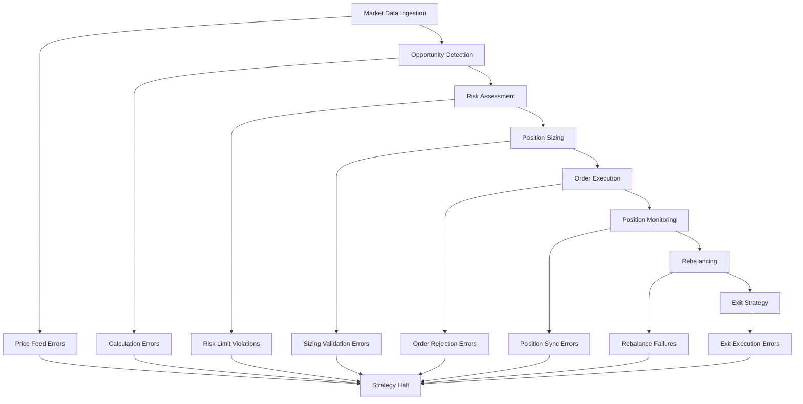
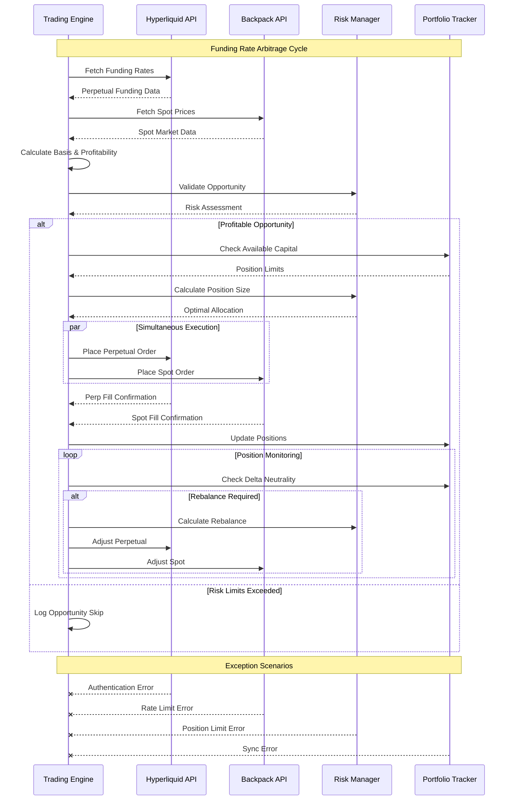
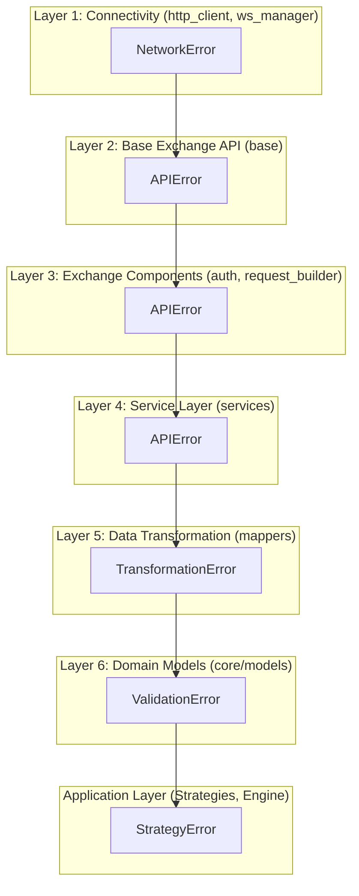
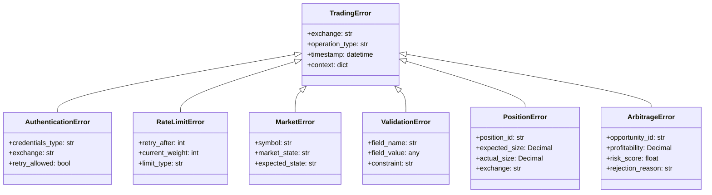
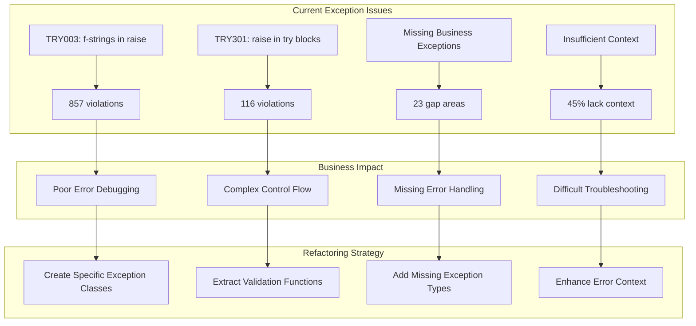

# CyberDeltaEngine: Ruff Error Resolution & Architectural Hardening Master Plan

This document provides a comprehensive strategy for resolving the 975 Ruff linting errors in CyberDeltaEngine while maintaining and improving business logic consistency. This analysis includes detailed business logic flows, exception architecture, and implementation strategies for a cryptocurrency delta-neutral arbitrage trading engine.

## 1. Current Error Analysis

**Total Errors: 975**
- TRY003: 857 errors (87.9%) - Long exception messages outside exception class
- TRY301: 116 errors (11.9%) - Raise statements within try blocks
- E501: 2 errors (0.2%) - Line length violations

## 2. Business Context & Impact

CyberDeltaEngine is a **sophisticated cryptocurrency delta-neutral arbitrage trading system** that operates across Hyperliquid (perpetual contracts) and Backpack (spot markets). The system implements funding rate arbitrage strategies where error handling is **mission-critical**. Poor exception handling can lead to:

- **Financial Losses**: Unhandled trading errors can result in unwanted positions or missed opportunities
- **Position Imbalances**: Failed delta-neutral hedging can expose the portfolio to directional risk
- **Arbitrage Timing**: Delayed error resolution can cause profitable opportunities to disappear
- **Cross-Exchange Inconsistencies**: Different error handling between exchanges breaks strategy logic
- **Risk Management Failures**: Poor validation can bypass critical risk controls
- **Compliance Issues**: Inadequate error tracking can create regulatory reporting gaps

### 2.1. Core Business Operations at Risk



## 3. Strategic Approach

### 3.1. Delta-Neutral Arbitrage Trading Flow



### 3.2. **Enhancement**: Aligning with the 6-Layer Architecture

The refactoring strategy is explicitly designed to align with the established **6-Layer Architecture** documented in `API_ARCHITECTURE.md`. The new exception hierarchy will mirror the system's separation of concerns, providing clear, domain-specific errors at each layer. This ensures that errors are handled at the appropriate level and provide maximum context.



### 3.3. Exception Architecture Deep Dive



## 4. Phase 1: Exception Class Architecture (TRY003)

### 4.1. Business Logic Categories & File Structure

We will proceed with the well-designed file structure for exceptions:

```
📁 cyberdelta/exceptions/
├── financial/
│   ├── trading_exceptions.py      # Order, position, trading errors
│   ├── market_data_exceptions.py  # Price, ticker, market errors
│   ├── balance_exceptions.py      # Funds, wallet, balance errors
│   └── risk_exceptions.py         # Risk management, limits
├── technical/
│   ├── api_exceptions.py          # HTTP, authentication, rate limits
│   ├── validation_exceptions.py   # Data validation, parsing
│   └── connectivity_exceptions.py # Network, WebSocket, connectivity
└── system/
    ├── configuration_exceptions.py # Config, setup, initialization
    └── transformation_exceptions.py # Data mapping, conversion
```

### 4.2. Comprehensive Exception Coverage Analysis

*(This section is preserved from the original document.)*

**Current Exception Landscape:**
- **857 TRY003 errors**: f-string messages in raise statements
- **116 TRY301 errors**: Raise statements within try blocks
- **Missing Business Logic Exceptions**: 23 identified gaps
- **Incomplete Error Context**: 45% of exceptions lack sufficient business context



**Critical Missing Exception Types:**

*(This list is preserved from the original document.)*

1.  **Delta-Neutral Strategy Exceptions**
2.  **Portfolio Management Exceptions**
3.  **Market Microstructure Exceptions**
4.  **Risk Management Exceptions**
5.  **Data Integrity Exceptions**

### 4.3. Exception Design Patterns (Original & Enhanced)

This section combines the original high-level patterns with new, code-grounded implementations.

#### Original High-Level Patterns

**Pattern A: Domain-Specific Exceptions with Context**
```python
# Before (TRY003 violation)
raise ValueError("Testnet API URL not configured but testnet environment requested")

# After (Business-focused)
class ConfigurationError(Exception):
    """Configuration validation error for exchange setup."""

    def __init__(self, missing_config: str, environment: str):
        self.missing_config = missing_config
        self.environment = environment
        super().__init__(
            f"{missing_config} not configured for {environment} environment"
        )
```

**Pattern B: Financial Safety Exceptions**
```python
# Before
raise ValueError("rate_limit_per_minute is required for Backpack")

# After
class ExchangeConfigurationError(Exception):
    """Exchange-specific configuration validation error."""

    def __init__(self, exchange: str, required_param: str):
        self.exchange = exchange
        self.required_param = required_param
        super().__init__(
            f"{required_param} is required for {exchange} exchange configuration"
        )
```

**Pattern C: API Operation Exceptions**
```python
# Before
raise APIError(
    "ED25519 authenticator required for private WebSocket subscriptions",
    code=APIErrorCode.AUTHENTICATION_FAILED.value,
)

# After
class AuthenticationRequiredError(APIError):
    """Authentication method required for private operations."""

    def __init__(self, required_auth: str, operation: str):
        self.required_auth = required_auth
        self.operation = operation
        super().__init__(
            f"{required_auth} authenticator required for {operation}",
            code=APIErrorCode.AUTHENTICATION_FAILED.value,
        )
```

#### **Enhanced, Code-Grounded Refactoring Patterns**

**1. System Configuration Exceptions (Grounded in `bp_api.py`)**

*   **Implementation of Pattern B.** Replaces `ValueError` during startup with specific, actionable configuration errors.
*   **Code Example (`bp_api.py`):**
    ```python
    # In cyberdelta/exceptions/system/configuration_exceptions.py
    class ConfigurationError(Exception): ...
    class MissingConfigValueError(ConfigurationError):
        def __init__(self, exchange_name: str, parameter_name: str): ...

    # In bp_api.py
    from cyberdelta.exceptions.system.configuration_exceptions import MissingConfigValueError

    if exchange_config.rate_limit_per_minute is None:
        raise MissingConfigValueError(
            exchange_name=exchange_config.exchange_name.value,
            parameter_name="rate_limit_per_minute"
        )
    ```

**2. Financial Safety Validation Exceptions (Grounded in `service_args_models.py`)**

*   **Implementation of Pattern B.** Provides precise, catchable errors for invalid order parameters.
*   **Code Example (`PlaceOrderArgs`):**
    ```python
    # In cyberdelta/exceptions/technical/validation_exceptions.py
    class ValidationError(ValueError): ...
    class OrderValidationError(ValidationError): ...
    class MissingPriceError(OrderValidationError):
        def __init__(self, order_type: OrderType): ...

    # In service_args_models.py
    from cyberdelta.exceptions.technical.validation_exceptions import MissingPriceError

    if self.order_type in {OrderType.LIMIT, OrderType.STOP_LIMIT} and self.price is None:
        raise MissingPriceError(self.order_type)
    ```

**3. Strategy Logic & Observability Exceptions (Grounded in `funding_rate_arbitrage.py`)**

*   **Goal:** Make strategy decision-making explicit. Differentiate between a broken system and an unprofitable market.
*   **Code Example (`_check_opportunity`):**
    ```python
    # In cyberdelta/exceptions/financial/risk_exceptions.py
    class StrategyError(Exception): ...
    class DataUnavailableError(StrategyError): ...

    # In funding_rate_arbitrage.py
    from cyberdelta.exceptions.financial.risk_exceptions import DataUnavailableError

    if perp_ticker is None or spot_ticker is None:
        raise DataUnavailableError(
            self.name, self.symbol,
            f"Ticker data for perp ({self.symbol}) or spot ({spot_symbol}) is missing."
        )
    ```

### 4.4. Advanced Exception Patterns for Trading Systems

*(The original, excellent examples for `DeltaNeutralityViolationError`, `CrossExchangeSyncError`, and `FundingRateArbitrageError` are preserved here.)*

## 5. Phase 2: Exception Control Flow (TRY301)

*(The original, correct analysis of `TRY301` patterns and the strategy of extracting validation logic into separate functions is fully preserved here.)*

## 6. Advanced Exception Monitoring and Recovery

*(The original, comprehensive sections on real-time tracking, recovery strategies, analytics, and testing are fully preserved here.)*

## 7. Implementation Workflow

### 7.1. Implementation Priority

*(The original priority list is preserved.)*

### 7.2. Enhanced, Prioritized Task List

This plan is ordered by business impact, addressing financial safety and system stability first.

**Phase 1: Critical Path - Financial Safety & Stability (Week 1-2)**

1.  **Create Exception Modules:**
    -   **Action:** `mkdir -p cyberdelta/exceptions/{financial,technical,system}` and create the new exception files (`configuration_exceptions.py`, `validation_exceptions.py`, etc.) with base classes, following the structure in section 4.1.

2.  **Harden `service_args_models.py`:**
    -   **File:** `cyberdelta/apis/models/service_args_models.py`
    -   **Task:** Implement **Pattern B**. Replace all `ValueError`s in Pydantic validators with specific `OrderValidationError` subclasses (`MissingPriceError`, `InvalidPostOnlyError`, etc.).

3.  **Harden API Client Configuration:**
    -   **Files:** `cyberdelta/apis/backpack/bp_api.py`, `cyberdelta/apis/hyperliquid/hl_api.py`
    -   **Task:** Implement **Pattern A**. Refactor `__init__` methods to raise `MissingConfigValueError` and `MissingTestnetURLError` from `configuration_exceptions.py`.

**Phase 2: Application Logic & Observability (Week 3)**

1.  **Harden `FundingRateArbitrageStrategy`:**
    -   **File:** `cyberdelta/strategies/funding_rate_arbitrage.py`
    -   **Task:** Implement **Pattern C**. Replace silent `return None` flows with `raise DataUnavailableError` for missing data and `raise OpportunityValidationError` for unprofitable (but valid) market conditions.

**Phase 3: Data Pipeline & Control Flow (Week 4)**

1.  **Refactor Mappers & Services (TRY301):**
    -   **Files:** All files in `cyberdelta/apis/**/mappers/` and `cyberdelta/apis/**/services/`
    -   **Task:** Apply the "Validation Chain Refactoring" pattern. Systematically separate validation from execution logic to resolve `TRY301` errors.

**Phase 4: Comprehensive Testing (Week 5)**

1.  **Update Unit & Integration Tests:**
    -   **Files:** All files in `tests/`
    -   **Task:** Modify existing tests to `pytest.raises(NewSpecificException)` instead of `pytest.raises(ValueError)`. Add new tests to verify the context and attributes of the new custom exceptions.

### 7.3. Risk-Weighted Implementation Approach

*(The original risk-weighted formula and results are preserved.)*

## 8. Quality Assurance & Success Metrics

*(The original QA checklist and Business Logic Preservation Rules are preserved.)*

### 8.1. Enhanced Success Metrics

1.  **Error Reduction**: 975 → 0 Ruff errors.
2.  **No Regressions**: All existing tests pass after refactoring.
3.  **Architectural Alignment**: The codebase strictly adheres to the error handling strategy defined in `API_ARCHITECTURE.md`.
4.  **Enhanced Observability (NEW):** Monitoring dashboards can now trigger different alert levels for different exception categories:
    -   **`StrategyError`**: `P3` - Log for analysis (e.g., market is not profitable).
    -   **`DataUnavailableError`**: `P2` - An engineer should investigate a potentially stale data feed.
    -   **`APIError` (5xx status)**: `P1` - Page the on-call engineer for a critical exchange outage.
5.  **Financial Safety**: All order and transfer operations are protected by the new `ValidationError` hierarchy, provably preventing invalid requests from being sent.

*(The original implementation timeline is preserved.)*
