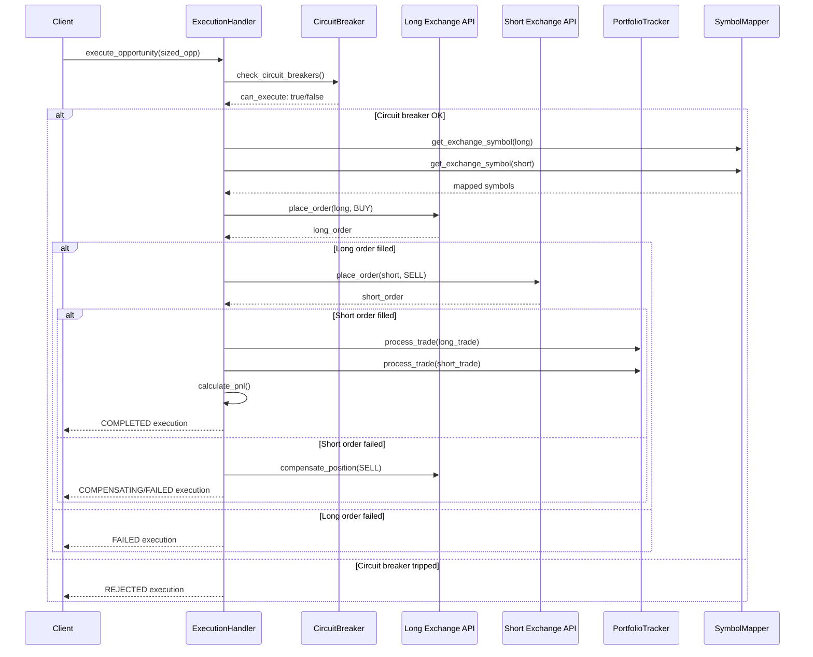
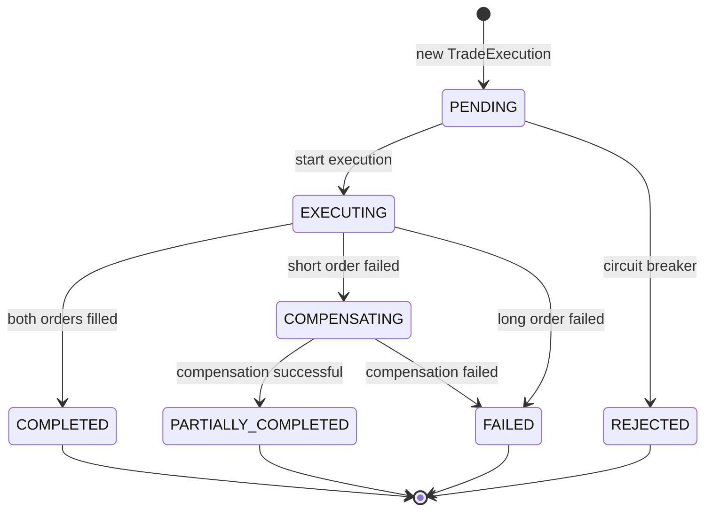
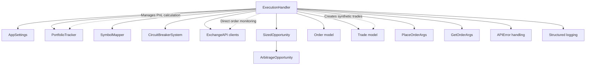

# ExecutionHandler Deep Analysis & Refactor Plan

**Author**: Claude Code (Angel)
**Date**: 2025-07-07
**Purpose**: Comprehensive analysis of ExecutionHandler module for refactoring

## Executive Summary

The `ExecutionHandler` class is a complex monolithic component responsible for executing arbitrage opportunities across multiple exchanges. While functional, it suffers from significant architectural issues including tight coupling, inadequate error handling, security vulnerabilities, and poor separation of concerns.

**Critical Issues Found**: 17 major problems requiring immediate attention
**Refactor Priority**: HIGH - This module is mission-critical for trading operations

## 1. Current Business Logic

### 1.1 Core Responsibilities
The ExecutionHandler orchestrates multi-exchange arbitrage execution with these primary functions:

1. **Order Execution Orchestration**: Manages sequential placement of long/short orders
2. **Circuit Breaker Integration**: Prevents execution during system failures
3. **Retry Logic**: Handles transient API failures with exponential backoff
4. **Compensation Logic**: Attempts to flatten positions when execution fails partially
5. **Portfolio Integration**: Updates portfolio tracker with trade results
6. **Execution Tracking**: Maintains history and state of all executions

### 1.2 Execution Flow

```python
# High-level execution flow
def execute_opportunity(opportunity: SizedOpportunity) -> TradeExecution:
    1. Check circuit breakers for both exchanges
    2. Validate API clients and symbol mappings
    3. Calculate base asset quantities from USD sizes
    4. Place long order (BUY) on first exchange
    5. If long succeeds, place short order (SELL) on second exchange
    6. If short fails, attempt compensation (SELL long position)
    7. Update portfolio tracker with trades
    8. Calculate and record PnL
```

### 1.3 Key Data Structures

- **TradeExecution**: Tracks single execution state and results
- **ExecutionStatus**: Enum for execution lifecycle states
- **SizedOpportunity**: Input containing opportunity + calculated position sizes
- **Order**: Core trading primitive with fill details

## 2. Architecture Flow Diagrams

### 2.1 High-Level Execution Sequence



### 2.2 Internal State Machine



### 2.3 Dependencies & Coupling



## 3. Critical Issues Identified

### 3.1 Architecture & Design Flaws

#### **Issue #1: Monolithic Design - CRITICAL**
**Problem**: Single class handling 8+ distinct responsibilities (2,257 lines)
- Order placement & monitoring
- Circuit breaker integration
- Retry logic & error handling
- Position compensation
- Portfolio updates
- PnL calculation
- Symbol mapping
- Execution state management

**Impact**: Violates Single Responsibility Principle, making testing and maintenance extremely difficult.

#### **Issue #2: Tight Coupling - HIGH**
**Problem**: Direct dependencies on concrete implementations
```python
# Problematic direct coupling
self.portfolio_tracker.process_trade(exchange_id, trade)  # Line 1100
self.symbol_mapper.get_exchange_symbol(...)  # Line 368
```

**Impact**: Makes unit testing impossible without mocking 5+ dependencies.

#### **Issue #3: Missing Abstraction Layers - HIGH**
**Problem**: Business logic mixed with infrastructure concerns
- Direct API client management (Line 235)
- Manual retry logic scattered throughout
- Circuit breaker integration embedded in execution flow

### 3.2 Error Handling Issues

#### **Issue #4: Inconsistent Error Handling - CRITICAL**
**Problem**: Multiple error handling patterns without consistency
```python
# Pattern 1: Return None (Line 1226)
if not client:
    return None

# Pattern 2: Set error message + return (Line 2125)
execution.error_message = f"No API client for {exchange_id}"
return None

# Pattern 3: Raise exception (Line 2184)
raise  # Re-raise current exception
```

**Impact**: Unpredictable error behavior, potential silent failures.

#### **Issue #5: Error Recovery Logic Flaws - HIGH**
**Problem**: Compensation logic has multiple failure modes
- No validation that compensation order actually fills (Line 1603)
- Optimistic return `True` even if order not filled (Line 1625)
- No monitoring of compensation order status

**Impact**: Could leave positions unhedged in failure scenarios.

### 3.3 Security Issues

#### **Issue #6: Information Leakage - MEDIUM**
**Problem**: Sensitive order details logged extensively
```python
logger.info(
    "execution_order_placement_attempt",
    client_order_id=client_order_id,  # Line 2059
    quantity=f"{quantity:.8f}",       # Line 2056
)
```

**Impact**: Trading strategies and position sizes exposed in logs.

#### **Issue #7: Client Order ID Predictability - LOW**
**Problem**: Client order IDs use predictable format
```python
client_order_id = f"cde_{execution.id[:8]}_{exchange_id[:3]}_{str(uuid.uuid4())[:8]}"
```

**Impact**: Potential order correlation by external observers.

### 3.4 Data Validation Issues

#### **Issue #8: Missing Input Validation - HIGH**
**Problem**: No validation of opportunity data before execution
- No checks for stale pricing data
- No validation of position sizes vs account balances
- Missing symbol existence validation

#### **Issue #9: Decimal Precision Issues - MEDIUM**
**Problem**: Potential precision loss in calculations
```python
# Line 588: Division could lose precision
base_asset_quantity_long = sized_opp.long_size / opportunity.long_price
```

**Impact**: Accumulating rounding errors in position sizing.

### 3.5 Race Conditions & Concurrency

#### **Issue #10: Race Conditions in State Management - HIGH**
**Problem**: No synchronization for execution state updates
```python
self.active_executions[execution.id] = execution  # Line 279
# Later modifications not thread-safe
execution.status = ExecutionStatus.EXECUTING      # Line 657
```

**Impact**: Concurrent executions could corrupt state.

#### **Issue #11: No Idempotency Protection - MEDIUM**
**Problem**: No protection against duplicate execution requests
- Same opportunity could be executed multiple times
- No deduplication based on opportunity ID

### 3.6 Performance Issues

#### **Issue #12: Inefficient Order Monitoring - MEDIUM**
**Problem**: Polling-based order status checking
```python
# Line 1881: Blocking polling loop
while time.monotonic() - start_time < timeout_sec:
    order = await self._get_order_status(...)
    await asyncio.sleep(poll_interval_sec)  # Line 1943
```

**Impact**: Unnecessary API calls, delayed failure detection.

#### **Issue #13: Memory Leaks in History - LOW**
**Problem**: Execution history grows unbounded
```python
# Line 1963: Only removes from front, could still grow
if len(self.executions) > self.max_execution_history:
    self.executions.pop(0)
```

### 3.7 Testing & Observability Issues

#### **Issue #14: Poor Testability - CRITICAL**
**Problem**: Massive methods with embedded dependencies
- `execute_opportunity`: 50+ lines with 8 dependencies
- `_place_order_with_retry`: 167 lines of complex logic
- No dependency injection for testing

#### **Issue #15: Inconsistent Logging - MEDIUM**
**Problem**: Log levels and structure inconsistent
- Mixed use of info/warning/error levels
- Some operations not logged (successful compensation)
- Excessive detail in some logs, missing context in others

### 3.8 Configuration Issues

#### **Issue #16: Hardcoded Constants - LOW**
**Problem**: Magic numbers scattered throughout
```python
self.max_execution_history = 100  # Line 242
tolerance_pct = Decimal("0.05")   # Line 1802
timeout_sec: float = 60.0         # Line 1842
```

#### **Issue #17: Missing Configuration Validation - MEDIUM**
**Problem**: No validation of AppSettings during initialization
- Could start with invalid retry counts, timeouts
- No bounds checking on percentages

## 4. Tight Coupling Analysis

### 4.1 Dependency Graph
The ExecutionHandler has **12 direct dependencies**:

1. **AppSettings** - Configuration (acceptable)
2. **PortfolioTracker** - Position updates (tight coupling)
3. **SymbolMapper** - Symbol translation (tight coupling)
4. **CircuitBreakerSystem** - Risk management (acceptable)
5. **ExchangeAPI clients** - Trading execution (tight coupling)
6. **Order/Trade models** - Data structures (acceptable)
7. **APIError** - Error handling (acceptable)
8. **Logger** - Observability (acceptable)
9. **SizedOpportunity** - Input data (acceptable)
10. **PlaceOrderArgs/GetOrderArgs** - API arguments (tight coupling)
11. **Secrets/UUID generation** - Utilities (acceptable)
12. **Time/Datetime** - System utilities (acceptable)

### 4.2 Coupling Issues

**Problematic Couplings**:
- **PortfolioTracker**: Direct method calls for trade processing
- **SymbolMapper**: Direct symbol lookup calls
- **ExchangeAPI**: Direct client management and order placement
- **Order Status Monitoring**: Embedded polling logic

**Impact**: These tight couplings make the class impossible to unit test effectively and violate the Dependency Inversion Principle.

## 5. Security Assessment

### 5.1 Medium Risk Issues
- **Information Leakage**: Order details in logs could reveal trading strategies
- **Predictable Order IDs**: May allow external correlation of orders

### 5.2 Low Risk Issues
- **Error Message Details**: API errors could reveal internal system structure

### 5.3 Recommendations
1. Implement log sanitization for sensitive trading data
2. Use cryptographically random order ID generation
3. Add rate limiting for order placement attempts
4. Implement audit logging for all trading operations

## 6. Validation Issues

### 6.1 Missing Validations
- **Input Sanitization**: No validation of SizedOpportunity data
- **Business Rule Validation**: No checks for minimum position sizes
- **Account Balance Validation**: No pre-execution balance checks
- **Symbol Validation**: No verification symbols exist on target exchanges

### 6.2 Data Integrity Issues
- **Precision Loss**: Decimal division without rounding control
- **State Consistency**: No validation that execution state transitions are valid
- **Timestamp Validation**: No checks for stale opportunity data

## 7. Refactor Recommendations

### 7.1 Immediate Actions (Critical)

1. **Extract Order Management Service**
   ```python
   class OrderManagementService:
       async def place_order_with_retry(...)
       async def monitor_order_status(...)
       async def cancel_order(...)
   ```

2. **Extract Execution Orchestrator**
   ```python
   class ExecutionOrchestrator:
       async def execute_arbitrage(...)
       async def handle_execution_failure(...)
   ```

3. **Create Compensation Service**
   ```python
   class CompensationService:
       async def compensate_failed_execution(...)
       async def monitor_compensation_order(...)
   ```

### 7.2 Medium-Term Improvements

1. **Event-Driven Architecture**: Replace direct coupling with event publishing
2. **Circuit Breaker Integration**: Extract circuit breaker logic to decorators
3. **State Machine Implementation**: Formal state machine for execution status
4. **Comprehensive Error Handling**: Consistent error handling strategy

### 7.3 Long-Term Strategic Changes

1. **Command Query Responsibility Segregation (CQRS)**: Separate read/write operations
2. **Saga Pattern**: For complex multi-step transactions
3. **WebSocket Integration**: Replace polling with real-time order updates
4. **Metrics & Monitoring**: Comprehensive execution metrics

## 8. Testing Strategy

### 8.1 Current State
- **Testability**: POOR - Monolithic design prevents effective unit testing
- **Coverage**: Unknown - No visible test files for this module
- **Mocking Complexity**: HIGH - Requires mocking 8+ dependencies

### 8.2 Recommended Testing Approach

1. **Unit Tests**: After refactoring into smaller components
2. **Integration Tests**: Test complete execution flows with test exchanges
3. **Contract Tests**: Verify API client interfaces remain compatible
4. **Property-Based Tests**: Test execution invariants (position balance, PnL calculations)

## 9. Migration Plan

### Phase 1: Immediate Stabilization (1-2 weeks)
- [ ] Extract configuration validation
- [ ] Implement consistent error handling
- [ ] Add input validation for all public methods
- [ ] Fix race conditions in state management

### Phase 2: Service Extraction (2-3 weeks)
- [ ] Extract OrderManagementService
- [ ] Extract CompensationService
- [ ] Implement dependency injection
- [ ] Add comprehensive unit tests

### Phase 3: Architecture Improvements (3-4 weeks)
- [ ] Implement event-driven communication
- [ ] Add formal state machine
- [ ] Integrate WebSocket order monitoring
- [ ] Implement CQRS pattern

### Phase 4: Production Hardening (2 weeks)
- [ ] Performance optimization
- [ ] Security hardening
- [ ] Comprehensive monitoring
- [ ] Load testing

## Conclusion

The ExecutionHandler requires **immediate refactoring** due to its monolithic design, tight coupling, and numerous reliability issues. The current implementation poses significant risks to trading operations including:

- **Execution Failures**: Poor error handling could result in unhedged positions
- **Testing Difficulties**: Monolithic design prevents adequate test coverage
- **Maintenance Burden**: Complex codebase difficult to modify safely
- **Performance Issues**: Inefficient order monitoring and state management

**Recommended Priority**: **CRITICAL** - Begin refactoring immediately before adding new features.

**Estimated Effort**: 8-10 weeks for complete refactor with proper testing and validation.

---

*This analysis was conducted using defensive security principles, focusing on robustness, correctness, and maintainability of the trading engine.*
